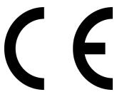
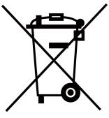
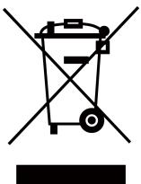

# **Network Indoor ^ƚĂƟŽn**

**Quick Start Guide**

# **Legal /nĨŽƌmĂƟŽn**

## **Quick Start Guide**

©2019 Hangzhou Hikvision Digital Technology Co., Ltd.

## **About this Manual**

This Manual is subject to ĚŽmĞƐƟc and ŝnƚĞƌnĂƟŽnĂů copyright ƉƌŽƚĞcƟŽn͘ Hangzhou Hikvision Digital Technology Co., Ltd. ("Hikvision") reserves all rights to this manual. This manual cannot be reproduced, changed, translated, or distributed, ƉĂƌƟĂůůy or wholly, by any means, without the prior wƌŝƩĞn permission of Hikvision.

Please use this user manual under the guidance of professionals.

## **Trademarks**

 and other Hikvision marks are the property of Hikvision and are registered trademarks or the subject of ĂƉƉůŝcĂƟŽnƐ for the same by Hikvision and/or its ĂĸůŝĂƚĞƐ͘ Other trademarks mĞnƟŽnĞĚ in this manual are the ƉƌŽƉĞƌƟĞƐ of their ƌĞƐƉĞcƟvĞ owners. No right of license is given to use such trademarks without express permission.

## **Disclaimer**

TO THE MAXIMUM EXTENT PERMITTED BY APPLICABLE LAW, HIKVISION MAKES NO WARRANTIES, EXPRESS OR IMPLIED, INCLUDING WITHOUT LIMITATION THE IMPLIED WARRANTIES OF MERCHANTABILITY AND FITNESS FOR A PARTICULAR PURPOSE, REGARDING THIS MANUAL. HIKVISION DOES NOT WARRANT, GUARANTEE, OR MAKE ANY REPRESENTATIONS REGARDING THE USE OF THE MANUAL, OR THE CORRECTNESS, ACCURACY, OR RELIABILITY OF INFORMATION CONTAINED HEREIN. YOUR USE OF THIS MANUAL AND ANY RELIANCE ON THIS MANUAL SHALL BE WHOLLY AT YOUR OWN RISK AND RESPONSIBILITY.

REGARDING TO THE PRODUCT WITH INTERNET ACCESS, THE USE OF PRODUCT SHALL BE WHOLLY AT YOUR OWN RISKS. HIKVISION SHALL NOT TAKE ANY RESPONSIBILITIES FOR ABNORMAL OPERATION, PRIVACY LEAKAGE OR OTHER DAMAGES RESULTING FROM CYBER ATTACK, HACKER ATTACK, VIRUS INSPECTION, OR OTHER INTERNET SECURITY RISKS; HOWEVER, HIKVISION WILL PROVIDE TIMELY TECHNICAL SUPPORT IF REQUIRED.

SURVEILLANCE LAWS VARY BY JURISDICTION. PLEASE CHECK ALL RELEVANT LAWS IN YOUR JURISDICTION BEFORE USING THIS PRODUCT IN ORDER TO ENSURE THAT YOUR USE CONFORMS THE APPLICABLE LAW. HIKVISION SHALL NOT BE LIABLE IN THE EVENT THAT THIS PRODUCT IS USED WITH ILLEGITIMATE PURPOSES.

IN THE EVENT OF ANY CONFLICTS BETWEEN THIS MANUAL AND THE APPLICABLE LAW, THE LATER PREVAILS.

# **Regulatory /nĨŽƌmĂƟŽn**

## **FCC /nĨŽƌmĂƟŽn**

Please take ĂƩĞnƟŽn that changes or mŽĚŝĮcĂƟŽn not expressly approved by the party responsible for compliance could void the user's authority to operate the equipment.

FCC compliance: This equipment has been tested and found to comply with the limits for a Class B digital device, pursuant to part 15 of the FCC Rules. These limits are designed to provide reasonable ƉƌŽƚĞcƟŽn against harmful interference in a ƌĞƐŝĚĞnƟĂů ŝnƐƚĂůůĂƟŽn͘ This equipment generates, uses and can radiate radio frequency energy and, if not installed and used in accordance with the ŝnƐƚƌƵcƟŽnƐ͕ may cause harmful interference to radio cŽmmƵnŝcĂƟŽnƐ͘ However, there is no guarantee that interference will not occur in a ƉĂƌƟcƵůĂƌ ŝnƐƚĂůůĂƟŽn͘ If this equipment does cause harmful interference to radio or television ƌĞcĞƉƟŽn͕ which can be determined by turning the equipment Žī and on, the user is encouraged to try to correct the interference by one or more of the following measures:

—Reorient or relocate the receiving antenna.

—Increase the ƐĞƉĂƌĂƟŽn between the equipment and receiver.

—Connect the equipment into an outlet on a circuit ĚŝīĞƌĞnƚ from that to which the receiver is connected.

—Consult the dealer or an experienced radio/TV technician for help

This equipment should be installed and operated with a minimum distance 20cm between the radiator and your body.

## FCC ŽnĚŝƟŽnƐ

This device complies with part 15 of the FCC Rules. KƉĞƌĂƟŽn is subject to the following two cŽnĚŝƟŽnƐ͗

1. This device may not cause harmful interference.

2. This device must accept any interference received, including interference that may cause undesired ŽƉĞƌĂƟŽn͘

## **EU Conformity Statement**

This product and - if applicable - the supplied accessories too are marked with "CE" and comply therefore with the applicable harmonized European standards listed under the EMC ŝƌĞcƟvĞ 2014/30/EU, RE ŝƌĞcƟvĞ 2014/53/EU,the RoHS ŝƌĞcƟvĞ 2011/ 65/EU

2012/19/EU (WEEE ĚŝƌĞcƟvĞ)͗ Products marked with this symbol cannot be disposed of as unsorted municipal waste in the European Union. For proper recycling, return this product to your local supplier upon the purchase of equivalent new equipment, or dispose of it at designated cŽůůĞcƟŽn points. For more ŝnĨŽƌmĂƟŽn see: www.recyclethis.info

2006/66/EC (bĂƩĞƌy ĚŝƌĞcƟvĞ)͗ This product contains a bĂƩĞƌy that cannot be disposed of as unsorted municipal waste in the European Union. See the product ĚŽcƵmĞnƚĂƟŽn for ƐƉĞcŝĮc bĂƩĞƌy ŝnĨŽƌmĂƟŽn͘ The bĂƩĞƌy is marked with this symbol, which may include ůĞƩĞƌŝnŐ to indicate cadmium (Cd), lead (Pb), or mercury (Hg). For proper recycling, return the bĂƩĞƌy to your supplier or to a designated cŽůůĞcƟŽn point. For more ŝnĨŽƌmĂƟŽn see:www.recyclethis.info

## **Industry Canada ICES-003 Compliance**

This device meets the CAN ICES-3 (B)/NMB-3(B) standards requirements.

This device complies with Industry Canada licence-exempt RSS standard(s). KƉĞƌĂƟŽn is subject to the following two cŽnĚŝƟŽnƐ͗

- 1. this device may not cause interference, and
- 2. this device must accept any interference, including interference that may cause undesired ŽƉĞƌĂƟŽn of the device.

Le présent appareil est conforme aux CNR d'Industrie Canada applicables aux appareils radioexempts de licence. >ΖĞxƉůŽŝƚĂƟŽn est autorisée aux deux cŽnĚŝƟŽnƐ suivantes :

- 1. l'appareil ne doit pas produire de brouillage, et
- 2. ůΖƵƟůŝƐĂƚĞƵƌ de l'appareil doit accepter tout brouillage radioélectrique subi, même si le brouillage est ƐƵƐcĞƉƟbůĞ d'en cŽmƉƌŽmĞƩƌĞ le ĨŽncƟŽnnĞmĞnƚ͘

Under Industry Canada ƌĞŐƵůĂƟŽnƐ͕ this radio ƚƌĂnƐmŝƩĞƌ may only operate using an antenna of a type and maximum (or lesser) gain approved for the ƚƌĂnƐmŝƩĞƌ by Industry Canada. To reduce ƉŽƚĞnƟĂů radio interference to other users, the antenna type and its gain should be so chosen that the equivalent isotropically radiated power (e.i.r.p.) is not more than that necessary for successful cŽmmƵnŝcĂƟŽn͘

Conformément à la ƌĠŐůĞmĞnƚĂƟŽn d'Industrie Canada, le présent ĠmĞƩĞƵƌ radio peut ĨŽncƟŽnnĞƌ avec une antenne d'un type et d'un gain maximal (ou inférieur) approuvé pour ůΖĠmĞƩĞƵƌ par Industrie Canada. Dans le but de réduire les risques de brouillage radioélectrique à ůΖŝnƚĞnƟŽn des autres ƵƟůŝƐĂƚĞƵƌƐ͕ il faut choisir le type d'antenne et son gain de sorte que la puissance isotrope rayonnée équivalente (p.i.r.e.) ne dépasse pas l'intensité nécessaire à l'établissement d'une cŽmmƵnŝcĂƟŽn ƐĂƟƐĨĂŝƐĂnƚĞ͘

This equipment should be installed and operated with a minimum distance 20cm between the radiator and your body.

Cet équipement doit être installé et ƵƟůŝƐĠ à une distance minimale de 20 cm entre le radiateur et votre corps.

# **Symbol ŽnǀĞnƟŽnƐ**

The symbols that may be found in this document are ĚĞĮnĞĚ as follows.

| Symbol | ĞƐĐƌŝƉƟŽn                                                                                                                                                          |
|--------|--------------------------------------------------------------------------------------------------------------------------------------------------------------------|
| Danger | Indicates a hazardous ƐŝƚƵĂƟŽn which, if not avoided, will or could result in death or serious injury.                                                          |
| ĂƵƟŽn  | Indicates a ƉŽƚĞnƟĂůůy hazardous ƐŝƚƵĂƟŽn which, if not avoided, could result in equipment damage, data loss, performance ĚĞŐƌĂĚĂƟŽn͕ or unexpected results. |
| Note   | Provides ĂĚĚŝƟŽnĂů ŝnĨŽƌmĂƟŽn to emphasize or supplement important points of the main text.                                                                  |

# **Safety /nƐƚƌƵĐƟŽn**

## **Warning**

- The working temperature of the device is from -10 ºC to 55 ºC.
- All the electronic ŽƉĞƌĂƟŽn should be strictly compliance with the electrical safety ƌĞŐƵůĂƟŽnƐ͕ ĮƌĞ ƉƌĞvĞnƟŽn ƌĞŐƵůĂƟŽnƐ and other related ƌĞŐƵůĂƟŽnƐ in your local region.
- Please use the power adapter, which is provided by normal company. The power cŽnƐƵmƉƟŽn cannot be less than the required value.
- Do not connect several devices to one power adapter as adapter overload may cause over-heat or ĮƌĞ hazard.
- Please make sure that the power has been disconnected before you wire, install or dismantle the device.
- When the product is installed on wall or ceiling, the device shall be Įƌmůy ĮxĞĚ͘
- If smoke, odors or noise rise from the device, turn Žī the power at once and unplug the power cable, and then please contact the service center.
- If the product does not work properly, please contact your dealer or the nearest service center. Never ĂƩĞmƉƚ to disassemble the device yourself. (We shall not assume any responsibility for problems caused by unauthorized repair or maintenance.)

## **ĂƵƟŽn**

- Do not drop the device or subject it to physical shock, and do not expose it to high ĞůĞcƚƌŽmĂŐnĞƟƐm ƌĂĚŝĂƟŽn͘ Avoid the equipment ŝnƐƚĂůůĂƟŽn on vŝbƌĂƟŽnƐ surface or places subject to shock (ignorance can cause equipment damage).
- Do not place the device in extremely hot (refer to the ƐƉĞcŝĮcĂƟŽn of the device for the detailed ŽƉĞƌĂƟnŐ temperature), cold, dusty or damp ůŽcĂƟŽnƐ͕ and do not expose it to high ĞůĞcƚƌŽmĂŐnĞƟc ƌĂĚŝĂƟŽn͘
- The device cover for indoor use shall be kept from rain and moisture.
- Exposing the equipment to direct sun light, low vĞnƟůĂƟŽn or heat source such as heater or radiator is forbidden (ignorance can cause ĮƌĞ danger).
- Do not aim the device at the sun or extra bright places. A blooming or smear may occur otherwise (which is not a mĂůĨƵncƟŽn however), and ĂīĞcƟnŐ the endurance of sensor at the same ƟmĞ͘
- Please use the provided glove when open up the device cover, avoid direct contact with the device cover, because the acidic sweat of the ĮnŐĞƌƐ may erode the surface cŽĂƟnŐ of the device cover.
- Please use a ƐŽŌ and dry cloth when clean inside and outside surfaces of the device cover, do not use alkaline detergents.
- Please keep all wrappers ĂŌĞƌ unpack them for future use. In case of any failure occurred, you need to return the device to the factory with the original wrapper. dƌĂnƐƉŽƌƚĂƟŽn without the original wrapper may result in damage on the device and lead to ĂĚĚŝƟŽnĂů costs.
- Improper use or replacement of the bĂƩĞƌy may result in hazard of explosion. Replace with the same or equivalent type only. Dispose of used bĂƩĞƌŝĞƐ according to the ŝnƐƚƌƵcƟŽnƐ provided by the bĂƩĞƌy manufacturer.
- Input voltage should meet both the SELV and the Limited Power Source according to 60950-1 standard.
- The power supply must conform to LPS. The recommended adaptor models and manufacturers are shown as below. Use the ĂƩĂcŚĞĚ adapter, and do not change the adaptor randomly.

| Model               | Manufacturer                                   | Standard |
|---------------------|------------------------------------------------|----------|
| ADS-24S-12 1224GPCN | SHENZHEN HONOR ELECTRONIC CO.,LTD           | CEE      |
| G0549-240-050       | SHENZHEN GOSPELL DIGITAL TECHNOLOGY CO.,LTD | CEE      |
| TS-A018-120015Ec    | SHENZHEN TRANSIN TECHNOLOGIES CO., LTD      | CEE      |

| 1 'ĞƫnŐ Started  1          |  |
|-----------------------------|--|
| 1.1 cƟvĂƚĞ Indoor ^ƚĂƟŽn  1 |  |
| 1.2 Quick KƉĞƌĂƟŽn  1       |  |

# **1 'ĞƫnŐ Started**

## **1.1 ĐƟǀĂƚĞ Indoor ^ƚĂƟŽn**

You can only cŽnĮŐƵƌĞ and operate the indoor ƐƚĂƟŽn ĂŌĞƌ cƌĞĂƟnŐ a password for the device ĂcƟvĂƟŽn͘

## **Steps**

- **1.** Power on the device. It will enter the ĂcƟvĂƟŽn page ĂƵƚŽmĂƟcĂůůy͘
- **2.** Create a password and cŽnĮƌm it.
- **3.** Tap **OK** to ĂcƟvĂƚĞ the indoor ƐƚĂƟŽn͘

## **Note**

We highly recommend you to create a strong password of your own choosing (using a minimum of 8 characters, including at least three kinds of following categories: upper case ůĞƩĞƌƐ͕ lower case ůĞƩĞƌƐ͕ numbers, and special characters) in order to increase the security of your product. And we recommend you reset your password regularly, especially in the high security system, ƌĞƐĞƫnŐ the password monthly or weekly can bĞƩĞƌ protect your product.

## **1.2 Quick KƉĞƌĂƟŽn**

ŌĞƌ device ĂcƟvĂƟŽn͕ the wizard page will pop up.

## **Steps**

- **1.** Choose Language and tap **Next**.
- **2.** Set network parameters and tap **Next**
	- **-** Edit **Local IP**, **Subnet Mask** and **Gateway** parameters.
	- **-** Enable **DHCP**, the device will get network parameters ĂƵƚŽmĂƟcĂůůy͘

#### Network Indoor ^ƚĂƟŽn Quick Start Guide

|             | Wizard-Network 2/4 |      |               |
|-------------|--------------------|------|---------------|
| DHCP        |                    |      |               |
| Local IP    |                    |      | 10.6 112.253  |
| Subnet Mask |                    |      | 255 255 255.0 |
| Gateway     |                    |      | 10.6 112.254  |
|             |                    |      |               |
|             | Previous           | Next | 5kip          |

**Figure 1-3 Network Parameters**

- **3.** ŽnĮŐƵƌĞ the indoor ƐƚĂƟŽn͘
	- 1) Choose **Indoor ^ƚĂƟŽn Type**.
	- 2) Edit **Floor** and **Room No.**
	- 3) Tap **Next**.

| Indoor Station Type ED | Indoor Station | >  |
|---------------------------|----------------|----|
|                           |                |    |
| Floor                     |                | -1 |
| Room No.                  |                |    |
|                           |                |    |
|                           |                |    |
|                           |                |    |
|                           |                |    |

#### **Figure 1-4 Indoor ^ƚĂƟŽn ^ĞƫnŐƐ**

- **4.** Linked related devices and tap **Next**. If the device and the indoor ƐƚĂƟŽn are in the same LAN, the device will be displayed in the list. Tap the device or enter the serial No. to link.
#### Network Indoor ^ƚĂƟŽn Quick Start Guide

|                             | Wizard-Related Devices 4/4 |        |     |
|-----------------------------|----------------------------|--------|-----|
| Please enter the serial No. |                            |        | ್ನರ |
| No device found.            |                            |        |     |
|                             |                            |        |     |
|                             |                            |        |     |
|                             |                            |        |     |
|                             |                            |        |     |
|                             | Previous                   | Finish |     |

**Figure 1-5 Related Device**

- 1) Tap the door ƐƚĂƟŽn in the list to link.
### **Note**

If the door ƐƚĂƟŽn is ŝnĂcƟvĞ͕ the system will pop up the dialog to ĂcƟvĂƚĞ the door ƐƚĂƟŽn͘

- 2) Tap to pop up the Network ^ĞƫnŐƐ page.
- 3) Edit the network parameters of the door ƐƚĂƟŽn manually or enable **DHCP** to get the network parameters ĂƵƚŽmĂƟcĂůůy͘
- 4) **KƉƟŽnĂů͗** Enable **Synchronize Language** to synchronize the ƟmĞ of door ƐƚĂƟŽn with indoor ƐƚĂƟŽn͘
- 5) Tap **OK** to save the ƐĞƫnŐƐ͘
- **5.** Tap **Finish** to save the ƐĞƫnŐƐ͘

