# **Network Video Recorder**

**User Manual**

UD02027B

#### **User Manual**

COPYRIGHT ©2016 Hangzhou Hikvision Digital Technology Co., Ltd.

#### **ALL RIGHTS RESERVED.**

Any and all information, including, among others, wordings, pictures, graphs are the properties of Hangzhou Hikvision Digital Technology Co., Ltd. or its subsidiaries (hereinafter referred to be "Hikvision"). This user manual (hereinafter referred to be "the Manual") cannot be reproduced, changed, translated, or distributed, partially or wholly, by any means, without the prior written permission of Hikvision. Unless otherwise stipulated, Hikvision does not make any warranties, guarantees or representations, express or implied, regarding to the Manual.

#### **About this Manual**

This Manual is applicable to Network Video Recorder (NVR).

The Manual includes instructions for using and managing the product. Pictures, charts, images and all other information hereinafter are for description and explanation only. The information contained in the Manual is subject to change, without notice, due to firmware updates or other reasons. Please find the latest version in the company website (http://overseas.hikvision.com/en/).

Please use this user manual under the guidance of professionals.

#### **Trademarks Acknowledgement**

and other Hikvision's trademarks and logos are the properties of Hikvision in various jurisdictions. Other trademarks and logos mentioned below are the properties of their respective owners.

#### **Legal Disclaimer**

TO THE MAXIMUM EXTENT PERMITTED BY APPLICABLE LAW, THE PRODUCT DESCRIBED, WITH ITS HARDWARE, SOFTWARE AND FIRMWARE, IS PROVIDED "AS IS", WITH ALL FAULTS AND ERRORS, AND HIKVISION MAKES NO WARRANTIES, EXPRESS OR IMPLIED, INCLUDING WITHOUT LIMITATION, MERCHANTABILITY, SATISFACTORY QUALITY, FITNESS FOR A PARTICULAR PURPOSE, AND NON-INFRINGEMENT OF THIRD PARTY. IN NO EVENT WILL HIKVISION, ITS DIRECTORS, OFFICERS, EMPLOYEES, OR AGENTS BE LIABLE TO YOU FOR ANY SPECIAL, CONSEQUENTIAL, INCIDENTAL, OR INDIRECT DAMAGES, INCLUDING, AMONG OTHERS, DAMAGES FOR LOSS OF BUSINESS PROFITS, BUSINESS INTERRUPTION, OR LOSS OF DATA OR DOCUMENTATION, IN CONNECTION WITH THE USE OF THIS PRODUCT, EVEN IF HIKVISION HAS BEEN ADVISED OF THE POSSIBILITY OF SUCH DAMAGES.

REGARDING TO THE PRODUCT WITH INTERNET ACCESS, THE USE OF PRODUCT SHALL BE WHOLLY AT YOUR OWN RISKS. HIKVISION SHALL NOT TAKE ANY RESPONSIBILITES FOR ABNORMAL OPERATION, PRIVACY LEAKAGE OR OTHER DAMAGES RESULTING FROM CYBER ATTACK, HACKER ATTACK, VIRUS INSPECTION, OR OTHER INTERNET SECURITY RISKS; HOWEVER, HIKVISION WILL PROVIDE TIMELY TECHNICAL SUPPORT IF REQUIRED.

SURVEILLANCE LAWS VARY BY JURISDICTION. PLEASE CHECK ALL RELEVANT LAWS IN YOUR JURISDICTION BEFORE USING THIS PRODUCT IN ORDER TO ENSURE THAT YOUR USE CONFORMS THE APPLICABLE LAW. HIKVISION SHALL NOT BE LIABLE IN THE EVENT THAT THIS PRODUCT IS USED WITH ILLEGITIMATE PURPOSES.

IN THE EVENT OF ANY CONFLICTS BETWEEN THIS MANUAL AND THE APPLICABLE LAW, THE LATER PREVAILS.

### **Regulatory Information**

### **FCC Information**

Please take attention that changes or modification not expressly approved by the party responsible for compliance could void the user's authority to operate the equipment.

**FCC compliance:** This equipment has been tested and found to comply with the limits for a Class A digital device, pursuant to part 15 of the FCC Rules. These limits are designed to provide reasonable protection against harmful interference when the equipment is operated in a commercial environment. This equipment generates, uses, and can radiate radio frequency energy and, if not installed and used in accordance with the instruction manual, may cause harmful interference to radio communications. Operation of this equipment in a residential area is likely to cause harmful interference in which case the user will be required to correct the interference at his own expense.

#### **FCC Conditions**

This device complies with part 15 of the FCC Rules. Operation is subject to the following two conditions:

1. This device may not cause harmful interference.

2. This device must accept any interference received, including interference that may cause undesired operation.

#### **EU Conformity Statement**


This product and - if applicable - the supplied accessories too are marked with "CE" and comply therefore with the applicable harmonized European standards listed under the EMC Directive 2014/30/EU, the LVD Directive 2014/35/EU, the RoHS Directive 2011/65/EU.


2012/19/EU (WEEE directive): Products marked with this symbol cannot be disposed of as unsorted municipal waste in the European Union. For proper recycling, return this product to your local supplier upon the purchase of equivalent new equipment, or dispose of it at designated collection

points. For more information see: www.recyclethis.info

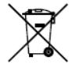

2006/66/EC (battery directive): This product contains a battery that cannot be disposed of as unsorted municipal waste in the European Union. See the product documentation for specific battery

information. The battery is marked with this symbol, which may include lettering to indicate cadmium (Cd), lead (Pb), or mercury (Hg). For proper recycling, return the battery to your supplier or to a designated collection point. For more information see: www.recyclethis.info

#### **Industry Canada ICES-003 Compliance**

This device meets the CAN ICES-3 (A)/NMB-3(A) standards requirements.

### **Safety Instruction**

These instructions are intended to ensure that user can use the product correctly to avoid danger or property loss.

The precaution measure is divided into "Warnings" and "Cautions"

**Warnings:** Serious injury or death may occur if any of the warnings are neglected.

**Cautions:** Injury or equipment damage may occur if any of the cautions are neglected.

| Warnings<br>Follow            | these | Cautions                     | Follow | these   |
|-------------------------------|-------|------------------------------|--------|---------|
| safeguards to prevent serious |       | precautions                  | to     | prevent |
| injury or death.              |       | potential injury or material |        |         |
|                               |       | damage.                      |        |         |


- Proper configuration of all passwords and other security settings is the responsibility of the installer and/or end-user.
- In the use of the product, you must be in strict compliance with the electrical safety regulations of the nation and region. Please refer to technical specifications for detailed information.
- Input voltage should meet both the SELV (Safety Extra Low Voltage) and the Limited Power Source with 100~240 VAC or 12 VDC according to the IEC60950-1 standard. Please refer to technical specifications for detailed information.
- Do not connect several devices to one power adapter as adapter overload may cause over-heating or a fire hazard.
- Please make sure that the plug is firmly connected to the power socket.
- If smoke, odor or noise rise from the device, turn off the power at once and unplug the power cable, and then please contact the service center.

### **Preventive and Cautionary Tips**

Before connecting and operating your device, please be advised of the following tips:

- **•** Ensure unit is installed in a well-ventilated, dust-free environment.
- **•** Unit is designed for indoor use only.
- **•** Keep all liquids away from the device.
- **•** Ensure environmental conditions meet factory specifications.
- **•** Ensure unit is properly secured to a rack or shelf. Major shocks or jolts to the unit as a result of dropping it may cause damage to the sensitive electronics within the unit.
- **•** Use the device in conjunction with an UPS if possible.
- **•** Power down the unit before connecting and disconnecting accessories and peripherals.
- **•** A factory recommended HDD should be used for this device.
- **•** Improper use or replacement of the battery may result in hazard of explosion. Replace with the same or equivalent type only. Dispose of used batteries according to the instructions provided by the battery manufacturer.

Thank you for purchasing our product. If there is any question or request, please do not hesitate to contact dealer. The figures in the manual are for reference only.

This manual is applicable to the models listed in the following table.

| Series         | Model          |
|----------------|----------------|
|                | DS-96128NI-I16 |
| DS-96000NI-I16 | DS-96256NI-I16 |
| DS-96000NI-I24 | DS-96128NI-I24 |
|                | DS-96256NI-I24 |

## **Product Key Features**

#### **General**

- Connectable to network cameras, network dome and encoders.
- Connectable to the third-party network cameras like ACTI, Arecont, AXIS, Bosch, Brickcom, Canon, PANASONIC, Pelco, SAMSUNG, SANYO, SONY, Vivotek and ZAVIO, and cameras that adopt ONVIF or PSIA protocol.
- Connectable to the smart IP cameras.
- H.265, H.264, SVAC, MPEG4, and MJPEG video formats
- PAL/NTSC adaptive video inputs.
- Each channel supports dual-stream.
- Up to 128/256 network cameras can be added according to different models.
- Independent configuration for each channel, including resolution, frame rate, bit rate, image quality, etc.
- The quality of the input and output record is configurable.

#### **Local Monitoring**

- HDMI 1, HDMI 2, and VGA outputs are provided.
- HDMI 2 video output at up to 4K resolution.
- Multiple screen display in live view is supported, and the display sequence of channels is adjustable.
- Live view screen can be switched in group. Manual switch and auto-switch are provided and the auto-switch interval is configurable.
- Quick setting menu is provided for live view.
- Motion detection, video tampering, video exception alert and video loss alert functions.
- Privacy mask.
- Multiple PTZ protocols supported; PTZ preset, patrol and pattern.
- Zooming in by clicking the mouse and PTZ tracing by dragging mouse.

#### **HDD Management**

- Up to 16 SATA hard disks and 1 eSATA disk can be connected for DS-96000NI-I16 series NVR. Up to 24 SATA hard disks and 1 eSATA disk can be connected for DS-96000NI-I24 series NVR.
- Up to 8TB storage capacity for each disk supported.
- Supports 8 network disks (NAS/IP SAN disk).
- Supports S.M.A.R.T. and bad sector detection.
- HDD group management.
- Supports HDD standby function.
- HDD property: redundancy, read-only, read/write (R/W).
- HDD quota management; different capacity can be assigned to different channel.
- RAID0, RAID1, RAID5, RAID 6, and RAID10 are supported.

Hot-swappable RAID storage scheme, and can be enabled and disabled on your demand. And 16/24 arrays can be configured.

- Supports disk clone to the eSATA disk.
#### **Recording, Capture and Playback**

- Holiday recording schedule configuration.
- Continuous and event video recording parameters.
- Multiple recording types: manual, continuous, alarm, motion, motion | alarm, motion & alarm and VCA.
- 8 recording time periods with separated recording types.
- Pre-record and post-record for alarm, motion detection for recording, and pre-record time for schedule

and manual recording.

- Searching video files by events (alarm input/motion detection).
- Tag adding for record files, searching and playing back by tags.
- Locking and unlocking record files.
- Local redundant recording.
- Provide new playback interface with easy and flexible operation.
- Searching and playing back video files by channel number, recording type, start time, end time, etc.
- Smart search for the selected area in the video.
- Zooming in when playback.
- Reverse playback of multi-channel.
- Supports pause, play reverse, speed up, speed down, skip forward, and skip backward when playback, and locating by dragging the mouse.
- Supports thumbnails view and fast view during playback.
- Up to 20-ch synchronous playback at 1080p real time.
- Manual capture and playback of captured pictures.
- Supports enabling H.264+ to ensure high video quality with lowered bitrate.

#### **Backup**

- Export video data by USB, SATA or eSATA device.
- Export video clips when playback.
- Management and maintenance of backup devices.
- Either Normal or Hot Spare working mode is configurable to constitute an N+1 hot spare system.

#### **Alarm and Exception**

- Configurable arming time of alarm input/output.
- Alarm for video loss, motion detection, tampering, abnormal signal, video input/output standard mismatch, illegal login, network disconnected, IP confliction, abnormal record/capture, HDD error, and HDD full, etc.
- VCA detection alarm is supported.
- VCA search for face detection, vehicle plate, behavior analysis, people counting and heat map.
- Alarm triggers full screen monitoring, audio alarm, notifying surveillance center, sending email and alarm output.
- Automatic restore when system is abnormal.

#### **Other Local Functions**

- Operable by front panel, mouse, or keyboard.
- Three-level user management; admin user is allowed to create many operating accounts and define their operating permission, which includes the limit to access any channel.
- Operation, alarm, exceptions and log recording and searching.
- Manually triggering and clearing alarms.
- Import and export of device configuration information.

#### **Network Functions**

- Four self-adaptive 10M/100M/1000M network interfaces and the multi-address, load balance, and network fault-tolerance working modes are configurable.
- IPv6 is supported.
- TCP/IP protocol, DHCP, DNS, DDNS, NTP, SADP, SMTP, SNMP, NFS, and iSCSI are supported.
- TCP, UDP and RTP for unicast.
- Auto/Manual port mapping by UPnPTM.
- Extranet access by HiDDNS.
- Remote web browser access by HTTPS ensures high security.
- The ANR (Automatic Network Replenishment) function is supported, it enables the IP camera save the recording files in the local storage when the network is disconnected, and synchronizes the files to the NVR when the network is resumed.
- Remote reverse playback via RTSP.
- Supports accessing by the platform via ONVIF.
- Remote search, playback, download, locking and unlocking of the record files, and support downloading files broken transfer resume.
- Remote parameters setup; remote import/export of device parameters.
- Remote viewing of the device status, system logs and alarm status.
- Remote keyboard operation.
- Remote locking and unlocking of control panel and mouse.
- Remote HDD formatting and program upgrading.
- Remote system restart and shutdown.
- RS-485 transparent channel transmission.
- Alarm and exception information can be sent to the remote host.
- Remotely start/stop recording.
- Remotely start/stop alarm output.
- Remote PTZ control.
- Two-way audio and voice broadcasting.
- Embedded WEB server.

#### **Development Scalability:**

- SDK for Windows system.
- Source code of application software for demo.
- Development support and training for application system.

| Chapter 1 |     |       | Introduction 14                                                          |  |
|-----------|-----|-------|--------------------------------------------------------------------------|--|
|           | 1.1 |       | Front Panel  15                                                          |  |
|           |     | 1.1.1 | DS-96000NI-I16 Series  15                                                |  |
|           |     | 1.1.2 | DS-96000NI-I24 Series  16                                                |  |
|           | 1.2 |       | USB Mouse Operation  17                                                  |  |
|           | 1.3 |       | Input Method Description 18                                              |  |
|           | 1.4 |       | Rear Panel  19                                                           |  |
| Chapter 2 |     |       | Getting Started  20                                                      |  |
|           | 2.1 |       | Starting Up and Shutting Down the NVR 21                                 |  |
|           |     | 2.1.1 | Starting up 21                                                           |  |
|           |     | 2.1.2 | Shutting down 21                                                         |  |
|           |     | 2.1.3 | Rebooting 22                                                             |  |
|           | 2.2 |       | Activating Your Device  22                                               |  |
|           | 2.3 |       | Using the Unlock Pattern for Login 23                                    |  |
|           |     | 2.3.1 | Configuring the Unlock Pattern  23                                       |  |
|           |     | 2.3.2 | Logging in via Unlock Pattern  25                                        |  |
|           | 2.4 |       | Using Wizard for Basic Configuration  26                                 |  |
|           | 2.5 |       | Login and Logout  30                                                     |  |
|           |     | 2.5.1 | User Login  30                                                           |  |
|           |     | 2.5.2 | User Logout  30                                                          |  |
|           | 2.6 |       | Adding and Connecting the IP Cameras 32                                  |  |
|           |     | 2.6.1 | Activating the IP Camera  32                                             |  |
|           |     | 2.6.2 | Adding the Online IP Cameras 33                                          |  |
|           |     | 2.6.3 | Editing the Connected IP Cameras and Configuring Customized Protocols 37 |  |
| Chapter 3 |     |       | Live View 41                                                             |  |
|           | 3.1 |       | Introduction of Live View  42                                            |  |
|           | 3.2 |       | Operations in Live View Mode 43                                          |  |
|           |     | 3.2.1 | Using the Mouse in Live View 43                                          |  |
|           |     | 3.2.2 | Using an Auxiliary Monitor 44                                            |  |
|           |     | 3.2.3 | Quick Setting Toolbar in Live View Mode  45                              |  |
|           | 3.3 |       | Adjusting Live View Settings 48                                          |  |
|           | 3.4 |       | Channel-Zero Encoding 50                                                 |  |
| Chapter 4 |     |       | PTZ Controls 51                                                          |  |
|           | 4.1 |       | Configuring PTZ Settings 52                                              |  |
|           | 4.2 |       | Setting PTZ Presets, Patrols & Patterns 53                               |  |
|           |     | 4.2.1 | Customizing Presets 53                                                   |  |
|           |     | 4.2.2 | Calling Presets 53                                                       |  |
|           |     | 4.2.3 | Customizing Patrols 54                                                   |  |
|           |     | 4.2.4 | Calling Patrols  55                                                      |  |
|           |     | 4.2.5 | Customizing Patterns 56                                                  |  |
|           |     | 4.2.6 | Calling Patterns 57                                                      |  |

|           | 4.2.7 | Customizing Linear Scan Limit  57                         |  |
|-----------|-------|-----------------------------------------------------------|--|
|           | 4.2.8 | Calling Linear Scan  58                                   |  |
|           | 4.2.9 | One-touch Park  59                                        |  |
| 4.3       |       | PTZ Control Panel 61                                      |  |
| Chapter 5 |       | Recording Settings 62                                     |  |
| 5.1       |       | Configuring Parameters 63                                 |  |
| 5.2       |       | Configuring Recording Schedule  66                        |  |
| 5.3       |       | Configuring Motion Detection Recording 70                 |  |
| 5.4       |       | Configuring Alarm Triggered Recording 72                  |  |
| 5.5       |       | Manual Recording  74                                      |  |
| 5.6       |       | Configuring Holiday Recording  75                         |  |
| 5.7       |       | Configuring Redundant Recording 76                        |  |
| 5.8       |       | Configuring HDD Group for Recording 78                    |  |
| 5.9       |       | Files Protection 79                                       |  |
|           | 5.9.1 | Locking the Recording Files 79                            |  |
|           | 5.9.2 | Setting HDD Property to Read-only  81                     |  |
| Chapter 6 |       | Playback 83                                               |  |
| 6.1       |       | Playing Back Record Files  84                             |  |
|           | 6.1.1 | Instant Playback 84                                       |  |
|           | 6.1.2 | Playing Back by Normal Search  84                         |  |
|           | 6.1.3 | Playing back by Smart Playback 87                         |  |
|           | 6.1.4 | Playing Back by Event Search  90                          |  |
|           | 6.1.5 | Playing Back by Tag  91                                   |  |
|           | 6.1.6 | Playing Back by Sub-periods 94                            |  |
|           | 6.1.7 | Playing Back by System Logs  94                           |  |
|           | 6.1.8 | Playing Back External File  96                            |  |
|           | 6.1.9 | Playing Back Pictures 97                                  |  |
| 6.2       |       | Auxiliary Functions of Playback  98                       |  |
|           | 6.2.1 | Playing Back Frame by Frame 98                            |  |
|           | 6.2.2 | Thumbnails View 98                                        |  |
|           | 6.2.3 | Fast View  99                                             |  |
|           | 6.2.4 | Digital Zoom 99                                           |  |
|           | 6.2.5 | File Management  100                                      |  |
| Chapter 7 |       | Backup  101                                               |  |
| 7.1       |       | Backing up Record Files  102                              |  |
|           | 7.1.1 | Quick Export 102                                          |  |
|           | 7.1.2 | Backing up by Normal Video/Picture Search 103             |  |
|           | 7.1.3 | Backing up by Event Search  105                           |  |
|           | 7.1.4 | Backing up Video Clips or Captured Playback Pictures  106 |  |
| 7.2       |       | Managing Backup Devices 107                               |  |
| 7.3       |       | Hot Spare Device Backup 109                               |  |
|           | 7.3.1 | Setting Hot Spare Device 109                              |  |
|           | 7.3.2 | Setting Working Device  110                               |  |
|           | 7.3.3 | Managing Hot Spare System 110                             |  |

| Chapter 8  | Alarm Settings 113                                |  |
|------------|---------------------------------------------------|--|
| 8.1        | Setting Motion Detection Alarm 114                |  |
| 8.2        | Setting Sensor Alarms  116                        |  |
| 8.3        | Detecting Video Loss Alarm 119                    |  |
| 8.4        | Detecting Video Tampering Alarm  120              |  |
| 8.5        | Handling Exceptions Alarm 122                     |  |
| 8.6        | Setting Alarm Response Actions  123               |  |
| 8.7        | Triggering or Clearing Alarm Output Manually  126 |  |
| Chapter 9  | VCA Alarm 127                                     |  |
| 9.1        | Face Detection 128                                |  |
| 9.2        | Vehicle Detection  129                            |  |
| 9.3        | Line Crossing Detection  130                      |  |
| 9.4        | Intrusion Detection  132                          |  |
| 9.5        | Region Entrance Detection 134                     |  |
| 9.6        | Region Exiting Detection  135                     |  |
| 9.7        | Loitering Detection 135                           |  |
| 9.8        | People Gathering Detection 135                    |  |
| 9.9        | Fast Moving Detection  135                        |  |
| 9.10       | Parking Detection 136                             |  |
| 9.11       | Unattended Baggage Detection  136                 |  |
| 9.12       | Object Removal Detection 136                      |  |
| 9.13       | Audio Exception Detection  137                    |  |
| 9.14       | Sudden Scene Change Detection  138                |  |
| 9.15       | Defocus Detection  138                            |  |
| 9.16       | PIR Alarm 138                                     |  |
| Chapter 10 | VCA Search  139                                   |  |
| 10.1       | Face Search  140                                  |  |
| 10.2       | Behavior Search  142                              |  |
| 10.3       | Plate Search  143                                 |  |
| 10.4       | People Counting  144                              |  |
| 10.5       | Heat Map 145                                      |  |
| Chapter 11 | Network Settings  147                             |  |
| 11.1       | Configuring General Settings 148                  |  |
| 11.2       | Configuring Advanced Settings 149                 |  |
|            | 11.2.1 Configuring DDNS 149                       |  |
|            | 11.2.2 Configuring NTP Server  153                |  |
|            | 11.2.3 Configuring SNMP 154                       |  |
|            | 11.2.4 Configuring More Settings 154              |  |
|            | 11.2.5 Configuring HTTPS Port  155                |  |
|            | 11.2.6 Configuring Email  157                     |  |
|            | 11.2.7 Configuring NAT 158                        |  |
| 11.3       | Checking Network Traffic  161                     |  |
| 11.4       | Configuring Network Detection  163                |  |
|            | 11.4.1 Testing Network Delay and Packet Loss 163  |  |

| 11.4.2 Exporting Network Packet 163                          |  |
|--------------------------------------------------------------|--|
| 11.4.3 Checking the Network Status 164                       |  |
| 11.4.4 Checking Network Statistics 165                       |  |
| Chapter 12<br>RAID  167                                      |  |
| 12.1<br>Configuring Array  168                               |  |
| 12.1.1 Enable RAID  168                                      |  |
| 12.1.2 One-Touch Configuration  169                          |  |
| 12.1.3 Manually Creating Array  170                          |  |
| 12.2<br>Rebuilding Array  173                                |  |
| 12.2.1 Automatically Rebuilding Array 173                    |  |
| 12.2.1 Manually Rebuilding Array  174                        |  |
| 12.3<br>Deleting Array  176                                  |  |
| 12.4<br>Checking and Editing Firmware  177                   |  |
| Chapter 13<br>HDD Management 178                             |  |
| 13.1<br>Initializing HDDs 179                                |  |
| 13.2<br>Managing Network HDD  181                            |  |
| 13.3<br>Managing eSATA  182                                  |  |
| 13.4<br>Managing HDD Group  184                              |  |
| 13.4.1 Setting HDD Groups 184                                |  |
| 13.4.2 Setting HDD Property 185                              |  |
| 13.5<br>Configuring Quota Mode 187                           |  |
| 13.6<br>Configuring Disk Clone  189                          |  |
| 13.7<br>Checking HDD Status  191                             |  |
| 13.7.1 Checking HDD Status in HDD Information Interface  191 |  |
| 13.7.2 Checking HDD Status in HDD Information Interface  191 |  |
| 13.8<br>HDD Detection 193                                    |  |
| 13.9<br>Configuring HDD Error Alarms 195                     |  |
| Chapter 14<br>Camera Settings  196                           |  |
| 14.1<br>Configuring OSD Settings 197                         |  |
| 14.2<br>Configuring Privacy Mask 198                         |  |
| 14.3<br>Configuring Video Parameters  199                    |  |
| Chapter 15<br>NVR Management and Maintenance  200            |  |
| 15.1<br>Viewing System Information 201                       |  |
| 15.2<br>Searching & Exporting Log Files 202                  |  |
| 15.3<br>Importing/Exporting IP Camera Info 204               |  |
| 15.4<br>Importing/Exporting Configuration Files 205          |  |
| 15.5<br>Upgrading System  206                                |  |
| 15.5.1 Upgrading by Local Backup Device  206                 |  |
| 15.5.2 Upgrading by FTP  206                                 |  |
| 15.6<br>Restoring Default Settings 207                       |  |
| Chapter 16<br>Others 208                                     |  |
| 16.1<br>Configuring General Settings 209                     |  |
| 16.2<br>Configuring DST Settings 210                         |  |
| 16.3<br>Configuring More Settings 211                        |  |

| 16.4<br>Managing User Accounts 212         |  |
|--------------------------------------------|--|
| 16.4.1 Adding a User 212                   |  |
| 16.4.2 Deleting a User  215                |  |
| 16.4.3 Editing a User  215                 |  |
| Chapter 17<br>Appendix  218                |  |
| 17.1<br>Specifications 219                 |  |
| 17.1.1 DS-96000NI-I16  219                 |  |
| 17.1.2 DS-96000NI-I24  221                 |  |
| 17.2<br>Glossary 223                       |  |
| 17.3<br>Troubleshooting 224                |  |
| 17.4<br>List of Compatible IP Cameras 230  |  |
| 17.4.1 List of Hikvision IP Cameras 230    |  |
| 17.4.2 List of Third-party IP Cameras  237 |  |

# **Chapter 1 Introduction**

## **1.1 Front Panel**

### **1.1.1 DS-96000NI-I16 Series**

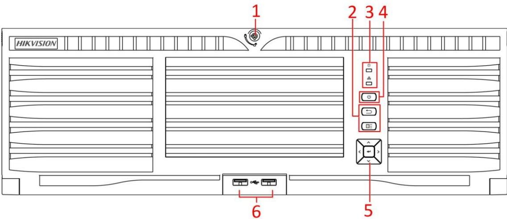

Figure 1. 1 DS-96000NI-I16 Series

| No. | Name             |           | Description                                                                |  |  |  |
|-----|------------------|-----------|----------------------------------------------------------------------------|--|--|--|
| 1   | Panel lock       |           | Locks or unlocks the panel by the key.                                     |  |  |  |
|     |                  |           | Returns to the previous menu.<br>●                                         |  |  |  |
|     |                  | Exit      | Press it twice quickly to switch the main and auxiliary port.<br>●         |  |  |  |
|     |                  |           | In live view mode, press it to enter PTZ control interface.<br>●           |  |  |  |
| 2   | Shortcut buttons | Menu      | Press it to pop up main menu.<br>●                                         |  |  |  |
|     |                  |           | Hold it for 5 seconds to turn on/off button sound.<br>●                    |  |  |  |
|     |                  |           | During playback, press it to show/hide control panel.<br>●                 |  |  |  |
|     |                  | HDD       | Solid red: at least one HDD is installed<br>●                              |  |  |  |
|     |                  |           | No lit: No HDD is detected.<br>●                                           |  |  |  |
| 3   | Status indicator |           | Blinking red: HDD is reading/writing.<br>●                                 |  |  |  |
|     |                  | Tx/Rx     | Blinking blue indicates network communication is normal.                   |  |  |  |
|     | Power switch     |           | Powers on/off device. Solid blue indicates device is powered on. Solid red |  |  |  |
| 4   |                  |           | indicates device is shut down.                                             |  |  |  |
|     |                  | ENTER     | Confirms selection in any of the menu modes.<br>●                          |  |  |  |
|     | Control buttons  |           | Checks the checkbox fields.<br>●                                           |  |  |  |
|     |                  |           | Switches on/off status.<br>●                                               |  |  |  |
| 5   |                  |           | Plays or pauses the video playing in playback mode.<br>●                   |  |  |  |
|     |                  |           | Advances the video by a single frame in single-frame playback mode.<br>●   |  |  |  |
|     |                  |           | Stops/starts auto switch in auto-switch mode.<br>●                         |  |  |  |
|     |                  | DIRECTION | Navigates between different fields and items in menus.<br>●                |  |  |  |
|     |                  |           | In the playback mode, use the Up and Down buttons to speed up and<br>●     |  |  |  |
|     |                  |           | slow down recorded video. Use the Left and Right buttons to select the     |  |  |  |

Table 1. 1 Description

| No. | Name                |  | Description                                                               |  |  |
|-----|---------------------|--|---------------------------------------------------------------------------|--|--|
|     |                     |  | next and previous video files.                                            |  |  |
|     |                     |  | Cycles through channels in live view mode.<br>●                           |  |  |
|     |                     |  | Controls the movement of the PTZ camera in PTZ control mode.<br>●         |  |  |
|     | 6<br>USB interfaces |  | Universal Serial Bus (USB) ports for additional devices such as USB mouse |  |  |
|     |                     |  | and USB Hard Disk Drive (HDD).                                            |  |  |

### **1.1.2 DS-96000NI-I24 Series**

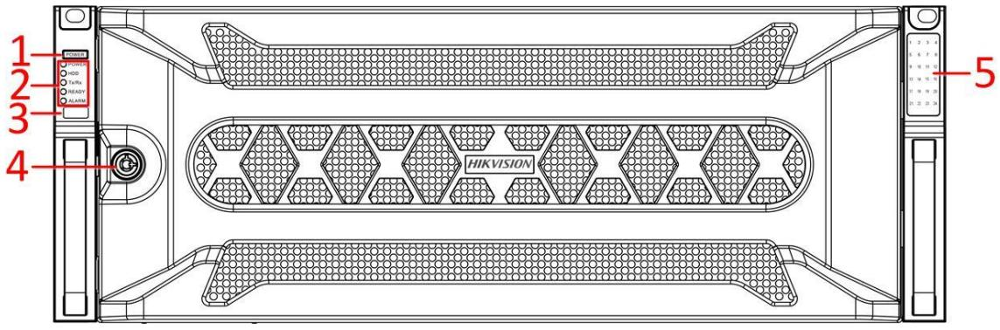

Figure 1. 2 DS-96000NI-I24 Series

Table 1. 2 Panel Description

| No. | Name                      |       | Description                                                           |  |
|-----|---------------------------|-------|-----------------------------------------------------------------------|--|
| 1   | Power switch              |       | Powers on/off device.                                                 |  |
| 2   | Status indicator<br>Power |       | Solid blue indicates device is powered on. Solid red indicates device |  |
|     |                           |       | is shut down.                                                         |  |
|     |                           | HDD   | Solid red: at least one HDD is installed<br>●                         |  |
|     |                           |       | No lit: No HDD is detected.<br>●                                      |  |
|     |                           |       | Blinking red: HDD is reading/writing.<br>●                            |  |
|     |                           | Tx/Rx | Blinking blue indicates network communication is normal.              |  |
|     |                           | Ready | Solid blue indicates device runs properly.                            |  |
|     |                           | Alarm | Solid red indicates alarm occurs.                                     |  |
| 3   | USB interface             |       | Universal Serial Bus (USB) ports for additional devices such as USB   |  |
|     |                           |       | mouse and USB Hard Disk Drive (HDD).                                  |  |
| 4   | Panel lock                |       | Locks or unlocks the panel by the key.                                |  |
| 5   | HDD sequence indicator    |       | Shows the HDD installation slot.                                      |  |

## **1.2 USB Mouse Operation**

A regular 3-button (Left/Right/Scroll-wheel) USB mouse can also be used with this NVR. To use a USB mouse:

- **1.** Plug USB mouse into one of the USB interfaces on the front panel of the NVR.
- **2.** The mouse should automatically be detected. If in a rare case that the mouse is not detected, the possible reason may be that the two devices are not compatible, please refer to the recommended the device list from your provider.

The operation of the mouse:

| Name         | Action         | Description                                                             |  |  |
|--------------|----------------|-------------------------------------------------------------------------|--|--|
|              | Single-Click   | Live view: Select channel and show the quick set menu.                  |  |  |
|              |                | Menu: Select and enter.                                                 |  |  |
|              | Double-Click   | Live view: Switch between single-screen and multi-screen.               |  |  |
| Left-Click   | Click and Drag | PTZ control: pan, tilt and zoom.                                        |  |  |
|              |                | Video tampering, privacy mask and motion detection: Select target area. |  |  |
|              |                | Digital zoom-in: Drag and select target area.                           |  |  |
|              |                | Live view: Drag channel/time bar.                                       |  |  |
| Right-Click  | Single-Click   | Live view: Show menu.                                                   |  |  |
|              |                | Menu: Exit current menu to upper level menu.                            |  |  |
| Scroll-Wheel | Scrolling up   | Live view: Previous screen.                                             |  |  |
|              |                | Menu: Previous item.                                                    |  |  |
|              | Scrolling down | Live view: Next screen.                                                 |  |  |
|              |                | Menu: Next item.                                                        |  |  |

Table 1. 1 Description of the Mouse Control

## **1.3 Input Method Description**

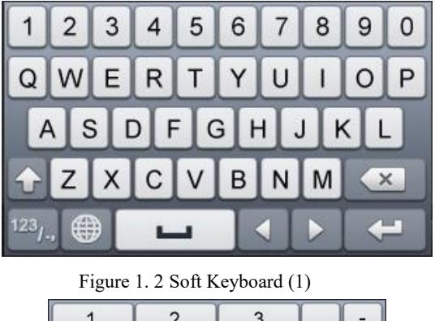

| ABC | L |     | ×<br>200 |     |
|-----|---|-----|----------|-----|
| 200 | 0 | Har |          |     |
| 7   | 8 | 9   |          | (0) |
| 4   | 5 | 6   |          |     |
|     | 2 | 3   |          |     |

Figure 1. 3 Soft Keyboard (2)

Description of the buttons on the soft keyboard:

Table 1. 2 Description of the Soft Keyboard Icons

| Icon | Description            | Icon | Description    |
|------|------------------------|------|----------------|
| …    | Number                 | …    | English letter |
|      | Lowercase/Uppercase    |      | Backspace      |
|      | Switch the keyboard    |      | Space          |
|      | Positioning the cursor |      | Exit           |
|      | Symbols                |      | Reserved       |

## **1.4 Rear Panel**

#### *Purpose:*

The interfaces of DS-96000NI-I16 and DS-96000NI-I24 are the same. Here we take the example of DS-96000NI-I16 series to introduce the rear panel.

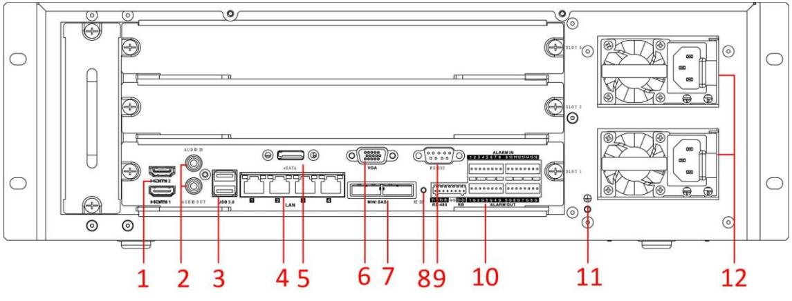

Figure 1. 3 DS-96000NI-I16 Series

| No. | Name           | Description                                                         |
|-----|----------------|---------------------------------------------------------------------|
| 1   | HDMI 1/2       | HDMI video output connector.                                        |
| 2   | Audio in       | RCA connector for audio input.                                      |
|     | Audio out      | RCA connector for audio output.                                     |
| 3   | USB 3.0        | Universal Serial Bus (USB 3.0) ports for additional devices such as |
|     |                | USB mouse and USB Hard Disk Drive (HDD).                            |
| 4   | LAN            | 4 10/100/1000 Mbps self-adaptive Ethernet interfaces.               |
| 5   | eSATA          | Connects external SATA HDD, CD/DVD-RM.                              |
| 6   | VGA            | DB9 connector for VGA output.                                       |
| 7   | Mini SAS       | Connector for mini SAS.                                             |
| 8   | Reset          | Reset button.                                                       |
| 9   | RS-232         | Connector for RS-232 devices.                                       |
| 10  | Alarm in       | Connector for alarm input.                                          |
|     | Alarm out      | Connector for alarm output.                                         |
|     | RS-485         | Connector for RS-485 devices.                                       |
|     | KB             | Connector for keyboard.                                             |
| 11  | GND            | Ground (needs to be connected when NVR starts up).                  |
| 12  | Fans           | Two fans.                                                           |
|     | Power supplies | Two power supplies.                                                 |

#### Table 1. 3 Panel Description

# **Chapter 2 Getting Started**

## **2.1 Starting Up and Shutting Down the NVR**

#### *Purpose:*

Proper startup and shutdown procedures are crucial to expanding the life of the NVR.

#### *Before you start:*

Check that the voltage of the extra power supply is the same with the NVR's requirement, and the ground connection is working properly.

### **2.1.1 Starting up**

#### *Steps:*

- **1.** Check the power supply is plugged into an electrical outlet. It is HIGHLY recommended that an Uninterruptible Power Supply (UPS) be used in conjunction with the device. The Power indicator LED on the front panel should be red, indicating the device gets the power supply.
- **2.** Press the **POWER** button on the front panel. The Power indicator should turn blue indicating that the unit begins to start up.
- **3.** After startup, the Power indicator LED remains blue. A splash screen with the status of the HDD appears on the monitor. The row of icons at the bottom of the screen shows the HDD status. 'X' means that the HDD is not installed or cannot be detected.

### **2.1.2 Shutting down**

#### *Steps:*

There are two proper ways to shut down the NVR.

- **OPTION 1: Standard shutdown** 
	- **1.** Enter the Shutdown menu.
		- Menu > Shutdown

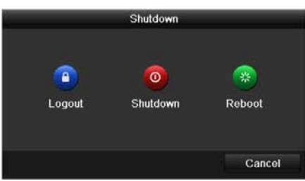

Figure 2. 1 Shutdown Menu

- **2.** Click the **Shutdown** button.
- **3.** Click the **Yes** button.
- **OPTION 2: By operating the front panel** 
	- **1.** Hold the POWER button on the front panel for 3 seconds.
	- **2.** Enter the administrator's user name and password in the dialog box for authentication.
	- **3.** Click the **Yes** button.


Do not press the POWER button again when the system is shutting down.

### **2.1.3 Rebooting**

#### *Purpose:*

In the Shutdown menu, you can also reboot the NVR.

*Steps:* 

- **1.** Enter the **Shutdown** menu by clicking Menu > Shutdown.
- **2.** Click the **Logout** button to lock the NVR or the **Reboot** button to reboot the NVR.

## **2.2 Activating Your Device**

#### *Purpose:*

For the first-time access, you need to activate the device by setting an admin password. No operation is allowed before activation. You can also activate the device via Web Browser, SADP or Client Software.

#### *Steps:*

- **1.** Input the same password in the text field of **Create New Password** and **Confirm New Password**.
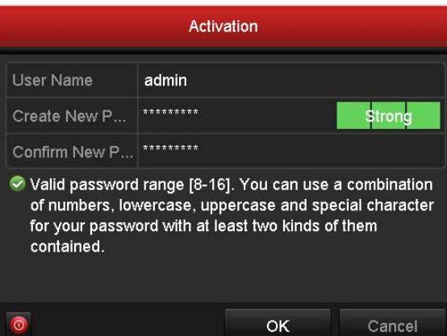

Figure 2. 2 Set Admin Password

**STRONG PASSWORD RECOMMENDED***–We highly recommend you create a strong password of your own choosing (Using a minimum of 8 characters, including at least three of the following categories: upper case letters, lower case letters, numbers, and special characters.) in order to increase the security of your product. And we recommend you reset your password regularly, especially in the high security system, resetting the password monthly or weekly can better protect your product.*

**2.** Click **OK** to save the password and activate the device.


For the old version device, if you update it to the new version, the following dialog box will pop up once the

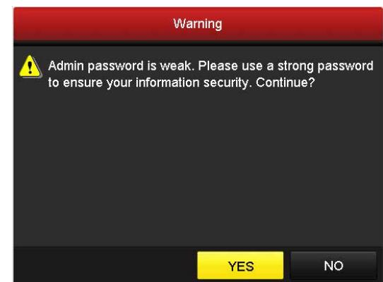

device starts up. You can click **YES** and follow the wizard to set a strong password.

Figure 2. 3 Warning Dialog Box


If Admin's password is modified, the following menu pops up. Optionally, click the Yes button to duplicate the password to IP cameras that are connected with default protocol.

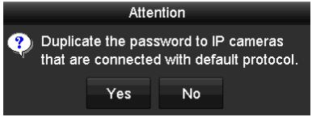

Figure 2. 4 Attention Interface

### **2.3 Using the Unlock Pattern for Login**

For the Admin user, you can configure the unlock pattern for device login.

### **2.3.1 Configuring the Unlock Pattern**

After the device is activated, you can enter the following interface to configure the device unlock pattern.

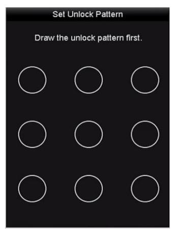

Figure 2. 5 Set Unlock Pattern

#### *Steps:*

- 1. Use the mouse to draw a pattern among the 9 dots on the screen. Release the mouse when the pattern is done.
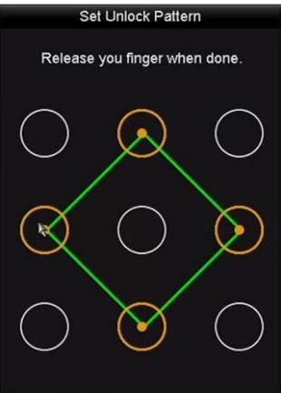

Figure 2. 6 Draw the Pattern


- Connect at least 4 dots to draw the pattern.
- Each dot can be connected for once only.
- 2. Draw the same pattern again to confirm it. When the two patterns match, the pattern is configured successfully.

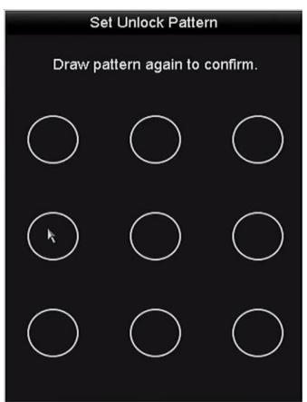

Figure 2. 7 Confirm the Pattern


If the two patterns are different, you must set the pattern again.

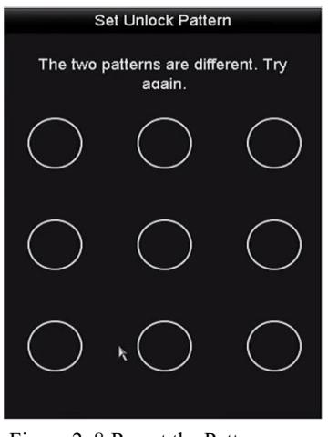

Figure 2. 8 Re-set the Pattern

### **2.3.2 Logging in via Unlock Pattern**


- Only the *admin* user has the permission to unlock the device.
- Please configure the pattern first before unlocking. Please refer to chapter *2.3.1 Configuring the Unlock Pattern.*

- 1. Right click the mouse on the screen and select the menu to enter the interface.
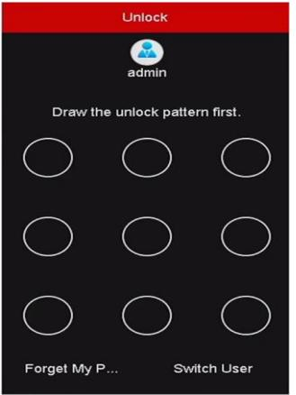

Figure 2. 9 Draw the Unlock Pattern

- 2. Draw the pre-defined pattern to unlock to enter the menu operation.


- If you have forgotten your pattern, you can select the **Forget My Pattern** or **Switch User** option to enter the normal login dialog box.
- When the pattern you draw is different from the pattern you have configured, you should try again.
- If you have drawn the wrong pattern for more than 5 times, the system will switch to the normal login mode automatically.

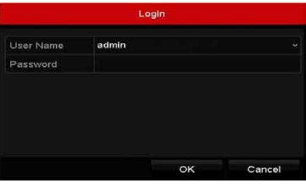

Figure 2. 10 Normal Login Dialog Box

## **2.4 Using Wizard for Basic Configuration**

| Wizard                           |      |      |
|----------------------------------|------|------|
| Start wizard when device starts? |      |      |
|                                  |      |      |
|                                  |      |      |
|                                  |      |      |
|                                  |      |      |
|                                  |      |      |
|                                  |      |      |
|                                  |      |      |
|                                  |      |      |
|                                  |      |      |
|                                  | Next | Exit |

By default, the Setup Wizard starts once the NVR has loaded, as shown in Figure 2. 11.

Figure 2. 11 Start Wizard Interface

Operating the Setup Wizard:

- **1.** The Setup Wizard can walk you through some important settings of the NVR. If you don't want to use the Setup Wizard at that moment, click the **Cancel** button. You can also choose to use the Setup Wizard next time by leaving the "Start wizard when the device starts?" checkbox checked.
- **2.** Click **Next** button to enter the date and time settings window, as shown in Figure 2. 12.

|             | Wizard                                 |      |      |
|-------------|----------------------------------------|------|------|
| Time Zone   | (GMT+08:00) Beijing, Urumqi, Singapore |      |      |
| Date Format | MM-DD-YYYY                             |      |      |
| System Date | 05-08-2013                             |      | ■    |
| System Time | 15:22:59                               |      |      |
|             |                                        |      |      |
|             | Previous                               | Next | Exit |

Figure 2. 12 Date and Time Settings

- **3.** After the time settings, click **Next** button which takes you back to the Network Setup Wizard window, as shown in the following figure.

| Wizard               |                              |      |      |
|----------------------|------------------------------|------|------|
| Working Mode         | Load Balance                 |      |      |
| Select NIC           | bond0                        |      |      |
| NIC Type             | 10M/100M/1000M Self-adaptive |      |      |
| Enable DHCP          |                              |      |      |
| IPv4 Address         | 192 168 1<br>.64             |      |      |
| IPv4 Subnet Mask     | 255 . 255 . 255 . 0          |      |      |
| IPv4 Default Gateway |                              |      |      |
| Preferred DNS Serv   |                              |      |      |
| Alternate DNS Server |                              |      |      |
|                      |                              |      |      |
|                      |                              |      |      |
|                      |                              |      |      |
|                      | Previous                     | Next | Exit |

Figure 2. 13 Network Setting

- **4.** Click **Next** button after you configured the basic network parameters. Then you will enter the **Advanced Network Parameter** interface. You can enable UPnP, DDNS and set other ports according to your need.

| Wizard             |                          |  |
|--------------------|--------------------------|--|
| Server Port        | 8000                     |  |
| HTTP Port          | 80                       |  |
| RTSP Port          | 554                      |  |
| Enable UPnP        | ■                        |  |
| Enable DDNS        | 1                        |  |
| DDNS Type          | HIDDNS<br>2              |  |
| Area/Country       | Custom<br>><br>>         |  |
| Server Address     | www.hik-online.com       |  |
| Device Domain Name |                          |  |
| Status             | DDNS is disabled.        |  |
| User Name          |                          |  |
| Password           |                          |  |
|                    |                          |  |
|                    | Exit<br>Previous<br>Next |  |

Figure 2. 14 Advanced Network Parameters

- **5.** Click **Next** button after you configured the network parameters, which takes you to the RAID configuration window.

|             | Wizard   |      |      |
|-------------|----------|------|------|
| Enable RAID |          |      |      |
|             |          |      |      |
|             |          |      |      |
|             |          |      |      |
|             |          |      |      |
|             |          |      |      |
|             |          |      |      |
|             |          |      |      |
|             | Previous | Next | Exit |

Figure 2. 15 Array Management

- **6.** Click **Next** button to enter the Array Management window.

|                               | Wizard   |      |      |
|-------------------------------|----------|------|------|
| One touch Array Configuration |          |      |      |
| Array Name                    |          |      |      |
|                               |          |      |      |
|                               |          |      |      |
|                               |          |      |      |
|                               |          |      |      |
|                               |          |      |      |
|                               |          |      |      |
|                               |          |      |      |
|                               |          |      |      |
|                               |          |      |      |
|                               | Previous | Next | Exit |
|                               |          |      |      |

Figure 2. 16 Array Management

- **7.** Click **Next** button after you configured the network parameters, which takes you to the **HDD Management**  window, shown in Figure 2. 17.

|    |          |               | Wizard   |       |            |
|----|----------|---------------|----------|-------|------------|
| L  | Capacity | Status        | Property | Type  | Free Space |
| 12 | 465.76GB | Uninitialized | RAV      | Local | OMB        |
| 17 | 931.51GB | Uninitialized | RAN      | Local | OMB        |
| 10 | 931.51GB | Uninitialized | RAN      | Local | OMB        |
|    |          |               |          |       | Init       |
|    |          |               | Previous | Next  | Exit       |

Figure 2. 17 HDD Management

- **8.** To initialize the HDD, click the **Init** button. Initialization removes all the data saved in the HDD.
- **9.** Click **Next** button. You enter the **Adding IP Camera** interface.

- **10.**Click **Search** to search the online IP Camera and the **Security** status shows whether it is active or inactive. Before adding the camera, make sure the IP camera to be added is in active status.
If the camera is in inactive status, you can click the inactive icon of the camera to set the password to activate it. You can also select multiple cameras from the list and click the **One-touch Activate** to activate the cameras in batch.

|     |             | Wizard      |     |                                   |                   |  |
|-----|-------------|-------------|-----|-----------------------------------|-------------------|--|
| No. | IP Address  | Security    |     | Amount of  Device M  Protocol     |                   |  |
| 19  | 10.6.38.6   | Active      | 1   |                                   | DS-2DF5  HIKVISIC |  |
| 12  | 10.6.38.13  | Active      | 15  |                                   | DS-2CD4  HIKVISI  |  |
| 3   | 10.6.38.88  | Active 1    |     |                                   | DS-2DF5  HIKVISK  |  |
| 4   | 10.6.38.202 | Active 1    |     |                                   | CS-C2-10  HIKVISK |  |
| 15  | 10.6.38.203 | Active      | 41  |                                   | DS-2CD7  HIKVISK  |  |
| 6   | 10.6.38.204 | Active      | 815 |                                   | DS-2CD5 HIKVISK   |  |
| 1   | -           |             |     |                                   | >                 |  |
|     |             | One-touch A |     | Add                               | Search            |  |
|     |             |             |     | Enable H.265 (For Initial Access) |                   |  |
|     |             | Previous    |     | Next                              | Exit              |  |

Click the **Add** to add the camera.

Figure 2. 18 Search for IP Cameras


When you check the checkbox of **Enable H.265**, the NVR can automatically switch to the H.265 stream of IP camera (which supports H.265 video format) for the initial access.

**11.**Click **Next** button. Configure the recording for the added IP Cameras.

|                  | Wizard   |    |      |
|------------------|----------|----|------|
| Continuous       | 彩        |    |      |
| Motion Detection | ক        |    |      |
|                  |          |    |      |
|                  |          |    |      |
|                  |          |    |      |
|                  |          |    |      |
|                  |          |    |      |
|                  |          |    |      |
|                  |          |    |      |
|                  |          |    |      |
|                  | Previous | OK | Exit |

Figure 2. 19 Record Settings

**12.**Click **OK** to complete the startup Setup Wizard.

## **2.5 Login and Logout**

### **2.5.1 User Login**

#### *Purpose:*

If NVR has logged out, you must login the device before operating the menu and other functions.

*Steps:*

- **1.** Select the **User Name** in the dropdown list.

| admin | User Name |
|-------|-----------|
|       | Password  |

Figure 2. 20 Login Interface

- **2.** Input **Password**.
- **3.** Click **OK** to log in.


In the Login dialog box, if you enter the wrong password 7 times, the current user account will be locked for 60 seconds.

|                                               |           | Login                                  |        |
|-----------------------------------------------|-----------|----------------------------------------|--------|
|                                               | User Name | admin                                  |        |
| Attention                                     | Password  |                                        |        |
| Incorrect password. The account is<br>locked. |           | The account will unlock in 48 seconds. |        |
| OK                                            |           | OK                                     | Cancel |

Figure 2. 21 User Account Protection

### **2.5.2 User Logout**

*Purpose:* 

After logging out, the monitor turns to the live view mode and if you want to perform any operations, you need to enter user name and password log in again.

*Steps:* 

- **1.** Enter the Shutdown menu.
Menu > Shutdown

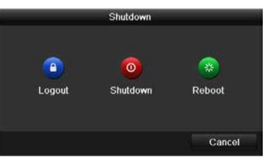

Figure 2. 22 Logout

#### **2.** Click **Logout**.


After you have logged out the system, menu operation on the screen is invalid. It is required to input a user name and password to unlock the system.

## **2.6 Adding and Connecting the IP Cameras**

### **2.6.1 Activating the IP Camera**

#### *Purpose:*

Before adding the camera, make sure the IP camera to be added is in active status.

*Steps:*

- **1.** Select the **Add IP Camera** option from the right-click menu in live view mode or click Menu> Camera> Camera to enter the IP camera management interface.
For the IP camera detected online in the same network segment, the **Password** status shows whether it is active or inactive.

| IP channel password is visible.   |             |   |            |                        |             |   |                  |
|-----------------------------------|-------------|---|------------|------------------------|-------------|---|------------------|
| Camera No. Add/Delete Status      |             |   | Security   | IP Camera Address Edit |             |   | Upgrade Camera I |
|                                   | 0           | - | @ Inactive | 192.168.1.64           | ile         | I | -                |
|                                   | e           | A | Active     | 10.16.1.102            | ile         | - | -                |
|                                   |             |   |            |                        |             |   |                  |
|                                   |             |   |            |                        |             |   |                  |
| S                                 | -           |   |            |                        |             |   | V                |
| Refresh                           | One-touch A |   | Upgrade    | Delete                 | One-touch A |   | Custom Addi      |
| Enable H.265 (For Initial Access) |             |   |            |                        |             |   |                  |

Figure 2. 23 IP Camera Management Interface

- **2.** Click the inactive icon of the camera to enter the following interface to activate it. You can also select multiple cameras from the list and click the **One-touch Activate** to activate the cameras in batch.

| Activation                                                                                                                                                                            | One-touch Activate                                                                                                                                                                    |
|---------------------------------------------------------------------------------------------------------------------------------------------------------------------------------------|---------------------------------------------------------------------------------------------------------------------------------------------------------------------------------------|
| Use Admin Password                                                                                                                                                                    | Use Admin Password                                                                                                                                                                    |
| Create New P                                                                                                                                                                          | Create New P                                                                                                                                                                          |
| Confirm New P                                                                                                                                                                         | Confirm New P                                                                                                                                                                         |
| V Valid password range [8-16]. You can use a combination<br>of numbers, lowercase, uppercase and special character<br>for your password with at least two kinds of them<br>contained. | V Valid password range [8-16]. You can use a combination<br>of numbers, lowercase, uppercase and special character<br>for your password with at least two kinds of them<br>contained. |
| Cancel<br>OK                                                                                                                                                                          | OK<br>Cancel                                                                                                                                                                          |

Figure 2. 24 Activate the Camera

- **3.** Set the password of the camera to activate it.
**Use Admin Password:** when you check the checkbox, the camera (s) will be configured with the same admin password of the operating NVR.

|                                                                      | Activation                                                                                                  |  |
|----------------------------------------------------------------------|-------------------------------------------------------------------------------------------------------------|--|
| Use Admin Password                                                   |                                                                                                             |  |
| Create New P.                                                        |                                                                                                             |  |
| Confirm New P                                                        |                                                                                                             |  |
| Valid password range [8-16]. You can use a combination<br>contained. | of numbers, lowercase, uppercase and special character<br>for your password with at least two kinds of them |  |
|                                                                      |                                                                                                             |  |

Figure 2. 25 Set New Password

**Create New Password:** If the admin password is not used, you must create the new password for the camera and confirm it.

**STRONG PASSWORD RECOMMENDED***–We highly recommend you create a strong password of your own choosing (Using a minimum of 8 characters, including at least three of the following categories: upper case letters, lower case letters, numbers, and special characters.) in order to increase the security of your product. And we recommend you reset your password regularly, especially in the high security system, resetting the password monthly or weekly can better protect your product.*

- **4.** Click **OK** to finish the acitavting of the IP camera. And the security status of camera will be changed to **Active**.
### **2.6.2 Adding the Online IP Cameras**

#### *Purpose:*

The main function of the NVR is to connect the network cameras and record the video got from it. So before you can get a live view or record of the video, you should add the network cameras to the connection list of the device. *Before you start:* 

Ensure the network connection is valid and correct. For detailed checking and configuring of the network, please see *Chapter Checking Network Traffic* and *Chapter Configuring Network Detection.* 

#### **Adding the IP Cameras**

#### **OPTION 1:**

#### *Steps:*

- **1.** Click to select an idle window in the live view mode.
- **2.** Click the icon in the center of the windw to pop up the adding IP camera interface.


Figure 2. 26 Icon of Adding IP Camera

- **3.** Select the detected IP camera and click the **Add** button to add it directly, and you can click the **Search** button to refresh the online IP camera manually.

|           |                   |            | Add IP Camera                  |           |         |
|-----------|-------------------|------------|--------------------------------|-----------|---------|
| No.       | IP Address        |            | Amount of  Device Ty  Protocol |           | Managem |
| 1         | 10.16.1.62        | 1          | IPC                            | HIKVISION | 8000    |
| 2         | 10.16.1.199       | 1          | IP Dome                        | HIKVISION | 8000    |
|           |                   |            |                                |           |         |
| 1         | -                 | -          |                                |           | >       |
|           | IP Camera Address | 10.16.1.62 |                                |           |         |
| Protocol  |                   | HIKAISION  |                                |           |         |
|           | Management Port   | 8000       |                                |           |         |
|           | Channel Port      | 1          |                                |           |         |
|           | Transfer Protocol | Auto       |                                |           |         |
| User Name |                   | admin      |                                |           |         |
|           | Admin Password    |            |                                |           |         |
|           |                   |            |                                |           |         |
|           |                   |            | Search                         | Add       | Cancel  |

Figure 2. 27 Quick Adding IP Camera Interface

Or you can choose to custom add the IP camera by editing the parameters in the corresponding textfiled and then click the **Add** button to add it.

- **OPTION 2:**
- 1. Select the **Add IP Camera** option from the right-click menu in live view mode or click Menu> Camera> Camera to enter the IP camera management interface.

| Camera No. Add/Delete Status |             |   | Security   | IP Camera Address Edit |             |   | Upgrade Camera I |                  |
|------------------------------|-------------|---|------------|------------------------|-------------|---|------------------|------------------|
|                              | 0           | - | @ Inactive | 192.168.1.64           | 彩           | - |                  | -                |
|                              | 0           | A | Active     | 10.16.1.102            | 1           | - |                  | -                |
|                              |             |   |            |                        |             |   |                  |                  |
|                              |             |   |            |                        |             |   |                  |                  |
|                              |             |   |            |                        |             |   |                  |                  |
|                              |             |   |            |                        |             |   |                  |                  |
|                              |             |   |            |                        |             |   |                  |                  |
|                              |             |   |            |                        |             |   |                  |                  |
| S                            |             | - |            |                        |             |   |                  |                  |
| Refresh                      | One-touch A |   | Upgrade    | Delete                 | One-touch A |   |                  | ><br>Custom Addi |

Figure 2. 28 Adding IP Camera Interface

- 2. The online cameras with same network segment will be detected and displayed in the camera list.
- 3. Select the IP camera from the list and click the button to add the camera. Or you can click the **One-touch Adding** button to add all cameras (with the same login password) from the list.


Make sure the camera to add has already been activated.

- 4. (For the encoders with multiple channels only) check the **Channel Port** checkbox in the pop-up window, as shown in the following figure, and click **OK** to add multiple channels.
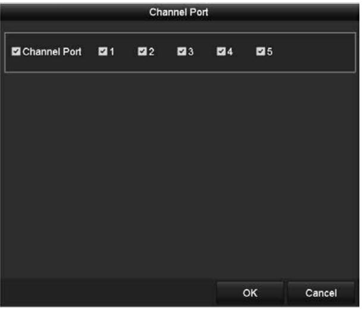

Figure 2. 29 Selecting Multiple Channels

- **OPTION 3:**
#### *Steps:*

- 1. On the IP Camera Management interface, click the **Custom Adding** button to pop up the Add IP Camera (Custom) interface.

|                   |                   |              | Add IP Camera (Custom) |          |         |  |  |
|-------------------|-------------------|--------------|------------------------|----------|---------|--|--|
| No.               | IP Address        |              | Amount of  Device M    | Protocol | Managen |  |  |
| 1                 |                   | 1            |                        |          | >       |  |  |
|                   | IP Camera Address | 10.16.1.64   |                        |          |         |  |  |
| Protocol          |                   | ONVIF        |                        |          |         |  |  |
| Management Port   |                   | 80           |                        |          |         |  |  |
| Transfer Protocol |                   | Auto         |                        |          |         |  |  |
| User Name         |                   | admin        |                        |          |         |  |  |
| Admin Password    |                   | ************ |                        |          |         |  |  |
|                   | Continue to Add   |              |                        |          |         |  |  |
|                   |                   | Protocol     | Search                 | Add      | Back    |  |  |

Figure 2. 30 Custom Adding IP Camera Interface

- 2. You can edit the IP address, protocol, management port, and other information of the IP camera to be added.
If the IP camera to add has not been actiavated, you can activate it from the IP camera list on the camera management interface.

- 3. (Optional) Check the checkbox of **Continue to Add** to add other IP cameras.
- 4. Click **Add** to add the camera. The successfully added cameras are listed in the interface.

Refer to the following table for the description of the icons

| Table 2. 1 Description of Icons |  |
|---------------------------------|--|
|---------------------------------|--|

| Icon | Explanation                                                                                          | Icon     | Explanation                                                                                                           |
|------|------------------------------------------------------------------------------------------------------|----------|-----------------------------------------------------------------------------------------------------------------------|
|      | Edit basic parameters of the camera                                                                  |          | Add the detected IP camera.                                                                                           |
|      | The camera is disconnected; you can<br>click the icon to get the exception<br>information of camera. |          | Delete the IP camera                                                                                                  |
|      | Play the live video of the connected<br>camera.                                                      |          | Advanced settings of the camera.                                                                                      |
|      | Upgrade the connected IP camera.                                                                     | Security | Show the security status of the camera<br>to be active/inactive or the password<br>strength (strong/medium/weak/risk) |

For the added IP cameras, the Security status shows the security level of the password of camera: strong password, weak password, and risk password.

|     | Cam  Add/De  Status |   | Security                | IP Camera A  Edit   Upgrade |    |     | Camera Name |  |
|-----|---------------------|---|-------------------------|-----------------------------|----|-----|-------------|--|
| ID1 |                     | C | Weak Pass  10.11.36.38  |                             | 12 | 1 台 | Camera 01   |  |
| 102 |                     | A | Strong Pas  10.16.1.250 |                             | 2  |     | IPdome      |  |
| ID3 |                     |   | N/A                     | 192.168.254.4               |    |     | IPCamera 03 |  |

Figure 2. 31 Security Level of IP Camera's Password

### **Enabling the Password of IP Camera Visible**

For the admin login user account, you can check the checkbox of **Show Password of IP Camera** to enable the show the passwords of the successfully added IP cameras in the list.

| IP Camera Import/Export<br>IP Camera |                                     |             |            |                        |    |             |                     |   |
|--------------------------------------|-------------------------------------|-------------|------------|------------------------|----|-------------|---------------------|---|
|                                      | IP channel password is visible.     |             |            |                        |    |             |                     |   |
| Cam                                  | Add/Delete Status                   |             | Password   | IP Camera Address Edit |    |             | Upgrade Camera Name |   |
| D1                                   | m                                   | 6           | Hik12345   | 10.16.1.102            | 17 | 11          | Camera 01           |   |
|                                      | (                                   | -           | & Inactive | 192.168.1.64           | 彩  | -           | 1                   |   |
|                                      |                                     |             |            |                        |    |             |                     |   |
| 1                                    | -                                   |             |            |                        |    |             |                     | > |
| Refresh                              |                                     | One-touch A | Upgrade    | Delete                 |    | One-touch A | Custom Addi         |   |
|                                      | Enable H.265 (For Initial Access)   |             |            |                        |    |             |                     |   |
|                                      | Net Receive Idle Bandwidth: 508Mbps |             |            |                        |    |             | Back                |   |

Figure 2. 32 List of Added IP Cameras

#### **Enabling the H.265 Stream Access**

You can check the checkbox of **Enable H.265**, the NVR can automatically switch to the H.265 stream of IP camera (which supports H.265 video format) for the initial access.

## **2.6.3 Editing the Connected IP Cameras and Configuring Customized Protocols**

After the adding of the IP cameras, the basic information of the camera lists in the page, you can configure the basic setting of the IP cameras.

- **1.** Click the icon to edit the parameters; you can edit the IP address, protocol and other parameters.

|                   | Edit IP Camera |    |        |  |  |  |  |
|-------------------|----------------|----|--------|--|--|--|--|
| IP Camera No.     | D1             |    |        |  |  |  |  |
| IP Camera Address | 10.16.1.2      |    |        |  |  |  |  |
| Protocol          | ONVIF<br>V     |    |        |  |  |  |  |
| Management Port   | 80             |    |        |  |  |  |  |
| Channel Port      | 1              |    |        |  |  |  |  |
| Transfer Protocol | Auto           |    |        |  |  |  |  |
| User Name         | admin          |    |        |  |  |  |  |
| Admin Password    |                |    |        |  |  |  |  |
|                   |                |    |        |  |  |  |  |
|                   |                |    |        |  |  |  |  |
|                   |                |    |        |  |  |  |  |
|                   | Protocol       | OK | Cancel |  |  |  |  |

Figure 2. 33 Edit the Parameters

**Channel Port:** If the connected device is an encoding device with multiple channels, you can choose the channel to connect by selecting the channel port No. in the dropdown list.

- **2.** Click **OK** to save the settings and exit the editing interface.
#### **To edit advanced parameters:**

- **1.** Drag the horizontal scroll bar to the right side and click the icon.

| Advance Set         |              |    |        |
|---------------------|--------------|----|--------|
| Network<br>Password |              |    |        |
| IP Camera No.       | D3           |    |        |
| IP Camera Address   | 172.6.23.124 |    |        |
| Management Port     | 8000         |    |        |
|                     |              |    |        |
|                     |              |    |        |
|                     |              |    |        |
|                     |              |    |        |
|                     |              |    |        |
|                     |              |    |        |
|                     |              |    |        |
|                     | ADDIV        | OK | Cancel |

Figure 2. 34 Network Configuration of the Camera

- **2.** You can edit the network information and the password of the camera.

| Network      | Password         | Advance Set                                                                                                                                                                      |  |
|--------------|------------------|----------------------------------------------------------------------------------------------------------------------------------------------------------------------------------|--|
|              | Camera No        | D3                                                                                                                                                                               |  |
|              | Current Password |                                                                                                                                                                                  |  |
| New Password |                  |                                                                                                                                                                                  |  |
| Confirm      |                  |                                                                                                                                                                                  |  |
|              |                  | Valid password range [8-16]. You can use a combination of numbers,<br>lowercase, uppercase and special character for your password with at<br>least two kinds of them contained. |  |
|              |                  |                                                                                                                                                                                  |  |

Figure 2. 35 Password Configuration of the Camera

- **3.** Click **OK** to save the settings and exit the interface.
#### **Configuring the customized protocols**

#### *Purpose:*

To connect the network cameras which are not configured with the standard protocols, you can configure the customized protocols for them.

#### *Steps:*

- **1.** Click the **Protocol** button in the custom adding IP camera interface to enter the protocol management interface.

|                                                                                           |                   | Protocol Management |           |        |        |
|-------------------------------------------------------------------------------------------|-------------------|---------------------|-----------|--------|--------|
| Custom Protocol                                                                           | Custom Protocol 1 |                     |           | 3      |        |
| Profocol Name                                                                             | ipc1              |                     |           |        |        |
| Stream Type                                                                               | Main Stream       |                     | Substream |        |        |
| Enable Substream                                                                          |                   |                     |           | D      |        |
| Type                                                                                      | RTSP              |                     | <         | RTSP   |        |
| Transfer Protocol                                                                         | Auto              |                     |           | · Auto | V      |
| Port                                                                                      | 554               |                     |           | 554    |        |
| Path                                                                                      |                   |                     |           |        |        |
| Example: [Type]://[IP Address]:[Port]/[Path]<br>rtsp://192.168.0.1:554/ch1/main/av_stream |                   |                     |           |        |        |
|                                                                                           |                   | Apply               |           | OK     | Cancel |

Figure 2. 36 Protocol Management Interface

There are 16 customized protocols provided in the system, you can edit the protocol name; and choose whether to enable the sub-stream.

- **2.** Choose the protocol type of transmission and choose the transfer protocols.


Before customizing the protocol for the network camera, you have to contact the manufacturer of the network camera to consult the URL (uniform resource locator) for getting main stream and sub-stream.

The format of the URL is: [Type]://[IP Address of the network camera]:[Port]/[Path].

*Example:* rtsp://192.168.1.55:554/ch1/main/av_stream.

- **Protocol Name:** Edit the name for the custom protocol.
- **Enable Substream:** If the network camera does not support sub-stream or the sub-stream is not needed leave the checkbox empty.
- **Type:** The network camera adopting custom protocol must support getting stream through standard RTSP.
- **Transfer Protocol:** Select the transfer protocol for the custom protocol.
- **Port:** Set the port No. for the custom protocol.
- **Path:** Set the resource path for the custom protocol. E.g., ch1/main/av_stream.

The protocol type and the transfer protocols must be supported by the connected network camera.

After adding the customized protocols, you can see the protocol name is listed in the dropdown list, please refer to Figure 2. 37.

|  |  | Figure 2. 37 Protocol Setting |  |  |
|--|--|-------------------------------|--|--|

- **3.** Choose the protocols you just added to validate the connection of the network camera.
# **Chapter 3 Live View**

## **3.1 Introduction of Live View**

Live view shows you the video image getting from each camera in real time. The NVR automatically enters Live View mode when powered on. It is also at the very top of the menu hierarchy, thus pressing the ESC many times (depending on which menu you're on) brings you to the Live View mode.

#### **Live View Icons**

In the live view mode, there are icons at the upper-right of the screen for each channel, showing the status of the record and alarm in the channel, so that you can know whether the channel is recorded, or whether there are alarms occur as soon as possible.

| Icons | Description                                                                                |
|-------|--------------------------------------------------------------------------------------------|
|       | Alarm (video loss, video tampering, motion detection, VCA and sensor alarm)                |
|       | Record (manual record, schedule record, motion detection, VCA and alarm triggered          |
|       | record)                                                                                    |
|       | Alarm and Record                                                                           |
|       | Event/Exception (motion detection, VCA, sensor alarm or exception information, appears     |
|       | at the lower-left corner of the screen. Please refer to Chapter 8.6 Setting Alarm Response |
|       | Actions for details.)                                                                      |

Table 3. 1 Description of Live View Icons

## **3.2 Operations in Live View Mode**

In live view mode, there are many functions provided. The functions are listed below.

- **• Single Screen**: showing only one screen on the monitor.
- **• Multi-screen:** showing multiple screens on the monitor simultaneously.
- **• Auto-switch:** the screen is auto switched to the next one. And you must set the dwell time for each screen on the configuration menu before enabling the auto-switch.

Menu > Configuration > Live View > Dwell Time.

- **• Start Recording:** continuous record and motion detection record are supported.
- **• Output Mode:** select the output mode to Standard, Bright, Gentle or Vivid.
- **• Add IP Camera:** the shortcut to the IP camera management interface.
- **• Playback:** playback the recorded videos for current day.
- **• Aux Monitor:** The main and auxiliary output priority principle is listed in *Figure 3. 2*. The NVR checks the connection of the output interfaces and combines with the principle to define the main and auxiliary output interfaces.

To configure HDMI 1 and VGA Simultaneous Output and Menu Output Mode, refer to *16.3 Configuring More Settings*.

| HDMI 1 and VGA<br>Simultaneous Output | Menu Output Mode | Main and Auxiliary Output Priority |
|---------------------------------------|------------------|------------------------------------|
|                                       | Auto             | HDMI 1 > HDMI 2/VGA                |
| Enabled                               | HDMI 1/VGA       | HDMI 1/VGA > HDMI 2                |
|                                       | HDMI 2           | HDMI 2 > HDMI 1/VGA                |
|                                       | Auto             | HDMI 1 > VGA > HDMI 2              |
|                                       | VGA              | VGA > HDMI 1 > HDMI 2              |
| Disabled                              | HDMI 1           | HDMI 1 > VGA > HDMI 2              |
|                                       | HDMI 2           | HDMI 2 > VGA > HDMI 1              |

Table 3. 2 Main and Auxiliary Output Priority Principle

### **3.2.1 Using the Mouse in Live View**

Table 3. 3 Mouse Operation in Live View

| Name            | Description                                                                   |
|-----------------|-------------------------------------------------------------------------------|
| Common Menu     | Quick access to the sub-menus which you frequently visit.                     |
| Menu            | Enter the main menu of the system by right clicking the mouse.                |
| Single Screen   | Switch to the single full screen by choosing channel number from the dropdown |
|                 | list.                                                                         |
| Multi-screen    | Adjust the screen layout by choosing from the dropdown list.                  |
| Previous Screen | Switch to the previous screen.                                                |
| Next Screen     | Switch to the next screen.                                                    |

| Name                   | Description                                                                   |
|------------------------|-------------------------------------------------------------------------------|
| Start/Stop Auto-switch | Enable/disable the auto-switch of the screens.                                |
| Start Recording        | Start continuous recording or motion detection recording of all channels.     |
| Add IP Camera          | Enter the IP Camera Management interface, and manage the cameras.             |
| Playback               | Enter the playback interface and start playing back the video of the selected |
|                        | channel immediately.                                                          |
| PTZ                    | Enter the PTZ control interface.                                              |
| Output Mode            | Four modes of output supported, including Standard, Bright, Gentle and Vivid. |
| Aux Monitor            | Switch to the auxiliary output mode and the operation for the main output is  |
|                        | disabled.                                                                     |


- The *dwell time* of the live view configuration must be set before using **Start Auto-switch**.
- If you enter Aux monitor mode and the Aux monitor is not connected, the mouse operation is disabled; you need to switch back to the Main output with the MAIN/AUX button on the front panel or remote.
- If the corresponding camera supports intelligent function, the Reboot Intelligence option is included when right-clicking mouse on this camera.

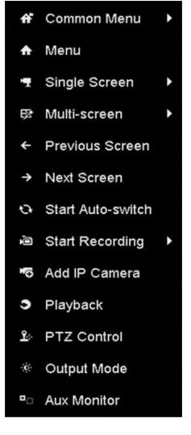

Figure 3. 1 Right-click Menu

### **3.2.2 Using an Auxiliary Monitor**

Certain features of the Live View are also available while in an Aux monitor. These features include:

- **• Single Screen:** Switch to a full screen display of the selected camera. Camera can be selected from a dropdown list.
- **• Multi-screen:** Switch between different display layout options. Layout options can be selected from a dropdown list.
- **• Next Screen:** When displaying less than the maximum number of cameras in Live View, clicking this feature will switch to the next set of displays.
- **• Playback:** Enter into Playback mode.
- **• PTZ Control:** Enter PTZ Control mode.
- **• Main Monitor:** Enter Main operation mode.


In the live view mode of the main output monitor, the menu operation is not available while Aux output mode is enabled.

### **3.2.3 Quick Setting Toolbar in Live View Mode**

On the screen of each channel, there is a quick setting toolbar which shows when you single click the mouse in the corresponding screen.


Figure 3. 2 Quick Setting Toolbar

| Icon | Description    | Icon | Description      | Icon | Description   |  |
|------|----------------|------|------------------|------|---------------|--|
| /    | Enable/Disable |      | Instant Playback | /    | Mute/Audio on |  |
|      | Manual Record  |      |                  |      |               |  |
|      | Capture        |      | PTZ Control      |      | Digital Zoom  |  |
|      | Image Settings |      | Face Detection   |      | Live View     |  |
|      |                |      |                  |      | Strategy      |  |
|      | Information    |      | Close            |      |               |  |

Table 3. 4 Description of Quick Setting Toolbar Icons

Instant Playback only shows the record in last five minutes. If no record is found, it means there is no record

during the last five minutes.

Digital Zoom is for zooming in the live image. You can zoom in the image to different proportions (1 to16X) by moving the sliding bar from to . You can also scroll the mouse wheel to control the zoom in/out.

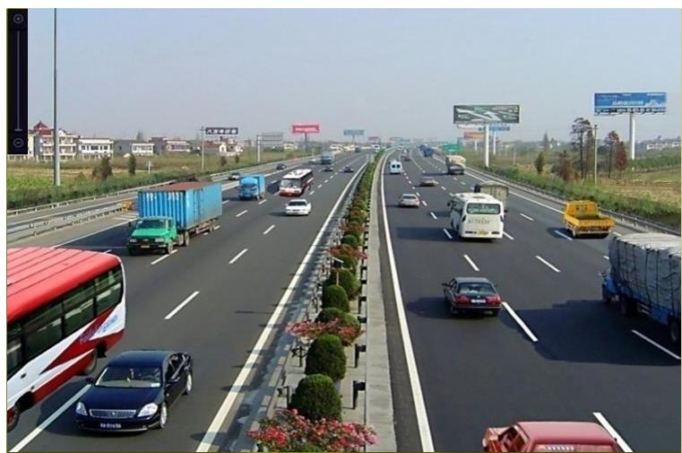

Figure 3. 3 Digital Zoom

Image Settings icon can be selected to enter the Image Settings menu.

You can set the image parameters like brightness, contrast, saturation and hue according to the actual demand.

| Custom |    |                      |
|--------|----|----------------------|
|        | 50 | <>>                  |
|        | 50 | <>                   |
|        | 50 | <>                   |
|        |    |                      |
|        |    |                      |
|        |    |                      |
|        |    |                      |
|        |    | Image Settings<br>OK |

Figure 3. 4 Image Settings- Customize

Live View Strategy can be selected to set strategy, including Real-time, Balanced, Fluency.

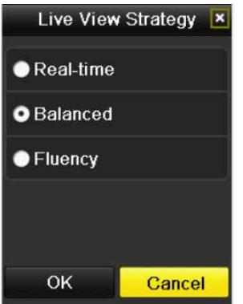

Figure 3. 5 Live View Strategy


Face detection function can be used to detect the human faces in live view mode and save in HDD. When

there are human faces with the specified size detected in the front of the camera, the device will capture the human face and save in HDD.

Move the mouse onto the icon to show the real-time stream information, including the frame rate, bitrate,

resolution and stream type.

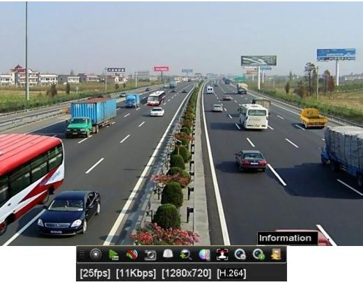

Figure 3. 6 Information

## **3.3 Adjusting Live View Settings**

#### *Purpose:*

Live View settings can be customized according to different needs. You can configure the output interface, dwell time for screen to be shown, mute or turning on the audio, the screen number for each channel, etc.

#### *Steps:*

- **1.** Enter the Live View Settings interface.
Menu > Configuration > Live View

| General<br>View          | Channel-Zero Encoding |   |
|--------------------------|-----------------------|---|
| Video Output Interface   | HDMI2                 | > |
| Live View Mode           | 4 * 4                 |   |
| Dwell Time               | No Switch             |   |
| Enable Audio Output      |                       |   |
| Volume                   |                       |   |
| Event Output             | VGA/HDMI1             | > |
| Full Screen Monitoring D | 10s                   |   |

Figure 3. 7 Live View-General

The settings available in this menu include:

- **• Video Output Interface:** Designates the output to configure the settings for. HDMI 1, HDMI 2 and VGA are provided.
- **• Live View Mode:** Designates the display mode to be used for Live View.
- **• Dwell Time:** The time in seconds to *dwell* between switching of channels when enabling auto-switch in Live View.
- **• Enable Audio Output:** Enables/disables audio output for the selected video output.
- **• Volume:** Adjust the volume of live view, playback and two-way audio for the selected output interface.
- **• Event Output:** Designates the output to show event video.
- **• Full Screen Monitoring Dwell Time:** The time in seconds to show alarm event screen.
- **2.** Setting Cameras Order

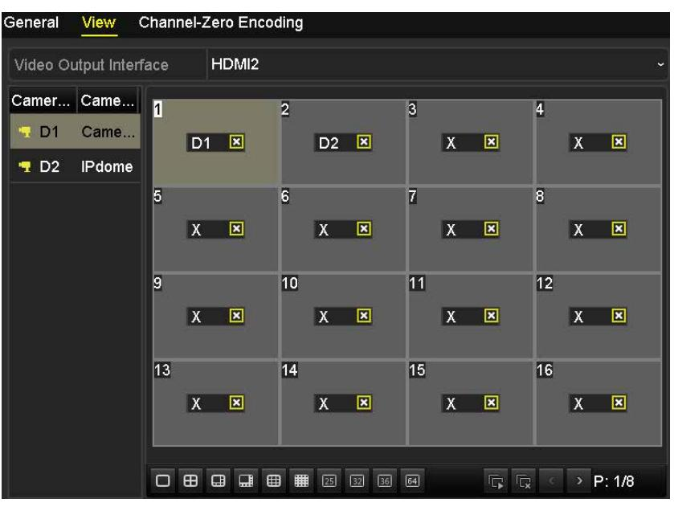

Figure 3. 8 Live View- Camera Order

- 1) Select a **View** mode in , including 1/4/6/8/9/16/25/32/36/64-window division modes are supported depending on different models.
- 2) Select the small window, and double-click on the channel number to display the channel on the window.

You can click button to start live view for all the channels and click to stop all the live view.

- 3) Click the **Apply** button to save the setting.
You can also click-and-drag the camera to the desired window on the live view interface to set the camera order.

## **3.4 Channel-Zero Encoding**

#### *Purpose:*

Sometimes you need to get a remote view of many channels in real time from web browser or CMS (Client Management System) software, in order to decrease the bandwidth requirement without affecting the image quality, channel-zero encoding is supported as an option for you.

#### *Steps:*

- **1.** Enter the **Live View** Settings interface.
Menu > Configuration> Live View

- **2.** Select the **Channel-Zero Encoding** tab.

| Enable Channel-Zero En    Z |         |  |
|-----------------------------|---------|--|
| Frame Rate                  | 30fps   |  |
| Max. Bitrate Mode           | General |  |
| Max. Bitrate(Kbps)          | 1792    |  |

Figure 3. 9 Live View- Channel-Zero Encoding

- **3.** Check the checkbox after **Enable Channel Zero Encoding.**
- **4.** Configure the Frame Rate, Max. Bitrate Mode and Max. Bitrate.

After you set the Channel-Zero encoding, you can get a view in the remote client or web browser of 16 channels in one screen.

# **Chapter 4 PTZ Controls**

## **4.1 Configuring PTZ Settings**

#### *Purpose:*

Follow the procedure to set the parameters for PTZ. The configuring of the PTZ parameters should be done before you control the PTZ camera.

#### *Steps:*

- **1.** Enter the PTZ Settings interface.
Menu >Camera> PTZ

| Camera |       |               | [D1] IPdome |             |       |             |           |
|--------|-------|---------------|-------------|-------------|-------|-------------|-----------|
|        |       |               |             | Preset      |       |             |           |
|        |       |               |             | Set         | Clear | Clear All   | Call      |
|        |       |               |             | Patrol      | 1     |             |           |
|        |       |               |             | Set         | Clear | Clear All   | Call      |
|        |       |               |             | Pattern     | 1     |             |           |
|        |       |               |             | Start       |       | Stop        | Clear All |
|        |       |               |             | Linear Scan |       |             |           |
|        | >     | Zoom          |             | Left Limit  |       | Right Limit |           |
| +<br>4 | C     | Focus<br>Iris |             | PTZ Parame  |       |             |           |
|        | Speed |               |             |             |       |             |           |
|        |       |               |             |             |       |             |           |
|        |       |               |             |             |       |             |           |
|        |       |               |             |             |       |             |           |

Figure 4. 1 PTZ Settings

- **2.** Click the **PTZ Parameters** button to set the PTZ parameters.

| PTZ Parameter Settings |              |    |  |  |  |  |
|------------------------|--------------|----|--|--|--|--|
| Baud Rate              | 9600         | 4  |  |  |  |  |
| Data Bit               | 8            | ্র |  |  |  |  |
| Stop Bit               | 1            | 4  |  |  |  |  |
| Parity                 | None         | >  |  |  |  |  |
| Flow Ciri              | None         | >  |  |  |  |  |
| PTZ Protocol           | HIKVISION    | >  |  |  |  |  |
| Address                | 0            |    |  |  |  |  |
| Address range: 0~255   |              |    |  |  |  |  |
|                        | OK<br>Cancel |    |  |  |  |  |

Figure 4. 2 PTZ- General

- **3.** Choose the camera for PTZ setting in the **Camera** dropdown list.
- **4.** Enter the parameters of the PTZ camera.

All the parameters should be exactly the same as the PTZ camera parameters.

- **5.** Click **Apply** button to save the settings.
## **4.2 Setting PTZ Presets, Patrols & Patterns**

#### *Before you start:*

Please make sure that the presets, patrols and patterns should be supported by PTZ protocols.

### **4.2.1 Customizing Presets**

#### *Purpose:*

Follow the steps to set the Preset location which you want the PTZ camera to point to when an event takes place. *Steps:* 

- **1.** Enter the PTZ Control interface.
Menu>Camera>PTZ

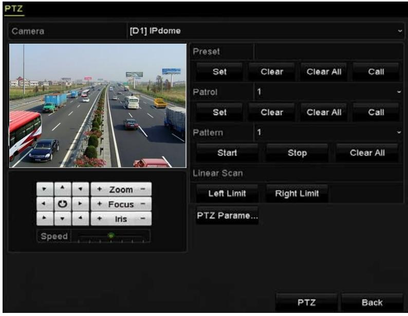

Figure 4. 3 PTZ Settings

- **2.** Use the directional button to wheel the camera to the location where you want to set preset; and the zoom and focus operations can be recorded in the preset as well.
- **3.** Enter the preset No. (1~255) in the preset text field, and click the **Set** button to link the location to the preset. Repeat the steps2-3 to save more presets.

You can click the **Clear** button to clear the location information of the preset, or click the **Clear All** button to clear the location information of all the presets.

### **4.2.2 Calling Presets**

#### *Purpose:*

This feature enables the camera to point to a specified position such as a window when an event takes place. *Steps:*

- **1.** Click the button **PTZ** in the lower-right corner of the PTZ setting interface;
Or click the PTZ Control icon in the quick setting bar, or select the PTZ option in the right-click menu to show the PTZ control panel.

- **2.** Choose C**amera** in the dropdown list.
- **3.** Click the General tab.

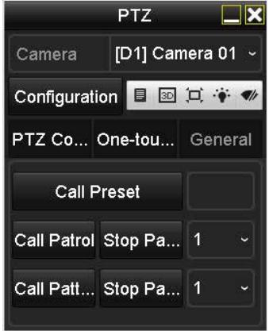

Figure 4. 4 PTZ Panel - General

- **4.** Click to enter the preset No. in the corresponding text field.
- **5.** Click the **Call Preset** button to call it.

### **4.2.3 Customizing Patrols**

#### *Purpose:*

Patrols can be set to move the PTZ to different key points and have it stay there for a set duration before moving on to the next key point. The key points are corresponding to the presets. The presets can be set following the steps above in *Customizing Presets*.

- **1.** Enter the PTZ Control interface. Menu>Camera>PTZ
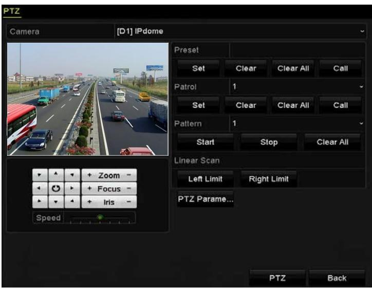

Figure 4. 5 PTZ Settings

- **2.** Select patrol No. in the drop-down list of patrol.
- **3.** Click the **Set** button to add key points for the patrol.

| KeyPoint    |            |        |  |  |  |  |
|-------------|------------|--------|--|--|--|--|
| KeyPoint: 1 |            |        |  |  |  |  |
| Preset      | 1          |        |  |  |  |  |
| Duration    | <<< 0      | >>>    |  |  |  |  |
| Speed       | < < <<br>1 | >>>    |  |  |  |  |
|             |            |        |  |  |  |  |
| Add         | OK         | Cancel |  |  |  |  |

Figure 4. 6 Key point Configuration

- **4.** Configure key point parameters, such as the key point No., duration of staying for one key point and speed of patrol. The key point is corresponding to the preset. The **Key Point No.** determines the order at which the PTZ will follow while cycling through the patrol. The **Duration** refers to the time span to stay at the corresponding key point. The **Speed** defines the speed at which the PTZ will move from one key point to the next.
- **5.** Click the **Add** button to add the next key point to the patrol, or you can click the **OK** button to save the key point to the patrol.

You can delete all the key points by clicking the **Clear** button for the selected patrol, or click the **Clear All** button to delete all the key pints for all patrols.

### **4.2.4 Calling Patrols**

#### *Purpose:*

Calling a patrol makes the PTZ to move according the predefined patrol path. *Steps:*

- **1.** Click the button **PTZ** in the lower-right corner of the PTZ setting interface;
Or click the PTZ Control icon in the quick setting bar, or select the PTZ option in the right-click menu to show the PTZ control panel.

- **2.** Click the General tab.

|                          | PTZ                           |  |  |  |  |
|--------------------------|-------------------------------|--|--|--|--|
| Camera                   | [D1] Camera 01 ~              |  |  |  |  |
|                          | Configuration ■ ■ □ □ □ ··· ● |  |  |  |  |
| PTZ Co  One-tou  General |                               |  |  |  |  |
| Call Preset              |                               |  |  |  |  |
| Call Patrol Stop Pa  1   |                               |  |  |  |  |
|                          | Call Patt  Stop Pa  1         |  |  |  |  |

Figure 4. 7 PTZ Panel - General

- **3.** Select a patrol in the dropdown list and click the **Call Patrol** button to call it.
- **4.** You can click the **Stop Patrol** button to stop calling it.

### **4.2.5 Customizing Patterns**

#### *Purpose:*

Patterns can be set by recording the movement of the PTZ. You can call the pattern to make the PTZ movement according to the predefined path.

#### *Steps:*

- **1.** Enter the PTZ Control interface.
Menu > Camera > PTZ

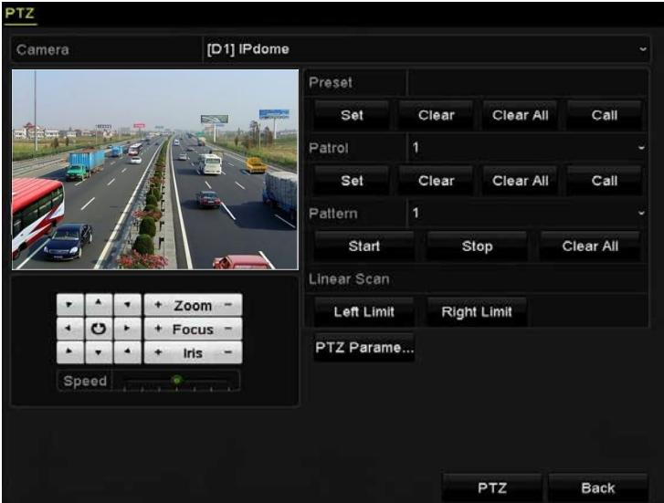

Figure 4. 8 PTZ Settings

- **2.** Choose pattern number in the dropdown list.
- **3.** Click the **Start** button and click corresponding buttons in the control panel to move the PTZ camera, and click the **Stop** button to stop it.

The movement of the PTZ is recorded as the pattern.

### **4.2.6 Calling Patterns**

#### *Purpose:*

Follow the procedure to move the PTZ camera according to the predefined patterns.

*Steps:* 

- **1.** Click the button **PTZ** in the lower-right corner of the PTZ setting interface;
Or click the PTZ Control icon in the quick setting bar, or select the PTZ option in the right-click menu to show the PTZ control panel.

- **2.** Click the General tab.
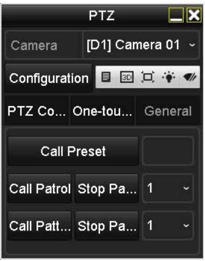

Figure 4. 9 PTZ Panel - General

- **3.** Click the **Call Pattern** button to call it.
- **4.** Click the **Stop Pattern** button to stop calling it.

### **4.2.7 Customizing Linear Scan Limit**

#### *Purpose:*

The Linear Scan can be enabled to trigger the scan in the horizantal direction in the predefined range.


This function is supported by some certain models.

#### *Steps:*

- **1.** Enter the PTZ Control interface.
Menu > Camera > PTZ

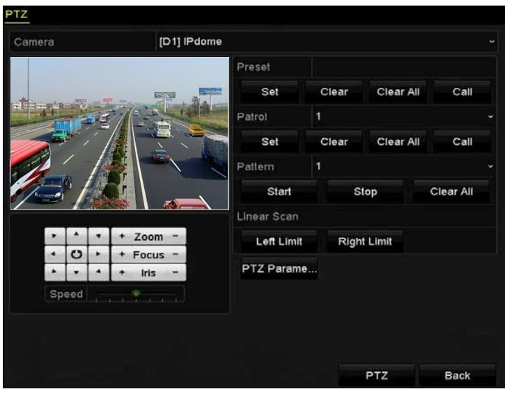

Figure 4. 10 PTZ Settings

- **2.** Use the directional button to wheel the camera to the location where you want to set the limit, and click the **Left Limit** or **Right Limit** button to link the location to the corresponding limit.
The speed dome starts linear scan from the left limit to the right limit, and you must set the left limit on the left side of the right limit, as well the angle from the left limit to the right limit should be no more than 180º.

### **4.2.8 Calling Linear Scan**


Before operating this function, make sure the connected camera supports the linear scan and is in HIKVISION protocol.

*Purpose:* 

Follow the procedure to call the linear scan in the predefined scan range.

#### *Steps:*

- **1.** Click the button **PTZ** in the lower-right corner of the PTZ setting interface;
Or click the PTZ Control icon in the quick setting bar to enter the PTZ setting menu in live view mode. **2.** Click the One-touch tab.

- 58
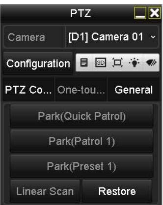

Figure 4. 11 PTZ Panel - One-touch

- **3.** Click **Linear Scan** button to start the linear scan and click the Linear Scan button again to stop it. You can click the **Restore** button to clear the defined left limit and right limit data and the dome needs to reboot to make settings take effect.
### **4.2.9 One-touch Park**


Before operating this function, make sure the connected camera supports the linear scan and is in HIKVISION protocol.

#### *Purpose:*

For some certain model of the speed dome, it can be configured to start a predefined park action (scan, preset, patrol and etc.) automatically after a period of inactivity (park time).

#### *Steps:*

- **1.** Click the button **PTZ** in the lower-right corner of the PTZ setting interface;
Or click the PTZ Control icon in the quick setting bar to enter the PTZ setting menu in live view mode. **2.** Click the One-touch tab.

|                                  | PTZ                    |  |  |  |  |  |  |
|----------------------------------|------------------------|--|--|--|--|--|--|
| [D1] Camera 01 ~<br>Camera       |                        |  |  |  |  |  |  |
| Configuration ■ ■ □ □ □ □ □ ·· ● |                        |  |  |  |  |  |  |
| PTZ Co  One-tou  General         |                        |  |  |  |  |  |  |
|                                  | Park(Quick Patrol)     |  |  |  |  |  |  |
|                                  | Park(Patrol 1)         |  |  |  |  |  |  |
| Park(Preset 1)                   |                        |  |  |  |  |  |  |
|                                  | Linear Scan<br>Restore |  |  |  |  |  |  |

Figure 4. 12 PTZ Panel - One-touch

- **3.** There are 3 one-touch park types selectable, click the corresponding button to activate the park action.
**Park (Quick Patrol):** The dome starts patrol from the predefined preset 1 to preset 32 in order after the park time. The undefined preset will be skipped.

**Park (Patrol 1):** The dome starts move according to the predefined patrol 1 path after the park time.

**Park (Preset 1):** The dome moves to the predefined preset 1 location after the park time.


The park time can only be set through the speed dome configuration interface, by default the value is 5s.

- **4.** Click the button again to inactivate it.
## **4.3 PTZ Control Panel**

To enter the PTZ control panel, there are two ways supported.

#### **OPTION 1:**

In the PTZ settings interface, click the **PTZ** button on the lower-right corner which is next to the Back button.

#### **OPTION 2:**

In the Live View mode, you can choose the PTZ Control icon in quick setting bar, or select the PTZ option in the right-click menu.

Click the **Configuration** button on the control panel, and you can enter the PTZ Settings interface.


In PTZ control mode, the PTZ panel will be displayed when a mouse is connected with the device. If no mouse is connected, the icon appears in the lower-left corner of the window, indicating that this camera is in PTZ control mode.

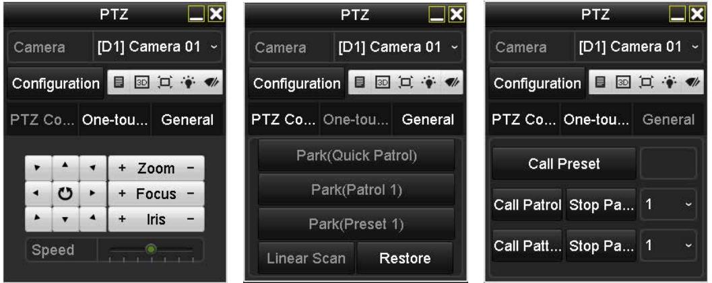

Figure 4. 13 PTZ Panel

| Icon | Description                                   | Icon | Description                                     | Icon | Description                                 |
|------|-----------------------------------------------|------|-------------------------------------------------|------|---------------------------------------------|
|      | Direction button and<br>the auto-cycle button |      | Zoom+, Focus+,<br>Iris+                         |      | Zoom-, Focus-, Iris                         |
|      | The speed of the<br>PTZ movement              |      | Light on/off                                    |      | Wiper on/off                                |
|      | 3D-Zoom                                       |      | Image Centralization                            |      | Menu                                        |
|      | Switch to the PTZ<br>control interface        |      | Switch to the<br>one-touch control<br>interface |      | Switch to the general<br>settings interface |
|      | Exit                                          |      | Minimize windows                                |      |                                             |

| Table 4. 1 Description of the PTZ panel icons |  |  |  |  |
|-----------------------------------------------|--|--|--|--|
|                                               |  |  |  |  |

# **Chapter 5 Recording Settings**

### **5.1 Configuring Parameters**

#### *Purpose:*

By configuring the parameters you can define the parameters which affect the image quality, such as the

transmission stream type, the resolution and so on.

#### *Before you start:*

- **1.** Make sure that the HDD has already been installed. If not, please install a HDD and initialize it. (Menu > HDD > General)

|    | HDD Information  |        |          |       |            |       |              |
|----|------------------|--------|----------|-------|------------|-------|--------------|
|    | L  Capacity      | Status | Property | Type  | Free Space |       | Gr  Edit Del |
| 13 | 1863.02GB Normal |        | RAN      | Local | 1843.00GB  | - - m |              |

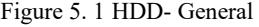

- **2.** Check the storage mode of the HDD
	- 1) Click **Advanced** to check the storage mode of the HDD.
	- 2) If the HDD mode is *Quota*, please set the maximum record capacity and maximum picture capacity. For detailed information, see *Chapter Configuring Quota Mode.*
	- 3) If the HDD mode is **Group**, you should set the HDD group. For detailed information, see *Chapter Configuring HDD Group for Recording.*

| Mode                | Group                                                                |
|---------------------|----------------------------------------------------------------------|
| Record on HDD Group | Quota<br>Group                                                       |
| IP Camera           | VD+<br>1.1.15<br>CLACK<br>CITY<br>· 1-11<br>. 1879<br>STEEN<br>SELLI |

Figure 5. 2 HDD- Advanced

- **1.** Enter the Record settings interface to configure the recording parameters:

```
Menu > Record > Parameters
```

| Record<br>Substream     |                         |                    |  |  |
|-------------------------|-------------------------|--------------------|--|--|
| Camera                  | [D2] IPdome             |                    |  |  |
| Encoding Parameters     | Main Stream(Continuous) | Main Stream(Event) |  |  |
| Stream Type             | Video                   | Video              |  |  |
| Resolution              | 1920*1080(1080P)<br><   | 1920*1080(1080P)   |  |  |
| Bitrate Type            | Variable<br>>           | Variable           |  |  |
| Video Quality           | Medium<br>>             | Medium             |  |  |
| Frame Rate              | Full Frame<br>>         | Full Frame         |  |  |
| Max. Bitrate Mode       | General<br>)            | General            |  |  |
| Max. Bitrate(Kbps)      | 4096<br>>               | 4096               |  |  |
| Max. Bitrate Range Reco | 3840~6400(Kbps)         | 3840~6400(Kbps)    |  |  |
| Video Encode            | H 264<br>>              | H.264              |  |  |
| Enable H.264+           |                         |                    |  |  |
|                         |                         |                    |  |  |
| More Setting            |                         |                    |  |  |
|                         |                         |                    |  |  |

Figure 5. 3 Recording Parameters

- **2.** Parameters Setting for Recording
	- 1) Select **Record** tab page to configure. You can configure the stream type, the resolution, and other parameters on your demand.
		- **Video Encode**: select the video encoding to H.265 or H.264.
		- **Enable H.264+ Mode**: check the checkbox to enable. Once enabled, the **Max. Bitrate Mode**, **Max. Bitrate(Kbps)** and **Max. Bitrate Range Recommend** are not configurable. Enabling it helps to ensure the high video quality with a lowered bitrate.


The H.265 and H.264+ should be supported by the connected IP camera.

- 2) Click the **More Settings** button to set the advanced parameters for recording and then click **OK** button to finish editing.

|                    | More Settings |            |  |
|--------------------|---------------|------------|--|
| Pre-record         | 5s            | 4          |  |
| Post-record        | 5s            | <          |  |
| Expired Time (day) | 0             |            |  |
| Record Audio       | যে            |            |  |
| Video Stream       | Main Stream   | <          |  |
|                    |               |            |  |
|                    |               | OK<br>Back |  |

Figure 5. 4 More Settings

- **• Pre-record:** The time you set to record before the scheduled time or event. For example, when an alarm triggers the recording at 10:00, and if you set the pre-record time as 5 seconds, the camera records at 9:59:55.
- **• Post-record:** The time you set to record after the event or the scheduled time. For example, when an alarm triggered recording ends at 11:00, and if you set the post-record time as 5 seconds, it records till 11:00:05.
- **• Expired Time:** The expired time is period for a recorded file to be kept in the HDD. When the deadline is reached, the file will be deleted. If you set the expired time to 0, the file will not be deleted. The actual keeping time for the file should be determined by the capacity of the HDD.
- **• Redundant Record/Capture:** By enabling redundant record or capture you save the record and captured picture in the redundant HDD. See *Chapter Configuring Redundant Recording*.
- **• Record Audio:** Check the checkbox to enable or disable audio recording.
- **• Video Stream:** Main stream and sub-stream are selectable for recording. When you select sub-stream, you can record for a longer time with the same storage space.
- 3) Click **Apply** to save the settings.


You can enable the ANR (Automatic Network Replenishment) function via the web browser (Configuration > Storage > Schedule Settings > Advanced) to save the video files in the IP camera when the network is disconnected, and synchronize the files to the NVR when the network is resumed.


- The redundant record/capture is used when you want to save the record files or captured pictures in the redundant HDD. You must configure the redundant HDD in HDD settings. For detailed information, see *Chapter 13.4.2*.
- The parameters of Main Stream (Event) are read-only.
- **3.** Parameters Settings for Sub-stream
	- 1) Enter the Sub-stream tab page.

| -<br>Record<br>Substream |                |   |
|--------------------------|----------------|---|
|                          |                |   |
| Camera                   | [D1] Camera 01 |   |
| Stream Type              | Video          |   |
| Resolution (maximum val  | 352*288(CIF)   |   |
| Bitrate Type             | Variable       | > |
| Video Quality            | Medium         |   |
| Frame Rate               | 12fps          | > |
| Max. Bitrate Mode        | General        |   |
| Max. Bitrate (Kbps) (max | 512            |   |
| Max. Bitrate Range Reco  | 153~255(Kbps)  |   |
| Video Encode             | H.264          |   |

Figure 5. 5 Sub-stream Parameters

- 2) Configure the parameters of the camera.
- 3) Click **Apply** to save the settings.


The interval is the time period between two capturing actions. You can configure all the parameters on this menu on your demand.

## **5.2 Configuring Recording Schedule**

#### *Purpose:*

Set the record schedule, and then the camera automatically starts/stops recording according to the configured schedule.


In this chapter, we take the record schedule procedure as an example, and the same procedure can be applied to configure schedule for both recording and capture. To schedule the automatic capture, you need to choose the Capture tab in the **Schedule** interface.

#### *Steps:*

- **1.** Enter the Record Schedule interface.
Menu > Record > Schedule

- **2.** Configure Record Schedule
	- 1) Select Record Schedule.

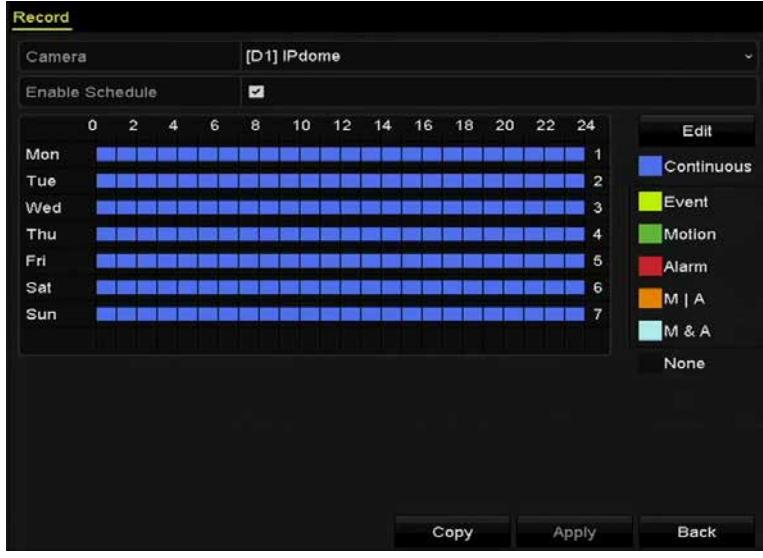

Figure 5. 6 Record Schedule

Different recording types are marked in different color icons.

**Continuous:** scheduled recording.

**Event**: recording triggered by all event triggered alarm.

**Motion**: recording triggered by motion detection.

**Alarm:** recording triggered by alarm.

**M/A:** recording triggered by either motion detection or alarm.

**M&A:** recording triggered by motion detection and alarm.


You can delete the set schedule by clicking the **None** icon.

- 2) Choose the camera you want to configure.
- 3) Select the check box after the **Enable Schedule** item.

- 4) Click **Edit** button or click on the color icon under the edit button and draw the schedule line on the panel.
### **Edit the schedule:**

- I. In the message box, you can choose the day to which you want to set schedule.

|                |             | Edit  |   |      |            |  |
|----------------|-------------|-------|---|------|------------|--|
| Weekday        |             | Mon   |   |      |            |  |
| All Day        | 11          |       |   | Type | Continuous |  |
| Start/End Time | 00:00-24:00 |       | 0 | Type | Continuous |  |
| Start/End Time | 00:00-00:00 |       | g | Type | Continuous |  |
| Start/End Time | 00:00-00:00 |       | 0 | Type | Continuous |  |
| Start/End Time | 00:00-00:00 |       | 0 | Type | Continuous |  |
| Start/End Time | 00:00-00:00 |       | 0 | Type | Continuous |  |
| Start/End Time | 00:00-00:00 |       | 9 | Type | Continuous |  |
| Start/End Time | 00:00-00:00 |       | 9 | Type | Continuous |  |
| Start/End Time | 00:00-00:00 |       | 0 | Type | Continuous |  |
|                |             |       |   |      |            |  |
|                | Copy        | Apply |   | OK   | Cancel     |  |

Figure 5. 7 Recording Schedule Interface

You can click the button to set the accurate time of the schedule.

- II. To schedule an all-day recording, check the checkbox after the **All Day** item.
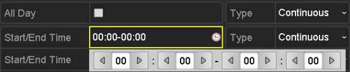

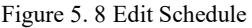

- III. To arrange other schedule, set the Start/End time for each period.


Up to 8 periods can be configured for each day. And the time periods can't be overlapped each other. IV. Select the record type in the dropdown list.


- To enable Motion, Alarm, M | A (motion or alarm), M & A (motion and alarm) and VCA (Video Content Analysis) triggered recording and capture, you must configure the motion detection settings, alarm input settings or VCA settings as well. For detailed information, refer to *Chapter 8.1* and *Chapter 9*.
- The VCA settings are only available to the smart IP cameras.

Repeat the above edit schedule steps to schedule recording or capture for other days in the week. If the schedule can also be applied to other days, click **Copy**.

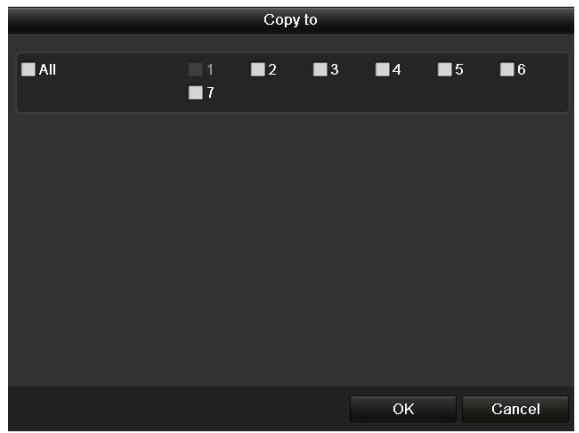

Figure 5. 9 Copy Schedule to Other Days

- V. Click **OK** to save setting and back to upper level menu.
VI. Click **Apply** in the Record Schedule interface to save the settings. **Draw the schedule:**

- I. Click on the color icons, you can choose the schedule type as continuous or event.

| Camera          |   |   |   |   |   | [D1] IPdome |    |    |    |      |    |    |                                                                                     | V          |
|-----------------|---|---|---|---|---|-------------|----|----|----|------|----|----|-------------------------------------------------------------------------------------|------------|
| Enable Schedule |   |   |   |   | D |             |    |    |    |      |    |    |                                                                                     |            |
|                 | 0 | 2 | 4 | 6 | 8 | 10          | 12 | 14 | 16 | 18   | 20 | 22 | 24                                                                                  | Edit       |
| Mon             |   |   |   |   |   |             |    |    |    |      |    |    | 1                                                                                   | Continuous |
| Tue             |   |   |   |   |   |             |    |    |    |      |    |    | 2                                                                                   |            |
| Wed             |   |   |   |   |   |             |    |    |    |      |    |    | 3                                                                                   | Event      |
| Thu             |   |   |   |   |   |             |    |    |    |      |    |    | 4                                                                                   | Motion     |
| Eri             |   |   |   |   |   |             |    |    |    |      |    |    | 5                                                                                   | Alarm      |
| Sat             |   |   |   |   |   |             |    |    |    |      |    |    | 6                                                                                   | MIA        |
| Sun             |   |   |   |   |   |             |    |    |    |      |    |    | 7                                                                                   | M & A      |
|                 |   |   |   |   |   |             |    |    |    |      |    |    | "Note: Operation is invalid when the number of time segments exceeds the limit (8). | None       |
|                 |   |   |   |   |   |             |    |    |    | Copy |    |    | Apply                                                                               | Back       |

Figure 5. 10 Draw the Schedule

- II. Click the **Apply** button to validate the settings.
- **3.** (Optional) If the settings can also be used to other channels, click **Copy**, and then choose the channel to which you want to copy.
- **4.** Click **Apply** to save the settings.

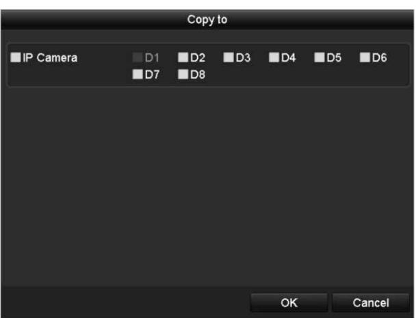

Figure 5. 11 Copy Schedule to Other Channels

## **5.3 Configuring Motion Detection Recording**

#### *Purpose:*

Follow the steps to set the motion detection parameters. In the live view mode, once a motion detection event takes place, the NVR can analyze it and do many actions to handle it. Enabling motion detection function can trigger certain channels to start recording, or trigger full screen monitoring, audio warning, notify the surveillance center and so on. In this chapter, you can follow the steps to schedule a record which triggered by the detected motion. *Steps:*

- **1.** Enter the Motion Detection interface.
	- Menu>Camera>Motion

| Motion Detection        |             |             |   |         |  |    |
|-------------------------|-------------|-------------|---|---------|--|----|
| Camera                  | [D1] IPdome |             |   |         |  | V  |
| Enable Motion Detection | )           |             |   |         |  |    |
| 12-24-2015 Thu 15:50:06 |             | Settings    | 资 |         |  |    |
|                         |             | Sensitivity |   | (6)<br> |  | 20 |
|                         |             | Full Screen |   |         |  |    |
|                         |             | Clear       |   |         |  |    |
|                         |             |             |   |         |  |    |
|                         |             |             |   |         |  |    |
|                         |             |             |   |         |  |    |

Figure 5. 12 Motion Detection

- **2.** Configure Motion Detection:
	- 1) Choose camera you want to configure.
	- 2) Check the checkbox after **Enable Motion Detection**.
	- 3) Drag and draw the area for motion detection by mouse. If you want to set the motion detection for all the area shot by the camera, click **Full Screen**. To clear the motion detection area, click **Clear**.
	- 4) Click **Settings**, and the message box for channel information pops up.

|                 |                                | Settings |    |    |        |
|-----------------|--------------------------------|----------|----|----|--------|
| Trigger Channel | Arming Schedule Linkage Action |          |    |    |        |
| IP Camera       | 201                            | D3       | D4 |    |        |
|                 |                                |          |    |    |        |
|                 |                                |          |    |    |        |
|                 |                                |          |    |    |        |
|                 |                                |          |    |    |        |
|                 |                                |          |    |    |        |
|                 |                                |          |    |    |        |
|                 |                                |          |    |    |        |
|                 |                                |          |    |    |        |
|                 |                                | Apply    |    | OK | Cancel |

Figure 5. 13 Motion Detection Handling

- 5) Select the channels which you want the motion detection event to trigger recording.
- 6) Click **Apply** to save the settings.
- 7) Click **OK** to back to the upper level menu.
- 8) Exit the Motion Detection menu.
- **3.** Edit the Motion Detection Record Schedule. For the detailed information of schedule configuration, see *Chapter Configuring Recording Schedule.*

## **5.4 Configuring Alarm Triggered Recording**

#### *Purpose:*

Follow the procedure to configure alarm triggered recording or capture.

#### *Steps:*

- **1.** Enter the Alarm settings interface.
Menu > Configuration > Alarm

| Alarm Status<br>Alarm Input | Alarm Output |                |  |  |
|-----------------------------|--------------|----------------|--|--|
| Alarm Input List            |              |                |  |  |
| Alarm Input No.             | Alarm Name   | Alarm Type     |  |  |
| Local <- 1                  |              | N.O            |  |  |
| Local <- 2                  |              | N.O            |  |  |
| Local <- 3                  |              | N.O            |  |  |
| Local <- 4                  |              | N.O            |  |  |
| Local <- 5                  |              | N.O            |  |  |
| Local <- 6                  |              | N.O            |  |  |
| 1 ocal <- 7                 |              | NO             |  |  |
| Alarm Output List           |              |                |  |  |
| Alarm Output No.            | Alarm Name   | Dwell Time     |  |  |
| Local->1                    |              | Manually Clear |  |  |
| Local->2                    |              | Manually Clear |  |  |
| Local->3                    |              | Manually Clear |  |  |
| Local->4                    |              | Manually Clear |  |  |
| 172.6.23.105:8000->1        |              | 52             |  |  |

Figure 5. 14 Alarm Settings

- **2.** Click **Alarm Input**.

| Alarm Status<br>Alarm Input | Alarm Output |   |
|-----------------------------|--------------|---|
| Alarm Input No.             | Local <- 1   | 2 |
| Alarm Name                  |              |   |
| Type                        | N.O          | V |
| Enable                      | 2            |   |
| Settings                    | 泰/           |   |

Figure 5. 15 Alarm Settings- Alarm Input

- 1) Select Alarm Input number and configure alarm parameters.
- 2) Choose N.O (normally open) or N.C (normally closed) for alarm type.
- 3) Check the checkbox for Setting .
- 4) Click **Settings**.

|                 |     | Settings        |                |             |  |
|-----------------|-----|-----------------|----------------|-------------|--|
| Trigger Channel |     | Arming Schedule | Linkage Action | PTZ Linking |  |
| IIP Camera      | ID1 | ■D2             |                |             |  |
|                 |     |                 |                |             |  |
|                 |     |                 |                |             |  |
|                 |     |                 |                |             |  |
|                 |     |                 |                |             |  |
|                 |     |                 |                |             |  |
|                 |     |                 |                |             |  |
|                 |     |                 | OK             | Cancel      |  |

Figure 5. 16 Alarm Settings

- 5) Choose the alarm triggered recording channel.
- 6) Check the checkbox to select channel.
- 7) Click **Apply** to save settings.
- 8) Click **OK** to back to the upper level menu.

Repeat the above steps to configure other alarm input parameters.

If the settings can also be applied to other alarm inputs, click **Copy** and choose the alarm input number.

|                 | Copy Alarm Input to |    |        |  |
|-----------------|---------------------|----|--------|--|
| Alarm Input No. | Alarm Name          |    |        |  |
| Local <- 1      |                     |    |        |  |
| Local <- 2      |                     |    |        |  |
| Local <- 3      |                     |    |        |  |
| Local <- 4      |                     |    |        |  |
| Local <- 5      |                     |    |        |  |
| Local <- 6      |                     |    |        |  |
| Local <- 7      |                     |    |        |  |
| Local <- 8      |                     |    |        |  |
| Local <- 9      |                     |    |        |  |
| Local <- 10     |                     |    |        |  |
| Local <- 11     |                     |    |        |  |
|                 |                     | OK | Cancel |  |

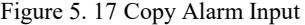

- **3.** Edit the Alarm triggered record in the Record/Capture Schedule setting interface. For the detailed information of schedule configuration, see *Chapter Configuring Recording Schedule.*
## **5.5 Manual Recording**

#### *Purpose:*

Follow the steps to set parameters for the manual recording and continuous capture. Using manual recording and continuous capture, you need to manually cancel the record and capture. The manual recording and manual continuous capture is prior to the scheduled recording and capture.

#### *Steps:*

- **1.** Enter the Manual settings interface.
Menu> Manual

Or press the **REC/SHOT** button on the front panel.

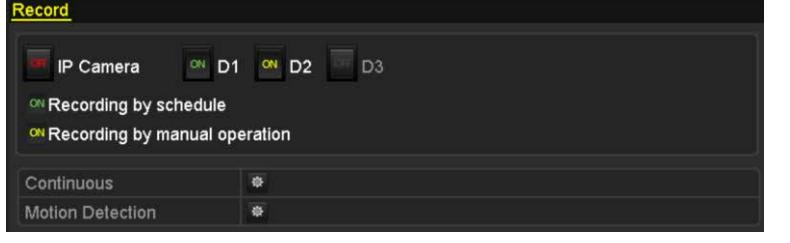

Figure 5. 18 Manual Record

- **2.** Enable the Manual Recording.
	- 1) Select **Record** on the left bar.
	- 2) Click the status button before camera number to change to .
- **3.** Disable manual record.

Click the status button to change to .


Green icon means that the channel is configured the record schedule. After rebooting, all the manual records enabled will be canceled.

## **5.6 Configuring Holiday Recording**

#### *Purpose:*

Follow the steps to configure the record or capture schedule on holiday for that year. You may want to have different plan for recording and capture on holiday.

#### *Steps:*

- **1.** Enter the Record setting interface.
Menu > Record > Holiday

|     | Holiday Settings |                |                        |           |
|-----|------------------|----------------|------------------------|-----------|
| No. | Holiday Name     | Status         | Start Date<br>End Date | Edit<br>A |
| 1   | Holiday1         | Disabled 1.Jan | 1 .Jan                 | M         |
| 2   | Holiday2         | Disabled 1.Jan | 1.Jan                  | 1         |
| 3   | Holiday3         | Disabled 1.Jan | 1 Jan                  | 18        |
| র্ব | Holiday4         | Disabled 1.Jan | 1 Jan                  | 1         |
| 5   | Holiday5         | Disabled 1.Jan | 1 Jan                  | 14        |
| 6   | Holiday6         | Disabled 1.Jan | 1.Jan                  | 1         |
| 7   | Holiday7         | Disabled 1.Jan | 1.Jan                  | 1         |
| 8   | Holiday8         | Disabled 1.Jan | 1.Jan                  | 1<br>V    |
|     |                  |                |                        |           |

Figure 5. 19 Holiday Settings

- **2.** Enable Edit Holiday schedule.
	- 1) Click to enter the Edit interface.

|              |          | Edit  |     |    |     |        |
|--------------|----------|-------|-----|----|-----|--------|
| Holiday Name | Holiday1 |       |     |    |     |        |
| Enable       | D        |       |     |    |     |        |
| Mode         | By Week  |       |     |    |     |        |
| Start Date   | Jan      | <     | 1st | <  | Sun | <      |
| End Date     | Jan      | 6     | 1st | <  | Sun |        |
|              |          |       |     |    |     |        |
|              |          | Apply |     | OK |     | Cancel |

Figure 5. 20 Edit Holiday Settings

- 2) Check the checkbox after **Enable Holiday**.
- 3) Select Mode from the dropdown list.
	- There are three different modes for the date format to configure holiday schedule.
- 4) Set the start and end date.
- 5) Click **Apply** to save settings.
- 6) Click **OK** to exit the Edit interface.
- **3.** Enter Record/Capture Schedule settings interface to edit the holiday recording schedule. See *Chapter 6.2 Configuring Recording Schedule.*

## **5.7 Configuring Redundant Recording**

#### *Purpose:*

Enabling redundant recording and capture, which means saving the record files and captured pictures not only in the R/W HDD but also in the redundant HDD, will effectively enhance the data safety and reliability. .

#### *Steps:*

- **1.** Enter HDD Information interface.
Menu > HDD

|      | HDD Information  |        |          |       |                         |    |   |    |
|------|------------------|--------|----------|-------|-------------------------|----|---|----|
|      | Capacity         | Status | Property | Type  | Free Space Gr  Edit Del |    |   |    |
| - 18 | 1863.02GB Normal |        | RAN      | Local | OMB                     | 11 | A | 10 |
| 3    | 1863.02GB Normal |        | RAN      | Local | 1842.00GB 1             |    | 动 | m  |

Figure 5. 21 HDD General

- **2.** Select the **HDD** and click to enter the Local HDD Settings interface.
	- 1) Set the HDD property to Redundancy.

|              |          |                                                        | Local HDD Settings |    |        |
|--------------|----------|--------------------------------------------------------|--------------------|----|--------|
| HDD No.      |          | 3                                                      |                    |    |        |
| HDD Property |          |                                                        |                    |    |        |
| ORW          |          |                                                        |                    |    |        |
| · Read-only  |          |                                                        |                    |    |        |
| @ Redundancy |          |                                                        |                    |    |        |
| Group        | 01<br>09 | 02 03 04 05 06 07 08<br>. 10 . 11 . 12 . 13 14 . 15 16 |                    |    |        |
| HDD Capacity |          | 76,319MB                                               |                    |    |        |
|              |          |                                                        |                    |    |        |
|              |          |                                                        | Apply              | OK | Cancel |

Figure 5. 22 HDD General-Editing

- 2) Click **Apply** to save the settings.
- 3) Click **OK** to back to the upper level menu.


You must set the Storage mode in the HDD advanced settings to Group before you set the HDD property to Redundant. For detailed information, please refer to *Chapter 11.4.1 Setting HDD Property*. There should be at least another HDD which is in Read/Write status.

- **3.** Enter the Record setting interface.
- Menu> Record> Parameters
	- 1) Select **Record** tab**.**
	- 2) Click **More Settings** to enter the following interface.

|                    | More Settings |    |      |
|--------------------|---------------|----|------|
| Pre-record         | 5s            |    | >    |
| Post-record        | 5s            |    | 4    |
| Expired Time (day) | 0             |    |      |
| Redundant Record/  | D             |    |      |
| Record Audio       | 2             |    |      |
| Video Stream       | Main Stream   |    |      |
|                    |               |    |      |
|                    |               | OK | Back |

Figure 5. 23 Record Parameters

- 3) Select Camera you want to configure in the drop-down list.
- 4) Check the checkbox of **Redundant Record/Capture**.
- 5) Click **OK** to save settings and back to the upper level menu.

Repeat the above steps for configuring other channels.

## **5.8 Configuring HDD Group for Recording**

#### *Purpose:*

You can group the HDDs and save the record files and captured pictures in certain HDD group.

#### *Steps:*

- **1.** Enter HDD setting interface.
Menu > HDD

|   | HDD Information  |        |          |       |                         |     |   |     |
|---|------------------|--------|----------|-------|-------------------------|-----|---|-----|
|   | Capacity         | Status | Property | Type  | Free Space Gr  Edit Del |     |   |     |
| 1 | 1863.02GB Normal |        | RMV      | Local | OMB                     | 1 1 |   | 111 |
| 3 | 1863.02GB Normal |        | RMV      | Local | 1842.00GB 1             |     | 1 | m   |

Figure 5. 24 HDD General

- **2.** Select **Advanced** on the left side menu.

| Mode                |              | Group |                                                                            |  |  |  |
|---------------------|--------------|-------|----------------------------------------------------------------------------|--|--|--|
| Record on HDD Group | 11           |       |                                                                            |  |  |  |
| IP Camera           | V D1<br>v D9 |       | ZD2 ZD3 ZD4 ZD5 ZD6 ZD6 ZD7 ZDB<br>ZD10 ZD11 ZD12 ZD13 ZD13 ZD14 ■D15 ■D16 |  |  |  |
|                     |              |       |                                                                            |  |  |  |

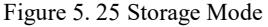

Check whether the storage mode of the HDD is Group. If not, set it to Group. For detailed information, please refer to *Chapter 14.4 Managing HDD Group.*

- **3.** Select **General** in the left side menu
- **4.** Click to enter editing interface.
- **5.** Configuring HDD group.
	- 1) Choose a group number for the HDD group.
	- 2) Click **Apply** and then in the pop-up message box, click **Yes** to save your settings.
	- 3) Click **OK** to back to the upper level menu.
	- Repeat the above steps to configure more HDD groups.
- **6.** Choose the Channels which you want to save the record files and captured pictures in the HDD group.
	- 1) Select **Advanced** on the left bar.
	- 2) Choose Group number in the dropdown list of Record **on HDD Group**
	- 3) Check the channels you want to save in this group.
	- 4) Click **Apply** to save settings.


After having configured the HDD groups, you can configure the recording settings following the procedure provided in *Chapter 5.2 to 5.7.*

## **5.9 Files Protection**

#### *Purpose:*

You can lock the recording files or set the HDD property to Read-only to protect the record files from being overwritten.

### **5.9.1 Locking the Recording Files**

#### **Lock File when Playback**

#### *Steps:*

- **1.** Enter Playback interface. Menu> Playback
- **2.** Check the checkbox of channel(s) in the channel list and then double-click to select a date on the calendar.

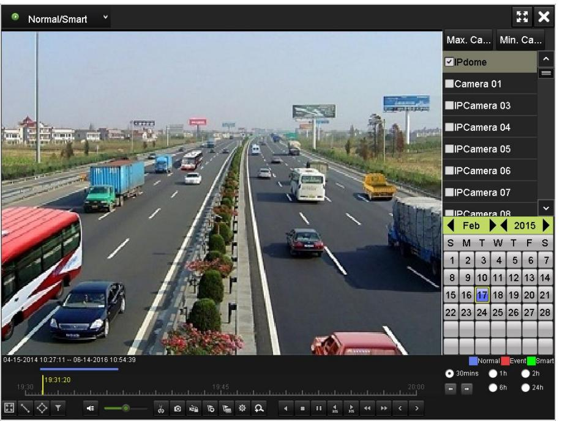

Figure 5. 26 Normal Playback

- **3.** During playback, click the button to lock the current recording file.


In the multi-channel playback mde, clicking the button will lock all the record files related to the playback channels.

- **4.** You can click the button to pop up the file management interface. Click the **Locked File** tab to check and export the locked files.

|                 |                                 |             | File Management |           |                                    |                                            |
|-----------------|---------------------------------|-------------|-----------------|-----------|------------------------------------|--------------------------------------------|
| Video Clips     | Playback Capture                | Locked File | Tag             |           |                                    |                                            |
|                 | Cam  Start/End Time             |             |                 | Size Lock |                                    |                                            |
| ID3             | 12-17-2013 17:49:51--20:24:12   |             | 199,971KB       |           |                                    |                                            |
| D4              | 12-17-2013 17:49:51--20:24:12   |             | 199.628KB       | C         |                                    |                                            |
| D7              | 12-17-2013 17:49:51--- 20:24:12 |             | 123,343KB       |           |                                    |                                            |
| D7              | 12-25-2013 17:13:48--17:32:22   |             | 45,401KB        |           |                                    |                                            |
| D7              | 12-26-2013 14:37:54--15:39:52   |             | 242,565KB A     |           |                                    |                                            |
| Total: 5 P: 1/1 |                                 |             |                 |           | HDD: 4<br>Start time:<br>End time: | 12-17-2013 17:49:51<br>12-17-2013 20:24:12 |
| Total size: OMB |                                 |             | Export All      |           |                                    |                                            |

Figure 5. 27 Locked File Management

In the File Management interface, you can also click to change it to to unlock the file and the file is not protected.

#### **Lock File when Export**

#### *Steps:*

- **1.** Enter Export setting interface.
Menu> Export

| Normal                   |            |            |      |             |             |                                            |           |       |   |  |
|--------------------------|------------|------------|------|-------------|-------------|--------------------------------------------|-----------|-------|---|--|
| IP Camera                | VD1        | VD2        | VD3  | V D4        | VD5         | V De                                       | V D7      | V D8  | > |  |
|                          | VD9        | VD10       | VD11 | VD12        | 2 D13       | VD14                                       | D D15     | VD16  |   |  |
|                          | V D17      | ~ D18      |      | 2 D19 7 D20 | VD21        |                                            | DD22 ZD23 | V D24 |   |  |
|                          | VD25       | VD26       |      | DD27 ZD28   |             | D29 ZD30                                   | ZD31      | FD32  |   |  |
|                          | VD33       | V D34      |      | 2 D35 2 D36 | 2 D37       | V D38                                      | 2 D39     | V D40 |   |  |
|                          | DA1        | V D42      |      | D43 DD44    | DA5         | VD46                                       | V D47     | JD48  |   |  |
|                          | VD49       | > D50      |      | D51 DD52    |             | D53 2D54 7 D55                             |           | V D56 | > |  |
| Start/End time of record |            |            |      |             |             | 04-13-2014 08:58:12 -- 06-14-2016 10:54:39 |           |       |   |  |
| Record Type              |            | All        |      |             |             |                                            |           |       |   |  |
| File Type                |            | All        |      |             |             |                                            |           |       |   |  |
| Start Time               | 02-18-2015 |            |      |             | 00:00:00:00 |                                            |           | 0     |   |  |
| End Time                 |            | 02-18-2015 |      |             |             | 23:59:59                                   |           |       | 9 |  |
|                          |            |            |      |             |             |                                            |           |       |   |  |

Figure 5. 28 Export

- **2.** Select the channels you want to search by checking the checkbox to .
- **3.** Configure the record type, file type start/end time.
- **4.** Click **Search** to show the results.

| Chart<br>List   |                        | Search result |            |                |
|-----------------|------------------------|---------------|------------|----------------|
| Camera No.      | Start/End Time         | Size Play     | Lock       |                |
| D1              | 01-14-2015 22:15:23 -- | 911.85MB Q    | 新闻         |                |
| ID1             | 01-15-2015 21:13:32 -- | 102.70MB @    | 8          |                |
| 101             | 01-15-2015 21:29:17 -- | 1015.12MB @   | 8          |                |
| ID1             | 01-15-2015 23:38:04 -- | 392.59MB @    | S          |                |
| 101             | 01-16-2015 13:58:10 -- | 358.37MB @    | 9          |                |
| ID1             | 01-20-2015 19:37:34 -- | 177.97MB @    | 9          |                |
| Total: 6 P: 1/1 |                        |               |            |                |
|                 |                        |               |            |                |
| Total size: 0B  |                        |               | Export All | Export<br>Back |

Figure 5. 29 Export- Search Result

- **5.** Protect the record files.
	- 1) Find the record files you want to protect, and then click the icon which will turn to , indicating that the file is locked.

The record files of which the recording is still not completed cannot be locked.

- 2) Click to change it to to unlock the file and the file is not protected.
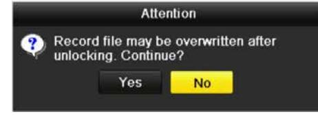

Figure 5. 30 Unlocking Attention

### **5.9.2 Setting HDD Property to Read-only**

*Steps:*

- **1.** Enter HDD setting interface.
Menu> HDD

|      | HDD Information  |        |          |       |                         |   |   |       |
|------|------------------|--------|----------|-------|-------------------------|---|---|-------|
| Lass | Capacity         | Status | Property | Type  | Free Space Gr  Edit Del |   |   |       |
| 1    | 1863.02GB Normal |        | RAN      | Local | OMB                     | 1 | 1 | 1 1 m |
| 3    | 1863.02GB Normal |        | RAV      | Local | 1842.00GB 1             |   | 1 | m     |

Figure 5. 31 HDD General

- **2.** Click to edit the HDD you want to protect.

|              |          |                              | Local HDD Settings |       |                      |  |        |
|--------------|----------|------------------------------|--------------------|-------|----------------------|--|--------|
| HDD No.      |          | 5                            |                    |       |                      |  |        |
| HDD Property |          |                              |                    |       |                      |  |        |
| ORW          |          |                              |                    |       |                      |  |        |
| · Read-only  |          |                              |                    |       |                      |  |        |
| · Redundancy |          |                              |                    |       |                      |  |        |
| Group        | 01<br>09 | . 10 . 11 . 12 13 14 . 15 16 |                    |       | 02 03 04 05 06 07 08 |  |        |
| HDD Capacity |          | 931.51GB                     |                    |       |                      |  |        |
|              |          |                              |                    |       |                      |  |        |
|              |          |                              |                    | Apply | OK                   |  | Cancel |

Figure 5. 32 HDD General- Editing


To edit HDD property, you need to set the storage mode of the HDD to Group. See *Chapter Managing HDD Group.*

- **3.** Set the HDD property to Read-only.
- **4.** Click **OK** to save settings and back to the upper level menu.


- You cannot save any files in a Read-only HDD. If you want to save files in the HDD, change the property to R/W.
- If there is only one HDD and is set to Read-only, the NVR can't record any files. Only live view mode is available.
- If you set the HDD to Read-only when the NVR is saving files in it, then the file will be saved in next R/W HDD. If there is only one HDD, the recording will be stopped.

# **Chapter 6 Playback**

## **6.1 Playing Back Record Files**

### **6.1.1 Instant Playback**

#### *Purpose:*

Play back the recorded video files of a specific channel in the live view mode. Channel switch is supported.

#### **Instant playback by channel**

*Steps:* 

Choose a channel in live view mode and click the button in the quick setting toolbar.


In the instant playback mode, only record files recorded during the last five minutes on this channel will be played back.

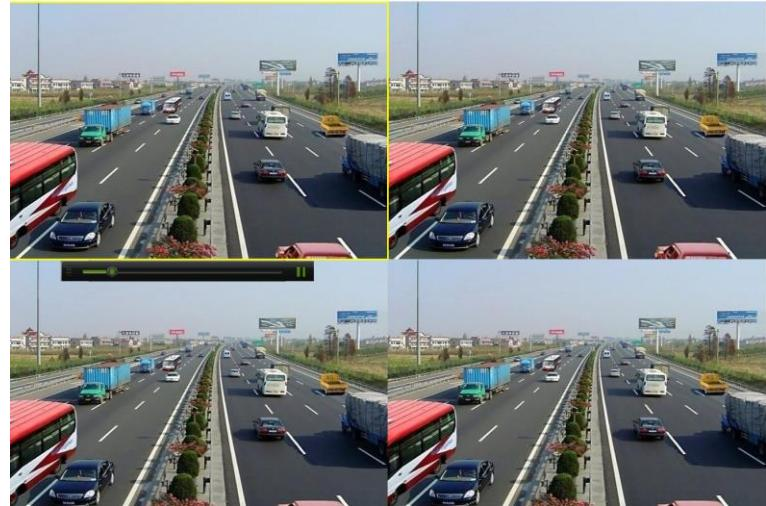

Figure 6. 1 Instant Playback Interface

### **6.1.2 Playing Back by Normal Search**

### **Playback by Channel**

Enter the Playback interface.

right click a channel in live view mode and select Playback from the menu, as shown in Figure 6. 2.

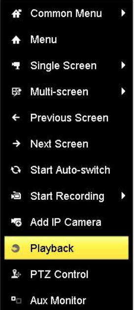

Figure 6. 2 Right-click Menu under Live View


Pressing numerical buttons will switch playback to the corresponding channels during playback process.

### **Playback by Time**

#### *Purpose:*

Play back video files recorded in specified time duration. Multi-channel simultaneous playback and channel switch are supported.

#### *Steps:*

- **1.** Enter playback interface.
Menu>Playback

- **2.** Check the checkbox of channel(s) in the channel list and then double-click to select a date on the calendar.

|    | Jan   |   |          |                | 2016  |    |
|----|-------|---|----------|----------------|-------|----|
| S  |       |   | MTWT     |                | F     | S  |
|    |       |   |          |                | 1     | 2  |
| 3  | 4     | 5 | 6        | 7              | 8     | 9  |
| 10 |       |   | 11 12 13 | 14             | 15    | 16 |
| 17 | 18 19 |   |          | 20 21          | 22 23 |    |
| 24 |       |   |          | 25 26 27 28 29 |       | 30 |
| 31 |       |   |          |                |       |    |

Figure 6. 3 Playback Calendar


If there are record files for that camera in that day, in the calendar, the icon for that day is displayed as .

Otherwise it is displayed as

### **Playback Interface**

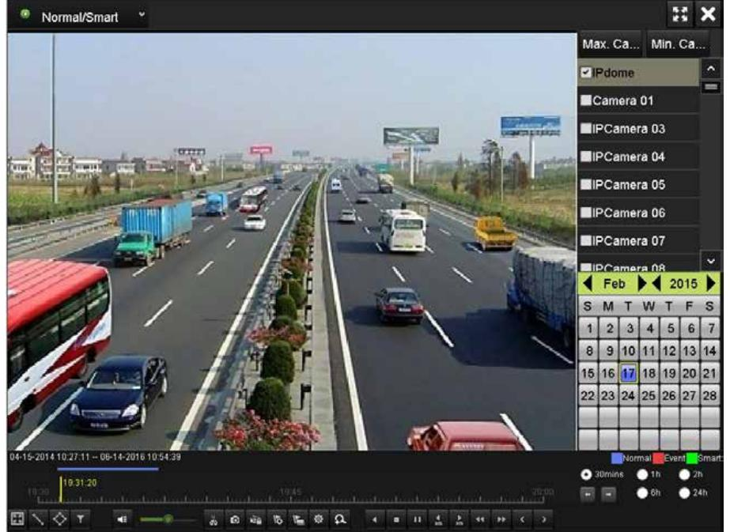

You can use the toolbar in the bottom part of Playback interface to control playing progress.

Figure 6. 4 Playback Interface

Click the channel(s) to execute simultaneous playback of multiple channels.

|  |  | 03-22-2016 17:24:02 -- 01-18-2016 11:36:12   |                                                                                                                                                                               |  |  |  |  |  |  |  |     |  | Normal Event Smar  |  |
|--|--|----------------------------------------------|-------------------------------------------------------------------------------------------------------------------------------------------------------------------------------|--|--|--|--|--|--|--|-----|--|--------------------|--|
|  |  | Free of Concession Concessional Concessional | 11:38:14                                                                                                                                                                      |  |  |  |  |  |  |  |     |  | @ 30mins @ 1h @ 2h |  |
|  |  |                                              | 1130 - 1130 - 11 - 11 - 1 - 1 - 1 - 1 - 1 - 1 - 1 - - - - - - - - - - - - - - - - - - - - - - - - - - - - - - - - - - - - - - - - - - - - - - - - - - - - - - - - - - - - - - |  |  |  |  |  |  |  |     |  |                    |  |
|  |  |                                              | 因人令了 在 -- 0- % 回编 吃 版 我 。 《 ■ Ⅱ 品 品 (( ) < >                                                                                                                                  |  |  |  |  |  |  |  | CGG |  |                    |  |

- Figure 6. 5 Toolbar of Playback


- The indicates the start/end time of the recorded video files.
- The color indicates the smart playback time bar and the color indicates the normal playback time bar.
- Playback progress bar: use the mouse to click any point of the progress bar or drag the progress bar to locate specific frames.

| Item            | Button | Operation                  | Button | Operation                     |
|-----------------|--------|----------------------------|--------|-------------------------------|
|                 |        | Set full screen for motion |        | Draw line for the line        |
| Smart<br>Search |        | detection                  |        | crossing detection            |
|                 |        | Draw quadrilateral for the |        | Filter video files by setting |
|                 |        | intrusion detection        |        | the target characters         |
| Operations      | /      | Audio on/Mute              | /      | Start/Stop clipping           |
|                 |        | Capture Picture            |        | Lock File                     |
|                 |        | Add default tag            |        | Add customized tag            |

Table 6. 1 Detailed Explanation of Playback Toolbar

| Item                   | Button | Operation                                                                          | Button | Operation                                    |  |  |
|------------------------|--------|------------------------------------------------------------------------------------|--------|----------------------------------------------|--|--|
|                        |        | File management for<br>video clips, captured<br>pictures, locked files and<br>tags |        | Digital Zoom                                 |  |  |
|                        | /      | Pause/Play                                                                         | /      | Reverse play/ Pause                          |  |  |
|                        |        | Slow forward                                                                       |        | Stop                                         |  |  |
| Playing                |        | 30s forward                                                                        |        | 30s reverse                                  |  |  |
| Control                |        | Next day                                                                           |        | Fast forward                                 |  |  |
|                        |        | Previous day                                                                       |        |                                              |  |  |
|                        |        | Previous/Next period                                                               |        | Play the time bar in 30<br>minutes (default) |  |  |
| Time<br>Bar<br>Scaling |        | Play the time bar in 1<br>hour                                                     |        | Play the time bar in 2 hours                 |  |  |
|                        |        | Play the time bar in 6<br>hours                                                    |        | Play the time bar in 24<br>hours             |  |  |


The playing speed of 256X is supported.

### **6.1.3 Playing back by Smart Playback**

#### *Purpose:*

The smart playback function provides an easy way to get through the less effective information. When you select the smart playback mode, the system will analyze the video containing the motion or VCA information, mark it with green color and play it in the normal speed while the video without motion will be played in the 16-time speed. The smart playback rules and areas are configurable.

#### *Before you start:*

To get the smart search result, the corresponding event type must be enabled and configured on the IP camera. Here we take the intrusion detection as an example.

- **1.** Log in the IP camera by the web browser, and enable the intrusion detection by checking the checkbox of it. You may enter the motion detection configuration interface by Configuration> Advanced Configuration> Events> Intrusion Detection.
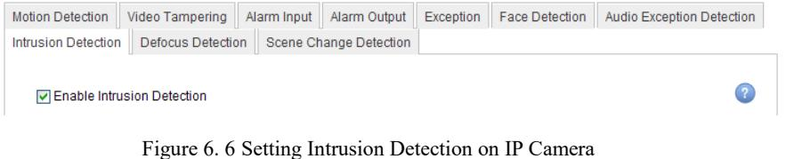

- **2.** Configure the required parameters of intrusion detection, including area, arming schedule and linkage methods. Refer to the user manual of smart IP camera for detailed instructions.
- **1.** Enter Playback interface.
Menu>Playback

- **2.** Select the **Normal/Smart** in the drop-down list on the top-left side.
- **3.** Select a camera in the camera list.
- **4.** Select a date in the calendar and click the button on the left toolbar to play the video file.

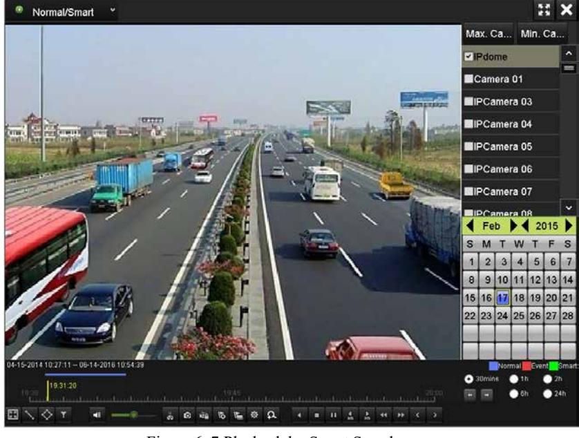

Figure 6. 7 Playback by Smart Search

- **5.** Click the status bar to switch to the playback by smart search interface.
- **6.** Set the rules and areas for smart search of line crossing detection, intrusion detection or motion detection event triggered recording.

**Full Screen Motion/Intrusion Detection** 

Click the to set the full-screen full screen as the detection area.

- **Line Crossing Detection**
Select the button , and click on the image to specify the start point and end point of the line.

- **Intrusion Detection**
Click the button, and specify 4 points to set a quadrilateral region for intrusion detection. Only one

region can be set.

- **Motion Detection**
Click the button and then click and draw the mouse to set the detection area manually. You can also

click the button to set the full screen as the detection area.

- **7.** Click to search and play the matched video files.
- **8.** (Optional) You can click to filter the searched video files by setting the target characters, including the gender and age of the human and whether he/she wears glasses.

| > |
|---|
| < |
| > |
|   |

Figure 6. 8 Set Result Filter

### **6.1.4 Playing Back by Event Search**

#### *Purpose:*

Play back record files on one or several channels searched out by event type (e.g., alarm input, motion detection and VCA).

*Steps:* 

- **1.** Enter the Playback interface.
Menu>Playback

- **2.** Select the **Event** in the drop-down list on the top-left side.
- **3.** Select the major type to **Alarm Input**, **Motion** or **VCA** as the event type.


We take playback by VCA as the example in the following instrucions.

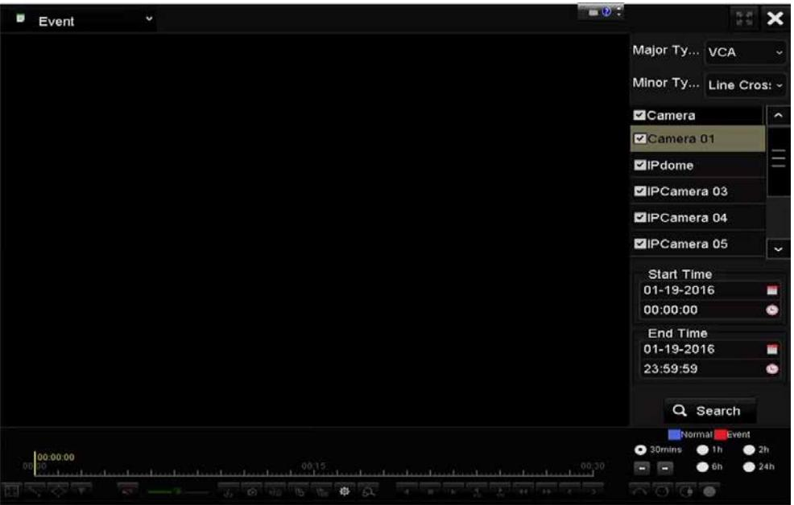

Figure 6. 9 Event Search Interface

- **4.** Select the minor type of VCA from the drop-down list. (Please refer to *Chapter 9 VCA Alarm* for the details of VCA detection types).


For configuring the VCA recording, please refer to Chapter *5.2 Configuring Recording Schedule*; and for details of VCA detection types, please refer to *Chapter 9 VCA Alarm*.

- **5.** Select the camera (s) for searching, and set the Start time and End time.
- **6.** Click **Search** button to get the search result information. You may refer to the right-side bar for the result.
- **7.** Select a result item and click button to play back the file.
- 

Pre-play and post-play can be configured.

- **8.** Enter the Synch Playback interface to select the camera (s) for synchronous playback.
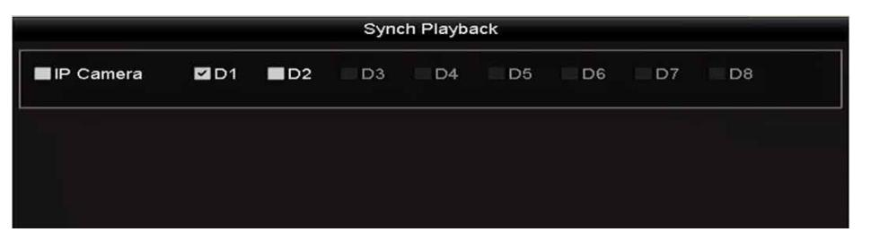

Figure 6. 10 Synch Playback Interface

- **9.** Enter the playback interface.
The toolbar in the bottom part of playback interface can be used to control playing process.

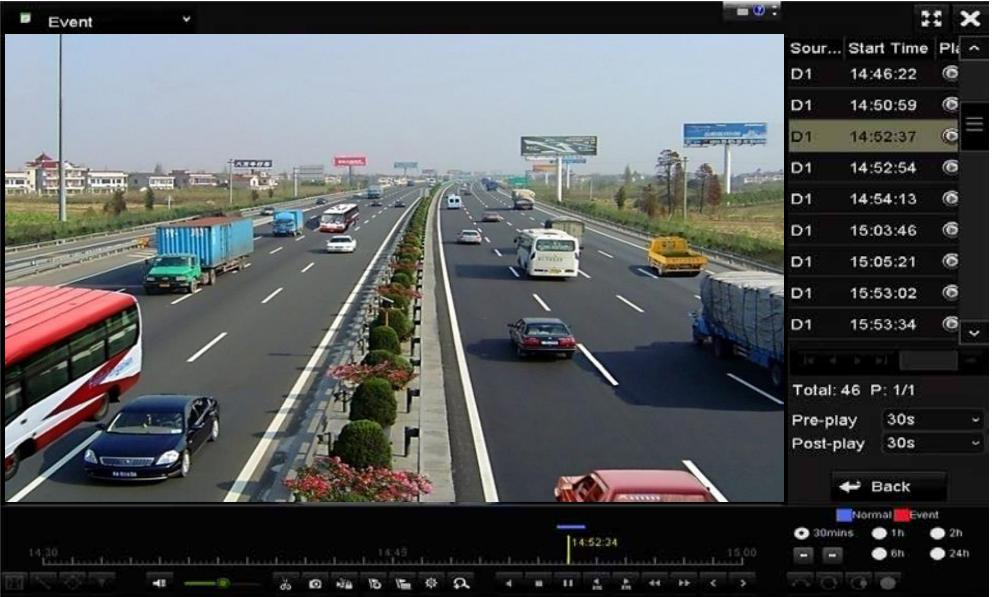

Figure 6. 11 Interface of Playback by Event

You can click or button to select the previous or next event. Please refer to Table 6.1 for the description of buttons on the toolbar.

### **6.1.5 Playing Back by Tag**

#### *Purpose:*

Video tag allows you to record related information like people and location of a certain time point during playback. You can use video tag(s) to search for record files and position time point.

#### *Before playing back by tag:*

- **1.** Enter Playback interface.
Menu>Playback

- **2.** Search and play back the record file(s). Refer to *Chapter 6.1.1 Instant Playback* for the detailed information about searching and playback of the record files.
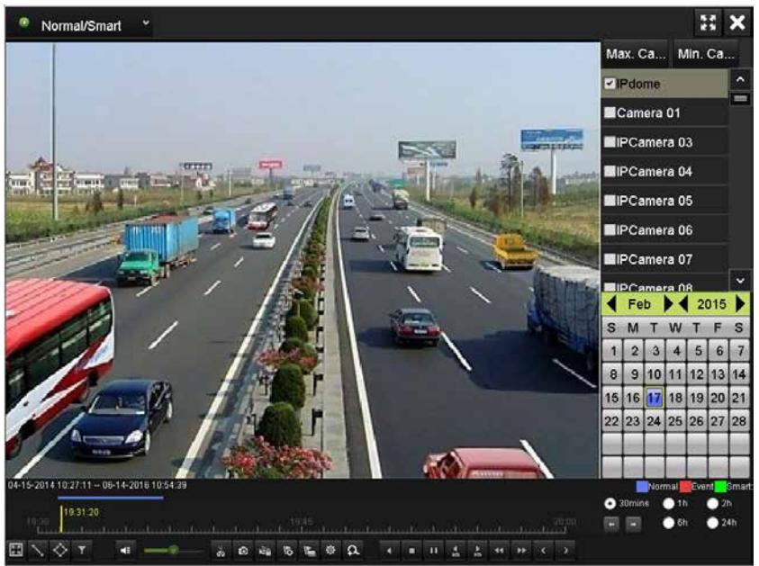

Figure 6. 12 Interface of Playback by Time

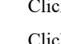

Click button to add default tag.

Click button to add customized tag and input tag name.


Max. 64 tags can be added to a single video file.

- **3.** Tag management.
Click button to enter the File Management interface and click **Tag** to manage the tags. You can check, edit, and delete tag(s).

|                 |     |                  |             | File Management     |      |        |
|-----------------|-----|------------------|-------------|---------------------|------|--------|
| Video Clips     |     | Playback Capture | Locked File | Tag                 |      |        |
| Cam             |     | Tag Name         | Time        |                     | Edit | Delete |
| D1              | TAG |                  |             | 01-19-2016 09:31:03 | 12   | or     |
| D2              | TAG |                  |             | 01-19-2016 09:31:03 | 17   | m      |
| D1              | 1A  |                  |             | 01-19-2016 09:31:04 | 12   | m      |
| D2              | 1A  |                  |             | 01-19-2016 09:31:04 | 12   | m      |
|                 |     |                  |             |                     |      |        |
| Total: 4 P: 1/1 |     |                  |             |                     |      |        |
|                 |     |                  |             |                     |      | Cancel |

Figure 6. 13 Tag Management Interface

#### **Playing back by Tag**

- **1.** Select the **Tag** from the drop-down list in the Playback interface.
- **2.** Choose channels, edit start time and end time, and then click **Search** to enter Search Result interface.

| Tag<br>V            |                     |      |
|---------------------|---------------------|------|
|                     | Camera              | A    |
|                     | Camera 01           |      |
|                     | AlPdome             |      |
|                     | ZIPCamera 03        |      |
|                     | IPCamera 04         |      |
|                     | IPCamera 05         |      |
|                     | IPCamera 06         |      |
|                     | IPCamera 07         | V    |
|                     | Keyword             |      |
|                     | Start Time          |      |
|                     | 01-19-2016          | 1    |
|                     | 00:00:00            | 0    |
|                     | End Time            |      |
|                     | 01-20-2016          | 1    |
|                     | 23:59:59            | C    |
|                     | Q Search            |      |
|                     | Normal Event        |      |
| 00:00:00            | C 30mins<br>1 1 1 1 | @ 2h |
|                     | Gh<br>0<br>1975     | 24h  |
| 给 97<br>W The<br>10 |                     |      |

Figure 6. 14 Interface of Playback by Tag


**3.** Click button to play back the selected tag file. You can click the **Back** button to back to the search interface.

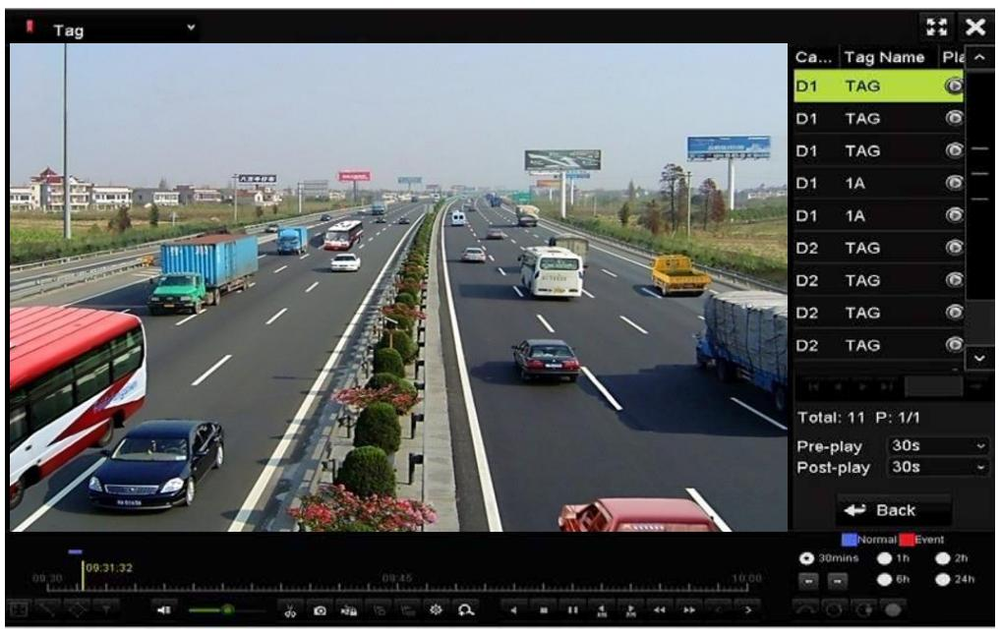

Figure 6. 15 Interface of Playback by Tag

Pre-play and post-play can be configured.

You can click or button to select the previous or next tag. Please refer to Table 6.1 for the description of buttons on the toolbar.

### **6.1.6 Playing Back by Sub-periods**

#### *Purpose:*

The video files can be played in multiple sub-periods simultaneously on the screens.

#### *Steps:*

- **1.** Enter Playback interface.
Menu>Playback

- **2.** Select **Sub-periods** from the drop-down list in the upper-left corner of the page to enter the Sub-periods Playback interface.
- **3.** Select a date and start playing the video file.
- **4.** Select the Split-screen Number from the dropdown list. Up to 16 screens are configurable.

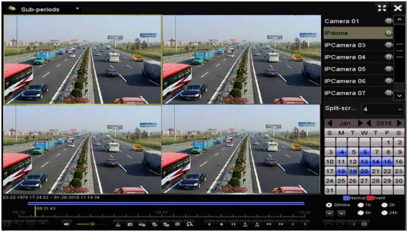

Figure 6. 16 Interface of Sub-periods Playback


According to the defined number of split-screens, the video files on the selected date can be divided into average segments for playback. E.g., if there are video files existing between 16:00 and 22:00, and the 6-screen display mode is selected, then it can play the video files for 1 hour on each screen simultaneously.

### **6.1.7 Playing Back by System Logs**

#### *Purpose:*

Play back record file(s) associated with channels after searching system logs.

- **1.** Enter Log Information interface. Menu>Maintenance>Log Information
- **2.** Click **Log Search** tab to enter Playback by System Logs. Set search time and type and click **Search** button.

| Log Search                            |                                   |            |          |      |  |  |
|---------------------------------------|-----------------------------------|------------|----------|------|--|--|
| Start Time                            | 27-01-2015                        | 0          | 00:00:00 | 0    |  |  |
| End Time                              | 28-01-2015                        | 1          | 23:59:59 | C    |  |  |
| Major Type                            | All                               |            |          | C    |  |  |
| Minor Type                            |                                   |            |          | <    |  |  |
| Alarm Input                           |                                   |            |          |      |  |  |
| Alarm Output                          |                                   |            |          |      |  |  |
| Motion Detection Started              |                                   |            |          |      |  |  |
| Motion Detection Stopped              |                                   |            |          |      |  |  |
| Video Tampering Detection Started     |                                   |            |          |      |  |  |
|                                       | Video Tampering Detection Stopped |            |          |      |  |  |
| Line Crossing Detection Alarm Started |                                   |            |          |      |  |  |
| Line Crossing Detection Alarm Stopped |                                   |            |          |      |  |  |
| Intrusion Detection Alarm Started     |                                   |            |          |      |  |  |
|                                       |                                   |            |          |      |  |  |
|                                       |                                   | Export All | Search   | Back |  |  |

Figure 6. 17 System Log Search Interface

- **3.** Choose a log with record file and click button to enter Playback interface.


If there is no record file at the time point of the log, the message box "No result found" will pop up.

| Search Result |                   |                                           |                     |                |    |         |   |  |
|---------------|-------------------|-------------------------------------------|---------------------|----------------|----|---------|---|--|
| No.           | Major Type        | Time                                      | Minor Type          | Parameter Play |    | Details | A |  |
| 11            | A Exception       | 27-01-2015 10:02:58 HDD Error             |                     | N/A            |    | S       |   |  |
| 2             | Exception         | 27-01-2015 10:02:58 HDD Error             |                     | N/A            |    | 0       |   |  |
| 3             | Exception         | 27-01-2015 10:02:58 HDD Error             |                     | N/A            |    | 0       |   |  |
| 4             | T Operation       | 27-01-2015 10:03:00 Abnormal Shutd  N/A   |                     |                |    | 0       |   |  |
| 5             | T Operation       | 27-01-2015 10:03:01 Power On              |                     | N/A            |    | 0       |   |  |
| 6             | Exception         | 27-01-2015 10:03:13 Record/Capture  N/A   |                     |                | O  | 0       |   |  |
| 7             | Exception         | 27-01-2015 10:03:13                       | Record/Capture  N/A |                | O  | 0       |   |  |
| 8             | A Exception       | 27-01-2015 10:03:13                       | Record/Capture  N/A |                | 0  | 0       |   |  |
| 9             | T Operation       | 27-01-2015 11:06:34 Local Operation : N/A |                     |                |    | 0       |   |  |
| 10            | Exception         | 27-01-2015 11:07:36 HDD Error             |                     | N/A            |    | S       |   |  |
|               | Total: 417 P: 1/5 |                                           |                     |                | DI |         | + |  |
|               |                   |                                           |                     |                |    |         |   |  |
|               |                   |                                           |                     | Export         |    | Back    |   |  |

Figure 6. 18 Result of System Log Search

- **4.** Playback interface.
The toolbar in the bottom part of Playback interface can be used to control playing process.

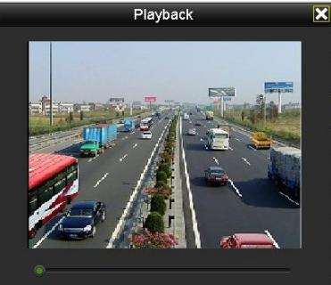

Figure 6. 19 Interface of Playback by Log

### **6.1.8 Playing Back External File**

#### *Purpose:*

Perform the following steps to look up and play back files in the external devices.

#### *Steps:*

- **1.** Enter Tag Search interface. Menu>Playback
- **2.** Select the **External File** in the drop-down list on the top-left side.

The files are listed in the right-side list.

You can click the button to refresh the file list.

- **3.** Select and click the button to play back it. And you can adjust the playback speed by clicking and .
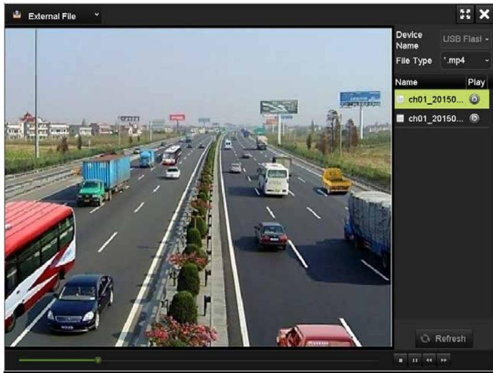

Figure 6. 20 Interface of External File Playback

### **6.1.9 Playing Back Pictures**

#### *Purpose:*

The captured pictures stored in the HDDs of the device can be searched and viewed.

#### *Steps:*

**1.** Enter Playback interface.

Menu > Playback

- **2.** Select **Picture** from the drop-down list in the upper-left corner of the page to enter the Picture Playback interface.
- **3.** Check checkbox to select the channel(s) and specify the start time and end time for search.
- **4.** Click **Search** to enter Search Result interface.

Up to 4000 pictures can be displayed each time.

- **5.** Choose a picture you want to view and click button. You can click **Back** to return to the search interface.
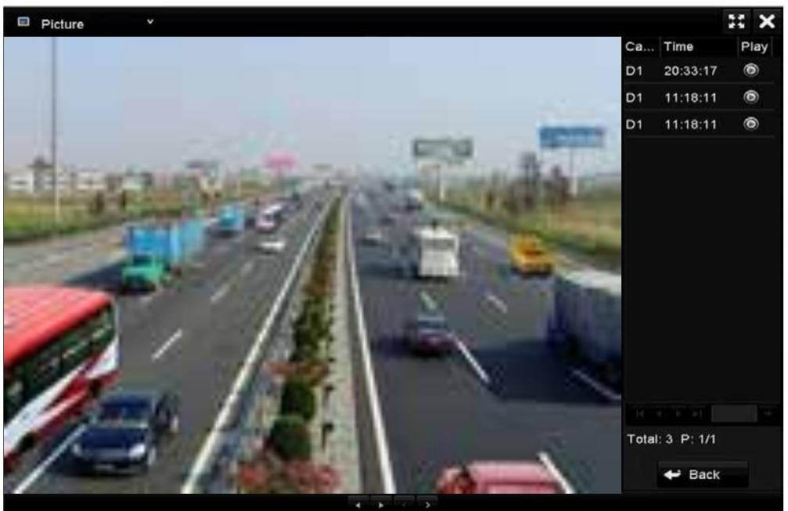

Figure 6. 21 Result of Picture Playback

- **6.** The toolbar in the bottom part of Playback interface can be used to control playing process.


Figure 6. 22 Picture Playback Toolbar

|        | Table 1. 1 Detailed Explanation of Picture-playback Toolbar |        |          |        |                     |        |              |  |  |  |  |
|--------|-------------------------------------------------------------|--------|----------|--------|---------------------|--------|--------------|--|--|--|--|
| Button | Function                                                    | Button | Function | Button | Function            | Button | Function     |  |  |  |  |
|        | Play reverse                                                |        | Play     |        | Previous<br>picture |        | Next picture |  |  |  |  |

## **6.2 Auxiliary Functions of Playback**

### **6.2.1 Playing Back Frame by Frame**

#### *Purpose:*

Play video files frame by frame, in case of checking image details of the video when abnormal events happen.

#### *Steps:*

Go to Playback interface.

If you choose playback of the record file: click button until the speed changes to Single frame and one click on the playback screen represents playback of one frame.

If you choose reverse playback of the record file: click button until the speed changes to Single frame and one click on the playback screen represents reverse playback of one frame. It is also feasible to use button in toolbar.

### **6.2.2 Thumbnails View**

With the thumbnails view on the playback interface, you can conveniently locate the required video files on the time bar.

- **1.** Enter the playback interface and start to play the video files.
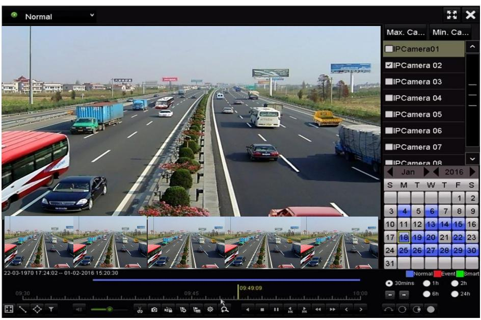

Figure 6. 23 Thumbnails View

- **2.** Move the mouse to the time bar to get the preview thumbnails of the video files. Select and double click on a required thumbnail to enter the full-screen playback.


The thumbnail view is supported only in the 1X single-camera playback mode.

### **6.2.3 Fast View**

You can hold the mouse to drag on the time bar to get the fast view of the video files.

#### *Steps:*

- **1.** Enter the playback interface and start to play the video files.


Figure 6. 24 Playback Interface

- **2.** Use the mouse to hold and drag through the playing time bar to fast view the video files.
- **3.** Release the mouse to the required time point to enter the full-screen playback.

The fast view is supported only in the 1X single-camera playback mode.

### **6.2.4 Digital Zoom**

- **1.** Click the button on the playback control bar to enter Digital Zoom interface.
- **2.** You can zoom in the image to different proportions (1 to16X) by moving the sliding bar from to . You can also scroll the mouse wheel to control the zoom in/out.

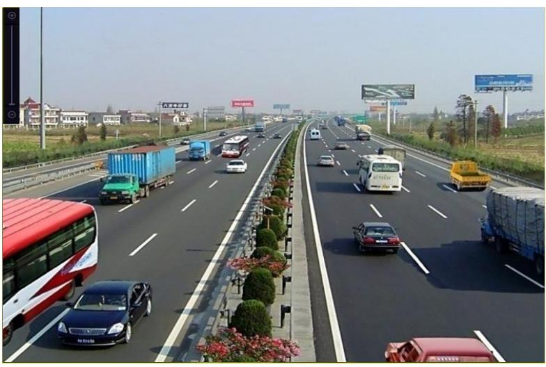

Figure 6. 25 Draw Area for Digital Zoom

- **3.** Right-click the image to exit the digital zoom interface.
### **6.2.5 File Management**

You can manage the video clips, captured pictures in playback, locked files and tags you have added in the playback mode.

- **1.** Enter the playback interface.
- **2.** Click on the toolbar to enter the file management interface.

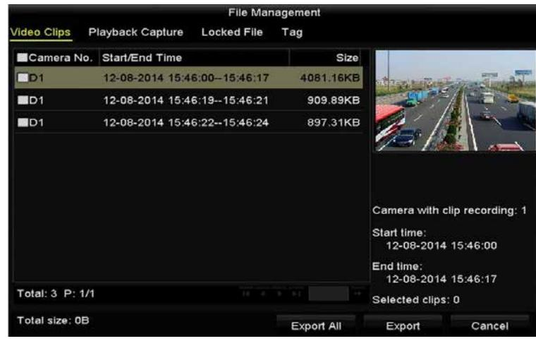

Figure 6. 26 File Management

- **3.** You can view the saved video clips, captured playback pictures, lock/unlock the files and edit the tags which you added in the playback mode.
- **4.** If required, select the items and click **Export All** or **Export** to export the clips/pictures/files/tags to local storage device.

## **Chapter 7 Backup**

## **7.1 Backing up Record Files**

### **7.1.1 Quick Export**

#### *Purpose:*

Export record files to backup device(s) quickly.

*Steps:* 

- **1.** Enter Video Export interface.
Menu>Export>Normal

Choose the channel(s) you want to back up and click **Quick Export** button.


The time duration of record files on a specified channel cannot exceed one day. Otherwise, the message box

| IP Camera                | - D1  | DD2        | 203           | D D4              | PD5  | JD6                                        | - D7          | V D8 | C |  |
|--------------------------|-------|------------|---------------|-------------------|------|--------------------------------------------|---------------|------|---|--|
|                          | 60 F  |            | 2010 ED11     | DD12 DD13         |      |                                            | D14 2015 BD16 |      |   |  |
|                          | ZD17  |            | D18 DD19      | 2 D20             | ZD21 |                                            | D22 D23 DD24  |      |   |  |
|                          | V D25 |            | D26 ZD27 DD28 |                   | 6202 |                                            | D30 DD31 DD32 |      |   |  |
|                          | - D33 |            |               |                   |      | D34 D34 D35 ED36 ZD37 ZD38 ZD39 ZD40       |               |      |   |  |
|                          | 2 D41 |            |               | 2 D42 2 D43 C D44 |      | D45 DD46 DD47 2 D48                        |               |      |   |  |
|                          | 2 D49 |            |               |                   |      | D50 BD51 ZD51 ZD52 MD53 ZD54 ZD56 ZD56     |               |      |   |  |
| Start/End time of record |       |            |               |                   |      | 09-12-2014 09:38:58 -- 12-11-2014 11:20:12 |               |      |   |  |
| Record Type              |       | All        |               |                   |      |                                            |               |      |   |  |
| File Type                |       | All        |               |                   |      |                                            |               |      |   |  |
| Start Time               |       | 12-25-2014 |               |                   | E    | 00:00:00                                   |               |      | C |  |
| End Time                 |       | 12-25-2014 |               |                   |      | 23:59:59                                   |               |      | 0 |  |

- "Max. 24 hours are allowed for quick export." will pop up.
Figure 7. 1 Quick Export Interface

- **2.** Select the format of the log files to be exported. Up to 9 formats are selectable.
- **3.** Click the **Export** to start exporting. Stay in the Exporting interface until all record files are exported.


Here we use USB Flash Drive and please refer to the next section Normal Backup for more backup devices supported by the NVR.

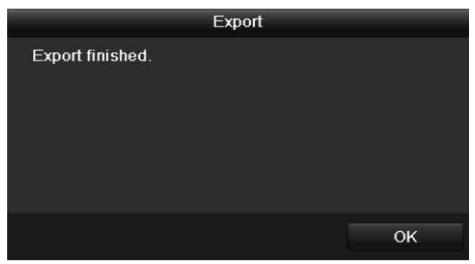

Figure 7. 2 Export Finished

- **4.** Check backup result.
Choose the record file in Export interface and click button to check it.


The Player player.exe will be exported automatically during record file export.

| USB Flash Disk 1-1                 | *.mp4; * . zip |        | Refresh                                                           |      |             |
|------------------------------------|----------------|--------|-------------------------------------------------------------------|------|-------------|
| Size Type                          | Edit Date      |        |                                                                   |      |             |
| 34.67MB File                       |                |        |                                                                   | m    | O           |
| 25.63MB File                       |                |        |                                                                   | m    | O           |
| 2591.22KB File                     |                |        |                                                                   | mi   | 0           |
| 6127.17MB                          |                |        |                                                                   |      |             |
| New Folder                         | Format         | Export |                                                                   | Back |             |
| ch01_2015021719<br>ch01_2015021719 |                |        | 02-17-2015 20:00:11<br>02-17-2015 20:00:14<br>02-17-2015 20:00:03 |      | Delete Play |

Figure 7. 3 Quick Export

### **7.1.2 Backing up by Normal Video/Picture Search**

#### *Purpose:*

The record files can be backup to various devices, such as USB devices (USB flash drives, USB HDDs, USB writer), SATA writer and e-SATA HDD.

#### *Steps:*

- **1.** Enter Export interface.
Menu>Export>Normal/Picture

- **2.** Select the cameras to search.
- **3.** Set search condition and click **Search** button to enter the search result interface. The matched video files or pictures are displayed in Chart or List display mode.

| IP Camera                | - D1  | D2                                         | 203        | D D4  | 2 05  | 2 D6                          | 207 | 208         |   |  |  |
|--------------------------|-------|--------------------------------------------|------------|-------|-------|-------------------------------|-----|-------------|---|--|--|
|                          | 605   | - D10                                      | 2 D11      | ZD12  | ED13  | 2014                          |     | 2015 8 D16  |   |  |  |
|                          | - D17 |                                            | 2018 2 D19 | 2 D20 | ZD21  | 2022                          |     | D23 D23 D24 |   |  |  |
|                          | ZD25  | D26                                        | DD27       | ZD28  | & D29 | D30                           |     | 2031 FD32   |   |  |  |
|                          | 2 D33 |                                            | ZD34 D35   | DD36  | D37   | D38                           |     | D39 DD40    |   |  |  |
|                          | V D41 |                                            | D42 D D43  | D D44 | 2 D45 | D46                           |     | DA7 @ D48   |   |  |  |
|                          | 2049  |                                            |            |       |       | D50 D51 2 D51 2 D52 ED53 CD54 |     | DS5 2 DS6   |   |  |  |
| Start/End time of record |       | 09-12-2014 09:38:58 -- 12-11-2014 11:20:12 |            |       |       |                               |     |             |   |  |  |
| Record Type              |       | All                                        |            |       |       |                               |     |             |   |  |  |
| File Type                |       | All                                        |            |       |       |                               |     |             |   |  |  |
| Start Time               |       | 12-25-2014                                 |            |       | 100   | 00:00:00                      |     |             | C |  |  |
| End Time                 |       | 12-25-2014                                 |            |       |       | 1 23:59:59                    | 1   |             |   |  |  |

Figure 7. 4 Normal Video Search for Backup

- **4.** Select video files or pictures from the Chart or List to export.
Click to play the record file if you want to check it.

Check the checkbox before the record files you want to back up.

The size of the currently selected files is displayed in the lower-left corner of the window.

| Chart<br>List   |                        | Search result |            |                |
|-----------------|------------------------|---------------|------------|----------------|
| Camera No.      | Start/End Time         | Size Play     | Lock       |                |
| ID1             | 12-10-2014 09:15:59 -  | 430.14MB O    | ा          |                |
| DD1             | 12-10-2014 10:19:00 -- | 1011.18MB ●   | S          |                |
| ID1             | 12-10-2014 12:28:24 -- | 84.68MB @     | S          |                |
| ID1             | 12-10-2014 13:55:27 -- | 170.07MB @    | 9          |                |
| Total: 4 P: 1/1 |                        |               |            | 5              |
|                 |                        |               |            |                |
| Total size: 0B  |                        |               | Export All | Export<br>Back |

Figure 7. 5 Result of Normal Video Search for Backup

- **5.** Export the video files or picture files.
Click **Export All** button to export all the files.

Or you can select recording files you want to back up, and click **Export** button to enter Export interface.


If the inserted USB device is not recognized:

- **•** Click the **Refresh** button.
- **•** Reconnect device.
- **•** Check for compatibility from vendor.

You can also format USB flash drives or USB HDDs via the device.

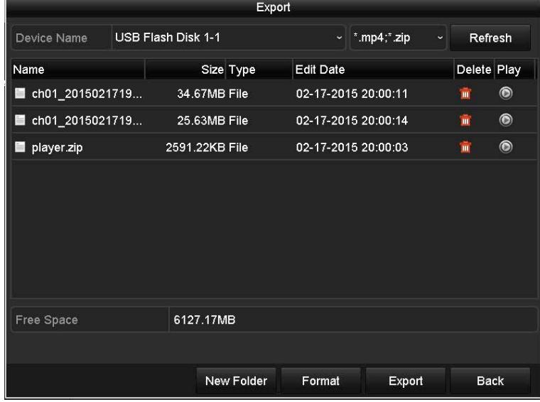

Figure 7. 6 Export by Normal Video Search using USB Flash Drive

Stay in the Exporting interface until all record files are exported with pop-up message box "Export finished".

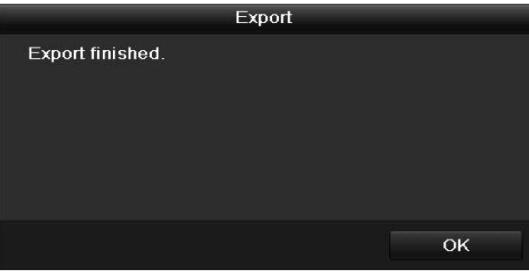

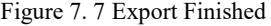

The backup of video files using USB writer or SATA writer has the same operating instructions. Please refer to steps described above.

### **7.1.3 Backing up by Event Search**

#### *Purpose:*

Back up event-related record files using USB devices (USB flash drives, USB HDDs, USB writer), SATA writer or eSATA HDD. Quick Backup and Normal Backup are supported.

*Steps:*

- **1.** Enter Export interface.
Menu>Export>Event

- **2.** Select the cameras to search.
- **3.** Select the event type to alarm input, motion or VCA.

| Major Type |                                                                                                                                                                               | Motion          |       |       |       |               |       |       |   |  |
|------------|-------------------------------------------------------------------------------------------------------------------------------------------------------------------------------|-----------------|-------|-------|-------|---------------|-------|-------|---|--|
| Start Time |                                                                                                                                                                               | 12-10-2014<br>I |       |       |       | 00:00:00      |       |       |   |  |
| End Time   |                                                                                                                                                                               | 12-10-2014      |       |       |       | 23:59:59      |       |       | 0 |  |
| Pre-play   | 30s                                                                                                                                                                           |                 |       |       |       |               |       |       |   |  |
| Post-play  | 30s                                                                                                                                                                           |                 |       |       |       |               |       |       |   |  |
| IP Camera  | DI DI DI DI DI DI DI DI DI DI DI DI DI DI DI DI DI DI DI DI DI DI DI DI DE DE DE DE DE DE DE DE DE DE DE DE DE DE DE DE DE DE DE DE DE DE DE DE DE DE DE DE DE DE DE DE DE DE | 202             | DD3   | DA    | 205   | DOG           | 207   | DD8   |   |  |
|            | ZD9                                                                                                                                                                           | VD10            | ZD11  | ZD12  | ZD13  | D14           | V D15 | ZD16  |   |  |
|            | 2 D17                                                                                                                                                                         | 2018            | 2019  | 2020  |       | 2021 2 D22    | ZD23  | 2 D24 |   |  |
|            | 2025                                                                                                                                                                          | DD26            | 2 D27 | 2028  | 2 D29 | DD30          | ZD31  | ZD32  |   |  |
|            | 2 D33                                                                                                                                                                         | - D34           | V D35 | D36   | D37   | @ D38         | ZD39  | D40   |   |  |
|            | 7 D41                                                                                                                                                                         | 2042            | 2 043 | D D44 | DA5   | D46           | 2047  | 2 D48 |   |  |
|            | V D49                                                                                                                                                                         | 2 D50           | ZD51  |       |       | D52 DD53 DD54 | 2055  | ZD56  |   |  |
|            |                                                                                                                                                                               |                 |       |       |       |               |       |       |   |  |
|            |                                                                                                                                                                               |                 |       |       |       |               |       |       |   |  |
|            |                                                                                                                                                                               |                 |       |       |       |               |       |       |   |  |

Figure 7. 8 Event Search for Backup

- **4.** Set search condition and click **Search** button to enter the search result interface. The matched video files are displayed in Chart or List display mode.
- **5.** Select video files from the Chart or List interface to export.

|                 |                |   | Search result          |             |        |      |
|-----------------|----------------|---|------------------------|-------------|--------|------|
| Chart<br>List   |                |   |                        |             |        |      |
| Source          | Camera No. HDD |   | Event Time             | Size Play   |        |      |
| D1              | D1             | 6 | 12-08-2014 20:33:18 -- | 25.89MB 0   |        |      |
| D1              | D1             | 6 | 12-10-2014 11:18:13 -- | 8593.30KB @ |        | 3    |
| Total: 2 P: 1/1 |                |   |                        |             |        |      |
| Total size: 0B  |                |   |                        | Export All  | Export | Back |

Figure 7. 9 Result of Event Search

- **6.** Export the video files. Please refer to step5 of *Chapter 7.1.2 Backing up by Normal Video/Picture Search* for details.
### **7.1.4 Backing up Video Clips or Captured Playback**

### **Pictures**

#### *Purpose:*

You may also select video clips or captured pictures in playback mode to export directly during Playback, using USB devices (USB flash drives, USB HDDs, USB writer), SATA writer or eSATA HDD.

#### *Steps:*

**1.** Enter Playback interface.

Please refer to *Chapter 6.1 Playing Back Record Files.*

- **2.** During playback, use buttons or in the playback toolbar to start or stop clipping record file(s); or
use the button to capture pitcures.

- **3.** Click the to enter the file management interface.

|                 |                               |             | File Management |                                                                        |                               |
|-----------------|-------------------------------|-------------|-----------------|------------------------------------------------------------------------|-------------------------------|
| Video Clips     | Playback Capture              | Locked File | Tag             |                                                                        |                               |
| Camera No.      | Start/End Time                |             | Size            |                                                                        |                               |
| D1              | 12-05-2014 18:18:20-18:18:22  |             | 1569,85KB       |                                                                        |                               |
| ID1             | 12-05-2014 18:18:24--18:18:25 |             | 786.86KB        |                                                                        | Camera with clip recording: 1 |
|                 |                               |             |                 | Start time:<br>12-05-2014 18:18:20<br>End time:<br>12-05-2014 18:18:22 |                               |
| Total: 2 P: 1/1 |                               |             |                 | Selected clips: 0                                                      |                               |
| Total size: 0B  |                               |             | Export All      | Export                                                                 | Cancel                        |

Figure 7. 10 Video Clips or Captured Pictures Export Interface

- **4.** Export the video clips or captured pictures in playback. Please refer to step5 of *Chapter 7.1.2 Backing up by Normal Video/Picture Search* for details.
### **7.2 Managing Backup Devices**

**Management of USB flash drives, USB HDDs and eSATA HDDs** 

- **1.** Enter the Export interface.

|                   | Export             |                     |              |             |   |
|-------------------|--------------------|---------------------|--------------|-------------|---|
| Device Name       | USB Flash Disk 1-1 |                     | *.mp4;* .zip | Refresh     |   |
| Name              | Size Type          | Edit Date           |              | Delete Play |   |
| ch01_2015021719   | 34.67MB File       | 02-17-2015 20:00:11 |              | m           | 5 |
| ■ ch01_2015021719 | 25.63MB File       | 02-17-2015 20:00:14 |              | 简           | 0 |
| player.zip        | 2591.22KB File     | 02-17-2015 20:00:03 |              | m           | 0 |
|                   |                    |                     |              |             |   |
| Free Space        | 6127.17MB          |                     |              |             |   |
|                   | New Folder         |                     |              | Back        |   |

Figure 7. 11 Storage Device Management

#### **2.** Backup device management.

Click **New Folder** button if you want to create a new folder in the backup device.

Select a record file or folder in the backup device and click button if you want to delete it.

Click **Erase** button if you want to erase the files from a re-writable CD/DVD.

Click **Format** button to format the backup device.


If the inserted storage device is not recognized:

- **•** Click the **Refresh** button.
- **•** Reconnect device.
- **•** Check for compatibility from vendor.

## **7.3 Hot Spare Device Backup**

#### *Purpose:*

The device can form an N+1 hot spare system. The system consists of several working devices and a hot spare device; when the working device fails, the hot spare device switches into operation, thus increasing the reliability of the system.


Please contact dealer for details of models which support the hot spare function.

#### *Before you start:*

At least 2 devices are online.

A bidirectional connection shown in the figure below is required to be built between the hot spare device and each working device.


Figure 7. 12 Building Hot Spare System

### **7.3.1 Setting Hot Spare Device**


- The camera connection will be disabled when the device works in the hot spare mode.
- It's highly recommended to restore the defaults of the device after switching the working mode of the hot spare device to normal mode to ensure the normal operation afterwards.

*Steps:*

- **1.** Enter the Hot Spare settings interface.
Menu > Configuration > Hot Spare

- **2.** Set the **Work Mode** as **Hot Spare Mode** and click the **Apply** button to confirm the settings.
- **3.** Reboot the device to make the change take effect.

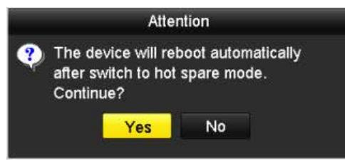

Figure 7. 13 Reboot Attention

- **4.** Click the **Yes** button in the pop-up attention box.
### **7.3.2 Setting Working Device**

#### *Steps:*

- **1.** Enter the Hot Spare settings interface. Menu > Configuration > Hot Spare
- **2.** Set the Work Mode as Normal Mode (default).
- **3.** Check the checkbox of Enable to enable the hot spare function.
- **4.** Enter the IP address and admin password of hot spare device.

| Work Mode                 |                    |
|---------------------------|--------------------|
| @ Normal Mode             | C Hot Spare Mode   |
| Enable                    | )                  |
| IPv4 address of the hot s | 172.6<br>.23 . 187 |
| Password of the hot spar  | 88822              |
| Working Status            | Connected          |

Figure 7. 14 Setting Working Mode for Working device

- **5.** Click the **Apply** button to save the settings.
### **7.3.3 Managing Hot Spare System**

#### *Steps:*

- **1.** Enter the Hot Spare Settings interface of the hot spare device. Menu > Configuration > Hot Spare
The connected working device is displayed on the device list.

- **2.** Check the checkbox to select the working device from the device list, and click the **Add** button to link the working device to the hot spare device.


A hot spare device can connect up to 32 working devices.

| Work Mode   | · Normal Mode                       |              | O Hot Spare Mode  |                |            |
|-------------|-------------------------------------|--------------|-------------------|----------------|------------|
| Device List |                                     |              |                   |                |            |
| INo.        |                                     | IP Address   |                   |                |            |
| 11          |                                     | 172.6.23.163 |                   |                |            |
|             |                                     |              |                   |                |            |
|             | Working Device Status<br>IP Address |              | Connection Status | Working Status | Add<br>Del |
|             |                                     |              |                   |                |            |
| No.         |                                     |              |                   |                |            |
|             |                                     |              |                   |                | Back       |

Figure 7. 15 Add Working Device

- **3.** You can view the working status of the hot spare device on the Working Status list. When the working device works properly, the working status of the hot spare device is displayed as *No record*.

|     | Working Device Status |                   |                | Add    |
|-----|-----------------------|-------------------|----------------|--------|
| No. | IP Address            | Connection Status | Working Status | Delete |
|     | 172.6.23.163          | Online            | No record      | (m)    |


When the working device gets offline, the hot spare device will record the video of the IP Camera connected to the working device for backup, and the working status of the hot spare device is displayed as *Backing up*.


The record backing up can be functioned for 1 working device at a time.

|     | Working Device Status |                   |                | Add |
|-----|-----------------------|-------------------|----------------|-----|
| No. | IP Address            | Connection Status | Working Status | Del |
|     | 172.6.23.163          | Offline           | Backing up     | E   |


When the working device comes online, the lost video files will be restored by the record synchronization function, and the working status of the hot spare device is displayed as *Synchronizing*.


The record synchronization function can be enabled for 1 working device at a time.

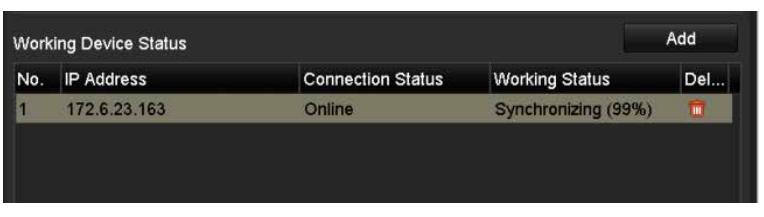

Figure 7. 18 Synchronizing

# **Chapter 8 Alarm Settings**

### **8.1 Setting Motion Detection Alarm**

#### *Steps:*

- **1.** Enter Motion Detection interface of Camera Management and choose a camera you want to set up motion detection.
	- Menu > Camera > Motion

| Camera                  | IP Camera 1 |             |   |  |  |  |
|-------------------------|-------------|-------------|---|--|--|--|
| Enable Motion Detection | >           |             |   |  |  |  |
|                         |             | Settings    | 泰 |  |  |  |
|                         |             | Sensitivity |   |  |  |  |
|                         |             | Full Screen |   |  |  |  |
|                         |             | Clear       |   |  |  |  |
|                         |             |             |   |  |  |  |

Motion Detection Setup Interface

- **2.** Set up detection area and sensitivity.
Tick "Enable Motion Detection", use the mouse to draw detection area(s) and drag the sensitivity bar to set sensitivity.

Click button and set alarm response actions.

- **3.** Click **Trigger Channel** tab and select one or more channels which will start to record/capture or become full-screen monitoring when motion alarm is triggered, and click **Apply** to save the settings.

|                 |                                |       | Settings |    |        |
|-----------------|--------------------------------|-------|----------|----|--------|
| Trigger Channel | Arming Schedule Linkage Action |       |          |    |        |
| IP Camera       | ZD1                            | ■D2   | D3       |    |        |
|                 |                                |       |          |    |        |
|                 |                                |       |          |    |        |
|                 |                                |       |          |    |        |
|                 |                                |       |          |    |        |
|                 |                                |       |          |    |        |
|                 |                                |       |          |    |        |
|                 |                                |       |          |    |        |
|                 |                                | Apply |          | OK | Cancel |

Figure 8. 1 Set Trigger Camera of Motion Detection

- **4.** Set up arming schedule of the channel.
	- 1) Select Arming Schedule tab to set the arming schedule of handling actions for the motion detection.
	- 2) Choose one day of a week and up to eight time periods can be set within each day.
	- 3) Click **Apply** to save the settings


Time periods shall not be repeated or overlapped.

|                 |                 | Settings       |        |
|-----------------|-----------------|----------------|--------|
| Trigger Channel | Arming Schedule | Linkage Action |        |
| Week            | Mon             |                |        |
| 1               | 00:00-24:00     |                |        |
| 2               | 00:00-00:00     |                |        |
| 3               | 00:00-00:00     |                |        |
| 48              | 00:00-00:00     |                |        |
| 5               | 00:00-00:00     |                |        |
| 6               | 00:00-00:00     |                |        |
| 7               | 00:00-00:00     |                |        |
| 8               | 00:00-00:00     |                |        |
|                 |                 |                |        |
|                 |                 |                |        |
|                 |                 |                |        |
|                 | Copy            | OK<br>Apply    | Cancel |

Figure 8. 2 Set Arming Schedule of Motion Detection

- **5.** Click **Handling** tab to set up alarm response actions of motion alarm (please refer to *Chapter 8.6 Setting Alarm Response Actions*).
- **6.** If you want to set motion detection for another channel, repeat the above steps or just click **Copy** in the Motion Detection interface to copy the above settings to it.

### **8.2 Setting Sensor Alarms**

#### *Purpose:*

Set the handling action of an external sensor alarm.

#### *Steps:*

- **1.** Enter Alarm Settings of System Configuration and select an alarm input.
Menu> Configuration> Alarm

Select Alarm Input tab to enter Alarm Input Settings interface.

| Alarm Status<br>Alarm Input | Alarm Output |                |  |
|-----------------------------|--------------|----------------|--|
| Alarm Input List            |              |                |  |
| Alarm Input No.             | Alarm Name   | Alarm Type     |  |
| Local <- 1                  |              | N.O            |  |
| Local <- 2                  |              | N.O            |  |
| Local <- 3                  |              | N.O            |  |
| Local <- 4                  |              | N.O            |  |
| Local <- 5                  |              | N.O            |  |
| Local <- 6                  |              | N.O            |  |
| 1 neal <- 7                 |              | NO             |  |
| Alarm Output List           |              |                |  |
| Alarm Output No.            | Alarm Name   | Dwell Time     |  |
| Local->1                    |              | Manually Clear |  |
| Local->2                    |              | Manually Clear |  |
| Local->3                    |              | Manually Clear |  |
| Local->4                    |              | Manually Clear |  |
| 172.6.23.105:8000->1        |              | 55             |  |

Figure 8. 3 Alarm Status Interface of System Configuration

- **2.** Set up the handling action of the selected alarm input.
Check the **Enable** checkbox and click **Settings** button to set up its alarm response actions.

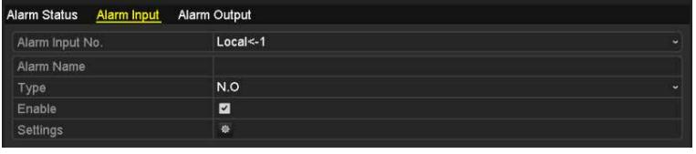

Figure 8. 4 Alarm Input Setup Interface

- **3.** Select Trigger Channel tab and select one or more channels which will start to record/capture or become full-screen monitoring when an external alarm is input, and click **Apply** to save the settings.
- **4.** Select **Arming Schedule** tab to set the arming schedule of handling actions.

|                 |                 | Settings       |             |
|-----------------|-----------------|----------------|-------------|
| Trigger Channel | Arming Schedule | Linkage Action | PTZ Linking |
| Week            | Mon             |                |             |
| 1               | 00:00-24:00     |                |             |
| 2               | 00:00-00:00     |                |             |
| 3               | 00:00-00:00     |                |             |
| 4               | 00:00-00:00     |                |             |
| 5               | 00:00-00:00     |                |             |
| 6               | 00:00-00:00     |                |             |
| 7               | 00:00-00:00     |                |             |
| 8               | 00:00-00:00     |                |             |

Figure 8. 5 Set Arming Schedule of Alarm Input

Choose one day of a week and Max. eight time periods can be set within each day, and click **Apply** to save the settings.


Time periods shall not be repeated or overlapped.

Repeat the above steps to set up arming schedule of other days of a week. You can also use **Copy** button to copy an arming schedule to other days.

- **5.** Select **Linkage Action** tab to set up alarm response actions of the alarm input (please refer to *Chapter 8.6 Setting Alarm Response Actions*).
- **6.** If necessary, select PTZ Linking tab and set PTZ linkage of the alarm input.

Set PTZ linking parameters and click **OK** to complete the settings of the alarm input.


Please check whether the PTZ or speed dome supports PTZ linkage.

One alarm input can trigger presets, patrol or pattern of more than one channel. But presets, patrols and patterns are exclusive.

| Settings        |                |             |    |        |  |
|-----------------|----------------|-------------|----|--------|--|
| Arming Schedule | Linkage Action | PTZ Linking |    |        |  |
| PTZ Linking     | [D1] Camera 01 |             |    |        |  |
| Call Preset     |                |             |    |        |  |
| Preset          | 1              |             |    |        |  |
| Call Patrol     |                |             |    |        |  |
| Patrol          | 1              |             |    |        |  |
| Call Pattern    |                |             |    |        |  |
| Pattern         | 1              |             |    |        |  |
|                 |                |             |    |        |  |
|                 |                |             |    |        |  |
|                 |                |             |    |        |  |
|                 |                |             | OK | Cancel |  |

Figure 8. 6 Set PTZ Linking of Alarm Input

- **7.** If you want to set handling action of another alarm input, repeat the above steps.
Or you can click the **Copy** button on the Alarm Input Setup interface and check the checkbox of alarm inputs to copy the settings to them.

|                 | Copy Alarm Input to |    |        |
|-----------------|---------------------|----|--------|
| Alarm Input No. | Alarm Name          |    |        |
| Local <- 1      |                     |    |        |
| Local <- 2      |                     |    |        |
| Local <- 3      |                     |    |        |
| Local <- 4      |                     |    |        |
| Local <- 5      |                     |    |        |
| Local <- 6      |                     |    |        |
| Local <- 7      |                     |    |        |
| Local <- 8      |                     |    |        |
| Local <- 9      |                     |    |        |
| Local <- 10     |                     |    |        |
| Local <- 11     |                     |    |        |
|                 |                     |    |        |
|                 |                     | OK | Cancel |

Figure 8. 7 Copy Settings of Alarm Input

## **8.3 Detecting Video Loss Alarm**

#### *Purpose:*

Detect video loss of a channel and take alarm response action(s).

#### *Steps:*

- **1.** Enter Video Loss interface of Camera Management and select a channel you want to detect.
Menu> Camera> Video Loss

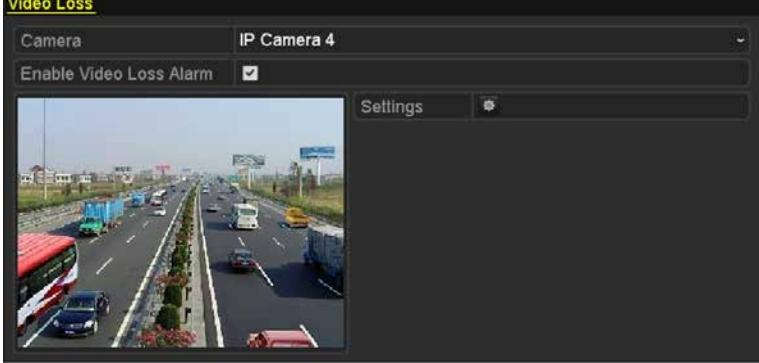

Figure 8. 8 Video Loss Setup Interface

- **2.** Set up handling action of video loss.
Check the checkbox of "Enable Video Loss Alarm", and click button to set up handling action of video loss.

- **3.** Set up arming schedule of the handling actions.
	- 1) Select Arming Schedule tab to set the channel's arming schedule.
	- 2) Choose one day of a week and up to eight time periods can be set within each day.
	- 3) Click **Apply** button to save the settings.


Time periods shall not be repeated or overlapped.

|                 |                | Settings    |    |        |
|-----------------|----------------|-------------|----|--------|
| Arming Schedule | Linkage Action |             |    |        |
| Week            | Mon            |             |    |        |
|                 |                | 00:00-24:00 |    |        |
| 2               |                | 00:00-00:00 |    |        |
|                 |                | 00:00-00:00 |    |        |
| 0 4 6           | 00:00-00:00    |             |    |        |
|                 | 00:00-00:00    |             |    | @      |
| 6               | 00:00-00:00    |             |    | @      |
| 7               | 00:00-00:00    |             |    | 0      |
|                 | 00:00-00:00    |             |    |        |
|                 |                |             |    |        |
|                 |                |             |    |        |
|                 |                |             |    |        |
|                 | Copy           |             | OK | Cancel |

Figure 8. 9 Set Arming Schedule of Video Loss

- **4.** Select **Linkage Action** tab to set up alarm response action of video loss (please refer to *Chapter 8.6 Setting Alarm Response Actions*).
- **5.** Click the **OK** button to complete the video loss settings of the channel.

## **8.4 Detecting Video Tampering Alarm**

#### *Purpose:*

Trigger alarm when the lens is covered and take alarm response action(s).

#### *Steps:*

- **1.** Enter Video Tampering interface of Camera Management and select a channel you want to detect video tampering.
Menu> Camera> Video Tampering

| Camera                 | IP Camera 1 |             |   | 8 |  |
|------------------------|-------------|-------------|---|---|--|
| Enable Video Tampering | 2           |             |   |   |  |
|                        |             | Settings    | 场 |   |  |
|                        |             | Sensitivity |   |   |  |
|                        |             | Clear       |   |   |  |
|                        |             |             |   |   |  |
|                        |             |             |   |   |  |

Figure 8. 10 Video Tampering Setting Interface

- **2.** Set the video tampering handling action of the channel.
Check the checkbox of "Enable Video Tampering Detection".

Drag the sensitivity bar to set a proper sensitivity level. Use the mouse to draw an area you want to detect video tampering.

Click button to set up handling action of video tampering.

- **3.** Set arming schedule and alarm response actions of the channel.
	- 1) Click Arming Schedule tab to set the arming schedule of handling actions.
	- 2) Choose one day of a week and Max. eight time periods can be set within each day.
	- 3) Click **Apply** button to save the settings.


Time periods shall not be repeated or overlapped.

|                 |                | Settings    |    |  |
|-----------------|----------------|-------------|----|--|
| Arming Schedule | Linkage Action |             |    |  |
| Week            | Mon            |             |    |  |
|                 |                | 00:00-24:00 |    |  |
| 2               |                | 00:00-00:00 |    |  |
| 3               |                | 00:00-00:00 |    |  |
| 4               | 00:00-00:00    |             |    |  |
| 5               | 00:00-00:00    |             |    |  |
| 6               | 00:00-00:00    |             |    |  |
| 7               |                | 00:00-00:00 |    |  |
| 8               |                | 00:00-00:00 |    |  |
|                 |                |             |    |  |
|                 |                |             |    |  |
|                 |                |             |    |  |
|                 | CODY           |             | OK |  |

Figure 8. 11 Set Arming Schedule of Video Tampering

- **4.** Select **Linkage Action** tab to set up alarm response actions of video tampering alarm (please refer to *Chapter 8.6 Setting Alarm Response Actions*).
- **5.** Click the **OK** button to complete the video tampering settings of the channel.

## **8.5 Handling Exceptions Alarm**

#### *Purpose:*

Exception settings refer to the handling action of various exceptions, e.g.

- **• HDD Full:** The HDD is full.
- **• HDD Error:** Writing HDD error or unformatted HDD.
- **• Network Disconnected:** Disconnected network cable.
- **• IP Conflicted:** Duplicated IP address.
- **• Illegal Login:** Incorrect user ID or password.
- **• Record/Capture Exception:** No space for saving recorded files or captured images.
- **• Hot Spare Exception:** Disconnected with the working device.

#### *Steps:*

Enter Exception interface of System Configuration and handle various exceptions.

Menu > Configuration > Exceptions

Please refer to *Chapter 8.6 Setting Alarm Response Actions* for detailed alarm response actions.

| Exception                  |          |  |
|----------------------------|----------|--|
| Enable Event Hint          | )        |  |
| Event Hint Settings        | 泰        |  |
| Exception Type             | HDD Full |  |
| Audible Warning            | 1        |  |
| Notify Surveillance Center |          |  |
| Send Email                 | ロ        |  |
| Trigger Alarm Output       | ■        |  |

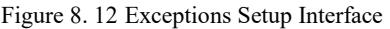

### **8.6 Setting Alarm Response Actions**

#### *Purpose:*

Alarm response actions will be activated when an alarm or exception occurs, including Event Hint Display, Full Screen Monitoring, Audible Warning (buzzer), Notify Surveillance Center, Trigger Alarm Output and Send Email.

#### **Event Hint Display**

When an event or exception happens, a hint can be displayed on the lower-left corner of live view image. And you can click the hint icon to check the details. Besides, the event to be displayed is configurable.

#### *Steps:*

- **1.** Enter the Exception settings interface.
Menu > Configuration > Exceptions

- **2.** Check the checkbox of **Enable Event Hint**.

| Enable Event Hint   | > |
|---------------------|---|
| Event Hint Settings |   |

Figure 8. 13 Event Hint Settings Interface

**3.** Click the to set the type of event to be displayed on the image.

| Event Hint Settings    |    |        |
|------------------------|----|--------|
| AAII                   |    | >      |
| ZHDD Full              |    |        |
| ZHDD Error             |    |        |
| 2 Network Disconnected |    |        |
| VIP Conflicted         |    |        |
| ZIllegal Login         |    |        |
| Video Signal Loss      |    |        |
| Alarm Input Triggered  |    |        |
| Video Tamper Detected  |    |        |
| Motion Detection       |    | V      |
|                        |    |        |
|                        |    |        |
|                        | OK | Cancel |

Figure 8. 14 Event Hint Settings Interface

- **4.** Click the **OK** button to finish settings.
#### **Full Screen Monitoring**

When an alarm is triggered, the local monitor (VGA, HDMI or BNC monitor) display in full screen the video image from the alarming channel configured for full screen monitoring.

If alarms are triggered simultaneously in several channels, their full-screen images will be switched at an interval of 10 seconds (default dwell time). A different dwell time can be set by going to Menu >Configuration>Live View > Full Screen Monitoring Dwell Time.

Auto-switch will terminate once the alarm stops and you will be taken back to the Live View interface.


You must select during "Trigger Channel" settings the channel(s) you want to make full screen monitoring.

#### **Audible Warning**

Trigger an audible *beep* when an alarm is detected.

#### **Notify Surveillance Center**

Sends an exception or alarm signal to remote alarm host when an event occurs. The alarm host refers to the PC installed with Remote Client.


The alarm signal will be transmitted automatically at detection mode when remote alarm host is configured. Please refer to *Chapter 11.2.4 Configuring More Settings* for details of alarm host configuration.

#### **Email Linkage**

Send an email with alarm information to a user or users when an alarm is detected. Please refer to *Chapter 11.2.6 Configuring Email* for details of Email configuration.

#### **Trigger Alarm Output**

Trigger an alarm output when an alarm is triggered.

- **1.** Enter Alarm Output interface.
Menu> Configuration> Alarm> Alarm Output

Select an alarm output and set alarm name and dwell time. Click **Schedule** button to set the arming schedule of alarm output.


If "Manually Clear" is selected in the dropdown list of Dwell Time, you can clear it only by going to Menu> Manual> Alarm.

| Alarm Status     | Alarm Input | Alarm Output |  |
|------------------|-------------|--------------|--|
| Alarm Output No. |             | Local->1     |  |
| Alarm Name       |             |              |  |
| Dwell Time       |             | 55           |  |
| Settings         |             | 泰            |  |

Figure 8. 15 Alarm Output Setup Interface

**2.** Set up arming schedule of the alarm output.

Choose one day of a week and up to 8 time periods can be set within each day.


Time periods shall not be repeated or overlapped.

|                 |             | Settings |    |        |
|-----------------|-------------|----------|----|--------|
| Arming Schedule |             |          |    |        |
| Week            | Mon         |          |    |        |
| 1               | 00:00-24:00 |          |    |        |
| 2               | 00:00-00:00 |          |    |        |
| 3               | 00:00-00:00 |          |    |        |
| 4               | 00:00-00:00 |          |    |        |
| 5               | 00:00-00:00 |          |    |        |
| ୍ତ              | 00:00-00:00 |          |    |        |
| 7               | 00:00-00:00 |          |    |        |
| 8               | 00:00-00:00 |          |    |        |
|                 |             |          |    |        |
|                 |             |          |    |        |
|                 |             |          |    |        |
|                 | Copy        | Apply    | OK | Cancel |

Figure 8. 16 Set Arming Schedule of Alarm Output

- **3.** Repeat the above steps to set up arming schedule of other days of a week. You can also use **Copy** button to copy an arming schedule to other days.
Click the **OK** button to complete the video tampering settings of the alarm output No..

- **4.** You can also copy the above settings to another channel.
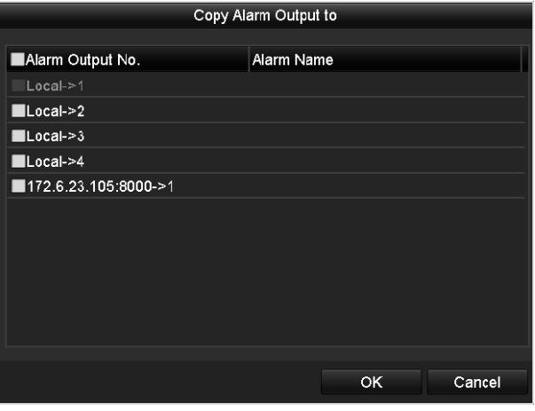

Figure 8. 17 Copy Settings of Alarm Output

# **8.7 Triggering or Clearing Alarm Output Manually**

#### *Purpose:*

Sensor alarm can be triggered or cleared manually. If "Manually Clear" is selected in the dropdown list of dwell time of an alarm output, the alarm can be cleared only by clicking **Clear** button in the following interface.

#### *Steps:*

Select the alarm output you want to trigger or clear and make related operations.

Menu> Manual> Alarm

Click **Trigger/Clear** button if you want to trigger or clear an alarm output.

Click **Trigger All** button if you want to trigger all alarm outputs.

Click **Clear All** button if you want to clear all alarm output.

| Alarm                |            |         |
|----------------------|------------|---------|
| Alarm Output No.     | Alarm Name | Trigger |
| ocal->1              |            | No      |
| Local->2             |            | No      |
| Local->3             |            | No      |
| Local->4             |            | No      |
| 172.6.23.105:8000->1 |            | No      |
|                      |            |         |

Figure 8. 18 Clear or Trigger Alarm Output Manually

## **Chapter 9 VCA Alarm**

The NVR supports the VCA detection alarm (*face detection, vehicle detection, line crossing detection* and *intrusion detection, region entrance detection, region exiting detection, loitering detection, people gathering detection, fast moving detection, parking detection, unattended baggage detection, object removal detection, audio loss exception detection, sudden change of sound intensity detection,* and *defocus detection*) sent by IP camera. The VCA detection must be enabled and configured on the IP camera settings interface first.


- All VCA detection must be supported by the connected IP camera.
- Please refer to the User Manual of Network Camera for the detailed instructions for the all VCA detection types.

### **9.1 Face Detection**

#### *Purpose:*

Face detection function detects the face appears in the surveillance scene, and some certain actions can be taken when the alarm is triggered.

#### *Steps:*

- 1. Enter the VCA settings interface. Menu> Camera> VCA
- 2. Select the camera to configure the VCA.

You can click the checkbox of **Save VCA Picture** to save the captured pictures of VCA detection.

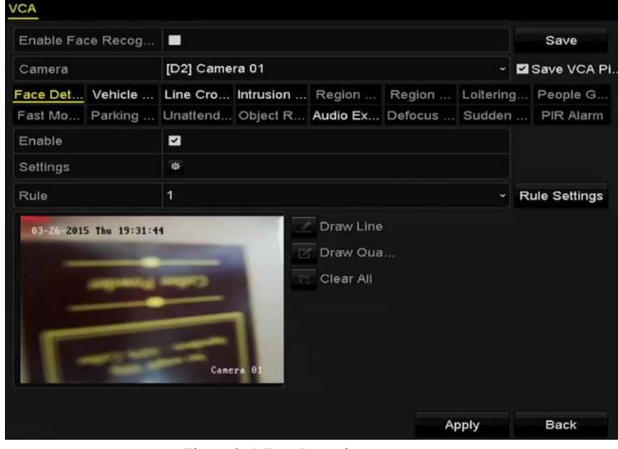

Figure 9. 1 Face Detection

- 3. Select the VCA detection type to **Face Detection**.
- 4. Check the **Enable** checkbox to enable this function.
- 5. Click to enter the face detection settings interface. Configure the trigger channel, arming schedule and linkage action for the face detection alarm. Please refer to step3~step5 of *Chapter 8.1 Setting Motion Detection Alarm* for detailed instructions.
- 6. Click the **Rule Settings** button to set the face detection rules. You can click-and-drag the slider to set the

detection sensitivity.

**Sensitivity:** Range [1-5]. The higher the value is, the more easily the face can be detected.

|             | Rule Settings |       |     |
|-------------|---------------|-------|-----|
| No.         |               |       |     |
| Sensitivity |               | <<< 3 | >>> |
|             |               |       |     |

Figure 9. 2 Set Face Detection Sensitivity

- 7. Click **Apply** to activate the settings.
### **9.2 Vehicle Detection**

#### *Purpose:*

Vehicle Detection is available for the road traffic monitoring. In Vehicle Detection, the passed vehicle can be detected and the picture of its license plate can be captured. You can send alarm signal to notify the surveillance center and upload the captured picture to FTP server.

- 1. Enter the VCA settings interface.
	- Menu> Camera> VCA
- 2. Select the camera to configure the VCA. You can click the checkbox of **Save VCA Picture** to save the captured pictures of VCA detection.
- 3. Select the VCA detection type to **Vehicle Detection**.
- 4. Check the **Enable** checkbox to enable this function.

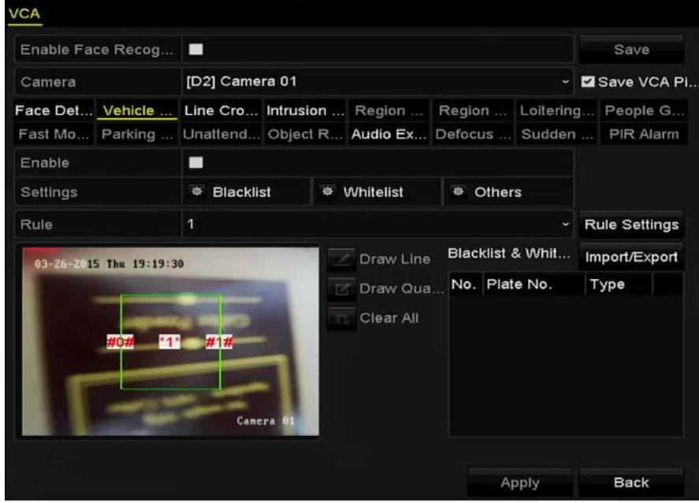

Figure 9. 3 Set Vehicle Detection

- 5. Click to configure the trigger channel, arming schedule and linkage actions for the Blacklist, Whitelist and Others.
- 6. Click the **Rule Settings** to enter the rule settings interface. Configure the lane, upload picture and overlay

|       |             | Rule Settings             |  |
|-------|-------------|---------------------------|--|
| Basic | Picture     | Overlay Content           |  |
| No.   |             | 1                         |  |
|       | Scene No.   | Vehicle Detection Scene 1 |  |
|       | Scene Name  |                           |  |
|       | Lane Number | 1                         |  |
|       |             |                           |  |
|       |             |                           |  |
|       |             |                           |  |

content settings. Up to 4 lanes are selectable.

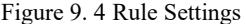

7. Click **Save** to save the settings.

Please refer to the User Manual of Network Camera for the detailed instructions for the vehicle detection.

### **9.3 Line Crossing Detection**

#### *Purpose:*

This function can be used for detecting people, vehicles and objects cross a set virtual line. The line crossing direction can be set as bidirectional, from left to right or from right to left. And you can set the duration for the alarm response actions, such as full screen monitoring, audible warning, etc.

#### *Steps:*

- 1. Enter the VCA settings interface.
Menu> Camera> VCA

- 2. Select the camera to configure the VCA.
You can click the checkbox of **Save VCA Picture** to save the captured pictures of VCA detection.

- 3. Select the VCA detection type to **Line Crossing Detection**.
- 4. Check the **Enable** checkbox to enable this function.
- 5. Click to configure the trigger channel, arming schedule and linkage actions for the line crossing detection alarm.

- 6. Click the **Rule Settings** button to set the line crossing detection rules.
	- 1) Select the direction to A<->B, A->B or A<-B.

**A<->B**: Only the arrow on the B side shows; when an object going across the configured line with both

direction can be detected and alarms are triggered.

**A->B**: Only the object crossing the configured line from the A side to the B side can be detected.

**B->A**: Only the object crossing the configured line from the B side to the A side can be detected.

- 2) Click-and-drag the slider to set the detection sensitivity.
**Sensitivity:** Range [1-100]. The higher the value is, the more easily the detection alarm can be triggered.

- 3) Click-**OK** to save the rule settings and back to the line crossing detection settings interface.

|             | Rule Settings |       |     |
|-------------|---------------|-------|-----|
| No.         |               |       |     |
| Direction   | A <->B        |       |     |
| Sensitivity |               | «« 50 | >>> |


- 7. Click and set two points in the preview window to draw a virtual line.
You can use the to clear the existing virtual line and re-draw it.

|   | 1 |  |
|---|---|--|
| - |   |  |

Up to 4 rules can be configured.

| VCA                    |         |                |                              |                       |         |           |               |           |
|------------------------|---------|----------------|------------------------------|-----------------------|---------|-----------|---------------|-----------|
| Enable Face Recog<br>> |         |                |                              |                       |         |           | Save          |           |
| Camera                 |         | [D2] Camera 01 |                              |                       |         |           | Save VCA Pi   |           |
| Face Det               | Vehicle | Line Cro       | Intrusion                    | Region                | Region  | Loitering |               | People G  |
| Fast Mo                | Parking |                | Unattend  Object R  Audio Ex |                       | Defocus | Sudden    |               | PIR Alarm |
| Enable                 |         | D              |                              |                       |         |           |               |           |
| Settings               |         | 泰              |                              |                       |         |           |               |           |
| Rule                   |         | 16             |                              |                       |         |           | Rule Settings |           |
|                        | A       | B<br>11        | C                            | Draw Qua<br>Clear All |         |           |               |           |
|                        |         |                |                              |                       |         | Apply     |               | Back      |

Figure 9. 6 Draw Line for Line Crossing Detection

- 8. Click **Apply** to activate the settings.
### **9.4 Intrusion Detection**

#### *Purpose:*

Intrusion detection function detects people, vehicle or other objects which enter and loiter in a pre-defined virtual region, and some certain actions can be taken when the alarm is triggered.

#### *Steps:*

- 1. Enter the VCA settings interface.
Menu> Camera> VCA

- 2. Select the camera to configure the VCA. You can click the checkbox of **Save VCA Picture** to save the captured pictures of VCA detection.
- 3. Select the VCA detection type to **Intrusion Detection**.
- 4. Check the **Enable** checkbox to enable this function.
- 5. Click to configure the trigger channel, arming schedule and linkage actions for the line crossing

detection alarm.

- 6. Click the **Rule Settings** button to set the intrusion detection rules. Set the following parameters.
	- 1) **Threshold:** Range [1s-10s], the threshold for the time of the object loitering in the region. When the duration of the object in the defined detection area is longer than the set time, the alarm will be triggered.
	- 2) Click-and-drag the slider to set the detection sensitivity.

**Sensitivity:** Range [1-100]. The value of the sensitivity defines the size of the object which can trigger the alarm. The higher the value is, the more easily the detection alarm can be triggered.

- 3) **Percentage:** Range [1-100]. Percentage defines the ratio of the in-region part of the object which can trigger the alarm. For example, if the percentage is set as 50%, when the object enters the region and occupies half of the whole region, the alarm is triggered.

|                    | Rule Settings |                |
|--------------------|---------------|----------------|
| No.                |               |                |
| Time Threshold (s) |               | <<< 5<br>>>>   |
| Sensitivity        |               | << < 50<br>>>> |
| Percentage         |               |                |

Figure 9. 7 Set Intrusion Crossing Detection Rules

- 4) Click-**OK** to save the rule settings and back to the line crossing detection settings interface.
- 7. Click and draw a quadrilateral in the preview window by specifying four vertexes of the detection region, and right click to complete drawing. Only one region can be configured.

You can use the to clear the existing virtual line and re-draw it.


Up to 4 rules can be configured.

| VCA                    |                         |            |                |                                       |        |               |             |           |
|------------------------|-------------------------|------------|----------------|---------------------------------------|--------|---------------|-------------|-----------|
| Enable Face Recog<br>) |                         |            |                |                                       | Save   |               |             |           |
| Camera                 |                         |            | [D2] Camera 01 |                                       |        |               | Save VCA Pi |           |
| Face Det               | Vehicle                 | Line Cro   | Intrusion      | Region                                | Region | Loitering     |             | People G  |
| Fast Mo                | Parking                 |            |                | Unattend  Object R  Audio Ex  Defocus |        | Sudden        |             | PIR Alarm |
| Enable                 |                         | D          |                |                                       |        |               |             |           |
| Settings               |                         | 都          |                |                                       |        |               |             |           |
| Rule                   |                         | 1          |                |                                       |        | Rule Settings |             |           |
|                        | 01-15-2015 Thu 00:01:14 | #1#<br>4-1 | C              | Draw Line<br>Draw Qua<br>Clear All    |        |               |             |           |
|                        |                         |            |                |                                       |        | Apply         |             | Back      |

Figure 9. 8 Draw Area for Intrusion Detection

- 8. Click **Apply** to save the settings.
### **9.5 Region Entrance Detection**

#### *Purpose:*

Region entrance detection function detects people, vehicle or other objects which enter a pre-defined virtual region from the outside place, and some certain actions can be taken when the alarm is triggered.

#### *Steps:*

- 1. Enter the VCA settings interface. Menu > Camera > VCA
- 2. Select the camera to configure the VCA. You can click the checkbox of **Save VCA Picture** to save the captured pictures of VCA detection.
- 3. Select the VCA detection type to **Region Entrance Detection**.
- 4. Check the **Enable** checkbox to enable this function.
- 5. Click to configure the trigger channel, arming schedule and linkage actions for the line crossing

detection alarm.

- 6. Click the **Rule Settings** button to set the sensitivity of the region entrance detection. **Sensitivity:** Range [0-100]. The higher the value is, the more easily the detection alarm can be triggered.
- 7. Click and draw a quadrilateral in the preview window by specifying four vertexes of the detection

region, and right click to complete drawing. Only one region can be configured.

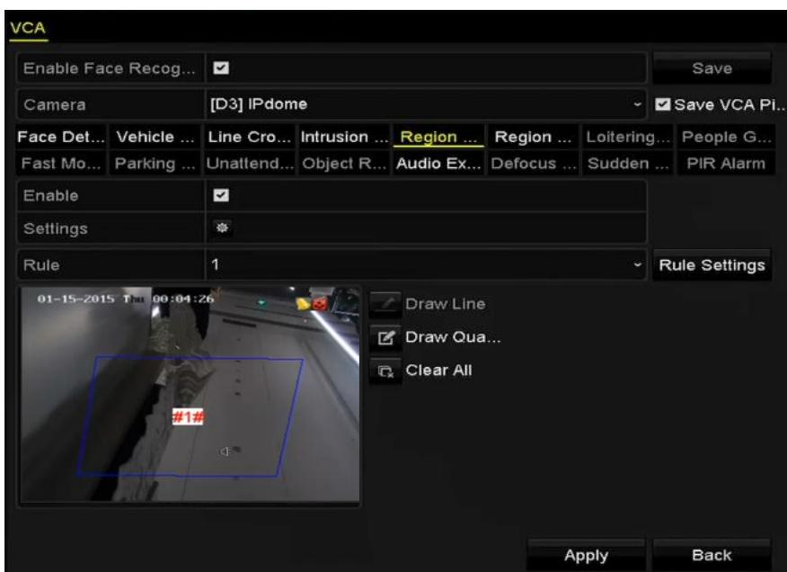

You can use the to clear the existing virtual line and re-draw it.

Figure 9. 9 Set Region Entrance Detection


- 8. Click **Apply** to save the settings.
## **9.6 Region Exiting Detection**

#### *Purpose:*

Region exiting detection function detects people, vehicle or other objects which exit from a pre-defined virtual region, and some certain actions can be taken when the alarm is triggered.


- Please refer to the *Chapter 9.5 Region Entrance Detection* for operating steps to configure the region exiting detection.
- Up to 4 rules can be configured.

## **9.7 Loitering Detection**

#### *Purpose:*

Loitering detection function detects people, vehicle or other objects which loiter in a pre-defined virtual region for some certain time, and a series of actions can be taken when the alarm is triggered.


- Please refer to the *Chapter 9.4 Intrusion Detection* for operating steps to configure the loitering detection.
- The **Threshold** [1s-10s] in the Rule Settings defines the time of the object loitering in the region. If you set the value as 5, alarm is triggered after the object loitering in the region for 5s; and if you set the value as 0, alarm is triggered immediately after the object entering the region.
- Up to 4 rules can be configured.

## **9.8 People Gathering Detection**

#### *Purpose:*

People gathering detection alarm is triggered when people gather around in a pre-defined virtual region, and a series of actions can be taken when the alarm is triggered.


- Please refer to the *Chapter 9.4 Intrusion Detection* for operating steps to configure the people gathering detection.
- The **Percentag**e in the Rule Settings defines the gathering density of the people in the region. Usually, when the percentage is small, the alarm can be triggered when small number of people gathered in the defined detection region.
- Up to 4 rules can be configured.

## **9.9 Fast Moving Detection**

#### *Purpose:*

Fast moving detection alarm is triggered when people, vehicle or other objects move fast in a pre-defined virtual region, and a series of actions can be taken when the alarm is triggered.


- Please refer to the *Chapter 9.4 Intrusion Detection* for operating steps to configure the fast moving detection.
- The **Sensitivity** in the Rule Settings defines the moving speed of the object which can trigger the alarm. The higher the value is, the more easily a moving object can trigger the alarm.
- Up to 4 rules can be configured.

## **9.10 Parking Detection**

#### *Purpose:*

Parking detection function detects illegal parking in places such as highway, one-way street, etc., and a series of actions can be taken when the alarm is triggered.


- Please refer to the *Chapter 9.4 Intrusion Detection* for operating steps to configure the parking detection.
- The **Threshold**[5s-20s] in the Rule Settings defines the time of the vehicle parking in the region. If you set the value as 10, alarm is triggered after the vehicle stay in the region for 10s.
- Up to 4 rules can be configured.

### **9.11 Unattended Baggage Detection**

#### *Purpose:*

Unattended baggage detection function detects the objects left over in the pre-defined region such as the baggage, purse, dangerous materials, etc., and a series of actions can be taken when the alarm is triggered.


- Please refer to the *Chapter 9.4 Intrusion Detection* for operating steps to configure the unattended baggage detection.
- The **Threshold**[5s-20s] in the Rule Settings defines the time of the objects left over in the region. If you set the value as 10, alarm is triggered after the object is left and stay in the region for 10s. And the **Sensitivity**  defines the similarity degree of the background image. Usually, when the sensitivity is high, a very small object left in the region can trigger the alarm.
- Up to 4 rules can be configured.

## **9.12 Object Removal Detection**

#### *Purpose:*

Object removal detection function detects the objects removed from the pre-defined region, such as the exhibits on display, and a series of actions can be taken when the alarm is triggered.


- Please refer to the *Chapter 9.4 Intrusion Detection* for operating steps to configure the object removal
detection.

- The **Threshold** [5s-20s] in the Rule Settings defines the time of the objects removed from the region. If you set the value as 10, alarm is triggered after the object disappears from the region for 10s. And the **Sensitivity**  defines the similarity degree of the background image. Usually, when the sensitivity is high, a very small object taken from the region can trigger the alarm.
- Up to 4 rules can be configured.

### **9.13 Audio Exception Detection**

#### *Purpose:*

Audio exception detection function detects the abnormal sounds in the surveillance scene, such as the sudden increase / decrease of the sound intensity, and some certain actions can be taken when the alarm is triggered.

#### *Steps:*

- 1. Enter the VCA settings interface.
Menu> Camera> VCA

- 2. Select the camera to configure the VCA.
You can click the checkbox of **Save VCA Picture** to save the captured pictures of VCA detection.

- 3. Select the VCA detection type to **Audio Exception Detection**.
- 4. Click to configure the trigger channel, arming schedule and linkage action for the face detection alarm.
- 5. Click the **Rule Settings** button to set the audio exception rules.

|                            | Rule Settings |    |                                                                                                                                                                                             |
|----------------------------|---------------|----|---------------------------------------------------------------------------------------------------------------------------------------------------------------------------------------------|
| No.                        | 1             |    |                                                                                                                                                                                             |
| Audio Loss Exception       | <             |    |                                                                                                                                                                                             |
| Sudden Increase of Sound I | >             |    |                                                                                                                                                                                             |
| Sensitivity                |               |    | 50<br>< < < < < < < < < < < < < < < < < < < < < < < < < < < < < < < < < < < < < < < < < < < < < < < < < < < < < < < < < < < < < < < < < < < < < < < < < < < < < < < < < < < < < < <<br>>>>  |
| Sound Intensity Threshold  |               |    | < < < < < < < < < < < < < < < < < < < < < < < < < < < < < < < < < < < < < < < < < < < < < < < < < < < < < < < < < < < < < < < < < < < < < < < < < < < < < < < < < < < < < < <<br>50<br>>>>> |
| Sudden Decrease of Sound   | >             |    |                                                                                                                                                                                             |
| Sensitivity                |               |    | 50<br><<<<br>>>>                                                                                                                                                                            |
|                            |               |    |                                                                                                                                                                                             |
|                            |               |    |                                                                                                                                                                                             |
|                            |               |    |                                                                                                                                                                                             |
|                            |               |    |                                                                                                                                                                                             |
|                            |               | OK | Cancel                                                                                                                                                                                      |

Figure 9. 10 Set Audio Exception Detection Rules

- 1) Check the checkbox of **Audio Input Exception** to enable the audio loss detection function.
- 2) Check the checkbox of **Sudden Increase of Sound Intensity Detection** to detect the sound steep rise in the surveillance scene. You can set the detection sensitivity and threshold for sound steep rise. **Sensitivity**: Range [1-100], the smaller the value is, the more severe the change should be to trigger the detection.

**Sound Intensity Threshold**: Range [1-100], it can filter the sound in the environment, the louder the environment sound, the higher the value should be. You can adjust it according to the real environment.

- 3) Check the checkbox of **Sudden Decrease of Sound Intensity Detection** to detect the sound steep drop in the surveillance scene. You can set the detection sensitivity[1-100] for sound steep drop.
- 6. Click **Apply** to activate the settings.
## **9.14 Sudden Scene Change Detection**

#### *Purpose:*

Scene change detection function detects the change of surveillance environment affected by the external factors; such as the intentional rotation of the camera, and some certain actions can be taken when the alarm is triggered.


- Please refer to the *Chapter 9.2 Face Detection* for operating steps to configure the scene change detection.
- The **Sensitivity** in the Rule Settings ranges from 1 to 100, and the higher the value is, the more easily the change of scene can trigger the alarm.

### **9.15 Defocus Detection**

#### *Purpose:*

The image blur caused by defocus of the lens can be detected, and some certain actions can be taken when the alarm is triggered.


- Please refer to the *Chapter 9.2 Face Detection* for operating steps to configure the defocus detection.
- The **Sensitivity** in the Rule Settings ranges from 1 to 100, and the higher the value is, the more easily the defocus image can trigger the alarm.

### **9.16 PIR Alarm**

#### *Purpose:*

A PIR (Passive Infrared) alarm is triggered when an intruder moves within the detector's field of view. The heat energy dissipated by a person, or any other warm blooded creature such as dogs, cats, etc., can be detected. *Steps:* 

- 1. Enter the VCA settings interface.
Menu> Camera> VCA

- 2. Select the camera to configure the VCA.
You can click the checkbox of **Save VCA Picture** to save the captured pictures of VCA detection.

- 3. Select the VCA detection type to **PIR Alarm**.
- 4. Click to configure the trigger channel, arming schedule and linkage action for the PIR alarm.
- 5. Click the **Rule Settings** button to set the rules. Please refer to the *Chapter 9.1 Face Detection* for instructions.
- 6. Click **Apply** to activate the settings.

# **Chapter 10 VCA Search**

With the configured VCA detection, the NVR supports the VCA search for the behavior analysis, face capture, people counting and heat map results.

## **10.1 Face Search**

#### *Purpose:*

When there are detected face picture captured and saved in HDD, you can enter the Face Search interface to search

the picture and play the picture related video file according to the specified conditions.

#### *Before you start:*

Please refer to *Chapter 9.1 Face Detection* for configuring the face detection.

#### *Steps:*

- **1.** Enter the **Face Search** interface.
Menu >VCA Search > Face Search

- **2.** Select the camera (s) for the face search.

| IP Camera  | ZD1   | PD2        | ZD3       | VD4  | 2 D5 | VD6      | DD7      | RD8  |   |
|------------|-------|------------|-----------|------|------|----------|----------|------|---|
|            | DD9   | 2 D10      | ZD11      | ZD12 | DD13 | 2 D14    | DD15     | DD16 |   |
|            | VD17  | VD18       | ZD19      | DD20 | ZD21 | V D22    | D23      | D24  |   |
|            | ZD25  | DD26       | ZD27      | ZD28 | ZD29 | 2 D30    | 2 D31    | ZD32 |   |
|            | ZID33 |            | ZD34 ZD35 | DD36 | DD37 | ZD38     | D39 DD40 |      | V |
| Start Time |       | 02-17-2015 |           |      | JE   | 00:00:00 |          |      | 9 |
|            |       |            |           |      |      |          |          |      |   |
| End Time   |       | 02-17-2015 |           |      | I    | 23:59:59 |          |      |   |
|            |       |            |           |      |      |          |          |      |   |
|            |       |            |           |      |      |          |          |      |   |
|            |       |            |           |      |      |          |          |      |   |
|            |       |            |           |      |      |          |          |      | 0 |

- Figure 10. 1 Face Search
- **3.** Specify the start time and end time for search the captured face pictures or video files.
- **4.** Click **Search** to start searching. The search results of face detection pictures are displayed in list or in chart.

|                 |                     | Face Search |            |                 |      |
|-----------------|---------------------|-------------|------------|-----------------|------|
| Chart           | List                |             |            |                 |      |
| Cam             | Start Time          | Similarity  | Play       |                 |      |
| 2 D1            | 12-08-2014 20:33:17 | -           | O          |                 |      |
| ID1             | 12-10-2014 11:18:11 | -           | 0          |                 |      |
| ID1             | 12-10-2014 11:18:11 | -           | 0          |                 |      |
|                 |                     |             |            |                 |      |
|                 |                     |             |            | 20:33:15<br>33% |      |
|                 |                     |             |            | =               | >    |
|                 |                     |             |            |                 |      |
|                 |                     |             |            |                 |      |
|                 |                     |             |            |                 |      |
|                 |                     |             |            |                 |      |
|                 |                     |             |            |                 |      |
|                 |                     |             |            |                 |      |
|                 |                     |             |            |                 |      |
| Total: 3 P: 1/1 |                     |             |            |                 |      |
| Picture         | Record              |             | Export All | Export          | Back |

Figure 10. 2 Face Search Interface

- **5.** Play the face picture related video file.
You can double click on a face picture to play its related video file in the view window on the top right, or

select a picture item and click to play it.

You can also click to stop the playing, or click / to play the previous/next file.

- **6.** If you want to export the captured face pictures to local storage device, connect the storage device to the device and click **Export All** to enter the Export interface.
Click **Export** to export all face pictures to the storage device.

Please refer to *Chapter7 Backup* for the operation of exporting files.

|                 |                    | Export |                     |               |             |   |
|-----------------|--------------------|--------|---------------------|---------------|-------------|---|
| Device Name     | USB Flash Disk 1-1 |        |                     | *.mp4; *. zip | Refresh     |   |
| Name            | Size Type          |        | Edit Date           |               | Delete Play |   |
| ch01_2015021719 | 34.67MB File       |        | 02-17-2015 20:00:11 |               | m           | O |
| ch01_2015021719 | 25.63MB File       |        | 02-17-2015 20:00:14 |               | Tun         | 0 |
| player.zip      | 2591.22KB File     |        | 02-17-2015 20:00:03 |               | m           | O |
|                 |                    |        |                     |               |             |   |
| Free Space      | 6127.17MB          |        |                     |               |             |   |
|                 | New Folder         |        | Format              | Export        | Back        |   |

Figure 10. 3 Export Files

### **10.2 Behavior Search**

#### *Purpose:*

The behavior analysis detects a series of suspicious behavior based on VCA detection, and certain linkage methods will be enabled if the alarm is triggered.

#### *Steps:*

- **1.** Enter the **Behavior Search** interface.
Menu>VCA Search> Behavior Search

- **2.** Select the camera (s) for the behavior search.
- **3.** Specify the start time and end time for searching the matched pictures.

| Behavior Search |       |            |       |      |       |             |       |       |   |
|-----------------|-------|------------|-------|------|-------|-------------|-------|-------|---|
| IP Camera       | VD1   | VD2        | VD3   | VD4  | V D5  | V D6        | VD7   | VD8   | 1 |
|                 | VD9   | VD10       | ZD11  | ZD12 | ZD13  | VD14        | VD15  | DD16  |   |
|                 | V D17 | 2 D18      | DD19  | DD20 | DD21  | 2 D22       | VD23  | V D24 |   |
|                 | VD25  | VD26       | V D27 | D28  | VD29  | VD30        | VD31  | V D32 |   |
|                 | V D33 | VD34       | > D35 | ZD36 | V D37 | VD38        | V D39 | 2 D40 |   |
|                 | VD41  | VD42       | D D43 | D44  | D D45 | VD46        | 2 D47 | VD48  |   |
|                 | VD49  | 7 D50      | VD51  | DD52 | V D53 | 7 D54       | 7 D55 | 7 D56 |   |
|                 | VD57  | ZD58       | D59   | D60  | ZD61  | ZD62        | VD63  | V D64 | > |
| Start Time      |       | 02-17-2015 |       |      |       | 00:00:00:00 |       |       | 9 |
| End Time        |       | 02-17-2015 |       |      |       | ■ 23:59:59  |       |       | 0 |
| Type            |       | All        |       |      |       |             |       |       |   |
|                 |       |            |       |      |       |             |       |       |   |
|                 |       |            |       |      |       |             |       |       |   |
|                 |       |            |       |      |       |             |       |       |   |
|                 |       |            |       |      |       | Search      |       | Back  |   |

Figure 10. 4 Behavior Search Interface

- **4.** Select the VCA detection type from the dropdown list, including the line crossing detection, intrusion detection, unattended baggage detection, object removal detection, region entrance detection, region exiting detection, parking detection, loitering detection, people gathering detection and fast moving detection.
- **5.** Click **Search** to start searching. The search results of pictures are displayed in list or in chart.

|         |                     | Behavior Search          |            |                |
|---------|---------------------|--------------------------|------------|----------------|
| Chart   | List                |                          |            |                |
|         | Start Time          | Behavior Type            | Play       |                |
|         | 12-12-2014 12:32:36 | Region Exiting Detection | (S)        |                |
| D3      | 12-12-2014 15:10:44 | Region Exiting Detection | 0          |                |
| 103     | 12-12-2014 15:11:21 | Intrusion Detection      | 0          |                |
| 103     | 12-12-2014 16:55:30 | Region Exiting Detection | 0          |                |
| ID3     | 12-12-2014 16:59:15 | Region Exiting Detection | (0)        |                |
| D3      | 12-12-2014 17:05:05 | Region Exiting Detection | C          |                |
| D3      | 12-12-2014 17:09:54 | Region Exiting Detection | 0          |                |
| D3      | 12-12-2014 17:14:40 | Region Exiting Detection | O          |                |
|         |                     |                          |            |                |
|         | Total: 8 P: 1/1     |                          |            |                |
| Picture | Record              |                          | Export All | Export<br>Back |

Figure 10. 5 Behavior Search Results

- **6.** Play the behavior analysis picture related video file.
You can double click on a picture from the list to play its related video file in the view window on the top

right, or select a picture item and click to play it.

You can also click to stop the playing, or click / to play the previous/next file.

- **7.** If you want to export the captured pictures to local storage device, connect the storage device to the device and click **Export All** to enter the Export interface.
Click **Export** to export all pictures to the storage device.

### **10.3 Plate Search**

*Purpose:* You can search and view the matched captured vehicle plate picture and related information according to the plate searching conditions including the start time/end time, country and plate No..

*Steps:* 

- **1.** Enter the **Plate Search** interface.
Menu>VCA Search> Plate Search

- **2.** Select the camera (s) for the plate search.
- **3.** Specify the start time and end time for searching the matched plate pictures.

| Plate Search           |      |            |       |           |             |          |       |       |   |
|------------------------|------|------------|-------|-----------|-------------|----------|-------|-------|---|
| IP Camera              | VD1  | VD2        | VD3   | V D4      | V D5        | VD6      | VD7   | VD8   | 1 |
|                        | VD9  | VD10       | VD11  |           | DD12 ZD13   | VD14     | ZD15  | VD16  |   |
|                        | DD17 | VD18       | 2019  | D20 DD21  |             | VD22     | FD23  | V D24 |   |
|                        | VD25 | D26        | D27   | DD28 BD29 |             | VD30     | ZD31  | V D32 |   |
|                        | VD33 | V D34      | VD35  |           | D36 DD37    | VD38     | VD39  | V D40 |   |
|                        | VD41 | 2 D42      | D43   | V D44     | DD45        | D46      | VD47  | D D48 |   |
|                        | VD49 | V D50      | V D51 |           | 7 D52 D D53 | V D54    | V D55 | VD56  |   |
|                        | VD57 | 2 D58      | 2 D59 | D60       | MD61        | V D62    | V D63 | V D64 | > |
|                        |      |            |       |           |             |          |       |       |   |
| Start Time             |      | 02-17-2015 |       |           |             | 00:00:00 |       |       | g |
| 02-17-2015<br>End Time |      |            |       |           | 23:59:59    |          | 0     |       |   |
| Country                |      | All        |       |           |             |          |       |       |   |
| Plate No.              |      |            |       |           |             |          |       |       |   |
|                        |      |            |       |           |             |          |       |       |   |
|                        |      |            |       |           |             |          |       |       |   |
|                        |      |            |       |           |             | Search   |       | Back  |   |

Figure 10. 6 Plate Search

- **4.** Select the country from the drop-down list for searching the location of the vehicle plate.
- **5.** Input the plate No. in the field for search.
- **7.** Click **Search** to start searching. The search results of detected vehicle plate pictures are displayed in list or in chart.


Please refer to the *Chapter 10.1 Face Search* for the operation of the search results.

## **10.4 People Counting**

#### *Purpose:*

The Counting is used to calculate the number of people entered or left a certain configured area and form in daily/weekly/monthly/annual reports for analysis.

*Steps:* 

- **1.** Enter the Counting interface.
Menu>VCA Search>Counting

- **2.** Select the camera for the people counting.
- **3.** Select the report type to Daily Report, Weekly Report, Monthly Report or Annual Report.
- **4.** Set the statistics time.
- **5.** Click the **Counting** button to start people counting statistics.

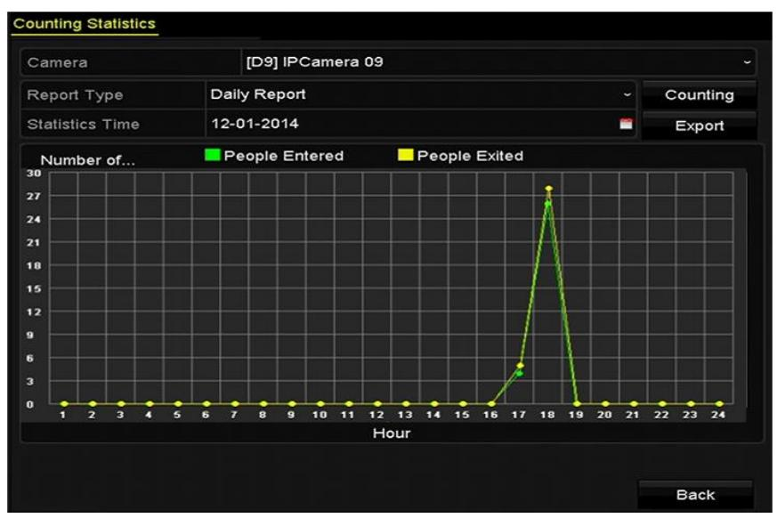

Figure 10. 7 People Counting Interface

- **6.** You can click the **Export** button to export the statistics report in excel format.
## **10.5 Heat Map**

#### *Purpose:*

Heat map is a graphical representation of data represented by colors. The heat map function is usually used to analyze the visit times and dwell time of customers in a configured area.


The heat map function must be supported by the connected IP camera and the corresponding configuration must be set.

*Steps:* 

- **1.** Enter the **Heat Map** interface.
Menu > VCA Search > Heat Map

- **2.** Select the camera for the heat map processing.
- **3.** Select the report type to Daily Report, Weekly Report, Monthly Report or Annual Report.
- **4.** Set the statistics time.

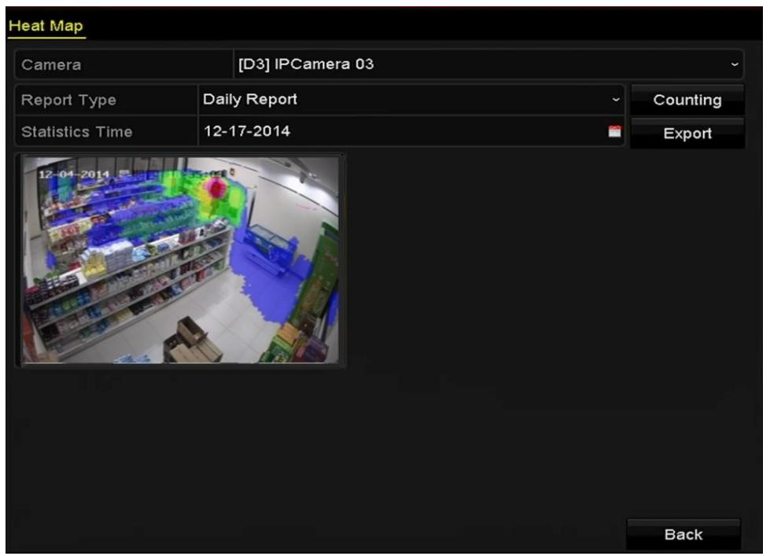

Figure 10. 8 Heat Map Interface

- **5.** Click the **Counting** button to export the report data and start heat map statistics, and the results are displayed in graphics marked in different colors.


As shown in the figure above, red color block (255, 0, 0) indicates the most welcome area, and blue color block (0, 0, 255) indicates the less-popular area.

- **6.** You can click the **Export** button to export the statistics report in excel format.
## **Chapter 11 Network Settings**

## **11.1 Configuring General Settings**

#### *Purpose:*

Network settings must be properly configured before you operate NVR over network.

#### *Steps:*

- **1.** Enter the Network Settings interface.
Menu > Configuration > Network

#### **2.** Select the **General** tab.

| General<br>PPPOE<br>DDNS         | Email<br>NTP                 | SNMP<br>NAT | More Settings                |  |  |
|----------------------------------|------------------------------|-------------|------------------------------|--|--|
| Working Mode                     | Load Balance                 |             |                              |  |  |
| Select NIC                       | bond0                        |             |                              |  |  |
| NIC Type                         | 10M/100M/1000M Self-adaptive |             |                              |  |  |
| Enable DHCP                      |                              |             |                              |  |  |
| 192 . 168 . 1<br>IPv4 Addre      | .64                          | IPv6 Addre  | fe80::240:4ffff:fe6a:7b13/64 |  |  |
| 255 . 255 . 255 . 0<br>IPv4 Subn |                              | IPv6 Addre  |                              |  |  |
| IPv4 Defa                        |                              | IPv6 Defa   |                              |  |  |
| MAC Address                      | 00:40:4f:6a:7b:13            |             |                              |  |  |
| MTU(Bytes)                       | 1500                         |             |                              |  |  |
| Preferred DNS Server             |                              |             |                              |  |  |
| Alternate DNS Server             |                              |             |                              |  |  |

Figure 11. 1 Network Settings Interface

- **3.** In the **General Settings** interface, you can configure the following settings: Working Mode, NIC Type, IPv4 Address, IPv4 Gateway, MTU and DNS Server.


The valid value range of MTU is 500 - 9676.

If the DHCP server is available, you can click the checkbox of **DHCP** to automatically obtain an IP address and other network settings from that server.

- **4.** After having configured the general settings, click **Apply** button to save the settings.
#### **Working Mode**

Four 10M/100M/1000M NIC cards are provided and it allows the device to work in the Multi-address and Net fault-tolerance modes.

**Multi-address Mode:** The parameters of the four NIC cards can be configured independently. You can select a LAN in the NIC type field for parameter settings.

You can select one NIC card as default route. And then the system is connecting with the extranet the data will be forwarded through the default route.

**Net-fault Tolerance Mode:** The four NIC cards use the same IP address, and you can select the Main NIC to any LAN. By this way, in case of one NIC card failure, the device will automatically enable the standby NIC cards so as to ensure the normal running of the whole system.

## **11.2 Configuring Advanced Settings**

### **11.2.1Configuring DDNS**

#### *Purpose:*

You can set the Dynamic DNS (DDNS) for network access.

Prior registration with your ISP is required before configuring the system to use DDNS.

#### *Steps:*

- **1.** Enter the Network Settings interface.
Menu > Configuration > Network

- **2.** Select the **DDNS** tab to enter the DDNS Settings interface.
- **3.** Check the **DDNS** checkbox to enable this feature.
- **4.** Select **DDNS Type**. Five different DDNS types are selectable: IPServer, DynDNS, PeanutHull, NO-IP, and HiDDNS.
	- **• IPServer:** Input **Server Address** for IPServer.

| Enable DDNS        | D                 |   |   |
|--------------------|-------------------|---|---|
| DDNS Type          | IPServer          |   | V |
| Area/Country       | Custom            | > | > |
| Server Address     | 172.1.1.1         |   |   |
| Device Domain Name |                   |   |   |
| Status             | DDNS is disabled. |   |   |
| User Name          |                   |   |   |
| Password           |                   |   |   |

Figure 11. 2 IPServer Settings Interface

- **• DynDNS:** 
	- 1) Enter **Server Address** for DynDNS (i.e. members.dyndns.org).
	- 2) In the **Device Domain Name** text field, enter the domain obtained from the DynDNS website.
	- 3) Enter the **User Name** and **Password** registered in the DynDNS website.

| Enable DDNS        | N                  |   |
|--------------------|--------------------|---|
| DDNS Type          | DynDNS             |   |
| Area/Country       | Custom             | ) |
| Server Address     | members.dyndns.org |   |
| Device Domain Name | 123.dyndns.com     |   |
| Status             | DDNS is disabled.  |   |
| User Name          | test               |   |
| Password           | 表示范素有意             |   |

Figure 11. 3 DynDNS Settings Interface

- **• PeanutHull:** Enter the **User Name** and **Password** obtained from the PeanutHull website.

| Enable DDNS        | >                 |   |
|--------------------|-------------------|---|
| DDNS Type          | PeanutHull        | V |
| Area/Country       | Custom<br>>       | V |
| Server Address     |                   |   |
| Device Domain Name |                   |   |
| Status             | DDNS is disabled. |   |
| User Name          | 123.gcip.net      |   |
| Password           | 表有方面表有            |   |

Figure 11. 4 PeanutHull Settings Interface

#### **• NO-IP:**

Enter the account information in the corresponding fields. Refer to the DynDNS settings.

- 1) Enter **Server Address** for NO-IP.
- 2) In the **Device Domain Name** text field, enter the domain obtained from the NO-IP website (www.no-ip.com).
- 3) Enter the **User Name** and **Password** registered in the NO-IP website.

| Enable DDNS        | )                 |   |
|--------------------|-------------------|---|
| DDNS Type          | NO-IP             | > |
| Area/Country       | Custom<br>0       |   |
| Server Address     | no-ip.org         |   |
| Device Domain Name | 123.no-ip.org     |   |
| Status             | DDNS is disabled. |   |
| User Name          | test              |   |
| Password           | ******            |   |

Figure 11. 5 NO-IP Settings Interface

#### **• HiDDNS:**

- 1) The **Server Address** of the HiDDNS server appears by default: www.hik-online.com.
- 2) Select your **Area/Country** in the dropdown list.
- 3) Enter the **Device Domain Name.** You can use the alias you registered in the HiDDNS server or define a new device domain name. If a new alias of the device domain name is defined in the NVR, it will replace the old one registered on the server. You can register the alias of the device domain name in the HiDDNS server first and then enter the alias to the **Device Domain Name** in the NVR; you can also enter the domain name directly on the NVR to create a new one.

| Enable DDNS        | >                  |         |  |
|--------------------|--------------------|---------|--|
| DDNS Type          | HIDDNS             |         |  |
| Area/Country       | Europe             | Andorra |  |
| Server Address     | www.hik-online.com |         |  |
| Device Domain Name | dvr-test           |         |  |
| Status             | DDNS is disabled.  |         |  |
| User Name          |                    |         |  |
| Password           |                    |         |  |
|                    |                    |         |  |

Figure 11. 6 HiDDNS Settings Interface

- **Register the device on the HiDDNS server.**
- 1) Go to the HiDDNS website: www.hik-online.com.

| User Name/Email     |                                        |
|---------------------|----------------------------------------|
| Input the password. |                                        |
|                     | Forget password?                       |
|                     | Login                                  |
|                     |                                        |
|                     | Did you register? Please register now! |
|                     | Register                               |

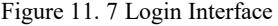

2) Click to register an account if you do not have one and use the account to log in.

- 3) In the Device Management interface, click to register the device.

| Add Device            |                                                                                                                                                                                                                                                 |  |
|-----------------------|-------------------------------------------------------------------------------------------------------------------------------------------------------------------------------------------------------------------------------------------------|--|
| * Device Serial No. : |                                                                                                                                                                                                                                                 |  |
| * Device Domain:      |                                                                                                                                                                                                                                                 |  |
|                       | Only numeric, lower case letters and '_' are supported, and the<br>string cannot be ended with ' ' or space, The length range [1-64]                                                                                                            |  |
| * HTTP Port:          | 0                                                                                                                                                                                                                                               |  |
|                       | Normally please do not change the default port value '0' ;<br>unless NAT function is enabled on the router and the external<br>http port is of different value from the internal. In that case<br>please input the value of external port here. |  |
|                       | Cancel                                                                                                                                                                                                                                          |  |

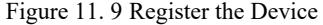

- 4) Input **Device Serial No**., **Device Domain** (**Device Name**) and **HTTP Port**. And click **OK** to add the device.
#### **Access the Device via Web Browser or Client Software**

After having successfully registered the device on the HiDDNS server, you can access your device via web browser or Client Software with the Device Domain (Device Name).

#### **OPTION 1: Access the Device via Web Browser**

Open a web browser, and enter *http://www.hik-online.com/alias* in the address bar. Alias refers to the **Device Domain** on the device or the **Device Name** on the HiDDNS server**.**

*Example: http://www.hik-online.com/nvr*


If you mapped the HTTP port on your router and changed it to port No. except 80, you have to enter *http://www.hik-online.com/alias:HTTP port* in the address bar to access the device. You can refer to *Chapter 9.2.11* for the mapped HTTP port No..

**OPTION 2: Access the devices via iVMS4200** 

For iVMS-4200, in the Add Device window, select and then edit the device information.

**Nickname**: Edit a name for the device as you want.

**Server Address**: www.hik-online.com

**Device Domain Name**: It refers to the **Device Domain Name** on the device or the **Device Name**  on the HiDDNS server you created**.**

**User Name**: Enter the user name of the device.

**Password**: Enter the password of the device.

|                     | Add                |              |          |
|---------------------|--------------------|--------------|----------|
| Adding Mode:        | O IP/Domain        | O IP Segment | · HiDDNS |
| Nickname:           |                    |              |          |
| Server Address:     | www.hik-online.com |              |          |
| Device Domain Name: |                    |              |          |
| User Name:          |                    |              |          |
| Password:           |                    |              |          |
| Group:              | Default Group      | >            |          |
|                     |                    |              |          |
|                     |                    |              |          |
|                     |                    |              |          |
|                     |                    |              |          |
|                     |                    |              | Add      |

Figure 11. 10 Access Device via iVMS4200

- **5.** Click the **Apply** button to save and exit the interface.
### **11.2.2Configuring NTP Server**

#### *Purpose:*

A Network Time Protocol (NTP) Server can be configured on your NVR to ensure the accuracy of system date/time.

#### *Steps:*

- **1.** Enter the Network Settings interface.
Menu >Configuration> Network

- **2.** Select the **NTP** tab to enter the NTP Settings interface, as shown in Figure 11. 11.

| Enable NTP     | 12  |  |
|----------------|-----|--|
| Interval (min) | 60  |  |
| NTP Server     |     |  |
| NTP Port       | 123 |  |

Figure 11. 11 NTP Settings Interface

- **3.** Check the **Enable NTP** checkbox to enable this feature.
- **4.** Configure the following NTP settings:
	- **• Interval:** Time interval between the two synchronizing actions with NTP server. The unit is minute.
	- **• NTP Server:** IP address of NTP server.
	- **• NTP Port:** Port of NTP server.
- **5.** Click the **Apply** button to save and exit the interface.


The time synchronization interval can be set from1 to 10080min, and the default value is 60min. If the NVR is connected to a public network, you should use a NTP server that has a time synchronization function, such as the server at the National Time Center (IP Address: 210.72.145.44). If the NVR is setup in a more customized network, NTP software can be used to establish a NTP server used for time synchronization.

### **11.2.3Configuring SNMP**

#### *Purpose:*

You can use SNMP protocol to get device status and parameters related information.

#### *Steps:*

- **1.** Enter the Network Settings interface.
Menu >Configuration> Network

- **2.** Select the **SNMP** tab to enter the SNMP Settings interface, as shown in Figure 11. 12.

| Enable SNMP     | ra      |  |
|-----------------|---------|--|
| SNMP Version    | V2      |  |
| SNMP Port       | 161     |  |
| Read Community  | public  |  |
| Write Community | private |  |
| Trap Address    |         |  |
| Trap Port       | 162     |  |

Figure 11. 12 SNMP Settings Interface

- **3.** Check the **SNMP** checkbox to enable this feature.
- **4.** The enabling of SNMP may cause security problems. Click **Yes** to continue or **No** to cancel the operation.

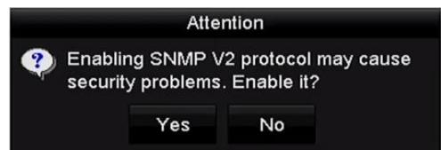

Figure 11. 13 SNMP Settings Interface

- **5.** When you choose the Yes option in step4, configure the following SNMP settings:
	- **• Trap Address:** IP Address of SNMP host.
	- **• Trap Port:** Port of SNMP host.
- **6.** Click the **Apply** button to save and exit the interface.


Before setting the SNMP, please download the SNMP software and manage to receive the device information via SNMP port. By setting the Trap Address, the NVR is allowed to send the alarm event and exception message to the surveillance center.

### **11.2.4Configuring More Settings**

- **1.** Enter the Network Settings interface. Menu > Configuration > Network
- **2.** Select the **More Settings** tab to enter the More Settings interface.

| Alarm Host IP   |      |  |  |
|-----------------|------|--|--|
| Alarm Host Port | 0    |  |  |
| Server Port     | 8000 |  |  |
| HT TP Port      | 80   |  |  |
| Multicast IP    |      |  |  |
| RTSP Port       | 554  |  |  |

Figure 11. 14 More Settings Interface

- **3.** Configure the remote alarm host, server port, HTTP port, multicast, RTSP port.
	- **Alarm Host IP/Port**: With a remote alarm host configured, the device will send the alarm event or exception message to the host when an alarm is triggered. The remote alarm host must have the CMS (Client Management System) software installed.

The **Alarm Host IP** refers to the IP address of the remote PC on which the CMS (Client Management System) software (e.g., iVMS-4200) is installed, and the **Alarm Host Port** must be the same as the alarm monitoring port configured in the software (default port is 7200).

- **Multicast IP**: The multicast can be configured to realize live view for more than the maximum number of cameras through network. A multicast address spans the Class-D IP range of 224.0.0.0 to 239.255.255.255. It is recommended to use the IP address ranging from 239.252.0.0 to 239.255.255.255.
When adding a device to the CMS (Client Management System) software, the multicast address must be the same as the device's multicast IP.

- **RTSP Port**: The RTSP (Real Time Streaming Protocol) is a network control protocol designed for use in entertainment and communications systems to control streaming media servers. Enter the RTSP port in the text field of **RTSP Port**. The default RTSP port is 554, and you can change it according to different requirements.
- **Server Port** and **HTTP Port**: Enter the **Server Port** and **HTTP Port** in the text fields. The default Server Port is 8000 and the HTTP Port is 80, and you can change them according to different requirements.


The Server Port should be set to the range of 2000-65535 and it is used for remote client software access. The HTTP port is used for remote IE access.

| Alarm Host IP   | 192.0.0.10   |
|-----------------|--------------|
| Alarm Host Port | 7200         |
| Server Port     | 8000         |
| HTTP Port       | 80           |
| Multicast IP    | 239.252.2.50 |
| RTSP Port       | 554          |

Figure 11. 15 Configure More Settings

**4.** Click the **Apply** button to save and exit the interface.

### **11.2.5Configuring HTTPS Port**

#### *Purpose:*

HTTPS provides authentication of the web site and associated web server that one is communicating with, which protects against Man-in-the-middle attacks. Perform the following steps to set the port number of https.

#### *Example:*

If you set the port number as 443 and the IP address is 192.0.0.64, you may access the device by inputting *https://192.0.0.64:443* via the web browser.


The HTTPS port can be only configured through the web browser.

#### *Steps:*

- **1.** Open web browser, input the IP address of device, and the web server will select the language automatically according to the system language and maximize the web browser.
- **2.** Input the correct user name and password, and click **Login** button to log in the device.
- **3.** Enter the HTTPS settings interface.

Configuration > Remote Configuration > Network Settings > HTTPS

- **4.** Create the self-signed certificate or authorized certificate.

| Enable                         |                                                                                                       |
|--------------------------------|-------------------------------------------------------------------------------------------------------|
| Install Certificate            |                                                                                                       |
| Installation Method            | Create Self-signed Certificate<br>O Signed certificate is available, start the installation directly. |
| Create Self-signed Certificate | Create the certificate request first and continue the installation.<br>Create                         |
| Save                           |                                                                                                       |


**OPTION 1**: Create the self-signed certificate

- 1) Click the **Create** button to create the following dialog box.

| Country             | CN          | * example: CN       |
|---------------------|-------------|---------------------|
| Hostname/IP         | 172.6.23.67 | 女                   |
| Validity            | 200         | Day* range : 1-5000 |
| Password            |             |                     |
| State or province   |             |                     |
| Locality            |             |                     |
| Organization        |             |                     |
| Organizational Unit |             |                     |
| Email               |             |                     |
|                     |             | OK<br>Cancel        |

Figure 11. 17 Create Self-signed Certificate

- 2) Enter the country, host name/IP, validity and other information.
- 3) Click **OK** to save the settings.

**OPTION 2**: Create the authorized certificate

- 1) Click the **Create** button to create the certificate request.
- 2) Download the certificate request and submit it to the trusted certificate authority for signature.
- 3) After receiving the signed valid certificate, import the certificate to the device.

- **5.** There will be the certificate information after you successfully create and install the certificate.

| Installed Certificate | C=CN                                                                                    |  | Delete |
|-----------------------|-----------------------------------------------------------------------------------------|--|--------|
| Property              | Subject: C=CN<br>Issuer: C=CN<br>Validity: 2016-06-14 16:03:33<br>~ 2016-07-04 16:03:33 |  |        |
|                       |                                                                                         |  |        |

Figure 11. 18 Installed Certificate Property

- **6.** Check the checkbox to enable the HTTPS function.
- **7.** Click the **Save** button to save the settings.

### **11.2.6Configuring Email**

#### *Purpose:*

The system can be configured to send an Email notification to all designated users if an alarm event is detected, etc., an alarm or motion event is detected or the administrator password is changed.

Before configuring the Email settings, the NVR must be connected to a local area network (LAN) that maintains an SMTP mail server. The network must also be connected to either an intranet or the Internet depending on the location of the e-mail accounts to which you want to send notification.

#### *Steps:*

- **1.** Enter the Network Settings interface.
Menu >Configuration> Network

- **2.** Set the IPv4 Address, IPv4 Subnet Mask, IPv4 Gateway and the Preferred DNS Server in the Network Settings menu.

| General<br>РРРОЕ<br>DDNS         | NTP<br>Email                 | SNIMP<br>NAT | More Settings               |
|----------------------------------|------------------------------|--------------|-----------------------------|
| Working Mode                     | Net Fault-tolerance          |              |                             |
| Select NIC                       | bond0                        |              |                             |
| NIC Type                         | 10M/100M/1000M Self-adaptive |              |                             |
| Enable DHCP                      |                              |              |                             |
| 192 . 168 . 1<br>IPv4 Addre      | .64                          | IPv6 Addre   | fe80::240:4fff:fe6a:7b13/64 |
| 255 . 255 . 255 . 0<br>IPv4 Subn |                              | IPv6 Addre   |                             |
| IPv4 Defa                        |                              | IPv6 Defa    |                             |
| MAC Address                      | 00:40:4f:6a:7b:13            |              |                             |
| MTU(Bytes)                       | 1500                         |              |                             |
| Preferred DNS Server             | 10.1.7.22                    |              |                             |
| Alternate DNS Server             |                              |              |                             |
| Main NIC                         | LAN1                         |              |                             |

Figure 11. 19 Network Settings Interface

- **3.** Click **Apply** to save the settings.
- **4.** Select the Email tab to enter the Email Settings interface.

| User Name<br>25<br>SMTP Port<br>Enable SS<br>Password |   |
|-------------------------------------------------------|---|
|                                                       |   |
|                                                       |   |
| Sender                                                |   |
| Sender's Address                                      |   |
| Receiver 1<br>Select Receivers                        |   |
| Receiver                                              |   |
| Receiver's Address                                    |   |
| Enable Attached Picture                               |   |
| Interval<br>2s                                        | V |

Figure 11. 20 Email Settings Interface

- **5.** Configure the following Email settings:
**Enable Server Authentication** (optional)**:** Check the checkbox to enable the server authentication feature.

**User Name:** The user name of sender's account registered on the SMTP server. **Password:** The password of sender's account registered on the SMTP server.

**SMTP Server:** The SMTP Server IP address or host name (e.g., smtp.263xmail.com).

**SMTP Port:** The SMTP port. The default TCP/IP port used for SMTP is 25.

**Enable SSL/TLS** (optional)**:** Click the checkbox to enable SSL/TLS if required by the SMTP server.

**Sender:** The name of sender.

**Sender's Address:** The Email address of sender.

**Select Receivers:** Select the receiver. Up to 3 receivers can be configured.

**Receiver:** The name of user to be notified.

**Receiver's Address:** The Email address of user to be notified.

**Enable Attached Picture:** Check the checkbox of **Enable Attached Picture** if you want to send email with attached alarm images. The interval is the time of two adjacent alarm images. You can also set SMTP port and enable SSL here.

**Interval:** The interval refers to the time between two actions of sending attached pictures.

- **6.** Click **Apply** button to save the Email settings.
- **7.** You can click **Test** button to test whether your Email settings work.

### **11.2.7Configuring NAT**

#### *Purpose:*

Two ways are provided for port mapping to realize the remote access via the cross-segment network, UPnP™ and manual mapping.

#### **UPnPTM**

Universal Plug and Play (UPnP™) can permit the device seamlessly discover the presence of other network devices on the network and establish functional network services for data sharing, communications, etc. You can use the UPnP™ function to enable the fast connection of the device to the WAN via a router without port mapping.

#### *Before you start:*

If you want to enable the UPnP™ function of the device, you must enable the UPnP™ function of the router to

which your device is connected. When the network working mode of the device is set as multi-address, the Default Route of the device should be in the same network segment as that of the LAN IP address of the router.

*Steps:*

- **1.** Enter the Network Settings interface.
Menu > Configuration > Network

- **2.** Select the **NAT** tab to enter the port mapping interface.

|              |      | 100    |                                  |      |          |  |
|--------------|------|--------|----------------------------------|------|----------|--|
| Mapping Type |      | Manual |                                  |      |          |  |
| Port Type    | Edit |        | External Port Mapping IP Address | Port | Status   |  |
| Server Port  | 175  | 8000   | 0.0.0.0                          | 8000 | Inactive |  |
| HITP Port    | 17   | 80     | 0.0.0.0                          | 80   | Inactive |  |
| RTSP Port    | 17   | 554    | 0.0.0.0                          | 554  | Inactive |  |
| HITPS Port   | 172  | 443    | 0.0.0.0                          | 443  | Inactive |  |

Figure 11. 21 UPnP™ Settings Interface

- **3.** Check checkbox to enable UPnP™.
- **4.** Select the Mapping Type as Manual or Auto in the drop-down list.

#### **OPTION 1: Auto**

If you select Auto, the Port Mapping items are read-only, and the external ports are set by the router automatically.

#### *Steps:*

- 1) Select **Auto** in the drop-down list of Mapping Type.
- 2) Click **Apply** button to save the settings.
- 3) You can click **Refresh** button to get the latest status of the port mapping.

| Enable UPnP  |      | D             |                    |      |        |         |
|--------------|------|---------------|--------------------|------|--------|---------|
| Mapping Type |      | Auto          |                    |      |        | p       |
| Port Type    | Edit | External Port | Mapping IP Address | Port | Status |         |
| Server Port  | 12   | 43728         | 1726 21 31         | 8000 | Active |         |
| HTTP Port    | 17   | 31397         | 172.6.21.31        | 80   | Active |         |
| RISP Port    | 12   | 59826         | 1726 21 31         | 554  | Active |         |
| HTTPS Port   | 17   | 31231         | 172.6.21.31        | 443  | Active |         |
|              |      |               |                    |      |        |         |
|              |      |               |                    |      |        | Refresh |

Figure 11. 22 UPnP™ Settings Finished-Auto

#### **OPTION 2: Manual**

If you select Manual as the mapping type, you can edit the external port on your demand by clicking to activate the External Port Settings dialog box.

- 1) Select **Manual** in the drop-down list of Mapping Type.
- 2) Click to activate the External Port Settings dialog box. Configure the external port No. for server port, http port, RTSP port and https port respectively.


- You can use the default port No., or change it according to actual requirements.
- External Port indicates the port No. for port mapping in the router.

- The value of the RTSP port No. should be 554 or between 1024 and 65535, while the value of the other ports should be between 1 and 65535 and the value must be different from each other. If multiple devices are configured for the UPnP™ settings under the same router, the value of the port No. for each device should be unique.

|               | External Port Settings |    |        |
|---------------|------------------------|----|--------|
| Port Type     | Server Port            |    |        |
| External Port | 8001                   |    |        |
|               |                        |    |        |
|               |                        |    |        |
|               |                        |    |        |
|               |                        |    |        |
|               |                        |    |        |
|               |                        | OK | Cancel |

Figure 11. 23 External Port Settings Dialog Box

- 3) Click **Apply** button to save the settings.
- 4) You can click **Refresh** button to get the latest status of the port mapping.

| Enable UPnP  |      | D             |                    |      |        |         |
|--------------|------|---------------|--------------------|------|--------|---------|
| Mapping Type |      | Manual        |                    |      |        |         |
| Port Type    | Edit | External Port | Mapping IP Address | Port | Status |         |
| Server Port  | 1    | 8002          | 1726.21.31         | 8000 | Active |         |
| HTTP Port    | 12   | 80            | 172.6.21.31        | 80   | Active |         |
| RTSP Port    | 1    | 554           | 172.6.21.31        | 554  | Active |         |
| HTTPS Port   | P    | 443           | 172.6.21.31        | 443  | Active |         |
|              |      |               |                    |      |        |         |
|              |      |               |                    |      |        | Refresh |

Figure 11. 24 UPnP™ Settings Finished-Manual

#### **Manual Mapping**

If your router does not support the UPnPTM function, perform the following steps to map the port manually in an easy way.

### *Before you start:*

Make sure the router support the configuration of internal port and external port in the interface of Forwarding.

#### *Steps:*

- **1.** Enter the Network Settings interface.
Menu > Configuration > Network

- **2.** Select the **NAT** tab to enter the port mapping interface.
- **3.** Leave the Enable UPnP checkbox unchecked.
- **4.** Click to activate the External Port Settings dialog box. Configure the external port No. for server port, http port, RTSP port and https port respectively.


The value of the RTSP port No. should be 554 or between 1024 and 65535, while the value of the other ports should be between 1 and 65535 and the value must be different from each other. If multiple devices are configured for the UPnP™ settings under the same router, the value of the port No. for each device should be unique.

| External Port Settings |           |  |  |  |
|------------------------|-----------|--|--|--|
| Port Type              | HTTP Port |  |  |  |
| External Port          | 81        |  |  |  |
|                        |           |  |  |  |
|                        |           |  |  |  |
|                        |           |  |  |  |
|                        |           |  |  |  |
|                        |           |  |  |  |

Figure 11. 25 External Port Settings Dialog Box

- **5.** Click **OK** to save the setting for the current port and return to the upper-level menu.
- **6.** Click **Apply** button to save the settings.
- **7.** Enter the virtual server setting page of router; fill in the blank of Internal Source Port with the internal port value, the blank of External Source Port with the external port value, and other required contents.


Each item should be corresponding with the device port, including server port, http port, RTSP port and https port.

|   | External<br>Port | Delete Source Protocol Internal Source IP Source |                 | Internal<br>Port | Application |  |
|---|------------------|--------------------------------------------------|-----------------|------------------|-------------|--|
| □ | 81               | TCP ▼                                            | 192.168.251.101 | 80               | HTTP<br>>   |  |

Figure 11. 26 Setting Virtual Server Item


The above virtual server setting interface is for reference only, it may be different due to different router manufactures. Please contact the manufacture of router if you have any problems with setting virtual server.

## **11.3 Checking Network Traffic**

#### *Purpose:*

You can check the network traffic to obtain real-time information of NVR such as linking status, MTU, sending/receiving rate, etc.

*Steps:*

- **1.** Enter the Network Traffic interface.
Menu > Maintenance > Net Detect

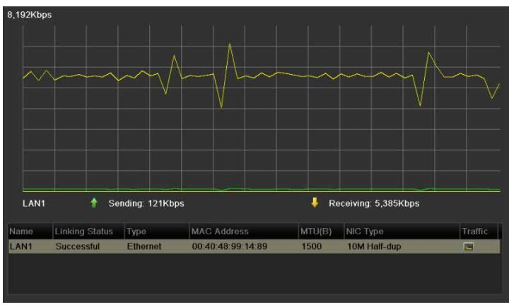

Figure 11. 27 Network Traffic Interface

- **2.** You can view the sending rate and receiving rate information on the interface. The traffic data is refreshed every 1 second.
## **11.4 Configuring Network Detection**

#### *Purpose:*

You can obtain network connecting status of NVR through the network detection function, including network delay, packet loss, etc.

### **11.4.1Testing Network Delay and Packet Loss**

#### *Steps:*

- **1.** Enter the Network Traffic interface.
Menu >Maintenance>Net Detect

- **2.** Click the **Network Detection** tab to enter the Network Detection menu, as shown in Figure 11. 28.

| Network Detection<br>Traffic | Network Stat.                   |           |  |         |  |  |
|------------------------------|---------------------------------|-----------|--|---------|--|--|
|                              | Network Delay, Packet Loss Test |           |  |         |  |  |
| Select NIC                   | bond0                           |           |  |         |  |  |
| Destination Address          |                                 |           |  | Test    |  |  |
| Network Packet Export        |                                 |           |  |         |  |  |
| Device Name                  | USB Flash Disk 1-1              |           |  | Refresh |  |  |
| bond0                        | 10.16.1.110                     | 1,331Kbps |  | Export  |  |  |

Figure 11. 28 Network Detection Interface

- **3.** Enter the destination address in the text field of **Destination Address**.
- **4.** Click **Test** button to start testing network delay and packet loss. The testing result pops up on the window. If the testing is failed, the error message box will pop up as well. Refer to Figure 11. 29.

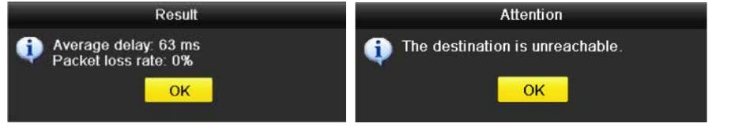

Figure 11. 29 Testing Result of Network Delay and Packet Loss

### **11.4.2Exporting Network Packet**

#### *Purpose:*

By connecting the NVR to network, the captured network data packet can be exported to USB-flash disk, SATA/eSATA, DVD-R/W and other local backup devices.

#### *Steps:*

- **1.** Enter the Network Traffic interface.
Menu >Maintenance>Net Detect

- **2.** Click the **Network Detection** tab to enter the Network Detection interface.
**3.** Select the backup device from the dropdown list of Device Name, as shown in Figure 11. 30.


Click **Refresh** button if the connected local backup device cannot be displayed. When it fails to detect the backup device, please check whether it is compatible with the NVR. You can format the backup device if the format is incorrect.

| Traffic<br>Network Detection    | Network Stat.            |         |  |  |  |
|---------------------------------|--------------------------|---------|--|--|--|
| Network Delay, Packet Loss Test |                          |         |  |  |  |
| Select NIC                      | bond0                    |         |  |  |  |
| Destination Address             | 192.168.1.55             | Test    |  |  |  |
| Network Packet Export           |                          |         |  |  |  |
| Device Name                     | USB Flash Disk 1-1<br>>  | Refresh |  |  |  |
| bond0                           | 10.16.1.110<br>1.646Kbps | Export  |  |  |  |

Figure 11. 30 Export Network Packet

- **4.** Click **Export** button to start exporting.
- **5.** After the exporting is complete, click **OK** to finish the packet export, as shown in Figure 11. 31.

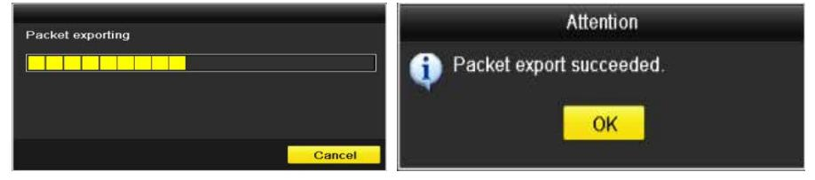

Figure 11. 31 Packet Export Attention


Up to 1M data can be exported each time.

### **11.4.3Checking the Network Status**

#### *Purpose:*

You can also check the network status and quick set the network parameters in this interface. *Steps:*

Click the **Status** button on the lower- right corner of the page.

| Traffic<br>Network Detection | Network Stat.                   |         |         |         |  |  |
|------------------------------|---------------------------------|---------|---------|---------|--|--|
|                              | Network Delay, Packet Loss Test |         |         |         |  |  |
| Select NIC                   | LAN1                            |         | >       |         |  |  |
| Destination Address          |                                 |         |         | Tost    |  |  |
| Network Packet Export        |                                 |         |         |         |  |  |
| Device Name                  |                                 |         | V       | Refresh |  |  |
| LAN1                         | 172.6.23.188                    | 891Kbps |         | Export  |  |  |
|                              |                                 |         |         |         |  |  |
|                              |                                 |         |         |         |  |  |
|                              |                                 |         |         |         |  |  |
|                              |                                 |         |         |         |  |  |
|                              |                                 |         |         |         |  |  |
|                              |                                 |         |         |         |  |  |
|                              |                                 | Status  | Network | Back    |  |  |

Figure 11. 32 Network Status Checking

If the network is normal the following message box pops out.

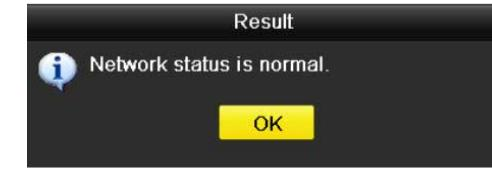

Figure 11. 33 Network Status Checking Result

If the message box pops out with other information instead of this one, you can click **Network** button to show the quick setting interface of the network parameters.

### **11.4.4Checking Network Statistics**

#### *Purpose*:

You can check the network status to obtain the real-time information of NVR.

*Steps:*

- **1.** Enter the Network Detection interface.
Menu>Maintenance>Net Detect

- **2.** Choose the **Network Stat.** tab.

| Traffic<br>Network Detection | Network Stat. |           |         |
|------------------------------|---------------|-----------|---------|
| Type                         |               | Bandwidth |         |
| IP Camera                    |               | 9,216Kbps |         |
| Remote Live View             |               | Obps      |         |
| Remote Playback              |               | Obps      |         |
| Net Receive Idle             |               | 503Mbps   |         |
| Net Send Idle                |               | 512Mbps   |         |
|                              |               |           |         |
|                              |               |           | Refresh |

Figure 11. 34 Network Stat. Interface

- **3.** Check the bandwidth of IP Camera, bandwidth of Remote Live View, bandwidth of Remote Playback, bandwidth of Net Receive Idle and bandwidth of Net Send Idle.
- **4.** You can click **Refresh** to get the newest status.

# **Chapter 12 RAID**

### **12.1 Configuring Array**

#### *Purpose:*

RAID (redundant array of independent disks) is a storage technology that combines multiple disk drive components into a logical unit. A RAID setup stores data over multiple hard disk drives to provide enough redundancy so that data can be recovered if one disk fails. Data is distributed across the drives in one of several ways called "RAID levels", depending on what level of redundancy and performance is required. The NVR supports the disk array that is realized by software. You can enable the RAID function on your demand. *Before you start:* 

Please install the HDD(s) properly and it is recommended to use the same enterprise-level HDDs (including model and capacity) for array creation and configuration so as to maintain reliable and stable running of the disks. *Introduction:* 

The NVR can store the data (such as record, picture, log information) in the HDD only after you have created the array or you have configured network HDD (refer to *Chapter13.2 Managing Network HDD*). Our device provides two ways for creating array, including one-touch configuration and manual configuration. The following flow chart shows the process of creating array.


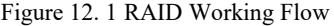

### **12.1.1Enable RAID**

#### *Purpose:*

Perform the following steps to enable the RAID function, or the disk array cannot be created.

#### **OPTION 1:**

Enable the RAID function in the Wizard when the device startup, please refer to step 5 of Chapter *2.4 Using* 

#### *Wizard for Basic Configuration*.

#### **OPTION 2:**

Enable the RAID function in the HDD Management Interface.

#### *Steps:*

- **1.** Enter the disk mode configuration interface.
Menu > HDD > Advanced

|             | Disk Mode Storage Mode |  |  |  |
|-------------|------------------------|--|--|--|
| Enable RAID |                        |  |  |  |
|             |                        |  |  |  |

Figure 12. 2 Enable RAID Interface

- **2.** Check the checkbox of **Enable RAID**.
- **3.** Click the **Apply** button to save the settings.

### **12.1.2One-Touch Configuration**

#### *Purpose:*

Through one-touch configuration, you can quickly create the disk array. By default, the array type to be created is RAID 5.

*Before you start:* 

- 1. The RAID function should be enabled, please refer to the Chapter *12.1.1 Enable RAID* for details.
- 2. As the default array type is RAID 5, please install at least 3 HDDs in you device.
- 3. If more than 10 HDDs are installed, 2 arrays can be configured.

#### *Steps:*

- **1.** Enter the RAID configuration interface.
Menu > HDD > RAID

| Physical Disk | Array<br>Firmware |        |            |                   |        |
|---------------|-------------------|--------|------------|-------------------|--------|
| No.           | Capacity Array    | Type   | Status     | Model             | Hot Sp |
| 网2            | 465.76GB          | Normal | Functional | WDC WD5000YS-0    | 1      |
| 26            | 931.51GB          | Normal | Functional | ST31000524NS      | 11     |
| 77            | 931.51GB          | Normal | Functional | WDC WD10EVVS-6  ■ |        |
|               |                   |        |            |                   |        |
|               |                   |        |            |                   | Create |

Figure 12. 3 Physical Disk Interface

- **2.** Check the checkbox of corresponding HDD No. to select it.
- **3.** Click the **One-touch Create** button to enter the One-touch Array Configuration interface.

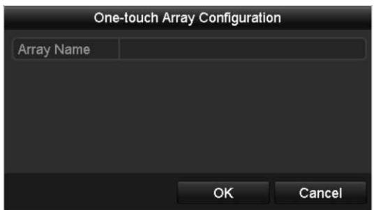

Figure 12. 4 One-touch Array Configuration

**4.** Edit the array name in the **Array Name** text filed and click **OK** button to start configuring array.


If you install 4 HDDs or above for one-touch configuration, a hot spare disk will be set by default. It is recommended to set hot spare disk for automatically rebuilding the array when the array is abnormal.

- **5.** When the array configuration is completed, click **OK** button in the pop-up message box to finish the settings.
- **6.** You can click **Array** tab to view the information of the successfully created array.

By default, one-touch configuration creates an array and a virtual disk.

| Physical Disk | Array<br>Firmware                                              |  |                  |  |    |                      |
|---------------|----------------------------------------------------------------|--|------------------|--|----|----------------------|
| No. Name      | Free Space Physic    Hot    Status   Level   Re    Del    Task |  |                  |  |    |                      |
| array1_1      | 931/931G 2 6 7                                                 |  | Functi  RAID 5 ■ |  | Tu | Initialize (Fast)(Ri |
|               |                                                                |  |                  |  |    |                      |

Figure 12. 5 Array Settings Interface

- **7.** A created array displays as an HDD in the HDD information interface.

| L | Capacity | Status           | Property | Type  | Free Space Gr  Edit D |  |  |
|---|----------|------------------|----------|-------|-----------------------|--|--|
|   | 931.52GB | Initializing 82% | RW       | Array | OMB                   |  |  |

Figure 12. 6 HDD Information Interface

### **12.1.3Manually Creating Array**

#### *Purpose:*

You can manually create the array of RAID 0, RAID 1, RAID 5, RAID6, and RAID 10.


In this section, we take RAID 5 as an example to describe the manual configuration of array and virtual disk.

- **1.** Enter the Physical Disk Settings interface.
Menu > HDD > RAID > Physical Disk

| Physical Disk | Array<br>Firmware |        |            |                   |        |
|---------------|-------------------|--------|------------|-------------------|--------|
| No.           | Capacity Array    | Type   | Status     | Model             | Hot Sp |
| 22            | 465.76GB          | Normal | Functional | WDC WD5000YS-0    | 17     |
| 26            | 931.51GB          | Normal | Functional | ST31000524NS      | 14     |
| 77            | 931.51GB          | Normal | Functional | WDC WD10EVVS-6  P |        |
|               |                   |        |            |                   |        |
|               |                   |        |            |                   | Create |

Figure 12. 7 Physical Disk Settings Interface

- **2.** Click **Create** button to enter the Create Array interface.

|                                   |        | Create Array      |    |    |        |
|-----------------------------------|--------|-------------------|----|----|--------|
| Array Name                        | array  |                   |    |    |        |
| RAID Level                        | RAID 5 |                   |    |    |        |
| Initialization Type               |        | Initialize (Fast) |    |    |        |
| Physical Disk                     | 22     | 26                | 27 |    |        |
| Array Capacity (Estimated): 931GB |        |                   |    |    |        |
|                                   |        |                   |    | OK | Cancel |

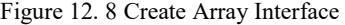

- **3.** Edit the **Array Name**; set the **RAID Level** to RAID 0, RAID 1, RAID 5, RAID6, or RAID 10; select the **Physical Disk** that you want to configure array.


- If you choose RAID 0, at least 2 HDDs must be installed.
- If you choose RAID 1, 2 HDDs need to be configured for RAID 1.
- If you choose RAID 5, at least 3 HDDs must be installed.
- If you choose RAID 6, at least 4 HDDs must be installed.
- If you choose RAID 10, the number of HDDs installed should be even in the range of 4 to 16.
- **4.** Click **OK** button to create array.


If the number of HDDs you select is not compatible with the requirement of the RAID level, the error message box

will pop up.

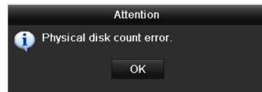

Figure 12. 9 Error Message Box

- **5.** You can click **Array** tab to view the successfully created array.

| No. Name | Free Space Physic    Hot  Status   Level   Re    Del  Task |  |                  |  |   |                      |
|----------|------------------------------------------------------------|--|------------------|--|---|----------------------|
| array1_1 | 931/931G 2 6 7                                             |  | Functi  RAID 5 ■ |  | m | Initialize (Fast)(Rı |

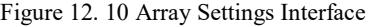

## **12.2 Rebuilding Array**

#### *Purpose:*

The working status of array includes Functional, Degraded and Offline. By viewing the array status, you can take immediate and proper maintenance for the disks so as to ensure the high security and reliability of the data stored in the disk array.

When there is no disk loss in the array, the working status of array will change to Functional; when the number of lost disks has exceeded the limit, the working status of array will change to Offline; in other conditions, the working status is Degraded.

When the virtual disk is in Degraded status, you can restore it to Functional by array rebuilding.

#### *Before you start:*

Please make sure the hot spare disk is configured.

- 1. Enter the Physical Disk Settings interface to configure the hot spare disk.

| No. | Capacity Array | Type   | Status     | Model          | Hot Sp |
|-----|----------------|--------|------------|----------------|--------|
| 1   | 931.51GB       | Normal | Functional | ST31000340NS   | P      |
| ದ   | 931,51GB RAID5 | Array  | Functional | ST31000526SV   | -      |
| 5   | 931.51GB RAID5 | Array  | Functional | WDC WD10EVVS-6 |        |
| 7   | 931 51GB RAIDS | Array  | Functional | WDC WD10EVVS-6 |        |
|     |                |        |            |                |        |
|     |                |        |            |                |        |
|     |                |        |            |                |        |
|     |                |        |            |                |        |
|     |                |        |            |                |        |
|     |                |        |            | One-touch C.   | Create |

Figure 12. 11 Physical Disk Settings Interface

- 2. Select a disk and click to set it as the hot spare disk.


Only global hot spare mode is supported.

### **12.2.1Automatically Rebuilding Array**

#### *Purpose:*

When the virtual disk is in Degraded status, the device can start rebuilding the array automatically with the hot spare disk to ensure the high security and reliability of the data.

- **1.** Enter the Array Settings interface. The status of the array is Degraded. Since the hot spare disk is configured, the system will automatically start rebuilding using it. Menu > HDD > RAID > Array
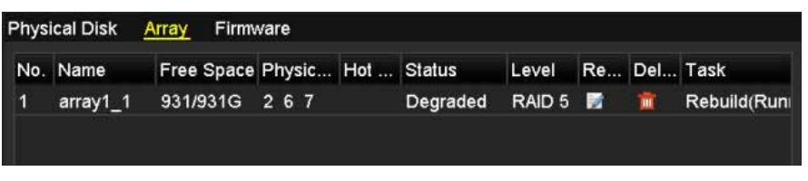

Figure 12. 12 Array Settings Interface

If there is no hot spare disk after rebuilding, it is recommended to install a HDD into the device and set is as a hot spare disk to ensure the high security and reliability of the array.

### **12.2.1Manually Rebuilding Array**

#### *Purpose:*

If the hot spare disk has not been configured, you can rebuild the array manually to restore the array when the virtual disk is in Degraded status.

#### *Steps:*

- **1.** Enter the Array Settings interface. The disk 3 is lost.
Menu > HDD > RAID > Array

|   | Physical Disk Array |                                | Firmware |          |            |  |               |  |
|---|---------------------|--------------------------------|----------|----------|------------|--|---------------|--|
|   | No. Name            | Free Space Physic  Hot  Status |          |          | Level      |  | Re  Del  Task |  |
| 1 | array1 1            | 931/931G 2 6                   |          | Degraded | RAID 5 B M |  | None          |  |
|   |                     |                                |          |          |            |  |               |  |

Figure 12. 13 Array Settings Interface

**2.** Click Array tab to back to the Array Settings interface and click to configure the array rebuild.

|  | 1 |  |
|--|---|--|
|  |   |  |

At least one available physical disk should exist for rebuilding the array.

| Rebuild Array |          |    |        |  |  |
|---------------|----------|----|--------|--|--|
| Array Name    | array1_1 |    |        |  |  |
| RAID Level    | RAID 5   |    |        |  |  |
| Array Disk    | 2 6      |    |        |  |  |
| Physical Disk | ● 7      |    |        |  |  |
|               |          |    |        |  |  |
|               |          |    |        |  |  |
|               |          |    |        |  |  |
|               |          |    |        |  |  |
|               |          |    |        |  |  |
|               |          |    |        |  |  |
|               |          |    |        |  |  |
|               |          | OK | Cancel |  |  |

Figure 12. 14 Rebuild Array Interface

- **3.** Select the available physical disk and click **OK** button to confirm to rebuild the array.
- **4.** The "Do not unplug the physical disk when it is under rebuilding" message box pops up. Click **OK** button to start rebuilding.
- **5.** You can enter the Array Settings interface to view the rebuilding status.
- **6.** After rebuilding successfully, the array and virtual disk will restore to Functional.

## **12.3 Deleting Array**


Deleting array will cause to delete all the data saved in the disk.

*Steps:* 

- **1.** Enter the Array Settings interface.
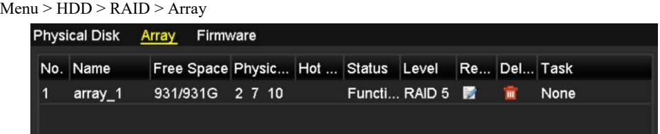

Figure 12. 15 Array Settings Interface

- **2.** Select an array and click to delete the array.

|     | Attention                                                                      |  |
|-----|--------------------------------------------------------------------------------|--|
|     | The removal of the array will cause ALL<br>data on it to be deleted. Continue? |  |
| Yes | No                                                                             |  |

- **3.** In the pop-up message box, click **Yes** button to confirm the array deletion.


Deleting array will cause to delete all the data in the array.

Figure 12. 16 Confirm Array Deletion

## **12.4 Checking and Editing Firmware**

#### *Purpose:*

You can view the information of the firmware and set the background task speed on the Firmware interface.

- **1.** Enter the Firmware interface to check the information of the firmware, including the version, maximum physical disk quantity, maximum array quantity, auto-rebuild status, etc.

| Physical Disk<br>Array | Firmware          |
|------------------------|-------------------|
| Version                | 者是米米等等等等等等        |
| Physical Disk Count    | 16                |
| Array Count            | 16                |
| Virtual Disk Count     | 0                 |
| RAID Level             | 0 1 5 10          |
| Hot Spare Type         | Global Hot Spare  |
| Support Rebuild        | Yes               |
|                        |                   |
| Background Task Speed  | Medium Speed<br>> |

Figure 12. 17 Firmware Interface

- **2.** You can set the Background Task Speed in the drop-down list.
- **3.** Click the **Apply** button to save the settings.

## **Chapter 13 HDD Management**

## **13.1 Initializing HDDs**

#### *Purpose:*

A newly installed hard disk drive (HDD) must be initialized before it can be used with your NVR.


A message box pops up when the NVR starts up if there exits any uninitialized HDD.

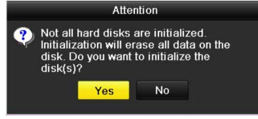

Figure 13. 1 Message Box of Uninitialized HDD

Click **Yes** button to initialize it immediately or you can perform the following steps to initialize the HDD. *Steps:*

- **1.** Enter the HDD Information interface.
Menu > HDD> General

|      | HDD Information  |        |          |       |                         |    |   |      |
|------|------------------|--------|----------|-------|-------------------------|----|---|------|
| Land | Capacity         | Status | Property | Type  | Free Space Gr  Edit Del |    |   |      |
| 1    | 1863.02GB Normal |        | RAV      | Local | OMB                     | 18 | 1 | / m  |
| 3    | 1863.02GB        | Normal | RAN      | Local | 1842.00GB 1             |    | 1 | Tim' |

Figure 13. 2 HDD Information Interface

- **2.** Select HDD to be initialized.
- **3.** Click the **Init** button.

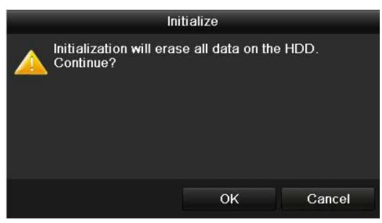

Figure 13. 3 Confirm Initialization

- **4.** Select the **OK** button to start initialization.

|        | HDD Information  |                      |          |       |                         |   |   |   |
|--------|------------------|----------------------|----------|-------|-------------------------|---|---|---|
| 120.00 | Capacity         | Status               | Property | Type  | Free Space Gr  Edit Del |   |   |   |
| 111    | 1863.02GB Normal |                      | R/V      | Local | OMB                     | 1 | M | 市 |
|        | 1863.02GB        | Initializing 89% R/W |          | Local | OMB                     |   |   | m |

Figure 13. 4 Status changes to Initializing

- **5.** After the HDD has been initialized, the status of the HDD will change from *Uninitialized* to *Normal*.

|      | HDD Information  |        |          |       |             |       |              |
|------|------------------|--------|----------|-------|-------------|-------|--------------|
|      | Capacity         | Status | Property | Type  | Free Space  |       | Gr  Edit Del |
| 4 17 | 1863.02GB Normal |        | RAN      | Local | OMB         | 12    | 111          |
|      | 1863.02GB Normal |        | RW       | Local | 1862.00GB 1 | 2 111 |              |

Figure 13. 5 HDD Status Changes to Normal


Initializing the HDD will erase all data on it.

## **13.2 Managing Network HDD**

#### *Purpose:*

You can add the allocated NAS or disk of IP SAN to NVR, and use it as network HDD. Up to 8 network disks can be added.

*Steps:*

- **1.** Enter the HDD Information interface.
Menu > HDD>General

|    | HDD Information  |        |          |       |                         |    |     |     |
|----|------------------|--------|----------|-------|-------------------------|----|-----|-----|
|    | Capacity         | Status | Property | Type  | Free Space Gr  Edit Del |    |     |     |
| 11 | 1863.02GB Normal |        | RAN      | Local | OMB                     | 11 | 1 2 | 111 |
| 3  | 1863.02GB Normal |        | RAN      | Local | 1842.00GB 1             |    | M   | m   |

Figure 13. 6 HDD Information Interface

- **2.** Click the **Add** button to enter the Add NetHDD interface, as shown in Figure 13. 7.

| Add NetHDD        |              |    |        |  |  |  |  |
|-------------------|--------------|----|--------|--|--|--|--|
| NetHDD            | NetHDD 1     |    | ్లో    |  |  |  |  |
| Турс              | NAS          |    | 42     |  |  |  |  |
| NetHDD IP Address | 3<br>15<br>2 |    |        |  |  |  |  |
| NetHDD Directory  |              |    |        |  |  |  |  |
|                   |              |    |        |  |  |  |  |
|                   |              |    |        |  |  |  |  |
|                   |              | OK | Cancel |  |  |  |  |

Figure 13. 7 HDD Information Interface

- **3.** Add the allocated NetHDD.
- **4.** Select the type to NAS or IP SAN.
- **5.** Configure the NAS or IP SAN settings.
	- **• Add NAS disk:**
	- 1) Enter the NetHDD IP address in the text field.
	- 2) Click the **Search** button to search the available NAS disks.
	- 3) Select the NAS disk from the list shown below.

Or you can just manually enter the directory in the text field of NetHDD Directory.

- 4) Click the **OK** button to add the configured NAS disk.
#### Network Video Recorder User Manual

| NetHDD IP Address | NetHDD 1<br>NAS                                                                 |             |                         |   |  |  |
|-------------------|---------------------------------------------------------------------------------|-------------|-------------------------|---|--|--|
|                   |                                                                                 |             |                         |   |  |  |
|                   |                                                                                 |             |                         |   |  |  |
|                   | 172.6                                                                           | .24<br>.201 |                         |   |  |  |
| NetHDD Directory  | Idvr/dvr 3                                                                      |             |                         |   |  |  |
|                   |                                                                                 |             |                         | A |  |  |
|                   |                                                                                 |             |                         |   |  |  |
|                   |                                                                                 |             |                         |   |  |  |
|                   |                                                                                 |             |                         |   |  |  |
|                   |                                                                                 |             |                         |   |  |  |
|                   |                                                                                 |             |                         |   |  |  |
|                   |                                                                                 |             |                         |   |  |  |
|                   | Directory<br>/dvr/dvr 3<br>/dvr/dvr_1<br>Idvridvr 8<br>/dvr/liu_0<br>/dvr/dvr_2 |             | /mnt/backup/indexbackup |   |  |  |

Figure 13. 8 Add NAS Disk

- **• Add IP SAN:**
- 1) Enter the NetHDD IP address in the text field.
- 2) Click the **Search** button to search the available IP SAN disks.
- 3) Select the IP SAN disk from the list shown below.
- 4) Click the **OK** button to add the selected IP SAN disk.

Up to 1 IP SAN disk can be added.

| NetHDD 1<br>NetHDD<br>IP SAN<br>Type<br>172 .9<br>NetHDD IP Address<br>2<br>.210<br>NetHDD Directory<br>ign.2004-05 storos t-8<br>No.<br>Directory |  |        |        |
|----------------------------------------------------------------------------------------------------------------------------------------------------|--|--------|--------|
|                                                                                                                                                    |  |        |        |
|                                                                                                                                                    |  |        |        |
|                                                                                                                                                    |  |        |        |
|                                                                                                                                                    |  |        |        |
|                                                                                                                                                    |  |        |        |
| iqn 2004-05 storos t-8<br>1                                                                                                                        |  |        |        |
| 2<br>ign.2004-05.storos.t-41                                                                                                                       |  |        |        |
| 3<br>iqn.2004-05.storos.t-1000                                                                                                                     |  |        |        |
|                                                                                                                                                    |  |        |        |
|                                                                                                                                                    |  |        | Cancel |
|                                                                                                                                                    |  | Search | OK     |


- **6.** After having successfully added the NAS or IP SAN disk, return to the HDD Information menu. The added NetHDD will be displayed in the list.
If the added NetHDD is uninitialized, please select it and click the **Init** button for initialization.

### **13.3 Managing eSATA**

#### *Purpose:*

When there is an external eSATA device connected to NVR, you can configure eSATA for the use of

Record/Capture or Export, and you can manage the eSATA in the NVR.

#### *Steps:*

- **1.** Enter the Advanced Record Settings interface. Menu >Record>Advanced
- **2.** Select the eSATA type to Export or Record/Capture from the dropdown list of **eSATA**.

**Export**: use the eSATA for backup. Refer to *Backup using eSATA HDDs* in *Chapter 7.1.2 Backing up by Normal Video/Picture* Search for operating instructions.

**Record/Capture:** use the eSATA for record/capture. Refer to the following steps for operating instructions.

| Overwrite | >              |  |
|-----------|----------------|--|
| eSATA     | eSATA1         |  |
| Usage     | Record/Capture |  |


- **3.** When the eSATA type is selected to Record/Capture, enter the HDD Information interface. Menu > HDD>General
- **4.** Edit the property of the selected eSATA, or initialize it is required.


Two storage modes can be configured for the eSATA when it is used for Record/Capture. Please refer to *Chapter 13.4 Managing HDD Group* and *Chapter 13.5 Configuring Quota Mode* for details.

## **13.4 Managing HDD Group**

### **13.4.1Setting HDD Groups**

#### *Purpose:*

Multiple HDDs can be managed in groups. Video from specified channels can be recorded onto a particular HDD group through HDD settings.

#### *Steps:*

- **1.** Enter the Storage Mode interface.
Menu > HDD > Advanced > Storage Mode

- **2.** Set the **Mode** to Group, as shown in Figure 13. 11.
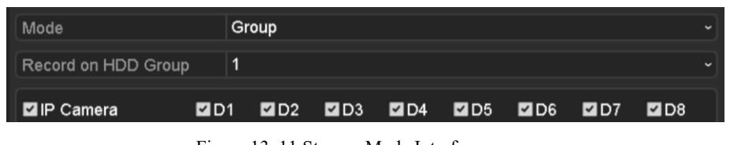

Figure 13. 11 Storage Mode Interface

- **3.** Click the **Apply** button and the following Attention box will pop up.
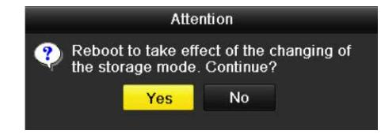

Figure 13. 12 Attention for Reboot

- **4.** Click the **Yes** button to reboot the device to activate the changes.
- **5.** After reboot of device, enter the HDD Information interface. Menu > HDD> General
- **6.** Select HDD from the list and click icon to enter the Local HDD Settings interface, as shown in Figure 13. 13.

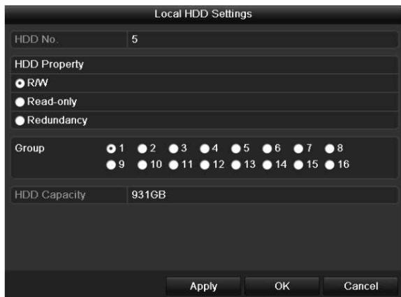

Figure 13. 13 Local HDD Settings Interface

- **7.** Select the Group number for the current HDD.


The default group No. for each HDD is 1.

- **8.** Click the **OK** button to confirm the settings.
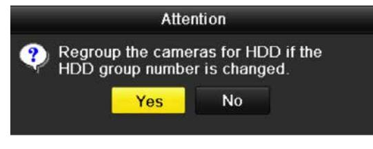

Figure 13. 14 Confirm HDD Group Settings

- **9.** In the pop-up Attention box, click the **Yes** button to finish the settings.
### **13.4.2Setting HDD Property**

#### *Purpose:*

The HDD property can be set to redundancy, read-only or read/write (R/W). Before setting the HDD property, please set the storage mode to Group (refer to step1-4 of Chapter Setting HDD Groups ).

A HDD can be set to read-only to prevent important recorded files from being overwritten when the HDD becomes full in overwrite recording mode.

When the HDD property is set to redundancy, the video can be recorded both onto the redundancy HDD and the R/W HDD simultaneously so as to ensure high security and reliability of video data.

#### *Steps:*

- **1.** Enter the HDD Information interface.
Menu > HDD> General

- **2.** Select HDD from the list and click the icon to enter the Local HDD Settings interface, as shown in Figure 13. 15.

|              |          |       | Local HDD Settings                                         |       |    |  |        |
|--------------|----------|-------|------------------------------------------------------------|-------|----|--|--------|
| HDD No.      |          | ર     |                                                            |       |    |  |        |
| HDD Property |          |       |                                                            |       |    |  |        |
| ORW          |          |       |                                                            |       |    |  |        |
| · Read-only  |          |       |                                                            |       |    |  |        |
| · Redundancy |          |       |                                                            |       |    |  |        |
| Group        | 01<br>99 |       | 02 03 04 05 06 07 08<br>. 10 @ 11 @ 12 @ 13 @ 14 @ 15 @ 16 |       |    |  |        |
| HDD Capacity |          | 931GB |                                                            |       |    |  |        |
|              |          |       |                                                            |       |    |  |        |
|              |          |       |                                                            | Apply | OK |  | Cancel |

Figure 13. 15 Set HDD Property

- **3.** Set the HDD property to R/W, Read-only or Redundancy.
- **4.** Click the **OK** button to save the settings and exit the interface.
- **5.** In the HDD Information menu, the HDD property will be displayed in the list.


At least 2 hard disks must be installed on your NVR when you want to set a HDD to Redundancy, and there is one HDD with R/W property.

## **13.5 Configuring Quota Mode**

#### *Purpose:*

Each camera can be configured with allocated quota for the storage of recorded files or captured pictures.

*Steps:*

- **1.** Enter the Storage Mode interface.
Menu > HDD > Advanced

- **2.** Set the **Mode** to Quota, as shown in Figure 13. 16.


The NVR must be rebooted to enable the changes to take effect.

| Disk Mode<br>Storage Mode    | Disk Clone  |
|------------------------------|-------------|
| Mode                         | Quota       |
| Camera                       | [D1] IPdome |
| Used Record Capacity         | 112.00GB    |
| Used Picture Capacity        | 8192.00MB   |
| HDD Capacity (GB)            | 3726        |
| Max. Record Capacity (G      | 0           |
| Max. Picture Capacity (GB) 0 |             |
| A Free Quota Space 3726 GB   |             |

Figure 13. 16 Storage Mode Settings Interface

- **3.** Select a camera for which you want to configure quota.
- **4.** Enter the storage capacity in the text fields of **Max. Record Capacity (GB)** and **Max. Picture Capacity (GB)**.
- **5.** You can copy the quota settings of the current camera to other cameras if required. Click the **Copy** button to enter the Copy Camera menu, as shown in Figure 13. 17.

| Copy to    |                                           |                                |                                                      |                                                 |                    |                                |  |  |
|------------|-------------------------------------------|--------------------------------|------------------------------------------------------|-------------------------------------------------|--------------------|--------------------------------|--|--|
| IIP Camera | D1<br>  D7<br> D13<br>D19<br>DD25<br> D31 | D2<br>DB<br>D14<br>D20<br>■D26 | ID3<br>Da<br>D15<br>■D27 ■D28 ■D29 ■D30<br>■D32 ■D33 | D4<br>D10<br>■D16 ■D17<br>■D21 ■D22 ■D23<br>D34 | D5<br>  D11<br>D35 | Do<br>D12<br>D18<br>D24<br>D36 |  |  |
|            | ID37                                      |                                | ■D38 ■D39 ■D40 ■D41                                  |                                                 | OK                 | _ D42<br>Cancel                |  |  |

Figure 13. 17 Copy Settings to Other Camera(s)

- **6.** Select the camera (s) to be configured with the same quota settings. You can also click the checkbox of IP
Camera to select all cameras.

- **7.** Click the **OK** button to finish the Copy settings and back to the Storage Mode interface.
- **8.** Click the **Apply** button to apply the settings.


If the quota capacity is set to *0*, then all cameras will use the total capacity of HDD for record and picture capture.

## **13.6 Configuring Disk Clone**

#### *Purpose:*

If the S.M.A.R.T. detection result declares the HDD is abnormal, you can choose to clone all the data on the HDD to an inserted eSATA disk manually. Refer to *Chapter 13.8 HDD Detection* for details of S.M.A.R.T detection.

#### *Before you start:*

An eSATA disk should be connected to the device.

#### *Steps:*

- **1.** Enter the HDD Advanced Setting interface:
Menu > HDD > Advanced

- **2.** Click the **Disk Clone** tab to enter the disk clone configuring interface.

| Clone Source |                   |        |          |       |            |         |
|--------------|-------------------|--------|----------|-------|------------|---------|
| Label        | Capacity          | Status | Property | Type  | Free Space | Gr      |
| 4            | 931.51GB          | Normal | RMW      | Local | 914GB      | 1       |
|              |                   |        |          |       |            |         |
|              |                   |        |          |       |            |         |
|              | Clone Destination |        |          |       |            |         |
| eSATA        |                   | eSATA1 |          |       | >          | Refresh |
| Usage        |                   | Export |          |       |            | Set     |

Figure 13. 18 Disk Clone Configuration Interface

- **3.** Make sure the usage of the eSATA disk is set as Export.
	- If not, click the **Set** button to set it. Choose Export and click the **OK** button.

|             | eSATA Usage |  |
|-------------|-------------|--|
| eSATA1:     |             |  |
| Export      | 0           |  |
| Record/Ca ● |             |  |
|             |             |  |
|             |             |  |
|             |             |  |

Figure 13. 19 Setting eSATA Usage


The capacity of destination disk must be the same as that of the clone source disk.

- **4.** Check the checkbox of the HDD to be cloned in the Clone Source list.
- **5.** Click the **Clone** button and a message box pops up.
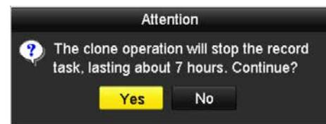

Figure 13. 20 Message Box for Disk Clone

- **6.** Click the **Yes** button to continue.
You can check the clone progress in the HDD status.

|   | Label Capacity | Status      | Property | Type  | Free Space                                                                                                                                                                            | Gr |
|---|----------------|-------------|----------|-------|---------------------------------------------------------------------------------------------------------------------------------------------------------------------------------------|----|
| 4 | 931.51GB       | Cloning 01% | RAW      | Local | ------------------------------------------------------------------------------------------------------------------------------------------------------------------------------<br>OMB |    |
|   |                |             |          |       |                                                                                                                                                                                       |    |

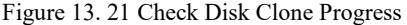

## **13.7 Checking HDD Status**

#### *Purpose:*

You may check the status of the installed HDDs on NVR so as to take immediate check and maintenance in case of HDD failure.

### **13.7.1Checking HDD Status in HDD Information Interface**

#### *Steps:*

- **1.** Enter the HDD Information interface.
Menu > HDD>General

- **2.** Check the status of each HDD which is displayed on the list, as shown in Figure 13. 22.

| HDD Information |                |               |          |       |            |    |           |     |
|-----------------|----------------|---------------|----------|-------|------------|----|-----------|-----|
|                 | Label Capacity | Status        | Property | Type  | Free Space |    | Gro  Edit | Del |
| 4               | 931.51GB       | Normal        | RMW      | Local | 921GB      | 1  | 19        | -   |
| 18              | 10,048MB       | Uninitialized | RAN      | NAS   | OMB        | 10 | 17        | Ju  |
| 25              | 931 51GB       | Normal        | RAN      | eSATA | 894GB      | 1  | 1         | =   |
|                 |                |               |          |       |            |    |           |     |
| Total Capacity  |                | 1,872GB       |          |       |            |    |           |     |
| Free Space      |                | 1,815GB       |          |       |            |    |           |     |

Figure 13. 22 View HDD Status (1)


If the status of HDD is *Normal* or *Sleeping*, it works normally. If the status is *Uninitialized* or *Abnormal*, please initialize the HDD before use. And if the HDD initialization is failed, please replace it with a new one.

### **13.7.2Checking HDD Status in HDD Information Interface**

- **1.** Enter the System Information interface. Menu >Maintenance > System Info
- **2.** Click the **HDD** tab to view the status of each HDD displayed on the list, as shown in Figure 13. 23.

|                | Device Info Camera | Record          | Alarm   | Network    | HDD        |        |       |
|----------------|--------------------|-----------------|---------|------------|------------|--------|-------|
| Label          | Status             | Capacity        |         | Free Space | Property   | Type   | Group |
| 5              | Normal             | 931GB           |         | 931GB      | RMW        | Local  | 1     |
| 6              | Sleeping 931GB     |                 |         | 931GB      | Redundancy | Local  | 1     |
| 17             |                    | Normal 40,000MB |         | 22,528MB   | RW         | IP SAN | 1     |
|                |                    |                 |         |            |            |        |       |
|                |                    |                 |         |            |            |        |       |
| Total Capacity |                    |                 | 1,902GB |            |            |        |       |

Figure 13. 23 View HDD Status (2)

### **13.8 HDD Detection**

#### *Purpose:*

The device provides the HDD detection function such as the adopting of the S.M.A.R.T. and the Bad Sector Detection technique. The S.M.A.R.T. *(*Self-Monitoring, Analysis and Reporting Technology*)* is a monitoring system for HDD to detect and report on various indicators of reliability in the hopes of anticipating failures.

#### **S.M.A.R.T. Settings**

*Steps:*

- **1.** Enter the S.M.A.R.T Settings interface.
Menu > Maintenance > HDD Detect

- **2.** Select the HDD to view its S.M.A.R.T information list, as shown in Figure 13. 24.

| S.M.A.R.T. Settings<br>Bad Sector Detection               |                           |              |              |               |                    |       |      |           |   |
|-----------------------------------------------------------|---------------------------|--------------|--------------|---------------|--------------------|-------|------|-----------|---|
| Continue to use this disk when self-evaluation is failed. |                           |              |              |               |                    |       |      |           |   |
| HDD                                                       |                           | 1            |              |               |                    |       |      |           |   |
|                                                           | Self-test Status          | Not tested   |              |               |                    |       |      |           |   |
|                                                           | Self-test Type            |              | Short Test   |               |                    |       |      |           |   |
| S.M.A.R.T.                                                |                           | 资            |              |               |                    |       |      |           |   |
|                                                           | Temperatu<br>44           |              |              |               | Self-evalu<br>Pass |       |      |           |   |
|                                                           | Power On<br>423           | All-evaluati |              |               | Functional         |       |      |           |   |
|                                                           | S.M.A.R.T. Information    |              |              |               |                    |       |      |           |   |
| ID                                                        | Attribute Name            |              | Status Flags | Thresh  Value |                    | Worst |      | Raw Value | < |
| 0×1                                                       | Raw Read Error Rate       | OK           | f            | 6             | 117                | 99    |      | 136122992 |   |
| 0×3                                                       | Spin Up Time              | OK           | 3            | 0             | રીકે               | 95    | 0    |           |   |
| 0x4                                                       | Start/Stop Count          | OK           | 32           | 20            | 99                 | 99    | 1473 |           |   |
| 0×5                                                       | Reallocated Sector Co  OK |              | 33           | 10            | 100                | 100   | 0    |           | > |
|                                                           |                           |              |              |               |                    |       |      |           |   |
|                                                           |                           |              |              |               |                    |       |      |           |   |
|                                                           |                           |              |              |               |                    | Apply |      | Back      |   |

Figure 13. 24 S.M.A.R.T Settings Interface

The related information of the S.M.A.R.T. is shown on the interface.

You can choose the self-test types as Short Test, Expanded Test or the Conveyance Test.

Click the start button to start the S.M.A.R.T. HDD self-evaluation.

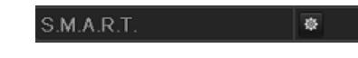

| 1000<br>1<br>17 |
|-----------------|
|                 |
| NO              |
|                 |

If you want to use the HDD even when the S.M.A.R.T. checking is failed, you can check the checkbox of the **Continue to use the disk when self-evaluation is failed** item.

#### **Bad Sector Detection**

- **1.** Click the Bad Sector Detection tab.
- **2.** Select the HDD No. in the dropdown list you want to configure, and choose All Detection or Key Area

Detection as the detection type.

- **3.** Click the **Detect** button to start the detection.

| S.M.A.R.T. Settings |   | Bad Sector Detection |                |                      |   |        |
|---------------------|---|----------------------|----------------|----------------------|---|--------|
| HDD No.             | 4 |                      |                | · Key Area Detection | > | Detect |
|                     |   |                      | HDD Capacity   | 931.51GB             |   |        |
|                     |   |                      | Block Capacity | 232MB                |   |        |
|                     |   |                      | Status         | Testing  39%         |   |        |
|                     |   |                      | Error Count    | 0                    |   |        |
|                     |   |                      | Error info     | Pause                |   | Cancel |
|                     |   |                      |                |                      |   |        |
| Normal              |   |                      |                |                      |   |        |
| Damaged             |   |                      |                |                      |   |        |
|                     |   |                      |                |                      |   |        |
| Shield              |   |                      |                |                      |   |        |

Figure 13. 25 Bad Sector Detection

And you can click **Error info** button to see the detailed damage information.

And you can also pause/resume or cancel the detection.

## **13.9 Configuring HDD Error Alarms**

#### *Purpose:*

You can configure the HDD error alarms when the HDD status is *Uninitialized* or *Abnormal*.

*Steps:*

- **1.** Enter the Exception interface.
Menu > Configuration > Exceptions

- **2.** Select the Exception Type to **HDD Error** from the dropdown list.
- **3.** Click the checkbox(s) below to select the HDD error alarm type (s), as shown in Figure 13. 26.


The alarm type can be selected to: Audible Warning, Notify Surveillance Center, Send Email and Trigger Alarm Output. Please refer to *Chapter Setting Alarm Response Actions*.

| Exception Type             | HDD Error |            |
|----------------------------|-----------|------------|
| Audible Warning            |           |            |
| Notify Surveillance Center |           |            |
| Send Email                 | 0 0 0     |            |
| Trigger Alarm Output       |           |            |
| Alarm Output No.           |           | Alarm Name |
| Local->1                   |           |            |
| Local->2                   |           |            |
| Local->3                   |           |            |
| Local->4                   |           |            |
| 172.6.23.105:8000->1       |           |            |
|                            |           |            |
|                            |           |            |

Figure 13. 26 Configure HDD Error Alarm

- **4.** When the Trigger Alarm Output is selected, you can also select the alarm output to be triggered from the list below.
- **5.** Click the **Apply** button to save the settings

## **Chapter 14 Camera Settings**

## **14.1 Configuring OSD Settings**

#### *Purpose:*

You can configure the OSD (On-screen Display) settings for the camera, including date /time, camera name, etc.

### *Steps:*

- **1.** Enter the OSD Configuration interface.
Menu > Camera > OSD

- **2.** Select the camera to configure OSD settings.
- **3.** Edit the Camera Name in the text field.
- **4.** Configure the Display Name, Display Date and Display Week by clicking the checkbox.
- **5.** Select the Date Format, Time Format and Display Mode.

| OSD Configuration |                |              |                                  |  |  |  |  |
|-------------------|----------------|--------------|----------------------------------|--|--|--|--|
| Camera            | [D1] Camera 01 |              |                                  |  |  |  |  |
| Camera Name       | Camera 01      |              |                                  |  |  |  |  |
| 6-2016 Wed 17/1   |                | Display Name | >                                |  |  |  |  |
|                   |                | Display Date | >                                |  |  |  |  |
|                   |                | Display Week | >                                |  |  |  |  |
|                   |                | Date Format  | MM-DD-YYYY                       |  |  |  |  |
|                   |                | Time Format  | 24-hour                          |  |  |  |  |
|                   | Camera 01      | Display Mode | Non-Transparent & Not Flashing ~ |  |  |  |  |
|                   |                |              |                                  |  |  |  |  |

Figure 14. 1 OSD Configuration Interface

- **6.** You can use the mouse to click and drag the text frame on the preview window to adjust the OSD position.
- **7.** Click the **Apply** button to apply the settings.

## **14.2 Configuring Privacy Mask**

#### *Purpose:*

You are allowed to configure the four-sided privacy mask zones that cannot be viewed by the operator. The privacy mask can prevent certain surveillance areas to be viewed or recorded.

#### *Steps:*

- **1.** Enter the Privacy Mask Settings interface.
Menu > Camera >Privacy Mask

- **2.** Select the camera to set privacy mask.
- **3.** Click the checkbox of **Enable Privacy Mask** to enable this feature.

| Privacy Mask Settings |                |              |  |  |  |  |
|-----------------------|----------------|--------------|--|--|--|--|
| Camera                | [D1] Camera 01 |              |  |  |  |  |
| Enable Privacy Mask   |                |              |  |  |  |  |
|                       |                |              |  |  |  |  |
|                       |                | Clear All    |  |  |  |  |
|                       |                | Clear Zone 1 |  |  |  |  |
|                       |                | Clear Zone 2 |  |  |  |  |
|                       |                | Clear Zone 3 |  |  |  |  |
|                       |                | Clear Zone 4 |  |  |  |  |
|                       |                |              |  |  |  |  |

Figure 14. 2 Privacy Mask Settings Interface

- **4.** Use the mouse to draw a zone on the window. The zones will be marked with different frame colors.


Up to 4 privacy masks zones can be configured and the size of each area can be adjusted.

- **5.** The configured privacy mask zones on the window can be cleared by clicking the corresponding Clear Zone1-4 icons on the right side of the window, or click **Clear All** to clear all zones.

| Privacy Mask Settings |  |                |  |  |  |
|-----------------------|--|----------------|--|--|--|
| Camera                |  | [D1] Camera 01 |  |  |  |
| Enable Privacy Mask   |  |                |  |  |  |
|                       |  |                |  |  |  |
|                       |  | Clear All      |  |  |  |
|                       |  | Clear Zone 1   |  |  |  |
|                       |  | ] Clear Zone 2 |  |  |  |
|                       |  | Clear Zone 3   |  |  |  |
|                       |  | Clear Zone 4   |  |  |  |
|                       |  |                |  |  |  |

Figure 14. 3 Set Privacy Mask Area

- **6.** Click the **Apply** button to save the settings.
## **14.3 Configuring Video Parameters**

#### *Purpose:*

You can customize the image parameters including the brightness, contrast, saturation, image rotate and mirror for the live view and recording effect.

#### *Steps:*

- **1.** Enter the Image Settings interface.
Menu > Camera >Image

| Camera           |             | [D1] Camera 01    |        |           |             |  |
|------------------|-------------|-------------------|--------|-----------|-------------|--|
|                  |             | Mode              | Custom |           |             |  |
|                  |             | Brightn           |        | << < 50   | >>>         |  |
|                  |             | Contrast          |        | 50<br><<< | >>>         |  |
|                  |             | Saturat           |        | << < 50   | >>>         |  |
|                  |             | Hue               |        | << < 50   | >>>         |  |
|                  |             | Wide Dyna         | Auto   |           |             |  |
|                  |             | WDR Lev           |        |           | ( < <> >>   |  |
| Digital No       | Normal Mode | Day/Night S  Auto |        |           |             |  |
| Noise            | ( ( < ) > > | Sensitivity       | 4      |           |             |  |
|                  |             | Switch Ti         |        |           | ( ( < > > > |  |
| 1/25<br>Exposure |             |                   |        |           |             |  |

Figure 14. 4 Image Settings Interface

- **2.** Select the camera to set image parameters.
- **3.** Adjust the slider or click on the up/down arrow to set the value of the brightness, contrast or saturation.
- **4.** Configure the other image parameters according to your needs, like Wide Dynamic, Day/Night Switch, Digital Noise Reduction, and Exposure Time.


- The parameters must be supported by the connected IP camera.
- The image parameters adjustment can affect both the live view and the recording quality.
- **5.** Click the **Apply** button to save the settings.

# **Chapter 15 NVR Management and Maintenance**

## **15.1 Viewing System Information**

#### *Steps:*

- **1.** Enter the System Information interface. Menu >Maintenance>System Info
- **2.** You can click the **Device Info**, **Camera**, **Record**, **Alarm**, **Network** and **HDD** tabs to view the system information of the device.

| Device Info      | Camera                                   | Record | Alarm | Network                | HDD | Device Status |  |
|------------------|------------------------------------------|--------|-------|------------------------|-----|---------------|--|
| Device Name      |                                          |        |       | Network Video Recorder |     |               |  |
| Model            |                                          |        |       |                        |     |               |  |
| Serial No.       |                                          |        |       |                        |     |               |  |
| Firmware Version |                                          |        |       |                        |     |               |  |
| Hardware Version |                                          |        |       |                        |     |               |  |
|                  | Please scan the QR code via iVMS client. |        |       |                        |     |               |  |
|                  |                                          |        |       |                        |     |               |  |

Figure 15. 1 Device Information Interface


You can add the device to your mobile client software (iVMS-4500) via scanning the QR Code.

## **15.2 Searching & Exporting Log Files**

#### *Purpose:*

The operation, alarm, exception and information of the NVR can be stored in log files, which can be viewed and exported at any time.

#### *Steps:*

- **1.** Enter the Log Search interface.
Menu > Maintenance > Log Information

| Log Search                            |            |          |             |      |   |  |  |
|---------------------------------------|------------|----------|-------------|------|---|--|--|
| Start Time                            | 01-01-2015 |          | 00:00:00:00 |      |   |  |  |
| End Time                              | 01-20-2015 |          | 23:59:59    |      | 0 |  |  |
| Major Type                            | All        |          |             |      | < |  |  |
| Minor Type                            |            |          |             | A    |   |  |  |
| · Alarm Input                         |            |          |             |      |   |  |  |
| Alarm Output                          |            |          |             |      |   |  |  |
| Motion Detection Started              |            |          |             |      |   |  |  |
| Motion Detection Stopped              |            |          |             |      |   |  |  |
| Video Tampering Detection Started     |            |          |             |      |   |  |  |
| Video Tampering Detection Stopped     |            |          |             |      |   |  |  |
| Line Crossing Detection Alarm Started |            |          |             |      |   |  |  |
| Line Crossing Detection Alarm Stopped |            |          |             |      |   |  |  |
| Intrusion Detection Alarm Started     |            |          |             |      |   |  |  |
|                                       |            |          |             |      |   |  |  |
|                                       |            |          |             |      |   |  |  |
|                                       |            | Export A | Search      | Back |   |  |  |

Figure 15. 2 Log Search Interface

- **2.** Set the log search conditions to refine your search, including the Start Time, End Time, Major Type and Minor Type.
- **3.** Click the **Search** button to start search log files.
- **4.** The matched log files will be displayed on the list shown below.

| Search Result |                    |                                           |                      |                |         |         |        |
|---------------|--------------------|-------------------------------------------|----------------------|----------------|---------|---------|--------|
| No.           | Major Type         | Time                                      | Minor Type           | Parameter Play |         | Details |        |
| 1             | T Operation        | 01-14-2015 21:04:06 Abnormal Shutd  N/A   |                      |                |         | 0       | II     |
| 2             | T Operation        | 01-14-2015 21:04:08 Power On              |                      | N/A            | -       | 0       |        |
| 3             | Exception          | 01-14-2015 21:04:08 Record Exception N/A  |                      |                | C       | 0       |        |
| 4             | T Operation        | 01-14-2015 21:11:44 Local Operation : N/A |                      |                |         | 0       |        |
| 5             | T Operation        | 01-14-2015 21:39:45 Power On              |                      | N/A            |         | 0       |        |
| 6             | Exception          | 01-14-2015 21:39:47                       | Record Exception N/A |                | O       | 0       |        |
| 7             | T Operation        | 01-14-2015 21:44:05                       | Abnormal Shutd  N/A  |                |         | 0       |        |
| 8             | T Operation        | 01-14-2015 21:44:06                       | Power On             | N/A            |         | 0       |        |
| 9             | Exception          | 01-14-2015 21:44:07                       | Record Exception N/A |                | (D)     | 0       |        |
| 10            | T Operation        | 01-14-2015 21:57:06 Abnormal Shutd  N/A   |                      |                |         | D       |        |
|               | Total: 985 P: 1/10 |                                           |                      |                |         |         | V<br>+ |
|               |                    |                                           |                      |                | DI<br>A |         |        |
|               |                    |                                           |                      | Export         |         | Back    |        |

Figure 15. 3 Log Search Results

Up to 2000 log files can be displayed each time.

- **5.** You can click the button of each log or double click it to view its detailed information, as shown in Figure 15. 4. And you can also click the button to view the related video files if available.

|                                                                | Log Information                                       |
|----------------------------------------------------------------|-------------------------------------------------------|
| Time                                                           | 01-14-2015 21:57:08                                   |
| Type                                                           | Operation-Power On                                    |
| Local User                                                     | N/A                                                   |
| Host IP Address                                                | NA                                                    |
| Parameter Type                                                 | NA                                                    |
| Camera No.                                                     | N/A                                                   |
| Description:                                                   |                                                       |
| Model: DS-96128N-H16<br>Firmware version: V3.2.0. Build 150109 | Serial No .: DS-96128N-H161620141222CCRR201412224WCVU |
| Encoding version: V1.0, Build 150108                           |                                                       |

- Figure 15. 4 Log Details
- **6.** If you want to export the log files, click the **Export** button to enter the Export menu, as shown in *Figure 15. 4 Log Details*.

You can also click **Export All** on the Log Search interface (Figure 15.2) to enter the Export interface (Figure 15.5), and all the system logs will be exported to the backup device.

|                  |                    | Export |                          |      |                     |         |             |
|------------------|--------------------|--------|--------------------------|------|---------------------|---------|-------------|
|                  | USB Flash Disk 1-1 |        | 4                        | *.bd | 42                  | Refresh |             |
|                  |                    |        | Edit Date                |      |                     |         |             |
| 20160614163455lo |                    |        |                          |      |                     | m       | 0           |
|                  |                    |        |                          |      |                     |         |             |
|                  |                    |        |                          |      |                     |         |             |
|                  |                    |        | Size Type<br>4,452B File |      | 06-14-2016 16:34:55 |         | Delete Play |

#### Figure 15. 5 Export Log Files

- **7.** Select the backup device from the dropdown list of **Device Name**.
- **8.** Select the format of the log files to be exported. Up to 9 formats are selectable.
- **9.** Click the **Export** to export the log files to the selected backup device. You can click the **New Folder** button to create new folder in the backup device, or click the **Format** button to format the backup device before log export.

Please connect the backup device to NVR before operating log export.

## **15.3 Importing/Exporting IP Camera Info**

#### *Purpose:*

The information of added IP camera can be generated into an excel file and exported to the local device for backup, including the IP address, manage port, password of admin, etc.. And the exported file can be edited on your PC, like adding or deleting the content, and copy the setting to other devices by importing the excel file to it.

#### *Steps:*

- **1.** Enter the camera management interface.
Menu > Camera > IP Camera Import/Export

- **2.** Click the IP Camera Import/Export tab, the content of detected plugged external device appears.
- **3.** Click the **Export** button to export configuration files to the selected local backup device.
- **4.** To import a configuration file, select the file from the selected backup device and click the **Import** button. After the importing process is completed, you must reboot the NVR.

## **15.4 Importing/Exporting Configuration Files**

#### *Purpose:*

The configuration files of the NVR can be exported to local device for backup; and the configuration files of one NVR can be imported to multiple NVR devices if they are to be configured with the same parameters.

#### *Steps:*

- **1.** Enter the Import/Export Configuration File interface.
Menu > Maintenance >Import/Export

| Import/Export Config File |                    |                |                     |             |
|---------------------------|--------------------|----------------|---------------------|-------------|
| Device Name               | USB Flash Disk 1-1 |                | "bin                | Refresh     |
| Name                      |                    | Size Type      | Edit Date           | Delete Play |
| devCfg 408198452 20<br>日  |                    | 8160 44KB File | 23-01-2015 15:13:50 | n<br>-      |
|                           |                    |                |                     |             |
|                           |                    |                |                     |             |
|                           |                    |                |                     |             |
|                           |                    |                |                     |             |
|                           |                    |                |                     |             |
|                           |                    |                |                     |             |
|                           |                    |                |                     |             |
|                           |                    |                |                     |             |
|                           |                    |                |                     |             |
| Free Space                |                    | 1895.11MB      |                     |             |
|                           |                    |                |                     |             |
|                           |                    |                |                     |             |
|                           |                    |                |                     |             |
|                           |                    |                |                     |             |
|                           |                    |                |                     |             |
|                           |                    |                |                     |             |
|                           |                    |                |                     |             |
|                           |                    | New Folder     |                     |             |

Figure 15. 6 Import/Export Configuration File

- **2.** Click the **Export** button to export configuration files to the selected local backup device.
- **3.** To import a configuration file, select the file from the selected backup device and click the **Import** button. After the import process is completed, you must reboot the NVR.


After having finished the import of configuration files, the device will reboot automatically.

## **15.5 Upgrading System**

#### *Purpose:*

The firmware on your NVR can be upgraded by local backup device or remote FTP server.

### **15.5.1Upgrading by Local Backup Device**

#### *Steps:*

- **1.** Connect your NVR with a local backup device where the update firmware file is located.
- **2.** Enter the Upgrade interface.
	- Menu > Maintenance > Upgrade
- **3.** Click the **Local Upgrade** tab to enter the local upgrade menu.
- **4.** Select the update file from the backup device.
- **5.** Click the **Upgrade** button to start upgrading.
- **6.** After the upgrading is complete, reboot the NVR to activate the new firmware.

### **15.5.2Upgrading by FTP**

#### *Before you start:*

Ensure the network connection of the PC (running FTP server) and the device is valid and correct. Run the FTP server on the PC and copy the firmware into the corresponding directory of your PC.

#### *Steps:*

- **1.** Enter the Upgrade interface.
Menu >Maintenance>Upgrade

- **2.** Click the **FTP** tab to enter the local upgrade interface, as shown in Figure 15. 7.

| Local Upgrade        FTP |  |
|--------------------------|--|
| FTP Server Address       |  |
|                          |  |
|                          |  |
|                          |  |

Figure 15. 7 FTP Upgrade Interface

- **3.** Enter the FTP Server Address in the text field.
- **4.** Click the **Upgrade** button to start upgrading.
- **5.** After the upgrading is complete, reboot the NVR to activate the new firmware.

## **15.6 Restoring Default Settings**

#### *Steps:*

- **1.** Enter the Default interface.
Menu > Maintenance > Default

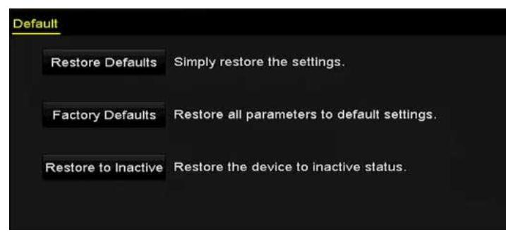

Figure 15. 8 Restore Defaults

**2.** Select the restoring type from the following three options.

**Restore Defaults:** Restore all parameters, except the network (including IP address, subnet mask, gateway, MTU, NIC working mode, default route, server port, etc.) and user account parameters, to the factory default settings.

**Factory Defaults:** Restore all parameters to the factory default settings.

**Restore to Inactive:** Restore the device to the inactive status.

**3.** Click the **OK** button to restore the default settings.


The device will reboot automatically after restoring to the default settings.

## **Chapter 16 Others**

## **16.1 Configuring General Settings**

#### *Purpose:*

You can configure the BNC output standard, VGA output resolution, mouse pointer speed through the Menu > Configuration > General interface.

#### *Steps:*

- **1.** Enter the General Settings interface.
Menu > Configuration > General

- **2.** Select the **General** tab.

| General<br>DST Settings | More Settings                          |   |
|-------------------------|----------------------------------------|---|
| Language                | English                                | > |
| VGA/HDMI Resolution     | 1024*768/60HZ                          | > |
| HDMI2 Resolution        | 1024*768/60HZ                          | ) |
| Time Zone               | (GMT+08:00) Beijing, Urumqi, Singapore | ১ |
| Date Format             | MM-DD-YYYYY                            | > |
| System Date             | 06-14-2016                             | 篇 |
| System Time             | 16:37:05                               | @ |
| Mouse Pointer Speed     | (@)                                    |   |
| Enable Wizard           | 1 - 6                                  |   |
| Enable Password         | 日报                                     |   |

Figure 16. 1 General Settings Interface

- **3.** Configure the following settings:
	- **• Language:** The default language used is *English*.
	- **• Resolution:** You can configure the VGA, HDMI 1, HDMI 2 resolution. And up to 4K (4096 × 2160) resolution is selectable for the HDMI 2 output.
	- **• Time Zone:** Select the time zone.
	- **• Date Format:** Select the date format.
	- **• System Date:** Select the system date.
	- **• System Time:** Select the system time.
	- **• Mouse Pointer Speed:** Set the speed of mouse pointer; 4 levels are configurable.
	- **• Enable Wizard:** Enable/disable the Wizard when the device starts up.
	- **• Enable Password:** Enable/disable the use of the login password.
- **4.** Click the **Apply** button to save the settings.

## **16.2 Configuring DST Settings**

#### *Steps:*

- **1.** Enter the General Settings interface.
Menu >Configuration>General

- **2.** Choose **DST Settings** tab.

| DST Settings<br>General | More Settings |        |       |     |     |        |
|-------------------------|---------------|--------|-------|-----|-----|--------|
| Auto DST Adjustment     |               |        |       |     |     |        |
| Enable DST              | 2             |        |       |     |     |        |
| From                    | Apr           | - 1st  | - Sun | - 2 |     | : : 00 |
| To                      | Oct           | ~ last | - Sun |     | ~ 2 | : : 00 |
| DST Bias                | 60 Minutes    |        |       |     |     |        |

|  |  | Figure 16. 2 DST Settings Interface |
|--|--|-------------------------------------|
|  |  |                                     |

You can check the checkbox before the Auto DST Adjustment item.

Or you can manually check the Enable DST checkbox, and then you choose the date of the DST period.

## **16.3 Configuring More Settings**

#### *Steps:*

- **1.** Enter the General Settings interface.
Menu >Configuration>General

- **2.** Click the **More Settings** tab to enter the More Settings interface.

| General     | DST Settings         | More Settings          |
|-------------|----------------------|------------------------|
| Device Name |                      | Network Video Recorder |
| Device No.  |                      | 255                    |
| Auto Logout |                      | 5 Minutes              |
|             | Enable HDMI1 and VGA | >                      |
|             | Menu Output Mode     | Auto                   |

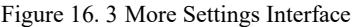

- **3.** Configure the following settings:
	- **• Device Name:** Edit the name of NVR.
	- **• Device No.:** Edit the serial number of NVR. The Device No. can be set in the range of 1~255, and the default No. is 255. The number is used for the remote and keyboard control.
	- **• Auto Logout:** Set timeout time for menu inactivity. E.g., when the timeout time is set to *5 Minutes*, then the system will exit from the current operation menu to live view screen after 5 minutes of menu inactivity.
	- **• Enable HDMI 1 and VGA Simultaneous Output**: By default, the video outputs from HDMI 1 and VGA interfaces can be operated separately. You can set the simultaneous output for the HDMI 1 and VGA by checking the checkbox of the option.
	- **• Menu Output Mode:** You can select the menu to be displayed on selected output. When the **Auto** option is selected and all outputs are connected, the device will detect and set the HDMI 1 as the menu output. For details, refer to *Table 3. 2 Main and Auxiliary Output Priority Principle*.
- **4.** Click the **Apply** button to save the settings.

## **16.4 Managing User Accounts**

#### *Purpose:*

There is a default account in the NVR: *Administrator*. The *Administrator* user name is *admin* and the password is set when you start the device for the first time. The *Administrator* has the permission to add and delete user and configure user parameters.

### **16.4.1Adding a User**

#### *Steps:*

- **1.** Enter the User Management interface.
Menu >Configuration>User

|     | User Management |                 |       |                    |     |          |      |     |
|-----|-----------------|-----------------|-------|--------------------|-----|----------|------|-----|
| No. | User Name       | Security        | Level | User's MAC Address |     | Pe  Edit |      | Del |
| 1   | admin           | Strong P  Admin |       | 00:00:00:00:00:00  |     | 1        | 最    | -   |
|     |                 |                 |       |                    |     |          |      |     |
|     |                 |                 |       |                    |     |          |      |     |
|     |                 |                 |       |                    |     |          |      |     |
|     |                 |                 |       |                    |     |          |      |     |
|     |                 |                 |       |                    |     |          |      |     |
|     |                 |                 |       |                    |     |          |      |     |
|     |                 |                 |       |                    |     |          |      |     |
|     |                 |                 |       |                    |     |          |      |     |
|     |                 |                 |       |                    |     |          |      |     |
|     |                 |                 |       |                    |     |          |      |     |
|     |                 |                 |       |                    |     |          |      |     |
|     |                 |                 |       |                    |     |          |      |     |
|     |                 |                 |       |                    |     |          |      |     |
|     |                 |                 |       |                    |     |          |      |     |
|     |                 |                 |       |                    | Add |          | Back |     |

Figure 16. 4 User Management Interface

- **2.** Click the **Add** button to enter the Add User interface.

|                                    | Add User                                                                                                                                   |  |
|------------------------------------|--------------------------------------------------------------------------------------------------------------------------------------------|--|
| User Name                          | example 1                                                                                                                                  |  |
| Password                           |                                                                                                                                            |  |
| Confirm                            |                                                                                                                                            |  |
| Level                              | Operator                                                                                                                                   |  |
| User's MAC Address                 | 00: 00: 00: 00 :00 :00 :00                                                                                                                 |  |
|                                    | Valid password range [8-16]. You can use a combination of numbers,<br>lowercase, uppercase and special character for your password with at |  |
| least two kinds of them contained. |                                                                                                                                            |  |

Figure 16. 5 Add User Menu

- **3.** Enter the information for new user, including **User Name**, **Password**, **Confirm**, **Level** and **User's MAC Address**.
**Password**: Set the password for the user account.

**STRONG PASSWORD RECOMMENDED***–We highly recommend you create a strong password* 

*of your own choosing (Using a minimum of 8 characters, including at least three of the following categories: upper case letters, lower case letters, numbers, and special characters.) in order to increase the security of your product. And we recommend you reset your password regularly, especially in the high security system, resetting the password monthly or weekly can better protect your product.*

**Level:** Set the user level to Operator or Guest. Different user levels have different operating permission.

- **• Operator:** The *Operator* user level has permission of Two-way Audio in Remote Configuration and all operating permission in Camera Configuration by default.
- **• Guest:** The Guest user has no permission of Two-way Audio in Remote Configuration and only has the local/remote playback in the Camera Configuration by default.

**User's MAC Address:** The MAC address of the remote PC which logs onto the NVR. If it is configured and enabled, it only allows the remote user with this MAC address to access the NVR.

- **4.** Click the **OK** button to save the settings and go back to the User Management interface. The added new user will be displayed on the list, as shown in Figure 16. 6.

|     | User Management |          |                    |          |
|-----|-----------------|----------|--------------------|----------|
| No. | User Name       | Level    | User's MAC Address |          |
| 1   | admin           | Admin    | 00:00:00:00:00:00  | I        |
| 2   | 01              | Operator | 00:00:00:00:00:00  | in<br>mi |
|     |                 |          |                    |          |
|     |                 |          |                    |          |
|     |                 |          |                    |          |
|     |                 |          |                    |          |
|     |                 |          |                    |          |
|     |                 |          |                    |          |
|     |                 |          |                    |          |
|     |                 |          |                    |          |
|     |                 |          |                    |          |
|     |                 |          |                    |          |

Figure 16. 6 Added User Listed in User Management Interface

- **5.** Select the user from the list and then click the icon to enter the Permission settings interface, as shown in Figure 16. 7.

|                           | Permission           |                      |  |
|---------------------------|----------------------|----------------------|--|
| ocal Configuration        | Remote Configuration | Camera Configuration |  |
| Local Log Search          |                      |                      |  |
| Local Parameters Settings |                      |                      |  |
| Local Camera Management   |                      |                      |  |
| Local Advanced Operation  |                      |                      |  |
| Local Shutdown / Reboot   |                      |                      |  |
|                           |                      |                      |  |
|                           |                      | OK                   |  |

Figure 16. 7 User Permission Settings Interface

- **6.** Set the operating permission of Local Configuration, Remote Configuration and Camera Configuration for the user.
#### **Local Configuration**

- **•** Local Log Search: Searching and viewing logs and system information of NVR.
- **•** Local Parameters Settings: Configuring parameters, restoring factory default parameters and importing/exporting configuration files.
- **•** Local Camera Management: The adding, deleting and editing of IP cameras.
- **•** Local Advanced Operation: Operating HDD management (initializing HDD, setting HDD property), upgrading system firmware, clearing I/O alarm output.
- **•** Local Shutdown/Reboot: Shutting down or rebooting the NVR.

#### **Remote Configuration**

- **•** Remote Log Search: Remotely viewing logs that are saved on the NVR.
- **•** Remote Parameters Settings: Remotely configuring parameters, restoring factory default parameters and importing/exporting configuration files.
- **•** Remote Camera Management: Remote adding, deleting and editing of the IP cameras.
- **•** Remote Serial Port Control: Configuring settings for RS-232 and RS-485 ports.
- **•** Remote Video Output Control: Sending remote button control signal.
- **•** Two-Way Audio: Realizing two-way radio between the remote client and the NVR.
- **•** Remote Alarm Control: Remotely arming (notify alarm and exception message to the remote client) and controlling the alarm output.
- **•** Remote Advanced Operation: Remotely operating HDD management (initializing HDD, setting HDD property), upgrading system firmware, clearing I/O alarm output.
- **•** Remote Shutdown/Reboot: Remotely shutting down or rebooting the NVR.

#### **Camera Configuration**

- **•** Remote Live View: Remotely viewing live video of the selected camera (s).
- **•** Local Manual Operation: Locally starting/stopping manual recording and alarm output of the selected camera (s).
- **•** Remote Manual Operation: Remotely starting/stopping manual recording and alarm output of the selected camera (s).
- **•** Local Playback: Locally playing back recorded files of the selected camera (s).
- **•** Remote Playback: Remotely playing back recorded files of the selected camera (s).
- **•** Local PTZ Control: Locally controlling PTZ movement of the selected camera (s).
- **•** Remote PTZ Control: Remotely controlling PTZ movement of the selected camera (s).
- **•** Local Video Export: Locally exporting recorded files of the selected camera (s).
- **7.** Click the **OK** button to save the settings and exit interface.


Only the *admin* user account has the permission of restoring factory default parameters.

### **16.4.2Deleting a User**

#### *Steps:*

- **1.** Enter the User Management interface.
Menu >Configuration>User

- **2.** Select the user to be deleted from the list, as shown in Figure 16. 8.

|     | User Management |          |                    |                     |
|-----|-----------------|----------|--------------------|---------------------|
| No. | User Name       | Level    | User's MAC Address | Pe.<br>Del.<br>Edit |
| 1   | admin           | Admin    | 00:00:00:00:00:00  | 1<br>l              |
| 2   | 01              | Operator | 00:00:00:00:00:00  | mi<br>B<br>S        |
|     |                 |          |                    |                     |
|     |                 |          |                    |                     |
|     |                 |          |                    |                     |
|     |                 |          |                    |                     |
|     |                 |          |                    |                     |
|     |                 |          |                    |                     |
|     |                 |          |                    |                     |
|     |                 |          |                    |                     |
|     |                 |          |                    |                     |
|     |                 |          |                    |                     |
|     |                 |          |                    |                     |
|     |                 |          |                    |                     |

Figure 16. 8 User List

- **3.** Click the icon to delete the selected user account.
### **16.4.3Editing a User**

For the added user accounts, you can edit the parameters.

#### *Steps:*

- **1.** Enter the User Management interface.
Menu > Configuration > User

- **2.** Select the user to be edited from the list, as shown in Figure 16. 8.
- **3.** Click the icon to enter the Edit User interface, as shown in Figure 16. 10.

|                                    | Edit User                                                                                                                                  |  |
|------------------------------------|--------------------------------------------------------------------------------------------------------------------------------------------|--|
| User Name                          | example 1                                                                                                                                  |  |
| Change Password                    | >                                                                                                                                          |  |
| Password                           |                                                                                                                                            |  |
| Confirm                            |                                                                                                                                            |  |
| Level                              | Operator                                                                                                                                   |  |
| User's MAC Address                 | 00: 00: 00: 00: 00 :00                                                                                                                     |  |
| least two kinds of them contained. | Valid password range [8-16]. You can use a combination of numbers,<br>lowercase, uppercase and special character for your password with at |  |
|                                    |                                                                                                                                            |  |

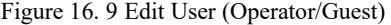

| Edit User                                                                                                                                                                          |                        |    |        |  |
|------------------------------------------------------------------------------------------------------------------------------------------------------------------------------------|------------------------|----|--------|--|
| User Name                                                                                                                                                                          | admin                  |    |        |  |
| Old Password                                                                                                                                                                       |                        |    |        |  |
| Change Password                                                                                                                                                                    |                        |    |        |  |
| Password                                                                                                                                                                           |                        |    |        |  |
| Confirm                                                                                                                                                                            |                        |    |        |  |
| Enable Unlock Patt                                                                                                                                                                 | >                      |    |        |  |
| Draw Unlock Pattern                                                                                                                                                                | ్లో                    |    |        |  |
| User's MAC Address                                                                                                                                                                 | 00 :00 :00 :00 :00 :00 |    |        |  |
| V Valid password range [8-16]. You can use a combination of numbers,<br>lowercase, uppercase and special character for your password with at<br>least two kinds of them contained. |                        |    |        |  |
|                                                                                                                                                                                    |                        | OK | Cancel |  |

Figure 16. 10 Edit User (admin)

- **4.** Edit the password for the user
	- **• Operator and Guest**

You can edit the user information, including user name, password, permission level and MAC address. Check the checkbox of **Change Password** if you want to change the password, and input the new password in the text field of **Password** and **Confirm**. A strong password is recommended.

- **• Admin**
You are only allowed to edit the password and MAC address. Check the checkbox of **Change Password** if you want to change the password, and the input the correct old password, and the new password in the text field of **Password** and **Confirm**.

```
STRONG PASSWORD RECOMMENDED–We highly recommend you create a strong 
password of your own choosing (Using a minimum of 8 characters, including at least three of 
the following categories: upper case letters, lower case letters, numbers, and special characters.) 
in order to increase the security of your product. And we recommend you reset your password 
regularly, especially in the high security system, resetting the password monthly or weekly can 
better protect your product.
```
**5.** Edit the unlock pattern for the admin user account.

1) Check the checkbox of **Enable Unlock Pattern** to enable the use of unlock pattern when logging in to the device.

2) Use the mouse to draw a pattern among the 9 dots on the screen. Release the mouse when the pattern is done.

| 8  |
|----|
|    |
| NO |

Please refer to *Chapter 2.3.1 Configuring the Unlock Pattern* for detailed instructions.

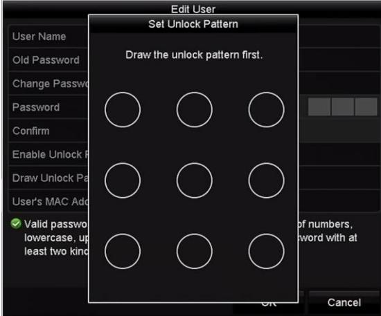

Figure 16. 11 Set Unlock Patter for Admin User

- **6.** Click the **OK** button to save the settings and exit the menu.
- **7.** For the **Operator** or **Guest** user account, you can also click the icon on te user management interface to edit the permission.

# **Chapter 17 Appendix**

| 17.1 | Specifications       |
|------|----------------------|
|      | 17.1.1DS-96000NI-I16 |

| Model                                                                                                                  |                         | DS-96128NI-I16                                                                         | DS-96256NI-I16                                                      |  |
|------------------------------------------------------------------------------------------------------------------------|-------------------------|----------------------------------------------------------------------------------------|---------------------------------------------------------------------|--|
| Video & Audio                                                                                                          | IP video input          | 128-ch                                                                                 | 256-ch                                                              |  |
| input                                                                                                                  | Incoming/outgoing       | 512Mbps/512Mbps                                                                        | 768Mbps/512Mbps                                                     |  |
|                                                                                                                        | bandwidth               |                                                                                        |                                                                     |  |
|                                                                                                                        | Incoming/outgoing       | 400Mbps/400Mbps                                                                        | 512Mbps/400Mbps                                                     |  |
|                                                                                                                        | bandwidth (RAID mode)   |                                                                                        |                                                                     |  |
|                                                                                                                        | Protocol                |                                                                                        | HIKVISION, ACTi, ARECONT, AXIS, BOSCH, BRICKCOM, CANON, HUNT, ONVIF |  |
|                                                                                                                        |                         | (Version 2.5), PANASONIC, PELCO, PSIA, RTSP, SAMSUNG, SONY, VIVOTEK, ZAVIO             |                                                                     |  |
| Video & Audio<br>HDMI output<br>Two independent HDMI outputs of 4K resolution. Resolution: 4K (4096 ×2160), 4K (3840 × |                         |                                                                                        |                                                                     |  |
| output                                                                                                                 |                         | 2160) /30Hz, 2K (2560 ×1440) /60Hz, 1080p (1920 ×1080) /60Hz, UXGA (1600 ×1200) /60Hz, |                                                                     |  |
|                                                                                                                        |                         | SXGA (1280 ×1024) /60Hz, 720p (1280 ×720) /60Hz, XGA (1024 ×768) /60Hz                 |                                                                     |  |
|                                                                                                                        | VGA output              | 1-ch. Resolution: 1080p (1920 ×1080) /60Hz, UXGA (1600 ×1200) /60Hz, SXGA (1280 ×      |                                                                     |  |
|                                                                                                                        |                         | 1024) /60Hz, 720p (1280 ×720) /60Hz, XGA (1024 ×768) /60Hz                             |                                                                     |  |
|                                                                                                                        | LCD output (optional)   | One 7 inch LCD                                                                         |                                                                     |  |
|                                                                                                                        | Audio output            | 1-ch. RCA (2.0 Vp-p, 1 KΩ)                                                             |                                                                     |  |
| Video & Audio                                                                                                          | Video resolution        | 12 MP/8 MP/7 MP/6 MP/5 MP/4 MP/3                                                       |                                                                     |  |
| decoding                                                                                                               |                         | MP/1080p/UXGA/720p/VGA/4CIF/DCIF/2CIF/CIF/QCIF                                         |                                                                     |  |
|                                                                                                                        | Synchronous playback    | Up to 16 channels                                                                      |                                                                     |  |
|                                                                                                                        | Capability              | 20-ch @ 1080p                                                                          |                                                                     |  |
| HDD                                                                                                                    | Interface               | 16 SATA interfaces supporting hot-plug                                                 |                                                                     |  |
|                                                                                                                        | Capacity                | 1TB/2TB/3TB/4TB/5TB/6TB/8TB                                                            |                                                                     |  |
| RAID                                                                                                                   | RAID Type               | RAID 0, RAID 1, RAID 5, RAID 6, RAID 10                                                |                                                                     |  |
| Network                                                                                                                | Protocol                | IPv6, HTTPS, UPnP, SNMP, NTP, SADP, SMTP, NFS, iSCSI, PPPoE, DDNS                      |                                                                     |  |
| management<br>Network interface<br>4, RJ45 10M/100M/1000M self-adaptive Ethernet interface                             |                         |                                                                                        |                                                                     |  |
|                                                                                                                        | Two-way audio input     | 1-ch, RCA (2.0 Vp-p, 1 KΩ)                                                             |                                                                     |  |
| External                                                                                                               | Serial port             | 1 RS-232, 1 RS-485, Keyboard                                                           |                                                                     |  |
| interface                                                                                                              | USB interface           | Front Panel: 2 ×USB 2.0 in; Rear Panel: 2 × USB 3.0                                    |                                                                     |  |
|                                                                                                                        | Alarm input/output      | 16/8                                                                                   |                                                                     |  |
|                                                                                                                        | Power supply            | 100 to 240 VAC, 550W                                                                   |                                                                     |  |
|                                                                                                                        | Fan                     | Redundant dull ball bearing fan; Speed adjustable; Hot-plug                            |                                                                     |  |
|                                                                                                                        | Consumption             |                                                                                        |                                                                     |  |
|                                                                                                                        | (without HDD)           | ≤ 140W                                                                                 |                                                                     |  |
|                                                                                                                        | Working temperature     | 0 °C to 50 °C (32 °F to 122 °F)                                                        |                                                                     |  |
| General                                                                                                                | Working humidity        | 10% to 90%                                                                             |                                                                     |  |
|                                                                                                                        | Chassis                 | 3U                                                                                     |                                                                     |  |
|                                                                                                                        | Dimension               |                                                                                        |                                                                     |  |
|                                                                                                                        | (W × D × H)             | 442 × 494 × 146 mm (17.4 × 19.4 × 5.7 inch)                                            |                                                                     |  |
|                                                                                                                        | Weight<br>(without HDD) | ≤16 kg (35.3 lb)                                                                       |                                                                     |  |

| Model            |                                                                                                                                                                                                                                                                                                                                                                                                                                                                                                                                                                                                                                    | DS-96128NI-I24                                                                         | DS-96256NI-I24  |  |  |  |
|------------------|------------------------------------------------------------------------------------------------------------------------------------------------------------------------------------------------------------------------------------------------------------------------------------------------------------------------------------------------------------------------------------------------------------------------------------------------------------------------------------------------------------------------------------------------------------------------------------------------------------------------------------|----------------------------------------------------------------------------------------|-----------------|--|--|--|
| Video &          | IP video input                                                                                                                                                                                                                                                                                                                                                                                                                                                                                                                                                                                                                     | 128-ch                                                                                 | 256-ch          |  |  |  |
| Audio input      | Incoming/outgoing                                                                                                                                                                                                                                                                                                                                                                                                                                                                                                                                                                                                                  | 512Mbps/512Mbps                                                                        | 768Mbps/512Mbps |  |  |  |
|                  | bandwidth                                                                                                                                                                                                                                                                                                                                                                                                                                                                                                                                                                                                                          |                                                                                        |                 |  |  |  |
|                  | Incoming/outgoing                                                                                                                                                                                                                                                                                                                                                                                                                                                                                                                                                                                                                  | 400Mbps/400Mbps                                                                        | 512Mbps/400Mbps |  |  |  |
|                  | bandwidth (RAID mode)                                                                                                                                                                                                                                                                                                                                                                                                                                                                                                                                                                                                              |                                                                                        |                 |  |  |  |
|                  | Protocol                                                                                                                                                                                                                                                                                                                                                                                                                                                                                                                                                                                                                           | HIKVISION, ACTi, ARECONT, AXIS, BOSCH, BRICKCOM, CANON, HUNT, ONVIF                    |                 |  |  |  |
|                  |                                                                                                                                                                                                                                                                                                                                                                                                                                                                                                                                                                                                                                    | (Version 2.5), PANASONIC, PELCO, PSIA, RTSP, SAMSUNG, SONY, VIVOTEK, ZAVIO             |                 |  |  |  |
| Video &          | HDMI output                                                                                                                                                                                                                                                                                                                                                                                                                                                                                                                                                                                                                        | Two independent HDMI outputs of 4K resolution. Resolution: 4K (4096 ×2160), 4K (3840 × |                 |  |  |  |
| Audio output     |                                                                                                                                                                                                                                                                                                                                                                                                                                                                                                                                                                                                                                    | 2160) /30Hz, 2K (2560 ×1440)/60Hz, 1080p (1920 ×1080)/60Hz, UXGA (1600 ×1200)/60Hz,    |                 |  |  |  |
|                  |                                                                                                                                                                                                                                                                                                                                                                                                                                                                                                                                                                                                                                    | SXGA (1280 ×1024)/60Hz, 720p (1280 ×720)/60Hz, XGA (1024 ×768)/60Hz                    |                 |  |  |  |
|                  | VGA output                                                                                                                                                                                                                                                                                                                                                                                                                                                                                                                                                                                                                         | 1-ch. Resolution: 1080p (1920 ×1080)/60Hz, UXGA (1600 ×1200)/60Hz, SXGA (1280 ×        |                 |  |  |  |
|                  |                                                                                                                                                                                                                                                                                                                                                                                                                                                                                                                                                                                                                                    | 1024)/60Hz, 720p (1280 ×720)/60Hz, XGA (1024 ×768)/60Hz                                |                 |  |  |  |
|                  | LCD output (optional)                                                                                                                                                                                                                                                                                                                                                                                                                                                                                                                                                                                                              | One 7 inch LCD                                                                         |                 |  |  |  |
|                  | Audio output                                                                                                                                                                                                                                                                                                                                                                                                                                                                                                                                                                                                                       | 1-ch. RCA (2.0 Vp-p, 1 KΩ)                                                             |                 |  |  |  |
| Video &          | Video resolution                                                                                                                                                                                                                                                                                                                                                                                                                                                                                                                                                                                                                   | 12 MP/8 MP/7 MP/6 MP/5 MP/4 MP/3                                                       |                 |  |  |  |
| Audio            |                                                                                                                                                                                                                                                                                                                                                                                                                                                                                                                                                                                                                                    | MP/1080p/UXGA/720p/VGA/4CIF/DCIF/2CIF/CIF/QCIF                                         |                 |  |  |  |
| decoding         | Synchronous playback                                                                                                                                                                                                                                                                                                                                                                                                                                                                                                                                                                                                               | Up to 16 channels                                                                      |                 |  |  |  |
|                  | Capability                                                                                                                                                                                                                                                                                                                                                                                                                                                                                                                                                                                                                         | 20-ch @ 1080p                                                                          |                 |  |  |  |
|                  | Interface                                                                                                                                                                                                                                                                                                                                                                                                                                                                                                                                                                                                                          | 24 SATA interfaces supporting hot-plug                                                 |                 |  |  |  |
|                  | Capacity                                                                                                                                                                                                                                                                                                                                                                                                                                                                                                                                                                                                                           | 1TB/2TB/3TB/4TB/5TB/6TB/8TB                                                            |                 |  |  |  |
| RAID             | RAID Type                                                                                                                                                                                                                                                                                                                                                                                                                                                                                                                                                                                                                          |                                                                                        |                 |  |  |  |
| Network          | Protocol                                                                                                                                                                                                                                                                                                                                                                                                                                                                                                                                                                                                                           |                                                                                        |                 |  |  |  |
| management       | Network interface                                                                                                                                                                                                                                                                                                                                                                                                                                                                                                                                                                                                                  |                                                                                        |                 |  |  |  |
|                  | RAID 0, RAID 1, RAID 5, RAID 6, RAID 10<br>IPv6, HTTPS, UPnP, SNMP, NTP, SADP, SMTP, NFS, iSCSI, PPPoE, DDNS<br>4, RJ45 10M/100M/1000M self-adaptive Ethernet interface<br>Two-way audio input<br>1-ch, RCA (2.0 Vp-p, 1 KΩ)<br>Serial port<br>1 RS-232, 1 RS-485, Keyboard<br>USB interface<br>Front Panel: 1 ×USB 2.0; Rear Panel: 2 × USB 3.0<br>Alarm input/output<br>16/8<br>Power supply<br>100 to 240 VAC, 550W<br>Fan<br>Redundant dull ball bearing fan; Speed adjustable; Hot-plug<br>Consumption<br>≤ 140W<br>(without HDD)<br>Working temperature<br>0 °C to 50 °C (32 °F to 122 °F)<br>Working humidity<br>10% to 90% |                                                                                        |                 |  |  |  |
| External         |                                                                                                                                                                                                                                                                                                                                                                                                                                                                                                                                                                                                                                    |                                                                                        |                 |  |  |  |
| HDD<br>interface |                                                                                                                                                                                                                                                                                                                                                                                                                                                                                                                                                                                                                                    |                                                                                        |                 |  |  |  |
|                  |                                                                                                                                                                                                                                                                                                                                                                                                                                                                                                                                                                                                                                    |                                                                                        |                 |  |  |  |
|                  |                                                                                                                                                                                                                                                                                                                                                                                                                                                                                                                                                                                                                                    |                                                                                        |                 |  |  |  |
|                  |                                                                                                                                                                                                                                                                                                                                                                                                                                                                                                                                                                                                                                    |                                                                                        |                 |  |  |  |
|                  |                                                                                                                                                                                                                                                                                                                                                                                                                                                                                                                                                                                                                                    |                                                                                        |                 |  |  |  |
|                  |                                                                                                                                                                                                                                                                                                                                                                                                                                                                                                                                                                                                                                    |                                                                                        |                 |  |  |  |
|                  |                                                                                                                                                                                                                                                                                                                                                                                                                                                                                                                                                                                                                                    |                                                                                        |                 |  |  |  |
| General          |                                                                                                                                                                                                                                                                                                                                                                                                                                                                                                                                                                                                                                    |                                                                                        |                 |  |  |  |
|                  | Chassis                                                                                                                                                                                                                                                                                                                                                                                                                                                                                                                                                                                                                            | 4U                                                                                     |                 |  |  |  |
|                  | Dimension                                                                                                                                                                                                                                                                                                                                                                                                                                                                                                                                                                                                                          |                                                                                        |                 |  |  |  |
|                  | (W × D × H)                                                                                                                                                                                                                                                                                                                                                                                                                                                                                                                                                                                                                        | 447 × 528 × 172mm (17.6 × 20.8 × 6.8 inch)                                             |                 |  |  |  |
|                  | Weight                                                                                                                                                                                                                                                                                                                                                                                                                                                                                                                                                                                                                             |                                                                                        |                 |  |  |  |
|                  | (without HDD)                                                                                                                                                                                                                                                                                                                                                                                                                                                                                                                                                                                                                      | ≤ 23 kg (50.7 lb)                                                                      |                 |  |  |  |

## **17.2 Glossary**

- **• Dual Stream:** Dual stream is a technology used to record high resolution video locally while transmitting a lower resolution stream over the network. The two streams are generated by the DVR, with the main stream having a maximum resolution of 4CIF and the sub-stream having a maximum resolution of CIF.
- **• HDD:** Acronym for Hard Disk Drive. A storage medium which stores digitally encoded data on platters with magnetic surfaces.
- **• DHCP:** Dynamic Host Configuration Protocol (DHCP) is a network application protocol used by devices (DHCP clients) to obtain configuration information for operation in an Internet Protocol network.
- **• HTTP:** Acronym for Hypertext Transfer Protocol. A protocol to transfer hypertext request and information between servers and browsers over a network
- **• DDNS:** Dynamic DNS is a method, protocol, or network service that provides the capability for a networked device, such as a router or computer system using the Internet Protocol Suite, to notify a domain name server to change, in real time (ad-hoc) the active DNS configuration of its configured hostnames, addresses or other information stored in DNS.
- **• Hybrid DVR:** A hybrid DVR is a combination of a DVR and NVR.
- **• NTP:** Acronym for Network Time Protocol. A protocol designed to synchronize the clocks of computers over a network.
- **• NTSC:** Acronym for National Television System Committee. NTSC is an analog television standard used in such countries as the United States and Japan. Each frame of an NTSC signal contains 525 scan lines at 60Hz.
- **• NVR:** Acronym for Network Video Recorder. An NVR can be a PC-based or embedded system used for centralized management and storage for IP cameras, IP Domes and other DVRs.
- **• PAL:** Acronym for Phase Alternating Line. PAL is also another video standard used in broadcast televisions systems in large parts of the world. PAL signal contains 625 scan lines at 50Hz.
- **• PTZ:** Acronym for Pan, Tilt, Zoom. PTZ cameras are motor driven systems that allow the camera to pan left and right, tilt up and down and zoom in and out.
- **• USB:** Acronym for Universal Serial Bus. USB is a plug-and-play serial bus standard to interface devices to a host computer.

## **17.3 Troubleshooting**

### **No image displayed on the monitor after starting up normally.**

#### *Possible Reasons*

- a) No VGA or HDMI connections.
- b) Connection cable is damaged.
- c) Input mode of the monitor is incorrect.

#### *Steps*

- **1.** Verify the device is connected with the monitor via HDMI or VGA cable.
If not, please connect the device with the monitor and reboot.

- **2.** Verify the connection cable is good.
If there is still no image display on the monitor after rebooting, please check if the connection cable is good, and change a cable to connect again.

- **3.** Verify Input mode of the monitor is correct.
Please check the input mode of the monitor matches with the output mode of the device (e.g. if the output mode of NVR is HDMI output, then the input mode of monitor must be the HDMI input). And if not, please modify the input mode of monitor.

- **4.** Check if the fault is solved by the step 1 to step 3.
If it is solved, finish the process. If not, please contact the engineer from Hikvision to do the further process.

#### **There is an audible warning sound "Di-Di-Di-DiDi" after a new bought NVR starts up.**

#### *Possible Reasons*

- a) No HDD is installed in the device.
- b) The installed HDD has not been initialized.
- c) The installed HDD is not compatible with the NVR or is broken-down.

#### *Steps*

- **1.** Verify at least one HDD is installed in the NVR.
	- 1) If not, please install the compatible HDD.

Please refer to the "Quick Operation Guide" for the HDD installation steps.

- 2) If you don't want to install a HDD, select "Menu>Configuration > Exceptions", and uncheck the Audible Warning checkbox of "HDD Error".
- **2.** Verify the HDD is initialized.
	- 1) Select "Menu>HDD>General".
	- 2) If the status of the HDD is "Uninitialized", please check the checkbox of corresponding HDD and click the "Init" button.
- **3.** Verify the HDD is detected or is in good condition.
	- 1) Select "Menu>HDD>General".
	- 2) If the HDD is not detected or the status is "Abnormal", please replace the dedicated HDD according to the requirement.
- **4.** Check if the fault is solved by the step 1 to step 3.

If it is solved, finish the process.

If not, please contact the engineer from Hikvision to do the further process.

- **The status of the added IP camera displays as "Disconnected" when it is connected through Private**
#### **Protocol. Select "Menu>Camera>Camera>IP Camera" to get the camera status.**

#### *Possible Reasons*

- a) Network failure, and the NVR and IP camera lost connections.
- b) The configured parameters are incorrect when adding the IP camera.
- c) Insufficient bandwidth.

#### *Steps*

- **1.** Verify the network is connected.
	- 1) Connect the NVR and PC with the RS-232 cable.
	- 2) Open the Super Terminal software, and execute the ping command. Input "ping IP" (e.g. ping 172.6.22.131).

Simultaneously press **Ctrl** and **C** to exit the ping command.

If there exists return information and the time value is little, the network is normal.

- **2.** Verify the configuration parameters are correct.
	- 1) Select "Menu>Camera>Camera>IP Camera".
	- 2) Verify the following parameters are the same with those of the connected IP devices, including IP address, protocol, management port, user name and password.
- **3.** Verify the whether the bandwidth is enough.
	- 1) Select "Menu >Maintenance > Net Detect > Network Stat.".
	- 2) Check the usage of the access bandwidth, and see if the total bandwidth has reached its limit.
- **4.** Check if the fault is solved by the step 1 to step 3.

If it is solved, finish the process.

If not, please contact the engineer from Hikvision to do the further process.

### **The IP camera frequently goes online and offline and the status of it displays as "Disconnected".** *Possible Reasons*

- a) The IP camera and the NVR versions are not compatible.
- b) Unstable power supply of IP camera.
- c) Unstable network between IP camera and NVR.
- d) Limited flow by the switch connected with IP camera and NVR.

#### *Steps*

- **1.** Verify the IP camera and the NVR versions are compatible.
	- 1) Enter the IP camera Management interface "Menu > Camera > Camera>IP Camera", and view the firmware version of connected IP camera.
	- 2) Enter the System Info interface "Menu>Maintenance>System Info>Device Info", and view the firmware version of NVR.
- **2.** Verify power supply of IP camera is stable.
	- 1) Verify the power indicator is normal.
	- 2) When the IP camera is offline, please try the ping command on PC to check if the PC connects with the IP camera.
- **3.** Verify the network between IP camera and NVR is stable.
	- 1) When the IP camera is offline, connect PC and NVR with the RS-232 cable.
	- 2) Open the Super Terminal, use the ping command and keep sending large data packages to the connected IP camera, and check if there exists packet loss.


Simultaneously press **Ctrl** and **C** to exit the ping command.

*Example:* Input **ping 172.6.22.131 –l 1472 –f.**

- **4.** Verify the switch is not flow control.
Check the brand, model of the switch connecting IP camera and NVR, and contact with the manufacturer of the switch to check if it has the function of flow control. If so, please turn it down.

- **5.** Check if the fault is solved by the step 1 to step 4.
If it is solved, finish the process.

If not, please contact the engineer from Hikvision to do the further process.

- **No monitor connected with the NVR locally and when you manage the IP camera to connect with the device by web browser remotely, of which the status displays as Connected. And then you connect the device with the monitor via VGA or HDMI interface and reboot the device, there is black screen with the mouse cursor.**
**Connect the NVR with the monitor before startup via VGA or HDMI interface, and manage the IP camera to connect with the device locally or remotely, the status of IP camera displays as Connect. And then connect the device with the CVBS, and there is black screen either.**

#### *Possible Reasons:*

After connecting the IP camera to the NVR, the image is output via the main spot interface by default.

*Steps:*

- **1.** Enable the output channel.
- **2.** Select "Menu > Configuration > Live View > View", and select video output interface in the drop-down list and configure the window you want to view.


- The view settings can only be configured by the local operation of NVR.
- Different camera orders and window-division modes can be set for different output interfaces separately, and digits like "D1"and "D2" stands for the channel number, and "X" means the selected window has no image output.
- **3.** Check if the fault is solved by the above steps.

If it is solved, finish the process.

If not, please contact the engineer from Hikvision to do the further process.

#### **Live view stuck when video output locally.**

#### *Possible Reasons:*

- a) Poor network between NVR and IP camera, and there exists packet loss during the transmission.
- b) The frame rate has not reached the real-time frame rate.

#### *Steps:*

- **1.** Verify the network between NVR and IP camera is connected.
	- 1) When image is stuck, connect the RS-232 ports on PC and the rear panel of NVR with the RS-232 cable.
	- 2) Open the Super Terminal, and execute the command of "**ping** *192.168.0.0* **–l 1472 –f**" (the IP address may change according to the real condition), and check if there exists packet loss.

Simultaneously press **Ctrl** and **C** to exit the ping command.

- **2.** Verify the frame rate is real-time frame rate.
Select "Menu > Record > Parameters > Record", and set the Frame rate to Full Frame.

- **3.** Check if the fault is solved by the above steps.
If it is solved, finish the process.

If not, please contact the engineer from Hikvision to do the further process.

#### **Live view stuck when video output remotely via the Internet Explorer or platform software.** *Possible Reasons:*

a)Poor network between NVR and IP camera, and there exists packet loss during the transmission.

b)Poor network between NVR and PC, and there exists packet loss during the transmission.

c)The performances of hardware are not good enough, including CPU, memory, etc..

#### *Steps:*

- **1.** Verify the network between NVR and IP camera is connected.
	- 1) When image is stuck, connect the RS-232 ports on PC and the rear panel of NVR with the RS-232 cable.
	- 2) Open the Super Terminal, and execute the command of "**ping** *192.168.0.0* **–l 1472 –f**" (the IP address may change according to the real condition), and check if there exists packet loss.

Simultaneously press **Ctrl** and **C** to exit the ping command.

- **2.** Verify the network between NVR and PC is connected.
	- 1) Open the cmd window in the Start menu, or you can press "windows+R" shortcut key to open it.
	- 2) Use the ping command to send large packet to the NVR, execute the command of "ping 192.168.0.0 –l 1472 –f" (the IP address may change according to the real condition), and check if there exists packet loss.


Simultaneously press **Ctrl** and **C** to exit the ping command.

- **3.** Verify the hardware of the PC is good enough.
Simultaneously press **Ctrl**, **Alt** and **Delete** to enter the windows task management interface, as shown in the following figure.

| File                        | View Help            |                               |                     |
|-----------------------------|----------------------|-------------------------------|---------------------|
| Applications                | Processes   Services | Performance                   | Networking<br>Users |
| PU Usage                    | PU Usage History     |                               |                     |
| 35 %                        |                      |                               |                     |
| Memory                      |                      | Physical Memory Usage History |                     |
|                             |                      |                               |                     |
|                             |                      |                               |                     |
| Physical Memory (MB)        |                      | System                        |                     |
| Total                       | 3060                 | Handles                       | 21916               |
| Cached                      | 1324                 | Threads                       | 1107                |
| Available                   | 1837                 | Processes                     | 73                  |
| Free                        | 547                  | Up Time                       | 0:11:57:41          |
|                             |                      | Commit (MB)                   | 1463 / 6119         |
| Kernel Memory (MB)<br>Paged | 185                  |                               |                     |

#### Windows task management interface

- Select the "Performance" tab; check the status of the CPU and Memory.
- If the resource is not enough, please end some unnecessary processes.
- **4.** Check if the fault is solved by the above steps.

If it is solved, finish the process.

If not, please contact the engineer from Hikvision to do the further process.

#### **When using the NVR to get the live view audio, there is no sound or there is too much noise, or the volume is too low.**

#### *Possible Reasons:*

- a) Cable between the pickup and IP camera is not connected well; impedance mismatches or incompatible.
- b) The stream type is not set as "Video & Audio".
- c) The encoding standard is not supported with NVR.

#### *Steps:*

- **1.** Verify the cable between the pickup and IP camera is connected well; impedance matches and compatible.
Log in the IP camera directly, and turn the audio on, check if the sound is normal. If not, please contact the manufacturer of the IP camera.

- **2.** Verify the setting parameters are correct.
Select "Menu > Record > Parameters > Record", and set the Stream Type as "Audio & Video".

- **3.** Verify the audio encoding standard of the IP camera is supported by the NVR.
NVR supports G722.1 and G711 standards, and if the encoding parameter of the input audio is not one of

the previous two standards, you can log in the IP camera to configure it to the supported standard.

- **4.** Check if the fault is solved by the above steps.
If it is solved, finish the process.

If not, please contact the engineer from Hikvision to do the further process.

#### **The image gets stuck when NVR is playing back by single or multi-channel.** *Possible Reasons:*

- a) Poor network between NVR and IP camera, and there exists packet loss during the transmission.
- b) The frame rate is not the real-time frame rate.
- c) The NVR supports up to 16-channel synchronize playback at the resolution of 4CIF, if you want a 16-channel synchronize playback at the resolution of 720p, the frame extracting may occur, which leads to a slight stuck.

#### *Steps:*

- **1.** Verify the network between NVR and IP camera is connected.
	- 1) When image is stuck, connect the RS-232 ports on PC and the rear panel of NVR with the RS-232 cable.
	- 2) Open the Super Terminal, and execute the command of "**ping** *192.168.0.0* **–l 1472 –f**" (the IP address may change according to the real condition), and check if there exists packet loss.


Simultaneously press the **Ctrl** and **C** to exit the ping command.

- **2.** Verify the frame rate is real-time frame rate.
Select "Menu > Record > Parameters > Record", and set the Frame Rate to "Full Frame".

- **3.** Verify the hardware can afford the playback.
Reduce the channel number of playback.

Select "Menu > Record > Encoding > Record", and set the resolution and bitrate to a lower level.

- **4.** Reduce the number of local playback channel.
Select "Menu > Playback", and uncheck the checkbox of unnecessary channels.

- **5.** Check if the fault is solved by the above steps.
	- If it is solved, finish the process.

If not, please contact the engineer from Hikvision to do the further process.

#### **No record file found in the NVR local HDD, and prompt "No record file found".**

#### *Possible Reasons:*

- a) The time setting of system is incorrect.
- b) The search condition is incorrect.
- c) The HDD is error or not detected.

#### *Steps:*

- **1.** Verify the system time setting is correct.
Select "Menu > Configuration > General > General", and verify the "Device Time" is correct.

- **2.** Verify the search condition is correct. Select "Playback", and verify the channel and time are correct.
- **3.** Verify the HDD status is normal. Select "Menu > HDD > General" to view the HDD status, and verify the HDD is detected and can be read and written normally.
- **4.** Check if the fault is solved by the above steps.

If it is solved, finish the process.

If not, please contact the engineer from Hikvision to do the further process.

## **17.4 List of Compatible IP Cameras**

### **17.4.1List of Hikvision IP Cameras**


For the list, our company holds right to interpret.

| Type    | Model                      | Version             | Max.       | Sub-stream | Audio |
|---------|----------------------------|---------------------|------------|------------|-------|
|         |                            |                     | Resolution |            |       |
|         | DS-2CD7133F-E              | V5.2.0 build 140721 | 640*480    | √          | ×     |
|         | DS-2CD793NFWD-EI           | V5.2.0 build 140721 | 704*576    | √          | √     |
| SD      |                            | V2.0 build 090522   |            |            |       |
| Network | DS-2CD802NF                | V2.0 build 090715   | 704*576    | √          | √     |
| Camera  |                            | V2.0 build 110301   |            |            |       |
|         | DS-2CD833F-E               | V5.2.0 build 140721 | 640*480    | √          | √     |
|         | DS-2CD893PF-E              | V5.2.0 build 140721 | 704*576    | √          | √     |
|         | DS-2CD2012-I               | V5.3.0 build150327  | 1280*960   | √          | ×     |
|         | DS-2CD2132-I               | V5.3.0 build150327  | 2048*1536  | √          | ×     |
|         | DS-2CD2410FD-I(W)          | V5.3.0 build150327  | 1920*1080  | √          | √     |
|         | DS-2CD2612F-I              | V5.3.0 build150327  | 1280*960   | √          | ×     |
|         | DS-2CD2612F-IS             | V5.3.0 build150327  | 1280*960   | √          | √     |
|         | DS-2CD2632F-I              | V5.3.0 build150327  | 2048*1536  | √          | ×     |
|         | DS-2CD2632F-IS             | V5.3.0 build150327  | 2048*1536  | √          | √     |
|         | DS-2CD2710F-I              | V5.3.0 build150327  | 1920*1080  | √          | ×     |
|         | DS-2CD2720F-I              | V5.3.0 build150327  | 1920*1080  | √          | ×     |
|         | DS-2CD4010F                | V5.3.0 build150327  | 1920*1080  | √          | √     |
|         | DS-2CD4012F                | V5.3.0 build150327  | 1280*1024  | √          | √     |
| HD      | DS-2CD4026FWD              | V5.3.0 build150327  | 1920*1080  | √          | √     |
| Network | DS-2CD4026FWD-SDI          | V5.3.0 build150327  | 1920*1080  | √          | √     |
| Camera  | DS-2CD4032FWD              | V5.3.0 build150327  | 2048*1536  | √          | √     |
|         | DS-2CD4065F                | V5.3.0 build150327  | 3072*2048  | √          | √     |
|         | DS-2CD4124F-I(2.8-12mm)    | V5.3.0 build150327  | 1920*1080  | √          | √     |
|         | DS-2CD4132FWD-I(2.8-12mm)  | V5.3.0 build150327  | 2048*1536  | √          | √     |
|         | DS-2CD4212F-I(2.8-12mm)    | V5.3.0 build150327  | 1280*1024  | √          | ×     |
|         | DS-2CD4212F-IS(2.8-12mm)   | V5.3.0 build150327  | 1280*1024  | √          | √     |
|         | DS-2CD4212FWD-I            | V5.3.0 build150327  | 1280*960   | √          | ×     |
|         | DS-2CD4212FWD-IS           | V5.3.0 build150327  | 1280*960   | √          | √     |
|         | DS-2CD4224F-I              | V5.3.0 build150327  | 1920*1080  | √          | ×     |
|         | DS-2CD4232FWD-I            | V5.3.0 build150327  | 2048*1536  | √          | ×     |
|         | DS-2CD4232FWD-IS(2.8-12mm) | V5.3.0 build150327  | 2048*1536  | √          | √     |
|         | DS-2CD4312F-I              | V5.3.0 build150327  | 1280*1024  | √          | ×     |

| Type          | Model             | Version             | Max.<br>Resolution | Sub-stream | Audio |
|---------------|-------------------|---------------------|--------------------|------------|-------|
|               | DS-2CD4312FWD-I   | V5.3.0 build150327  | 1280*960           | √          | ×     |
|               | DS-2CD4324F-I     | V5.3.0 build150327  | 1920*1080          | √          | ×     |
|               | DS-2CD4332FHWD-IS | V5.3.0 build150327  | 2048*1536          | √          | √     |
|               | DS-2CD4332FHWD-I  | V5.3.0 build150327  | 2048*1536          | √          | ×     |
|               | DS-2CD4332FWD-I   | V5.3.0 build150327  | 2048*1536          | √          | ×     |
|               | DS-2CD6213F       | V5.2.6 build 141218 | 1280*960           | √          | ×     |
|               | DS-2CD6223F       | V5.2.6 build 141218 | 1920*1080          | √          | ×     |
|               | DS-2CD6233F       | V5.2.6 build 141218 | 2048*1536          | √          | ×     |
|               | DS-2CD7153-E      | V5.2.0 build 140721 | 1600*1200          | √          | ×     |
|               | DS-2CD7164-E      | V5.2.0 build 140721 | 1280*720           | √          | ×     |
|               | DS_2CD754F-EI     | V5.2.0 build 140721 | 2048*1536          | √          | √     |
|               | DS-2CD754FWD-E    | V5.2.0 build 140721 | 1920*1080          | √          | √     |
|               | DS-2CD754FWD-EIZ  | V5.2.0 build 140721 | 2048*1536          | √          | √     |
|               | DS_2CD783F-EI     | V5.2.0 build 140721 | 2560*1920          | √          | √     |
|               | DS-2CD8153F-E     | V5.2.0 build 140721 | 1600*1200          | √          | √     |
|               | DS-2CD8464F-EI    | V5.2.0 build 140721 | 1280*960           | √          | √     |
|               |                   | V2.0 build 110614   |                    |            |       |
|               | DS-2CD852MF-E     | V2.0 build 110426   | 1600*1200          | √          | √     |
|               |                   | V2.0 build 100521   |                    |            |       |
|               | DS-2CD855F-E      | V5.2.0 build 140721 | 1920*1080          | √          | √     |
|               |                   | V2.0 build 110614   |                    |            |       |
|               | DS-2CD862MF-E     | V2.0 build 110426   | 1280*960           | √          | √     |
|               |                   | V2.0 build 100521   |                    |            |       |
|               | DS-2CD863PF/NF-E  | V5.2.0 build 140721 | 1280*960           | √          | √     |
|               | DS-2CD864FWD-E    | V5.2.0 build 140721 | 1280*720           | √          | √     |
|               | DS-2CD876MF/BF-E  | V4.0.3 build120913  | 1600*1200          | √          | √     |
|               | DS-2CD877BF       | V4.0.3 build120913  | 1920*1080          | √          | √     |
|               | DS-2CD886MF-E     | V4.0.3 build 120913 | 2560*1920          | √          | √     |
|               | DS-2CD966(B)      | V3.1 build 120423   | 1360*1024          | ×          | ×     |
|               | DS-2CD966-V(B)    | V3.1 build 120423   | 1360*1024          | ×          | ×     |
|               | DS-2CD976(C)      | V3.1 build 120423   | 1600*1200          | ×          | ×     |
|               | DS-2CD976-V(C)    | V3.1 build 120423   | 1600*1200          | ×          | ×     |
|               | DS-2CD977(C)      | V3.1 build 120423   | 1920*1080          | ×          | ×     |
|               | DS-2CD986A(C)     | V3.1 build 120423   | 2448*2048          | ×          | ×     |
|               | DS-2CD986C(B)     | V2.3.6 build 120401 | 2560*1920          | ×          | ×     |
| HD<br>Network | DS-2CD9122        | V3.7.1 build140417  | 1920*1080          | √          | ×     |
|               | DS-2CD9152        | V3.7.1 build140417  | 2560*1920          | √          | ×     |
|               | iDS-2CD9152       | V3.7.1 build140417  | 2560*1920          | √          | ×     |
|               | DS-2CD9122-H      | V3.7.1 build140417  | 1920*1080          | √          | ×     |
| Camera        | DS-2CD9182-H      | V3.8.1 build140815  | 3296*2472          | √          | ×     |
|               | DS-2CD9121        | V3.7.1 build140417  | 1600*1200          | √          | ×     |

| Type       | Model            | Version            | Max.<br>Resolution | Sub-stream | Audio |
|------------|------------------|--------------------|--------------------|------------|-------|
|            | iDS-2CD9121      | V3.7.1 build140417 | 1600*1200          | √          | ×     |
|            | DS-2CD9131       | V4.0.0 build150213 | 2048*1536          | √          | ×     |
|            | iDS-2CD9131      | V4.0.0 build150213 | 2048*1536          | √          | ×     |
|            | DS-2CD9121A      | V3.8.2 build141121 | 1600*1200          | √          | ×     |
|            | iDS-2CD9121A     | V3.8.2 build141121 | 1600*1200          | √          | ×     |
|            | DS-2CD9111(B)    | V3.7.1 build140417 | 1360*1024          | √          | ×     |
|            | DS-2CD9151A      | V3.8.2 build141121 | 2448*2048          | √          | ×     |
|            | DS-2CD9152-H     | V3.8.2 build141121 | 2592*2048          | √          | ×     |
|            | iDS-2CD9282      | V3.8.2 build141121 | 3296*2472          | √          | ×     |
|            | DS-2CD9131-K     | V4.0.0 build150213 | 2048*1536          | √          | √     |
|            | DS-2CD9152-HK    | V3.8.2 build141121 | 2592*2048          | √          | √     |
|            | iDS-2CD9131-E    | V3.8.2 build141121 | 2048*1536          | √          | ×     |
|            | iDS-2CD9151A-E   | V3.8.2 build141121 | 2448*2048          | √          | ×     |
|            | iDS-2CD9151A     | V3.8.2 build141121 | 2448*2048          | √          | ×     |
|            | iDS-2CD9152-EH   | V3.8.2 build141121 | 2592*2048          | √          | ×     |
|            | iDS-2CD9152-H    | V3.8.2 build141121 | 2592*2048          | √          | ×     |
|            | DS-2CD9120-H     | V3.7.1 build140417 | 1600*1200          | √          | ×     |
|            | iDS-2CD9361      | V4.0.0 build150213 | 2752*2208          | √          | ×     |
|            | iDS-2CD9022      | V4.0.0 build150213 | 1920*1080          | √          | √     |
|            | iDS-2CD9025      | V3.8.2 build141114 | 1920*1080          | √          | ×     |
|            | iDS-2CD9022-SZ   | V4.0.0 build150213 | 1920*1080          | √          | ×     |
|            | DS-2CD9125-KS    | V3.8.1 build150113 | 1920*1080          | √          | ×     |
|            | DS-6501HCI       | V1.0.1 build130607 | 352*288            | √          | √     |
|            | DS-6501HCI-SATA  | V1.0.1 build130607 | 352*288            | √          | √     |
|            | DS-6501HFI       | V1.0.1 build130607 | 704*576            | √          | √     |
|            | DS-6501HFI- SATA | V1.0.1 build130607 | 704*576            | √          | √     |
|            | DS-6502HCI       | V1.0.1 build130607 | 352*288            | √          | √     |
|            | DS-6502HCI- SATA | V1.0.1 build130607 | 352*288            | √          | √     |
| SD Encoder | DS-6502HFI       | V1.0.1 build130607 | 704*576            | √          | √     |
|            | DS-6502HFI- SATA | V1.0.1 build130607 | 704*576            | √          | √     |
|            | DS-6504HCI       | V1.0.1 build130607 | 352*288            | √          | √     |
|            | DS-6504HCI- SATA | V1.0.1 build130607 | 352*288            | √          | √     |
|            | DS-6504HFI       | V1.0.1 build130607 | 704*576            | √          | √     |
|            | DS-6504HFI- SATA | V1.0.1 build130607 | 704*576            | √          | √     |
|            | DS-6508HCI       | V1.0.1 build130607 | 352*288            | √          | √     |
|            | DS-6508HCI- SATA | V1.0.1 build130607 | 352*288            | √          | √     |
|            | DS-6508HFI       | V1.0.1 build130607 | 704*576            | √          | √     |
|            | DS-6508HFI- SATA | V1.0.1 build130607 | 704*576            | √          | √     |
|            | DS-6516HCI       | V1.0.1 build130607 | 352*288            | √          | √     |
|            | DS-6516HCI- SATA | V1.0.1 build130607 | 352*288            | √          | √     |
|            | DS-6516HFI       | V1.0.1 build130607 | 704*576            | √          | √     |

| Type          | Model                              | Version            | Max.<br>Resolution | Sub-stream | Audio |
|---------------|------------------------------------|--------------------|--------------------|------------|-------|
|               | DS-6516HFI- SATA                   | V1.0.1 build130607 | 704*576            | √          | √     |
|               | DS-6601HCI                         | V1.2.1 build131202 | 352*288            | √          | √     |
|               | DS-6602HCI                         | V1.2.1 build131202 | 352*288            | √          | √     |
|               | DS-6604HCI                         | V1.2.1 build131202 | 352*288            | √          | √     |
|               | DS-6601HFI(-SATA)                  | V1.2.1 build131202 | 704*576            | √          | √     |
|               | DS-6602HFI(SATA)                   | V1.2.1 build131202 | 704*576            | √          | √     |
|               | DS-6604HFI(-SATA)                  | V1.2.1 build131202 | 704*576            | √          | √     |
|               | DS-6701HWI                         | V1.2.3 build141202 | 960*576            | √          | √     |
|               | DS-6701HWI-SATA                    | V1.2.3 build141202 | 960*576            | √          | √     |
|               | DS-6704HWI                         | V1.2.3 build141202 | 960*576            | √          | √     |
|               | DS-6704HWI-SATA                    | V1.2.3 build141202 | 960*576            | √          | √     |
|               | DS-6708HWI                         | V1.2.3 build141202 | 960*576            | √          | √     |
|               | DS-6708HWI-SATA                    | V1.2.3 build141202 | 960*576            | √          | √     |
|               | DS-6716HWI                         | V1.2.3 build141202 | 960*576            | √          | √     |
|               | DS-6716HWI-SATA                    | V1.2.3 build141202 | 960*576            | √          | √     |
| HD            | DS-6601HFHI                        | V1.1.0 build150123 | 1920*1080          | √          | √     |
| Encoder       | DS-6601HFHI/L                      | V1.1.0 build150123 | 1920*1080          | √          | √     |
|               | DS-2DF7274-A/D/AF                  | V5.2.8 build150124 | 1280*960           | √          | √     |
|               | iDS-2DF7274-A/D/AF                 | V5.2.8 build150124 | 1280*960           | √          | √     |
|               | DS-2DM7274-A                       | V5.2.8 build150124 | 1280*960           | √          | √     |
|               | DS-2DF5274-A/D/A3/D3/AF/A3F        | V5.2.8 build150124 | 1280*960           | √          | √     |
|               | iDS-2DF5274-A/D/A3/D3/AF/A3F       | V5.2.8 build150124 | 1280*960           | √          | √     |
|               | DS-2DM5274-A/A3                    | V5.2.8 build150124 | 1280*960           | √          | √     |
|               | DS-2DF7276-A/D/AF                  | V5.2.8 build150124 | 1280*960           | √          | √     |
|               | iDS-2DF7276-A/D/AF                 | V5.2.8 build150124 | 1280*960           | √          | √     |
|               | DS-2DF5276-A/D/A3/D3/AF/A3F        | V5.2.8 build150124 | 1280*960           | √          | √     |
|               | iDS-2DF5276-A/D/A3/D3/AF/A3F       | V5.2.8 build150124 | 1280*960           | √          | √     |
|               | DS-2DF7274-AH/DH/AFH               | V5.2.8 build150124 | 1280*960           | √          | √     |
| Network       | iDS-2DF7274-AH/DH/AFH              | V5.2.8 build150124 | 1280*960           | √          | √     |
| Speed<br>Dome | DS-2DF5274-AH/DH/A3H/D3H/AFH/A3FH  | V5.2.8 build150124 | 1280*960           | √          | √     |
|               | iDS-2DF5274-AH/DH/A3H/D3H/AFH/A3FH | V5.2.8 build150124 | 1280*960           | √          | √     |
|               | DS-2DF7276-AH/DH/AFH               | V5.2.8 build150124 | 1280*960           | √          | √     |
|               | iDS-2DF7276-AH/DH/AFH              | V5.2.8 build150124 | 1280*960           | √          | √     |
|               | DS-2DF5276-AH/DH/A3H/D3H/AFH/A3FH  | V5.2.8 build150124 | 1280*960           | √          | √     |
|               | iDS-2DF5276-AH/DH/A3H/D3H/AFH/A3FH | V5.2.8 build150124 | 1280*960           | √          | √     |
|               | DS_2DF7130I5-AW                    | V5.2.8 build150124 | 1280*960           | √          | √     |
|               | DS-2DF7285-AH                      | V5.2.8 build150124 | 1920*1080          | √          | √     |
|               | DS-2DF5285-AH                      | V5.2.8 build150124 | 1920*1080          | √          | √     |
|               | DS-2DF7294-A/D/AF                  | V5.2.8 build150124 | 2048*1536          | √          | √     |
|               | iDS-2DF7294-A/D/AF                 | V5.2.8 build150124 | 2048*1536          | √          | √     |
|               | DS-2DF5294-A/D/A3/D3/AF/A3F        | V5.2.8 build150124 | 2048*1536          | √          | √     |

| Type | Model                        | Version             | Max.<br>Resolution | Sub-stream | Audio |
|------|------------------------------|---------------------|--------------------|------------|-------|
|      | iDS-2DF5294-A/D/A3/D3/AF/A3F | V5.2.8 build150124  | 2048*1536          | √          | √     |
|      | DS-2DF7296-A/D/AF            | V5.2.8 build150124  | 2048*1536          | √          | √     |
|      | iDS-2DF7296-A/D/AF           | V5.2.8 build150124  | 2048*1536          | √          | √     |
|      | DS-2DF5296-A/D/A3/D3/AF/A3F  | V5.2.8 build150124  | 2048*1536          | √          | √     |
|      | iDS-2DF5296-A/D/A3/D3/AF/A3F | V5.2.8 build150124  | 2048*1536          | √          | √     |
|      | DS-2DF6223-A                 | V5.2.8 build150124  | 1920*1080          | √          | √     |
|      | iDS-2DF6223-A                | V5.2.8 build150124  | 1920*1080          | √          | √     |
|      | DS-2DF8223i-A                | V5.2.8 build150124  | 1920*1080          | √          | √     |
|      | iDS-2DF8223i-A               | V5.2.8 build150124  | 1920*1080          | √          | √     |
|      | DS-2DF7284-A/D/AF            | V5.2.8 build150124  | 1920*1080          | √          | √     |
|      | iDS-2DF7284-A/D/AF           | V5.2.8 build150124  | 1920*1080          | √          | √     |
|      | DS-2DF7286-A/D/AF            | V5.2.8 build150124  | 1920*1080          | √          | √     |
|      | iDS-2DF7286-A/D/AF           | V5.2.8 build150124  | 1920*1080          | √          | √     |
|      | DS-2DF5284-A/D/A3/D3/AF/A3F  | V5.2.8 build150124  | 1920*1080          | √          | √     |
|      | iDS-2DF5284-A/D/A3/D3/AF/A3F | V5.2.8 build150124  | 1920*1080          | √          | √     |
|      | DS-2DF5286-A/D/A3/D3/AF/A3F  | V5.2.8 build150124  | 1920*1080          | √          | √     |
|      | iDS-2DF5286-A/D/A3/D3/AF/A3F | V5.2.8 build150124  | 1920*1080          | √          | √     |
|      | DS_2DF7230I5-AW              | V5.2.8 build150124  | 1920*1080          | √          | √     |
|      | DS-2AF7220-A/D               | V5.2.8 build150124  | 1920*1080          | √          | √     |
|      | DS-2AF7230-A/D               | V5.2.8 build150124  | 1920*1080          | √          | √     |
|      | DS-2AF5220-A/D               | V5.2.8 build150124  | 1920*1080          | √          | √     |
|      | DS-2AF5230-A/D               | V5.2.8 build150124  | 1920*1080          | √          | √     |
|      | iDS-2DF5220S-D4/JY           | V5.2.8 build150124  | 1920*1080          | √          | √     |
|      | DS-2DF7268-A                 | V5.2.8 build150124  | 704*576            | √          | √     |
|      | DS-2DF5268-A                 | V5.2.8 build150124  | 704*576            | √          | √     |
|      | DS-2DF7264-A                 | V5.2.8 build150124  | 704*576            | √          | √     |
|      | DS-2DF5264-A                 | V5.2.8 build150124  | 704*576            | √          | √     |
|      | DS-2DE5172-A/A3              | V5.2.10 build150128 | 1280*960           | √          | √     |
|      | DS-2DE5174-A/AE/AE3/A3/D/D3  | V5.2.10 build150128 | 1280*960           | √          | √     |
|      | DS-2DE5176-A/AE              | V5.2.10 build150128 | 1280*960           | √          | √     |
|      | DS-2DE7172-A                 | V5.2.10 build150128 | 1280*960           | √          | √     |
|      | DS-2DE7174-A/AE/D            | V5.2.10 build150128 | 1280*960           | √          | √     |
|      | DS-2DE7176-A/AE              | V5.2.10 build150128 | 1280*960           | √          | √     |
|      | DS-2DE7120i-A/AE             | V5.2.10 build150128 | 1280*960           | √          | √     |
|      | DS-2DM7130i-A                | V5.2.10 build150128 | 1280*960           | √          | √     |
|      | DS-2DM4120-A                 | V5.2.10 build150128 | 1280*960           | √          | √     |
|      | DS-2DE5120I-A                | V5.2.10 build150128 | 1280*960           | √          | √     |
|      | DS-2DM5120-A                 | V5.2.10 build150128 | 1280*960           | √          | √     |
|      | DS-2DM5130-A                 | V5.2.10 build150128 | 1280*960           | √          | √     |
|      | DS-2DE2103-DE3/W             | V5.2.10 build150128 | 1280*960           | √          | √     |
|      | DS-2DE2103I-DE3/W            | V5.2.10 build150128 | 1280*960           | √          | √     |

| Type    | Model                       | Version             | Max.<br>Resolution | Sub-stream | Audio |
|---------|-----------------------------|---------------------|--------------------|------------|-------|
|         | DS-2DE7184-A/AE/D           | V5.2.10 build150128 | 1920*1080          | √          | √     |
|         | DS-2DE5182-A/A3             | V5.2.10 build150128 | 1920*1080          | √          | √     |
|         | DS-2DE5184-A/AE/AE3/A3/D/D3 | V5.2.10 build150128 | 1920*1080          | √          | √     |
|         | DS-2DE5186-A/AE             | V5.2.10 build150128 | 1920*1080          | √          | √     |
|         | DS-2DE7182-A                | V5.2.10 build150128 | 1920*1080          | √          | √     |
|         | DS-2DE4582-A                | V5.2.10 build150128 | 1920*1080          | √          | √     |
|         | DS-2DE4220-A                | V5.2.10 build150128 | 1920*1080          | √          | √     |
|         | DS-2DE4182-A                | V5.2.10 build150128 | 1920*1080          | √          | √     |
|         | DS-2DM7230i-A               | V5.2.10 build150128 | 1920*1080          | √          | √     |
|         | DS-2DM7220i-A               | V5.2.10 build150128 | 1920*1080          | √          | √     |
|         | DS-2DE7186-A/AE             | V5.2.10 build150128 | 1920*1080          | √          | √     |
|         | DS-2DE5220I-A               | V5.2.10 build150128 | 1920*1080          | √          | √     |
|         | DS-2DM5220-A                | V5.2.10 build150128 | 1920*1080          | √          | √     |
|         | DS-2DM5230-A                | V5.2.10 build150128 | 1920*1080          | √          | √     |
|         | DS-2DE2202-DE3/W            | V5.2.10 build150128 | 1920*1080          | √          | √     |
|         | DS-2DE2202I-DE3/W           | V5.2.10 build150128 | 1920*1080          | √          | √     |
|         | DS-2DE4572-A                | V5.2.10 build150128 | 1280*720           | √          | √     |
|         | DS-2DE4172-A                | V5.2.10 build150128 | 1280*720           | √          | √     |
|         | DS-2DE7194-A/A3             | V5.2.10 build150128 | 2048*1536          | √          | √     |
|         | DS-2DE5194-A/A3             | V5.2.10 build150128 | 2048*1536          | √          | √     |
|         | DS-2DF1-518                 | V3.2.0 build131223  | 704*576            | √          | √     |
|         | DS-2DM1-718                 | V3.2.0 build131223  | 704*576            | √          | √     |
|         | DS-2DM1-518                 | V3.2.0 build131223  | 704*576            | √          | √     |
|         | DS-2DF1-718                 | V3.2.0 build131223  | 704*576            | √          | √     |
|         | DS-2DF1-514                 | V3.2.0 build131223  | 704*576            | √          | √     |
|         | DS-2DF1-714                 | V3.2.0 build131223  | 704*576            | √          | √     |
|         | DS-2DY9174-A                | V5.2.8 build150124  | 1280*960           | √          | √     |
|         | DS-2DY9176-A                | V5.2.8 build150124  | 1280*960           | √          | √     |
|         | DS-2DY9194-A                | V5.2.8 build150124  | 2048*1536          | √          | √     |
|         | DS-2DY9196-A                | V5.2.8 build150124  | 2048*1536          | √          | √     |
|         | DS-2DY9184-A                | V5.2.8 build150124  | 1920*1080          | √          | √     |
|         | DS-2DY9186-A                | V5.2.8 build150124  | 1920*1080          | √          | √     |
|         | DS-2DY9185-A                | V5.2.8 build150124  | 1920*1080          | √          | √     |
|         | DS-2DY9187-A                | V5.2.8 build150124  | 1920*1080          | √          | √     |
|         | DS-2DF8223IV-A              | V5.3.0 build150304  | 1920*1080          | √          | √     |
|         | DS-2DF8623IV-A              | V5.3.0 build150304  | 3072*1728          | √          | √     |
|         | DS-2DF6623V-A               | V5.3.0 build150304  | 3072*1728          | √          | √     |
|         | DS-2DF8823IV-A              | V5.3.0 build150304  | 4096*2160          | √          | √     |
| Network | DS-2ZCN2006                 | V5.2.7 build141107  | 1280*960           | √          | √     |
| Zoom    | DS-2ZCN2006(B)              | V5.2.7 build141107  | 1280*960           | √          | √     |
| Camera  | DS-2ZCN3006                 | V5.2.7 build141107  | 1280*960           | √          | √     |

| Type   | Model          | Version            | Max.<br>Resolution | Sub-stream | Audio |
|--------|----------------|--------------------|--------------------|------------|-------|
| Module | DS-2ZCN3006(B) | V5.2.7 build141107 | 1280*960           | √          | √     |
|        | DS-2ZMN2006    | V5.2.7 build141107 | 1280*960           | √          | √     |
|        | DS-2ZMN2006(B) | V5.2.7 build141107 | 1280*960           | √          | √     |
|        | DS-2ZMN3006    | V5.2.7 build141107 | 1280*960           | √          | √     |
|        | DS-2ZMN3006(B) | V5.2.7 build141107 | 1280*960           | √          | √     |
|        | DS-2ZCN2007    | V5.2.7 build141107 | 1920*1080          | √          | √     |
|        | DS-2ZCN3007    | V5.2.7 build141107 | 1920*1080          | √          | √     |
|        | DS-2ZCN3007(B) | V5.2.7 build141107 | 1920*1080          | √          | √     |
|        | DS-2ZMN2007    | V5.2.7 build141107 | 1920*1080          | √          | √     |
|        | DS-2ZMN3007    | V5.2.7 build141107 | 1920*1080          | √          | √     |
|        | DS-2ZMN3007(B) | V5.2.7 build141107 | 1920*1080          | √          | √     |
|        | DS-2ZMN0407    | V5.2.7 build141107 | 1920*1080          | √          | √     |
|        | DS-2ZMN3207    | V5.2.7 build141107 | 1920*1080          | √          | √     |
|        | DS-2ZMN2008    | V5.2.7 build141107 | 2048*1536          | √          | √     |
|        | DS-2ZCN2008    | V5.2.7 build141107 | 2048*1536          | √          | √     |
|        | DS-2ZMN3007(S) | V5.2.2 build141113 | 1920*1080          | √          | √     |
|        | DS-2ZCN3007(S) | V5.2.2 build141113 | 1920*1080          | √          | √     |
|        | DS-2ZMN2307    | V5.2.2 build141113 | 1920*1080          | √          | √     |
|        | DS-2CN2307     | V5.2.2 build141113 | 1920*1080          | √          | √     |
|        | DS-2ZMN2309    | V5.2.2 build141113 | 3072*2048          | √          | √     |
|        | DS-2ZCN2309    | V5.2.2 build141113 | 3072*2048          | √          | √     |

### **17.4.2List of Third-party IP Cameras**


**ONVIF compatibility** refers to the camera can be supported both when it uses the ONVIF protocol and its private protocols. **Only ONVIF is supported** refers to the camera can only be supported when it uses the ONVIF protocol. **Only AXIS is supported** refers to the function can only be supported when it uses the AXIS protocol.

| IP Camera       |                                             |                     |                        |            |       |
|-----------------|---------------------------------------------|---------------------|------------------------|------------|-------|
| Manufacturer or | Model                                       | Version             | Max.<br>Resolution     | Sub-stream | Audio |
| Protocol        |                                             |                     |                        |            |       |
|                 | ACM3401-09L-X-00227                         | A1D-220-V3.13.16-AC | 1208*1024              | ×          | ×     |
| ACTi            | TCM4301-10D-X-00083                         | A1D-310-V4.12.09-AC | 1208*1024              | ×          | √     |
|                 | TCM5311-11D-X-00023                         | A1D-310-V4.12.09-AC | 1208*960               | ×          | √     |
|                 | AV1305 M                                    | 65175               | 1208*1024              | √          | ×     |
|                 | AV2815                                      | 65220               | 1920*1080              | √          | ×     |
| Arecont         | AV3105M                                     | 65175               | 1920*1080              | √          | ×     |
|                 | AV8185DN                                    | 65172               | 1600*1200              | ×          | ×     |
|                 | M1114                                       | 5.09.1              | 1024*640               | √          | ×     |
|                 | M3011(ONVIF compatibility)                  | 5.21                | 640*480<br>(704*576)   | √ (×)      | ×     |
|                 | M3014(ONVIF compatibility)                  | 5.21.1              | 1280*800               | √          | ×     |
|                 | P1346                                       | 5.40.9.2            | 2048*1536              | √          | √     |
| Axis            | P3301(ONVIF compatibility)                  | 5.11.2              | 640*480<br>(768*576)   | √          | √ (×) |
|                 | P3304(ONVIF compatibility)                  | 5.20                | 1280*800<br>(1440*900) | √          | √ (×) |
|                 | P3343(ONVIF compatibility)                  | 5.20.1              | 800*600                | √          | √ (×) |
|                 | P3344(ONVIF compatibility)                  | 5.20.1              | 1280*800<br>(1440*900) | √          | √ (×) |
|                 | P5532                                       | 5.15                | 720*576                | √          | ×     |
|                 | Q7404                                       | 5.02                | 720*576                | √          | √     |
|                 | AutoDome Jr 800 HD<br>(ONVIF compatibility) | 39500450            | 1920*1080              | ×          | √ (×) |
| Bosch           | Dinion NBN-921-P<br>(ONVIF compatibility)   | 10500453            | 1280*720               | ×          | √ (×) |
|                 | NBC 265 P<br>(ONVIF compatibility)          | 07500452            | 1280*720               | ×          | √ (×) |

| IP Camera<br>Manufacturer or<br>Protocol | Model                                            | Version                              | Max.<br>Resolution      | Sub-stream | Audio |
|------------------------------------------|--------------------------------------------------|--------------------------------------|-------------------------|------------|-------|
| Brickcom                                 | CB-500Ap(Brickcom-50xA)<br>(ONVIF compatibility) | v3.2.1.3                             | 1920*1080               | ×          | √ (×) |
|                                          | VB-H410(ONVIF<br>compatibility)                  | Ver.+1.0.0                           | 1920*1080<br>(1280*960) | ×          | √     |
|                                          | VB-S9000F                                        | Ver. 1.0.0                           | 1920*1080               | ×          | ×     |
| Canon                                    | VB-S300D                                         | Ver. 1.0.0                           | 1920*1080               | ×          | ×     |
|                                          | VB-H6100D                                        | Ver. 1.0.0                           | 1920*1080               | ×          | ×     |
|                                          | VB-H7100F                                        | Ver. 1.0.0                           | 1920*1080               | ×          | √     |
|                                          | VB-S8000                                         | Ver. 1.0.0                           | 1920*1080               | ×          | ×     |
|                                          | SP306H<br>(ONVIF compatibility)                  | Application:1.34<br>Image data:1.06  | 1280*960                | √ (×)      | √     |
| Panasonic                                | SF336H                                           | Application:1.06<br>Image data: 1.06 | 1280*960                | √          | √     |
|                                          | D5118<br>(ONVIF compatibility)                   | 1.8.2-20120327-2.9310-A1.7852        | 1280*960                | √          | ×     |
| Pelco                                    | IX30DN-ACFZHB3<br>(ONVIF compatibility)          | 1.8.2-20120327-2.9080-A1.7852        | 2048*1536               | √          | ×     |
|                                          | IXE20DN-AAXVUU2<br>(ONVIF compatibility)         | 1.8.2-20120327-2.9081-A1.7852        | 1920*1080               | √          | ×     |
|                                          | 2300P(with lens)                                 | 2.03-02 (110318-00)                  | 1920*1080               | ×          | ×     |
| Sanyo                                    | 2500P(with lens)                                 | 2.02-02 (110208-00)                  | 1920*1080               | ×          | √     |
|                                          | 4600P                                            | 2.03-02 (110315-00)                  | 1920*1080               | ×          | √     |
|                                          | SNC-CH220                                        | 1.50.00                              | 1920*1080               | ×          | ×     |
|                                          | SNCDH220T<br>(ONVIF only)                        | 1.50.00                              | 2048*1536               | ×          | ×     |
| SONY                                     | SNC-EP580<br>(ONVIF compatibility)               | 1.53.00                              | 1920*1080               | √          | √     |
|                                          | SNC-RH124<br>(ONVIF compatibility)               | 1.79.00                              | 1280*720                | √          | √     |
| SUMSUNG                                  | SND-5080<br>(ONVIF compatibility)                | 3.10_130416                          | 1280*1024               | √          | √     |
|                                          | IP7133                                           | 0203a                                | 640*480                 | ×          | ×     |
|                                          | FD8134<br>(ONVIF compatibility)                  | 0107a                                | 1280*800                | ×          | ×     |
| Vivotek                                  | IP8161<br>(ONVIF compatibility)                  | 0104a                                | 1600*1200               | ×          | √ (×) |
|                                          | IP8331<br>(ONVIF compatibility)                  | 0102a                                | 640*480                 | ×          | ×     |
|                                          | IP8332                                           | 0105b                                | 1280*800                | ×          | ×     |

| IP Camera<br>Manufacturer or<br>Protocol | Model                       | Version       | Max.<br>Resolution | Sub-stream | Audio |
|------------------------------------------|-----------------------------|---------------|--------------------|------------|-------|
|                                          | (ONVIF compatibility)       |               |                    |            |       |
| Zavio                                    | D5110 (ONVIF compatibility) | MG.1.6.03P8   | 1280*1024          | √ (×)      | ×     |
|                                          | F3106 (ONVIF compatibility) | M2.1.6.03P8   | 1280*1024          | √ (×)      | √     |
|                                          | F3110 (ONVIF compatibility) | M2.1.6.01     | 1280*720           | √ (×)      | √     |
|                                          | F3206 (ONVIF compatibility) | MG.1.6.02c045 | 1920*1080          | √ (×)      | √     |
|                                          | F531E (ONVIF compatibility) | LM.1.6.18P10  | 640*480            | √ (×)      | √     |

**0306001060521**


240

Network Video Recorder User Manual