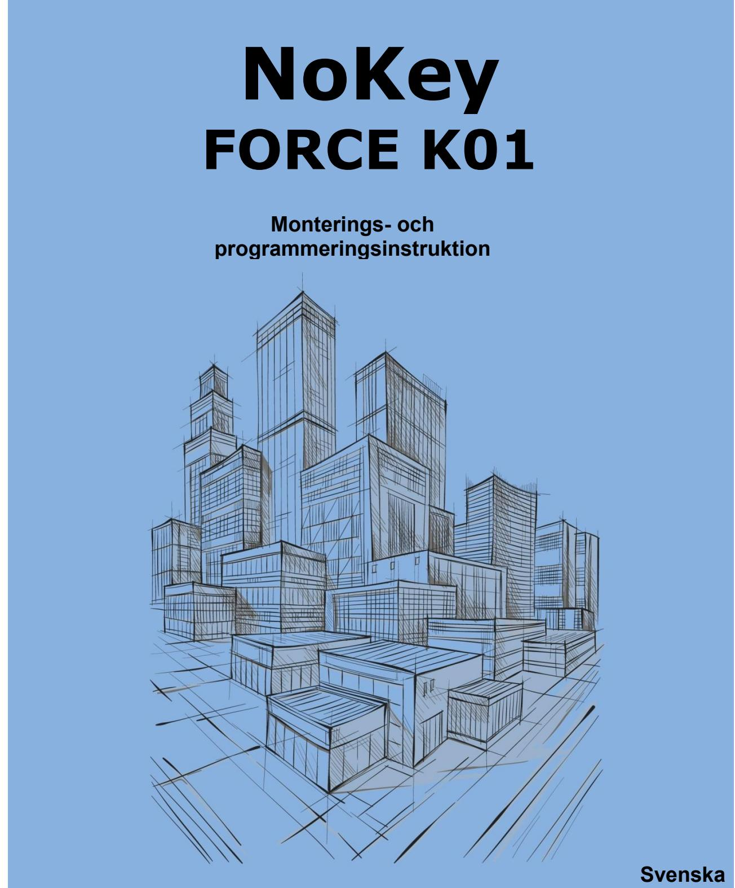

# **1 Innehåll**

| 1  | Innehåll 2                                                   |  |
|----|--------------------------------------------------------------|--|
| 2  | Säkerhet och miljö4                                          |  |
| 3  | Allmänt 5                                                    |  |
| 4  | Handhavande 5                                                |  |
| 5  | Kontrollera låskistans placering samt anpassa fyrkantpinnens |  |
|    | längd 6                                                      |  |
| 6  | Justering av tryckeshålet och/eller urtaget för låskistan 8  |  |
| 7  | Anpassning för vänsterhängd dörr 9                           |  |
| 8  | Montering av den yttre och inre enheten 10                   |  |
| 9  | Programmering 16                                             |  |
| 10 | Detaljerad programmeringsanvisning 17                        |  |

### **Copyright**

©RCO AB 2014. Denna manual får inte reproduceras vare sig helt eller delvis i någon form utan skriftligt medgivande från copyrightägaren.

## **Disclaimer/Ansvar**

RCO förbehåller sig rätten att när som helst, utan föregående meddelande, ändra specifikationerna för produkterna som beskrivs i denna manual.

RCO kan inte hållas ansvarigt för eventuella skador som har uppkommit till följd av användningen av denna produkt.

Alla rimliga åtgärder har vidtagits för att säkerställa att informationen i denna manual är exakt och så fullständig som möjligt. Skulle du mot förmodan upptäcka fel eller brister är vi tacksamma om du påtalar felaktigheterna till RCO. Se kontaktuppgifter nedan.

### **Kontaktuppgifter**

RCO Security AB Box 705 176 27 Järfälla info@rco.se Växel: 08-546 560 00 Support: 08-546 560 50

## **2 Säkerhet och miljö**

I följande avsnitt finns säkerhets- och miljörelaterade uppmaningar

## **Säkerhetsbestämmelser**

Endast Alkaliska batterier av god kvalitet får användas. Med andra typer av batterier skulle fara kunna uppstå.

Förutsatt att produkten monteras enligt monteringsinstruktionen behöver inga särskilda säkerhetshänsyn vidtas.

### **CE-märkning**

Produkten uppfyller alla ställda produktsäkerhetskrav och är CE-märkt. CE-märken sitter på respektive enhets baksida.

### **Märkskylt**

Märkskylten återfinns på insidan av enhetens batterilucka. **Miljö**  Miljödeklaration finns att hämta på www.rco.se. **Byggvarudeklaration**  Byggvarudeklaration finns att hämta på www.rco.se. **Batterier**  Om låset är utrustat med batterier gäller följande:

Batterier måste lämnas till separat insamling.

Alla batterier, oavsett om de är försedda med återvinningssymbol eller inte, måste sopsorteras och lämnas in för återvinning.

Mer information lämnas av de lokala myndigheterna som ansvarar för avfallshanteringen.

## **Batterispecifikationer**

**Typ Position** 5st LR6 AA Alkaline batterier Batteriluckan 1st 9V Alkaline batteri Nödmatning via utsidan av dörren.

## **RoHS/WEEE**

Produkten uppfyller gällande regler enligt RoHS/WEEE samt REACH.

## **Återvinning**

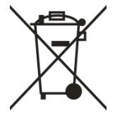

Produkten är märkt med den överkryssade soptunnan och kan lämnas till RCO för återvinning eller lämnas till återvinning enligt lokala föreskrifter.

# **3 Allmänt**

NoKey är ett batteridrivet (5st alkaliska storlek AA) kodlås som på ett enkelt sätt kompletterar existerande låskistor och trycken med möjligheten att styra tillträdet via koder.

Exempel på låskistor där NoKey kan monteras är ASSA modullås 565, 8561m.fl.

Tänk också på att säkerställa en möjlighet att låsa upp på mekanisk väg på de dörrar där elektrisk låsning används.

# **4 Handhavande**

För att låsa upp och möjliggöra passage, ange en inprogrammerad kod. När en giltig kod matats in hörs ett distinkt klickljud, grön lysdiod tänds (och om så aktiverats, ett kort pipljud) och dörren kan öppnas genom att trycka ned handtaget.

Från insidan öppnar man genom att trycka ned handtaget på normalt sätt. Se vidare programmeringsanvisningen i slutet av detta dokument.

# **5 Kontrollera låskistans placering samt anpassa fyrkantpinnens längd**

Detta kapitel säkerställer att en god mekanisk funktion kommer att erhållas.

- **5.1** Sätt i fyrkantpinnen med den rundade änden in mot låskistan. **5.2** Sätt dit den bifogade tolken. Kontrollera att fyrkantpinnen löper lätt genom tolken och låskistan. Om så inte är fallet måste tryckeshålet justeras, se kapitel 6. Annars gå vidare med nästa steg. **5.3** Tryck in fyrkantpinnen mot låskistan. Ritsa ett märke på fyrkantpinnen i nivå med tolken. **OBS!** Om dörrbladet är 39mm eller tunnare måste en distansplatta (monteras på baksidan av inre enheten) beställas. Om en distansplatta behöver användas ska den hållas mot dörrbladet när tolken placeras och längden på
fyrkantpinnen definieras.

# **NoKey Force K01** Kontrollera låskistans placering samt anpassa fyrkantpinnens längd

- **5.4** Kapa fyrkantpinnen till korrekt längd enligt ritsen. Var noga med att snittet blir vinkelrätt, grada av snittytan med lämpligt verktyg.
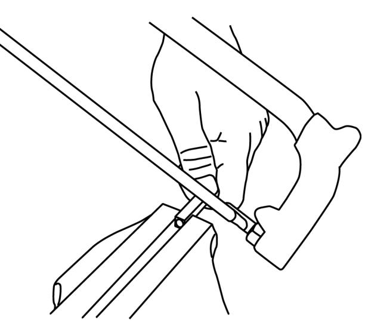

- **5.5** Efter kapning, kontrollera med tolken på nytt, fyrkantpinnens ände ska ligga mellan det inre och yttre planet i tolken. Om fyrkantpinnens ände sticker utanför tolkens yttre plan kommer låset att kärva.
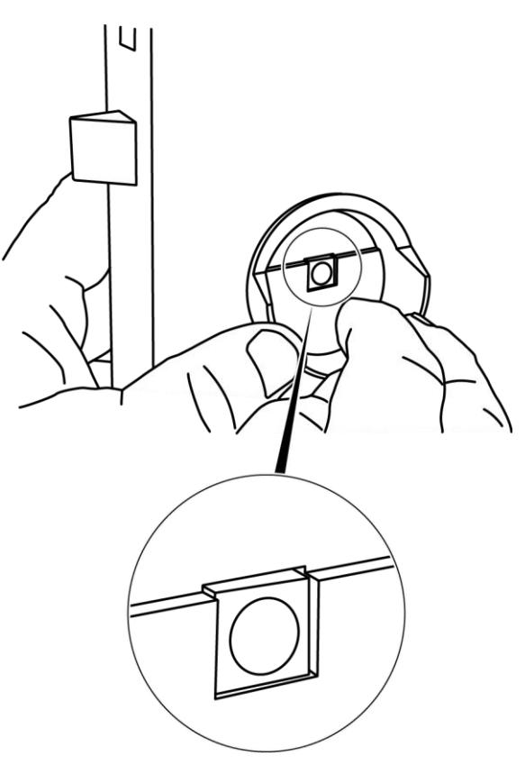

# **6 Justering av tryckeshålet och/eller urtaget för låskistan**

Om tolken inte går i tryckeshålet, eller om utrymmet för kabeln inte räcker till måste nödvändiga justeringar göras.

- **6.1** Lossa och tag ut låskistan. Spara skruvarna för senare återmontering. **6.2** Fila upp hålet så att kablaget får plats och tolken ryms utan att spänna. Montera därefter tillbaka låskistan.

# **7 Anpassning för vänsterhängd dörr**

Låset levereras för högerhängd dörr, gör enligt följande för att anpassa för vänsterhängd dörr:

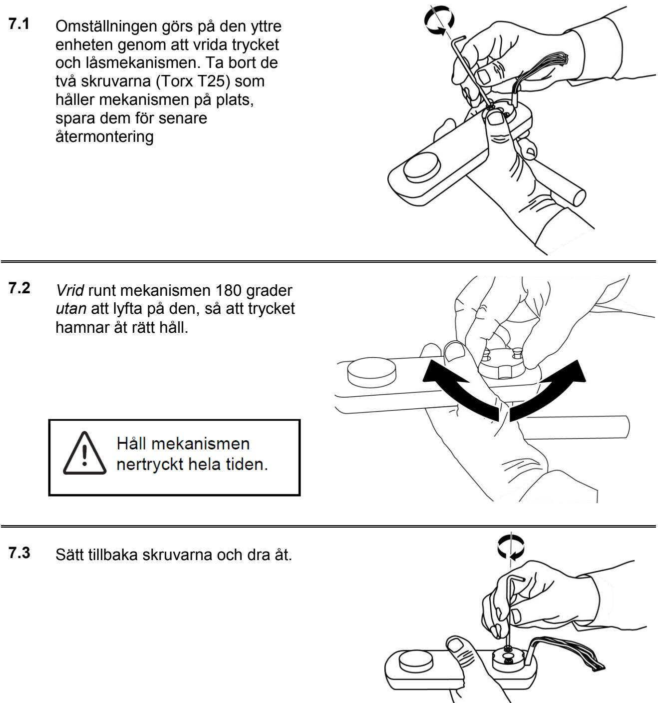

# **8 Montering av den yttre och inre enheten**

Här beskrivs montering av yttre enhet utan låscylinder ihop med inre enhet utan vred.

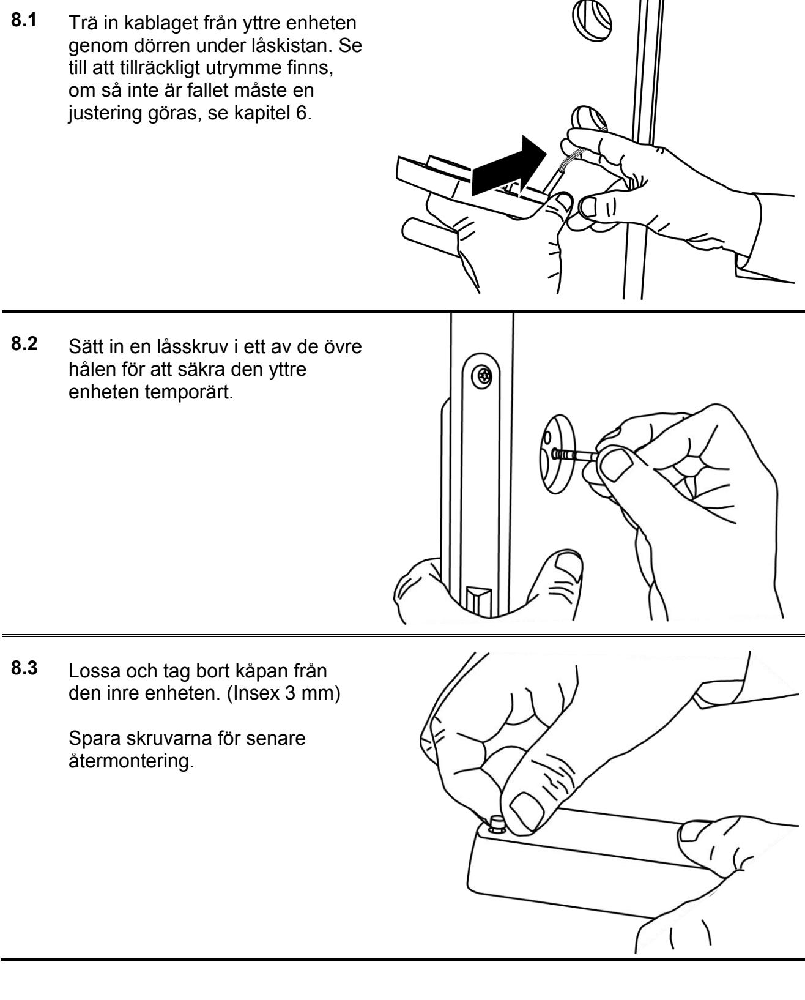

## **NoKey Force K01** Montering av den yttre och inre enheten

- **8.4** Om dörren är tunnare än 39mm krävs en distansplatta bakom inre enheten. Distansplattan skruvas fast på inre enhetens baksida med den bifogade skruven. (Torx T15)
Distansplattan beställs separat.

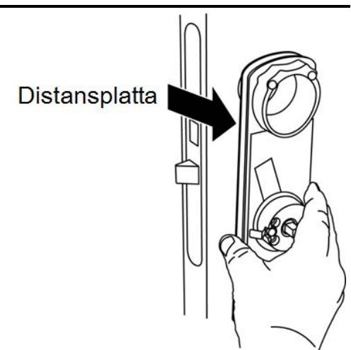

- **8.5** Sätt i fyrkantpinnen i den inre enheten, med den rundade änden utåt.
Välj rätt sexkantpinne och sätt in den genom fyrkantpinnen, vrid den fram och tillbaka ett par gånger och säkerställ att den greppar i mekanismen.

| Dörrtjocklek     | Längd sex kantpinne |
|------------------|---------------------------|
| 38 – 58 mm | 80 mm                     |
| 58 – 81 mm | 100 mm                    |
| 81 – 110 mm   | 130 mm                    |

130 mm sexkantpinne beställes separat.

- **8.6** För igenom kabeln med sin kontakt genom det avlånga hålet nere till vänster i inre enheten. Säkerställ att kabeln löper fritt och inte kommer i kläm då enheterna senare skruvas fast.
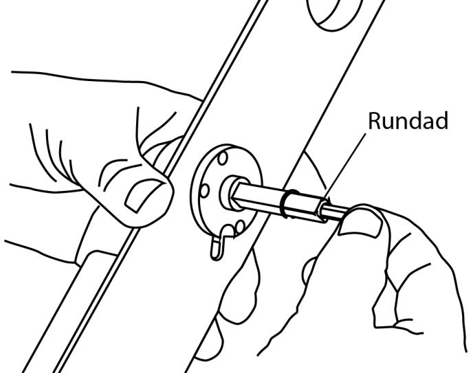

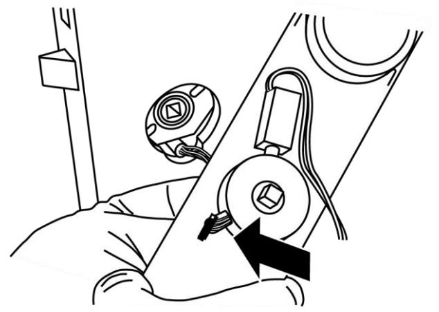

## **NoKey Force K01** Montering av den yttre och inre enheten

- **8.7** Passa in enheten med sexkantpinnen och fyrkantpinnen mot låskistan och den yttre enheten.
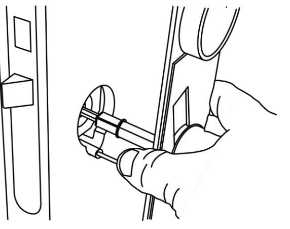

- **8.8** Kapa undre låsskruvarna enligt följande:
Min = dörrtjocklek + 18 mm Max = dörrtjocklek + 26 mm

Var försiktig så inte gängorna skadas. Grada av snittytan med ett lämpligt verktyg.

- **8.9** Montera de undre kapade låsskruvarna, men dra *inte* åt dem ordentligt ännu.
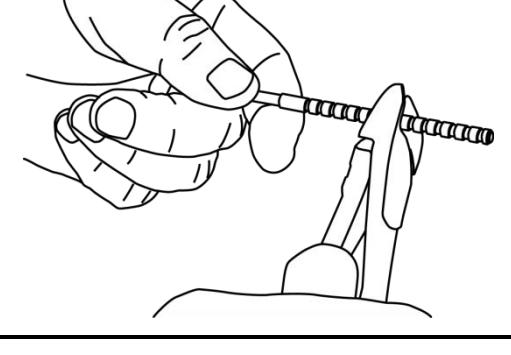

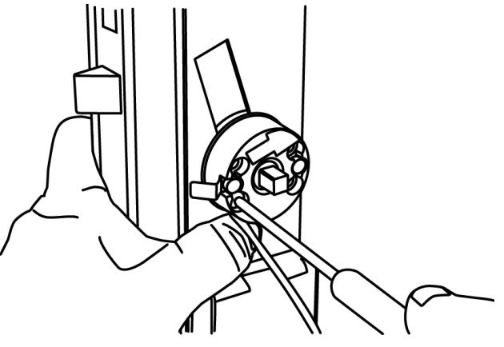

- **8.10** Ta bort den temporärt monterade övre skruven.
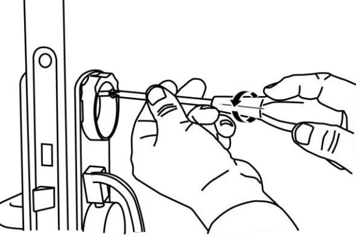

- **8.11** Kapa övre låsskruvarna enligt följande: Min = dörrtjocklek + 6 mm Max = dörrtjocklek + 11 mm Var försiktig så inte gängorna skadas. Grada av snittytan med ett lämpligt verktyg. Sätt in spännbrickan och de kapade övre låsskruvarna. **8.12** Dra åt de övre och undre låsskruvarna ordentligt. **8.13** Ta bort transportsäkringen genom att dra den rakt ut från mekaniken, inte i sidled

- **8.14** Kontrollera tryckesfunktionen från utsidan. Låset är alltid olåst tills driftsättning skett. Om någonting kärvar kan orsaken vara:
	- Låset eller fyrkantpinnen har inte tillräckligt med frigång mot dörren eller låskistan. Kontrollera enligt kapitel 6
	- Fyrkantpinnen för lång
	- Fel sexkantpinne
	- Dörrens ut- och insidor är inte planparallella
	- Defekt låskista
- **8.15** Montera kontakten i kretskortet.

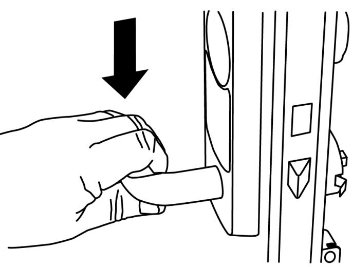

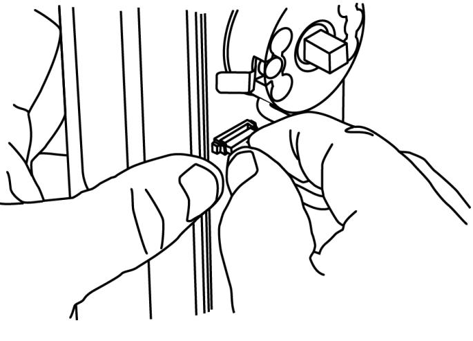

- **8.16** Vik kabeln dubbel och placera den under avlastningshållaren.
Sätt in batterierna (5st AA) i batterihållaren.

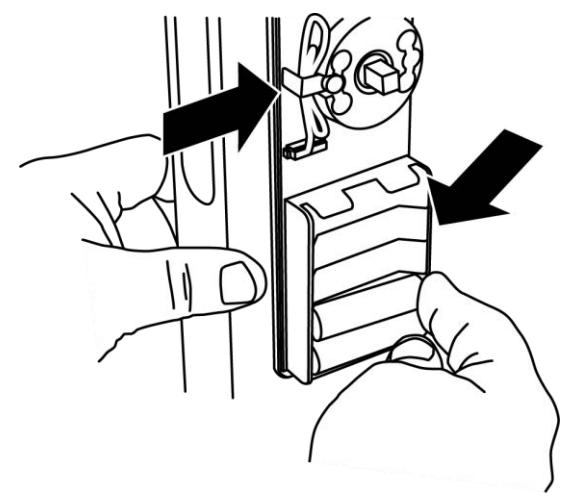

## **NoKey Force K01** Montering av den yttre och inre enheten

- **8.17** Montera tillbaka kåpan på den inre enheten, se till att passa in trycket mot fyrkantspinnen.
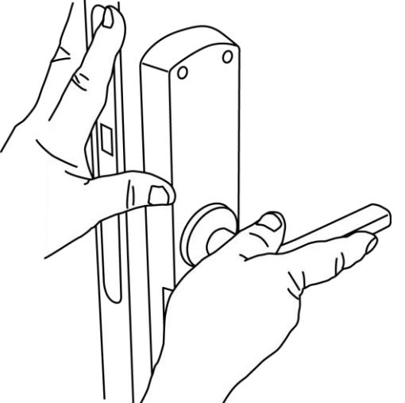

- **8.18** Skruva tillbaka kåpans fyra skruvar. (Insex 3 mm)
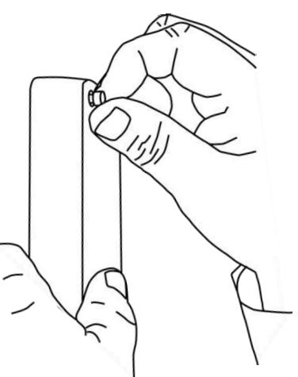

- **8.19** Sätt tillbaka batterilocket och dra åt dess skruv på undersidan. (Insex 2,5 mm)
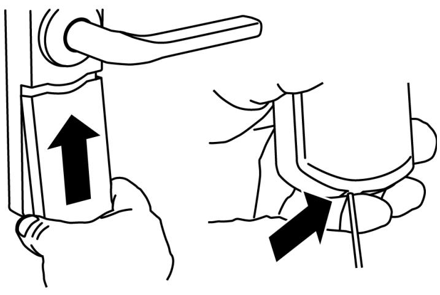

## **9 Programmering**

## **9.1 Allmänt**

För att kunna utföra någon programmering måste enheten ställas i "programmeringsläge". Detta görs genom att knappa in "systemkoden". Som default är "systemkoden" 1234, men det är en stark rekommendation att byta till en egendefinierad systemkod i samband med driftsättning av enheten, se avsnitt "Byte av känd systemkod". Efter att ha angivit "systemkoden" väljer man olika undermenyer beroende på vad som skall programmeras, t.ex. programmera in koder eller andra funktioner. För en sammanställning av menyvalen, se tabell sist i detta dokument.

98 st. minnespositioner, numrerade från 1 till 98, finns tillgängliga för koder. Följaktligen kan 98 olika koder programmeras att fungera parallellt. Det är mycket viktigt att dokumentera respektive minnesposition för koderna som stöd och underlag för framtida programmering, t.ex. ändring av koderna.

Koder kan bestå av tre till sex siffror. Notera också att om en kod ska "ändras" kan den nya koden programmeras "över" den existerande på samma minnesposition utan att radera gamla koden först.

Enhetens lysdiod används som hjälp vid programmering för att visa i vilket steg i programmeringen man befinner sig. Följande symboler används för att beskriva hur lysdioden indikerar vid de olika tillfällena.

| Släckt | Blinkar "normalt" | Blinkar "snabbt" | Lyser fast |
|--------|-------------------|------------------|------------|
| ◌      |                  |                 |           |

### **9.2 Snabbguide**

För att snabbt komma igång visas här hur du programmerar in en kod på minnesposition 1. Det är en stark rekommendation att läsa igenom varje punkt i manualen och sätta sig in i samtliga funktioner som kodlåset erbjuder.

| 1 | Tryck systemkoden, standard 1234                                         |  |
|---|--------------------------------------------------------------------------|---|
| 2 | Tryck 1 (menyval) sedan #                                                |  |
| 3 | Tryck 1 (minnesposition), igen, sedan #.                                 |  |
| 4 | Ange önskad kod, tre till sex siffror. Avsluta med #, ett pip bekräftar. |  |
| 5 | Tryck 0, sedan #.                                                        |  |
| 6 | Tryck 0, sedan # igen                                                    | ◌ |
| 7 | Kontrollera att koden låser upp, och att dörren kan öppnas               |   |

# **10 Detaljerad programmeringsanvisning**

## **10.1 Programmering av koder**

| 1 | Ställ enheten i programmeringsläge genom att ange "systemkoden"                                                                                                                                                                                                   |  |
|---|-------------------------------------------------------------------------------------------------------------------------------------------------------------------------------------------------------------------------------------------------------------------|---|
| 2 | Tryck 1 (menyval) sedan #                                                                                                                                                                                                                                         |  |
| 3 | Ange minnesposition 1 (eller annan lämplig, 1-98). Observera att det är mycket viktigt att dokumentera vilka minnespositioner som utnyttjas för att kunna säkerställa en korrekt hantering (byte eller radering) av inprogrammerade koder. Avsluta med # |  |
| 4 | Ange önskad kod, tre till sex siffror. Avsluta med #, ett pip bekräftar                                                                                                                                                                                           |  |
| 5 | Om fler koder ska programmeras, börja om ifrån punkt 3 ovan, annars tryck 0 följt av # för att lämna menyval 1, för att avsluta programmeringen helt tryck igen 0 och därefter #, alternativt välj en ny siffra motsvarande önskat menyval och sedan #   |  |

### **10.2 Byte av kod**

| 1 | Ställ enheten i programmeringsläge genom att ange "systemkoden"                                                                                                                                                                                              |  |
|---|--------------------------------------------------------------------------------------------------------------------------------------------------------------------------------------------------------------------------------------------------------------|---|
| 2 | Tryck 1 (menyval) sedan #                                                                                                                                                                                                                                    |  |
| 3 | Ange numret på den minnesposition där koden som ska bytas finns. Avsluta med #                                                                                                                                                                         |  |
| 4 | Ange den nya koden, tre till sex siffror. Avsluta med #                                                                                                                                                                                                   |  |
| 5 | Om fler koder ska ändras, börja om ifrån punkt 3 ovan, annars tryck 0 följt av # för att lämna menyval 1, för att avsluta programmeringen helt tryck igen 0 och därefter #, alternativt välj en ny siffra motsvarande önskat menyval och sedan # |  |

### **10.3 Radera kod**

| 1 | Ställ enheten i programmeringsläge genom att ange "systemkoden"                                                                                                                                                                                                |  |
|---|----------------------------------------------------------------------------------------------------------------------------------------------------------------------------------------------------------------------------------------------------------------|---|
| 2 | Tryck 4 (menyval) sedan #                                                                                                                                                                                                                                   |  |
| 3 | Ange numret för den minnesposition (1-98) där koden som ska raderas är programmerad. Om minnesposition 99 anges raderas koden för aktivering/deaktivering av nollöppning. Avsluta med #, enheten piper en gång för att bekräfta att radering skett |  |
| 4 | Avsluta med 0 följt av # för att avsluta programmeringen helt                                                                                                                                                                                               | ◌ |

### **10.4 Ljud vid låsöppning**

Notera att aktivering av ljud påverkar batteriernas livslängd negativt. Ej aktiverat som standard.

| 1 | Ställ enheten i programmeringsläge genom att ange "systemkoden"                                                                             |  |
|---|---------------------------------------------------------------------------------------------------------------------------------------------|---|
| 2 | Tryck 5 (menyval) sedan #                                                                                                                |  |
| 3 | Tryck 1 (undermeny) och därefter #.                                                                                                         |  |
| 4 | Tryck 1 om ljud ska aktiveras, alternativt 0 för att avaktivera. Avsluta med #, enheten piper en gång för att bekräfta att ändring skett |  |
| 5 | Avsluta med 0 följt av # för att avsluta programmeringen helt                                                                               | ◌ |

## **10.5 Låsöppningstid**

Låsöppningstiden kan ställas mellan 1 och 9 sekunder eller värdet 30 sekunder. Defaulttiden är 3 sekunder.

| 1 | Ställ enheten i programmeringsläge genom att ange "systemkoden"                                 |  |
|---|-------------------------------------------------------------------------------------------------|---|
| 2 | Tryck 6 (menyval) sedan #                                                                    |  |
| 3 | Ange önskad öppningstid i sekunder (1 – 9) eller 0 för att erhålla 30 sek. Avsluta med #. |  |
| 4 | Avsluta med 0 följt av # för att avsluta programmeringen helt                                | ◌ |

## **10.6 Ljud vid låg batterinivå**

Detta ger tre korta tonstötar i samband med öppning då batterinivån blivit för låg. Notera att aktivering av ljud påverkar batteriernas livslängd negativt. Aktiverat som standard.

| 1 | Ställ enheten i programmeringsläge genom att ange "systemkoden"                                                                             |  |
|---|---------------------------------------------------------------------------------------------------------------------------------------------|---|
| 2 | Tryck 5 (menyval) sedan #                                                                                                                |  |
| 3 | Tryck 2 (undermeny) och därefter #.                                                                                                      |  |
| 4 | Tryck 1 om ljud ska aktiveras, alternativt 0 för att avaktivera. Avsluta med #, enheten piper en gång för att bekräfta att ändring skett |  |
| 5 | Avsluta med 0 följt av # för att avsluta programmeringen helt                                                                               | ◌ |

### **10.7 Byte av känd systemkod**

Observera att systemkoden inte kan vara lika som någon av koderna. Om systemkoden har fler siffror än en kod, men använder samma inledande siffror måste de överskjutande siffrorna anges inom 2 sekunder efter kodens sista siffra. Exempel: Om systemkoden är 123789 och en kod 1237 måste 8:an och 9:an anges inom 2 sekunder efter 7:an för att programmeringsläget ska aktiveras..

| 1 | Ställ enheten i programmeringsläge genom att ange "systemkoden"                                                                           |  |
|---|-------------------------------------------------------------------------------------------------------------------------------------------|---|
| 2 | Tryck 2 (menyval) sedan #                                                                                                              |  |
| 3 | Knappa in önskad systemkod bestående av minst 3, max 6 siffror. Avslutamed #, enheten piper en gång för att bekräfta att ändring skett |  |
| 4 | Avsluta med 0 följt av # för att avsluta programmeringen helt. Glöm inte att notera nya systemkoden!!                                  | ◌ |

## **10.8 Programmering av kod för aktivering av nollöppning**

Genom att programmera en kod för aktivering av nollöppning, och därefter aktivera funktionen, kan låsöppning göras genom att endast trycka en gång på 0:ans tangent istället för att ange en kod på vanligt sätt. Notera att koden för aktivering och deaktivering av nollöppning i sig inte fungerar för att låsa upp.

| 1 | Ställ enheten i programmeringsläge genom att ange "systemkoden"                                                                                            |  |
|---|------------------------------------------------------------------------------------------------------------------------------------------------------------|---|
| 2 | Tryck 3 (menyval) sedan #                                                                                                                               |  |
| 3 | Knappa in önskad kod. Koden kan innehålla minst 3 siffror och max 6 siffror. Avsluta med #, enheten piper en gång för att bekräfta att ändring skett |  |
| 4 | Avsluta med 0 följt av # för att avsluta programmeringen helt                                                                                              | ◌ |

### **10.9 Aktivering av nollöppning**

| 1 | Ange koden för aktivering av nollöppning följt av * |
|---|--------------------------------------------------------|
| 2 | Låset ska nu kunna öppnas genom att trycka på 0        |

### **10.10 Avaktivering av nollöppning**

| 1 | Ange koden för aktivering av nollöppning följt av #         |
|---|-------------------------------------------------------------|
| 2 | Låset ska nu inte längre kunna öppnas genom att trycka på 0 |

## **10.11 Inslagsbegränsning**

Denna funktion försvårar för en obehörig att kunna prova sig fram till en giltig kod. Om funktionen aktiveras (default AV) spärras enhetens tangentbord under en tid efter att en serie av felaktiga koder angivits.

| 1 | Ställ enheten i programmeringsläge genom att ange "systemkoden"                                                                                                              |        |
|---|------------------------------------------------------------------------------------------------------------------------------------------------------------------------------|--------|
| 2 | Tryck 5 (menyval) sedan #                                                                                                                                                 |   |
| 3 | Tryck 4 (undermeny) och sedan 1 för att aktivera funktionen, alternativt 0 för att avaktivera. Avsluta med #, enheten piper en gång för att bekräfta att ändring skett |       |
| 4 | Avsluta med 0 följt av # för att avsluta programmeringen helt                                                                                                                | ◌      |

### **10.12 Fabriksåterställning då systemkoden är känd**

Detta förfarande raderar samtliga inprogrammerade koder och återställer fabriksinställningar enligt nedan. Det är en stark rekommendation att snarast möjligt programmera in en egendefinierad systemkod som ersätter den fabriksinställda, se avsnitt "Byte av känd systemkod".

| 1 | Ställ enheten i programmeringsläge genom att ange "systemkoden"                                                     |  |
|---|---------------------------------------------------------------------------------------------------------------------|---|
| 2 | Tryck 9 (menyval) sedan #                                                                                        |  |
| 3 | Tryck 1 för att bekräfta radering. Avsluta med #, enheten piper en gång för att bekräfta att återställning skett |  |
|   |                                                                                                                     |   |

## **10.13 Fabriksåterställning då systemkoden inte är känd**

Om systemkoden förkommit är denna återställning enda möjligheten att programmera om enheten samt fortsätta driften av kodlåset. Detta förfarande raderar samtliga inprogrammerade koder och återställer enhetens fabriksinställningar, däribland systemkod 1234. Det är en stark rekommendation att snarast möjligt programmera in en egendefinierad systemkod som ersätter den fabriksinställda, se avsnitt "Byte av känd systemkod".

| 1 | Lossa enhetens batterilucka och ta ut ett av batterierna                                                                                                                             |   |
|---|--------------------------------------------------------------------------------------------------------------------------------------------------------------------------------------|---|
| 2 | Håll in 0:ans tangent och sätt tillbaka batteriet, fortsätt att hålla tangenten intryckt (ca 5 sek) tills gröna lysdioden börjar blinka snabbt, släpp då tangenten |  |
| 3 | Tryck 1 och sedan #, ett pip bekräftar att enheten återställts                                                                                                                       |  |

### **10.14 Fabriksinställningar**

| Systemkod               | 1234   |
|-------------------------|--------|
| Batterivarning med ljud | På     |
| Låsöppningstid          | 3 sek. |
| Ljud vid låsöppning     | Av     |
| Inslagsbegränsning      | Av     |
| Kod för nollöppning     | Ingen  |

