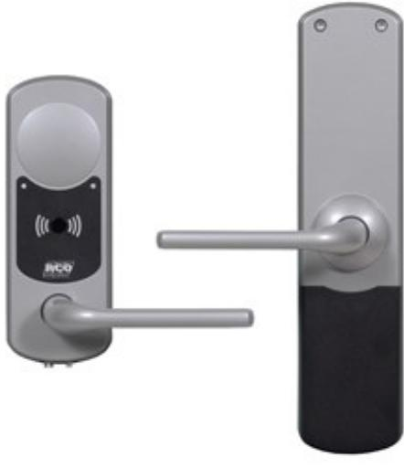

## NOKEY MIF-808 T01

Artikelnummer: 20180015, E-nummer: 5870433

NoKey MIF offline T01 är en dörrbladsläsare utan knappsats. NoKey offline är en serie läsare med den stora fördelen att de inte gör någon åverkan på dörren vid installation eller kräver någon kabeldragning överhuvudtaget. Med andra ord blir installationen både smidig och kostnadseffektiv. Läsaren passar till dörrar med modul / Connect lås.

I ett offline-system är det korten eller taggarna som via en online läsare överför behörigheter till offline-läsarna. Från offline-läsarna överförs på samma sätt händelselogg på vilka dörrar användaren passerat samt batterivarning tillbaka till systemet via en onlineläsare.

Eftersom all inkoppling och mekanik finns på insidan av dörren försvåras manipulation och sabotage väsentligt, vilket innebär högre säkerhet jämfört med produkter där allt finns på utsidan. Öppning med handtag från insidan påverkar låset helt mekaniskt, vilket gör att det alltid går att ta sig ut.

RCO:s online-läsare (Mifare) av nyare modell fungerar som initieringsläsare för NoKey offline, alltså behövs inga separata läsare för detta ändamål. All programmering sköts dessutom från mjukvaran R-CARD M5.

Batterier ingår ej.

*Viktigt: NoKey-läsarens två delar (inre och yttre) är av säkerhetsskäl låsta mot varandra på elektronisk väg: Systemet kan inte fungera med två enheter som inte hör ihop.*

| Utförande:                                 | Silvermetallic                                    |
|--------------------------------------------|---------------------------------------------------|
| Material:                                  | Zink (nickelfria och antibakteriella handtag)     |
| Matningsspänning:                          | 5 st Alkaline AA LR6-batterier (ingår ej)         |
| Livslängd batterier:                       | Upp till 3 år vid normal användning               |
| Alternativ strömförsörjning:               | 9-volts batteri (6LR6) för reservkraft på utsidan |
| Temperaturområde insida:                   | +5 till +40 °C                                    |
| Temperaturområde utsida:                   | -25 till +55 °C                                   |
| Mått (BxHxD):                              | 67x181x17 mm                                      |
| Mått inre enhet (BxHxD):                   | 68x290x25 mm                                      |
| Vikt:                                      | 1,16 kg                                           |
| Vikt inre enhet:                           | 1,45 kg                                           |
| Dörrblad standard (max/min tjocklek):      | 38-80 mm                                          |
| Dörrblad med tillbehör (max/min tjocklek): | 38-110 mm                                         |
| Läsavstånd:                                | Ca 1-2 cm beroende på transponder                 |
| Sändarfrekvens:                            | 13,56 MHz                                         |
| Lästekniker:                               | Desfire EV2 RCO app, Mifare Classic               |
| Standard:                                  | ISO/IEC 14443 Type A                              |