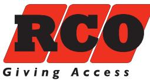
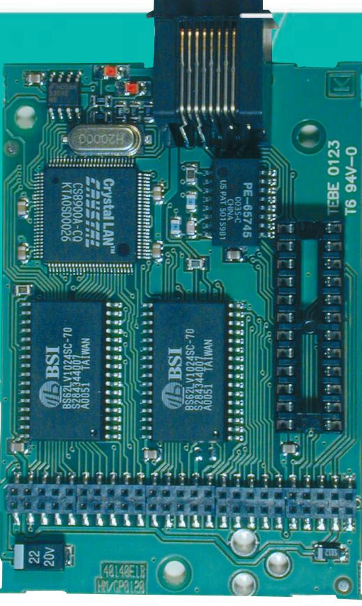
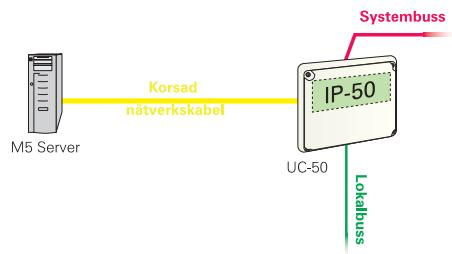
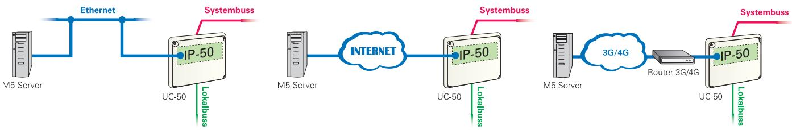
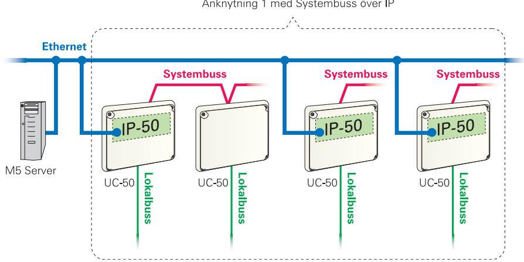

# **IP-50**

# **NÄTVERKSMODUL**

#### **ANSLUTNING AV UNDERCENTRAL MED IP ÖVER NÄTVERK**

R-CARD M5 Server installeras allt oftare på nätverk som utbreder sig lokalt eller mellan verksamhetens olika arbetsplatser med skilda geografiska placeringar. Anknytning för TCP/IP förutsätter att UC-50 med IP-50 och R-CARD M5 Server har kommunikationsmöjlighet mellan varandra.

IP-50 monteras på UC-50 och gör att undercentralen kan kommunicera via nätverk med TCP/IP-protokoll över ett lokalt nätverk (10 Mbit/s Ethernet). IP-50 modulen kan användas för att skapa en anknytning eller för att skapa systembus över IP. IP-50 stödjer fast IP adress, DHCP och MAC adressering.

En IP Anknytning ger möjlighet att nå avlägsna anläggningsdelar och att nyttja befintlig infrastruktur för kommunikation.

IP-50: Artikel nr 20 140 41. E. nr 58 753 37.

Läs mer på nästa sida.

#### **TEKNISK DATA**

| Matningsspänning:      | 10-30V DC 8-24V AC                              |
|------------------------|----------------------------------------------------|
| Strömförbrukning @27V: | Tomgång 30mA 1-pol relä 4mA inkl. IP-50 53mA |
| Brytström @24VDC:      | 1-pol relä 1A                                      |
| Nätverksanslutning:    | 10 Mbit/halfduplex                                 |
| Temperaturområde:      | +5ºC till +60ºC                                    |
| Mått (mm) BxHxD:       | 200x180x50                                         |
| Vikt:                  | 0,05 kg                                            |
| Övrigt:                | Godkänd enligt SSF 1014 Larmklass 4.            |
|                        | Miljöklass 1                                       |

#### **ANKNYTNING KORSAD NÄTVERKSKABEL ANSLUTNING AV UC-50 VIA KORSAD NÄTVERKSKABEL TILL R-CARD M5 SERVER**

Vid lokala installationer kan du med fördel använda en IP-50 modul och en korsad nätverkskabel som anknytning mellan R-CARD M5 och anläggningen. Fördelen är att i princip alla datorer har ett inbyggt nätverkskort samt att du vid behov kan ansluta anläggningen i ett nätverk. För inläsning av taggar kan du använda en USB bordsläsare.

## **ANKNYTNING MED IP-50**

#### **ANSLUTNING AV UC-50 MED IP-50 ÖVER NÄTVERK TILL R-CARD M5 SERVER**

IP Anknytning används genom att IP-50 monteras i UC-50. Anläggningsdelar kan då anslutas till R-CARD M5 Server via LAN, Intranet eller Internet. IP-50 använder fast IP-adress alternativt DHCP adress i kombination med dynamisk DNS tjänst. Om nätleverantören inte erbjuder dynamisk DNS tjänst finns möjlighet att låta undercentralen istället göra sin IP-adress känd för R-CARD M5 servern via sk. MAC-adressering. En sådan lösning förutsätter att eventuell brandvägg på R-CARD M5 serversidan tillåter kommunikation över vald port. Som standard används UDP port 1000. IP Anknytningen tar som mest 200 Kbit/s och normalt 20 Kbit/s av nätverkskapaciteten. Kommunikationen är krypterad. Saknas möjlighet till fast anslutning kan UC-50 med IP-50 anslutas mot 3G/4G router med abonnemang för datakommunikation

#### **EN ANKNYTNING MED FLER IP-50 (SYSTEMBUSS ÖVER IP) ANSLUTNING AV FLER IP-ANSLUTNA UC-50 PÅ SAMMA IP-ANKNYTNING**

Systembus över IP möjliggör en anknytning med flera UC-50 med IP-50 på samma anknytning. Detta innebär att du kan fjärrboka mellan bokningpaneler som är anslutna på olika UC-50 med IP-50 eller UC-50 som ligger anslutna under dessa via systembuss. Du kan bygga en MEGA larmanläggning eller larmområden som sträcker sig över flera UC-50 med IP-50. Beakta att vid realisering av systembuss över IP skapas ett beroende av nätverket vilket innebär driftstörningar på anläggningen då nätverket inte fungerar. Tänk även på att säkerställa strömförsörjning av de aktiva nätverkskomponenterna.

Systembuss över IP kan ansluta max 16 UC-50 med IP-50, samt max 16 UC-50 kopplade under dessa på systembussen som en anknytning. Maximalt antal dörrmiljöer per anknytning är dock alltid 255. Kravet för systembuss över IP är att samtliga ingående UC-50 med IP-50 har kommunikationsmöjlighet alla till alla. Vid implementation av systembuss över IP adressernas samtliga ingående enheter som om dom vore anslutna på en anknytning. UC-50 på systembuss kan utökas med IP-50 och bygga upp ytterligare segment med systembuss över IP. Maximalt antal nivåer är 9 inklusive routingar.

### **ELEKTRONISKA LÅS FÖR HEM OCH FÖRETAG**