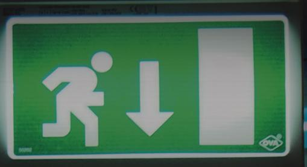

# Nödutrymningsbeslag enligt SS-EN 179:2008

för STEP 550 Motorlås.

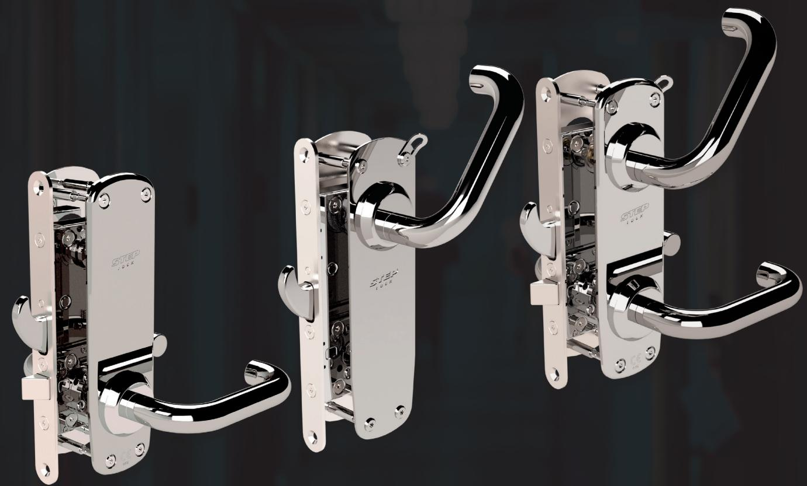

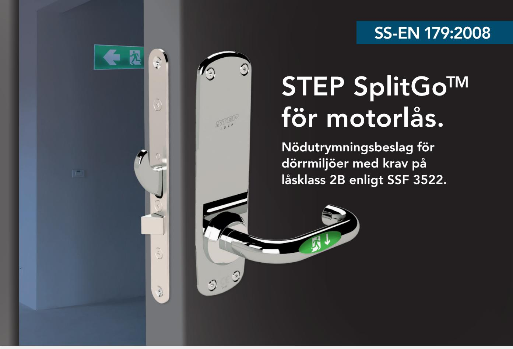

## Nödutrymningsbeslag med splitfunktion för slagdörrar i utrymningsvägar.

Splitfunktion SplitGo i kombination med FreeDrive® tekniken i STEP 550 Motorlås ger dig möjlighet till ett helt nytt sätt att använda motorlås. På så sätt kan dörren få en fantastisk användarvänlighet, utan att kompromissa med inbrottsskyddet.

Produkten är brandgodkänd tillsammans med STEP Motorlås. Uppfyller kraven för låsklass 2B enligt SSF 3522.

#### Stora fördelar med unik splitfunktion

- SplitGo-funktionen möjliggör användning av splithandtaget på tryckesroddar-placeringen, så att insidans trycke gör en helt mekanisk upplåsning av dörren, medan utsidans trycke endast påverkar låsets fallkolv.
- SplitGo-funktionen säkerställer att utrymningen inte kan blockas med utsidans trycke.

## Med unik FreeDrive®-teknik

FreeDrive®-tekniken frikopplar motorn i både låst och olåst läge, vilket gör att låset kan användas elektrisk och mekaniskt oberoende av varandra. Låset kan därför med fördel användas tillsammans med utrymningsbeslag.

#### Slimmad design med valbar ytfinish

STEP Exit serien är konstruerad i slimmad design. Det innebär valfri ytfinish i borstat eller blankpolerat rostfritt stål, samt att skylten och rosetten har en stilfullt designad och robust konstruktion. Beslaget får därmed en mycket stilren design.

De har även en grund konstruktion vilket gör att du kan montera STEP Exit i dörrar med A/B-mått ner till 20 mm utan att använda en distansplatta.

## STEP SplitGoTM Teknisk information

Utrymning och normal passage från insidan sker genom användande av det godkända utrymningstrycket som sitter på vanlig tryckesplacering. Spitfunktionen i behöret får insidans trycke att dra in både hakregel och fallkolv så att dörren kan öppnas. Yttre trycke används för att öppna dörren från utsida efter behörig upplåsning.

Motorlåset kan ställas in för återlåsning eller återinrymning.

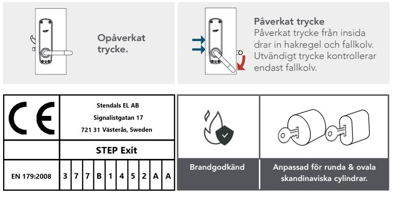

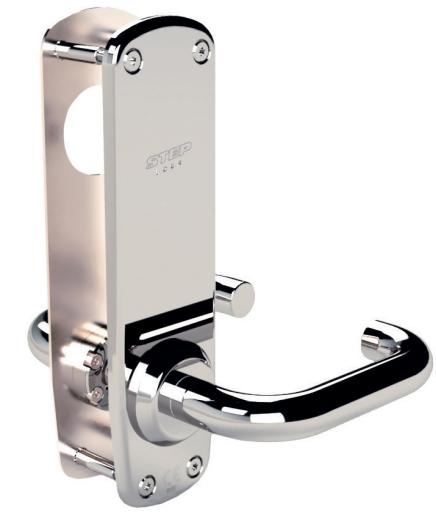

Behörets insida är endast försedd med ett tryckeshandtag. Välj mellan fyra olika typer av utsidor.

|  | Bildexempel art.nr ST17910-R-2 Tryckeshandtag och urtag för cylinder på utsidan. | Art.nr      | Benämning                                         |
|--|----------------------------------------------------------------------------------------|-------------|---------------------------------------------------|
|  |                                                                                        | ST17910-R-1 | STEP Exit i borstat rostfritt stål, höger.        |
|  |                                                                                        | ST17910-L-1 | STEP Exit i borstat rostfritt stål, vänster.      |
|  |                                                                                        | ST17910-R-2 | STEP Exit i blankpolerat rostfritt stål, höger.   |
|  |                                                                                        | ST17910-L-2 | STEP Exit i blankpolerat rostfritt stål, vänster. |
|  |                                                                                        |             |                                                   |
|  |                                                                                        | Art.nr      | Benämning                                         |
|  |                                                                                        | ST17911-R-1 | STEP Exit i borstat rostfritt stål, höger.        |
|  | Bildexempel art.nr ST17911-R-2 Tryckeshandtag på utsidan.                           | ST17911-L-1 | STEP Exit i borstat rostfritt stål, vänster.      |
|  |                                                                                        | ST17911-R-2 | STEP Exit i blankpolerat rostfritt stål, höger.   |
|  |                                                                                        | ST17911-L-2 | STEP Exit i blankpolerat rostfritt stål, vänster. |
|  |                                                                                        |             |                                                   |
|  | Bildexempel art.nr ST17912-R-2 Urtag för cylinder på utsidan.                       | Art.nr      | Benämning                                         |
|  |                                                                                        | ST17912-R-1 | STEP Exit i borstat rostfritt stål, höger.        |
|  |                                                                                        | ST17912-L-1 | STEP Exit i borstat rostfritt stål, vänster.      |
|  |                                                                                        | ST17912-R-2 | STEP Exit i blankpolerat rostfritt stål, höger.   |
|  |                                                                                        | ST17912-L-2 | STEP Exit i blankpolerat rostfritt stål, vänster. |
|  |                                                                                        |             |                                                   |
|  | Bildexempel art.nr ST17913-R-2 Slät på utsidan.                                     | Art.nr      | Benämning                                         |
|  |                                                                                        | ST17913-R-1 | STEP Exit i borstat rostfritt stål, höger.        |
|  |                                                                                        | ST17913-L-1 | STEP Exit i borstat rostfritt stål, vänster.      |
|  |                                                                                        | ST17913-R-2 | STEP Exit i blankpolerat rostfritt stål, höger.   |
|  |                                                                                        |             |                                                   |

## STEP Exit för motorlås Teknisk information

Utrymning sker från insida med engreppsöppning genom användande av det godkända utrymningstrycket på cylinderplacering.

Det undre trycket påverkar endast fallkolv. Motorlåset kan ställas in för återlåsning eller återinrymning.

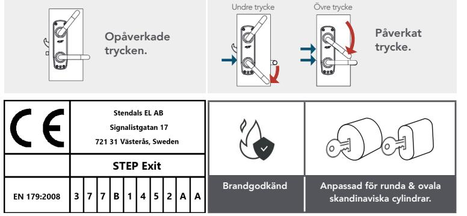

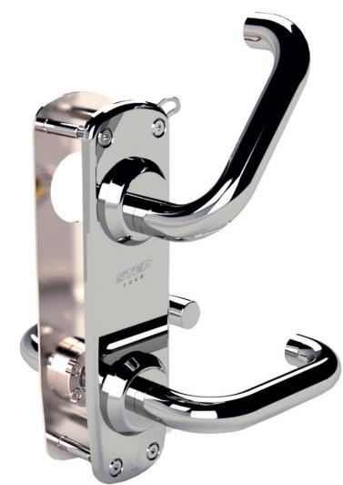

Behörets insida är försedd med ett tryckeshandtag och utrymningshandtag. Välj mellan fyra olika typer av utsidor.

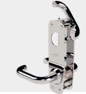

Bildexempel art.nr ST17920-R-2 Tryckeshandtag och urtag för cylinder på utsidan.

| 3 0 - 19 |
|-------------------|
| 27.04 11 14 |

| Bildexempel art.nr ST17921-R-2 |
|--------------------------------|
| Tryckeshandtag på utsidan.     |

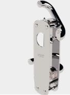

Bildexempel art.nr ST17922-R-2 Urtag för cylinder på utsidan.

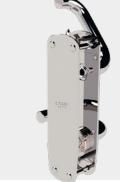

|                                                    | Art.nr | Benämning |
|----------------------------------------------------|--------|-----------|
|                                                    |        |           |
| Bildexempel art.nr ST17923-R-2 Slät på utsidan. |        |           |
|                                                    |        |           |

| ST17922-L-2 | STEP Exit i blankpolerat rostfritt stål, vänster. |
|-------------|---------------------------------------------------|
|             |                                                   |
| Art.nr      | Benämning                                         |
| ST17923-R-1 | STEP Exit i borstat rostfritt stål, höger.        |
| ST17923-L-1 | STEP Exit i borstat rostfritt stål, vänster.      |
| ST17923-R-2 | STEP Exit i blankpolerat rostfritt stål, höger.   |

ST17923-L-2 STEP Exit i blankpolerat rostfritt stål, vänster.

ST17921-R-1 STEP Exit i borstat rostfritt stål, höger. ST17921-L-1 STEP Exit i borstat rostfritt stål, vänster. ST17921-R-2 STEP Exit i blankpolerat rostfritt stål, höger. ST17921-L-2 STEP Exit i blankpolerat rostfritt stål, vänster.

ST17922-R-1 STEP Exit i borstat rostfritt stål, höger. ST17922-L-1 STEP Exit i borstat rostfritt stål, vänster. ST17922-R-2 STEP Exit i blankpolerat rostfritt stål, höger.

ST17920-R-1 STEP Exit i borstat rostfritt stål, höger. ST17920-L-1 STEP Exit i borstat rostfritt stål, vänster. ST17920-R-2 STEP Exit i blankpolerat rostfritt stål, höger. ST17920-L-2 STEP Exit i blankpolerat rostfritt stål, vänster.

Art.nr Benämning

Art.nr Benämning

Art.nr Benämning

# STEP Exit för motorlås Teknisk information

Utrymning sker från insida med engreppsöppning genom användande av det godkända utrymningstrycket på cylinderplacering.

Motorlåset kan ställas in för återlåsning eller återinrymning.

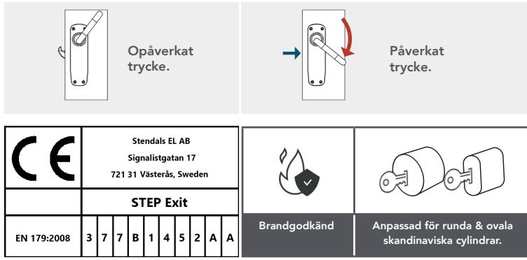

Välj mellan olika typer av funktion på utsidan, ytbehandlingar samt om beslaget ska passa för höger- eller vänsterhängd dörr.

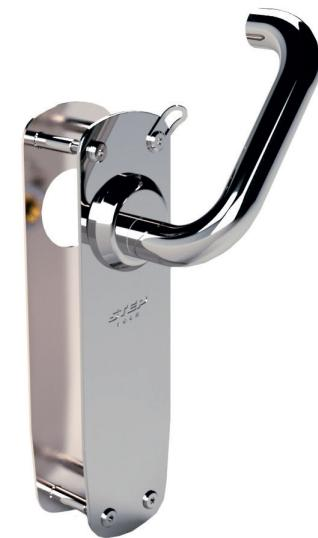

Behörets insida är försedd med ett utrymningshandtag. Välj mellan två olika typer av utsidor.

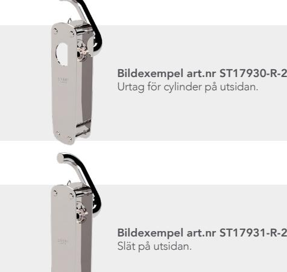

| Art.nr      | Benämning                                         |
|-------------|---------------------------------------------------|
| ST17931-R-1 | STEP Exit i borstat rostfritt stål, höger.        |
| ST17931-L-1 | STEP Exit i borstat rostfritt stål, vänster.      |
| ST17931-R-2 | STEP Exit i blankpolerat rostfritt stål, höger.   |
| ST17931-L-2 | STEP Exit i blankpolerat rostfritt stål, vänster. |

Art.nr Benämning

ST17930-R-1 STEP Exit i borstat rostfritt stål, höger. ST17930-L-1 STEP Exit i borstat rostfritt stål, vänster. ST17930-R-2 STEP Exit i blankpolerat rostfritt stål, höger. ST17930-L-2 STEP Exit i blankpolerat rostfritt stål, vänster.