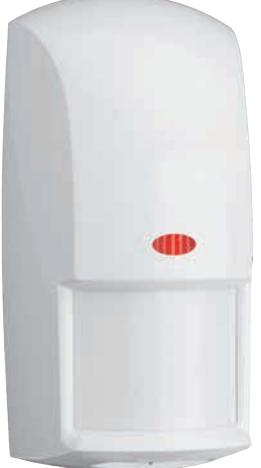
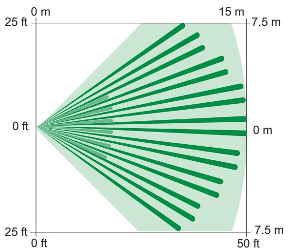
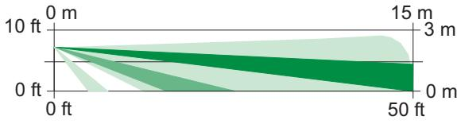

# OD850 Kombidetektor för utomhusbruk

www.boschsecurity.com

- u PIR-signalbearbetning med hjälp av Motion Analyzer II
- u LTD Mikrovågsbaserad signalbehandling

- u Två känslighetsnivåer
- u Tidsreläutgång inställningsbar från 2 s till 10 min
- u OCH/ELLER-läge

TriTech-detektorer i OD850-serien är avsedda för utomhusbruk och i andra utsatta miljöer. De är utrustade med en kombination av PIR-detektering och mikrovågsbaserad detektering med avancerad signalbearbetning.

# **Systemöversikt**

Med detektorerna bearbetas PIR-signalerna med hjälp av Motion Analyzer II och mikrovågssignalerna med signalbearbetningen för linjära avstånd. Detektorerna kan urskilja små, upprepande rörelser som trädgrenar som vajar i vinden och mer väsentliga rörelser från inkräktaren. De här avancerade bearbetningsteknikerna och detektorernas mekaniska formgivning kombineras vilket ger en överlägsen funktion vid en mängd olika väderförhållanden.

## **Funktioner**

## **Motion Analyzer II-signalbehandling**

Den här PIR-signalprocessorn har flera trösklar och tidpunktsfönster för analys av signalernas tidpunkt, amplitud, varaktighet och polaritet för att avgöra vilket larm som är relevant. Extrema nivåer av termiska störningar och ljusstörningar orsakade av varma och kalla drag, solljus eller blixtar orsakar inte larm.

# **LTD – Mikrovågsbaserad signalbehandling**

Med den här mikovågssignalprocessorn mäts det linjära avståndet till ett mål för att avgöra vilket larm som är relevant. Inget larm utlöses för objekt som rör sig utan att förflytta sig, t.ex. trädgrenar och hängande skyltar.

# **Två känslighetsnivåer**

Detektorerna har två valbara PIRkänslighetsinställningar:

Standardkänslighet rekommenderas för att minimera antalet larm. Med den här inställningen kan detektorn användas i utsatta miljöer.

Mellanläget rekommenderas för platser där inkräktaren förväntas befinna sig i endast en liten del av det bevakade området. Med den här inställningen kan detektorn användas i normala miljöer. Med den här inställningen upptäcks inkräktare snabbare, men fler falsklarm kan utlösas.

# **Utgång för justerbart tidsinställt relä**

Utöver ett larmrelä finns det en form C-kontakt, en obevakad, tidsinställd reläkontakt som växlar statusläge en sekund efter det att ett larm utlösts och som följer ett valbar timer. Tidsgränsen uppnås efter den angivna tiden och efter det senaste larmet (återställs vid varje nytt larm).

## **OCH/ELLER-läge**

Med hjälp av den här DIP-omkopplaren kan du ange om detektorn ska rapportera larmsituationer i OCHläget (när båda teknikerna känner av en larmsituation samtidigt) eller i ELLER-läget (när antingen PIR- eller mikrovågstekniken känner av en larmsituation). ELLERläget ger snabbare detektering i vissa lägen när detektorn aktiverar det larmrelä som baseras på en enkeltekniksingång. Förutom att välja DIPomkopplaren för att ange ELLER-läget, måste bygeln kapas, vilket förhindrar oavsiktlig eller omedveten användning av ELLER-läget.

## **Lysdioder**

Samma teknik som för trafikljus används för de högeffektiva lysdioderna (en röd och en grön) för att de ska synas i solljus. Du kan använda DIPomkopplaren för att ange om de här lysdioderna ska aktiveras eller inte, för att spara ström.

## **Drag- och insektsskyddad**

Med den slutna optiska kammaren förhindras att drag och insekter påverkar detektorn.

## **Certifikat och godkännanden**

| Region     |        | Överensstämmelse med regelverk/ kvalitetsmärkning                 |
|------------|--------|----------------------------------------------------------------------|
| Europa     | CE     | 19-110406a OD850-F1E                                                 |
| Ryssland   | GOST   | DE.AE63.B03457 [OD850-F1]                                            |
|            | GOST   | ТС N RU Д-NL.МН09.В.00334 EAC                                        |
| USA        | UL     | [OD850-F1]                                                           |
|            | UL     | 20190115; UL639 – Standard for Intru sion-Detection Units         |
|            | FCC    | [OD850-F1]                                                           |
| Australien | CTICK  | [OD850-F1]                                                           |
| Kanada     | ULC    |                                                                      |
|            | ULC    | CAN/ULC S306-03 - Canadian Standard for Intrusion Detection Units |
| Kina       | CCC    | 2009031901000551 [OD850-F1-CHI, OD851-F1-CHI]                     |
| Brasilien  | ANATEL | [OD850-F1]                                                           |
| Singapore  | iDA    | #LPREQ-S0155-2004 [OD850-F1]                                         |

## **Installations- och konfigurationskommentarer**

# Uppifrån

# Täckningsområde (standard): 15 x 15 m

# Från sidan

# Täckningsområde (standard): 15 x 15 m

## **Montering**

- Väggmontering: OD850-detektorerna kan monteras direkt på väggen eller på det medföljande kulledsfästet B335. Alternativt kan du montera dem direkt på en fyrkantig eldosa. Detektorerna ska monteras 2,1 m till 2,7 m ovanför marken. Rekommenderad monteringshöjd är 2,1 m; i nivå både horisontellt och vertikalt.
- Takmontering: Detektorerna kan monteras i taket med hjälp av takmonteringsfästet B338 (tillval).

## **Ström**

- Strömgränser: Strömförsörjning måste ske från en godkänd strömbegränsad strömkälla. Samtliga utgångar måste vara anslutna till SELV-kretsar (Safety Extra-Low Voltage).
- Vilolägesström: Detektorn har inget internt vilolägesbatteri. *För UL-listade produktinstallationer måste 4 timmars (248 mAh) vilolägesström levereras av kontrollenheten eller av en UL-listad inbrottsströmkälla.*

## **Tekniska specifikationer**

## **Kapsling**

| Mått:     | 16,5 x 8,25 x 6,35 cm (6,5 x 3,25 x 2,5 tum) |
|-----------|-------------------------------------------------|
| Material: | Polykarbonat                                    |

| Miljöspecifikationer |                          |  |
|----------------------|--------------------------|--|
| Vikt:                | 40 g                     |  |
| Egenskaper:          | Väder- och sabotagesäker |  |

| IP-värde:              | 54                                   |
|------------------------|--------------------------------------|
| Relativ luftfuktighet: | 0-95 % icke-kondenserande            |
| Temperatur (drift):    | -35 till 54 °C                       |
| OD850-F2:              | Uppfyller miljöklass III (EN50130-5) |

## **Utgångar**

| Larm:   | Använd inte kapacitiv eller induktiv belastning. Form A: Normalt sluten kontakt öppnas vid larm. Form C: Kontakt för tidsinställt relä växlar statusläge vid larm och följer en tidsprogrammering. Kontaktvärde: 3 W, max 125 mA vid 25 V DC för likströmsresistiva belastningar, och skyddat av ett motstånd på 4,7 Ω, ½ W, i C-benet på reläet. |
|---------|---------------------------------------------------------------------------------------------------------------------------------------------------------------------------------------------------------------------------------------------------------------------------------------------------------------------------------------------------------------------|
| Sabotag | Normalt slutna kontakter (med locket på) för max 125 mA                                                                                                                                                                                                                                                                                                             |
| e:      | vid 25 VDC                                                                                                                                                                                                                                                                                                                                                          |

## **Strömspecifikationer**

| Ström:        | Max 62 mA                          |
|---------------|------------------------------------|
| Ingångsström: | 10 till 15 V DC för 22 mA standby. |

## **Beställningsinformation**

# **OD850‑F1 Kombidetektor för utomhusbruk (10,525 GHz)**

PIR och mikrovågor, 15 m x 15 m täckning för utomhusbruk eller i hårda miljöer med två känslighetsnivåer, drag- och insektsskydd. Använder frekvensen 10,525 GHz. För Belgien, Tjeckien, Danmark, Grekland, Ungern, Italien, Nederländerna, Norge, Polen, Rumänien, Spanien, Sverige, Ukraina, Syd-, Central- och Nordamerika samt Asien och Stillahavsregionen. Ordernummer **OD850-F1**

**OD850-F1-CHI Rörelsedetektor, utomhus, 15 m** För Kina. Använder frekvensen 10,525 GHz. För utomhusbruk och i andra utsatta miljöer. PIRsignalbehandling med Motion Analyzer II, två känslighetsnivåer, drag- och insektsskyddad och 15 × 15 m täckning.

Ordernummer **OD850-F1-CHI**

### **OD850-F1E Rörelsedetektor, utomhus, 15 m**

PIR och mikrovågor, 15 m × 15 m täckning för utomhusbruk eller i utsatta miljöer med två känslighetsnivåer, drag- och insektsskydd. Fungerar mellan 10,52 och 10,55 GHz. <20mW1. Vissa begränsningar kan gälla för användning i Europa. Ordernummer **OD850-F1E**

### **Tillbehör**

### **B338 Universellt takfäste**

Universalväggfäste med kulled. Det vertikala vridningsomfånget är +7° till -16°, och det horisontella vridningsomfånget är ±45°. Ordernummer **B338**

**Representerad av:**

**Europe, Middle East, Africa: Germany:** Bosch Security Systems B.V. P.O. Box 80002 5600 JB Eindhoven, The Netherlands Phone: + 31 40 2577 284 emea.securitysystems@bosch.com emea.boschsecurity.com

Bosch Sicherheitssysteme GmbH Robert-Bosch-Ring 5 85630 Grasbrunn Germany www.boschsecurity.com

© Bosch Security Systems 2020 | Data kan komma att ändras utan föregående meddelande 2626560139 | sv, V29, 31. Jan 2020