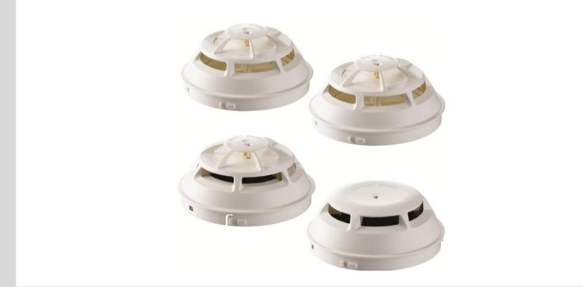
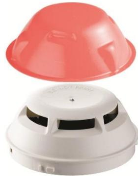
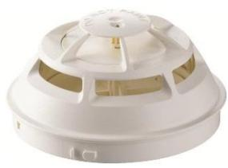
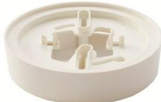
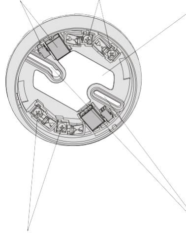
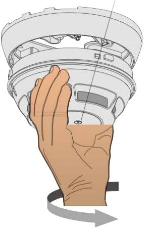
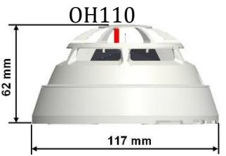
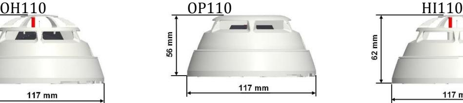
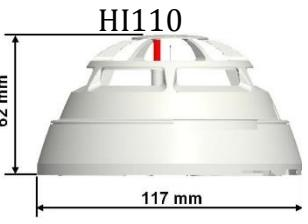
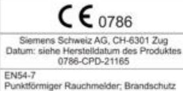

## Automatic Fire Detectors

Insert picture here Automatic Fire Detector For collective and conventional detector lines

- Signal processing with detector algorithms
- Selectable parameter sets
- 3 colour LED indication
- Drift compensation
- Internal fault monitoring
- Fault indication

Automatic Fire Detectors

## **Characteristics**

- Environmental
- Ecologically processing
- Recyclable materials
- Electronic and synthetic material simply separable
- Characteristics
- Resistant to environment and interference factors such as dust, fibres, insects, humidity, extreme temperatures, electromagnetic interference, corrosive vapours, vibration
- Insensitive to impact, tamper protection
- Protected electronics, high-quality components
- Built-in alarm indicator (Al), visible at 360°
- Up to 2 external alarm indicators of type FDAI92 connectable per detector
- Signal processing with detection algorithms
- The same detector base type can be used for each detector type, for surface and recess supply wiring

## Automatic Fire Detectors

#### **OH110 Multi-sensor smoke detector**

## **Multi-sensor smoke detector consists of:**

- Detector
- Dust cap to cover the detector for protection against dust during construction work

## **Function**

- Works according to the scattered light principle with one sensor, optical Forward scattering
- Opto-electronic sampling chamber holds off disturbing extraneous light But optimally detects smoke particles
- An additional heat sensor increases the fire detector's immunity to Deceptive phenomena
- Immunity against transient false alarm causes

## **Application**

- For the detection of flaming fires caused by the combustion of liquid and solid matters as well as smouldering fires
- For reliable fore detection in environments with deceptive phenomena

## **OP110 Optical smoke detector**

## **Optical smoke detector consists of:**

- Detector
- Dust cap to cover the detector for protection against dust during construction work

## **Function**

- Works according to the scattered light principle with one sensor, optical forward Scattering
- Opto-electronic sampling chamber holds off disturbing extraneous light but optimally Detects smoke particles

### **Application**

- For the detection of smoke-generating flaming and smouldering fires
## **HI110 Heat detector (RoR)**

## **Heat detector consist of**

- Detector
## **Function**

- Equipped with one heat sensor
- For high requirements
- Certain response behaviour with slow and fast temperature increases also by depth temperature
- Parameter set: A1R

## **Application**

– For areas having high levels of dust, dirt or moisture that may lead to false activating with smoke detectors

## © Vanderbilt 2016

## Automatic Fire Detectors

## **Detector base DB110**

### **Function**

- Standard conventional detector base for all series 110 point Detectors
#### **Application**

- For recess supply wiring
- For surface wiring, cable diameter up to 8 mm

### **Base attachment BA720**

AGB600

#### **Application**

- For the supply of surface-mounted tubes (max. 20 mm) and trunking (max. 25 mm x 15 mm)
- The detector is fixed with a spring-loaded catch.

#### © Vanderbilt 2016

## Automatic Fire Detectors

### **Installation**

- **Simple Installation**
- Universal base with
	- 2 breaks outs on the side for surface supply wiring at max. Ø8 mm
	- Extra large rear opening for easy recess supply wiring
- Extra-large mounting slots facilitate a re-use of existing drill holes resulting from other systems
- Connecting terminals for cable diameter at 2.5 mm2
- Place for auxiliary terminals

Place for auxiliary terminals Connecting terminals detector line and ext. Al Opening for cable entry Al

Connecting terminals detector line and ext. Al Mounting slots min. 40 mm up to max. 90 mm

- Alarm indicator (Al) centered in the detector, no alignment required

023_OP110_OH110_HI110_b_en.doc 28/07/201 page 5

## Automatic Fire Detectors

#### **Dimensions of detector with base**

|                                           | OH110                   | OP110                   | HI110 / HI112            |
|-------------------------------------------|-------------------------|-------------------------|--------------------------|
| Operating voltage                         | DC 16  28 V             | DC 16  28 V             | DC 16  28 V              |
| Operating current (quiescent)             | Max. 100uA              | Max 100µA               | Max. 100pA               |
| Ext. alarm indicator without sounder base |                         |                         |                          |
| Al connectable                            | 2                       | 2                       | 2                        |
| Operating temperature                     | -10  +50 °C             | -10  +55 °C             | -10  +50 °C (HI110)      |
|                                           |                         |                         | -10  +50 °C (HI112, A2S) |
|                                           |                         |                         | -10  +65 °C (HI112, B)   |
| Storage temperature                       | -30  +70 °C             | -30  +70 °C             | -30  +70 °C              |
| Humidity (short-term moisture condensa-   | ≤96 % rel.              | ≤96 % rel.              | ≤96 % rel.               |
| tion permitted)                           |                         |                         |                          |
| Communication protocol                    | Collective/conventional | Collective/conventional | Collective/conventional  |
| Color                                     | white, ~RAL 9010        | white, ~RAL 9010        | white, ~RAL 9010         |
| Protection category EN60529 / IEC529      | IP 40                   | IP 40                   | IP 40                    |
| - with detector base seal RS 720          | IP 42                   | IP 42                   | IP 42                    |
| Standards                                 | CEA4021, EN 54-7        | EN 54-7                 | EN 54-5                  |
| A pprovals                                |                         |                         |                          |
| - VdS                                     | G212059                 | G212033                 | G212004 / 212015         |
| - LPCB                                    | request                 | request                 | request                  |
| QS standards Siemens Standard SN 36350 |                         |                         |                          |

| € 0786                                                                                               |               |
|------------------------------------------------------------------------------------------------------|---------------|
| Siemens Schweiz AG, CH-6301 Zug Datum: siehe Herstelldatum des Produktes 0786-CPD-21161        | D             |
| EN54-7 Punktförmiger Rauchmelder, Brandschutz OP110 Technische Daten siehe Dok. A6V10316298 | P HI Ta |

| HIJIJ                                                                                                  |  |  |
|--------------------------------------------------------------------------------------------------------|--|--|
| € 0786                                                                                                 |  |  |
| Siemens Schweiz AG. CH-6301 Zug Datum: siehe Herstelldatum des Produktes 0786-CPD-21141          |  |  |
| EN54-5. Punktformiger Wärmemelder, Brandschutz HI110 Technische Daten siehe Dok. A6V10316298. |  |  |

023_OP110_OH110_HI110_b_en.doc 28/07/201 page 6

Automatic Fire Detectors

## **Accessories**

| Type    | Art Nr.          | Description                  | Weight |
|---------|------------------|------------------------------|--------|
| FICTEST | N54591-Z126-A100 | Test Gas for smoke detectors | XX kg  |

## **Ordering Information**

| Type   | Art Nr.       | Description                              | Weight   |
|--------|---------------|------------------------------------------|----------|
| OH110  | N54372-F11-A1 | Multi sensor fore detector (collective)  | 0.144 kg |
| OP110  | N54372-F4-A1  | Optical smoke detector (collective)      | 0.138 kg |
| HI110  | N54372-F9-A1  | Heat detector (collective, differential) | 0.130 kg |
| DB110  | N54372-F5-A1  | Detector base (collective)               | 0.052 kg |
| FDAI91 | N54370-F9-A1  | Alarm indicator, door frame version      | 0.020 kg |
| FDAI92 | N54370-F3-A1  | Alarm indicator, surface version         | 0.050 kg |
| BA720  | N54319-F20-A1 | Base attachment                          | 0.100 kg |

Issued by Vanderbilt Clonshaugh Business and Technology Park Clonshaugh Dublin 17 Ireland www.vanderbiltindustries.com

Data and design subject to change without notice. Supply subject to availability.

023_OP110_OH110_HI110_b_en.doc 28/07/201 page 7

© Vanderbilt 2016