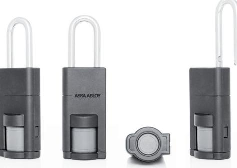

# **1 Produktinformation** P100 Hänglås

Hänglås med RFID läsare för inomhus samt utomhusbruk

# Produktbeskrivning

- Trådlöst Aperio hänglås som kan integreras i valfritt kontrollsystem via AADP-protokollintegration eller via Aperio Wiegand Hub.
- Huvudelektronik (RFID + radio) i yttervredet säker elektronik inuti cylinderkärna
- Fritt roterande skiva
- 10 undantagskortkort kan lagras i låset i händelse av fel eller ingen kommunikation med hub för säker öppning.
- Fungerar med ett onlinesystem eller som ett offlinelås.
- LED för statusindikering

## Leveransomfattning:

- 1 hänglås med batteri (Lithium CR2) och installationsanvisning
### Tekniska data

| OSS Standard Offline               | Aperio® Online; Aperio® Offline; Standard OSS Offline                 |
|------------------------------------|--------------------------------------------------------------------------|
| Godkännanden                       | CE                                                                       |
| Låsvredsmått                       | 43 x 32 mm (L x Ø)                                                       |
| Låsvredsyta                        | Rostfritt stål                                                           |
| Batteri                            | 1 x Lithium CR2                                                          |
| Batterilivslängd                   | < 30 000 cykler (max. 2 år)                                              |
| Radiostandard                      | IEEE 802.15.4 (2.4 GHz)                                                  |
| Kryptering (radiokommunikation)    | AES 128 bits                                                             |
| Avstånd mellan RFID-läsare och hub | Upp till 25 m beroende på byggnadsmiljö                                  |
| Skyddsklass                        | IP 66*                                                                   |
| Drifttemperaturområde              | -20° - +55°C                                                             |
| Status LED                         | (röd/grön/orange)                                                        |
| RFID-teknologi                     | MIFARE Classic, MIFARE Plus, MIFARE DESFire EV1/EV2, iCLASS, och SEOS |
| RFID-avläsning                     | UID / Sektor / Block / Application / File                                |
| Avläsningsavstånd                  | < 4 cm                                                                   |

* Observera att besvärliga yttre miljöfaktorer kan påverka produktens funktion (hög luftfuktighet, salt, extrema temperaturer)

ASSA ABLOY Opening Solutions Sweden P.O. Box 371 SE-631 05 Eskilstuna Sweden Phone +46 (0)16 17 70 00 Customer support:

Phone intl. +46 (0)16 17 71 00 Phone nat. 0771-640 640 helpdesk.se.openingsolutions@assaabloy.com assaabloy.com

We reserve the right to correct any printing errors and update the information after printing.

