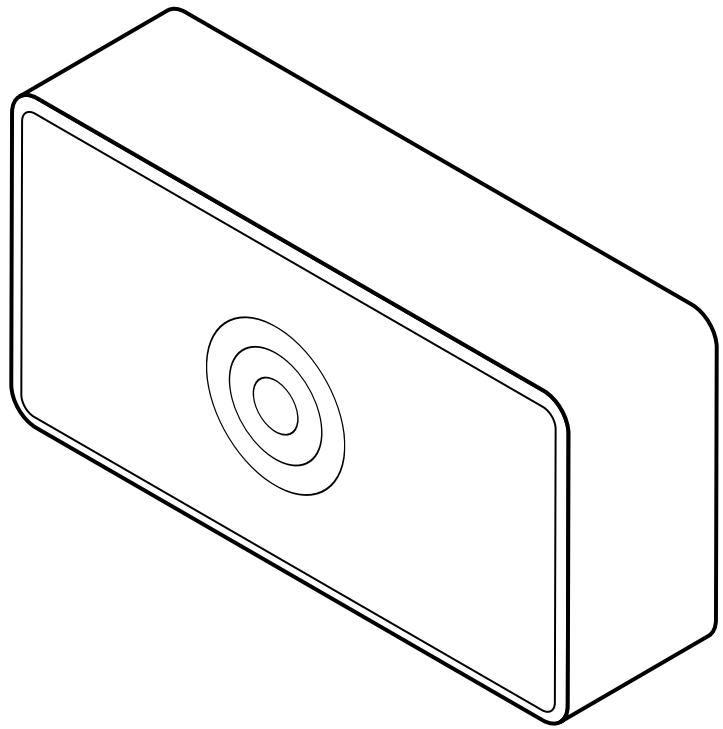
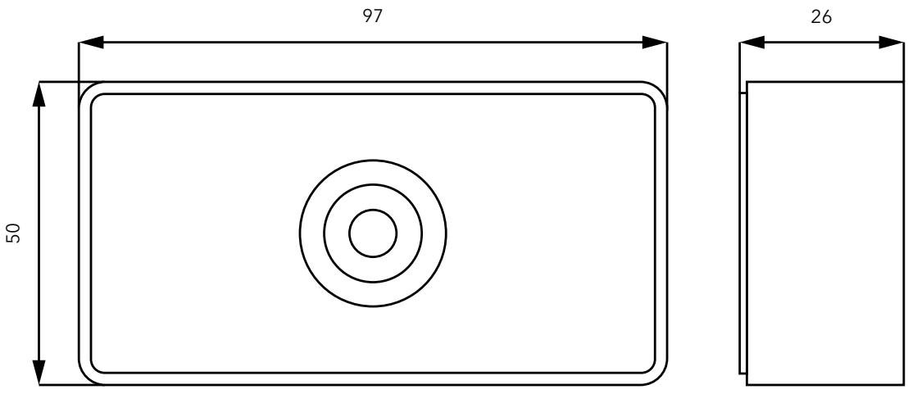
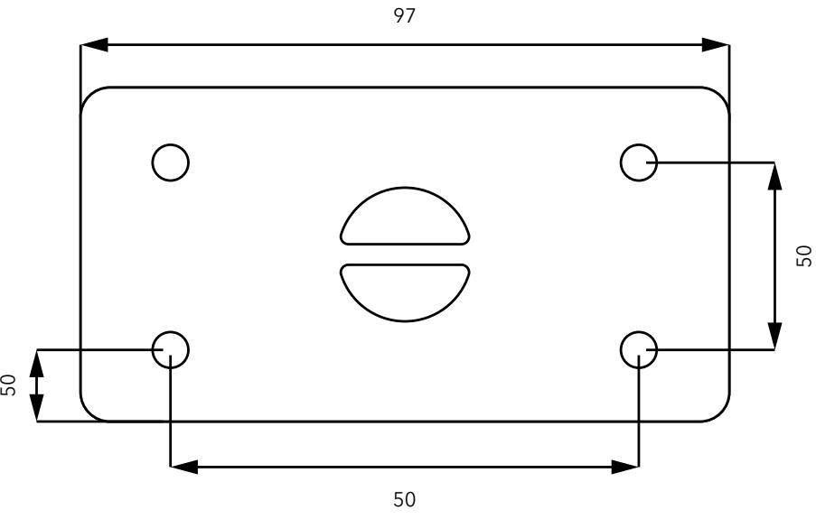
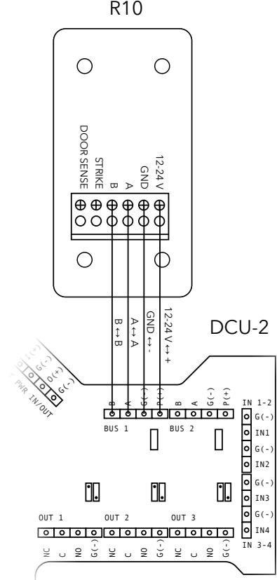
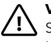

# **PASSERLÄSARE R10**

**INSTALLATIONSMANUAL** SVENSKA 20181127

# **INNEHÅLL**

| 1. ALLMÄN INFORMATION 2 |  |
|-------------------------|--|
| 2. MONTERING 3          |  |
| 3. INSTALLATION 4       |  |
| 4. ÖVRIGT 5             |  |
| 5. AVFALLSHANTERING 5   |  |

## Välkommen till Dinbox!

Vi är glada att du valt en produkt från Dinbox. Du har fått en produkt med mycket innovation, erfarenhet och tankekraft bakom sig.

Besök gärna vår webbplats för mer information, bruksanvisningar och för att köpa reservdelar.

**www.dinbox.se**

## Kundtjänst och service

För serviceåtgärder hänvisar vi till vår supportavdelning som kan hjälpa till med felsökning.

Med reservation för ändringar eller feltryck.

# **1. ALLMÄN INFORMATION**

### **1.1** Användningsområde

Läsare för kort eller nyckel att monteras antingen i dörrmiljö eller för fastighetsbox

### **1.2** Packlista

- R10
### **1.3** Installationskrav

- Centralenhet DCU-2 samt installationsmanual för DCU-2
- 4-polig partvinnad kabel för RS-485
- Nätverksanslutning 10/100 Mbit/s
- Internetuppkoppling 2/2 Mbit/s

#### **1.4** Allmän säkerhetsinformation

#### **VARNING!**

Var noga med att läsa igenom instruktionerna innan du påbörjar installationen. Dinbox kan inte hållas ansvarig för skador på person eller egendom som orsakats av felaktig installation eller användning.

### **1.5** Säkerhetsföreskrifter

#### **VARNING!**

Endast behörig person får installera den här produkten.

- Se till att allt förpackningsmaterial är avlägsnat
- Kontrollera innan installation att produkt eller kablage inte är skadad
- Dra inte kablage i alltför skarp böj, då detta kan skada ledarna i kabeln
- Kläm inte åt kablage för hårt med buntband eller spikklamrar
- Ha inte mer än 50 m kabel mellan denna produkt och centralenhet
- Kablarna bör inte ligga alltför nära starkströmsledningar då de kan vara känsliga för elektromagnetisk störning
- Iaktta strömbelastning och dimensionera kablaget därefter för att undvika spänningsfall
- Spänningsätt ej centralenheten medan arbete i R10 pågår

## **2. MONTERING**

### **2.1** Måttskiss

## **2.2** Innan du börjar

Det kablage som enheten behöver ska vara framdraget innan installation påbörjas.

## **2.3** Montering

Läsaren är framtagen för utanpåliggande montage, och bör fästas med en gummimatta mellan läsare och vägg. Läsaren ska placeras på plant underlag. Täta skarv ovan och på sidor, samt skruv- och kabelhål, med silikon om läsaren placeras utomhus. Måste läsaren placeras så att den kan nås av vind och nederbörd bör en keps användas för att skydda läsaren.

För det framdragna kablaget genom fästplattan. Efter att kablage är anslutet, haka på läsaren i fästplattans överkant och fäll in läsaren. Avsluta med att låsa fast enheten via säkerhetskruven på nedersidan.

## **3. INSTALLATION**

#### **3.2** Översikt

### **3.1** ANSLUTNINGAR

| Nummer | Pinnamn    | Beskrivning                  |
|--------|------------|------------------------------|
| 1      | 12-24 V    | Spänningsmatning (+)         |
| 2      | GND        | Spänningsmatning (-)         |
| 3      | A          | Från RS485-bussen (A till A) |
| 4      | B          | Från RS485-bussen (B till B) |
| 5      | STRIKE     | Används ej                   |
| 6      | DOOR SENSE | Används ej                   |

## **3.3** Strömförsörjning

#### **Varning**

Strömsätt produkten i slutet av installationen. Kontrollera alla anslutningar innan produkten strömsätts.

12V

24V

12-24 VDC kan användas, beroende på hur DCU-2 är konfigurerad. Kabelarea ska dimensioneras efter belastning.

#### **3.4** Anslutning

Anslut kablarna från DCU-2 till plinten på R10. För datatrafik anslut A till A och B till B, för spänning anslut plus till plus och minus till minus enligt översikten ovan. Antingen bus 1 eller bus 2 kan användas. Dipswitcharna på R10 ska vara satta enligt: 1 och 4 på ON, 2 och 3 på OFF.

# **5. Övrigt**

#### **5.1** Teknisk data

| Specifikationer  | Värde                                                             |
|------------------|-------------------------------------------------------------------|
| Strömförsörjning | 12 VDC (167 mA) eller 24 VDC (83 mA). Matning från centralenheten |
| Läsarteknik      | EM (125 kHz) och MIFARE (13,56 Mhz)                               |
| Miljökrav        | -30 till +70 °C, 10-95% luftfuktighet                             |
| Mått             | 97 x 50 x 26 mm                                                   |
| Vikt             | 0,2 kg                                                            |

### **5.2** Lysdioder

| Funktion             | Indikation                                                                                                                                              |
|----------------------|---------------------------------------------------------------------------------------------------------------------------------------------------------|
| Normal uppstart      | Blinkar gult med 1 sekunds mellanrum tills enheten har fått kontakt med centralenheten                                                               |
| Läsning av nyckel    | Blinkar först med ett snabbt grönt blink; om det efter det uppstår ett snabbt rött blink innebär det att enheten inte fick något svar från centralen |
|                      | Lysdioder lyser efter läsning med ett fast grönt eller rött sken om nyckeln godkänns eller ej                                                        |
| Firmware-uppdatering | Blinkar med tätare mellanrum än 1 sekund                                                                                                                |
|                      | Om fel uppstår under uppdateringen blinkar lysdioder gult med 2-5 sekunders mellanrum                                                                |
| Normal drift         | Blinkar blått med jämna mellanrum                                                                                                                       |

# **4. AVFALLSHANTERING**

## **3.5** Miljöskydd

Återvinn de material som är märkta med genom att placera de i lämpligt kärl. Elektriska och elektroniska produkter märkta med ska inte slängas med hushållsavfall. Lämna eller skicka in produkten för återvinning hos Dinbox.

www.dinbox.se 010-33 000 10

Dinbox Sverige AB Drottninggatan 97 113 60 Stockholm

Tel: 010-33 000 10 E-post: info@dinbox.se Web: www.dinbox.se