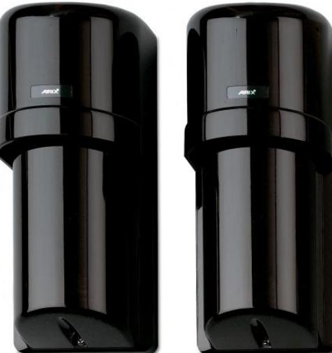

# PB521

Produktblad

Linjedetektor, 2 strålar, 60 m utomhus, 120 m inomhus

### PB500-serien

PB500-serien har dubbel frekvensmodulation och faslåsning med högeffektsändare för att utan problem klara långa räckvidder och hög känslighet. Den patenterade tekniken ger utmärkt tålighet för väderstörningar som dimma, snö och regn med mera. Detektorerna är unika patenterade och intelligenta som kan programmeras med fyra olika modulationsfrekvenser. Genom att använda olika frekvenser förhindras att detektorerna påverkas från andra detektorer i samma anläggning.

#### Strålar

PB500-serien tillämpar teknik med dubbelstrålar. Larm utlöses då båda strålarna bryts.

#### Vridbar optik

Optiken hos sändare och mottagare kan vridas 180° för maximal flexibilitet. Enheterna behöver därför inte monteras exakt mitt för varandra, vilket försvårar för obehöriga att avgöra detekteringsområdet. Optiken är tät vilket förhindrar att insekter stör funktionen.

#### Enkel installation

Med hjälp av precisionssikten, förenklas installationen och samtidigt garanteras en perfekt inställning. Detektorns känslighet kontrolleras med hjälp av en speciell mätpunkt. I PB500-seriens detektorer finns även en störnings-LED för indikering av dålig mottagning.

#### Filter

Elektroniska och optiska filter minimerar riskerna för störningar förorsakade av solljus, strålkastare, lysrör och kvicksilverlampor. Utomhusmodellerna har en speciell huv som skyddar detektorn mot frost eller fukt.

#### Förstärkningskontroll

PB500-serien har automatisk förstärkningskontroll (AGC) som ger rätt känslighet oavsett omgivningsförhållanden. Speciella filter ger hög immunitet mot elektriska och elektromagnetiska störningar.

## Standardprestanda

- ERäckvidd 60/120 m
- EFör inomhus- och utomhusmontering
- E2 synkroniserade strålar
- E4 valbara frekvenssteg garanterar att rätt sändar-/ mottagarpar arbetar endast med varandra
- EJusterbar precisionsoptik
- EMycket väl skyddade mot EMC-störningar
- EAGC känslighetskontroll
- EExtra linsvärmare som tillbehör
- EStort antal olika pelare för utomhusmontering

# PB521

Linjedetektor, 2 strålar, 60 m utomhus, 120 m inomhus

### Tekniska data

| IR-system             | 2 strålar, dubbel modulationsfrekvens |
|-----------------------|---------------------------------------|
| Maximal räckvidd      | 60/120 m                              |
| Responstid            | Justerbar, 50-700 msek.               |
| Drivspänning          | 12-30 V DC (ingen polaritet)          |
| Larmutgång            | NC/NO (max 30 VAC/DC, 0,5 A)          |
| Strömförbrukning      |                                       |
| Vid normal drift      | 85 mA                                 |
| Vid larm              | 120 mA                                |
| Sabotageutgång        | NC (max 30 VAC/DC, 0,1 A)             |
| Utgång för dålig sikt |                                       |
| Temperaturområde      | -25° till +60° C                      |
| Mått (LxBxH)          | 170x72x70 mm                          |
| Kapsling              | Vädersäker svart polykarbonat         |

Order data

| Artikelnummer | Beskrivning                                           |
|---------------|-------------------------------------------------------|
| PB521         | Linjedetektor, 2 strålar, 60 m utomhus, 120 m inomhus |
| PB103         | Värmeelement med termostat för PB600-serien           |

