# PB601, PB611, PB621 Photoelectric Beam Sensor Installation Sheet

**EN DE ES FR IT NL SV** 

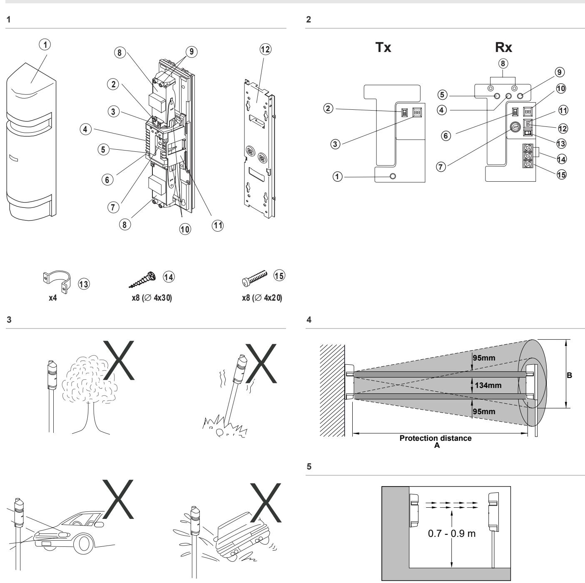

- 1. Standard connection
#### 4. 2-stacked standard connection

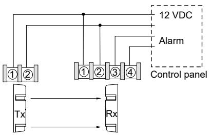

2. Two or more sensors connected on the same zone

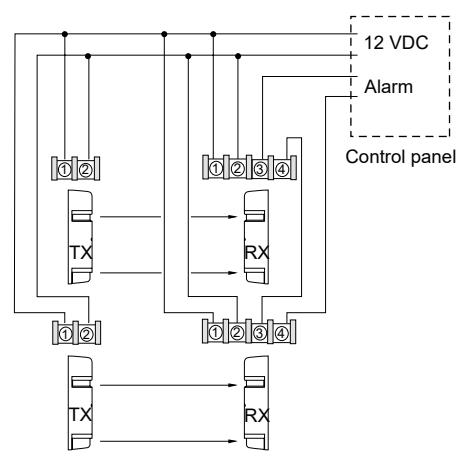

#### 5. Environmental module and manual alarm memory used

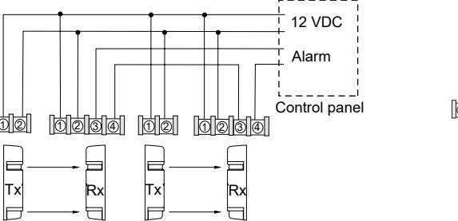

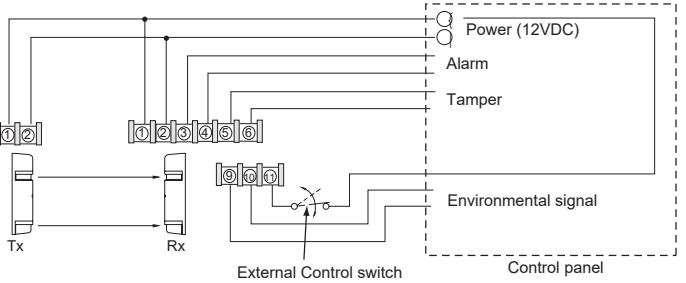

3. Two or more sensors on separate zones

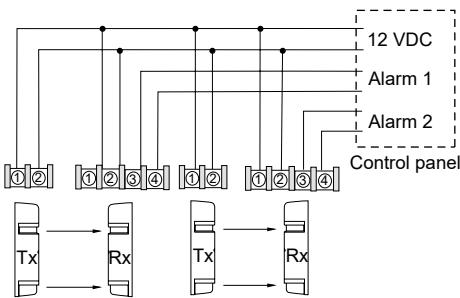

| Wire size             | PB601 (m) |      | PB611 (m) |      | PB621 (m) |      |
|-----------------------|-----------|------|-----------|------|-----------|------|
|                       | 12 V      | 24 V | 12 V      | 24 V | 12 V      | 24 V |
| AWG22 (Ø 0.65 mm) 120 |           | 1100 | 110       | 1000 | 100       | 900  |
| AWG20 (Ø 0.8 mm) 210  |           | 1900 | 190       | 1700 | 160       | 1500 |
| AWG18 (Ø 1.0 mm) 310  |           | 2800 | 280       | 2500 | 250       | 2200 |
| AWG17 (Ø 1.1 mm) 380  |           | 3400 | 340       | 3000 | 300       | 2700 |
| AWG16 (Ø 1.25 mm) 500 |           | 4500 | 450       | 4100 | 400       | 3600 |
| AWG15 (Ø 1.4 mm) 670  |           | 6000 | 610       | 5500 | 530       | 4800 |
| AWG14 (Ø 1.6 mm) 840  |           | 7600 | 760       | 6800 | 660       | 6000 |

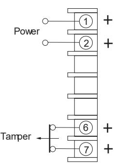

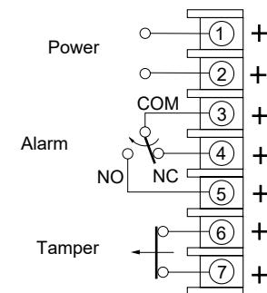

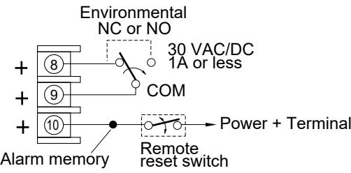

**11** 

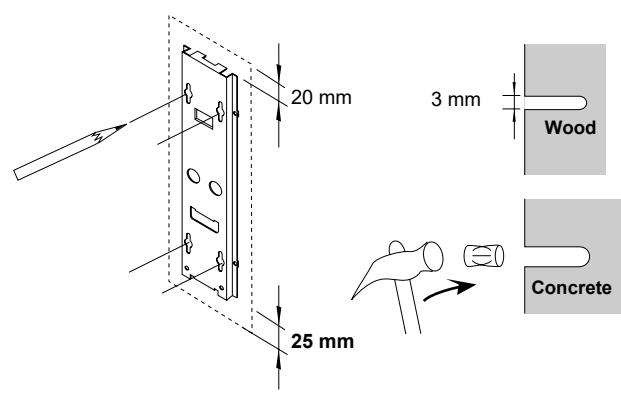

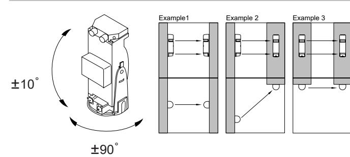

**10** 

**9** 

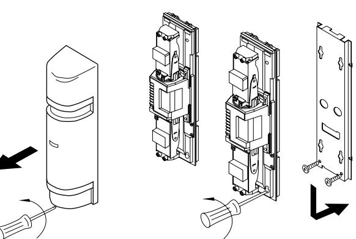

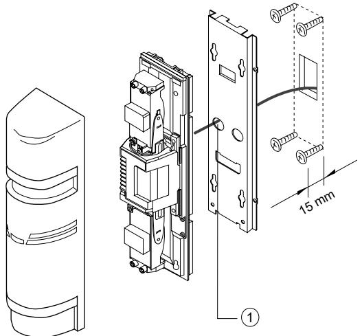

∅ 42-44 mm

∅ 6 mm

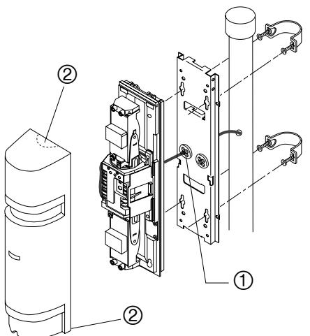

**15 16** 

**14** 

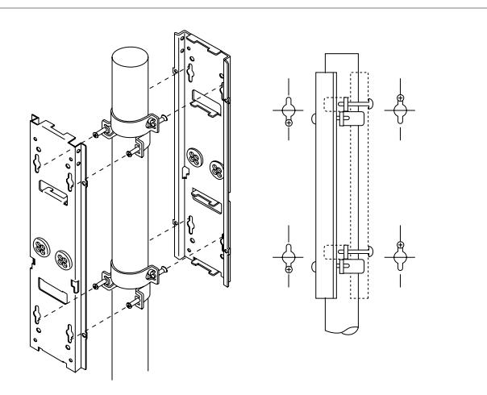

**18** 

Voltmeter (10 VDC)

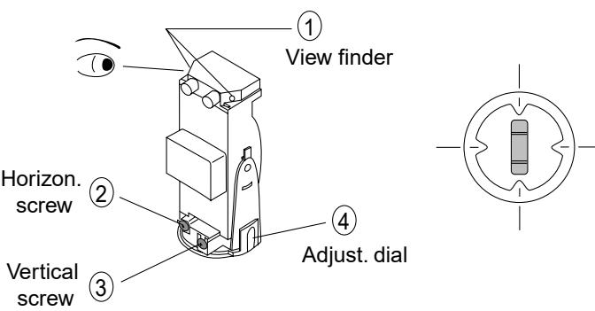

**19** 

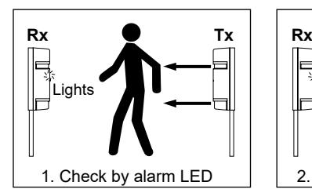

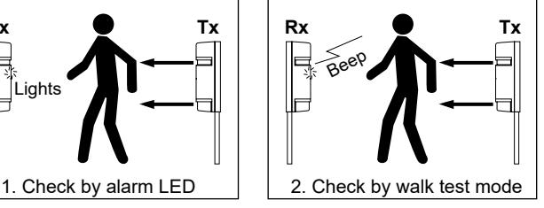

**20** 

**17** 

1

2

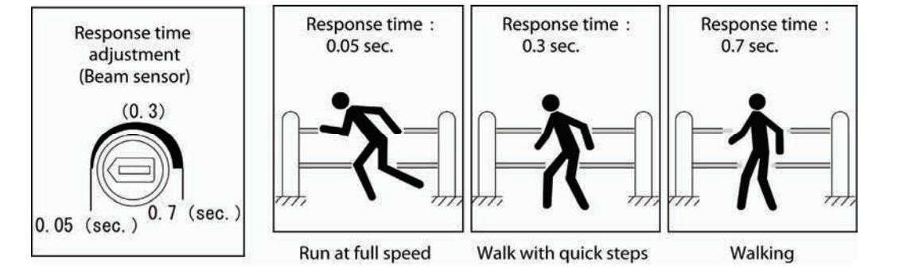

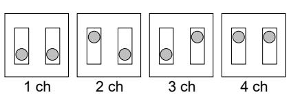

#### 1: Line protection

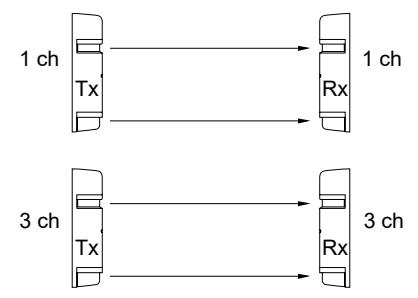

#### 2: 2-stacked protection

#### 3: Line and 2-stacked protection

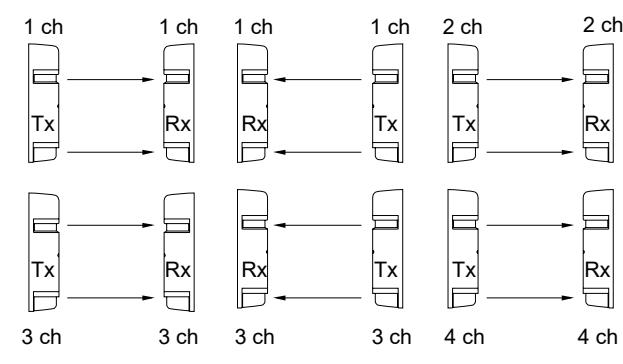

**22** 

### **A. Auto-reset**

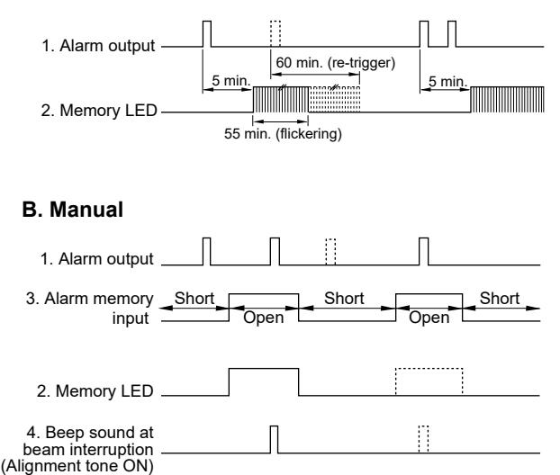

4: Perimeter protection

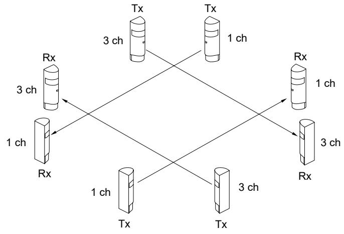

5: Perimeter 2-stacked protection

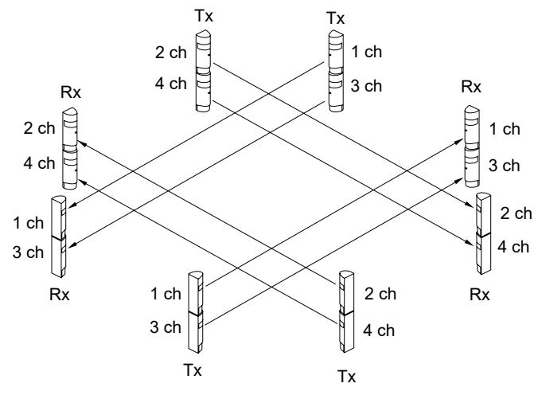

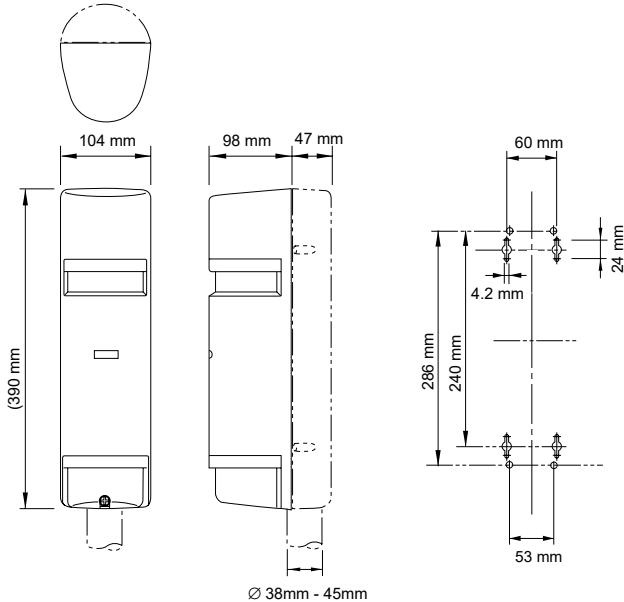

# **EN: Installation Sheet**

## **Part description**

**Figure 1:** The product is shipped with the following items. Please check that they are all included.

| 1  | Cover                                     |
|----|-------------------------------------------|
| 2  | Horizontal fine adjustment screw          |
| 3  | Vertical adjustment screw                 |
| 4  | Terminals                                 |
| 5  | Tamper switch (receiver only)             |
| 6  | Gain lock switch (receiver only)          |
| 7  | Function indications (see figure 2 below) |
| 8  | Mirror                                    |
| 9  | View finder                               |
| 10 | Adjustment dial                           |
| 11 | Shading plate                             |
| 12 | Mounting plate                            |
| 13 | Bracket                                   |
| 14 | 8 tapping screws (Ø 4 x 30)               |
| 15 | 8 oval countersunk head screws            |

**Figure 2:** Functions/indications of transmitter (TX) and receiver (RX).

| 1  | Operation LED                                          |
|----|--------------------------------------------------------|
| 2  | Beam power (H set at factory)                          |
| 3  | Beam channel (channel 1 set at factory)                |
| 4  | Sensitivity attenuation LED                            |
| 5  | Alarm LED                                              |
| 6  | Beep (alignment tome) switch (OFF set at factory)      |
| 7  | Response time adjustment (50 msec. set at factory)     |
| 8  | Monitor jack                                           |
| 9  | Memory LED                                             |
| 10 | Beam channel (frequency 1-4, channel 1 set at factory) |
| 11 | Environmental output selector (N/C set at factory)     |
| 12 | Memory selector (manual set at factory)                |
| 13 | Remote-manual memory logic switch (L set at factory)   |
| 14 | Environmental output terminal                          |
| 15 | Remote control input terminal                          |

### **Installing the sensors**

**Guidelines when installing sensors** 

**Figure 3:** Dos and Don'ts on where to install the sensor.

No obstructions (consider seasonal changes). Avoid strong light. Avoid splashing the unit. Avoid unstable ground.

**Figure 4:** Calculating beam expansion (B).

(A= protection distance) The beam spread of each model type must be considered in order to avoid potential reflection from the ground surface or nearby objects.

**Figure 5:** Recommended installation height.

#### **Wiring the system**

Connect power to both the transmitter and receiver. The wiring depends on the number of sensors or zones. Wire size also depends on the distance between the sensor and the control panel/power source. The wiring must comply with NFPA-70 of the National Electrical Code.

**Caution:** The signal output on the receiver cannot be used independently for the upper/lower optics, only as a set. Outdoor wiring should be in PVC if used below ground or use a burial cable. Use conduit for above-ground wiring.

**Figure 6:** Examples of wiring.

Example 1: Standard connection.

Example 2: When two or more sensors are connected on the same zone.

Example 3: When two or more sensors are on separate zones.

Example 4: Two-stacked standard connection.

Example 5: When the environmental module and manual alarm memory are used.

Refer to the section *Function descriptions* for selecting the beam frequency.

**Figure 7:** Wiring distance between the sensor and the control panel (m).

**Note:** The maximum wiring distance when two or more sets are connected is the value shown divided by the number of sets.

**Note:** The signal line can be wired up to approximately 1000 m with AWG22 (diameter 0.65 mm) telephone wire.

**Standby battery:** Be sure that the control panel is equipped with an adequate standby battery and charging circuit. Use 12 V (at least) NiCd or lead acid battery with a minimum capacity of 0.5 AH.

#### **Arranging the terminals**

See Figure 8.

|  |  | Figure 8 description |
|--|--|----------------------|
|--|--|----------------------|

| 1 | Environmental NC or NO, 30 VAC/VDC 1 A or less |  |
|---|------------------------------------------------|--|
| 2 | Alarm memory                                   |  |
| 3 | Remote reset switch                            |  |
| 4 | Power and terminal                             |  |
|   |                                                |  |

#### **Mounting the units**

The units can be easily mounted on a pole or flat surface. Using the adjustment dial and screws, adjust the mirrors vertically (A) and horizontally (B) so that the unit can work in all directions (figure 9). See examples 1-3.

**Installing a wall-mounted unit** 

- 1. Remove the cover by unscrewing the screw at the base of the cover (figure 10).
- Insert the mounting screws, leaving 15 mm exposed. - Install the mounting plate on the exposed screws.
	- Pull the wire through.

4. Install the sensor (figure 12):

- Tighten the screws and plug the opening of the wire hole.
- Connect the terminal.
- Attach the cover.

**Note:** The unit cannot be installed in an outlet box. However, the outlet box can be used for wire-lead.

2. Loosen the screws that fix the sensor body on the

3. Make the holes in the wall. Use the mounting plate as a template to mark the screw holes. Allow 20 mm above the plate and 25 mm below the plate for ease of detachment after installation. Figure 11. 1: Wood wall. 2: Concrete wall: refer to specification of the securing plug used.

mounting plate and slide the plate downwards to detach it.

#### **Installing a pole-mounted unit**

- 1. Remove the cover by unscrewing the screw at the base of the cover (figure 10).
- 2. Loosen the screws that fix the sensor body on the mounting plate and slide the plate downwards to detach it.
- 3. Make a wiring hole in the pole and pull the wire through. Place a pole cap on top of the pole. The unit mounts to a 42-44 mm O.D. (outside diameter) pole. Use a RIGID CONDUIT or equivalent (figure 13). Drill a 6 mm hole trough the pole where the PE beam will be mounted for wiring. File all debris and sharp edges around the hole to prevent rough edges from damaging the wire.
- 4. Install the sensor on the pole (figure 14, 1: Plug opening of the hole):

- Attach U-brackets to the pole and secure it to the mounting plate with screws.

- Attach the sensor body.
- Pull the wire through and plug the opening of the wire hole.

- Connect the terminals.
- Attach the cover (break the knockouts (2) on the cover to adapt to the configuration).

**Installing a back-to-back pole-mounted unit** 

Same as for pole mounting described above but attach four Ubrackets to the poles in two pairs, one on top of the other, facing opposite directions (figure 15).

### **Setting-up functions and beam alignment**

- 1. Supply power to the unit with the cover removed.
- 2. Set the function options. Refer to the section *Function description* for a detailed explanation of each option.

| Location | Function                    | Function switches     |
|----------|-----------------------------|-----------------------|
| TX & RX  | Beam channel (frequency) | 1 channel … 2 channel |
|          |                             | 3 channel … 4 channel |
| TX only  | Beam power                  | High … Low            |

| RX only | Beep switch                | On … Off            |
|---------|----------------------------|---------------------|
|         | Response time djustment | 50 msec (standard)  |
|         |                            | 300 msec … 700 msec |
|         |                            | Other               |
|         | Environmental output    | NO NC            |
|         | Alarm memory               | Auto-reset          |
|         |                            | Manual High      |
|         |                            | Low                 |
|         |                            | Unused              |

- 3. Adjust the optical angle (see figure 16) by looking through the view finder on either side of the transmitter optical unit until the receiver is visible. Repeat the procedure for lower optical units and then repeat on the receiver.
#### **Figure 16 description**

| 1 | View finder                      |
|---|----------------------------------|
| 2 | Horizontal fine adjustment screw |
| 3 | Vertical adjustment screw        |
| 4 | Adjustment dial                  |

- 4. Perform fine tuning (see figure 17). The initial beam alignment can be achieved by using the alignment tone indicator.
#### **Figure 17 description**

| 1 | Sensitivity attenuation LED (lights when the beam reception is |
|---|----------------------------------------------------------------|
|   | below the minimal level)                                       |

| 2 | Alignment tone switch |  |
|---|-----------------------|--|
| 3 | Monitor jack          |  |

 4.1. Attach the shading plates (stored on the sides of both TX/RX) to the lower optics of both TX and RX.

- 4.2. Turn the receiver alignment tone switch to ON.
 4.3. Adjust the optics with the adjustment screws until the highest tone is reached.

**Note:** There will be no sound if the sensitivity attenuation LED is lit.

 4.4. Attach the shading plates to the upper optics of TX/RX and repeat the adjustment.

 4.5. After adjusting, replace the shading plate in the storage areas of the TX/RX.

- 4.6. Turn the alignment tone indicator to OFF.
**Using a voltmeter for beam alignment: (see figure 18)** 

A precise alignment can be achieved using a voltmeter (10 VDC). Insert leads from the voltmeter into the monitor jacks of the receiver. See the table below for output voltage.

| Alignment       |
|-----------------|
| Best            |
| Good            |
| Poor. Re-adjust |
|                 |

5. Reattach the cover

5.1. First attach the transmitter cover.

 5.2. Confirm that the receiver sensitivity attenuation LED stays OFF. Pre-attach the receiver cover but do not secure.

 5.3. A beep sound will occur after 5 seconds. Once this occurs, secure the receiver cover with screws.

**Note:** Sensitivity allowance is automatically set when the beep sound is initiated.

**Note:** If the tone alignment switch is left accidentally ON, the tone will stop when the receiver cover is pre-attached.

 5.4. If there is a continuous 'beep' sound, detach the receiver cover and re-adjust. Refer to the section *Autogain lock function* for more information.

5.5. Install the covers after setting auto gain.

### **Checking the operation**

See Figure 19.

After installing, aligning and auto-gain setting, test the operation by walk-testing the beam. Two methods can be used:

- 1. Alarm LED only.
- 2. Alarm LED and sound check via tone alignment switch. If the tone alignment switch is set to "ON", the tone will stop when the cover is replaced. However, the tone will effective for an audible operation test for five minutes when the auto-gain is locked.

### **Function descriptions**

#### **Four-channel frequency selection**

#### See Figure 21.

The beam pairs may be set at various frequency levels to avoid cross-talk between the units that are stacked, in-line, or have other configurations where there is potential for spill-over transmission from one beam to another. Set the frequency level as shown:

|  |  | Figure 21 description |
|--|--|-----------------------|
|--|--|-----------------------|

| 1 | Line protection                |
|---|--------------------------------|
| 2 | 2-stacked protection           |
| 3 | Line and 2-stacked protection  |
| 4 | Perimeter protection           |
| 5 | Perimeter 2-stacked protection |

**Note:** The transmitter and receiver must be set at the same channel! Paired TX/RX will not set up unless they are set at the same channel.

**Note:** It is advised to use a voltmeter when aligning to ensure the highest level of stability.

**Note:** Upper and lower sensors should have the same model numbers in stacked configuration.

#### **Beam power selection**

This option allows the field selection of the appropriate intensity relative to the application. For distances significantly less than the specified protection distance, reduce the beam intensity to eliminate potential reflection problems. For zones reaching maximum protection distance, set the beam level to the highest level.

| Model | Beam power (m) |         |  |
|-------|----------------|---------|--|
|       | Low            | High    |  |
| PB601 | ≤ 25           | 25-50   |  |
| PB611 | ≤ 75           | 75-100  |  |
| PB621 | ≤ 150          | 150-200 |  |

#### **Auto-gain lock function**

The auto-gain lock standardizes the responsiveness and tolerance level of the units regardless of the variable installation distances. As shown in the figures below, the two situations have exactly the same tolerance and responsiveness levels even though the distances are different.

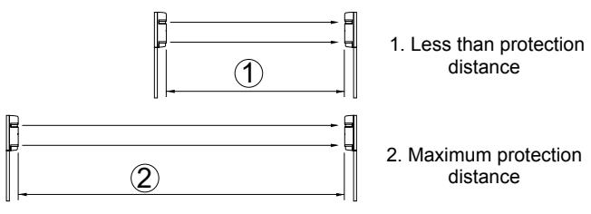

The receiver issues a 'beep' tone approximately five seconds after the cover is put in position. This tone indicates that the auto-gain has been set. See the table *Setting auto-gain* below.

#### **Table 1: Setting auto-gain**

| Tone                               | Indication                                  | Result      | Cause                                                                           | Remedy                                                                                                                                        |
|------------------------------------|---------------------------------------------|-------------|---------------------------------------------------------------------------------|-----------------------------------------------------------------------------------------------------------------------------------------------|
| One pulse (beep)                | Optimal sensitivity has been set.     | OK          | _                                                                               | _                                                                                                                                             |
| Continuous tone (20 seconds) | Optimal sensitivity cannot be set. | not good | Beam is interrupted once the cover is replaced.                     | Remove obstructions and ensure that the hand is not breaking the beam when the cover is held in a temporary position. |
|                                    |                                             |             | Beams are misaligned and the sensitivity attenuation LED lights. | Check the beam power setting at the transmitter with with the cover attached and readjust the beam alignment.               |

**Note:** A tone is generated regardless of whether "beep" (alignment tone) switch is set to ON or OFF.

**Note:** The auto-gain setting is locked in even if power is disrupted.

**Note:** If the receiver cover is detached while power is supplied, or if power is discontinued for longer than two weeks (but the cover is still in place), the auto-gain automatically resets to maximum sensitivity. (Gain is automatically locked when power returns).

#### **Tone indicator**

This feature provides audible testing or signals for the items listed in the table *Tone indicator* below.

#### **Table 2: Tone indicator**

| Test/Signal       | Alignment tone switch | Other condition                                | Description                                                                                                                                |
|-------------------|-----------------------------|---------------------------------------------------|--------------------------------------------------------------------------------------------------------------------------------------------|
| Beam alignment | ON                          | Receiver cover detached                     | Reception strength monitored.                                                                                                           |
|                   |                             |                                                   | Tone pitch increases as reception improves.                                                                                             |
|                   |                             |                                                   | Note: No tone is given if sensitivity attenuation LED is lit or if the receiver cover is attached.                                |
| Auto-gain lock | ON/OFF                      | After receiver cover is attached.        | Short tone indicates that the lock is set.                                                                                              |
|                   |                             |                                                   | Continuous tone (20 sec.) indicates readjustment.                                                                                       |
| Walk test         | ON                          | For approx. 5 min. after gain is locked. | Tone is linked to the alarm LED.                                                                                                        |
|                   |                             |                                                   | Both trip simultaneously.                                                                                                                  |
| Alarm memory   | ON                          | Set to manual                                  | "Beep" is indicated if alarm condition occurs.                                                                                          |
|                   |                             | memory.                                           | Note: This configuration is not recommended for most security applications. The tone could alert the intruder to detection. |

#### **Response time changeover function**

See Figure 20.

Response time (sec.). 1. Response 0.05 sec: running. 2. Response 0.3 sec: walking quickly; 3. Response 0.7 sec: walking.

This feature is used to modify the response time of the beam to best suit the application. The unit doesn't detect passing objects faster than the set response time.

#### **Environmental module**

The environmental signal is initiated if the beam reception level is reduced by around 50% or more. The module "watches" for a gradual degradation of the beam reception, which indicates extremely poor weather conditions. Select NC or NO signal output. Contrast capacity 30 VAC/VDC, 1 A or less.

**NO NC**

**Alarm memory function** 

See Figure 22.

| Figure 22 description |                                                     |  |
|-----------------------|-----------------------------------------------------|--|
| 1                     | Alarm output                                        |  |
| 2                     | Memory LED                                          |  |
| 3                     | Alarm memory input                                  |  |
| 4                     | Logic L                                             |  |
| 5                     | Logic H                                             |  |
| 6                     | Beep sound at beam interruption (alignment tone ON) |  |

The alarm memory LED shows which sensor has triggered when two or more sensors are placed on a zone. An audible tone can also be selected. Reset can be automatic or manual.

**Auto reset:** The memory LED will light for five minutes after an alarm signal and then continues to flicker for 55 minutes before returning to normal mode. If additional alarm signals are triggered, the process repeats.

**Manual:** The memory LED lights with the reset button switched over. The memory is reset manually by a reset button opening (L) or closure (H). The reset button can be placed in any convenient location on the premises.

**Tone alarm with LED:** If an audible signal is desired in conjunction with the memory LED, turn the alignment tone switch to ON.

**Note:** If the alarm memory function is not used, set the memory selector to "manual" and leave the receiver terminal unconnected.

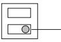

Memory selector (auto-reset - manual)

Manual memory logic switch (H - L)

## **External dimensions**

See Figure 23.

## **Troubleshooting**

| Problem                   | Possible cause                                                          | Remedy                                                           |  |
|---------------------------|-------------------------------------------------------------------------|------------------------------------------------------------------|--|
| Operation LED does     | No power supply.                                                        | Turn on the power.                                               |  |
| not light.                | Bad wiring connection or broken wire (short).                        | Check and correct the wiring.                                    |  |
| Alarm LED does not     | No power supply.                                                        | Turn on the power.                                               |  |
| light when the beam is | Poor wiring connection or broken wire (short).                       | Check and correct the wiring.                                 |  |
| broken.                   | Beam is reflected on to another object and sent to the receiver.  | Remove the reflecting object or change the beam direction. |  |
|                           | Two beams are not broken simultaneously.                             | Break two beams simultaneously.                               |  |
|                           | The beam interruption time is shorter than the set response time. | Adjust the beam response time.                                |  |
| Alarm LED                 | Beam alignment is out.                                                  | Check and adjust again.                                          |  |
| continues to light.    | Shading object between the transmitter and the receiver.          | Remove the shading objects.                                   |  |
|                           | Unit optics are dirty.                                                  | Clean the optics with a soft cloth.                           |  |

| Problem                | Possible cause                                                                                                          | Remedy                                                                                                    |
|------------------------|-------------------------------------------------------------------------------------------------------------------------|-----------------------------------------------------------------------------------------------------------|
|                        | Frequency channel is not compatible between the transmitter and the receiver.                                  | Readjust to the same channel.                                                                          |
| Intermittent alarms | Bad wiring connection.                                                                                                  | Check again.                                                                                              |
|                        | Change of supply voltage.                                                                                            | Stabilize supply voltage.                                                                                 |
|                        | Shading object between transmitter and the receiver.                                                              | Remove the shading object.                                                                                |
|                        | A large electrical noise source, such as a power machine, is located near the transmitter and the receiver. | Change location of the installation.                                                                   |
|                        | Unstable installation of transmitter and receiver.                                                                   | Stabilize.                                                                                                |
|                        | Dirty transmitter or receiver optics.                                                                                | Clean the optics with a soft cloth.                                                                    |
|                        | Incorrect alignment.                                                                                                    | Check and adjust again.                                                                                   |
|                        | Small animals may be passing through the two beams.                                                               | Increase the response time. (impossible in a location where the intruder can run at full speed.) |
|                        | Beam power switch is set to L, which does not keep enough sensitivity allowance.                               | Set the beam power switch at H and make the unit gain locked with the receiver cover detached.   |

## **Specifications**

| Model                    | PB601                                                                               | PB611                                                                                                                                                    | PB621                                     |
|--------------------------|-------------------------------------------------------------------------------------|----------------------------------------------------------------------------------------------------------------------------------------------------------|-------------------------------------------|
| Detection system      | Near infrared beam interruption system. (TX-RX 4 beams simultaneous interuption) |                                                                                                                                                          |                                           |
|                          | Infrared beam LED pulsed beam, double modulation                                    |                                                                                                                                                          |                                           |
| Protection distance   | Outdoor ≤50 m                                                                       | Outdoor ≤100 m                                                                                                                                           | Outdoor ≤200 m                            |
| Max. arrival distance | Tenfold (500 m)                                                                     | Tenfold (1000 m)                                                                                                                                      | Tenfold (2000 m)                          |
| Response time         | 50-700 msec. variable (Standard = 50 msec.)                                         |                                                                                                                                                          |                                           |
| Power supply             | 12-30 VDC (non polarity)                                                            |                                                                                                                                                          |                                           |
| Current consumption   | ≤60 mA at protection (max. ≤95 mA)                                            | ≤75 mA at protection (max. ≤105 mA)                                                                                                                | ≤80 mA at protection (max. ≤120 mA) |
| Alarm output             | Dry contact relay output 1C                                                         |                                                                                                                                                          |                                           |
|                          | Contact action: interruption time + delay time (1-3 s)                              |                                                                                                                                                          |                                           |
|                          |                                                                                     | Contact capacity: 30 V AC/DC, 1 A or less                                                                                                                |                                           |
| Tamper                   | Dry contact relay 1b (N/C)                                                          |                                                                                                                                                          |                                           |
| output                   | Action: activated when cover is detached                                            |                                                                                                                                                          |                                           |
|                          | Contact capacity: 30 V AC/DC, 0.1 mA or less                                        |                                                                                                                                                          |                                           |
| Alarm LED                | Red LED (receiver). ON: when an alarm is initiated                                  |                                                                                                                                                          |                                           |
| Attenuation LED       | Red LED (receiver). ON: when a beam is attenuated                                   |                                                                                                                                                          |                                           |
| Functions                | function. Monitor jack.                                                             | Modulated beam frequency selection. Tone indicator. Environmental module. Beam power selection. Alarm memory indication. Programmed AGC. Auto-gain |                                           |

| Model                            | PB601               | PB611                                 | PB621 |
|----------------------------------|---------------------|---------------------------------------|-------|
| Beam adjustment               |                     | Horizontal: ±90°. Vertical: ±10°      |       |
| Ambient temperature change | −35°C to +66°C      |                                       |       |
| Mounting positions            | Outdoor             |                                       |       |
| Wiring                           | Terminals           |                                       |       |
| Weight                           |                     | Transmitter: 1200 g. Receiver: 1300 g |       |
| Appearance                       | PC resin (wine red) |                                       |       |

## **Regulatory information**

| Manufacturer                 | UTC Fire & Security Americas Corporation, Inc. 1275 Red Fox Rd., Arden Hills, MN 55112-6943, USA                                                                                                                                                                                                                                                                        |
|------------------------------|-------------------------------------------------------------------------------------------------------------------------------------------------------------------------------------------------------------------------------------------------------------------------------------------------------------------------------------------------------------------------------|
|                              | EU authorized manufacturing representative: UTC Fire & Security B.V., Kelvinstraat 7, 6003 DH Weert, The Netherlands                                                                                                                                                                                                                                                    |
| Certification                |                                                                                                                                                                                                                                                                                                                                                                               |
| Environmental class       | Class 4                                                                                                                                                                                                                                                                                                                                                                       |
| European Union directives | 2002/95/EC (RoHs directive): Hereby, UTC Fire & Security declares that this device is in compliance with the essential requirements and other relevant provisions of Directive 2002/95/EC                                                                                                                                                                            |
|                              | 2002/96/EC (WEEE directive): Products marked with this symbol cannot be disposed of as unsorted municipal waste in the European Union. For proper recycling, return this product to your local supplier upon the purchase of equivalent new equipment, or dispose of it at designated collection points. For more information see: www.recyclethis.info. |
|                              | 2004/108/EC (EMC directive): Hereby, UTC Fire & Security declares that this device is in compliance with the essential requirements and other relevant provisions of Directive 2004/108/EC.                                                                                                                                                                       |

## **Contact information**

For contact information see our Web site: www.utcfireandsecurity.com.

# **DE: Installationsanleitung**

## **Beschreibung der Teile**

**Abbildung 1:** Im Lieferumfang des Produkts sind folgende Komponenten enthalten. Überprüfen Sie das Paket auf Vollständigkeit.

| 1 | Abdeckung                                |
|---|------------------------------------------|
| 2 | Einstellschraube für horizontalen Winkel |
| 3 | Einstellschraube für vertikalen Winkel   |
| 4 | Anschlussklemmen                         |

| 5  | Sabotageschalter (nur Empfänger)                   |
|----|----------------------------------------------------|
| 6  | Schalter "Verstärkungsaktivierung" (nur Empfänger) |
| 7  | Funktionsanzeigen (siehe Abbildung 2 unten)        |
| 8  | Spiegel                                            |
| 9  | Sucher                                             |
| 10 | Justiereinstellung                                 |
| 11 | Schattenplatte                                     |
| 12 | Montageplatte                                      |
| 13 | Halterung                                          |
| 14 | 8 Blechschraube (Ø 4 x 30)                         |
| 15 | 8 ovale Senkkopfschrauben                          |
|    |                                                    |

#### **Abbildung 2:** Funktionen/Anzeigen von Sender (TX) und Empfänger (RX).

| 1  | Betriebsanzeigen                                                                             |
|----|----------------------------------------------------------------------------------------------|
| 2  | Lichtschrankenintensität (H werkseitig eingestellt)                                          |
| 3  | Lichtschrankenkanal (werkseitig auf Kanal 1 eingestellt)                                     |
| 4  | LED-Anzeige für die Empfindlichkeitsabschwächung                                             |
| 5  | LED-Alarmanzeige                                                                             |
| 6  | Signalschalter (akustische Ausrichtungsanzeige) (werkseitig auf AUS eingestellt)          |
| 7  | Reaktionszeiteinstellung (werkseitig auf 50ms eingestellt)                                   |
| 8  | Monitoranschluss                                                                             |
| 9  | LED-Speicheranzeige                                                                          |
| 10 | Lichtschrankenkanal (Frequenz 1 - 4, werkseitig auf Kanal 1 eingestellt)                  |
| 11 | Wahlschalter für Ausgang Disqualifikation (Umgebungsstörung) (N/C werkseitig eingestellt) |
| 12 | Wahlschalter Alarmspeicher (werkseitig auf "Manuell" eingestellt)                         |
| 13 | Wahlschalter Alarmspeicherpolarität (L werkseitig eingestellt)                               |
| 14 | Ausgang Disqualifikation (Umgebungsstörung)                                                  |
| 15 | Eingang für Alarmspeicher                                                                    |

## **Installation der Sensoren**

#### **Richtlinien zur Installation der Sensoren**

**Abbildung 3:** Für die Sensorinstallation unbedingt zu beachtende Punkte.

Vermeiden von Hindernissen (Berücksichtigung eventueller jahreszeitlich bedingter Veränderungen). Vermeiden von starkem Lichteinfall. Das Gerät muss vor Spritzwasser geschützt installiert werden. Keine Installation auf instabilem Untergrund.

#### **Abbildung 4:** Berechnung der Strahlaufweitung (B).

(A = Schutzabstand) Um eventuelle Reflexionen vom Boden oder durch Objekte in der Nähe zu vermeiden, muss der Öffnungswinkel der einzelnen Modelle berücksichtigt werden.

**Abbildung 5:** Empfohlene Installationshöhe.

#### **Verkabelung des Systems**

Schließen Sie Sender und Empfänger an die Spannungsversorgung an. Je nach Anzahl vorhandener Sensoren oder Meldergruppen ist eine unterschiedliche

Verkabelung erforderlich. Die Kabelstärke ist abhängig von der Entfernung zwischen Sensor und

Zentrale/Spannungversorgung. Die Verkabelung muss gemäß den örtlich geltenden Regeln/Anforderungen entsprechen.

**Achtung:** Der Signalausgang am Empfänger kann nicht nach oberer und unterer Optik getrennt, sondern nur gemeinsam verwendet werden. Im Außenbereich verwendete Kabel sollten über eine PVC-Ummantelung verfügen, falls sie unterirdisch verlegt werden. Alternativ wird die Verwendung von Erdkabeln empfohlen. Zur oberirdischen Verlegung von Kabeln kann ein Kabelkanal verwendet werden.

**Abbildung 6:** Beispiele zur Kabelführung.

Beispiel 1: Standardanschluss.

Beispiel 2: Bei Anschluss von zwei oder mehr Sensoren in der gleichen Meldergruppe.

Beispiel 3: Bei Verteilung von zwei oder mehr Sensoren auf separate Meldergruppen.

Beispiel 4: Standardanschluss von zwei übereinander angeordneten Sensoren.

Beispiel 5: Bei Verwendung von Umgebungssensoren und einem manuellen Alarmspeicher.

Hinweise zur Auswahl der Lichtschrankenfrequenz finden Sie im Abschnitt *Funktionsbeschreibungen*.

**Abbildung 7:** Kabelentfernung zwischen Sensor und Zentrale.

**Hinweis:** Die maximale Kabelentfernung bei Anschluss von zwei oder mehr Sets errechnet sich durch Division des angegebenen Werts durch die Anzahl der Sets.

**Hinweis:** Die Länge des Signalkabels kann bei Verwendung eines Telefonkabels mit AWG22 (Durchmesser 0,65mm) bis ungefähr 1.000m betragen.

**Notstrombatterien:** Stellen Sie sicher, dass die Zentrale mit einer entsprechenden Notstrombatterie und dem zugehörigen Ladestromkreis ausgestattet ist. Verwenden Sie eine 12V (Minimum) NiCd- oder Bleibatterie mit einer Mindestkapazität von 0,5AH.

#### **Anordnung der Anschlussklemmen**

Siehe Abbildung 8.

**Erläuterung zu Abbildung 8** 

| 4 | Versorgungsspannungsanschluss                                          |
|---|------------------------------------------------------------------------|
| 3 | Wahlschalter für Alarmspeicherpolarität                                |
| 2 | Eingang Alarmspeicher                                                  |
| 1 | NC- oder NO-Disqualifikationsausgang, 30V AC/V DC 1A oder niedriger |

#### **Montage der Geräte**

Die Geräte lassen sich problemlos an einem Mast oder auf einer ebenen Oberfläche montieren. Richten Sie mithilfe der Anpassungseinstellung und der Einstellschrauben die Spiegel vertikal (A) und horizontal (B) so aus, dass ein Betrieb des Geräts in allen Richtungen möglich ist (Abbildung 9). Siehe Beispiele 1 bis 3.

#### **Wandinstallation des Geräts**

- 1. Entfernen Sie die Abdeckung durch Lösen der Schraube an der Unterseite (Abbildung 10).
- 2. Lösen Sie die Schrauben, mit denen die Sensoreinheit auf der Montageplatte befestigt ist und ziehen Sie die Platte nach unten ab.
- 3. Verwenden Sie die Montageplatte als Vorlage, um die Position der Schraubenlöcher an der Wand zu markieren. Bohren Sie anschließend die erforderlichen Schraubenlöcher. Lassen Sie oberhalb sowie unterhalb der Platte einen Freiraum von 20mm bzw. 25mm, um nach der Installation ein eventuelles Entfernen des Geräts zu erleichtern. Abbildung 11. 1: Holzwand. 2: Betonwand: beachten Sie hierbei die Spezifikationen des verwendeten Dübels.
- 4. Installieren des Sensors (Abbildung 12):

- Setzen Sie die Befestigungsschrauben so ein, dass 15mm aus dem Bohrloch herausragen.

- Bringen Sie die Montageplatte auf den herausragenden Schrauben an.

- Ziehen Sie das Kabel durch.
- Ziehen Sie die Schrauben fest und verschließen Sie die Kabelöffnung.

- Stellen Sie den Anschluss her.
- Bringen Sie die Abdeckung wieder an.

**Hinweis:** Das Gerät darf nicht in einer Unterputzdose installiert werden. Allerdings kann eine Unterputzdose für die Anschlussleitung verwendet werden.

### **Mastmontage des Geräts**

- 1. Entfernen Sie die Abdeckung durch Lösen der Schraube an der Unterseite (Abbildung 10).
- 2. Lösen Sie die Schrauben, mit denen die Sensoreinheit auf der Montageplatte befestigt ist und ziehen Sie die Platte nach unten ab.
- 3. Versehen Sie den Mast mit einer Kabelöffnung und ziehen Sie das Kabel durch. Versehen Sie den Mast oben mit einer geeigneten Verschlusskappe. Das Gerät kann an einem Mast mit einem Außendurchmesser (D) von 42 bis 44mm befestigt werden. Verwenden Sie ein STARRES ELEKTROINSTALLATIONSROHR oder etwas Vergleichbares (Abbildung 13). Versehen Sie den Mast an der Stelle mit einer Öffnung (6mm), an der das Kabel für die Lichtschranke nach außen geführt wird. Entfernen Sie Rückstände oder scharfe Kanten in der Umgebung um das Bohrloch, um eine Beschädigung des Kabels zu vermeiden.
- 4. Installieren Sie den Sensor am Mast (Abbildung 14, 1: Kabelöffnung):

- Bringen Sie die U-Klammern am Mast an und befestigen Sie diese mithilfe von Schrauben an der Montageplatte.

- Bringen Sie die Sensoreinheit an.
- Ziehen Sie das Kabel durch und verschließen Sie die Kabelöffnung.

- Stellen Sie den Anschluss her.
- Bringen Sie die Abdeckung wieder an (entfernen Sie die Ausstanzungen (2) in der Abdeckung je nach Bedarf).

### **Rücken-an-Rücken-Mastinstallation des Geräts**

Gleiche Vorgehensweise wie für die Mastinstallation oben beschrieben, wobei die vier U-Klammern paarweise am Mast übereinander angebracht werden und in unterschiedliche Richtungen zeigen (Abbildung 15).

## **Einrichten der Funktionen und Lichtschrankenausrichtung**

- 1. Schalten Sie bei abgenommener Abdeckung die Spannungszufuhr zum Gerät ein.
- 2. Legen Sie die Optionen der einzelnen Funktionen fest. Ausführliche Erläuterungen zu den einzelnen Optionen finden Sie im Abschnitt *Funktionsbeschreibungen*.

| Gerät            | Funktion                     | Funktionsschalter   |
|------------------|------------------------------|---------------------|
| TX & RX          | Lichtschrankenkan            | Kanal 1 … Kanal 2   |
|                  | al (Frequenz)                | Kanal 3 … Kanal 4   |
| nur Sender       | Lichtschrankeninte nsität | Stark … Schwach     |
| nur Empfänger | Summer Signalschalter     | Ein … Aus           |
|                  | Reaktionszeiteinste          | 50ms (Standard)     |
|                  | llung Andere              | 300ms … 700ms       |
|                  |                              |                     |
|                  | Disqualifikations ausgang | NO NC            |
|                  | Alarmspeicher                | Automatischer Reset |
|                  |                              | Manuell Hoch     |
|                  |                              | Gering              |
|                  |                              | Nicht verwendet     |

- 3. Die Anpassung des Blickwinkels (siehe Abbildung 16) erfolgt durch das Anvisieren des Empfängers mithilfe des Suchers auf einer Seite der Senderoptik. Wiederholen Sie diesen Vorgang für die untere Optik und anschließend am Empfänger.
### **Erläuterung zu Abbildung 16**

| 1 | Sucher                                   |
|---|------------------------------------------|
| 2 | Einstellschraube für horizontalen Winkel |
| 3 | Einstellschraube für vertikalen Winkel   |
| 4 | Justiereinstellung                       |
|   |                                          |

- 4. Führen Sie die Feineinstellung durch (siehe Abbildung 17). Die erstmalige Lichtschrankenausrichtung lässt sich mithilfe der akustischen Ausrichtungsanzeigen bewerkstelligen.
### **Erläuterung zu Abbildung 17**

| 1 | Anzeige für die Empfindlichkeitsabschwächung (leuchtet bei Unterschreiten des für den Empfangsstrahl festgelegten Mindestwerts) |
|---|---------------------------------------------------------------------------------------------------------------------------------------|
| 2 | Schalter akustische Ausrichtungsanzeige                                                                                               |

- 3 Monitoranschluss
 4.1. Montieren Sie die Schattenplatten (bei Auslieferung seitlich an Sender/Empfänger angebracht) für die untere Optik von Sender und Empfänger.

 4.2. Stellen Sie den Schalter für die akustische Ausrichtungsanzeige am Empfänger auf EIN.

 4.3. Richten Sie die Optik mithilfe der Einstellschrauben aus, bis der höchste Ton ertönt.

**Hinweis:** Falls die Anzeige für die

Empfindlichkeitsabschwächung leuchtet, ist kein akustisches Signal zu hören.

 4.4. Montieren Sie die Schattenplatten für die obere Optik von Sender/Empfänger und richten Sie diese ebenfalls wie oben beschrieben aus.

 4.5. Nach erfolgter Ausrichtung können Sie die Schattenplatten wieder an Sender/Empfänger anbringen.

 4.6. Schalten Sie die akustische Ausrichtungsanzeige AUS.

**Lichtschrankenausrichtung mithilfe eines Voltmeters: (siehe Abbildung 18)** 

Eine präzise Ausrichtung kann mithilfe eines Voltmeters (10V DC) erzielt werden. Schließen Sie die Kabel des Voltmeters am Monitoranschluss des Empfängers an. Einzelheiten zur Ausgangsspannung können Sie der folgenden Tabelle entnehmen.

| Gemessene Spannung  | Ausrichtung                                  |
|---------------------|----------------------------------------------|
| 2,7V oder höher     | Optimal                                      |
| 2,0 - 2,7V          | Gut                                          |
| 2,0V oder niedriger | Schlecht Erneute Ausrichtung erforderlich |

5. Bringen Sie die Abdeckung wieder an

5.1. Bringen Sie zuerst die Senderabdeckung an.

 5.2. Überzeugen Sie sich davon, dass die Anzeige für die Empfindlichkeitsabschwächung AUS bleibt. Bringen Sie die Empfängerabdeckung an, ohne jedoch die Schrauben bereits festzuziehen.

 5.3. Nach 5 Sekunden ist ein Tonsignal zu hören. Danach können Sie die Schrauben des Empfängers festziehen.

**Hinweis:** Die Empfindlichkeitsberichtigung wird bei Auslösung des Tonsignals automatisch festgelegt.

**Hinweis:** Ist der Schalter für die akustische Ausrichtungsanzeige versehentlich auf EIN gestellt, wird das Tonsignal durch vorläufiges Anbringen der Empfängerabdeckung deaktiviert.

 5.4. Bei einem kontinuierlichen Tonsignal müssen Sie die Empfängerabdeckung wieder entfernen und die Lichtschranke erneut ausrichten. Weitere Hinweise finden Sie im Abschnitt *Aktivierung "Automatische Verstärkung"*.

 5.5. Bringen Sie nach Festlegen der automatischen Verstärkung die Abdeckung wieder an.

**Kontrolle des ordnungsgemäßen Betriebs** 

Siehe Abbildung 19.

Nach Abschluss von Installation, Ausrichtung und Einstellung der automatischen Verstärkung können Sie die Lichtschranke testen, indem Sie sie durchqueren. Es stehen zwei Möglichkeiten zur Auswahl:

- 1. Nur Alarm LED-Anzeige.
- 2. Alarm LED-Anzeige und Signalton über den Schalter für die akustische Ausrichtungsanzeige. Ist der Schalter für die akustische Ausrichtungsanzeige auf EIN gestellt, wird das Tonsignal durch Anbringen der Abdeckung deaktiviert. Bei aktivierter automatischer Verstärkung bleibt der Ton für fünf Minuten aktiv, um einen Signalgebertest zu ermöglichen.

## **Funktionsbeschreibungen**

#### **Frequenzauswahl auf vier Kanälen**

Siehe Abbildung 21.

Die Lichtschrankenpaare können auf unterschiedliche Frequenzbereiche eingestellt werden, um ein Übersprechen bei den übereinander, hintereinander oder auf andere Weise konfigurierten Lichtschranken zu verhindern, falls die Gefahr einer Signalüberlagerung besteht. Legen Sie die Frequenzbereiche wie gezeigt fest:

**Erläuterung zu Abbildung 17** 

| 1 | Hintereinander           |
|---|--------------------------|
| 2 | Übereinander             |
| 3 | Hinter- und übereinander |
| 4 | Umkreis                  |
| 5 | Umkreis übereinander     |

**Hinweis:** Sender und Empfänger müssen auf den gleichen Kanal eingestellt sein! Zusammengehörige Sender- /Empfängereinheiten können immer nur auf dem gleichen Kanal eingerichtet werden.

**Hinweis:** Für die Ausrichtung wird die Verwendung eines Voltmeters empfohlen, um eine möglichst hohe Stabilität zu erzielen.

**Hinweis:** Bei übereinander angebrachten Lichtschranken sollten für die oberen und unteren Sensoren nur Modelle der gleichen Serie verwendet werden.

#### **Auswahl der Lichtschrankenintensität**

Diese Option ermöglicht vor Ort die Auswahl der für die vorgesehene Anwendung angemessenen Intensität. Bei deutlich unter der angegebenen Erfassungsreichweite liegenden Entfernungen kann die Lichtschrankenintensität verringert werden, um eventuelle Probleme aufgrund von Reflexionen zu vermeiden. Bei Überwachungsstrecken mit der weitesten Erfassungsreichweite kann die höchste Stufe der Lichtschrankenintensität verwendet werden.

| Modell | Lichtschrankenintensität (m) |         |  |
|--------|------------------------------|---------|--|
|        | Gering                       | Hoch    |  |
| PB601  | ≤ 25                         | 25-50   |  |
| PB611  | ≤ 75                         | 75-100  |  |
| PB621  | ≤ 150                        | 150-200 |  |

#### **Aktivierung "Automatische Verstärkung"**

Die Aktivierung "Automatische Verstärkung" gleicht Ansprechempfindlichkeit und Toleranzstufen der Einheiten unabhängig von den unterschiedlichen Installationsabständen an. Wie in der Abbildung unten gezeigt, sind in beiden Fällen trotz unterschiedlicher Abstände Toleranzstufe und Ansprechempfindlichkeit vollkommen identisch.

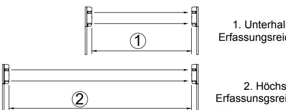

 1. Unterhalb der Erfassungsreichweite

2. Höchste Erfassunsgsreichweite

Ungefähr fünf Sekunden nach Anbringung der Abdeckung ertönt am Empfänger ein Signalton. Dieser zeigt an, dass die automatische Verstärkung festgelegt wurde. Siehe Tabelle *Einstellung der automatischen Verstärkung* unten.

**Tabelle 3: Einstellung der automatischen Verstärkung** 

| Signalton                    | Bedeutung                                                            | Ergeb nis | Ursache                                                                                                                | Abhilfe                                                                                                                                                                                                      |
|------------------------------|----------------------------------------------------------------------|--------------|------------------------------------------------------------------------------------------------------------------------|--------------------------------------------------------------------------------------------------------------------------------------------------------------------------------------------------------------|
| Ein Impuls (Ton)          | Optimale Empfindlichk eit festgelegt.                          | OK           | _                                                                                                                      | _                                                                                                                                                                                                            |
| Dauerton (20 Sekunden) | Festlegung der optimalen Empfindlichk eit nicht möglich. | Nicht gut | Strahl ist nach Anbringen der Abdeckung unterbroche n.                                               | Beseitigen Sie eventuelle Hindernisse und achten Sie darauf, den Strahl nicht mit der Hand zu unterbrechen, während Sie die Abdeckung in ihrer vorläufigen Position halten. |
|                              |                                                                      |              | Strahlen sind falsch ausgerichtet und Anzeige für die Empfindlichk eitsabschwä chung leuchtet. | Überprüfen Sie die Einstellungen der Lichtschrankeni ntensität am Sender bei angebrachter Abdeckung und richten Sie die Lichtschranke neu aus.                              |

**Hinweis:** Unabhängig davon, ob der Signalschalter (Schalter für die akustische Ausrichtungsanzeige) auf EIN oder AUS gestellt wurde, ertönt ein Signalton.

**Hinweis:** Die Einstellung der automatischen Verstärkung wird gespeichert, selbst bei Unterbrechung der Spannungsversorgung.

**Hinweis:** Bei Entfernung der Abdeckung bei vorliegender Spannungsversorgung oder bei einer Unterbrechung der Spannungsversorgung für einen Zeitraum von mehr als zwei Wochen (bei angebrachter Abdeckung) stellt sich die automatische Verstärkung von selbst auf maximale Empfindlichkeit. (Verstärkung wird bei Wiederherstellung der Spannungsversorgung automatisch gespeichert).

#### **Signaltöne**

Diese Funktion bietet Signal- und Testtöne für die in der Tabelle *Signaltöne* unten genannten Punkte.

**Tabelle 4: Signaltöne** 

| Test/Signal                   | Schalter akustisch e Ausrichtu ngsanzeig e | Anderer Status                                                                 | Beschreibung                                                                                                                                                                                               |
|-------------------------------|-----------------------------------------------------------|-----------------------------------------------------------------------------------|------------------------------------------------------------------------------------------------------------------------------------------------------------------------------------------------------------|
| Lichtschranke nausrichtung | EIN                                                       | Empfängera bdeckung nicht angebracht                                     | Überwachung der Empfangsstärke. Tonhöhe steigt mit zunehmender Empfangsverbesserung.                                                                                                           |
|                               |                                                           |                                                                                   | Hinweis: Bei leuchtender Anzeige für die Empfindlichkeitsabschwäc hung oder angebrachter Abdeckung ist kein Signalton zu hören. .                                                           |
| Aktivierung "Automatisch   | EIN/AUS Nach Anbringen der Abdeckung.         |                                                                                   | Kurzer Ton zeigt Aktivierung an.                                                                                                                                                                        |
| e Verstärkung"             |                                                           | Dauerton (20s) zeigt an, dass eine erneute Ausrichtung erforderlich ist. |                                                                                                                                                                                                            |
| Gehtest                       | EIN                                                       | Für ungefähr 5 min nach aktivierter Verstärkung.                         | Signalton ist mit Alarmanzeige verbunden.                                                                                                                                                               |
|                               |                                                           |                                                                                   | Beide werden gleichzeitig ausgelöst.                                                                                                                                                                    |
| Alarmspeiche r             | EIN                                                       | Auf manuellen Speicher eingestellt.                                      | Signalton wird bei Eintreten von Alarmzustand ausgelöst.                                                                                                                                             |
|                               |                                                           |                                                                                   | Hinweis: Für die meisten Sicherheitsanwendungen ist diese Konfiguration nicht empfehlenswert. Der Signalton könnte den Eindringling darauf aufmerksam machen, dass er entdeckt wurde. |

#### **Funktion zur Änderung der Reaktionszeit**

Siehe Abbildung 20.

Reaktionszeit (s) 1. Reaktionszeit 0,05s: Rennen. 2. Reaktionszeit 0,3s: schnelles Gehen; 3. Reaktionszeit 0,7s: Gehen

Mithilfe dieser Funktion lässt sich die Reaktionszeit der Lichtschranke optimal auf die Anwendung abstimmen. Objekte mit einer höheren Geschwindigkeit als durch die festgelegte Reaktionszeit angegeben werden vom Gerät nicht erkannt.

#### **Disqualifikationsmodul**

Ein Disqualifikationssignal wird ausgelöst, falls sich die Stärke des Empfangsstrahls um 50% oder mehr verringert. Das Modul "achtet" dabei auf eine allmähliche Abschwächung des Empfangsstrahls, was auf extrem schlechte Wetterverhältnisse hinweist. Wählen Sie NC- oder NO-Signalausgang. Kontaktkapazität 30V AC/V DC, 1A oder geringer.

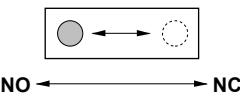

#### **Funktion "Alarmspeicher"**

#### Siehe Abbildung 22.

**Erläuterung zu Abbildung 22** 

| 1 | Alarmausgang                                                              |
|---|---------------------------------------------------------------------------|
| 2 | LED-Speicheranzeige                                                       |
| 3 | Alarmspeichereingang                                                      |
| 4 | Logik L                                                                   |
| 5 | Logik H                                                                   |
| 6 | Signalton bei Strahlunterbrechung (akustische Ausrichtungsanzeige EIN) |

Die Anzeige "Alarmspeicher" weist auf den ausgelösten Sensor hin, falls sich in einer Meldergruppe zwei oder mehr Sensoren befinden. Es kann auch ein Signalton festgelegt werden. Das Zurücksetzen kann automatisch oder manuell erfolgen.

**Automatischer Reset:** Die Speicheranzeige leuchtet nach einem Alarmsignal für fünf Minuten und blinkt anschließend 55 Minuten lang, bevor sie wieder in den normalen Modus zurückkehrt. Bei Auslösung weiterer Alarmsignale wiederholt sich dieser Vorgang.

**Manuell:** Die Speicheranzeige leuchtet bei umgeschalteter Reset-Taste. Der Speicher wird manuell durch Öffnen (L) oder Schließen (H) der Reset-Taste zurückgesetzt. Die Reset-Taste kann auch abgesetzt an beliebiger Stelle innerhalb des Sicherungsbereiches platziert werden.

**Alarmton mit Anzeige:** Falls zusätzlich zur Speicheranzeige ein akustisches Signal gewünscht wird, kann der Schalter für die akustische Ausrichtungsanzeige auf EIN gestellt werden.

**Hinweis:** Stellen Sie den Schalter für die Speicherauswahl auf "Manuell", falls die Funktion "Alarmspeicher" nicht verwendet wird, und lassen Sie diesen Anschluss unbelegt.

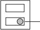

Speicherauswahl (Automatischer Reset – Manuell) Manuell-Schalter für Speicherlogik (H - L)

## **Außenmaße**

Siehe Abbildung 23.

## **Fehlerbehebung**

| Problem                         | Mögliche Ursache                                   | Abhilfe                                        |
|---------------------------------|----------------------------------------------------|------------------------------------------------|
| Betriebsan zeige             | Keine Spannungsversorgung.                      | Schalten Sie die Spannungsversorgung ein.   |
| leuchtet nicht.              | Wackelkontakt oder Kabelbruch (Kurzschluss). | Prüfen und korrigieren Sie die Verkabelung. |
| Alarmanzei ge leuchtet       | Keine Spannungsversorgung.                      | Schalten Sie die Spannungsversorgung ein.   |
| nicht bei unterbroch ener | Wackelkontakt oder Kabelbruch (Kurzschluss). | Prüfen und korrigieren Sie die Verkabelung. |

| Problem                                   | Mögliche Ursache                                                                                                                                   | Abhilfe                                                                                                                                                                |
|-------------------------------------------|----------------------------------------------------------------------------------------------------------------------------------------------------|------------------------------------------------------------------------------------------------------------------------------------------------------------------------|
| Lichtschran ke.                        | Strahl wird zu einem anderen Objekt reflektiert und trifft von dort auf Empfänger.                                                        | Entfernen Sie das reflektierende Objekt oder richten Sie den Strahl neu aus.                                                                                  |
|                                           | Die beiden Strahlen werden nicht gleichzeitig unterbrochen.                                                                                  | Unterbrechen Sie die beiden Strahlen gleichzeitig.                                                                                                                  |
|                                           | Die Dauer der Strahlunterbrechung liegt unter der festgelegten Reaktionszeit.                                                             | Stellen Sie die Reaktionszeit neu ein.                                                                                                                              |
| Alarmanzei ge leuchtet kontinuierli | Fehler bei Lichtschrankenausrichtun g.                                                                                                       | Überprüfen Sie die Ausrichtung und passen Sie diese neu an.                                                                                                      |
| ch.                                       | Zwischen Sender und Empfänger befindet sich ein Schatten werfendes Objekt.                                                                | Entfernen Sie dieses.                                                                                                                                                  |
|                                           | Verschmutzte Optik.                                                                                                                                | Reinigen Sie die Optik mit einem weichen Tuch.                                                                                                                      |
|                                           | Sender und Empfänger sind nicht auf den gleichen Frequenzkanal eingestellt.                                                               | Stellen Sie beide auf den gleichen Kanal ein.                                                                                                                       |
| Nur zeitweilig                         | Wackelkontakt.                                                                                                                                     | Erneute Überprüfung der Verkabelung.                                                                                                                                |
| auftretende r Alarm                    | Änderung der Versorgungsspannung.                                                                                                               | Stabilisieren Sie die Versorgungsspannung.                                                                                                                          |
|                                           | Zwischen Sender und Empfänger befindet sich ein Schatten werfendes Objekt.                                                                | Entfernen Sie dieses.                                                                                                                                                  |
|                                           | In der Nähe von Sender und Empfänger befindet sich eine starke elektromagnetische Störquelle, beispielsweise eine Kraftmaschine. | Installieren Sie die Lichtschranke an einem anderen Ort.                                                                                                         |
|                                           | Instabile Installation von Sender und Empfänger.                                                                                                | Sorgen Sie für die erforderliche Stabilität.                                                                                                                        |
|                                           | Verschmutzte Sender oder Empfängeroptik.                                                                                                        | Reinigen Sie die Optik mit einem weichen Tuch.                                                                                                                      |
|                                           | Falsche Ausrichtung.                                                                                                                               | Überprüfen Sie die Ausrichtung und passen Sie diese neu an.                                                                                                      |
|                                           | Unter Umständen werden die beiden Strahlen von Kleintieren durchquert.                                                                       | Erhöhen Sie die Reaktionszeit. (nicht möglich an Standorten, an denen ein möglicher Eindringling die Lichtschranke in vollem Lauf passieren könnte). |
|                                           | Schalter für Lichtschrankenintensität ist auf "L" gestellt, was keine ausreichende Empfindlichkeitsberichtig ung ermöglicht.        | Stellen Sie den Schalter für Lichtschrankenintensität auf "H" und aktivieren Sie nach Anbringen der Abdeckung die automatische Verstärkung.             |

## **Technische Daten**

| Modell                             | PB601                                                                                                                                                                                                                        | PB611                                       | PB621                                       |  |
|------------------------------------|------------------------------------------------------------------------------------------------------------------------------------------------------------------------------------------------------------------------------|---------------------------------------------|---------------------------------------------|--|
| Überwachung system              | Nah-Infrarotsystem für Strahlunterbrechung. (gleichzeitige Unterbrechung von 4 TX-RX-Strahlen)                                                                                                                            |                                             |                                             |  |
| Infrarotstrahl                     |                                                                                                                                                                                                                              | Impulsstrahl, Doppelmodulation              |                                             |  |
| Erfassungs reichweite           | Außenbereich ≤50m                                                                                                                                                                                                         | Außenbereich ≤100m                       | Außenbereich ≤200m                       |  |
| Max. IR Reichweite              | das Zehnfache (500m)                                                                                                                                                                                                      | das Zehnfache (1000m)                    | das Zehnfache (2000m)                    |  |
| Reaktionszeit                      | 50 - 700ms, variabel (Standard = 50ms)                                                                                                                                                                                       |                                             |                                             |  |
| Spannungs versorgung            | 12 - 30V DC (keine Polarität)                                                                                                                                                                                                |                                             |                                             |  |
| Stromaufnah me                  | ≤;60mA bei Schutzabstand (max. ≤95mA)                                                                                                                                                                                  | ≤75mA bei Schutzabstand (max. ≤105mA) | ≤80mA bei Schutzabstand (max. ≤120mA) |  |
| Alarmausgan                        | Potentialfreier Relaisausgang 1C                                                                                                                                                                                             |                                             |                                             |  |
| g                                  | Kontaktwirkung: Unterbrechungszeit + Verzögerungszeit (1 - 3s)                                                                                                                                                            |                                             |                                             |  |
|                                    | Schaltleistung: 30V AC/DC, 1A oder niedriger                                                                                                                                                                                 |                                             |                                             |  |
| Sabotageaus                        | Potentialfreies Relais 1b (N/C)                                                                                                                                                                                              |                                             |                                             |  |
| gang                               | Aktivierung bei Entfernung der Abdeckung                                                                                                                                                                                     |                                             |                                             |  |
|                                    | Schaltleistung: 30V AC/DC, 0,1mA oder niedriger                                                                                                                                                                              |                                             |                                             |  |
| Alarmanzeige                       | Rote LED (Empfänger). EIN: bei Auslösung eines Alarms                                                                                                                                                                     |                                             |                                             |  |
| Empfindlichke itsanzeige        | Rote LED (Empfänger). EIN: bei Abschwächung eines Strahls                                                                                                                                                                 |                                             |                                             |  |
| Funktionen                         | Modulierte Lichtschrankenfrequenzauswahl. Signaltöne. Umgebungssensoren. Auswahl der Lichtschrankenintensität. Alarmspeicheranzeige. Programmierte AGC. Funktion für automatische Verstärkung. Monitoranschluss. |                                             |                                             |  |
| Strahlanpass ung                | Horizontal: ±90°; Vertikal: ±10°                                                                                                                                                                                             |                                             |                                             |  |
| Umgebungste mperaturberei ch | −35°C bis +66°C                                                                                                                                                                                                              |                                             |                                             |  |
| Montagepositi onen              | Außenbereich:                                                                                                                                                                                                                |                                             |                                             |  |
| Verkabelung                        | Anschlüsse                                                                                                                                                                                                                   |                                             |                                             |  |
| Gewicht                            | Sender: 1200g. Empfänger: 1300g                                                                                                                                                                                              |                                             |                                             |  |
| Ausführung                         | PC-Harz (weinrot)                                                                                                                                                                                                            |                                             |                                             |  |

## **Rechtliche Hinweise**

| Hersteller      | UTC Fire & Security Americas Corporation, Inc. 1275 Red Fox Rd., Arden Hills, MN 55112-6943, USA                                                                                                  |  |
|-----------------|---------------------------------------------------------------------------------------------------------------------------------------------------------------------------------------------------------|--|
|                 | In der EU autorisierter Hersteller: UTC Fire & Security B.V., Kelvinstraat 7, 6003 DH Weert, Niederlande                                                                                          |  |
| Zertifizierung  |                                                                                                                                                                                                         |  |
| Umgebungsklasse | Klasse 4                                                                                                                                                                                                |  |
| EG-Richtlinien  | 2002/95/EC (RoHs-Richtlinie): Hiermit erklärt UTC Fire & Security, dass dieses Gerät die grundlegenden Anforderungen der Richtlinie 2002/95/EC sowie andere relevante Bestimmungen erfüllt. |  |

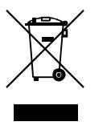

2002/96/EC (WEEE-Richtlinie): Mit diesem Symbol gekennzeichnete Produkte dürfen nicht in den öffentlichen europäischen Entsorgungssystemen entsorgt werden. Geben Sie bei Kauf eines ähnlichen neuen Produkts das alte Produkt zwecks ordnungsgemäßer Entsorgung an den örtlichen Lieferanten zurück oder geben Sie es an einer entsprechenden Annahmestelle ab. Weitere Informationen finden Sie unter: www.recyclethis.info.

2004/108/EC (EMC-Richtlinie): Hiermit erklärt UTC Fire & Security, dass dieses Gerät die grundlegenden Anforderungen der Richtlinie 2004/108/EC sowie andere relevante Bestimmungen erfüllt.

## **Kontaktinformationen**

Kontaktinformationen finden Sie auf unserer Website unter: www.utcfireandsecurity.com.

# **ES: Hoja de instalación**

## **Descripción de la pieza**

**Figura 1:** el producto se suministra con los siguientes elementos. Compruebe que se incluyen todos.

| 1  | Cubierta                                               |
|----|--------------------------------------------------------|
| 2  | Tornillo de ajuste fino horizontal                     |
| 3  | Tornillo de ajuste vertical                            |
| 4  | Terminales                                             |
| 5  | Interruptor de tamper (solo el receptor)               |
| 6  | Interruptor de bloqueo de ganancia (solo el receptor)  |
| 7  | Indicaciones de función (vea la figura 2 más adelante) |
| 8  | Espejo                                                 |
| 9  | Visor                                                  |
| 10 | Dial de ajuste                                         |
| 11 | Placa de sombreado                                     |
| 12 | Placa de montaje                                       |
| 13 | Soporte                                                |
| 14 | 8 tornillos roscantes (Ø 4 x 30)                       |
| 15 | 8 tornillos de cabeza avellanada ovalados              |

**Figura 2:** funciones/indicaciones del transmisor (TX) y del receptor (RX).

| 1 | LED de funcionamiento                                                                               |
|---|-----------------------------------------------------------------------------------------------------|
| 2 | Potencia del haz (configurado en H (alto) de fábrica)                                               |
| 3 | Canal del haz (configurado en 1 de fábrica)                                                         |
| 4 | LED de atenuación de sensibilidad                                                                   |
| 5 | LED de alarma                                                                                       |
| 6 | Interruptor de señal acústica (tono de alineación) (configurado en OFF (desactivado) de fábrica) |
| 7 | Ajuste del tiempo de respuesta (configurado en 50 ms de fábrica)                                 |
| 8 | Clavija del monitor                                                                                 |

| 9  | LED de memoria                                                                      |
|----|-------------------------------------------------------------------------------------|
| 10 | Canal del haz (frecuencia 1-4, configurado en el canal 1 de fábrica)             |
| 11 | Selector de salida medioambiental (configurado en N/C de fábrica)                |
| 12 | Selector de memoria (configurado en manual de fábrica)                              |
| 13 | Interruptor lógico de memoria manual-remoto (configurado en L (bajo) de fábrica) |
| 14 | Terminal de salida medioambiental                                                   |
| 15 | Terminal de entrada de control remoto.                                              |
|    |                                                                                     |

### **Instalación de los sensores**

#### **Directrices para instalar los sensores**

**Figura 3:** qué se debe hacer y qué no al instalar el sensor.

Evite las obstrucciones (piense en realizar cambios estacionales). Evite la luz demasiado fuerte. Evite salpicar la unidad. Evite las superficies inestables.

**Figura 4:** cálculo de la expansión del haz (B).

(A= distancia de protección) Hay que tener en cuenta la dispersión del haz de cada tipo de modelo para evitar el posible reflejo de la superficie del suelo o los objetos cercanos.

**Figura 5:** altura de instalación recomendada.

#### **Cableado del sistema**

Conecte la fuente de alimentación tanto del transmisor como del receptor. El cableado depende del número de sensores o zonas. La longitud del cable depende también de la distancia que haya entre el sensor y la fuente de alimentación/panel de control. El cableado debe estar conforme con NFPA-70 del Código Eléctrico Nacional.

**Precaución:** la salida de la señal del receptor no se puede utilizar independientemente para los elementos ópticos superiores o inferiores, solamente como un conjunto. El cableado de exterior debe ser de PVC si se utiliza bajo tierra o se utiliza un cable enterrado. Utilice un conducto para el cableado que va sobre el suelo.

**Figura 6:** ejemplos de cableado.

Ejemplo 1: conexión estándar.

Ejemplo 2: cuando dos o más sensores están conectados en la misma zona.

Ejemplo 3: cuando dos o más sensores están en zonas separadas.

Ejemplo 4: conexión estándar en dos apilados.

Ejemplo 5: cuando se utilizan el módulo medioambiental y la memoria de alarma manual.

Consulte la sección *Descripción de funciones* para seleccionar la frecuencia del haz.

**Figura 7:** distancia del cableado entre el sensor y el panel de control (m).

**Nota:** la distancia máxima de cableado cuando están conectados dos o más conjuntos es el valor que aparece dividido por el número de conjuntos.

**Nota:** la línea de la señal puede conectarse con un cable telefónico AWG22 (diámetro 0,65 mm) hasta de 1000 m aproximadamente.

**Batería auxiliar:** compruebe que el panel de control está equipado con una batería auxiliar apropiada y un circuito de carga. Utilice una batería de níquel-cadmio o de plomo de 12 V (como mínimo) con una capacidad mínima de 0,5 AH.

#### **Disposición de los terminales**

Consulte la figura 8.

**Descripción de la figura 8** 

| 1 | NC (normalmente cerrado) o NO (normalmente abierto) medioambiental, 30 VCA/VCC 1A o menos |
|---|----------------------------------------------------------------------------------------------|
| 2 | Memoria de alarma                                                                            |
| 3 | Interruptor de restablecimiento remoto                                                       |
| 4 | Fuente de alimentación y terminal                                                            |

#### **Montaje de las unidades**

Las unidades pueden montarse fácilmente en un poste o superficie plana. Con la ayuda del dial de ajuste y los tornillos, ajuste los espejos verticalmente (A) y horizontalmente (B) para que la unidad pueda funcionar en todas las direcciones (figura 9). Vea los ejemplos 1-3.

**Instalación de una unidad montada sobre una pared** 

- 1 Retire la cubierta quitando los tornillos que se encuentran en la base de la misma (figura 10).
- 2 Afloje los tornillos que fijan el cuerpo del sensor a la placa de montaje y deslice la placa hacia abajo para desprenderla.
- 3 Perfore la pared. Utilice la placa de montaje como plantilla para marcar la ubicación de los orificios para los tornillos. Deje 20 mm por encima de la placa y 25 mm por debajo para facilitar el desprendimiento tras la instalación. Figura 11. 1: pared de madera. 2: Pared de cemento: consulte las especificaciones de la clavija de sujeción utilizada.
- 4. Instalar el sensor (figura 12):

- Inserte los tornillos de montaje, dejando 15 mm sin enroscar.

- Coloque la placa de montaje sobre los tornillos sin enroscar.
- Pase el cable entre ambos.

- Apriete los tornillos y tape la abertura del orificio para los cables.

- Conecte el terminal.
- Coloque la cubierta.

**Nota:** la unidad no se puede instalar en una caja de toma de corriente. Sin embargo, la caja de toma de corriente puede utilizarse para situar los terminales de conexión.

#### **Instalación de una unidad montada en poste**

- 1 Retire la cubierta quitando los tornillos que se encuentran en la base de la misma (figura 10).
- 3 Haga un orificio para el cableado en el poste y pase el cable a través de él. Coloque una tapa para el poste en la parte superior del mismo. La unidad se monta en un poste de 42-44 mm O.D. (diámetro exterior). Utilice un CONDUCTO RÍGIDO o equivalente (figura 13). Haga un agujero de 6 mm para el cableado en el poste en que se va a montar el haz de PE. Lime los restos y los bordes afilados alrededor del agujero para evitar que las asperezas de los bordes dañen el cable.
- 4. Instalar el sensor en el poste (figura 14, 1: tapar la abertura del orificio):

- Coloque soportes en U en el poste y fíjelo a la placa de montaje con tornillos.

- Coloque el cuerpo del sensor.
- Pase el cable por el medio y tape la abertura del orificio para los cables.

- Conecte los terminales.
- Coloque la cubierta (quite los bloqueadores (2) de la cubierta para adaptarla a la configuración).

#### **Instalación de una unidad adosada a un poste por las partes posteriores**

Siga el mismo procedimiento que para el montaje en poste descrito anteriormente, pero enganche cuatro soportes en U a los postes en dos pares, uno encima del otro, en direccciones opuestas (figura 15).

### **Configuración de funciones y alineación del haz**

- 1 Conecte la unidad a la fuente de alimentación con la cubierta quitada.
- 2 Ajuste las opciones de función. Consulte la sección *Descripción de funciones* para obtener una explicación detallada de cada opción.

| Posición | Función                           | Interruptores de función                            |
|----------|-----------------------------------|-----------------------------------------------------|
| TX y RX  | Canal de haz (frecuencia)      | Canal 1 … Canal 2                                   |
|          |                                   | Canal 3 … Canal 4                                   |
| TX solo  | Potencia del haz                  | Alta … Baja                                         |
| RX solo  | Interruptor de señal acústica  | Activado … Desactivado                              |
|          | Ajuste del tiempo de respuesta | 50 ms (estándar)                                    |
|          |                                   | 300 ms … 700 ms                                     |
|          |                                   | Otros                                               |
|          | Salida medioambiental          | NO(normalmente abierto) NC (normalmente cerrado) |
|          | Memoria de alarma                 | Restablecimiento automático                         |
|          |                                   | Manual Alto                                      |
|          |                                   | Bajo                                                |
|          |                                   | Sin utilización                                     |

- 3 Ajuste el ángulo óptico (vea la figura 16) mirando a través del visor desde cualquier lado de la unidad óptica del transmisor hasta que el receptor sea visible. Repita este
procedimiento para las unidades ópticas inferiores y, a continuación, repítalo en el receptor.

**Descripción de la figura 16** 

| 1 | Visor                              |
|---|------------------------------------|
| 2 | Tornillo de ajuste fino horizontal |
| 3 | Tornillo de ajuste vertical        |
| 4 | Dial de ajuste                     |

- 4. Realice un ajuste con precisión (vea la figura 17). La alineación inicial del haz se puede lograr utilizando el indicador de tono de la alineación.
#### **Descripción de la figura 17**

| 1 | LED de atenuación de sensibilidad (se ilumina cuando la recepción del haz se encuentra por debajo del nivel mínimo) |  |
|---|------------------------------------------------------------------------------------------------------------------------|--|
| 2 | Interruptor del tono de alineación                                                                                     |  |
| 3 | Clavija del monitor                                                                                                    |  |

 4.1. Coloque las placas de sombreado (almacenadas en los laterales de TX y RX) en los elementos ópticos inferiores de TX y RX.

 4.2. Ponga el interruptor de tono de la alineación del receptor en ON (activado).

 4.3. Ajuste los elementos ópticos con los tornillos de ajuste hasta que se alcance el tono más alto.

**Nota:** no habrá sonido si el LED de atenuación de sensibilidad se ilumina.

 4.4. Coloque las placas de sombreado sobre los elementos ópticos superiores de TX y RX y repita el ajuste.

 4.5. Tras el ajuste, coloque de nuevo la placa de sombreado en las áreas de almacenamiento de TX y RX.

 4.6. Ponga el indicador de tono de la alineación en OFF (desactivado).

**Uso de un voltímetro para la alineación del haz: (ver figura 18)** 

Se puede conseguir una alineación precisa utilizando un voltímetro (10 VCC). Conecte los cables del voltímetro en las clavijas del monitor del receptor. Consulte la tabla que aparece a continuación para ver la tensión de salida.

| Lectura de la tensión | Alineación                |
|-----------------------|---------------------------|
| 2,7 V o más           | La mejor                  |
| 2,0 - 2,7 V           | Buena                     |
| 2,0 V o menos         | Escasa. Volver a ajustar. |

- 5. Coloque de nuevo la cubierta
5.1. Coloque primero la cubierta del transmisor.

 5.2. Confirme que el LED de atenuación de sensibilidad del receptor se mantiene en OFF (desactivado). Coloque de nuevo la cubierta del receptor pero no la fije.

 5.3. Se producirá una señal acústica al cabo de 5 segundos. Cuando ocurra esto, fije la cubierta del receptor con los tornillos.

**Nota:** la asignación de sensibilidad se realiza automáticamente cuando se inicia la señal acústica.

**Nota:** si el interruptor de alineación del tono se ha quedado accidentalmente en ON (activado), el tono se detendrá cuando la cubierta del receptor esté precolocada.

 5.4. Si se produce un pitido 'continuo, quite la cubierta del receptor y haga el ajuste de nuevo. Consulte la sección *Función de bloqueo automático de ganancia* para obtener más información.

 5.5. Coloque las cubiertas tras configurar la ganancia automática.

## **Comprobación del funcionamiento**

#### Consulte la figura 19.

Cuando finalice la instalación, la alineación y la configuración de la ganancia automática, compruebe el funcionamiento mediante una prueba de paseo del haz. Se pueden utilizar dos métodos:

- 1. Solo LED de alarma.
- 2 Comprobación del sonido y el LED de alarma mediante el interruptor de alineación del tono. Si el interruptor de alineación del tono está configurado en ON (activado), el tono se detendrá cuando la cubierta se coloque de nuevo. Sin embargo, el tono será eficaz para una prueba de funcionamiento acústico durante cinco minutos cuando la ganancia automática esté bloqueada.

## **Descripción de las funciones**

#### **Selección de frecuencia de cuatro canales**

#### Consulte la figura 21.

Los pares de haz se pueden establecer en diversos niveles de frecuencia para evitar la diafonía entre las unidades que están apiladas, en línea, o con otro tipo de configuración donde existe la posibilidad de desbordamiento de transmisión de un haz a otro. Configure el nivel de frecuencia de este modo:

**Descripción de la figura 17** 

| 1 | Protección de línea                    |
|---|----------------------------------------|
| 2 | Protección de dos apilados             |
| 3 | Protección de línea y de dos apilados  |
| 4 | Protección de perímetro                |
| 5 | Protección de perímetro y dos apilados |
|   |                                        |

**Nota:** el transmisor y el receptor deben estar configurados en el mismo canal. Los pares de TX/RX no se podrán configurar si no se encuentran en el mismo canal.

**Nota:** se recomienda utilizar un voltímetro al realizar la alineación para garantizar el máximo nivel de estabilidad.

**Nota:** los sensores superior e inferior deberían tener el mismo número de modelo en la configuración apilada.

**Selección de potencia de haz** 

Esta opción permite seleccionar el campo de la intensidad apropiada para la aplicación. Para distancias

significativamente inferiores a la distancia de protección especificada, reduzca la intensidad del haz para eliminar posibles problemas de reflexión. Para zonas que alcanzan la distancia máxima de protección, ajuste el nivel del haz al nivel más alto.

| Modelo | Potencia del haz (m) |         |  |
|--------|----------------------|---------|--|
|        | Baja                 | Alta    |  |
| PB601  | ≤ 25                 | 25-50   |  |
| PB611  | ≤ 75                 | 75-100  |  |
| PB621  | ≤ 150                | 150-200 |  |

#### **Función de bloqueo automático de ganancia**

El bloqueo automático de ganancia normaliza el nivel de respuesta y de tolerancia de las unidades sin tener en cuenta las distancias de instalación variables. Como se muestra en las siguientes figuras, las dos situaciones tienen exactamente los mismos niveles de respuesta a pesar de que las distancias son diferentes.

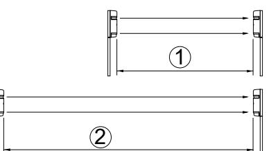

 1. Por debajo de la distancia de protección 2. Distancia máxima de protección

El receptor emite una 'señal acústica aproximadamente cinco segundos después de colocar la cubierta en su posición. Este tono indica que se ha configurado la ganancia automática. Consulte la tabla *Configuración de ganancia automática* que se muestra a continuación.

#### **Tabla 5: configuración de ganancia automática**

| Tono                                 | Indicación                                                                                                                                        | Result ado                                                                                                                                              | Causa                                                                                                        | Remedio                                                                                                                                                        |
|--------------------------------------|---------------------------------------------------------------------------------------------------------------------------------------------------|------------------------------------------------------------------------------------------------------------------------------------------------------------|--------------------------------------------------------------------------------------------------------------|----------------------------------------------------------------------------------------------------------------------------------------------------------------|
| Una pulsación (pitido)         | Se ha configurado una sensibilidad óptima.                                                                                            | OK                                                                                                                                                         | _                                                                                                            | _                                                                                                                                                              |
| Tono continuo (20 segundos) | No se puede incorre El haz se configurar cto interrumpe una cuando se sensibilidad recoloca la óptima. cubierta. | Quite los obstáculos y asegúrese que la mano no está interrumpiendo el haz cuando se mantiene la tapa en una posición temporal. |                                                                                                              |                                                                                                                                                                |
|                                      |                                                                                                                                                   |                                                                                                                                                            | Los haces no están bien alineados y el LED de atenuación de sensibilidad se ilumina. | Compruebe la configuración de la potencia del haz en el transmisor que tiene la cubierta colocada y reajuste la alineación del haz. |

**Nota:** se genera un tono independientemente de si el interruptor de la señal acústica (tono de alineación) está configurado en ON (activado) u OFF (desactivado).

**Nota:** la configuración de ganancia automática está bloqueada incluso si se detiene la fuente de alimentación.

**Nota:** si la cubierta del receptor se quita miestras se suministra energía, o si el dispositivo permanece sin suministro eléctrico por un período superior a dos semanas (pero la cubierta se mantiene en su sitio), la ganancia automática se restablece automáticamente a la máxima sensibilidad. (La ganancia se bloquea automáticamente cuando vuelve el suministro eléctrico).

#### **indicador de tono**

Esta función proporciona pruebas o señales audibles para los elementos enumerados en la tabla *Indicador de tono* que aparece a continuación.

#### **Tabla 6: indicador de tono**

| Prueba/Seña l                     | Interrupto r del tono de alineación | Otra condición                                                | Descripción                                                                                                                                                        |
|--------------------------------------|----------------------------------------------|------------------------------------------------------------------|--------------------------------------------------------------------------------------------------------------------------------------------------------------------|
| Alineación del haz                | ON (activado)                             | Sin cubierta del receptor                                     | Intensidad de recepción supervisada.                                                                                                                            |
|                                      |                                              |                                                                  | La intensidad del tono aumenta a medida que mejora la recepción.                                                                                             |
|                                      |                                              |                                                                  | Nota: no habrá ningún tono si el LED de atenuación de sensibilidad está iluminado o si la cubierta del receptor está colocada. .                 |
| Bloqueo automático de ganancia | ON/OFF (activado/d esactivado )     | Después de colocar la cubierta.                            | Un tono breve indica que se ha configurado el bloqueo.                                                                                                       |
|                                      |                                              |                                                                  | Un tono continuo (20 segundos) indica reajuste.                                                                                                                 |
| Prueba de paseo                   | ON (activado)                             | Durante 5 min aprox. tras el bloqueo de la ganancia. | El tono está vinculado al LED de la alarma.                                                                                                                     |
|                                      |                                              |                                                                  | Ambos se activan a la vez.                                                                                                                                      |
| Memoria de alarma                 | ON (activado)                             | Configurar en memoria manual.                              | Se genera un pitido si se producen las condiciones de la alarma.                                                                                             |
|                                      |                                              |                                                                  | Nota: esta configuración no está recomendada para la mayoría de aplicaciones de seguridad. El tono podría alertar al intruso sobre la detección. |

#### **Función de cambio de tiempo de respuesta**

Consulte la figura 20.

Tiempo de respuesta (seg). 1. Respuesta 0,05 seg: corriendo. 2. Respuesta 0,3 seg: caminando rápidamente, 3. Respuesta 0,7 seg: caminando.

Esta función se utiliza para modificar el tiempo de respuesta del haz para adaptarse a la aplicación del mejor modo posible. La unidad no detecta los objetos que pasan más rápido que el tiempo de respuesta.

#### **Módulo medioambiental**

La señal medioambiental se activa si el nivel de recepción del haz se reduce en un 50% o más. El módulo "vigila" si se produce una degradación progresiva de la recepción del haz, lo que indicaría condiciones climáticas extremadamente adversas. Seleccione la salida de señal NC (normalmance cerrado) o NO (normalmente abierto). Capacidad de contraste 30 VCA/VCC, 1A o menos.

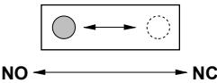

#### **Función de memoria de alarma**

Consulte la figura 22.

| Descripción de la figura 22 |  |  |  |
|-----------------------------|--|--|--|
|                             |  |  |  |

| 1 | Salida de alarma                                                  |
|---|-------------------------------------------------------------------|
| 2 | LED de memoria                                                    |
| 3 | Entrada de memoria de alarma                                      |
| 4 | L Lógico                                                          |
| 5 | H lógico                                                          |
| 6 | Señal acústica con interrupción de haz (tono de alineación ON) |

El LED de memoria de alarma muestra qué sensor se ha activado cuando dos o más sensores se encuentran en una misma zona. Se puede seleccionar también un tono audible. El restablecimiento puede ser automático o manual.

**Restablecimiento automático:** el LED de memoria se iluminará durante cinco minutos tras una señal de alarma y, a continuación, seguirá parpadeando durante 55 minutos antes de volver al modo normal. Si se activan señales de alarma adicionales, el proceso se repite.

**Manual:** el LED de memoria se ilumina con el botón de restablecimiento activado. La memoria se restablece manualmente mediante un botón de restablecimiento abierto (L) o de cierre (H). El botón de restablecimiento se debe colocar en una ubicación estratégica en las instalaciones.

**Alarma de tono con LED:** si desea que se emita una señal audible cuando se ilumine el LED de memoria, ponga el interruptor de tono de alineación en ON (activado).

**Nota:** si no se utiliza la función de memoria de alarma, ponga el selector de memoria en "manual" y deje el terminal del receptor desconectado.

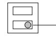

Selector de memoria (restablecimiento automático manual) Interruptor lógico de memoria manual (H - L)

### **Dimensiones externas**

Consulte la figura 23.

### **Resolver problemas**

| Problema                                | Causa posible                                                                                                                    | Remedio                                                                                                                                                                |  |
|-----------------------------------------|----------------------------------------------------------------------------------------------------------------------------------|------------------------------------------------------------------------------------------------------------------------------------------------------------------------|--|
| El LED de funcionami                 | No hay alimentación eléctrica.                                                                                                | Conecte el dispositivo.                                                                                                                                                |  |
| ento no se ilumina.                  | Conexión incorrecta del cableado o cable roto (cortocircuito).                                                             | Revise y repare el cableado.                                                                                                                                           |  |
| El LED de la alarma                  | No hay alimentación eléctrica.                                                                                                | Conecte el dispositivo.                                                                                                                                                |  |
| no se ilumina cuando el haz se | Conexión de mala calidad del cableado o cable roto (cortocircuito).                                                        | Revise y repare el cableado.                                                                                                                                        |  |
| interrumpe.                             | El haz se refleja en otro objeto y se envía al receptor.                                                                   | Quite el objeto que provoca el reflejo o cambie la dirección del haz.                                                                                            |  |
|                                         | No se interrumpen dos haces de manera simultánea.                                                                          | Interrumpa dos haces de manera simultánea.                                                                                                                          |  |
|                                         | El tiempo de interrupción del haz es inferior al tiempo de respuesta establecido.                                       | Ajuste el tiempo de respuesta del haz.                                                                                                                              |  |
| El LED de alarma                     | El haz no tiene una alineación correcta.                                                                                      | Revísela y vuelva a ajustarlo.                                                                                                                                      |  |
| permanece iluminado.                 | Hay objetos que provocan sombras entre el transmisor y el receptor.                                                     | Quite los objetos que provocan sombras.                                                                                                                             |  |
|                                         | Los elementos ópticos de la unidad están sucios.                                                                              | Limpie los elementos ópticos con un paño seco.                                                                                                                      |  |
|                                         | El canal de frecuencia no es compatible entre el transmisor y el receptor.                                                 | Cambie el ajuste para que estén en el mismo canal.                                                                                                                  |  |
| Alarmas intermitent                  | Conexión de cableado incorrecta.                                                                                              | Compruébela de nuevo.                                                                                                                                                  |  |
| es                                      | Cambie la tensión de alimentación.                                                                                            | Estabilice la tensión de la alimentación.                                                                                                                           |  |
|                                         | Hay un objeto que provoca sombras entre el transmisor y el receptor.                                                       | Quite el objeto que provoca sombras.                                                                                                                                |  |
|                                         | Una fuente de ruido importante, como una máquina eléctrica, se encuentra cerca del transmisor y el receptor.         | Cambie la ubicación de la instalación.                                                                                                                              |  |
|                                         | Instalación inestable del transmisor y el receptor.                                                                           | Estabilícelos.                                                                                                                                                         |  |
|                                         | Elementos ópticos del transmisor o el receptor sucios.                                                                     | Limpie los elementos ópticos con un paño seco.                                                                                                                      |  |
|                                         | Alineación incorrecta.                                                                                                           | Revísela y vuelva a ajustarlo.                                                                                                                                      |  |
|                                         | Es posible que pasen animales pequeños entre los haces.                                                                    | Aumente el tiempo de respuesta. (Imposible en un lugar en el que el intruso pueda correr a gran velocidad).                                                |  |
|                                         | El interruptor de potencia del haz está configurado el L (bajo), lo que impide que haya una sensibilidad suficiente. | Cambie el interruptor de potencia del haz a H (alto) y configure la ganancia de la unidad para que se bloquee cuando se quite la cubierta del receptor. |  |

### **Especificaciones**

| Modelo                                | PB601                                                                     | PB611                                                                                                                                                                                                      | PB621                                     |  |
|---------------------------------------|---------------------------------------------------------------------------|------------------------------------------------------------------------------------------------------------------------------------------------------------------------------------------------------------|-------------------------------------------|--|
| Sistema de detección               | haces)                                                                    | Cerca del sistema de interrupción de haz de infrarrojos. (TX-RX interrupción simultánea de 4                                                                                                            |                                           |  |
| Haz de infrarrojo                  |                                                                           | Haz pulsado de LED, doble modulación                                                                                                                                                                       |                                           |  |
| Distancia de protección            | Exterior ≤50 m                                                            | Exterior ≤100 m                                                                                                                                                                                            | Exterior ≤200 m                           |  |
| Distancia máxima de llegada     | Diez veces más (500 m)                                                 | Diez veces más (1.000 m)                                                                                                                                                                                | Diez veces más (2000 m)                |  |
| Tiempo de respuesta                | 50-700 ms variable (estándar = 50 ms).                                    |                                                                                                                                                                                                            |                                           |  |
| Fuente de alimentación             | 12-30 VCC (sin polaridad)                                                 |                                                                                                                                                                                                            |                                           |  |
| Consumo de corriente               | ≤60 mA de protección (máx. ≤95 mA)                                  | ≤75 mA de protección (máx. ≤105 mA)                                                                                                                                                                  | ≤80 mA de protección (máx. ≤120 mA) |  |
| Salida de                             | Salida de relé de contacto sin corriente 1C                               |                                                                                                                                                                                                            |                                           |  |
| alarma                                | Acción de contacto: tiempo de interrupción + tiempo de retardo (1-3 s) |                                                                                                                                                                                                            |                                           |  |
|                                       | Capacidad de contacto: 30 V CA/CC, 1 A o menos                            |                                                                                                                                                                                                            |                                           |  |
| Salida de                             | Relé de contacto sin corriente 1b (N/C)                                   |                                                                                                                                                                                                            |                                           |  |
| tamper                                | Acción: activado cuando la tapa no está colocada                          |                                                                                                                                                                                                            |                                           |  |
|                                       | Capacidad de contacto: 30 V CA/CC, 0,1 mA o menos                      |                                                                                                                                                                                                            |                                           |  |
| LED de alarma                      | iniciado una alarma                                                       | LED rojo (receptor). ON (Activado): cuando se ha                                                                                                                                                           |                                           |  |
| LED de atenuación                  | ha atenuado                                                               | LED rojo (receptor). ON (Activado): cuando un haz se                                                                                                                                                       |                                           |  |
| Funciones                             | Clavija del monitor.                                                      | Selección de frecuencia de haz modulado. Indicador de tono. Módulo medioambiental. Selección de potencia de haz. Indicación de memoria de alarma. CAG programado. Función de ganancia automática. |                                           |  |
| Ajuste del haz                        | Horizontal: ±90°. Vertical: ±10°                                          |                                                                                                                                                                                                            |                                           |  |
| Cambio de temperatura ambiental | De −35°C a +66°C                                                          |                                                                                                                                                                                                            |                                           |  |
| Posiciones de montaje              | Exterior                                                                  |                                                                                                                                                                                                            |                                           |  |
| Conexiones                            | Terminales                                                                |                                                                                                                                                                                                            |                                           |  |
| Peso                                  |                                                                           | Transmisor: 1200 g. Receptor: 1300 g                                                                                                                                                                       |                                           |  |
| Aspecto                               | Resina PC (vino tinto)                                                    |                                                                                                                                                                                                            |                                           |  |

### **Información de normativas**

| Fabricante    | UTC Fire & Security Americas Corporation, Inc. 1275 Red Fox Rd., Arden Hills, MN 55112-6943, EE. UU.                                    |  |  |
|---------------|-----------------------------------------------------------------------------------------------------------------------------------------------|--|--|
|               | Representante de fabricación autorizado para la Unión Europea: UTC Fire & Security B.V., Kelvinstraat 7, 6003 DH Weert, Países Bajos |  |  |
| Certificación |                                                                                                                                               |  |  |
|               |                                                                                                                                               |  |  |

Clase ambiental Clase 4

| Directivas de la Unión Europea | 2002/95/EC (directiva RoHs): Por el presente, UTC Fire & Security declara que este dispositivo cumple con los requisitos esenciales y otras disposiciones relevantes de la Directiva 2002/95/CE.                                                                                                                                                                                                                             |
|-----------------------------------|------------------------------------------------------------------------------------------------------------------------------------------------------------------------------------------------------------------------------------------------------------------------------------------------------------------------------------------------------------------------------------------------------------------------------------------|
|                                   | 2002/96/CE (directiva de WEEE): Los productos marcados con este símbolo no se pueden eliminar como residuos urbanos sin clasificar en la Unión Europea. Para poder reciclarlo adecuadamente, devuelva este producto a su proveedor local al adquirir un equipo nuevo equivalente o elimínelo en los puntos de recogida designados para tal efecto. Para obtener más información, consulte: www.recyclethis.info. |
|                                   | 2004/108/CE (directiva de EMC): Por el presente, UTC Fire & Security declara que este dispositivo cumple con los requisitos esenciales y otras disposiciones relevantes de la Directiva 2004/108/CE.                                                                                                                                                                                                                         |

## **Información de contacto**

Para obtener información de contacto, consulte nuestra página web: www.utcfireandsecurity.com.

# **FR : Fiche d'installation**

## **Description des pièces**

**Figure 1 :** Le produit contient les éléments suivants. Veuillez vérifier si le colis est complet.

| 1  | Face (couvercle)                                            |
|----|-------------------------------------------------------------|
| 2  | Vis de réglage horizontal fin                               |
| 3  | Vis de réglage vertical fin                                 |
| 4  | Bornes (TX)                                                 |
| 5  | Interrupteur antisabotage (uniquement récepteur RX)         |
| 6  | Interrupteur de verrouillage du gain (uniquement récepteur) |
| 7  | Indicateur de fonctions (voir figure 2 ci-dessous)          |
| 8  | Miroir                                                      |
| 9  | Viseur                                                      |
| 10 | Cadran de réglage                                           |
| 11 | Écrans d'atténuation                                        |
| 12 | Plaque de montage                                           |
| 13 | Support                                                     |
| 14 | 8 vis autotaraudeuses (Ø 4 x 30)                            |
| 15 | 8 vis fraisées à tête ovale                                 |
|    |                                                             |

#### **Figure 2 :** Fonctions / indications.

| 1 | Diode de fonctionnement                                                          |
|---|----------------------------------------------------------------------------------|
| 2 | Puissance de faisceau (réglage H en usine)                                       |
| 3 | Canal de faisceau (réglage canal 1 en usine)                                     |
| 4 | Diode d'atténuation de sensibilité                                               |
| 5 | Diode d'alarme                                                                   |
| 6 | Interrupteur signal sonore (tonalité d'alignement – réglage sur OFF en usine) |

7 Réglage du temps de réponse (réglé sur 50 ms en usine) 8 Prise moniteur 9 Diode mémoire 10 Canal de faisceau (fréquence 1-4, réglage canal 1 en usine) 11 Sélecteur de sortie environnement (réglé NF en usine) 12 Sélecteur de mémoire (réglage manuel en usine) 13 Télé-interrupteur logique mémoire manuel (réglé sur L en usine) 14 Borne sortie environnement 15 Borne entrée commande à distance.

### **Installation des détecteurs**

**Instructions d'installation des détecteurs** 

**Figure 3 :** Conseils pour le choix de l'emplacement du détecteur.

Pas d'obstacles (penser aux changements de saison). Éviter la lumière vive. Éviter les éclaboussures. Éviter les terrains meubles.

**Figure 4 :** Calcul de l'expansion du faisceau (B).

(A = distance de protection). Tenir compte de la largeur de faisceau de chaque modèle pour éviter l'éventuelle réflexion en provenance du sol ou d'objets environnants.

**Figure 5 :** Hauteurs d'installation recommandées.

#### **Câblage du système**

Brancher le câble d'alimentation de l'émetteur et du récepteur. Le câblage dépend du nombre de détecteurs ou de zones. La dimension du câblage dépend également de la distance séparant le détecteur et la centrale d'alarme/la source électrique. Le câblage doit être conforme à la norme NFPA du National Electric Code.

**Attention :** Le signal de sortie du récepteur ne peut être utilisé indépendamment pour les optiques supérieure/inférieure. Les utiliser conjointement. Pour le câblage enterré à l'extérieur, utiliser du PVC ou un câble à enterrer. Pour le câblage en surface, faire passer le câble sous tube.

**Figure 6 :** Exemples de câblage.

Exemple 1 : Connexion standard.

Exemple 2 : Deux ou plusieurs détecteurs connectés dans la même zone.

Exemple 3 : Deux ou plusieurs détecteurs dans des zones différentes.

Exemple 4 : Connexion standard bi-étage

Exemple 5 : Utilisation avec module environnemental et mémoire d'alarme manuelle.

Pour la sélection des fréquences de faisceau, voir la section « *Description des fonctions* ».

**Figure 7 :** Distance de câblage entre le détecteur et la centrale (m).

**Remarque :** La distance maximale de câblage lorsque deux ou plusieurs appareils sont connectés correspond à la valeur indiquée divisée par le nombre d'appareils.

**Remarque :** La ligne de signal peut être câblée à l'aide d'un câble téléphonique AWG22 (diamètre 0,65 mm) d'une longueur max. de 1.000 m.

**Batterie de secours :** Vérifier que la centrale d'alarme est équipée d'une batterie de secours et d'un circuit de charge adéquats. Utiliser une batterie NiCd ou un accumulateur au plomb de 12 V (minimum) avec une capacité minimale de 0,5 Ah.

#### **Configuration des bornes**

Voir figure 8.

#### **Description de la figure 8**

| 1 | Environnemental NF ou NO, 30 V ca/cc 1 A ou moins |
|---|---------------------------------------------------|
| 2 | Mémoire d'alarme                                  |
| 3 | Interrupteur de remise à zéro à distance          |
| 4 | Alimentation et bornier                           |
|   |                                                   |

#### **Montage des unités**

Les unités se montent aisément sur piquet ou sur surface plate. Au moyen du cadran de réglage et des vis, régler les miroirs verticalement (A) et horizontalement (B) pour que l'unité fonctionne dans toutes les directions (figure 9). Voir exemples 1-3.

#### **Montage en applique**

- 1. Enlever la face en retirant la vis située à sa base (figure 10).
- 2. Desserrer les vis qui fixent le boîtier à la plaque de montage. Retirer la plaque en la glissant vers le bas.
- 3. Percer les trous dans le mur. Pour déterminer l'emplacement des trous, utiliser la plaque de montage comme gabarit. Réserver 20 mm au-dessus et 25 mm en dessous de la plaque pour pouvoir la retirer facilement après l'installation. Figure 11. 1 : Cloison en bois. 2 : Mur en béton : voir les spécifications des chevilles utilisées.
- 4. Installer le détecteur (figure 12):
	- Introduire les vis de montage en les laissant dépasser de 12 mm.
	- Placer la plaque de montage sur les vis qui dépassent.
	- Introduire le câble.
	- Serrer les vis et boucher l'orifice de passage du câble.
	- Connecter la borne.
	- Fixer la face.

**Remarque :** L'unité ne peut être installée dans un coffret de sortie. Toutefois, un coffret de sortie peut être utilisé pour le passage des fils.

#### **Montage sur piquet**

- 1. Enlever la face en retirant la vis située à sa base (figure 10).
- 2. Desserrer les vis qui fixent le boîtier à la plaque de montage. Retirer la plaque en la glissant vers le bas.
- 3. Pratiquer un trou de câblage dans le piquet ; y faire passer le câble. Placer un capuchon au sommet du piquet. Le montage doit s'effectuer sur des piquets d'un diamètre

extérieur de 42-44 mm. Utiliser un tube rigide d'un diamètre intérieur de 32 mm ou un élément équivalent (figure 13). Percer un trou de 6 mm à travers le piquet pour le câblage du détecteur à faisceau photoélectrique. Ébarber et limer les bords tranchants du trou pour éviter d'endommager le câble.

- 4. Installer le détecteur sur le piquet (figure 14, 1 : Boucher l'orifice):
- Fixer les brides en U sur le piquet ; les visser sur la plaque de montage.

- Attacher le boîtier.
- Introduire le câble et boucher l'orifice de passage du câble.

- Connecter les bornes.
- Fixer la face (percer les trous pré-percés (2) de la face en fonction de la configuration).

#### **Montage dos à dos sur piquet**

Instructions identiques au montage sur piquet décrit ci-dessus, mais fixer 4 brides en U en les disposant par paires, l'une audessus de l'autre, dans des directions opposées (figure 15).

### **Paramétrage des fonctions et alignement du faisceau**

- 1. Retirer la face de l'unité et brancher l'alimentation.
- 2. Paramétrer les fonctions. Pour une explication détaillée de chaque option, voir la section « *Description des fonctions* ».

| Emplacement Fonction |                                | Interrupteurs de fonction |  |  |
|-------------------------|--------------------------------|---------------------------|--|--|
| TX : RX                 | Canal faisceau (fréquence)  | 1 canal … 2 canaux        |  |  |
|                         |                                | 3 canaux … 4 canaux       |  |  |
| Uniquement TX        | Puissance faisceau             | Élevée … Basse            |  |  |
| Uniquement RX        | « Bip » d'alignement        | On … Off                  |  |  |
|                         | Réglage du temps de réponse | 50 ms (standard)          |  |  |
|                         |                                | 300 ms … 700 ms           |  |  |
|                         |                                | Autres                    |  |  |
|                         | Sortie environnementale     | NO NF                  |  |  |
|                         | Mémoire d'alarme               | Remise à zéro automatique |  |  |
|                         |                                | Manuelle Élevée        |  |  |
|                         |                                | Basse                     |  |  |
|                         |                                | Inutilisée                |  |  |

- 3. Régler l'angle d'optique (figure 16) en regardant dans le viseur de chaque côté de l'émetteur jusqu'à ce que le récepteur soit visible. Répéter la procédure pour les unités optiques inférieures, puis recommencer sur le récepteur.
**Description de la figure 16** 

| 1 | Viseur                        |
|---|-------------------------------|
| 2 | Vis de réglage fin horizontal |
| 3 | Vis de réglage vertical       |
| 4 | Cadran de réglage             |

- 4. Réglage fin (figure 17). L'alignement initial du faisceau peut être obtenu au moyen du signal sonore d'alignement.
#### **Description de la figure 17**

| 1 | Diode d'atténuation de sensibilité (s'allume lorsque la réception du faisceau est inférieure au niveau minimum) |
|---|--------------------------------------------------------------------------------------------------------------------|
| 2 | Interrupteur du bip d'alignement                                                                                   |
| 3 | Prise du moniteur                                                                                                  |

 4.1. Fixer les écrans d'atténuation (situés sur les côtés du TX et du RX) sur les optiques inférieures de TX et du RX.

 4.2. Positionner l'interrupteur du signal sonore du récepteur sur ON.

 4.3. Au moyen des vis de réglage, régler les optiques jusqu'à atteindre le signal le plus aigu.

**Remarque :** Aucun son ne sera produit si la diode d'atténuation du signal d'alignement est allumée.

 4.4. Attacher les écrans d'atténuation aux optiques supérieures du TX et du RX, puis répéter le réglage.

 4.5. Une fois le réglage terminé, ranger les écrans d'atténuation à leur emplacement prévu dans le TX et RX.

4.6. Positionner l'interrupteur du signal sonore sur OFF.

#### **Alignement du faisceau à l'aide d'un voltmètre : (voir figure 18)**

Un alignement précis peut être obtenu à l'aide d'un voltmètre (10 V cc). Introduire les câbles du voltmètre dans les prises du moniteur situées sur le récepteur. Pour les tensions de sortie, se reporter au tableau.

| Tension     | Alignement                             |
|-------------|----------------------------------------|
| ≥2.7 V      | Optimale                               |
| 2.0 - 2.7 V | Bonne                                  |
| ≤2.0 V      | Faible. Nouveau réglage nécessaire. |

5. Remettre la face en place.

 5.1. Remettre la face de l'émetteur en place sans la serrer.

 5.2. Vérifier que la diode d'atténuation de sensibilité du récepteur reste éteinte. Fixer provisoirement la face du récepteur au moyen des vis.

 5.3. Un bip retentit après 5 secondes. Ensuite, fixer la face du récepteur au moyen des vis.

**Remarque :** La tolérance de sensibilité se règle automatiquement lorsque le bip est émis.

**Remarque :** Si l'interrupteur de tonalité d'alignement est accidentellement resté sur ON, le signal s'interrompt au moment où la face du récepteur est fixée provisoirement.

 5.4. Si un bip continu se fait entendre, détacher la face du récepteur et la réajuster. Pour plus d'informations, voir la section « *Fonction de verrouillage du gain automatique* ».

5.5. Attacher la face.

### **Vérification du fonctionnement**

#### Voir figure 19.

Après l'installation, l'alignement et le réglage du gain automatique, tester le fonctionnement par un test de marche dans le faisceau. Il existe deux méthodes :

- 1. Uniquement diodes d'alarme.
- 2. Diodes d'alarme et vérification sonore par l'interrupteur d'alignement sonore. Si l'interrupteur de tonalité d'alignement est positionné sur ON, le signal s'interrompt au moment où la face est fixée remise en place. Toutefois, lorsque le gain automatique est verrouillé, le signal persiste pendant cinq minutes pour permettre d'effectuer le test sonore.

## **Description des fonctions**

#### **Sélection de fréquences 4 canaux**

Voir figure 21.

Les paires de faisceaux peuvent être réglées sur des fréquences différentes pour éviter les interférences entre des unités superposées, alignées ou dont la configuration comporte un risque de débordement d'un faisceau sur un autre. Régler les fréquences comme illustré :

| Description de la figure 21 |  |  |  |  |
|-----------------------------|--|--|--|--|
|-----------------------------|--|--|--|--|

| 1 | Protection linéaire              |
|---|----------------------------------|
| 2 | Protection biétagée              |
| 3 | Protection linéaire et biétagée  |
| 4 | Protection de périmètre          |
| 5 | Protection de périmètre biétagée |

**Remarque :** L'émetteur et le récepteur doivent fonctionner sur le même canal ! Les TX / RX fonctionnant en paire ne seront pas opérationnels s'ils communiquent sur des canaux différents.

**Remarque :** Pour garantir un niveau supérieur de stabilité, l'utilisation d'un voltmètre est recommandée pour l'alignement.

**Remarque :** Dans les configurations étagées, utiliser des numéros de modèles identiques pour les détecteurs supérieurs et inférieurs.

#### **Sélection de la puissance de faisceau**

Cette option permet de sélectionner sur site l'intensité appropriée en fonction de l'application. Pour les distances nettement inférieures aux distances de protection spécifiées, réduire l'intensité du faisceau pour éliminer les éventuels problèmes de réflexion. Pour les zones proches de la distance de protection maximale, régler le faisceau sur le niveau le plus élevé.

| Modèle | Puissance de faisceau (m) |         |  |
|--------|---------------------------|---------|--|
|        | Basse                     | Élevée  |  |
| PB601  | ≤ 25                      | 25-50   |  |
| PB611  | ≤ 75                      | 75-100  |  |
| PB621  | ≤ 150                     | 150-200 |  |

#### **Fonction de verrouillage du gain automatique**

Le verrouillage de gain automatique permet de standardiser le niveau de réponse et de sensibilité des unités indépendamment des différentes distances d'installation. Dans la figure en dessous, les situations illustrées ont des niveaux de réponse et de tolérance identiques, bien que les distances soient différentes.

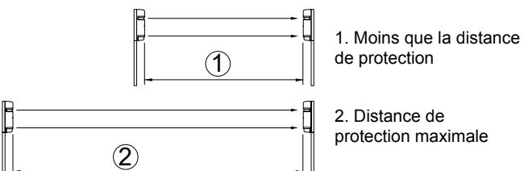

Le récepteur émet un « bip » environ 5 secondes après la remise en place de la face. Ce signal indique que le gain automatique est paramétré. Voir le tableau « *Paramétrage du gain automatique* ».

#### **Tableau 1 : Paramétrage du gain automatique**

| Signal                      | Indication Résultat                                             |         | Cause                                                                                                  | Remède                                                                                                                                                          |
|-----------------------------|-----------------------------------------------------------------|---------|--------------------------------------------------------------------------------------------------------|-----------------------------------------------------------------------------------------------------------------------------------------------------------------|
| Un bip                      | La sensibilité optimale est para métrée             | OK      | _                                                                                                      | _                                                                                                                                                               |
| Signal continu (20 s) | La sensibilité optimale ne peut être para métrée | Mauvais | Le faisceau est interrompu quant la face est remise en place.                           | Retirer tous les obstacles et s'assurer que la main ne soit pas dans le faisceau lorsqu'elle tient la face dans sa position provisoire. |
|                             |                                                                 |         | Les faisceaux sont mal alignés et la diode d'atténuation de sensibilité s'allume. | Vérifier le paramètre de puissance du faisceau sur l'émetteur lorsque la face est fixée et rectifier l'alignement du faisceau.       |

**Remarque :** Un signal retentit indépendamment de la position (ON ou OFF) de l'interrupteur de la tonalité d'alignement.

**Remarque :** Le paramètre du gain automatique est verrouillé pendant environ deux semaines, même en cas de coupure de courant.

**Remarque :** Si la face du récepteur est détachée alors que l'unité est sous tension ou si une coupure de courant dure plus de deux semaines (et que la face reste en place), le gain automatique se règle automatiquement sur la sensibilité maximale. (Le gain est automatiquement verrouillé lorsque le courant est rétabli.)

#### **Indicateur de tonalité**

Cette fonction permet d'effectuer un test sonore pour les points repris dans le tableau « *Indicateur de tonalité* ».

#### **Tableau 2: Indicateur de tonalité**

| Signal se test                           | Interrupteur d'alignement sonore | Autre statut                                                             | Description                                                                                                                                                                                 |
|---------------------------------------------|----------------------------------------|-----------------------------------------------------------------------------|---------------------------------------------------------------------------------------------------------------------------------------------------------------------------------------------|
| Alignement de faisceau                   | ON                                     | Face de récepteur détachée.                                           | Niveau de réception sous surveillance.                                                                                                                                                   |
|                                             |                                        |                                                                             | La tonalité devient plus aiguë lorsque la réception s'améliore.                                                                                                                       |
|                                             |                                        |                                                                             | Remarque : Aucune tonalité n'est émise si la diode d'atténuation de sensibilité est allumée ou que la face du récepteur est attachée.                                        |
| Verrouil lage de gain auto matique | ON/OFF                                 | Après que la face du récepteur a été attachée.                  | Une tonalité brève indique que le verrouillage est enclenché. Une tonalité continue (20 secondes) signale un réajustement.                                                      |
| Test de marche                           | ON                                     | Pendant environ 5 minutes après le verrouil lage du gain. | La tonalité est liée à la diode d'alarme.                                                                                                                                                |
|                                             |                                        |                                                                             | Les deux se déclenchent simultanément.                                                                                                                                                   |
| Mémoire d'alarme                         | ON                                     | Réglage sur mémoire manuelle.                                      | Un « bip » est émis lorsqu'un état d'alarme se produit.                                                                                                                               |
|                                             |                                        |                                                                             | Remarque : Cette configuration n'est pas recommandée dans la plupart des applications de sécurité. La tonalité pourrait en effet signaler à l'intrus qu'il a été détecté. |

#### **Fonction de transfert du temps de réponse**

Voir figure 20.

Temps de réponse (s) 1. Réponse 0,05 s : course rapide. 2. Réponse 0,3 s : marche rapide ; 3. Réponse 0,7 s : marche normale.

Cette fonction permet de modifier le temps de réponse du faisceau pour obtenir les meilleurs résultats en fonction de l'application. Toutefois, il convient d'être prudent lorsqu'on sélectionne le paramètre 700 m, parce que l'unité pourrait ne pas détecter des personnes se déplaçant rapidement.

#### **Module environnemental**

Un signal environnemental est émis lorsque le niveau de réception du faisceau est réduit d'environ 50% ou plus. Le module « surveille » toute dégradation progressive de la réception du faisceau indiquant des conditions atmosphériques particulièrement médiocres. Sélectionner la sortie de signal NF ou NO. Capacité de contraste 30 V ca/cc, 1 A ou moins.

| NO | NC |
|----|----|

**Fonction de mémoire d'alarme**  Voir figure 22.

#### **Description de la figure 22**

| 1 | Sortie d'alarme                                                           |
|---|---------------------------------------------------------------------------|
| 2 | Diode de mémoire                                                          |
| 3 | Entrée de mémoire d'alarme                                                |
| 4 | L logique                                                                 |
| 5 | H logique                                                                 |
| 6 | Bip émis lorsque le faisceau est interrompu (tonalité d'alignement ON) |

La diode de mémoire d'alarme indique quel détecteur a déclenché lorsqu'un ou plusieurs détecteurs sont placés dans une zone. Il est également possible de sélectionner un signal sonore. La remise à zéro peut être automatique ou manuelle.

**Remise à zéro automatique :** La diode de mémoire s'allume pendant cinq minutes après un signal d'alarme et continue à clignoter pendant 55 minutes avant de repasser en mode normal. Si d'autres signaux d'alarme se déclenchent, le processus se répète.

**Manuelle :** La diode de mémoire s'allume lorsque le bouton de remise à zéro est actionné. La mémoire est remise à zéro par une goupille de repos ouverte (L) ou fermée (H). Le bouton de remise à zéro peut être placé à n'importe quel endroit commode.

**Alarme par tonalité et diode :** Si la diode de mémoire doit être accompagnée d'un signal sonore, positionner l'interrupteur de tonalité d'alignement sur ON.

**Remarque :** Si la fonction de mémoire d'alarme est inutilisée, positionner le sélecteur de mémoire sur « manuelle » et ne pas connecter la borne 10 du récepteur. (L'interrupteur logique peut être positionné sur H ou L.)

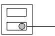

Sélecteur de mémoire (remise à zéro automatique – manuelle) Interrupteur logique de mémoire manuelle (H – L)

### **Dimensions extérieures**

Voir figure 23.

### **Dépistage des pannes**

|                                                                                         | Problèmes Cause possible                                                | Remède                                       |
|-----------------------------------------------------------------------------------------|-------------------------------------------------------------------------|----------------------------------------------|
| La diode de fonctionne ment ne s'allume pas.                             | Pas de tension d'alimentation.                                       | Mettre l'unité sous tension.                 |
|                                                                                         | Mauvais câblage ou câble endommagé (court circuit).               | Vérifier et réparer le câblage.              |
| La diode d'alarme ne s'allume pas lorsque le faisceau est interrompu. | Pas de tension d'alimentation.                                       | Mettre l'unité sous tension.                 |
|                                                                                         | Mauvais câblage ou câble endommagé (court circuit).               | Vérifier et réparer le câblage.           |
|                                                                                         | Le faisceau est réfléchi par un obstacle et renvoyé au récepteur. | Eliminer l'obstacle.                         |
|                                                                                         | Deux faisceaux ne sont pas interrompus simultanément.             | Interrompre deux faisceaux simultanément. |

| Problèmes                                        | Cause possible                                                                                                                            | Remède                                                                                                                           |
|--------------------------------------------------|-------------------------------------------------------------------------------------------------------------------------------------------|----------------------------------------------------------------------------------------------------------------------------------|
|                                                  | Le temps d'interuption du faisceau est inférieure au temps de réponse paramétré                                                  | Régler le temps de réponse du faisceau.                                                                                       |
| La diode d'alarme s'allume en continue. | L'alignement du faisceau est déréglé.                                                                                                  | Vérifier et procéder à un nouveau réglage.                                                                                    |
|                                                  | Présence d'un obstacle entre l'émetteur et le récepteur.                                                                            | Eliminer l'obstacle.                                                                                                             |
|                                                  | Les optiques sont sales.                                                                                                                  | Nettoyer les optiques à l'aide d'un chiffon doux.                                                                             |
|                                                  | Canal de fréquence incompatible entre l'émetteur et le récepteur.                                                                   | Régler le même canal.                                                                                                            |
| Alarme                                           | Mauvais câblage.                                                                                                                          | Vérifier.                                                                                                                        |
| intermit tente.                               | Changement de la tension d'alimentation.                                                                                               | Stabiliser la tension d'alimentation.                                                                                         |
|                                                  | Présence d'un obstacle entre l'émetteur et le récepteur.                                                                            | Eliminer l'obstacle.                                                                                                             |
|                                                  | Une source d'interférences importantes, telle qu'un outil électrique, se trouve à proximité de l'émetteur ou du récepteur. | Déplacer l'installation.                                                                                                         |
|                                                  | Installation instable de l'émetteur et du récepteur.                                                                                | Stabiliser.                                                                                                                      |
|                                                  | Présence de saletés sur les optiques de l'émetteur ou du récepteur.                                                                 | Nettoyer les optiques à l'aide d'un chiffon doux.                                                                             |
|                                                  | Alignement incorrect.                                                                                                                     | Vérifier et procéder à un nouveau réglage.                                                                                    |
|                                                  | Passage de petits animaux dans les quatre faisceaux.                                                                                | Augmenter le temps de réponse (impossible dans les endroits où les intrus peuvent se déplacer en courant très vite). |
|                                                  | Interrupteur de puissance de faisceau réglé sur L, n'offrant pas une sensibilité suffisante.                                     | Positionner l'interrupteur de puissance de faisceau sur H et procéder au verrouillage de face du récepteur.             |

### **Caractéristiques techniques**

| Modèle                           | PB601                                                                                                          | PB611                                      | PB621                    |
|----------------------------------|----------------------------------------------------------------------------------------------------------------|--------------------------------------------|--------------------------|
| Système de detection          | Système d'interruption du faisceau proche de l'infrarouge (interruption simultanée des faisceaux TX-RX). |                                            |                          |
| Faisceau infrarouge           |                                                                                                                | Faisceau pulsé à doide, double modulation. |                          |
| Distance de protection        | A l'extérieur, ≤50 m                                                                                        | A l'extérieur, ≤100 m                   | A l'extérieur, ≤200 m |
| Distance maximal d'arrivée | X 10 (500 m)                                                                                                   | X 10 (1000 m)                              | X 10 (2000 m)            |
| Temps de réponse              | Réglable entre 50 et 700 msec. (Standard = 50 msec.)                                                        |                                            |                          |
| Tension d'alimentation        | 12-30 VDC (sans polarité)                                                                                      |                                            |                          |

| Modèle                                 | PB601                                                                                                                                                         | PB611                                                                                                                                                                                                                                                          | PB621                                     |
|----------------------------------------|---------------------------------------------------------------------------------------------------------------------------------------------------------------|----------------------------------------------------------------------------------------------------------------------------------------------------------------------------------------------------------------------------------------------------------------|-------------------------------------------|
| Consom mation électrique         | ≤60 mA en protection (max. ≤95 mA)                                                                                                                      | ≤75 mA en protection (max. ≤105 mA)                                                                                                                                                                                                                      | ≤80 mA en protection (max. ≤120 mA) |
| Sortie d'alarme                     | Sortie de relais à contact sec 1C. Action de contact : temps d'interruption + temporisation (1-3 sec) Capacité de contact : 30 V ca/cc, 1 A ou moins |                                                                                                                                                                                                                                                                |                                           |
| Sortie anti sabotage                | Relais (NF) contact sec 1B Action de contact : activé lorsque la face est détachée. Capacité de contact : 30 V ca/cc, 0,1 mA ou moins                |                                                                                                                                                                                                                                                                |                                           |
| Diode d'alarme                      | déclenchée.                                                                                                                                                   | Diode rouge (récepteur). ON : lorsqu'une alarme est                                                                                                                                                                                                            |                                           |
| Diode d'atténuation                 | atténué.                                                                                                                                                      | Diode rouge (récepteur). ON : lorsqu'une alarme est                                                                                                                                                                                                            |                                           |
| Fonctions                              | Fiche pour moniteur.                                                                                                                                          | Sélection modulée de la fréquence de faisceau. Indicateur de tonalité. Module environnemental. Sélection de puissance du faisceau. Indication de la mémoire d'alarme. Programmation du contrôle de gain automatique. Fonction de gain automatique. |                                           |
| Réglage du faisceau                 | Horizontal : ±90°. Vertical : ±10°                                                                                                                            |                                                                                                                                                                                                                                                                |                                           |
| Plage de températures de service | −35°C à +66°C                                                                                                                                                 |                                                                                                                                                                                                                                                                |                                           |
| Type de montage                     | Extérieur                                                                                                                                                     |                                                                                                                                                                                                                                                                |                                           |
| Câblage                                | Bornier                                                                                                                                                       |                                                                                                                                                                                                                                                                |                                           |
| Poids                                  |                                                                                                                                                               | Emetteur : 1200 g. Récepteur : 1300 g                                                                                                                                                                                                                          |                                           |
| Aspect                                 | Résine PC (lie-de-vin)                                                                                                                                        |                                                                                                                                                                                                                                                                |                                           |

## **Informations sur la réglementation**

| Fournisseur                | UTC Fire & Security Americas Corporation, Inc. 1275 Red Fox Rd., Arden Hills, MN 55112-6943, E-U                                                                                                                                                                                                                                                                            |
|----------------------------|-----------------------------------------------------------------------------------------------------------------------------------------------------------------------------------------------------------------------------------------------------------------------------------------------------------------------------------------------------------------------------------|
|                            | Représentant européen agréé de la fabrication : UTC Fire & Security B.V. Kelvinstraat 7, 6003 DH Weert, Pays-Bas                                                                                                                                                                                                                                                            |
| Certification              |                                                                                                                                                                                                                                                                                                                                                                                   |
| Classe environnementale | Classe 4                                                                                                                                                                                                                                                                                                                                                                          |
| Directives européennes  | 2002/95/EC (RoHS) : UTC Fire & Security déclare, par la présente, que cet équipement est conforme aux principales exigences et dispositions de la Directive 2002/95/EC.                                                                                                                                                                                                  |
|                            | 2002/96/EC (WEEE) : Les produits marqués de ce symbole peuvent pas être éliminés comme déchets municipaux non triés dans l'Union européenne. Pour le recyclage, retourner ce produit à votre fournisseur au moment de l'achat d'un nouvel équipement équivalent, ou à des points de collecte désignés. Pour plus d'informations, voir: www.recyclethis.info. |
|                            | 2004/108/EC (EMC) : UTC Fire & Security déclare, par la présente, que cet équipement est conforme aux principales exigences et dispositions de la Directive 2004/108/EC.                                                                                                                                                                                                 |

### **Contact**

Pour de plus amples informations consulter notre site internet : www.utcfireandsecurity.com.

# **IT: Istruzioni per l'installazione**

### **Descrizione componenti**

**Figura 1:** Il prodotto viene consegnato completo dei seguenti elementi. Verificare che siano tutti presenti.

| 1  | Dispositivo di blocco                             |
|----|---------------------------------------------------|
| 2  | Vite di regolazione fine orizzontale              |
| 3  | Vite di regolazione verticale                     |
| 4  | Morsettiera                                       |
| 5  | Interruttore antimanomissione (solo ricevitore)   |
| 6  | Interruttore di blocco guadagno (solo ricevitore) |
| 7  | Indicazioni funzioni (vedere figura 2 di seguito) |
| 8  | Specchio                                          |
| 9  | Mirino                                            |
| 10 | Ghiera regolazione                                |
| 11 | Piastra di mascheratura                           |
| 12 | Piastra di montaggio                              |
| 13 | Staffa                                            |
| 14 | 8 viti autofilettanti (Ø 4 x 30)                  |
| 15 | 8 due viti ovali a testa incassata                |

**Figura 2:** Funzioni/indicazioni del trasmettitore (TX) e del ricevitore (RX).

| 1  | LED funzionamento                                                                      |
|----|----------------------------------------------------------------------------------------|
| 2  | Potenza del fascio (impostata su H in fabbrica)                                        |
| 3  | Canale del fascio (Canale 1 impostato in fabbrica)                                     |
| 4  | LED attenuazione sensibilità                                                           |
| 5  | LED allarme                                                                            |
| 6  | Interruttore (impostato su OFF in fabbrica) segnale acustico (tono di allineamento) |
| 7  | Regolazione tempo di risposta (50 msec impostati in fabbrica)                          |
| 8  | Jack monitor                                                                           |
| 9  | LED memoria                                                                            |
| 10 | Canale del fascio (frequenza 1-4, canale 1 impostato in fabbrica)                   |
| 11 | Selettore uscita ambientale (impostato in fabbrica su N/C)                             |
| 12 | Selettore di memoria (impostato su manuale in fabbrica)                                |
| 13 | Interruttore logico memoria remota manuale (impostato su L in fabbrica)             |
| 14 | Morsettiera uscita ambientale                                                          |
| 15 | Terminale di ingresso controllo remoto                                                 |

### **Installazione dei sensori**

#### **Direttive per l'installazione dei sensori**

**Figura 3:**operazioni da fare e da evitare quando si installa il sensore.

Evitare le ostruzioni (tenere presente le variazioni stagionali). Evitare un'illuminazione forte. Non bagnare l'unità. Evitare le superfici non stabili.

**Figura 4:** Calcolo dell'espansione del fascio (B).

(A= distanza di protezione) Considerare l'ampiezza del fascio di ogni tipo di modello per evitare la potenziale riflessione dalla superficie del terreno o da oggetti vicini.

**Figura 5:** Altezza di installazione consigliata.

#### **Cablaggio del sistema**

Collegare l'alimentazione a trasmettitore e ricevitore. Il cablaggio varia in base al numero di sensori o zone. La sezione dei cavi dipende anche dalla distanza tra il sensore e la centrale/alimentazione. I cavi devono essere conformi con NFPA-70 del Codice elettrico nazionale (USA).

**Attenzione:** l'uscita del segnale sul ricevitore non può essere utilizzata indipendentemente per l'ottica inferiore/superiore, ma solo come un set. I collegamenti esterni devono essere in PVC se usati sottoterra, altrimenti utilizzare un cavo per interramento. Utilizzare condotti per cablaggi sopra terra.

**Figura 6:** esempi di cablaggi.

Esempio 1: connessione standard.

Esempio 2: con due o più sensori collegati alla stessa zona.

Esempio 3: con due o più sensori su zone separate.

Esempio 4: due connessioni standard sovrapposte.

Esempio 5: con utilizzo del modulo ambientale e della memoria allarme manuale.

Consultare la sezione *Descrizione delle funzioni* per selezionare la frequenza del fascio.

**Figura 7:** distanza di collegamento tra il sensore e la centrale (m).

**Nota:** la distanza di collegamento massima quando sono collegati due o più set è pari al valore indicato diviso per il numero di set.

**Nota:** per la linea di segnale fino a circa 1000 m è possibile utilizzare cavo telefonico AWG22 (diametro 0,65 mm).

**Batteria standby:** verificare che la centrale sia dotata di un'adeguata batteria di standby e circuito di carica. Usare una batteria da almeno 12 V al NiCd o al piombo con capacità minima di 0,5 AH.

#### **Disposizione della morsettiera**

Vedere la figura 8.

**Descrizione figura 8** 

| 1 | Ambientale NC o NA, 30 V CA/V CC, 1 A o inferiore |  |
|---|---------------------------------------------------|--|
| 2 | Memoria allarme                                   |  |
| 3 | Interruttore di reset remoto                      |  |
| 4 | Alimentazione e morsettiera                       |  |
|   |                                                   |  |

#### **Montaggio delle unità**

L'unità può essere facilmente montata su un palo o su una superficie piana. Utilizzando la ghiera e le viti di regolazione, regolare lo specchio in direzione verticale (A) e orizzontale (B) affinché l'unità possa funzionare in tutte le direzioni (figura 9). Vedere gli esempi 1-3.

**Installazione di un'unità fissata a parete** 

- 1. Rimuovere il coperchio svitando le viti alla base dello stesso (figura 10).
- 2. Allentare le viti che fissano il corpo del sensore alla piastra di montaggio e far scorrere la piastra verso il basso per separarla.
- 3. Praticare i fori nella parete. Utilizzando la piastra di montaggio come dima, segnare le posizioni dei fori delle viti. Lasciare uno spazio di 20 mm sopra la piastra e di 25 mm sotto la piastra per poterla rimuovere agevolmente dopo l'installazione. Figura 11.1: parete in legno. 2: Parete in muratura: consultare le specifiche del tappo di fissaggio utilizzato.
- 4. Installazione del sensore (figura 12):

- Inserire le viti di montaggio lasciandole sporgere per 15 mm.

- Installare la piastra di montaggio sulle viti sporgenti.
- Tirare il cavo attraverso il foro.
- Serrare le viti e chiudere l'apertura del foro per il cavo.
- Collegare la morsettiera.
- Fissare il coperchio.

**Nota:** l'unità non può essere installata in una cassetta di distribuzione. È comunque possibile utilizzare una cassetta di distribuzione per i cablaggi.

**Installazione di un'unità fissata su un palo** 

- 1. Rimuovere il coperchio svitando le viti alla base dello stesso (figura 10).
- 2. Allentare le viti che fissano il corpo del sensore alla piastra di montaggio e far scorrere la piastra verso il basso per separarla.
- 3. Praticare un foro per il cablaggio nel palo, quindi inserire il filo all'interno del foro. Posizionare un cappuccio sulla sommità del palo. L'unità può essere montata su un palo del diametro esterno di 42-44 mm. Utilizzare un CONDOTTO RIGIDO o un prodotto equivalente (figura 13). Praticare un foro di 6 mm attraverso il palo nel punto in cui verrà montato il dispositivo per il cablaggio. Limare tutte le sbavature e i bordi taglienti intorno al palo per evitare di danneggiare il cavo.
- 4. Installazione del sensore sul palo (figura 14.1: apertura del foro):

- Fissare al palo le staffe a U, quindi fissare la piastra di montaggio usando le viti.

- Fissare il corpo del sensore.

- Tirare il cavo attraverso il foro e chiudere l'apertura del foro stesso.

- Collegare la morsettiera.
- Fissare il coperchio (aprire i fori per il passaggio dei cavi (2) affinché corrisponda alla configurazione).

**Installazione di un'unità su colonne opposte fissata su un palo** 

Procedere analogamente a quanto descritto in precedenza per il montaggio su palo, ma fissare al palo quattro staffe a U, a coppie, una sull'altra, rivolte verso direzioni opposte (figura 15).

### **Impostazione delle funzioni e allineamento del fascio**

- 1. Alimentare l'unità senza il coperchio.
- 2. Impostare le opzioni delle funzioni. Per una dettagliata spiegazione di ogni opzione, consultare la sezione *Descrizione delle funzioni*.

| Posizione | Funzione                         | Interruttori funzioni |
|-----------|----------------------------------|-----------------------|
| TX e RX   | Canale fascio                    | 1 canale… 2 canali    |
|           | (frequenza)                      | 3 canale… 4 canali    |
| Solo TX   | Potenza fascio                   | Alta … Bassa          |
| Solo RX   | Interruttore segnale acustico | On … Off              |
|           | Regolazione tempo                | 50 msec (standard)    |
|           | di risposta                      | 300 msec … 700 msec   |
|           |                                  | Altro                 |
|           | Uscita ambientale                | NO NC              |
|           | Memoria allarme                  | Auto reset            |
|           |                                  | Manuale Alta       |
|           |                                  | Bassa                 |
|           |                                  | Non utilizzata        |

- 3. Regolare l'angolazione ottica (vedere la Figura 16) osservando attraverso il mirino su un lato dell'unità ottica di trasmissione fino a vedere il ricevitore. Ripetere la procedura per le unità ottiche inferiori, quindi sul ricevitore.
**Descrizione figura 16** 

| 1 | Mirino                               |
|---|--------------------------------------|
| 2 | Vite di regolazione fine orizzontale |
| 3 | Vite di regolazione verticale        |
| 4 | Ghiera regolazione                   |

- 4. Eseguire la regolazione fine (vedere la Figura 17). L'allineamento iniziale del fascio può essere ottenuto tramite l'indicatore di tonalità allineamento.
#### **Descrizione figura 17**

| 1 | LED di attenuazione della sensibilità (si accende quando la ricezione del fascio è sotto il livello minimo) |  |
|---|----------------------------------------------------------------------------------------------------------------|--|
| 2 | Interruttore tonalità allineamento                                                                             |  |
| 3 | Jack monitor                                                                                                   |  |

 4.1. Fissare le piastre di mascheratura (contenute sui lati del TX/RX) all'ottica inferiore di TX e RX.

 4.2. Posizionare l'interruttore di tonalità allineamento del ricevitore su ON.

 4.3. Regolare l'ottica con le viti di regolazione fino a raggiungere la tonalità più alta.

**Nota:** se il LED di attenuazione sensibilità è acceso non viene emesso alcun suono.

 4.4. Attaccare le piastre di mascheratura alle ottiche superiori di TX/RX e ripetere la regolazione.

 4.5. Dopo la regolazione, riposizionare la piastra di mascheratura nelle apposite aree di conservazione del TX/RX.

4.6. Spegnere l'indicatore di tonalità allineamento.

**Uso di un voltmetro per l'allineamento del fascio: (vedere la Figura 18)** 

È possibile ottenere un allineamento preciso utilizzando un voltmetro (10 V CC). Inserire i cavi del voltmetro nei jack del monitor del ricevitore. Fare riferimento alla tabella seguente per la tensione di uscita.

| Valore tensione | Allineamento              |
|-----------------|---------------------------|
| 2,7 V o più     | Ottima                    |
| 2,0 - 2,7 V     | Buono                     |
| 2,0 V o meno    | Scarsa, regolare di nuovo |

- 5. Fissare nuovamente il coperchio
5.1. Fissare innanzitutto il coperchio del trasmettitore.

 5.2. Verificare che il LED di attenuazione di sensibilità del ricevitore rimanga spento. Posizionare il coperchio del ricevitore ma non fissarlo saldamente.

 5.3. Dopo cinque secondi verrà emesso un suono. Dopo l'emissione del suono, fissare il coperchio del ricevitore con le viti.

**Nota:** la tolleranza della sensibilità viene impostata automaticamente all'emissione del segnale acustico.

**Nota:** se l'interruttore del tono di allineamento è stato lasciato involontariamente su ON, il tono si interromperà quando viene posizionato il coperchio.

 5.4. Se viene emesso un segnale acustico continuo, rimuovere il coperchio del ricevitore e procedere di nuovo alla regolazione. Per ulteriori informazioni, consultare la sezione *Funzione blocco guadagno automatico*.

 5.5. Dopo aver impostato il guadagno automatico, inserire i coperchi.

## **Controllo del funzionamento**

Vedere la figura 19.

Dopo aver installato, allineato e impostato il guadagno automatico, provare il funzionamento passando in mezzo al fascio. È possibile usare due metodi:

- 1. Allarme solo LED.
- 2. Controllo suono e LED allarme tramite interruttore di allineamento tonalità. Se l'interruttore di tonalità allineamento è in posizione ON, il tono si interromperà quando viene posizionato il coperchio. Tuttavia, la tonalità

è attiva per un test del funzionamento udibile per cinque minuti quando il guadagno automatico è bloccato.

## **Descrizione delle funzioni**

#### **Selezione frequenza a quattro canali**

Vedere la figura 21.

È possibile impostare le coppie di fasci a vari livelli di frequenza per evitare interferenze tra le unità sovrapposte, in linea o in altre configurazioni quando sono possibili interferenze di trasmissione tra i vari fasci. Impostare il livello di frequenza nel modo illustrato:

#### **Descrizione figura 17**

| 1 | Protezione in linea                              |
|---|--------------------------------------------------|
| 2 | Protezione con due fasci sovrapposti             |
| 3 | Protezione in linea e con due fasci sovrapposti  |
| 4 | Protezione perimetrale                           |
| 5 | Protezione perimetrale con due fasci sovrapposti |

**Nota:** trasmettitore e ricevitore devono essere impostati sullo stesso canale! Le coppie di TX/RX non possono funzionare se non sono configurate sullo stesso canale.

**Nota:** si consiglia di utilizzare un voltmetro durante l'allineamento per assicurare il più alto livello di stabilità.

**Nota:** nella configurazione sovrapposta i sensori superiori e inferiori devono appartenere allo stesso numero di modello.

#### **Selezione potenza fascio**

Questa opzione consente la selezione del campo di intensità appropriata in base all'applicazione. Per distanze notevolmente inferiori alla distanza di protezione specificata, ridurre l'intensità del fascio per eliminare potenziali problemi di riflessione. Per zone che raggiungono la distanza di protezione massima, impostare il livello del fascio al valore più alto.

| Modello | Potenza fascio (m) |         |  |
|---------|--------------------|---------|--|
|         | Bassa              | Alta    |  |
| PB601   | ≤ 25               | 25-50   |  |
| PB611   | ≤ 75               | 75-100  |  |
| PB621   | ≤ 150              | 150-200 |  |

#### **Funzione blocco guadagno automatico**

Il blocco guadagno automatico normalizza il livello di tolleranza e risposta delle unità indipendentemente dalle distanze di installazione variabili. Come indicato nelle figure seguenti, le due situazioni hanno esattamente gli stessi livelli di tolleranza e risposta, anche se le distanze sono diverse.

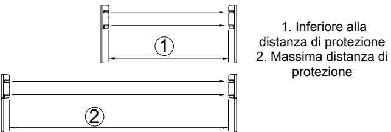

Il ricevitore emette un segnale acustico per circa cinque secondi dopo che il coperchio è stato posizionato. Indica che è stato impostato il guadagno automatico. Consultare la tabella *Impostazione del guadagno automatico*, disponibile di seguito.

#### **Tabella 7: Impostazione del guadagno automatico**

| Segnale                                 | Problema                                                | Risulta to     | Causa                                                                                                                 | Rimedio                                                                                                                                                                                    |
|-----------------------------------------|---------------------------------------------------------|-------------------|-----------------------------------------------------------------------------------------------------------------------|--------------------------------------------------------------------------------------------------------------------------------------------------------------------------------------------|
| Un impulso (segnale acustico)     | È stata impostata la sensibilità ottimale.     | OK                | _                                                                                                                     | _                                                                                                                                                                                          |
| Tonalità continua (20 secondi) | Impossibile impostare la sensibilità ottimale. | insuffici ente | Il fascio viene interrotto dopo il reinseriment o del coperchio.                                    | Rimuovere gli ostacoli e assicurarsi che la mano non interrompa il fascio quando si tiene il coperchio in una posizione provvisoria.                            |
|                                         |                                                         |                   | I fasci non sono allineati correttament e e il LED di attenuazione della sensibilità si accende. | Verificare e impostazioni relative alla potenza del fascio sul trasmettitore con il coperchio installato e regolare nuovamente l'allineamento del fascio. |

**Nota:** viene generata una tonalità indipendentemente dalla posizione su ON o OFF dell'interruttore del "segnale acustico" (tonalità allineamento).

**Nota:** l'impostazione di guadagno automatico è bloccata anche in caso di assenza di alimentazione.

**Nota:** se il coperchio del ricevitore viene rimosso mentre il dispositivo è alimentato, o se si interrompe l'alimentazione per oltre due settimane (lasciando il coperchio in posizione), il guadagno automatico viene reimpostato automaticamente al livello di sensibilità massima (il guadagno viene bloccato automaticamente quando si ripristina l'alimentazione).

#### **Indicazioni acustiche**

Questa funzionalità consente di eseguire il test dei segnali udibili o di emettere i segnali corrispondenti agli elementi elencati nella tabella *Indicazioni acustiche*, disponibile di seguito.

#### **Tabella 8: Indicazioni acustiche**

| Test/Segnale                     | Interruttor e tonalità allineame nto | Altra condizione                                               | Descrizione                                                                                                                                                                                                               |
|----------------------------------|-----------------------------------------------|-------------------------------------------------------------------|---------------------------------------------------------------------------------------------------------------------------------------------------------------------------------------------------------------------------|
| Allineamento fascio           | ON                                            | Coperchio del ricevitore non fissato                        | Potenza ricezione controllata.                                                                                                                                                                                         |
|                                  |                                               |                                                                   | Il grado di tonalità aumenta con il miglioramento della ricezione.                                                                                                                                               |
|                                  |                                               |                                                                   | Nota: se il LED di attenuazione della sensibilità è acceso o se il coperchio del ricevitore è fissato, non viene emesso alcun segnale acustico. .                                                          |
| Blocco guadagno automatico | ON/OFF                                        | Dopo che il coperchio del ricevitore è stato fissato. | Una tonalità breve indica che il blocco è definito.                                                                                                                                                                    |
|                                  |                                               |                                                                   | La tonalità continua (20 secondi) indica una nuova regolazione.                                                                                                                                                     |
| Test copertura                | ON                                            | Per circa 5 minuti dopo il blocco del guadagno.          | La tonalità è collegata al LED allarme.                                                                                                                                                                                |
|                                  |                                               |                                                                   | Entrambi si attivano contemporaneamente.                                                                                                                                                                               |
| Memoria allarme               | ON                                            | Impostato su memoria manuale.                               | Se si verifica una condizione di allarme, viene emesso un segnale acustico (beep).                                                                                                                               |
|                                  |                                               |                                                                   | Nota: questa configurazione non è consigliabile per la maggior parte delle applicazioni di sicurezza. Il segnale acustico potrebbe avvertire l'intruso della presenza del sistema di rilevazione. |

#### **Funzione cambiamento tempo risposta**

Vedere la figura 20.

Tempo di risposta (sec). 1. Risposta 0,05 sec: corsa. 2. Risposta 0,3 sec: camminata veloce; 3. Risposta 0,7 sec: camminata.

Questa funzione viene utilizzata per modificare il tempo di risposta del fascio per meglio adattarsi all'applicazione. L'unità non rileva oggetti che passano più velocemente del tempo di risposta impostato.

#### **Modulo ambientale**

Il segnale ambientale viene emesso se il livello di ricezione del fascio si riduce di circa il 50% o più. Il modulo "controlla" l'indebolimento progressivo della ricezione del fascio, che indica condizioni climatiche molto negative. Selezionare l'uscita di segnale NC o NO (contatto normalmente chiuso o normalmente aperto, rispettivamente). Capacità di contrasto 30 V CA/V CC, 1 A o inferiore.

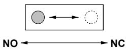

#### **Funzione memoria allarme**

Vedere la figura 22.

| 1 | Uscita allarme                                                         |
|---|------------------------------------------------------------------------|
| 2 | LED memoria                                                            |
| 3 | Ingresso memoria allarme                                               |
| 4 | L logico                                                               |
| 5 | H logico                                                               |
| 6 | Segnale quando il fascio viene interrotto (tono di allineamento ON) |

Il LED di memoria allarme mostra quale sensore si è attivato quando nella zona sono presenti due o più sensori. È inoltre possibile selezionare una tonalità acustica. Il reset può essere automatico o manuale.

**Auto reset:** il LED memoria si accende per cinque minuti dopo un segnale di allarme e continua a lampeggiare per 55 minuti prima di tornare alla modalità normale. Se vengono attivati ulteriori segnali di allarme, il processo si ripete.

**Manuale:** il LED memoria si accende quando si preme il pulsante di reset. È possibile ripristinare la memoria manualmente tramite apertura (L) o chiusura (H) di un pulsante di reset. Il pulsante di reset può essere posto in qualunque posizione nell'edificio.

**Allarme tonalità con LED:** se si desidera un segnale acustico insieme con il LED memoria, impostare su ON l'interruttore di tonalità allineamento.

**Nota:** se non si usa la funzione di memoria allarme, impostare il selettore di memoria su "manuale" e lasciare la morsettiera del ricevitore non collegata.

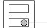

Selettore di memoria (reset automatico manuale) Interruttore logico memoria manuale (H - L)

### **Dimensioni esterne**

Vedere la figura 23.

## **Risoluzione dei problemi**

| Problema                                                                              | Possibile causa                                                             | Rimedio                                                                   |
|---------------------------------------------------------------------------------------|-----------------------------------------------------------------------------|---------------------------------------------------------------------------|
| Il LED di funzioname nto non si accende.                                     | Assenza di alimentazione.                                                | Fornire l'alimentazione.                                                  |
|                                                                                       | Errato cablaggio o cavo rotto (corto).                                   | Controllare il cablaggio e ripararlo.                                  |
| Il LED allarme non si accende quando il fascio viene interrotto. | Assenza di alimentazione.                                                | Fornire l'alimentazione.                                                  |
|                                                                                       | Cablaggio errato o cavo rotto (corto).                                   | Controllare il cablaggio e ripararlo.                                  |
|                                                                                       | Il fascio viene riflesso su un altro oggetto e inviato al ricevitore. | Rimuovere l'oggetto riflettente o cambiare la direzione del fascio. |
|                                                                                       | Due fasci non vengono interrotti insieme.                                | Interrompere insieme i due fasci.                                      |

| Problema                              | Possibile causa                                                                                                          | Rimedio                                                                                                                                                 |  |
|---------------------------------------|--------------------------------------------------------------------------------------------------------------------------|---------------------------------------------------------------------------------------------------------------------------------------------------------|--|
|                                       | Il tempo di interruzione del fascio è più breve del tempo di risposta impostato.                                | Regolare il tempo di risposta del fascio.                                                                                                            |  |
| Il LED allarme resta acceso. | Il fascio non è allineato.                                                                                               | Controllare e regolare di nuovo.                                                                                                                     |  |
|                                       | Oggetto coprente tra il trasmettitore e il ricevitore.                                                             | Rimuovere gli oggetti coprenti.                                                                                                                      |  |
|                                       | Le ottiche dell'unità sono sporche.                                                                                   | Pulire le ottiche con un panno morbido.                                                                                                              |  |
|                                       | Il canale della frequenza non è compatibile tra trasmettitore e ricevitore.                                        | Regolare di nuovo allo stesso canale.                                                                                                                |  |
| Allarmi intermittenti              | Cablaggio errato.                                                                                                        | Controllare di nuovo.                                                                                                                                   |  |
|                                       | Variazione dell'alimentazione.                                                                                        | Stabilizzare l'alimentazione.                                                                                                                           |  |
|                                       | Oggetto coprente tra il trasmettitore e il ricevitore.                                                             | Rimuovere l'oggetto coprente.                                                                                                                        |  |
|                                       | Una importante fonte di disturbo elettrico, ad esempio un generatore, è vicina a trasmettitore e ricevitore. | Cambiare la posizione dell'installazione.                                                                                                            |  |
|                                       | Installazione instabile di trasmettitore e ricevitore.                                                                | Stabilizzare.                                                                                                                                           |  |
|                                       | Ottiche sporche di trasmettitore e ricevitore.                                                                        | Pulire le ottiche con un panno morbido.                                                                                                              |  |
|                                       | Allineamento non corretto.                                                                                            | Controllare e regolare di nuovo.                                                                                                                     |  |
|                                       | Piccoli animali possono passare tra i due fasci.                                                                      | Aumentare il tempo di risposta (impossibile in posizioni in cui l'intruso può correre alla massima velocità).                               |  |
|                                       | L'interruttore di potenza del fascio è impostato su L, e la sensibilità non è sufficiente.                      | Portare l'interruttore della potenza del fascio su H e bloccare il guadagno dell'unità mentre il coperchio del ricevitore non è fissato. |  |

## **Specifiche**

| Modello                   | PB601                                                                                               | PB611                                    | PB621                                    |
|---------------------------|-----------------------------------------------------------------------------------------------------|------------------------------------------|------------------------------------------|
| Sistema di rilevamento | Sistema di interruzione fascio infrarossi di prossimità. (Interruzione simultanea 4 fasci TX-RX) |                                          |                                          |
| Fascio infrarosso      | Fascio pulsato LED, doppia modulazione                                                              |                                          |                                          |
| Distanza di protezione | Esterno ≤50 m                                                                                       | Esterno ≤100 m                           | Esterno ≤200 m                           |
| Distanza arrivo max    | Dieci volte (500 m)                                                                              | Dieci volte (1.000 m)                 | Dieci volte (2000 m)                  |
| Tempo di risposta      | 50-700 msec variabile (Standard = 50 msec)                                                          |                                          |                                          |
|                           | Alimentazione Ingresso 12-30 V CC (nessuna polarità)                                                |                                          |                                          |
| Consumo di corrente    | ≤60 mA a protezione (max. ≤95 mA)                                                             | ≤75 mA a protezione (max. ≤105 mA) | ≤80 mA a protezione (max. ≤120 mA) |

| Modello                               | PB601            | PB611                                                                                        | PB621                                                                                              |
|---------------------------------------|------------------|----------------------------------------------------------------------------------------------|----------------------------------------------------------------------------------------------------|
| Uscita allarme                     |                  | Uscita relé contatto a secco 1C                                                              |                                                                                                    |
|                                       | sec)             | Azione contatto: tempo interruzione + ritardo (1-3                                           |                                                                                                    |
|                                       |                  | Capacità contatto: 30 V CA/CC, 1 A o meno                                                    |                                                                                                    |
| Uscita antimanomiss ione        |                  | Relè contatto a secco 1B (N/C)                                                               |                                                                                                    |
|                                       |                  |                                                                                              | Azione: attivazione quando viene rimosso il coperchio                                              |
|                                       |                  | Capacità contatto: 30 V CA/CC, 0,1 mA o meno                                                 |                                                                                                    |
| LED allarme                           | l'allarme        | LED rosso (ricevitore). ON: quando viene avviato                                             |                                                                                                    |
| LED attenuazione                   | un fascio        |                                                                                              | LED rosso (ricevitore). ON: quando viene attenuato                                                 |
| Funzioni                              | monitor.         | Selezione frequenza fascio modulata. Indicazioni fascio. Indicazione memoria allarme. AGC | acustiche. Modulo ambientale. Selezione potenza programmato. Funzione guadagno automatico. Jack |
| Regolazione fascio                 |                  | Orizzontale: ±90°. Verticale: ±10°                                                           |                                                                                                    |
| Variazione temperatura ambiente | Da −35°C a +66°C |                                                                                              |                                                                                                    |
| Posizioni di montaggio             | Esterno          |                                                                                              |                                                                                                    |
| Cablaggio                             | Morsettiera      |                                                                                              |                                                                                                    |
| Peso                                  |                  | Trasmettitore: 1.200 g. Ricevitore: 1.300 g                                                  |                                                                                                    |
| Aspetto                               |                  | Resina PC (color vinaccia)                                                                   |                                                                                                    |

## **Informazioni sulle normative**

| Produttore                          | UTC Fire & Security Americas Corporation, Inc. 1275 Red Fox Rd., Arden Hills, MN 55112-6943, USA                                                                                                                                                                                                                                                                                                                |
|-------------------------------------|-----------------------------------------------------------------------------------------------------------------------------------------------------------------------------------------------------------------------------------------------------------------------------------------------------------------------------------------------------------------------------------------------------------------------|
|                                     | Rappresentante autorizzato per l'UE: UTC Fire & Security B.V. Kelvinstraat 7, 6003 DH Weert, Paesi Bassi                                                                                                                                                                                                                                                                                                        |
| Certificazione                      |                                                                                                                                                                                                                                                                                                                                                                                                                       |
| Classe ambientale                   | Classe 4                                                                                                                                                                                                                                                                                                                                                                                                              |
| Direttive dell'Unione europea | 2002/95/CE (direttiva RoHs): UTC Fire & Security dichiara che il presente dispositivo è conforme con i requisiti essenziali e altre disposizioni relative della direttiva 2002/95/CE.                                                                                                                                                                                                                        |
|                                     | 2002/96/CE (direttiva WEEE): all'interno dell'Unione europea i prodotti contrassegnati con questo simbolo non possono essere smaltiti come normali rifiuti. Al momento dell'acquisto di un'apparecchiatura nuova analoga restituire il prodotto al fornitore locale o smaltirlo consegnandolo presso gli appositi punti di raccolta. Per ulteriori informazioni vedere: www.recyclethis.info. |
|                                     | 2004/108/EC (direttiva EMC): UTC Fire & Security dichiara che il presente dispositivo è conforme con i requisiti essenziali e altre disposizioni relative della direttiva 2004/108/CE.                                                                                                                                                                                                                       |

## **Informazioni di contatto**

Per le informazioni di contatto fare riferimento al sito web www.utcfireandsecurity.com.

## **Beschrijving onderdeel**

**Afbeelding 1:** Het product wordt met de volgende onderdelen geleverd. Controleer of ze aanwezig zijn.

| 1  | Kap                                                   |
|----|-------------------------------------------------------|
| 2  | Horizontale stelschroef                               |
| 3  | Verticale stelschroef                                 |
| 4  | Aansluitconnectoren                                   |
| 5  | Sabotageschakelaar (alleen ontvanger)                 |
| 6  | Schakelaar auto gain vergrendeling (alleen ontvanger) |
| 7  | Functie-indicaties (zie afbeelding 2 hieronder)       |
| 8  | Spiegel                                               |
| 9  | Zoeker                                                |
| 10 | Verstelschijf                                         |
| 11 | Afschermplaat                                         |
| 12 | Montageplaat                                          |
| 13 | Steun                                                 |
| 14 | 8 parkerschroeven (Ø 4 x 30)                          |
| 15 | 8 ovale platte schroeven met verzonken kop            |

**Afbeelding 2:** Schakelaars/indicaties van zender (TX) en ontvanger (RX).

| 1  | Bedienings-LED                                                             |
|----|----------------------------------------------------------------------------|
| 2  | Beam-vermogen (fabrieksinstelling H)                                       |
| 3  | Beam-kanaal (fabrieksinstelling kanaal 1)                                  |
| 4  | Gevoeligheids-LED                                                          |
| 5  | Alarm-LED                                                                  |
| 6  | Schakelaar zoemer (uitlijntoon) (fabrieksinstelling UIT)                   |
| 7  | Reactietijd potm.aanpassing (fabrieksinstelling 50 msec.)                  |
| 8  | Monitoraansluiting                                                         |
| 9  | Geheugen-LED                                                               |
| 10 | Beam-kanaal (fabrieksinstelling frequentie 1-4, kanaal 1)                  |
| 11 | Disqualificatie schakelaar (fabrieksinstelling N/C)                        |
| 12 | Geheugenschakelaar (fabrieksinstelling handmatig)                          |
| 13 | Op afstand handmatig bediende geheugenschakelaar (fabrieksinstelling L) |
| 14 | Disqualificatie uitgangaansluiting                                         |
| 15 | Op afstand bediende ingangterminal                                         |

### **De sensoren installeren**

**Richtlijnen voor het installeren van sensoren** 

**Afbeelding 3:**Wat mag wel en wat mag niet tijdens het installeren van de sensor.

Geen belemmeringen (denk aan seizoenswisseling). Voorkom scherp licht. Voorkom dat de unit nat wordt. Geen onstabiele ondergrond.

**Afbeelding 4:**Berekening van de beam-expansie (B).

(A= beveiligingsafstand) Er moet rekening worden gehouden met de beam-spreiding van elk modeltype om mogelijke weerkaatsing van de grond of nabijgelegen objecten te vookomen.

**Afbeelding 5:** Aanbevolen installatiehoogte.

**De systeembedrading aansluiten** 

Sluit de voeding aan op zowel de zender als de ontvanger. De bedrading is afhankelijk van het aantal sensoren of zones. De draaddikte is ook afhankelijk van de afstand tussen de aktief en de centrale/voedingsbron. De bedrading moet voldoen aan NFPA-70 van de National Electrical Code en de nationale vereisten.

**Let op:** De alarmuitgang op de ontvanger kan niet onafhankelijk voor de bovenste/onderste lenzen worden gebruikt, alleen als set. Buitenbedrading moet van PVC zijn indien deze ondergronds of ingegraven wordt gebruikt. Gebruik elektriciteitsbuizen voor bovengrondse bedrading.

**Afbeelding 6:** Voorbeelden van bedrading.

Voorbeeld 1: Standaardaansluiting.

Voorbeeld 2: Wanneer twee of meer aktief worden aangesloten op dezelfde zone.

Voorbeeld 3: Wanneer twee of meer aktief op afzonderlijke zones worden aangesloten.

Voorbeeld 4: twee meervoudige aktiefs standaardaansluiting.

Voorbeeld 5: Wanneer de disqualificatie en alarmgeheugen worden gebruikt.

Zie het gedeelte *dipschakelaars beschrijvingen* voor het selecteren van de beam-frequentie.

**Afbeelding 7:** Bedradingsafstand tussen de sensor en de centrale (m).

**Opmerking:** De maximale bedradingsafstand wanneer twee of meer sets worden aangesloten is de getoonde waarde gedeeld door het aantal sets.

**Opmerking:** De signaallijn kan tot ongeveer maximaal 1000 m met AWG22 (diameter 0,65 mm) alarm bekabeling worden aangesloten.

**Standby-batterij:** Zorg ervoor dat de centrale is uitgerust met voldoende standby-batterij en oplaadunit. Gebruik 12 V (ten minste) NiCd- of zuur-loodbatterijen met een minimum capaciteit van 0,5 AH.

**De aansluitconnectoren** 

Zie Afbeelding 8.

**Beschrijving afbeelding 8** 

| 1 | Disqualificatie NC of NO, 30 VAC/VDC 1A of minder |
|---|---------------------------------------------------|
| 2 | Alarmgeheugen                                     |
| 3 | Externe resetschakelaar                           |
| 4 | Voerding en terminal                              |

#### **Aktief monteren**

De sets kunnen eenvoudig op een paal of een vlak oppervlak worden gemonteerd. Verstel de spiegels met behulp van de stelschijf en de schroeven verticaal (A) en horizontaal (B),

zodat de unit in alle richtingen kan werken (afbeelding 9). Zie voorbeelden 1-3.

**Een aan de muur gemonteerde unit installeren** 

- 1. Verwijder de kap door de schroeven onderaan de voet van de kap los te maken (afbeelding 10).
- 2. Maak de schroeven los waarmee de aktief set aan de montageplaat is bevestigd en schuif de plaat naar onderen om deze los te maken.
- 3. Maak de gaten in de muur. Gebruik de montageplaat als sjabloon om de schroefgaten aan te duiden. Laat 20 mm boven en 25 mm onder de plaat vrij om deze na installatie gemakkelijker los te kunnen halen. Afbeelding 11. 1: Houten wand. 2: Betonnen wand: gebruik de juiste bevestigingsmaterialen.

#### 4. Installeer de aktief set (afbeelding 12):

- Plaats de montageschroeven laat ze 15 mm uitsteken.
- Installeer de montageplaat op de uitstekende schroeven.
- Trek de bedrading erdoor.

- Zet de schroeven vast en dicht de opening van de bedrading af.

- Sluit de terminal aan.
- Plaats de kap terug.

**Opmerking:** De unit kan niet worden geïnstalleerd op een contactdoos. De contactdoos kan echter wel worden gebruikt om een kabel door te trekken.

#### **Een aan een paal gemonteerde unit installeren**

- 1. Verwijder de kap door de schroeven onderaan de voet van de kap los te maken (afbeelding 10).
- 2. Maak de schroeven los waarmee het aktief set aan de montageplaat is bevestigd en schuif de plaat naar onderen om deze los te maken.
- 3. Maak een gat voor de bedrading in de paal en trek de bedrading erdoor. Plaats een dop bovenop de paal. De unit kan worden gemonteerd op een paal met een omtrek van 42-44 mm. Gebruik een niet-flexibele elektriciteitsbuis of iets dergelijks (afbeelding 13). Boor een gat van 6 mm voor de bedrading in de paal waar de aktief infrarood zal worden gemonteerd. Vijl alle slijpsel en scherpe randen rondom het gat weg om te voorkomen dat ruwe randen de bedrading beschadigen.
- 4. Installeer de sensor op de paal (afbeelding 14, 1: Dicht de opening van het gat af):

- Bevestig U-beugels aan de paal en zet ze met schroeven vast aan de montageplaat.

- Bevestig de aktiefset.

- Trek de bedrading erdoor en dicht de opening van de bedrading af.

- Sluit de terminals aan.
- Plaats de kap (verwijder de uitduwplaatjes (2) op de kap overeenkomstig de configuratie).

**Een met de rug tegen een paal gemonteerde unit installeren** 

Hetzelfde als de hierboven beschreven paalmontage, maar bevestig vier U-beugels aan de palen in twee paar, de ene boven de andere, elke de andere kant op gericht (afbeelding 15).

### **Schakelaars en beam-uitlijning instellen**

- 1. Sluit de voeding voor de unit aan zonder kap.
- 2. Stel de opties voor de functies in. Zie het gedeelte *Functiebeschrijvingen* voor gedetailleerde uitleg over elke optie.

| Adres        | Functie                     | Functieschakelaars    |
|--------------|-----------------------------|-----------------------|
| TX & RX      | Beam-kanaal (frequentie) | 1 kanalen … 2 kanalen |
|              |                             | 3 kanalen … 4 kanalen |
| Alleen TX | Beam-vermogen               | Hoog … Laag           |
| Alleen RX | Pieptoonschakelaar          | Aan … Uit             |
|              | Aanpassing reactietijd      | 50 msec (standaard)   |
|              |                             | 300 msec … 700 msec   |
|              |                             | Overige               |
|              | Disqualificatieuitgang      | NO NC              |
|              | Alarmgeheugen               | Automatische reset    |
|              |                             | Handmatig … Hoog      |
|              |                             | Laag                  |
|              |                             | Niet in gebruik       |

- 3. Pas de optische hoek (zie afbeelding 16) aan door te kijken door de zoeker aan weerszijden van de optische zendunit totdat de ontvanger zichtbaar is. Herhaal de procedure voor de onderste optische units en herhaal dit dan voor de ontvanger.
#### **Beschrijving afbeelding 16**

| 1 | Zoeker                  |
|---|-------------------------|
| 2 | Horizontale stelschroef |
| 3 | Verticale stelschroef   |
| 4 | Verstelschijf           |
|   |                         |

- 4. Voer een fijnafstelling uit (zie afbeelding 17). De eerste beam-uitlijning kan worden verkregen met behulp van de gevoeligheids LED voor toonuitlijning.
#### **Beschrijving afbeelding 17**

| 1 | Gevoeligheid-LED (gaat branden wanneer de beamer ontvangst onder het minimumniveau komt) |
|---|---------------------------------------------------------------------------------------------|
| 2 | Schakelaar voor zoemeruitlijning                                                            |
| 3 | Monitoraansluiting                                                                          |
|   |                                                                                             |

 4.1. Breng de afschermplaten (opgeslagen aan de zijkanten van zowel TX/RX) aan op de onderste lenzen van zowel TX als RX.

 4.2. Zet de schakelaar voor toonuitlijning van de ontvanger AAN.

 4.3. Verstel de lens met de stelschroeven totdat de hoogste toon wordt gehaald.

**Opmerking:** U hoort geen geluid als de gevoeligheid-LED brandt.

 4.4. Breng de maskers aan op de bovenste lenzen van TX/RX en herhaal de verstelprocedure.

4.5. Plaats de maskers na het afstellen tegen de TX/RX.

4.6. Zet de indicator voor toonuitlijning UIT.

#### **Beam uitlijnen met een voltmeter: (zie afbeelding 18)**

Een nauwkeurige uitlijning kan worden verkregen met een voltmeter (10 VDC). Steek de meetsnoeren van de voltmeter in de monitoraansluitingen van de ontvanger. Zie de onderstaande tabel voor uitgangsspanning.

| Spanningsaanduiding | Uitlijning               |
|---------------------|--------------------------|
| 2,7 V of hoger      | Beste                    |
| 2,0 - 2,7 V         | Goed                     |
| 2,0 V of minder     | Zwak. Opnieuw verstellen |

#### 5. Plaats de kap terug

5.1. Bevestig eerst de kap van de zender.

 5.2. Bevestig dat de gevoeligheid-LED van de zender niet gaat branden. Breng de kap van de ontvanger aan, maar zet deze nog niet vast.

 5.3. Er klinkt een pieptoon na vijf seconden. Als u dit hoort, kunt u de kap van de ontvanger vastzetten met schroeven.

**Opmerking:** De gevoeligheid wordt automatisch ingesteld wanneer de pieptoon wordt ingeschakeld.

**Opmerking:** Indien de schakelaar voor toonuitlijning per ongeluk wordt aangelaten, stopt de toon wanneer de kap van de ontvanger wordt aangebracht.

 5.4. Indien u een aanhoudende 'pieptoon hoort, neemt u de kap van de ontvanger weg en past u de instelling aan. Zie het gedeelte *Functie automatische versterkingsvergrendeling* voor meer informatie.

 5.5. Installeer de kappen na het instellen van de automatische versterking.

### **De werking controleren**

#### Zie Afbeelding 19.

Test na het installeren, uitlijnen en instellen van de automatische versterking de werking van de beam aan de hand van een looptest. U kunt hiervoor twee methoden gebruiken:

- 1. Alleen alarm-LED.
- 2. Alarm-LED en geluidscontrole via schakelaar voor toonuitlijning. Indien de schakelaar voor toonuitlijning is ingeschakeld, stopt de toon wanneer de kap terug wordt geplaatst. De toon blijft echter na het vergrendelen van de automatische versterking vijf minuten lang werkzaam voor een loopstest met geluid.

### **Functiebeschrijvingen**

#### **Frequentie voor vier kanalen selecteren**

Zie Afbeelding 21.

De beam-paren kunnen op verschillende frequentieniveaus worden ingesteld voor units die zijn gestapeld, naast elkaar liggen of een andere configuratie hebben waar het gevaar bestaat dat de transmissies van de ene beam stoort op de andere. Stel het frequentieniveau als volgt in:

#### **Beschrijving afbeelding 17**

| 1 | In-lijn beveiliging               |
|---|-----------------------------------|
| 2 | Gestapelde beveiliging            |
| 3 | In-lijn en gestapelde beveiliging |
| 4 | Perimeter beveiliging             |
| 5 | Gestapelde perimeter beveiliging  |

**Opmerking:** De zender en ontvanger moeten op hetzelfde kanaal zijn ingesteld! Gekoppelde TX/RX kunnen niet worden ingesteld als ze niet op hetzelfde kanaal zijn afgestemd.

**Opmerking:** Het is raadzaam om een voltmeter te gebruiken voor het uitlijnen om het hoogste stabiliteitsniveau te verkrijgen.

**Opmerking:** Boven- en ondersensoren moeten in gestapelde configuratie dezelfde modelnummers hebben.

#### **Beam-vermogen selecteren**

Met deze optie kan de juiste intensiteit met betrekking tot de toepassing worden geselecteerd. Voor afstanden die flink korter zijn dan de opgegeven beveiligingsafstand, vermindert u de beam-intensiteit om mogelijke reflexie problemen te voorkomen. Voor zones die tegen de maximale beveiligingsafstand zitten, stelt u het beam-niveau in op het hoogste niveau.

| Model | Beam-vermogen (m) |         |  |
|-------|-------------------|---------|--|
|       | Laag              | Hoog    |  |
| PB601 | ≤ 25              | 25-50   |  |
| PB611 | ≤ 75              | 75-100  |  |
| PB621 | ≤ 150             | 150-200 |  |

#### **Functie automatische versterkings**

De automatische versterkingsvergrendeling zorgt voor een standaard reactie- en tolerantieniveau van de units, ongeacht de variabele instelafstanden. Zoals in de onderstaande afbeeldingen wordt getoond, beschikken de twee situaties over dezelfde tolerantie- en reactieniveaus, ondanks dat de afstanden verschillend zijn.

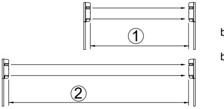

 1. Minder dan beveiligingsafstand 2. Maximum beveiligingsafstand

De ontvanger geeft ongeveer vijf seconden nadat de kap op zijn plaats is gezet een 'pieptoon af. Deze toon geeft aan dat de automatische versterking is ingesteld. Zie de onderstaande tabel *Automatische versterking instellen*.

|  | Tabel 9: Automatische versterking instellen |
|--|---------------------------------------------|
|--|---------------------------------------------|

| Toon                                                                                                          | Aanduiding                                | Resul taat                                                                         | Oorzaak                                                                                                                                 | Oplossing                                                                                                                                     |
|---------------------------------------------------------------------------------------------------------------|-------------------------------------------|---------------------------------------------------------------------------------------|-----------------------------------------------------------------------------------------------------------------------------------------|-----------------------------------------------------------------------------------------------------------------------------------------------|
| Een puls (pieptoon)                                                                                        | Optimale gevoeligheid is ingesteld. | OK                                                                                    | _                                                                                                                                       | _                                                                                                                                             |
| Aanhouden Optimale niet de toon (20 gevoeligheid seconden) kan niet worden ingesteld. |                                           | goed                                                                                  | Beam wordt onderbroken zodra de kap is teruggeplaat st.                                                                  | Verwijder obstructies en zorg ervoor dat de hand niet de beam onderbreekt wanneer de kap tijdelijk is teruggeplaatst. |
|                                                                                                               |                                           | Beams zijn verkeerd uitgelijnd en gevoeligheid afzwakkings LED brandt. | Controleer de instelling voor het beam vermogen bij de zender met geplaatste kap en pas de beam-uitlijning aan. |                                                                                                                                               |

**Opmerking:** Er klinkt een pieptoon ongeacht of de schakelaar voor de "pieptoon" (uitlijntoon) is in- of uitgeschakeld.

**Opmerking:** De instelling voor automatische versterking wordt vergrendeld, zelfs als de stroom wordt onderbroken.

**Opmerking:** Als de kap van de ontvanger is verwijderd met de voeding aangesloten of als de voeding langer dan twee weken is uitgeschakeld (maar de kap is niet verwijderd), wordt de automatische versterking automatisch opnieuw ingesteld op maximum gevoeligheid. (versterking wordt automatisch vergrendeld wanneer de voeding wordt hersteld).

#### **Toonindicator**

Deze functie geeft zoemertonen of signalen voor de opties in de tabel hieronder.

#### **Tabel 10: Toonindicator**

| Testtoon/ signaal                          | Schake laar voor toonuit lijning | Andere conditie                      | Beschrijving                                                                                                                         |
|-----------------------------------------------|-------------------------------------------|-----------------------------------------|--------------------------------------------------------------------------------------------------------------------------------------|
| Beam uitlijning                            | AAN                                       | Kap ontvanger verwijderd          | Ontvangststerkte wordt gecontroleerd.                                                                                             |
|                                               |                                           |                                         | Toonhoogte stijgt naarmate de ontvangst verbetert.                                                                             |
|                                               |                                           |                                         | Opmerking: Er klinkt geen toon indien de gevoeligheid-LED brandt of als het vergrendelingsafstandstuk is aangebracht. |
| Automatische versterkings vergrendeling | AAN/UIT                                   | Nadat kap ontvanger is bevestigd. | Korte toon geeft aan dat de vergrendeling is ingesteld.                                                                        |
|                                               |                                           |                                         | Aanhoudende toon (20 sec.) geeft aan dat aanpassing is vereist.                                                                |

| Testtoon/ signaal | Schake laar voor toonuit lijning | Andere conditie                                                     | Beschrijving                                                                                                                                                              |
|----------------------|-------------------------------------------|------------------------------------------------------------------------|---------------------------------------------------------------------------------------------------------------------------------------------------------------------------|
| Looptest             | AAN                                       | Ongeveer 5 minuten nadat de versterking is vergrendeld. | Toon is gekoppeld aan alarm-LED.                                                                                                                                       |
|                      |                                           |                                                                        | Beide worden gelijktijdig geactiveerd.                                                                                                                                 |
| Alarmgeheug en    | AAN                                       | Instellen op handmatig geheugen.                                 | "Pieptoon" klinkt als er zich een alarmconditie voordoet.                                                                                                           |
|                      |                                           |                                                                        | Opmerking: Deze configuratie wordt niet aanbevolen voor de meeste beveiligingstoepassingen. De toon zou de indringer kunnen alarmeren voor detectie. |

#### **Reactietijd**

#### Zie Afbeelding 20.

Reactietijd (sec.). 1. Reactie 0,05 sec: rennen. 2. Reactie 0,3 sec: snel lopen; 3. Reactie 0,7 sec: lopen.

Deze functie wordt gebruikt om de reactietijd van de beam aan te passen aan de toepassing. De unit detecteert niet het passeren van objecten die sneller zijn dan de ingestelde reactietijd.

#### **Disqualificatie**

Het disqualificatiesignaal wordt geactiveerd als het beamontvangsniveau daalt tot ongeveer 50% of meer. De module "controleert" op een geleidelijke afname van de beamontvangst, om extreem slechte weersomstandigheden aan te duiden. Selecteer signaaluitgang NC of NO. Contact vermogen 30 VAC/VDC, 1A of minder.

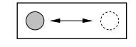

**NO NC**

**Alarmgeheugenfunctie** 

Zie Afbeelding 22.

**Beschrijving afbeelding 22** 

| 1 | Alarmuitgang                                     |
|---|--------------------------------------------------|
| 2 | Geheugen-LED                                     |
| 3 | Alarmgeheugeningang                              |
| 4 | Logic L                                          |
| 5 | Logic H                                          |
| 6 | Pieptoon bij beam-onderbreking (uitlijntoon AAN) |

De alarmgeheugen-LED geeft aan welke sensor is geactiveerd wanneer er zich twee of meer sensoren in één zone bevinden. Er kan ook een hoorbaar signaal worden geselecteerd. Reset kan automatisch of handmatig plaatsvinden.

**Automatische reset:** De geheugen-LED blijft na een alarmsignaal vijf minuten branden en vervolgens 55 minuten knipperen alvorens de normale modus weer wordt

ingeschakeld. Indien er nog meer alarmsignalen worden geactiveerd, herhaalt het proces zich.

**Handmatig:** De geheugen-LED gaat branden bij handmatige resetknop. Het geheugen wordt handmatig gereset met een resetknop geopend (L) of gesloten (H). De resetknop kan op een willekeurige handige locatie in het pand worden geplaatst of vanuit het alarm paneel worden geschakeld.

**Toonalarm met LED:** Indien een hoorbaar signaal is vereist in combinatie met het geheugen-LED, schakelt u de schakelaar voor de zoemer in.

**Opmerking:** Indien de alarmgeheugenfunctie niet wordt gebruikt, stelt u de geheugenschakelaar in op "handmatig" en sluit u de bedrading niet aan.

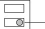

Geheugenschakelaar (automatische reset handmatig) Handmatige geheugenschakelaar (H - L)

### **Uitwendige afmetingen**

Zie Afbeelding 23.

### **Problemen oplossen**

| Probleem                                                   | Mogelijke oorzaak                                                                  | Oplossing                                                            |
|------------------------------------------------------------|------------------------------------------------------------------------------------|----------------------------------------------------------------------|
| Bedienings -LED gaat                                    | Geen voeding.                                                                      | Schakel de voeding in.                                               |
| niet branden.                                           | Slechte aansluitingen of kortsluiting.                                          | Controleer en repareer de bedrading.                              |
| Alarm-LED gaat niet                                     | Geen voeding.                                                                      | Schakel de voeding in.                                               |
| branden wanneer de beam wordt onder broken. | Slechte aansluitingen of kortsluiting.                                          | Controleer en repareer de bedrading.                              |
|                                                            | Beam reflecteerd op een ander object en wordt naar de ontvanger gestuurd. | Verwijder het reflecterende object of wijzig de beam richting. |
|                                                            | Twee beams worden niet gelijktijdig onderbroken.                                | Onderbreek twee beams gelijktijdig.                               |
|                                                            | De beam onderbrekingstijd is korter dan de ingestelde reactietijd.        | Pas de beam-reactietijd aan.                                      |
| Alarm-LED blijft                                        | Beam-uitlijning is verkeerd afgesteld.                                          | Controleer en stel opnieuw af.                                    |
| branden.                                                   | Afschermend object tussen de zender en ontvanger.                            | Verwijder de afschermende objecten.                               |
|                                                            | Lenzen van de unit zijn vies.                                                   | Reinig de lenzen met een zachte doek.                             |
|                                                            | Frequentiekanaal tussen de zender en de ontvanger is niet compatibel.     | Stel opnieuw in op hetzelfde kanaal.                              |
| Onderbrok en alarmen                                    | Slechte staat van de bedrading.                                                 | Controleer opnieuw.                                                  |
|                                                            | Gewijzigde voedingsspanning.                                                    | Zorg voor een stabiele voedingsspanning.                          |
|                                                            | Afschermend object tussen zender en ontvanger.                               | Verwijder het afschermende object.                                |

| Probleem | Mogelijke oorzaak                                                                                                            | Oplossing                                                                                                                  |
|----------|------------------------------------------------------------------------------------------------------------------------------|----------------------------------------------------------------------------------------------------------------------------|
|          | Een omvangrijke elektrische storingsbron, zoals een elektrisch apparaat, in de buurt van de zender en ontvanger. | Wijzig de locatie van de installatie.                                                                                   |
|          | Onstabiele installatie van zender en ontvanger.                                                                           | Verbeter de stabiliteit.                                                                                                   |
|          | Lenzen van zender of ontvanger vervuild.                                                                                  | Reinig de lenzen met een zachte doek.                                                                                   |
|          | Onjuiste uitlijning.                                                                                                         | Controleer en stel opnieuw af.                                                                                          |
|          | Kleine dieren kunnen langs de twee beams lopen.                                                                        | Verhoog de reactietijd. (niet mogelijk in locaties waar de indringer snel kan rennen.)                               |
|          | Beam-vermogen is ingesteld op L, waarmee onvoldoende gevoeligheidscompensati e plaatsvindt.                      | Stel de beam vermogenschakelaar in op H en vergrendel de versterking van de unit met verwijderde ontvangerkap. |

## **Specificaties**

| Model                        | PB601                                                                                                                                                                                                             | PB611                                                  | PB621                                       |
|------------------------------|-------------------------------------------------------------------------------------------------------------------------------------------------------------------------------------------------------------------|--------------------------------------------------------|---------------------------------------------|
| Detectie systeem          | Aktief infrarood systeem (gelijktijdige onderbreking van 4 TX-RX-beams)                                                                                                                                        |                                                        |                                             |
| Infrarood beam            | LED-puls beam, dubbele modulatie                                                                                                                                                                                  |                                                        |                                             |
| Beveiligings afstand      | Buiten ≤50 m                                                                                                                                                                                                      | Buiten ≤100 m                                          | Buiten ≤200 m                               |
| Max. ontvangst afstand | Tienvoudig (500 m)                                                                                                                                                                                             | Tienvoudig (1.000 m)                                | Tienvoudig (2000 m)                      |
| Reactietijd                  | 50-700 msec. variabel (standaard = 50 msec.)                                                                                                                                                                      |                                                        |                                             |
| Voedings eenheid          | 12-30 VDC (geen polariteit)                                                                                                                                                                                       |                                                        |                                             |
| Stroom verbruik           | ≤60 mA bij beveiliging (max. ≤95 mA)                                                                                                                                                                        | ≤75 mA bij beveiliging (max. ≤105 mA)            | ≤80 mA bij beveiliging (max. ≤120 mA) |
| Alarmuitgang                 |                                                                                                                                                                                                                   | Uitgang potentiaalvrij contactrelais 1C                |                                             |
|                              | s)                                                                                                                                                                                                                | Contactactie: onderbrekingstijd + vertragingstijd (1-3 |                                             |
|                              | Contactcapaciteit: 30 V AC/DC, 1 A of minder                                                                                                                                                                      |                                                        |                                             |
| Sabotage                     |                                                                                                                                                                                                                   | Potentiaalvrij contactrelais 1b (N/C)                  |                                             |
| uitgang                      |                                                                                                                                                                                                                   | Actie: geactiveerd wanneer de kap is verwijderd        |                                             |
|                              |                                                                                                                                                                                                                   | Contactcapaciteit: 30 V AC/DC, 0,1 mA of minder        |                                             |
| Alarm-LED                    | Rood LED (ontvanger). AAN: wanneer een alarm is geactiveerd                                                                                                                                                    |                                                        |                                             |
| Geoeligheids LED          | Rood LED (ontvanger). AAN: wanneer een beam is afgezwakt                                                                                                                                                       |                                                        |                                             |
| Functies                     | Gemoduleerde beam-frequentie selecteren. Toonindicator. Omgevingsmodule. Beam-vermogen selecteren. Alarmgeheugenindicatie. Geprogrammeerde AGC. Automatische versterkingsfunctie. Monitoraansluiting. |                                                        |                                             |
| Beam aanpassing           | Horizontaal: ±90°. Verticaal: ±10°                                                                                                                                                                                |                                                        |                                             |
| Omgevings temperatuur     | −35°C tot +66°C                                                                                                                                                                                                   |                                                        |                                             |

| Model               | PB601                  | PB611                               | PB621 |
|---------------------|------------------------|-------------------------------------|-------|
| Montage posities | Buiten                 |                                     |       |
| Bedrading           | Aansluitconnectoren    |                                     |       |
| Gewicht             |                        | Zender: 1.200 g. Ontvanger: 1.300 g |       |
| Uiterlijk           | PC-harslaag (wijnrood) |                                     |       |

## **Regelgeving**

| Fabrikant      | UTC Fire & Security Americas Corporation, Inc. 1275 Red Fox Rd., Arden Hills, MN 55112-6943, USA                                                                                                                                                                                                                                                                                                                       |
|----------------|------------------------------------------------------------------------------------------------------------------------------------------------------------------------------------------------------------------------------------------------------------------------------------------------------------------------------------------------------------------------------------------------------------------------------|
|                | Geautoriseerde EU-vertegenwoordiger: UTC Fire & Security B.V. Kelvinstraat 7, 6003 DH Weert, Nederland                                                                                                                                                                                                                                                                                                                 |
| Certificatie   |                                                                                                                                                                                                                                                                                                                                                                                                                              |
| Milieuklasse   | Klasse 4                                                                                                                                                                                                                                                                                                                                                                                                                     |
| EU-richtlijnen | 2002/95/EC (RoHs-richtlijn): Hierbij verklaart UTC Fire & Security dat dit apparaat voldoet aan de noodzakelijke vereisten en andere relevante voorzieningen van richtlijn 2002/95/EC                                                                                                                                                                                                                               |
|                | 2002/96/EC (WEEE-richtlijn): Producten met dit symbool mogen in de Europese Unie niet bij het ongesorteerde gemeenteafval worden gegooid. Voor een correcte recycling dient u dit product te retourneren aan uw lokale leverancier op het moment dat u een vergelijkbaar nieuw product aanschaft, of het weg te gooien op toegewezen verzamelpunten. Voor meer informatie zie: www.recyclethis.info. |
|                | 2004/108/EC (EMC-richtlijn): Hierbij verklaart UTC Fire & Security dat dit apparaat voldoet aan de noodzakelijke vereisten en andere relevante voorzieningen van richtlijn 2004/108/EC.                                                                                                                                                                                                                             |

## **Contactgegevens**

Raadpleeg onze website voor contactgegevens: www.utcfireandsecurity.com.

# **SV: Installationsanvisningar**

## **Produktbeskrivning**

**Bild 1:** Produkten levereras med nedanstående delar.

| 1  | Kåpa                                 |
|----|--------------------------------------|
| 2  | Horisontell finjusteringsskruv       |
| 3  | Vertikal finjusteringsskruv          |
| 4  | Anslutningar                         |
| 5  | Sabotage kontakt (endast mottagaren) |
| 6  | Avståndsjustering (endast mottagare) |
| 7  | Funktioner/Indikeringar (se bild 2)  |
| 8  | Lins                                 |
| 9  | Sikte                                |
| 10 | Justerskiva                          |

| 11 | Avskärmningsskiva               |
|----|---------------------------------|
| 12 | Monteringsplatta                |
| 13 | Stolpklammer                    |
| 14 | 8 monterings skruvar (Ø 4 x 30) |
| 15 | 8 försänkta skruvar             |

### **Bild 2:** Funktioner/Indikationer på Sändaren (TX) och Mottagaren (RX).

| 1  | Drift indikerings LED                                      |
|----|------------------------------------------------------------|
| 2  | Sändarstyrka (grundinställning = H)                        |
| 3  | Frekvensväljare (grundinställning = kanal 1)               |
| 4  | Känslighetsindikering LED                                  |
| 5  | Larm indikerings LED                                       |
| 6  | Omkopplare för summer (grundinställning = AV)              |
| 7  | Inställning av reaktionstid (grundinställning = 50 ms)     |
| 8  | Testuttag                                                  |
| 9  | Larmminnes LED                                             |
| 10 | Frekvensväljare (grundinställning = frekvens 1-4, kanal 1) |
| 11 | Omkopplare för väderlarmsutgång (grundinställning = N/C)   |
| 12 | Minnes omkopplare (grundinställning = manuell)             |
| 13 | Larmminnes omkopplare (grundinställning = L)               |
| 14 | Väderlarmsutgång                                           |
| 15 | Fjärrstyrnings ingång                                      |
|    |                                                            |

### **Installation**

**Riktlinjer vid installation av detektorerna** 

**Bild 3:** Exempel på var detektorn inte ska installeras. Tänk på väder förändringar samt undvik starkt ljus. Montera detektorerna på stabilt underlag.

**Bild 4:** Beräkna strålarnas expansion (B), (A = avstånd mellan detektorerna). Spridningen av strålarna måste tas med i beräkningen för varje modell av detektor för att undvika reflektioner från marken samt närliggande föremål.

**Bild 5:** Rekommenderad installationshöjd.

#### **Inkoppling**

Anslut spänning till sändaren och mottagaren, inkopplingen är lite olika beroende på antalet enheter eller sektioner. Kabel arean är även den olika beroende på avståndet mellan detektor och strömkälla/centralenhet och skall följa elsäkerhetsföreskrifterna.

**OBS:** Larmutgången kan inte enbart användas för den övre/undre linjen utan både övre och undre linjen skall brytas för larm. Var noga med att välja rätt typ av kabel vid nedgrävning/utomhusmontage.

**Bild 6:** Exempel på kabel koppling.

Exempel 1: Standard koppling

Exempel 2: Två eller flera detektorer anslutna på samma sektion

Exempel 3: Två eller flera detektorer anslutna på skilda sektioner

Exempel 4: Två på varandra monterade detektorer i standard koppling

Exempel 5: När vädermodulen samt larmminnet används.

Se sektion *Funktionsbeskrivning* för att välja stålens frekvens.

**Bild 7:** Rekommenderad kabeldiameter och längd för systemet (m).

**Notera:** Den maximala kabellängden för system med två eller flera detektorpar är kabellängden dividerat med antalet detektorpar.

**Notera:** Signalkablarna kan vara upp till 1000 meter om AWG22 (diameter 0,65 mm) används.

**Batteri:** Var noga med att centralen är utrustad med korrekt batteri och laddning. Använd minimum 12 V batteri med kapacitet på 0.5 Ah.

#### **Inkoppling**

Se Bild 8.

#### **Bild 8 beskrivning**

| 1 | Omgivningskompensation NC eller NO, 30 VAC/VDC 1 A |
|---|----------------------------------------------------|
| 2 | Larmminne                                          |
| 3 | Fjärråterställnings knapp                          |
| 4 | Matning                                            |
|   |                                                    |

#### **Montering av enheterna**

Enheterna kan monteras på stolpe eller på jämn yta. Genom att använda justeringen justera in speglarna vertikalt (A) och horisontellt (B) så att enheten kan fungera åt alla håll (bild 9). Se exempel 1-3.

#### **Vägg montering**

- 1. Lossa locket på detektorn genom att lossa skruven längst ned på locket (bild 10).
- 2. Lossa skruvarna som håller detektorkroppen på monteringsplattan samt dra monterings plattan nedåt.
- 3. Placera monteringsplattan på väggen som en mall och rita av hålen för skruvarna. Se till att lämna 25 mm fritt ovan samt under monteringsplattan så att detektorns lock lätt kan monteras efter installationen. Bild 11. 1: Trävägg. 2: Betongvägg: se även specifikation för väggplugg.
- 4. Installera detektorn (bild 12):
	- Skruva i monteringsskruven tills ca 15 mm återstår.
	- Häng på monteringsplattan på skruvarna.
	- Dra igenom kabeln.
	- Dra åt skruvarna ordenligt och täta kabel genomföringen.
	- Montera detektorkroppen och anslut den.
	- Justera in enheterna och montera locken.

#### **Montering på stolpe**

- 1. Lossa locket på detektorn genom att lossa skruven längst ned på locket (bild 10).
- 2. Lossa skruvarna som håller detektorkroppen på monteringsplattan samt dra monterings plattan nedåt.
- 3. Stolpens diameter skall vara ca 42-44 mm. Gör ett kabel hål i stolpen så att det passar med detektorns monteringshöjd, fila borrhålets kanter eller montera kabel genomföring. Montera även en hatt på stolpen så den ej blir vattenfylld (bild 13).
- 4. Installera detektorn på stolpen (bild 14, 1: Täta även igen hålet):

- Skruva fast U-klammern ihop med monteringsplattan på stolpen.

- Dra igenom kabeln.
- Montera detektorenheten och anslut den.
- Justera in enheterna och montera locken, bryt loss "knockouts" för anpassning mot stolpen.

#### **Montering på stolpe rygg mot rygg**

Skruva fast fyra U-klammer på stolpen i par en ovanför den andra riktade åt motsatt håll (bild 15).

### **Inställning av funktioner samt justering av strålarna**

- 1. Anslut spänning med locket avmonterat.
- 2. Ställ in funktions val (se stycke *Beskrivning av funktioner* beskrivning funktioner för detaljerad förklaring).

| Placerad på      | Funktioner                   | Funktionsbrytare |
|---------------------|------------------------------|------------------|
| Sänd                | Kanal val                    | K 1 K 2       |
| /mottagare          | (frekvens)                   | K 3 K 4       |
| Endast sändare   | Sändarstyrka                 | H L           |
| Endast mottagare | 'Summer' injusterings ton | På … Av          |
|                     | Justering reaktionstid    | 50 ms (standard) |
|                     |                              | 300 ms … 700 ms  |
|                     |                              | Ö vriga          |
|                     | Väderlarms utgång            | NO NC         |
|                     | Larmminne                    | Auto-reset       |
|                     |                              | Manuell Hög   |
|                     |                              | Låg              |
|                     |                              | Oanvänd          |

- 3. Justera den optiska vinkeln (bild 16). Titta genom det optiska siktet på båda sidor om linsen (om möjlighet finns) och vrid/vinkla tills mottagaren är synlig i siktet. Repetera proceduren på den nedre linsen samt gör dessa 2 steg även på mottagaren.
#### **Bild 16 beskrivning**

| 1 | Sikte                          |
|---|--------------------------------|
| 2 | Horisontell finjusteringsskruv |
| 3 | Vertikal finjusteringsskruv    |
| 4 | Justerskiva                    |

- 4. Finjustering (TX = sändare/RX= mottagare) (bild 17). En första finjustering kan göras på mottagningen med ton generatorn.
#### **Bild 17 beskrivning**

| 1 | LED svag signal (lyser når sign. blir för svag) |
|---|-------------------------------------------------|
| 2 | Ljudkontroll omkopplare                         |
| 3 | Testjack                                        |

 4.1. Placera avskärmningsskiva (shading plates) (sitter på sidan av TX/RX) på den nedre linsen på både TX och RX.

 4.2. Sätt mottagarens tongenerator brytare (beep) till läget PÅ.

 4.3. Justera linserna med finjusteringsskruvarna tills högsta tonläge nås.

**Notera:** Det blir inget ljud om lysdioden för svag signal är tänd.

 4.4. Gör motsvarande procedur på den övre linsen på både TX/RX.

 4.5. Efter att inställningen är klar sätt tillbaka avskärmningsskivapå sidan av TX/RX.

4.6. Sätt tongenerator brytaren till AV på RX.

#### **Inställning av strålar med voltmeter (bild 18)**

En exakt inställning kan åstadkommas med en voltmeter (10 V DC). Anslut mätaren till testjacket (monitor) på RX. Värdena som kan avläsas skall vara enligt följande.

| Spänning    | Justering         |
|-------------|-------------------|
| ≥2.7 V      | Bäst              |
| 2.0 - 2.7 V | Bra               |
| ≤2.0 V      | Svag. Justera om. |

#### 5. Montera locken.

5.1. Montera sändarens lock först.

 5.2. Kontrollera att mottagarens svag signal LED kvarstår släckt. Sätt på locket men skruva ej fast det.

 5.3. Genom att sabotagebrytaren aktiveras kommer det en pip signal efter 5 s, om så kan locket skruvas fast.

**OBS!** Känslighetsgränserna ställs automatiskt in när beep signalen genereras.

**OBS!** Om tongenerator brytaren av misstag lämnats i PÅ läget slutar tonen när mottagarlocket sätts på.

 5.4. Om summersignalen kvarstår, lyft av locket på mottagaren och justera enligt stycke *Autokompensations lås funktion*.

### **Funktionskontroll**

Se bild 19.

Efter installation, justering av linjestrålarna samt automatisk kompensationsinställning skall anläggningen testas genom gångtest av linjerna. Detta kan göras på följande två sätt.

- 1. Kontrollera att Larm LED tänds.
- 2. Som punkt 1 men med tongenerator brytaren i läget PÅ. Tonen kommer att tystna när mottagarlocket monteras men kommer att ljuda för gångtestkontroll upp till 5 minuter efter att autokompensationen är låst.
### **Beskrivning av funktioner**

**Fyra kanalers frekvens val** 

Se bild 21.

Linjedetektor paren (TX/RX) kan sättas till olika frekvenser för att förhindra överhörning mellan enheter i staplade, linje med varandra eller andra konfigurationer där konflikter kan uppstå mellan olika linje par. Frekvenserna kan sättas som bilden nedan visar.

#### **Bild 21 beskrivning**

| 1 | Bevakning i linje                          |
|---|--------------------------------------------|
| 2 | Dubbelstaplad bevakning                    |
| 3 | Linje samt dubbelstaplad bevakning         |
| 4 | Områdes skydd                              |
| 5 | Områdes skydd samt dubbelstaplad bevakning |
|   |                                            |

**OBS!** Var noga med att TX/RX i samma par är satta till samma frekvenser samt att vid inställning skall bara det parets sändare ha spänning.

**Notera:** Övre samt undre linje par skall vara av samma modell i staplade konfigurationer.

**Notera:** Att använda en voltmeter vid inställning rekommenderas och ger bäst resultat.

#### **Val av sändarstyrka**

Denna funktion medger inställning av sändarstyrkan relaterad till den specificerade bevakningslängden. För avstånd kortare än den specificerade bevakningslängden skall sändarstyrkan reduceras för att eliminera eventuella reflektions problem. För avstånd enligt den specificerade bevakningslängden skall sändarstyrkan vara satt till H (hög).

| Modell |       | Sändarstyrka (m) |
|--------|-------|------------------|
|        | Låg   | Hög              |
| PB601  | ≤ 25  | 25-50            |
| PB611  | ≤ 75  | 75-100           |
| PB621  | ≤ 150 | 150-200          |

#### **Autokompensations låsfunktion**

Autokompensationens låsfunktion standardiserar känslighetoch toleransnivåerna på enheterna oavsett varierande installationsavstånd. Ovanstående konfigurationer har exakt samma känslighet-/toleransnivåer även om installationsavstånden är olika.

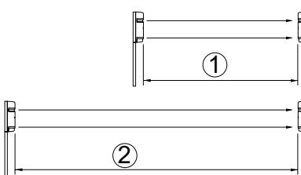

1. Kortare än bevakningslängd

2. Max. bevakningslängd En summerton avges ifrån mottagaren ungefär 5 sekunder efter att locket har monterats (sabotagebrytaren tryckts in). Denna ton indikerar att autokompensations Iåset har aktiverats. Se tabell *Autokompensations*.

#### **Tabell 1: Autokompensations**

| Ton                             | Indikerar                                   | Result      | Orsak                                                                            | Åtgärd                                                                                                |
|---------------------------------|---------------------------------------------|-------------|----------------------------------------------------------------------------------|-------------------------------------------------------------------------------------------------------|
| En puls (beep)               | Optimal känslighet har utförts.       | OK          | _                                                                                | _                                                                                                     |
| Kontinuerli gt ton (20 s) | Optimal känslighet kan ej utföras. | Inte bra | Avbrott på strålen när locket monteras.                                 | Flytta blockerande föremål samt kontrollera att handen ej bryter när lock monteras. |
|                                 |                                             |             | Strålarna är dåligt justerade och lysdioden svag signal lyser. | Kontrollera sändarstyrkan med lock på samt justera om strålarna.                          |

**Notera:** En ton genereras oavsett om brytaren "beep" (ton inställning) är i PÅ eller AV.

**Notera:** Autokompensationslåset har ca 2 veckors minne även om spänningen till detektorn är bruten.

**Notera:** Om mottagarlocket är avmonterat och detektorn spänningssätts eller om spänningen är borta i 2 veckor (med locket på), autokomp. Låset ställer då automatiskt till max känslighet. (Kompensationen låses automatiskt när spänningen återkommer).

#### **Ton indikeringar**

Denna funktion medger ljudande test eller signaler för följande funktioner.

#### **Tabell 2: Ton indikeringar**

| Test/Signal               | Ton brytare (beep) | Övrigt                                               | Beskrivning                                                                                            |
|---------------------------|--------------------------|------------------------------------------------------|--------------------------------------------------------------------------------------------------------|
| Strålinställnin g      | PÅ                       | Mottagarlock avmonterat.                          | Kontroll av mottagen styrka. Tonen höjs om mottagningen ökar.                                    |
|                           |                          |                                                      | OBS! Ingen ton avges om svag signal LED är tänd eller om mottagarlocket är monterat.          |
| Autokompens ations lås | På eller Av Efter att    | mottagarlock et monterats.                        | Kort ton indikerar att låset har aktiverats. Lång ton (20 s) indikerar att omjustering krävs. |
| Gångtest                  | PÅ                       | I ungefär 5 minuter efter autokomp är låst. | Ton är knuten till "larm" LED. Båda aktiveras samtidigt.                                         |

| Test/Signal | Ton brytare (beep) | Övrigt                             | Beskrivning                                                                                                                                                                   |
|-------------|--------------------------|------------------------------------|-------------------------------------------------------------------------------------------------------------------------------------------------------------------------------|
| Larmminne   | PÅ                       | Inställd för manuellt minne. | Beep aktiveras vid larm. OBS: Denna konfiguration rekommenderas ej för de flesta säkerhetsapplikationer då tonen kan varna en inkräktare om detektering. |

**Inställning av reaktionstiden** 

Se bild 20.

- 1. Reaktionstid 0.05 s: Springa
- 2. Reaktionstid 0.3 s: Gå snabbt
- 3. Reaktionstid 0.7 s: Gå.

Denna funktion kan användas till att anpassa reaktionstiden för att passa applikationen. Vidtag försiktighet vid inställning av 700 msek. Risk finns att detektion ej erhålls av människa i snabb rörelse, verifiera alltid genom gångtest.

#### **Väderlarmsfunktion**

Väderlarmet aktiveras om mottagarens mottagna effekt reduceras med ca 50% eller mer.

Funktionen kontrollerar om en långsam sänkning av den mottagna effekten sker, som är typiskt för extremt dåliga väderförhållanden. Brytande/slutande är valbart. (max belastning 30 V AC/DC/1 A).

|--|

**NO NC**

#### **Larmminnes funktion**

Se bild 22.

#### **Bild 22 beskrivning**

| 1 | Larm utgång                                     |  |
|---|-------------------------------------------------|--|
| 2 | Minnes LED                                      |  |
| 3 | Larmminnes ingång                               |  |
| 4 | Logisk L                                        |  |
| 5 | Logisk H                                        |  |
| 6 | Beep ljud vid bruten linje (riktnings ton = PÅ) |  |

Larmminnes LED indikerar vilken detektor som har givit larm om flera detektorer är anslutna till samma sektionsingång. Ljudlig ton kan väljas som tillval samt återställning kan vara automatisk eller manuell.

**Automatisk återställning:** Minnes LED lyser 5 min. efter ett larm och fortsätter därefter att blinka i 55 min. innan den återgår till normalläge (släckt). Vid ytterligare larm upprepas processen.

**Manuel återställning:** Minnes LED lyser om den externa omkopplaren aktiveras. Minnet återställs manuellt om brytaren bryter (L) eller sluter (H). Brytaren placeras på önskad plats i anläggningen.

**Ljudlig ton samt LED:** Om en ljudande signal önskas samtidigt som minnes LED, slå brytare "beep" till PÅ -läge.

**Notera:** Om larmminnes funktionen inte används skall omkopplaren stå i läge "manuell" och klämma 10 skall vara bortkopplad. (larmminnes -omkopplaren kan vara antingen H el L.

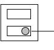

Minnesomkopplare (auto - manuell)

Larmminnesomkopplare (H - L)

### **Yttre dimensioner**

Se bild 23.

## **Felsökning**

| Problem                          | Möjlig orsak                                                                        | Atgärd                                                       |  |
|----------------------------------|-------------------------------------------------------------------------------------|--------------------------------------------------------------|--|
| Driftindikering s LED släckt. | Ingen matningsspänning.                                                          | Anslut spänning.                                             |  |
|                                  | Dålig anslutning eller avbrott/kortslutning.                                     | Kontrollera kablaget.                                        |  |
| Larm LED tänds ej när         | Ingen matningsspänning.                                                          | Anslut spänning.                                             |  |
| strålen bryts.                   | Dålig anslutning eller avbrott/kortslutning.                                     | Kontrollera kablaget.                                        |  |
|                                  | Strålen reflekteras på någon blank yta och skickas in i mottagaren.        | Flytta reflekterande objekt eller byt installationsplats. |  |
|                                  | Detektorns båda strålar bryts ej samtidigt.                                   | Bryt alla strålar samtidigt.                                 |  |
|                                  | Tiden för avbrott på strålarna är kortare än den inställda reaktionstiden. | Justera reaktionstiden.                                      |  |
| Larm LED                         | Fel injusterat.                                                                     | Kontrollera och justera igen.                                |  |
| lyser kontinuerligt.          | Något skymmer sändare/mottagare.                                                 | Tag bort skymmande objekt.                                |  |
|                                  | Optiken är smutsig.                                                                 | Rengör med mjuk trasa.                                       |  |
|                                  | Sändarfrekvensen stämmer inte med mottagare.                                  | Ändra till samma kanal.                                      |  |
| Obefogade larm                | Dåliga kabelanslutningar.                                                        | Kontrollera anslutningarna.                                  |  |
|                                  | Byte av strömförsörjning.                                                        | Justera spänningen.                                          |  |
|                                  | Något skymmer sändare/mottagare.                                                 | Tag bort skymmande objekt.                                |  |
|                                  | En kraftig elektrisk störkälla finns nära detektorerna.                       | Byt installationsplats.                                      |  |
|                                  | Ostabilt monteringsunderlag.                                                     | Staga.                                                       |  |
|                                  | Optiken är smutsig.                                                                 | Rengör med mjuk trasa.                                       |  |
|                                  | Dålig injustering.                                                                  | Kontrollera och justera igen med.                         |  |

| Problem | Möjlig orsak                                                                                  | Atgärd                                                                                                      |
|---------|-----------------------------------------------------------------------------------------------|-------------------------------------------------------------------------------------------------------------|
|         | Djur kanske passerar de båda strålarna.                                                    | Ställ längre reaktionstid, tänk dock på att man då kanske kan springa snabbt igenom (kontrollera). |
|         | Switchen för sändarstyrkan är inställd på L och erhåller inte tillräcklig styrka. | Ställ switchen för sändarstyrkan på H och gör en autokompensation med mottagarens kåpa av.         |

## **Tekniska data**

| Modell                   | PB601                                                                                                                                                                | PB611                                           | PB621                           |  |
|--------------------------|----------------------------------------------------------------------------------------------------------------------------------------------------------------------|-------------------------------------------------|---------------------------------|--|
| Detekterings princip. | Brytning av IR-strålar (Tx-Rx samtidig brytning av 4 strålar)                                                                                                     |                                                 |                                 |  |
| Ir-stråle                | LED pulsad stråle, dubbel modulation                                                                                                                                 |                                                 |                                 |  |
| Funktionsavst ånd     | Utomhus ≤50 m                                                                                                                                                        | Utomhus ≤100 m                               | Utomhus ≤200 m                  |  |
| Max. kabel längd      | x 10 (500 m)                                                                                                                                                         | x 10 (1000 m)                                   | x 10 (2000 m)                   |  |
| Reaktionstid             | Ställbar 0.05-0.7 sek (Standard: 0.05 sek)                                                                                                                           |                                                 |                                 |  |
| Driftspänning            |                                                                                                                                                                      | 12-30 VDC (ej polaritetsberoende)               |                                 |  |
| Strömförbruk ning     | 60 mA i drift (max. ≤95 mA)                                                                                                                                       | 75 mA i drift (max. ≤105 mA)                 | 80 mA i drift (max. ≤120 mA) |  |
| Larmutgång               | Reläutgång: NO alternativt NC Funktion: brytningstid inkl frånslagsfördröjning (1-3 s) Kontakt kapacitet: 30 V AC/DC, 1 A                                      |                                                 |                                 |  |
| Väder/Miljö utgång    | Reläutgång: NO alternativt NC Funktion: Larmutgång vid dåligt väder Kontakt kapacitet: 30 V AC/DC, 1 A                                                         |                                                 |                                 |  |
| Larm LED                 | Röd LED (mottagaren). ON: Aktiv vid larm                                                                                                                             |                                                 |                                 |  |
| Svag signal LED       |                                                                                                                                                                      | Röd LED (mottagaren). ON: Aktiv vid svag signal |                                 |  |
| Funktioner               | Modulerad strålningsfrekvens val. Tonindikator. Väderlarmsfunktion. Stråleffekts val. Indikering larmminne. Programmerad AGC. Auto-gain funktion. Mätuttag. |                                                 |                                 |  |
| Justering av stråle   | Horisontellt: ±90°. Vertikalt: ±10°                                                                                                                                  |                                                 |                                 |  |
| Temperatur område     | −35°C till +66°C                                                                                                                                                     |                                                 |                                 |  |
| Monterings plats      | Utomhus                                                                                                                                                              |                                                 |                                 |  |
| Anslutning               | Skruvplintar                                                                                                                                                         |                                                 |                                 |  |
| Vikt                     | Sändare: 1200 g. Mottagare: 1300 g                                                                                                                                   |                                                 |                                 |  |
| Utseende                 | Svart polykarbonatplast                                                                                                                                              |                                                 |                                 |  |

### **Information om regler och föreskrifter**

| UTC Fire & Security Americas Corporation, Inc. 1275 Red Fox Rd., Arden Hills, MN 55112-6943, USA                                                                                                                                                                                                                                                                      |  |  |
|-----------------------------------------------------------------------------------------------------------------------------------------------------------------------------------------------------------------------------------------------------------------------------------------------------------------------------------------------------------------------------|--|--|
| Auktoriserad EU representant för tillverkaren: UTC Fire & Security B.V. Kelvinstraat 7, 6003 DH Weert, Netherlands/Holland                                                                                                                                                                                                                                         |  |  |
|                                                                                                                                                                                                                                                                                                                                                                             |  |  |
| Klass IV                                                                                                                                                                                                                                                                                                                                                                    |  |  |
| 2002/95/EC (RoHs): Härmed intygar UTC Fire & Security att den här enheten åtföljer de grundläggande kraven och andra relevanta bestämmelser i direktivet 2002/95/EC                                                                                                                                                                                                |  |  |
| 2002/96/EC (WEEE): Produkter märkta med denna symbol får inte kastas i allmänna sophanteringssytem inom den europeiska unionen. För korrekt återvinning av utrustningen skall den returneras din lokala återförsäljare vid köp av liknande ny utrustning eller lämnas till en därför avsedd deponering. För mer information, se: www.recyclethis.info. |  |  |
| 2004/108/EC (EMC): Härmed intygar UTC Fire & Security att den här enheten åtföljer de grundläggande kraven och andra relevanta bestämmelser i direktivet 2004/108/EC.                                                                                                                                                                                              |  |  |
|                                                                                                                                                                                                                                                                                                                                                                             |  |  |

### **Kontaktinformation**

För kontaktinformation se vår websida: www.utcfireandsecurity.com.