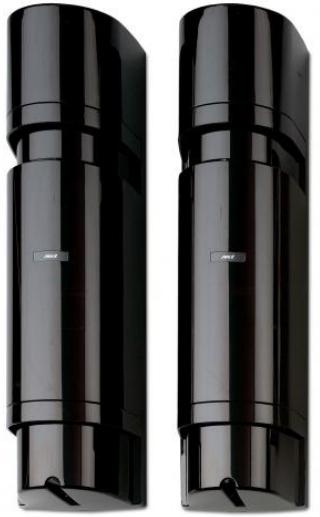

# PB611

Produktblad

Linjedetektor, 4 strålar, 100 m utomhus, siktkontroll

# PB611

PB611 har dubbel frekvensmodulation och faslåsning med högeffektsändare för att utan problem klara långa räckvidder och hög känslighet. Den patenterade tekniken ger utmärkt tålighet för väderstörningar som dimma, snö och regn med mera. Detektorerna kan programmeras med fyra olika modulationsfrekvenser. Genom att använda olika frekvenser förhindras att detektorerna påverkas från andra detektorer i samma anläggning.

#### Strålar

PB600-serien har teknik med fyralinjers synkroniserade strålar som minimerar risken för obefogade larm. Risken för samtidigt avbrott på fyra strålar orsakat av små djur, fåglar och fallande löv är närmast obefintlig.

#### Vridbar optik

Optiken hos sändare och mottagare kan vridas 180° för maximal flexibilitet. Enheterna behöver därför inte monteras exakt mitt för varandra, vilket försvårar för obehöriga att avgöra detekterings- området. Optiken är tät vilket förhindrar att insekter stör funktionen.

# Enkel installation

Med hjälp av precisionssikten förenklas installationen och samtidigt garanteras en perfekt inställning. Detektorns känslighet kontrolleras med hjälp av en speciell mätpunkt. I PB600-seriens detektorer finns även en störnings-LED för indikering av dålig mottagning.

#### Filter

Elektroniska och optiska filter minimerar riskerna för störningar förorsakade av solljus, strålkastare, lysrör och kvicksilverlampor. Utomhusmodellerna har en speciell huv som skyddar detektorn mot frost eller fukt.

# Förstärkningskontroll

PB600-serien har automatisk förstärkningskontroll (AGC) som ger rätt känslighet oberoende på omgivningsförhållanden. Speciella filter ger hög immunitet mot elektriska och elektromagnetiska störningar. En inbyggd högtalare i PB600- serien ger med en ton information om hur väl systemet är injusterat.

#### Standardprestanda

- ERäckvidd 100 m
- E För utomhusmontering
- E4 synkroniserade strålar
- E4 valbara frekvenssteg garanterar att rätt sändar-/ mottagarpar arbetar endast med varandra
- EJusterbar precisionsoptik
- EMycket väl skyddade mot EMC-störningar
- EAGC känslighetskontroll
- EExtra linsvärmare som tillbehör
- EStort antal olika pelare för utomhusmontering
- E Siktkontroll är standard
	- ELjudsignal för rätt injustering
	- E Larmminne

# PB611

# Linjedetektor, 4 strålar, 100 m utomhus, siktkontroll

Ett komplett tillbehörsprogram med linsvärme, pelare, kapslingar osv finns för olika applikationer.

# Tekniska data

| IR-system             | 4 strålar, dubbel frekvensmod.      |
|-----------------------|-------------------------------------|
| Maximal räckvidd      | 100 m                               |
| Responstid            | Justerbar, 50 - 700 msek.           |
| Drivspänning          | 12 - 30 VDC                         |
| Larmutgång            | NC/NO (max 30 VAC/DC, 1 A)          |
| Strömförbrukning      |                                     |
| Vid normal drift      | 70 mA                               |
| Vid larm              | 105 mA                              |
| Sabotageutgång        | NC (max 30 VAC/DC, 100 mA)          |
| Utgång för dålig sikt | NC/NO (max 30 VAC/DC, 1 A)          |
| Temperaturområde      | -35° till +66° C (utan extra värme) |
| Mått (L x B x H)      | 390 x 104 x 98 mm                   |
| Kapsling              | Vädersäker svart polykarbonat       |

|  | Order data |  |  |
|--|------------|--|--|
|  |            |  |  |

| Artikelnummer     | Beskrivning                                           |
|-------------------|-------------------------------------------------------|
| PB611             | Linjedetektor, 4 strålar, 100 m utomhus, siktkontroll |
| Övriga detektorer |                                                       |
| PB601             | Linjedetektor, 4 strålar, 50 m utomhus, siktkontroll  |
| PB621             | Linjedetektor, 4 strålar, 200 m utomhus, siktkontroll |
| Tillbehör         |                                                       |
| PB103             | Värmeelement med termostat för PB600-serien           |

