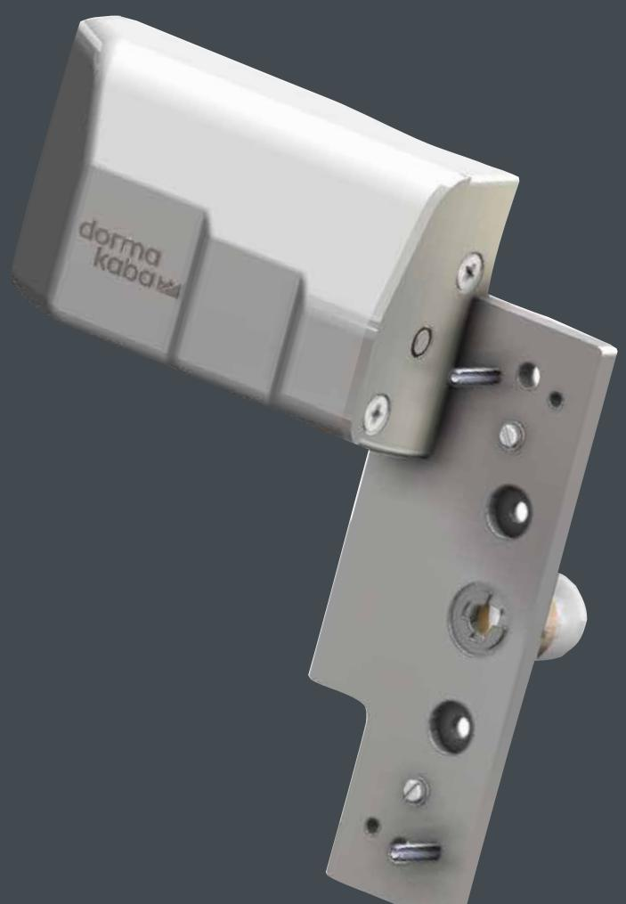

### PHM STANDARD / EXTERNAL 65.050.10-1

**Installation Manual**

**EN** | **DA** | **FI** | **NO** | **SV**

—

## **PHM Standard / External**

PHM ST ANDARD / EXTERNAL

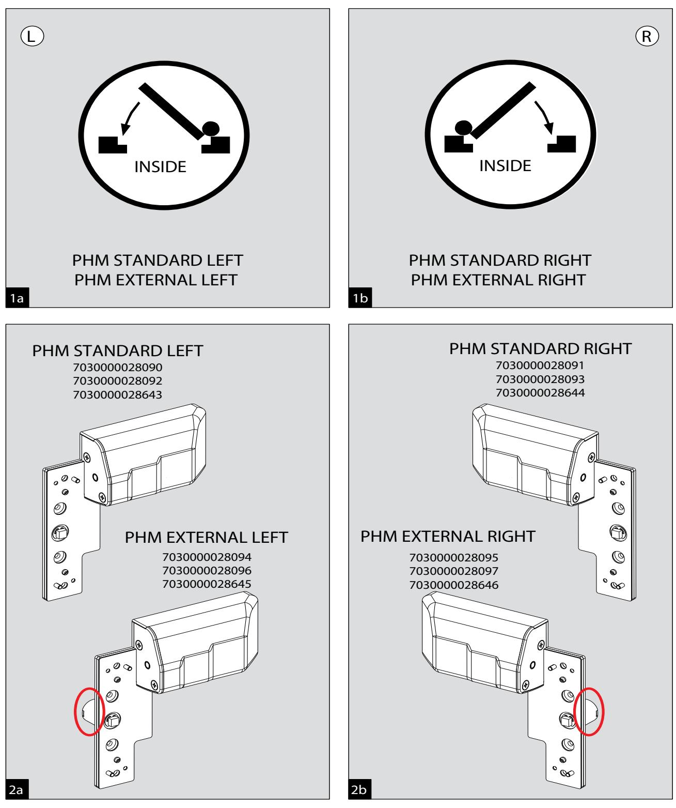

2 DOR MA

## **PHM Standard / External**

PHM ST ANDARD / EXTERNAL

—

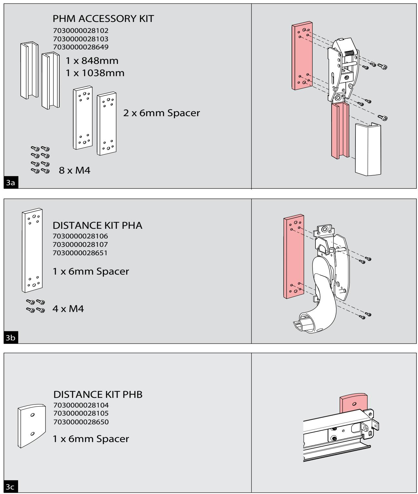

DOR MA 3

# PHM Standard

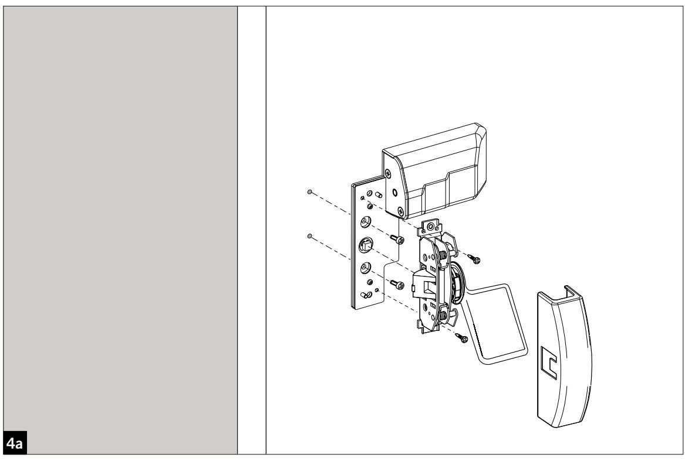

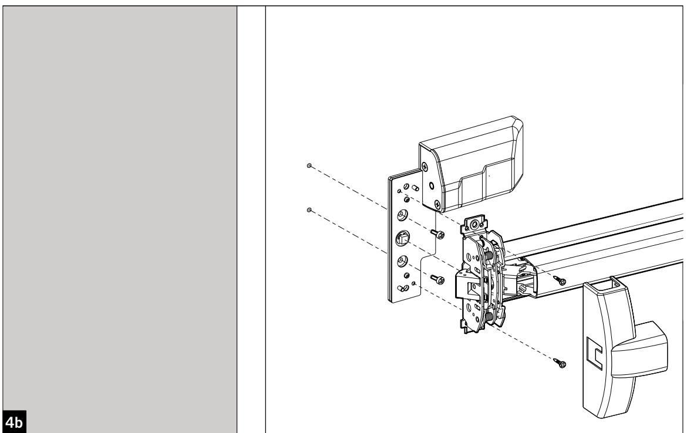

### **PHM Standard**

—

PHM STANDARD

DORMA 5

# PHM External

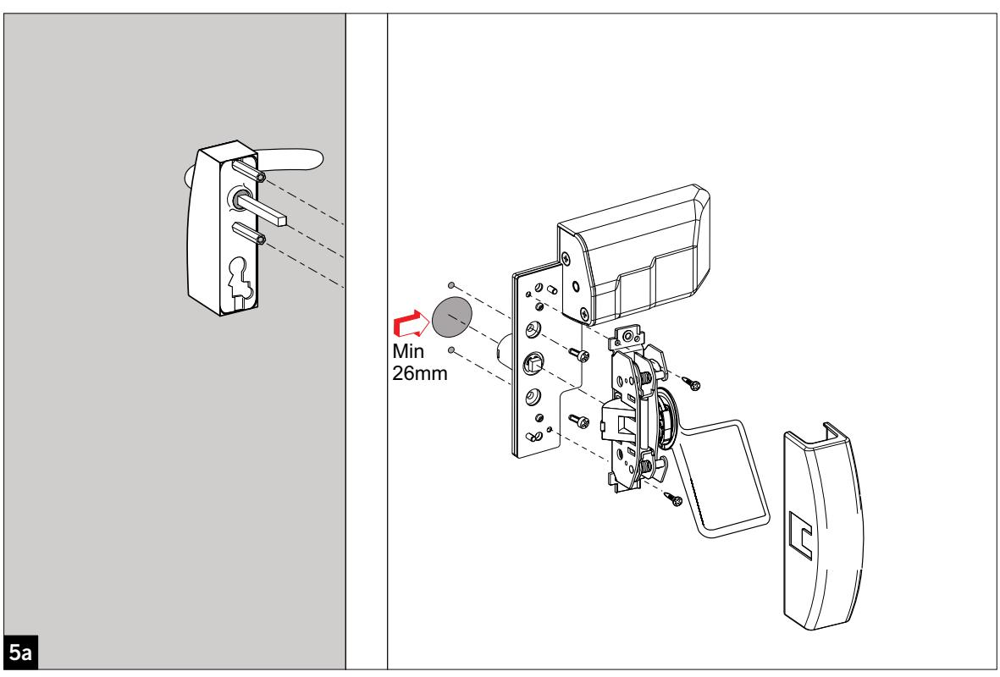

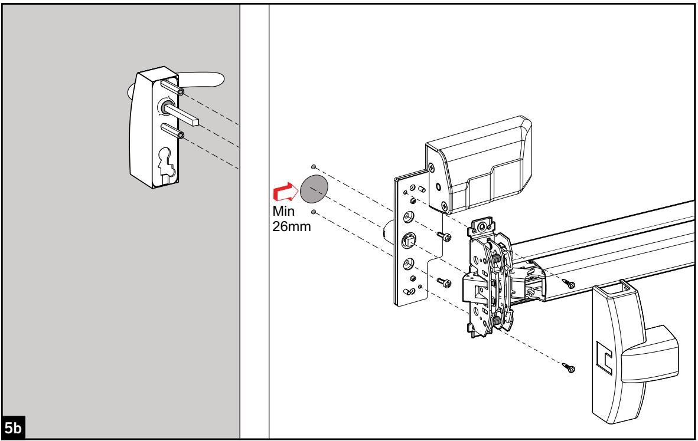

# PHM External

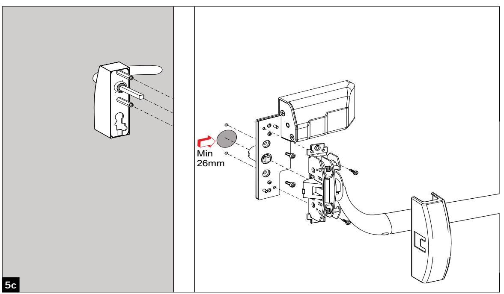

# PHM Standard / External

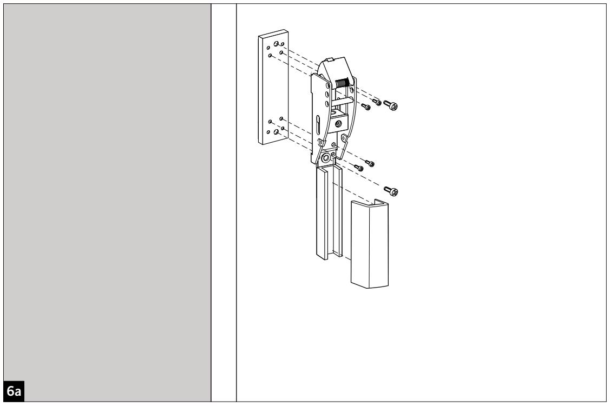

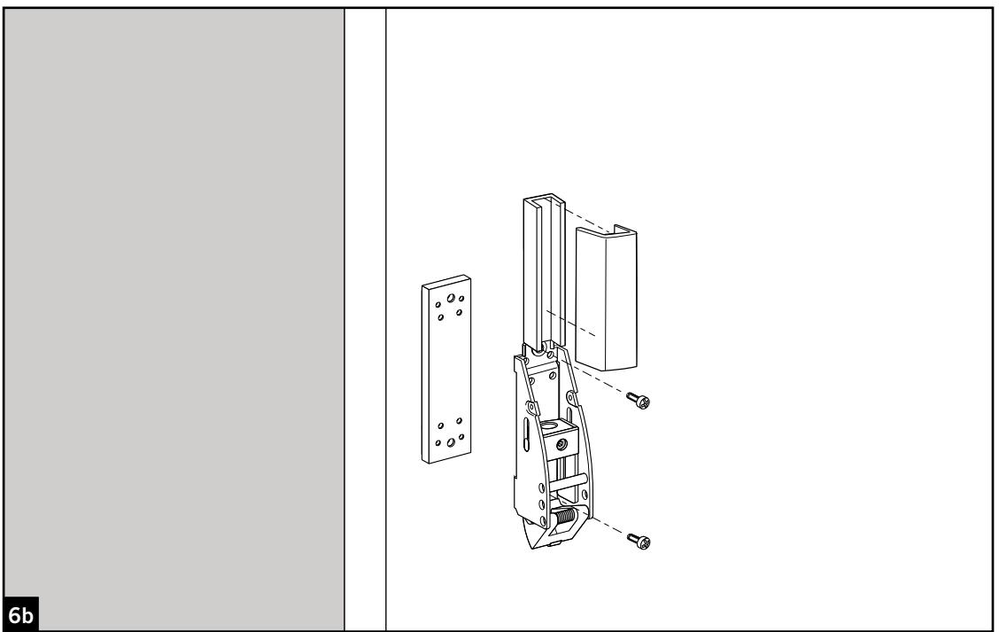

### **PHM Standard / External PHM Standard / External**

PHM STANDARD / EXTERNAL

—

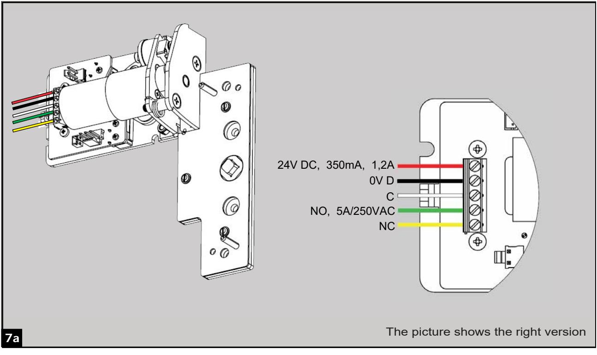

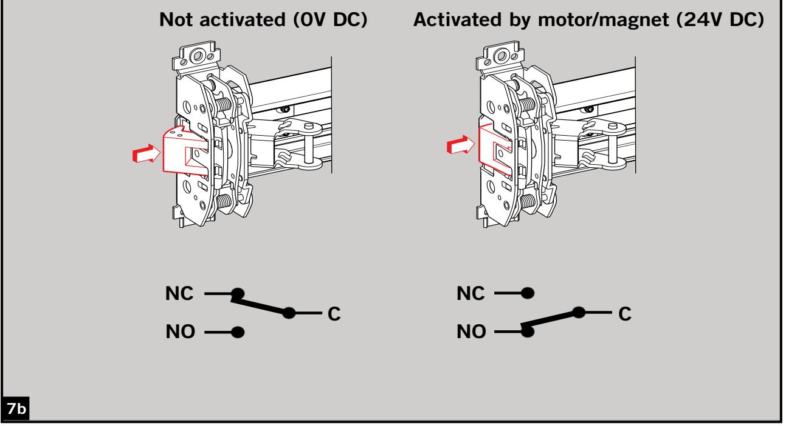

DORMA 9

# **PHM Standard / External VS ED 100/250**

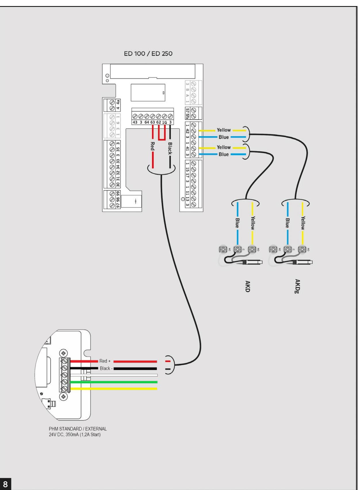

PHM

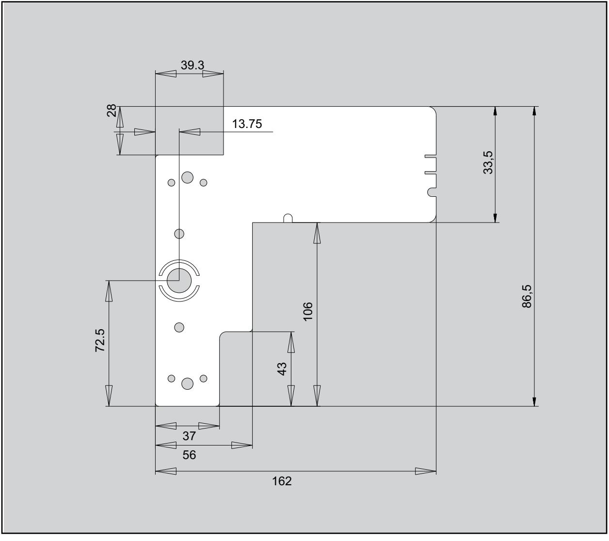

DATE:

DRAWING NUMBER:

This drawing can only be copied with approval from DORMA Norge AS

06.10.2015, Trond Wiker

**www.dorma.com www.dorma.se www.dorma.no www.dorma.fi www.dorma.dk**

65.148.10-1.pdf

| This mounting instruction is valid for the following products | Art.no        |
|------------------------------------------------------------------|---------------|
| PHM Motor Standard, left, Silver RAL 9006                        | 7030000028090 |
| PHM Motor Standard, right, Silver RAL 9006                       | 7030000028091 |
| PHM Motor Standard, left, White RAL 9016                         | 7030000028092 |
| PHM Motor Standard, right, White RAL 9016                        | 7030000028093 |
| PHM Motor Standard, left, Black RAL 9005                         | 7030000028643 |
| PHM Motor Standard, right, Black RAL 9005                        | 7030000028644 |
| PHM Motor External, left, Silver RAL 9006                        | 7030000028094 |
| PHM Motor External, right, Silver RAL 9006                       | 7030000028095 |
| PHM Motor External, left, White RAL 9016                         | 7030000028096 |
| PHM Motor External, right, White RAL 9016                        | 7030000028097 |
| PHM Motor External, left, Black RAL 9005                         | 7030000028645 |
| PHM Motor External, right, Black RAL 9005                        | 7030000028646 |
| PHM Cover, left, Silver RAL 9006                                 | 7030000028098 |
| PHM Cover, right, Silver RAL 9006                                | 7030000028099 |
| PHM Cover, left, White RAL 9016                                  | 7030000028100 |
| PHM Cover, right, White RAL 9016                                 | 7030000028101 |
| PHM Cover, left, Black RAL 9005                                  | 7030000028647 |
| PHM Cover, right, Black RAL 9005                                 | 7030000028648 |
| PHM Plates for PHX, Silver RAL 9006                              | 7030000028102 |
| PHM Plates for PHX, White RAL 9016                               | 7030000028103 |
| PHM Plates for PHX, Black RAL 9005                               | 7030000028649 |
| PHM Plate for PHB, Silver RAL 9006                               | 7030000028104 |
| PHM Plate for PHB, White RAL 9016                                | 7030000028105 |
| PHM Plate for PHB, Black RAL 9005                                | 7030000028650 |
| PHM Plate for PHA, Silver RAL 9006                               | 7030000028106 |
| PHM Plate for PHA, White RAL 9016                                | 7030000028107 |
| PHM Plate for PHA, Black RAL 9005                                | 7030000028651 |
| PHM Plates for Shoot Bolts, Silver RAL 9006                      | 7030000028108 |
| PHM Plates for Shoot Bolts, White RAL 9016                       | 7030000028109 |
| PHM Plates for Shoot Bolts, Black RAL 9005                       | 7030000028652 |

en Subject to change without notice

- da Med forbehold for eventuelle fejl og/eller ændringer
- no Med forbehold om eventuelle feil og/eller endringer
- fi Pidätämme oikeuden muutoksiin ja mahdollisten virheiden korjauksiin
- sv Med förbehåll för eventuella fel och/eller ändringar

#### **dormakaba Danmark A/S**

T: 44 54 30 00 info.dk@dormakaba.com www.dormakaba.dk

#### **dormakaba Norge AS**

www.dormakaba.com www.dormakaba.com T: 32 20 23 20 firmapost.no@dormakaba.com www.dormakaba.no

#### **dormakaba Suomi Oy**

P: 010-218 81 00 info.fi@dormakaba.com www.dormakaba.fi

#### www.dormakaba.no **dormakaba Sverige AB**

www.dormakaba.se www.dormakaba.dk www.dormakaba.fi T: 031-355 20 00 info.se@dormakaba.com www.dormakaba.se