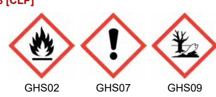

## Säkerhetsdatablad

enligt REACH-förordningen (EG) 1907/2006 ändrad genom förordning (EU) 2020/878 Publiceringsdatum: 2023-06-27 Omarbetning datum: 2023-06-14 Ersätter version av: 2022-12-21 Version: 1.1

## **AVSNITT 1: Namnet på ämnet/blandningen och bolaget/företaget**

### **1.1. Produktbeteckning**

| Produktnamn | : POWER CLEAN                |
|-------------|---------------------------------|
| UFI         | : GFPX-E811-N00V-XT22        |
| Produktkod  | : BDS001944AE                |
| Produkttyp  | : Tvätt- och rengöringsmedel |
| Förångare   | : Aerosol                    |
|             |                                 |

### **1.2. Relevanta identifierade användningar av ämnet eller blandningen och användningar som det avråds från**

#### **1.2.1. Relevanta identifierade användningar**

Kategori efter huvudsaklig användning : Professionellt bruk Användning av ämnet eller beredningen : Rengöringsmedel - tunga

#### **1.2.2. Användningar som det avråds från**

Ingen ytterligare information tillgänglig

### **1.3. Närmare upplysningar om den som tillhandahåller säkerhetsdatabladet**

**Leverantör** CRC Industries Europe B.V. Touwslagerstraat 1 9240 Zele Belgium T +32(0)52/45.60.11 - F +32(0)52/45.00.34 hse@crcind.com - www.crcind.com

### **1.4. Telefonnummer för nödsituationer**

Telefonnummer för nödsituationer : +32(0)52/45.60.11

Office hours: 9-17h CET

## **AVSNITT 2: Farliga egenskaper**

## **2.1. Klassificering av ämnet eller blandningen**

## **Klassificering enligt förordning (EG) 1272/2008 [CLP]**

| Aerosol, kategori 1                                                              | H222;H229 |
|----------------------------------------------------------------------------------|-----------|
| Frätande eller irriterande på huden, kategori 2                                  | H315      |
| Allvarlig ögonskada/ögonirritation, kategori 2                                   | H319      |
| Specifik organtoxicitet – enstaka exponering, kategori 3, narkosverkan           | H336      |
| Fara vid aspiration, kategori 1                                                  | H304      |
| Farligt för vattenmiljön – fara för skadliga långtidseffekter, kategori: kronisk | H411      |
| 2                                                                                |           |

Fullständig text för H-och EUH-uttalanden: se avsnitt 16

#### **Skadliga fysikalisk-kemiska effekter och hälso- och miljöeffekter**

Tryckbehållare: Kan sprängas vid uppvärmning. Extremt brandfarlig aerosol. Kan göra att man blir dåsig eller omtöcknad. Irriterar huden. Orsakar allvarlig ögonirritation. Kan vara dödligt vid förtäring om det kommer ner i luftvägarna. Giftigt för vattenlevande organismer med långtidseffekter.

## **2.2. Märkningsuppgifter**

#### **Känneteckning enligt förordning (EG) Nr. 1272/2008 [CLP]**

Faropiktogram (CLP) :

# Säkerhetsdatablad

enligt REACH-förordningen (EG) 1907/2006 ändrad genom förordning (EU) 2020/878

| Signalord (CLP) Innehåller                                          | : Fara : Kolväten, C6-C7, n-alkaner, isoalkaner, cykliska, < 5% n-heksan; propan-2-ol; isopropylalkohol; isopropanol; Kolväten, C7, n-alkaner, isoalkaner, cykliska; aceton; propan                                                                                                                                                                                                                                                                                                                                                                                                                                                                                                              |
|------------------------------------------------------------------------|--------------------------------------------------------------------------------------------------------------------------------------------------------------------------------------------------------------------------------------------------------------------------------------------------------------------------------------------------------------------------------------------------------------------------------------------------------------------------------------------------------------------------------------------------------------------------------------------------------------------------------------------------------------------------------------------------------------|
| Faroangivelser (CLP)                                                   | 2-on; propanon : H222 - Extremt brandfarlig aerosol. H229 - Tryckbehållare: Kan sprängas vid uppvärmning. H315 - Irriterar huden. H319 - Orsakar allvarlig ögonirritation.                                                                                                                                                                                                                                                                                                                                                                                                                                                                                                                    |
|                                                                        | H336 - Kan göra att man blir dåsig eller omtöcknad. H411 - Giftigt för vattenlevande organismer med långtidseffekter.                                                                                                                                                                                                                                                                                                                                                                                                                                                                                                                                                                                     |
| Skyddsangivelser (CLP)                                                 | : P102 - Förvaras oåtkomligt för barn. P210 - Får inte utsättas för värme, heta ytor, gnistor, öppen låga eller andra antändningskällor. Rökning förbjuden. P211 - Spreja inte över öppen låga eller andra antändningskällor. P251 - Får inte punkteras eller brännas, gäller även tömd behållare. P261 - Undvik att inandas ångor/sprej. P271 - Används endast utomhus eller i väl ventilerade utrymmen. P410+P412 - Skyddas från solljus. Får inte utsättas för temperaturer över 50°C. P501 - Innehållet/behållaren lämnas till återvinningsstation för farliga eller speciella ämnen, i enlighet med lokala, regionala, nationella och/eller internationella förordningar. |
| 2.3. Andra faror                                                       |                                                                                                                                                                                                                                                                                                                                                                                                                                                                                                                                                                                                                                                                                                              |
| Innehåller inga PBT/vPvB-ämnen ≥ 0,1 % bedömt enligt REACH bilaga XIII |                                                                                                                                                                                                                                                                                                                                                                                                                                                                                                                                                                                                                                                                                                              |

Annan information : Blandningen innehåller inte ämnen som ingår i listan som upprättats i enlighet med artikel 59.1 i REACH för att ha hormonstörande egenskaper eller identifieras inte ha hormonstörande egenskaper i enlighet med kriterierna i Kommissionens delegerade förordning (EU) 2017/2100 eller Kommissionens förordning (EU) 2018/605 i en koncentration på 0,1 viktprocent eller mer.

## **AVSNITT 3: Sammansättning/information om beståndsdelar**

## **3.1. Ämnen**

## Ej tillämplig

## **3.2. Blandningar**

| Namn                                                                                                      | Produktbeteckning                                                                               | %       | Klassificering enligt förordning (EG) 1272/2008 [CLP]                                                     |
|-----------------------------------------------------------------------------------------------------------|-------------------------------------------------------------------------------------------------|---------|--------------------------------------------------------------------------------------------------------------|
| Kolväten, C6-C7, n-alkaner, isoalkaner, cykliska, < 5% n-heksan                                        | EC nr: 921-024-6 REACH-nr: 01-2119475514- 35                                              | 25 – 50 | Flam. Liq. 2, H225 Skin Irrit. 2, H315 STOT SE 3, H336 Asp. Tox. 1, H304 Aquatic Chronic 2, H411 |
| Kolväten, C7, n-alkaner, isoalkaner, cykliska                                                             | EC nr: 927-510-4 REACH-nr: 01-2119475515- 33                                              | 25 – 50 | Flam. Liq. 2, H225 Skin Irrit. 2, H315 STOT SE 3, H336 Asp. Tox. 1, H304 Aquatic Chronic 2, H411 |
| propan-2-ol; isopropylalkohol; isopropanol ämne med nationella arbetsplatsexponeringsgräns(er) (SE) | CAS nr: 67-63-0 EC nr: 200-661-7 Index nr: 603-117-00-0 REACH-nr: 01-2119457558- 25 | 5 – 10  | Flam. Liq. 2, H225 Eye Irrit. 2, H319 STOT SE 3, H336                                                  |

# Säkerhetsdatablad

enligt REACH-förordningen (EG) 1907/2006 ändrad genom förordning (EU) 2020/878

| Namn                                                                                                                                                                     | Produktbeteckning                                                                               | %      | Klassificering enligt förordning (EG) 1272/2008 [CLP]              |
|--------------------------------------------------------------------------------------------------------------------------------------------------------------------------|-------------------------------------------------------------------------------------------------|--------|-----------------------------------------------------------------------|
| aceton; propan-2-on; propanon ämne med nationella arbetsplatsexponeringsgräns(er) (SE); ämne med gemenskapsgränsvärden för exponering på arbetsplatsen          | CAS nr: 67-64-1 EC nr: 200-662-2 Index nr: 606-001-00-8 REACH-nr: 01-2119471330- 49 | 5 – 10 | Flam. Liq. 2, H225 Eye Irrit. 2, H319 STOT SE 3, H336 EUH066 |
| Koldioxid (CO2) (Drivgas (Aerosol)) ämne med nationella arbetsplatsexponeringsgräns(er) (SE); ämne med gemenskapsgränsvärden för exponering på arbetsplatsen | CAS nr: 124-38-9                                                                                | 5 – 10 | Press. Gas (Comp.), H280                                              |

Produkt som omfattas av CLP Artikel 1.1.3.7. Komponenternas upplysningsregler har modifierats i det här fallet. Fullständig text för H-och EUH-uttalanden: se avsnitt 16

| AVSNITT 4: Åtgärder vid första hjälpen 4.1. Beskrivning av åtgärder vid första hjälpen                                              |                                                                                                                                                                                                                    |  |  |  |
|----------------------------------------------------------------------------------------------------------------------------------------|--------------------------------------------------------------------------------------------------------------------------------------------------------------------------------------------------------------------|--|--|--|
|                                                                                                                                        |                                                                                                                                                                                                                    |  |  |  |
| Första hjälpen efter inandning                                                                                                         | : Flytta personen till frisk luft och se till att andningen underlättas. Kontakta läkare om tecken/symptom utvecklas.                                                                                        |  |  |  |
| Första hjälpen efter hudkontakt                                                                                                        | : Tvätta huden med mycket vatten. Ta av nedstänkta kläder. Vid hudirritation: Sök läkarhjälp. Uppsök läkare eller irritation uppstår.                                                                        |  |  |  |
| Första hjälpen efter kontakt med ögonen                                                                                                | : Skölj försiktigt med vatten i flera minuter. Ta ur eventuella kontaktlinser om det går lätt. Fortsätt att skölja. Vid bestående ögonirritation: Sök läkarhjälp. Uppsök läkare eller irritation uppstår. |  |  |  |
| Första hjälpen efter förtäring                                                                                                         | : Framkalla INTE kräkning. Kontakta läkare omedelbart. Skölj munnen. Om kräkning uppstår håll huvudet lågt så att maginnehållet inte kommer ned i lungorna.                                                  |  |  |  |
| 4.2. De viktigaste symptomen och effekterna, både akuta och fördröjda                                                                  |                                                                                                                                                                                                                    |  |  |  |
| Symptom/effekter Symptom/effekter efter hudkontakt Symptom/effekter efter kontakt med ögonen Symptom/effekter efter förtäring | : Kan göra att man blir dåsig eller omtöcknad. : Irritation. Upprepad kontakt kan ge torr hud eller hudsprickor. : Irriterande för ögon. : Risk för lungödem.                                 |  |  |  |

## **4.3. Angivande av omedelbar medicinsk behandling och särskild behandling som eventuellt krävs**

Ordna allmänna stödåtgärder och behandla på ett symtomatisk sätt. Håll den skadade under observation. Symptomen kan vara fördröjda.

| AVSNITT 5: Brandbekämpningsåtgärder                            |                                                                                                                                                                                         |  |  |
|----------------------------------------------------------------|-----------------------------------------------------------------------------------------------------------------------------------------------------------------------------------------|--|--|
| 5.1. Släckmedel                                                |                                                                                                                                                                                         |  |  |
| Lämpliga släckmedel Olämpligt släckningsmedel               | : Vattenspray. Torrt pulver. Skum. koldioxid. : Använd inte koncentrerad vattenstråle.                                                                                         |  |  |
| 5.2. Särskilda faror som ämnet eller blandningen kan medföra   |                                                                                                                                                                                         |  |  |
| Brandrisk Explosionsrisk Farliga sönderdelningsprodukter | : Extremt brandfarlig aerosol. : Tryckbehållare: Kan sprängas vid uppvärmning. : Vid brand kan hälsoskadliga gaser bildas.                                               |  |  |
| 5.3. Råd till brandbekämpningspersonal                         |                                                                                                                                                                                         |  |  |
| Släckinstruktioner                                             | : Flytta behållarna från brandplatsen om det kan göras utan risk för personskada. Tillämpa gängse rutiner för brandbekämpning och betänk riskerna med övriga inblandade material. |  |  |

## Säkerhetsdatablad

enligt REACH-förordningen (EG) 1907/2006 ändrad genom förordning (EU) 2020/878

Skydd under brandbekämpning : Försök inte vidta åtgärder utan lämplig skyddsutrustning. Självförsörjande andningsapparat (SCBA). Heltäckande skyddskläder.

| AVSNITT 6: Åtgärder vid oavsiktliga utsläpp                                      |                                                                                                                                                                                                                                          |  |  |  |
|----------------------------------------------------------------------------------|------------------------------------------------------------------------------------------------------------------------------------------------------------------------------------------------------------------------------------------|--|--|--|
| 6.1. Personliga skyddsåtgärder, skyddsutrustning och åtgärder vid nödsituationer |                                                                                                                                                                                                                                          |  |  |  |
| 6.1.1. För annan personal än räddningspersonal                                   |                                                                                                                                                                                                                                          |  |  |  |
| Skyddsutrustning Planeringar för nödfall                                      | : Bär lämplig skyddsutrustning och -kläder under rengöringen. : Ventilera spillområdet. Inga öppna lågor, inga gnistor, ingen rökning. Undvik att inandas damm/rök/gaser/dimma/ångor/sprej. Undvik kontakt med ögon och hud. |  |  |  |
| 6.1.2. För räddningspersonal                                                     |                                                                                                                                                                                                                                          |  |  |  |
| Skyddsutrustning                                                                 | : Försök inte vidta åtgärder utan lämplig skyddsutrustning. För mer information, se avsnitt 8: "Begränsning av exponering/personligt skydd".                                                                                       |  |  |  |
| Planeringar för nödfall                                                          | : Evakuera överflödig personal. Ventilera området.                                                                                                                                                                                    |  |  |  |
| 6.2. Miljöskyddsåtgärder                                                         |                                                                                                                                                                                                                                          |  |  |  |

Undvik utsläpp till miljön. Undvik att spill eller avrinningsvatten kommer ned i avlopp, avloppssystem eller vattendrag.

| 6.3. Metoder och material för inneslutning och sanering |                                                                                                                                                                                                                                                                                                                                                                                 |  |
|---------------------------------------------------------|---------------------------------------------------------------------------------------------------------------------------------------------------------------------------------------------------------------------------------------------------------------------------------------------------------------------------------------------------------------------------------|--|
| För återhållning                                        | : Samla upp spill.                                                                                                                                                                                                                                                                                                                                                           |  |
| Rengöringsmetoder                                       | : Samla upp produkten på mekanisk väg. Begränsa stora utsläpp i ett dike och täck materialet med våt sand eller jord för att kunna bortskaffa det på ett säkert sätt. När materialet samlats upp skall området spolas med vatten. Torka upp mindre spill med kemiska absorptionsmedel. Rengör ytan grundligt för att avlägsna kontaminering från utsläppsrester. |  |
| Annan information                                       | : Lämna material och fasta rester till en auktoriserad anläggning.                                                                                                                                                                                                                                                                                                           |  |

#### **6.4. Hänvisning till andra avsnitt**

För avyttring av förorenat material, se avsnitt 13: "Avfallshantering".

## **AVSNITT 7: Hantering och lagring**

| 7.1. Skyddsåtgärder för säker hantering                               |                                                                                                                                                                                                                                                                                                                                                                                                                                                                                                                                                                                                                                                    |
|-----------------------------------------------------------------------|----------------------------------------------------------------------------------------------------------------------------------------------------------------------------------------------------------------------------------------------------------------------------------------------------------------------------------------------------------------------------------------------------------------------------------------------------------------------------------------------------------------------------------------------------------------------------------------------------------------------------------------------------|
| Skyddsåtgärder för säker hantering Åtgärder beträffande hygien     | : Får inte utsättas för värme, heta ytor, gnistor, öppen låga eller andra antändningskällor. Rökning förbjuden. Spreja inte över öppen låga eller andra antändningskällor. Får inte punkteras eller brännas, gäller även tömd behållare. Används endast utomhus eller i väl ventilerade utrymmen. Undvik att inandas damm/rök/gaser/dimma/ångor/sprej. Undvik kontakt med ögon och hud. Använd personlig skyddsutrustning. Undvik långvarig exponering. Hantera i enlighet med god industriell hygien och säkerhetsrutiner. : Nedstänkta kläder ska tvättas innan de används igen. Ät inte, drick inte och rök inte när du |
|                                                                       | använder produkten. Tvätta alltid händerna efter all hantering.                                                                                                                                                                                                                                                                                                                                                                                                                                                                                                                                                                                    |
| 7.2. Förhållanden för säker lagring, inklusive eventuell oförenlighet |                                                                                                                                                                                                                                                                                                                                                                                                                                                                                                                                                                                                                                                    |
| Lagringsvillkor                                                       | : Skyddas från solljus. Får inte utsättas för temperaturer över 50 °C/122 °F. Förvaras inlåst. Förvaras på väl ventilerad plats. Behållaren ska vara väl tillsluten. Förvaras på väl ventilerad plats. Förvaras svalt. Behållarna skall vara tillslutna när de inte används.                                                                                                                                                                                                                                                                                                                                                              |
|                                                                       |                                                                                                                                                                                                                                                                                                                                                                                                                                                                                                                                                                                                                                                    |

## **7.3. Specifik slutanvändning**

Ingen ytterligare information tillgänglig

## **AVSNITT 8: Begränsning av exponeringen/personligt skydd**

## **8.1. Kontrollparametrar**

#### **8.1.1 Nationella gränsvärden för exponering på arbetsplatsen och biologiska gränsvärden**

## Säkerhetsdatablad

enligt REACH-förordningen (EG) 1907/2006 ändrad genom förordning (EU) 2020/878

| propan-2-ol; isopropylalkohol; isopropanol (67-63-0) |                                                                                                                                                                                                                                                                      |  |  |  |
|------------------------------------------------------|----------------------------------------------------------------------------------------------------------------------------------------------------------------------------------------------------------------------------------------------------------------------|--|--|--|
| Sverige - Yrkeshygieniska gränsvärden                |                                                                                                                                                                                                                                                                      |  |  |  |
| Lokalt namn                                          | Isopropanol                                                                                                                                                                                                                                                          |  |  |  |
| NGV (OEL TWA)                                        | 350 mg/m³                                                                                                                                                                                                                                                            |  |  |  |
| NGV (OEL TWA) [ppm]                                  | 150 ppm                                                                                                                                                                                                                                                              |  |  |  |
| KTV (OEL STEL)                                       | 600 mg/m³                                                                                                                                                                                                                                                            |  |  |  |
| KTV (OEL STEL) [ppm]                                 | 250 ppm                                                                                                                                                                                                                                                              |  |  |  |
| Anmärkning                                           | V (Vägledande korttidsgränsvärde ska användas som ett rekommenderat högsta värde som inte bör överskridas)                                                                                                                                                        |  |  |  |
| Regleringsreferens                                   | Hygieniska gränsvärden (AFS 2018:1)                                                                                                                                                                                                                                  |  |  |  |
| aceton; propan-2-on; propanon (67-64-1)              |                                                                                                                                                                                                                                                                      |  |  |  |
| EU - Indikativa yrkeshygieniska gränsvärden (IOEL)   |                                                                                                                                                                                                                                                                      |  |  |  |
| Lokalt namn                                          | Acetone                                                                                                                                                                                                                                                              |  |  |  |
| IOEL TWA                                             | 1210 mg/m³                                                                                                                                                                                                                                                           |  |  |  |
| IOEL TWA [ppm]                                       | 500 ppm                                                                                                                                                                                                                                                              |  |  |  |
| Regleringsreferens                                   | COMMISSION DIRECTIVE 2000/39/EC                                                                                                                                                                                                                                      |  |  |  |
| Sverige - Yrkeshygieniska gränsvärden                |                                                                                                                                                                                                                                                                      |  |  |  |
| Lokalt namn                                          | Aceton                                                                                                                                                                                                                                                               |  |  |  |
| NGV (OEL TWA)                                        | 600 mg/m³                                                                                                                                                                                                                                                            |  |  |  |
| NGV (OEL TWA) [ppm]                                  | 250 ppm                                                                                                                                                                                                                                                              |  |  |  |
| KTV (OEL STEL)                                       | 1200 mg/m³                                                                                                                                                                                                                                                           |  |  |  |
| KTV (OEL STEL) [ppm]                                 | 500 ppm                                                                                                                                                                                                                                                              |  |  |  |
| Anmärkning                                           | V (Vägledande korttidsgränsvärde ska användas som ett rekommenderat högsta värde som inte bör överskridas)                                                                                                                                                        |  |  |  |
| Regleringsreferens                                   | Hygieniska gränsvärden (AFS 2018:1)                                                                                                                                                                                                                                  |  |  |  |
| Koldioxid (CO2) (124-38-9)                           |                                                                                                                                                                                                                                                                      |  |  |  |
| EU - Indikativa yrkeshygieniska gränsvärden (IOEL)   |                                                                                                                                                                                                                                                                      |  |  |  |
| Lokalt namn                                          | Carbon dioxide                                                                                                                                                                                                                                                       |  |  |  |
| IOEL TWA                                             | 9000 mg/m³                                                                                                                                                                                                                                                           |  |  |  |
| IOEL TWA [ppm]                                       | 5000 ppm                                                                                                                                                                                                                                                             |  |  |  |
| Regleringsreferens                                   | COMMISSION DIRECTIVE 2006/15/EC                                                                                                                                                                                                                                      |  |  |  |
| Sverige - Yrkeshygieniska gränsvärden                |                                                                                                                                                                                                                                                                      |  |  |  |
| Lokalt namn                                          | Koldioxid                                                                                                                                                                                                                                                            |  |  |  |
| NGV (OEL TWA)                                        | 9000 mg/m³                                                                                                                                                                                                                                                           |  |  |  |
| NGV (OEL TWA) [ppm]                                  | 5000 ppm                                                                                                                                                                                                                                                             |  |  |  |
| KTV (OEL STEL)                                       | 18000 mg/m³                                                                                                                                                                                                                                                          |  |  |  |
| KTV (OEL STEL) [ppm]                                 | 10000 ppm                                                                                                                                                                                                                                                            |  |  |  |
| Anmärkning                                           | V (Vägledande korttidsgränsvärde ska användas som ett rekommenderat högsta värde som inte bör överskridas); 34 (Koldioxid används ofta som indikatorsubstans i arbetslokaler där luftföroreningar huvudsakligen uppkommer genom de personer som vistas där) |  |  |  |

## Säkerhetsdatablad

enligt REACH-förordningen (EG) 1907/2006 ändrad genom förordning (EU) 2020/878

| Koldioxid (CO2) (124-38-9)                                                                 |                                     |  |  |  |
|--------------------------------------------------------------------------------------------|-------------------------------------|--|--|--|
| Regleringsreferens                                                                         | Hygieniska gränsvärden (AFS 2018:1) |  |  |  |
| 8.1.2. Rekommenderade övervakningsförfaranden Ingen ytterligare information tillgänglig |                                     |  |  |  |
| 8.1.3. Det bildas luftföroreningar                                                         |                                     |  |  |  |
| Ingen ytterligare information tillgänglig                                                  |                                     |  |  |  |
| 8.1.4. DNEL och PNEC                                                                       |                                     |  |  |  |
| Kolväten, C6-C7, n-alkaner, isoalkaner, cykliska, < 5% n-heksan                            |                                     |  |  |  |
| DNEL/DMEL (Arbetare)                                                                       |                                     |  |  |  |
| Långvarigt - systemiska effekter, dermal                                                   | 773 mg/kg kroppsvikt/dag            |  |  |  |
| Långvarigt - systemiska effekter, inandningen                                              | 2035 mg/m³                          |  |  |  |
| DNEL/DMEL (Allmänna befolkningen)                                                          |                                     |  |  |  |
| Långvarigt - systemiska effekter, oral                                                     | 699 mg/kg kroppsvikt/dag            |  |  |  |
| Långvarigt - systemiska effekter, inandningen                                              | 608 mg/m³                           |  |  |  |
| Långvarigt - systemiska effekter, dermal                                                   | 699 mg/kg kroppsvikt/dag            |  |  |  |
| propan-2-ol; isopropylalkohol; isopropanol (67-63-0)                                       |                                     |  |  |  |
| DNEL/DMEL (Arbetare)                                                                       |                                     |  |  |  |
| Långvarigt - systemiska effekter, dermal                                                   | 888 mg/kg kroppsvikt/dag            |  |  |  |
| Långvarigt - systemiska effekter, inandningen                                              | 500 mg/m³                           |  |  |  |
| DNEL/DMEL (Allmänna befolkningen)                                                          |                                     |  |  |  |
| Långvarigt - systemiska effekter, oral                                                     | 26 mg/kg kroppsvikt/dag             |  |  |  |
| Långvarigt - systemiska effekter, inandningen                                              | 89 mg/m³                            |  |  |  |
| Långvarigt - systemiska effekter, dermal                                                   | 319 mg/kg kroppsvikt/dag            |  |  |  |
| PNEC (Vatten)                                                                              |                                     |  |  |  |
| PNEC aqua (sötvatten)                                                                      | 140,9 mg/l                          |  |  |  |
| PNEC aqua (havsvatten)                                                                     | 140,9 mg/l                          |  |  |  |
| PNEC aqua (intermittent, sötvatten)                                                        | 140,9 mg/l                          |  |  |  |
| PNEC (Sediment)                                                                            |                                     |  |  |  |
| PNEC sediment (sötvatten)                                                                  | 552 mg/kg torrvikt                  |  |  |  |
| PNEC sediment (havsvatten)                                                                 | 552 mg/kg torrvikt                  |  |  |  |
| PNEC (Jord)                                                                                |                                     |  |  |  |
| PNEC jord                                                                                  | 28 mg/kg torrvikt                   |  |  |  |
| PNEC (Oral)                                                                                |                                     |  |  |  |
| PNEC oral (sekundär förgiftning)                                                           | 160 mg/kg föda                      |  |  |  |
| PNEC (STP)                                                                                 |                                     |  |  |  |
| PNEC avloppsreningsverk                                                                    | 2251 mg/l                           |  |  |  |
| Kolväten, C7, n-alkaner, isoalkaner, cykliska                                              |                                     |  |  |  |
| DNEL/DMEL (Arbetare)                                                                       |                                     |  |  |  |
| Långvarigt - systemiska effekter, dermal                                                   | 300 mg/kg kroppsvikt/dag            |  |  |  |
| Långvarigt - systemiska effekter, inandningen                                              | 2085 mg/m³                          |  |  |  |

## Säkerhetsdatablad

enligt REACH-förordningen (EG) 1907/2006 ändrad genom förordning (EU) 2020/878

| Kolväten, C7, n-alkaner, isoalkaner, cykliska |                          |  |  |
|-----------------------------------------------|--------------------------|--|--|
| DNEL/DMEL (Allmänna befolkningen)             |                          |  |  |
| Långvarigt - systemiska effekter, oral        | 149 mg/kg kroppsvikt/dag |  |  |
| Långvarigt - systemiska effekter, inandningen | 447 mg/m³                |  |  |
| Långvarigt - systemiska effekter, dermal      | 149 mg/kg kroppsvikt/dag |  |  |
| aceton; propan-2-on; propanon (67-64-1)       |                          |  |  |
| DNEL/DMEL (Arbetare)                          |                          |  |  |
| Akut - lokala effekter, inandningen           | 2420 mg/m³               |  |  |
| Långvarigt - systemiska effekter, dermal      | 186 mg/kg kroppsvikt/dag |  |  |
| Långvarigt - systemiska effekter, inandningen | 1210 mg/m³               |  |  |
| DNEL/DMEL (Allmänna befolkningen)             |                          |  |  |
| Långvarigt - systemiska effekter, oral        | 62 mg/kg kroppsvikt/dag  |  |  |
| Långvarigt - systemiska effekter, inandningen | 200 mg/m³                |  |  |
| Långvarigt - systemiska effekter, dermal      | 62 mg/kg kroppsvikt/dag  |  |  |
| PNEC (Vatten)                                 |                          |  |  |
| PNEC aqua (sötvatten)                         | 10,6 mg/l                |  |  |
| PNEC aqua (havsvatten)                        | 1,06 mg/l                |  |  |
| PNEC aqua (intermittent, sötvatten)           | 21 mg/l                  |  |  |
| PNEC (Sediment)                               |                          |  |  |
| PNEC sediment (sötvatten)                     | 30,4 mg/kg torrvikt      |  |  |
| PNEC sediment (havsvatten)                    | 3,04 mg/kg torrvikt      |  |  |
| PNEC (Jord)                                   |                          |  |  |
| PNEC jord                                     | 29,5 mg/kg torrvikt      |  |  |
| PNEC (STP)                                    |                          |  |  |
| PNEC avloppsreningsverk                       | 100 mg/l                 |  |  |

## **8.1.5. control banding (kontroll av kemikaliehantering)**

Ingen ytterligare information tillgänglig

#### **8.2. Begränsning av exponeringen**

#### **8.2.1. Lämpliga tekniska kontrollåtgärder**

#### **Lämpliga tekniska kontrollåtgärder:**

Se till att det finns en bra allmän ventilation. Ventilationen skall anpassas efter förhållandena. Om tillämpligt, använd inkapsling av processer, punktutsugning eller andra tekniska försiktighetsåtgärder för att hålla nivåerna i luften under de rekommenderade exponeringsgränserna. Om exponeringsgränserna inte har fastställts, håll luftburna nivåer på en acceptabel nivå.

#### **8.2.2. Personlig skyddsutrustning**

#### **Personlig skyddsutrustning symbol(er):**

#### **8.2.2.1. Ögonskydd och ansiktsskydd**

**Skyddsglasögon:**

Använd skyddsglasögon enligt EN 166. Säkerhetsglasögon med sidoskydd.

## Säkerhetsdatablad

enligt REACH-förordningen (EG) 1907/2006 ändrad genom förordning (EU) 2020/878

#### **8.2.2.2. Hudskydd**

#### **Hudskydd:**

Lämpliga skyddskläder skall användas

### **Handskydd:**

Bär lämpliga handskar testade enligt EN374. Handskens genombrottstid ska vara längre än produktens totala användningstid. Om arbetet varar längre än genombrottstiden ska handskarna bytas efter halva tiden. Skyddshandskar i neopren- eller nitrilgummi.

#### **8.2.2.3. Andningsskydd**

#### **Andningsskydd:**

Vid otillräcklig ventilation skall lämplig andningsutrustning användas. Godkänd organisk respirator. Typ av filter: AX

#### **8.2.2.4. Te rmisk fara**

#### **Skydd mot termiska risker:**

Förväntas ej utgöra någon större risk under normala användningsförhållanden. Använd lämpliga skyddskläder som skyddar mot hetta.

#### **8.2.3. Begränsning och övervakning av miljöexpositionen**

#### **Begränsning och övervakning av miljöexpositionen:**

Undvik utsläpp till miljön. Utsläpp från ventilation eller arbetsutrustning ska kontrolleras för att säkerställa att de uppfyller kraven i miljöskyddslagstiftningen.

## **AVSNITT 9: Fysikaliska och kemiska egenskaper**

#### **9.1. Information om grundläggande fysikaliska och kemiska egenskaper**

| Fysikaliskt tillstånd                            | : | Vätska                                        |
|--------------------------------------------------|---|-----------------------------------------------|
| Färg                                             | : | Färglös.                                      |
| Utseende                                         | : | Vätska med CO2 som drivgas.                   |
| Lukt                                             | : | Lösningsmedel.                                |
| Lukttröskeln                                     | : | Ej tillgänglig                                |
| Smältpunkt                                       | : | Ej tillämplig                                 |
| Fryspunkt                                        | : | Ej tillgänglig                                |
| Kokpunkt                                         | : | Ej tillgänglig                                |
| Brandfarlighet                                   | : | Extremt brandfarlig aerosol.                  |
| Explosiva egenskaper                             | : | Tryckbehållare: Kan sprängas vid uppvärmning. |
| Explosionsgränser                                | : | Ej tillgänglig                                |
| Nedre explosionsgräns                            | : | 0,9 vol %                                     |
| Övre explosionsgräns                             | : | 13 vol %                                      |
| Flampunkt                                        | : | -26 (56 – 99) °C                              |
| Självantändningstemperatur                       | : | Ej tillgänglig                                |
| Sönderdelningstemperatur                         | : | > 200 °C                                      |
| pH-värde                                         | : | Ej tillämplig                                 |
| Viskositet, kinematisk                           | : | < 10 mm²/s                                    |
| Löslighet                                        | : | Olöslig i vatten.                             |
| Fördelningskoefficient för n-oktanol/vatten (Log | : | Ej tillämplig                                 |
| Kow)                                             |   |                                               |
| Ångtryck                                         | : | Ej tillgänglig                                |
| Ångtryck vid 50°C                                | : | Ej tillgänglig                                |
| Densitet                                         | : | 0,714 g/cm³ vid 20°C                          |
| Relativ densitet                                 | : | 0,714 vid 20°C                                |
| Relativ ångdensitet vid 20°C                     | : | 3 vid 20°C                                    |
| Partikelegenskaper                               | : | Ej tillämplig                                 |
|                                                  |   |                                               |

#### **9.2. Annan information**

| 9.2.1. Information om faroklasser för fysisk fara |   |                         |
|---------------------------------------------------|---|-------------------------|
| % av brandfarliga ingredienser                    | : | 75 – 100 %              |
| 9.2.2. Andra säkerhetskarakteristika              |   |                         |
| Relativ evaporationshastighet (eter=1)            | : | 2,8                     |
| VOC-halt                                          | : | 685 g/l                 |
| Ytterligare Information                           | : | Aerosoler utan drivgas. |

## Säkerhetsdatablad

enligt REACH-förordningen (EG) 1907/2006 ändrad genom förordning (EU) 2020/878

## **AVSNITT 10: Stabilitet och reaktivitet**

## **10.1. Reaktivitet**

Extremt brandfarlig aerosol. Tryckbehållare: Kan sprängas vid uppvärmning.

### **10.2. Kemisk stabilitet**

Stabil under normala förhållanden.

### **10.3. Risken för farliga reaktioner**

Inga farliga reaktioner kända under normala användningsförhållanden.

### **10.4. Förhållanden som ska undvikas**

Undvik kontakt med heta ytor. Värme. Inga lågor, inga gnistor. Eliminera alla antändningskällor.

## **10.5. Oförenliga material**

Kraftfulla oxidanter.

### **10.6. Farliga sönderdelningsprodukter**

Inga farliga sönderdelningsprodukter bör bildas under normala lagrings- och användningsförhållanden. koloxid (CO, CO2).

## **AVSNITT 11: Toxikologisk information**

# **11.1. Information om faroklasser enligt förordning (EG) nr 1272/2008 Akut toxicitet (oral)** : Inte klassificerat (Kriterierna för klassificering kan på grundval av tillgängliga data inte anses vara uppfyllda) **Akut toxicitet (dermal)** : Inte klassificerat (Kriterierna för klassificering kan på grundval av tillgängliga data inte anses vara uppfyllda) **Akut toxicitet (inhalation)** : Inte klassificerat (Kriterierna för klassificering kan på grundval av tillgängliga data inte anses vara uppfyllda) **Kolväten, C6-C7, n-alkaner, isoalkaner, cykliska, < 5% n-heksan** LD50 oral råtta 5841 mg/kg LD50 hud råtta 2800 – 3100 mg/kg kroppsvikt LC50 Inandning - Råtta > 25,2 mg/l/4h **propan-2-ol; isopropylalkohol; isopropanol (67-63-0)** LD50 oral råtta 5840 mg/kg kroppsvikt **Kolväten, C7, n-alkaner, isoalkaner, cykliska** LD50 oral råtta > 5000 mg/kg kroppsvikt LD50 hud kanin > 2000 mg/kg kroppsvikt LC50 Inandning - Råtta > 23,3 mg/l/4h **aceton; propan-2-on; propanon (67-64-1)** LD50 oral råtta 5800 mg/kg kroppsvikt LD50 dermal > 15688 mg/kg kroppsvikt LC50 Inandning - Råtta 76 mg/l/4h **Frätande/irriterande på huden** : Irriterar huden. pH-värde: Ej tillämplig **Allvarlig ögonskada/ögonirritation** : Orsakar allvarlig ögonirritation. pH-värde: Ej tillämplig

## Säkerhetsdatablad

enligt REACH-förordningen (EG) 1907/2006 ändrad genom förordning (EU) 2020/878

| Luftvägs-/hudsensibilisering                                            | : Inte klassificerat (Kriterierna för klassificering kan på grundval av tillgängliga data inte anses vara uppfyllda)                                                                                                                                                                                                                                                                     |
|-------------------------------------------------------------------------|---------------------------------------------------------------------------------------------------------------------------------------------------------------------------------------------------------------------------------------------------------------------------------------------------------------------------------------------------------------------------------------------|
| Mutagenitet i könsceller :                                           | Inte klassificerat (Kriterierna för klassificering kan på grundval av tillgängliga data inte anses vara uppfyllda)                                                                                                                                                                                                                                                                       |
| Cancerogenicitet :                                                   | Inte klassificerat (Kriterierna för klassificering kan på grundval av tillgängliga data inte anses vara uppfyllda)                                                                                                                                                                                                                                                                       |
| Reproduktionstoxicitet :                                             | Inte klassificerat (Kriterierna för klassificering kan på grundval av tillgängliga data inte anses vara uppfyllda)                                                                                                                                                                                                                                                                       |
| Specifik organtoxicitet – enstaka exponering :                       | Kan göra att man blir dåsig eller omtöcknad.                                                                                                                                                                                                                                                                                                                                                |
| Kolväten, C6-C7, n-alkaner, isoalkaner, cykliska, < 5% n-heksan         |                                                                                                                                                                                                                                                                                                                                                                                             |
| Specifik organtoxicitet – enstaka exponering                            | Kan göra att man blir dåsig eller omtöcknad.                                                                                                                                                                                                                                                                                                                                                |
| propan-2-ol; isopropylalkohol; isopropanol (67-63-0)                    |                                                                                                                                                                                                                                                                                                                                                                                             |
| Specifik organtoxicitet – enstaka exponering                            | Kan göra att man blir dåsig eller omtöcknad.                                                                                                                                                                                                                                                                                                                                                |
| Kolväten, C7, n-alkaner, isoalkaner, cykliska                           |                                                                                                                                                                                                                                                                                                                                                                                             |
| Specifik organtoxicitet – enstaka exponering                            | Kan göra att man blir dåsig eller omtöcknad.                                                                                                                                                                                                                                                                                                                                                |
| aceton; propan-2-on; propanon (67-64-1)                                 |                                                                                                                                                                                                                                                                                                                                                                                             |
| Specifik organtoxicitet – enstaka exponering                            | Kan göra att man blir dåsig eller omtöcknad.                                                                                                                                                                                                                                                                                                                                                |
| Specifik organtoxicitet – upprepad exponering :                      | Inte klassificerat (Kriterierna för klassificering kan på grundval av tillgängliga data inte anses vara uppfyllda)                                                                                                                                                                                                                                                                       |
| Kolväten, C7, n-alkaner, isoalkaner, cykliska                           |                                                                                                                                                                                                                                                                                                                                                                                             |
| LOAEC (inandningen, råtta, ånga, 90 dagar)                              | 16,6 mg/l air                                                                                                                                                                                                                                                                                                                                                                               |
| NOAEC (inandning, råtta, ånga, 90 dagar)                                | 3,3 mg/l air                                                                                                                                                                                                                                                                                                                                                                                |
| Fara vid aspiration :                                                | Kan vara dödligt vid förtäring om det kommer ner i luftvägarna.                                                                                                                                                                                                                                                                                                                             |
| POWER CLEAN                                                             |                                                                                                                                                                                                                                                                                                                                                                                             |
| Förångare                                                               | Aerosol                                                                                                                                                                                                                                                                                                                                                                                     |
| Viskositet, kinematisk                                                  | < 10 mm²/s                                                                                                                                                                                                                                                                                                                                                                                  |
| Kolväten, C6-C7, n-alkaner, isoalkaner, cykliska, < 5% n-heksan         |                                                                                                                                                                                                                                                                                                                                                                                             |
| Viskositet, kinematisk                                                  | 0,7 mm²/s                                                                                                                                                                                                                                                                                                                                                                                   |
| Kolväten, C7, n-alkaner, isoalkaner, cykliska                           |                                                                                                                                                                                                                                                                                                                                                                                             |
| Viskositet, kinematisk                                                  | 0,67 mm²/s                                                                                                                                                                                                                                                                                                                                                                                  |
| 11.2. Information om andra faror                                        |                                                                                                                                                                                                                                                                                                                                                                                             |
| 11.2.1. Hormonstörande egenskaper                                       |                                                                                                                                                                                                                                                                                                                                                                                             |
| Negativa hälsoeffekter som orsakas av : hormonstörande egenskaper | Blandningen innehåller inte ämnen som ingår i listan som upprättats i enlighet med artikel 59.1 i REACH för att ha hormonstörande egenskaper eller identifieras inte ha hormonstörande egenskaper i enlighet med kriterierna i Kommissionens delegerade förordning (EU) 2017/2100 eller Kommissionens förordning (EU) 2018/605 i en koncentration på 0,1 viktprocent eller mer. |
| 11.2.2. Annan information                                               |                                                                                                                                                                                                                                                                                                                                                                                             |

Ingen ytterligare information tillgänglig

## **AVSNITT 12: Ekologisk information**

## **12.1. Toxicitet**

Farligt för vattenmiljön, omedelbara (akuta) effekter : Inte klassificerat

Ekologi - allmän : Giftigt för vattenlevande organismer med långtidseffekter.

- 
## Säkerhetsdatablad

enligt REACH-förordningen (EG) 1907/2006 ändrad genom förordning (EU) 2020/878

Farligt för vattenmiljön, fördröjda (kroniska) effekter : Giftigt för vattenlevande organismer med långtidseffekter.

| Inte snabbt nedbrytbart                                         |                                                                                  |  |  |  |
|-----------------------------------------------------------------|----------------------------------------------------------------------------------|--|--|--|
| Kolväten, C6-C7, n-alkaner, isoalkaner, cykliska, < 5% n-heksan |                                                                                  |  |  |  |
| LC50 - Fisk [1]                                                 | 11,4 mg/l                                                                        |  |  |  |
| EC50 - Kräftdjur [1]                                            | 3 mg/l                                                                           |  |  |  |
| EC50 72h - Alger [1]                                            | 10 mg/l                                                                          |  |  |  |
| LOEC (kronisk)                                                  | 0,32 mg/l                                                                        |  |  |  |
| NOEC (kronisk)                                                  | 0,17 mg/l                                                                        |  |  |  |
| NOEC kronisk fisk                                               | 2,04 mg/l                                                                        |  |  |  |
| NOEC kronisk kräftdjur                                          | 1 mg/l                                                                           |  |  |  |
| propan-2-ol; isopropylalkohol; isopropanol (67-63-0)            |                                                                                  |  |  |  |
| LC50 - Fisk [1]                                                 | 10000 mg/l                                                                       |  |  |  |
| LC50 - Fisk [2]                                                 | 9640 mg/l                                                                        |  |  |  |
| Kolväten, C7, n-alkaner, isoalkaner, cykliska                   |                                                                                  |  |  |  |
| EC50 - Kräftdjur [1]                                            | 1,5 mg/l Daphnia magna (vattenloppa)                                             |  |  |  |
| LOEC (kronisk)                                                  | 0,32 mg/l (21 d)                                                                 |  |  |  |
| NOEC (kronisk)                                                  | 0,17 mg/l (21 d)                                                                 |  |  |  |
| aceton; propan-2-on; propanon (67-64-1)                         |                                                                                  |  |  |  |
| LC50 - Fisk [1]                                                 | 5540 mg/l                                                                        |  |  |  |
| EC50 - Andre akvatiske organismer [1]                           | 12600 mg/l Daphnia magna (vattenloppa)                                           |  |  |  |
| LOEC (kronisk)                                                  | > 79 mg/l                                                                        |  |  |  |
| NOEC (kronisk)                                                  | ≥ 79 mg/l                                                                        |  |  |  |
| 12.2. Persistens och nedbrytbarhet                              |                                                                                  |  |  |  |
| POWER CLEAN                                                     |                                                                                  |  |  |  |
| Persistens och nedbrytbarhet                                    | Ej fastslaget. Det finns ingen information om nedbrytbarheten för denna produkt. |  |  |  |
| 12.3. Bioackumuleringsförmåga                                   |                                                                                  |  |  |  |
| POWER CLEAN                                                     |                                                                                  |  |  |  |
| Fördelningskoefficient för n-oktanol/vatten (Log Kow)           | Ej tillämplig                                                                    |  |  |  |
| aceton; propan-2-on; propanon (67-64-1)                         |                                                                                  |  |  |  |
| Fördelningskoefficient för n-oktanol/vatten (Log Pow)           | -0,24                                                                            |  |  |  |
| Koldioxid (CO2) (124-38-9)                                      |                                                                                  |  |  |  |
| Fördelningskoefficient för n-oktanol/vatten (Log Pow)           | 0,83                                                                             |  |  |  |
| 12.4. Rörlighet i jord                                          |                                                                                  |  |  |  |
| Ingen ytterligare information tillgänglig                       |                                                                                  |  |  |  |

## **12.5. Resultat av PBT- och vPvB-bedömningen**

## **POWER CLEAN**

Resultat av kartläggningen av PBT-egenskaperna Innehåller inga PBT/vPvB-ämnen ≥ 0,1 % bedömt enligt REACH bilaga XIII

# Säkerhetsdatablad

enligt REACH-förordningen (EG) 1907/2006 ändrad genom förordning (EU) 2020/878

| 12.6. Hormonstörande egenskaper                                         |                                                                                                                                                                                                                                                                                                                                                                                                  |
|-------------------------------------------------------------------------|--------------------------------------------------------------------------------------------------------------------------------------------------------------------------------------------------------------------------------------------------------------------------------------------------------------------------------------------------------------------------------------------------|
| Negativa effekter på miljön som orsakas av hormonstörande egenskaper | : Blandningen innehåller inte ämnen som ingår i listan som upprättats i enlighet med artikel 59.1 i REACH för att ha hormonstörande egenskaper eller identifieras inte ha hormonstörande egenskaper i enlighet med kriterierna i Kommissionens delegerade förordning (EU) 2017/2100 eller Kommissionens förordning (EU) 2018/605 i en koncentration på 0,1 viktprocent eller mer. |
| 12.7. Andra skadliga effekter                                           |                                                                                                                                                                                                                                                                                                                                                                                                  |
| Ytterligare Information Potentiell drivhuseffekt                     | : Ina andra kända effekter. : 0 (Fluorerade växthusgaser - (EG) nr 517/2014)                                                                                                                                                                                                                                                                                                            |

| AVSNITT 13: Avfallshantering    |  |
|---------------------------------|--|
|                                 |  |
| 13.1. Avfallsbehandlingsmetoder |  |

| Avfallsbehandlingsmetoder    | : Lämna innehållet/behållaren i enlighet med godkänd avfallsinsamlares                      |
|------------------------------|------------------------------------------------------------------------------------------------|
|                              | sorteringsanvisningar.                                                                         |
| Europeisk avfallsförteckning | : Enligt den Europeiska Avfallskatalogen (EWC) är avfallskoderna inte produktspecifika utan |
|                              | användningsspecifika. Avfallskoder skall tilldelas av användaren baserade på produktens        |
|                              | tilltänkta användningsområde.                                                                  |

## **AVSNITT 14: Transportinformation**

|                                              |                                                                             |                                                                      |                                         | RID                                     |
|----------------------------------------------|-----------------------------------------------------------------------------|----------------------------------------------------------------------|-----------------------------------------|-----------------------------------------|
| 14.1. UN-nummer eller id-nummer              |                                                                             |                                                                      |                                         |                                         |
| UN 1950                                      | UN 1950                                                                     | UN 1950                                                              | UN 1950                                 | UN 1950                                 |
| 14.2. Officiell transportbenämning           |                                                                             |                                                                      |                                         |                                         |
| AEROSOLER                                    | AEROSOLS                                                                    | Aerosols, flammable                                                  | AEROSOLER                               | AEROSOLER                               |
| Beskrivning i transportdokument              |                                                                             |                                                                      |                                         |                                         |
| UN 1950 AEROSOLER, 2.1, (D), MILJÖFARLIGT | UN 1950 AEROSOLS, 2.1, MARINE POLLUTANT/ENVIRONME NTALLY HAZARDOUS | UN 1950 Aerosols, flammable, 2.1, ENVIRONMENTALLY HAZARDOUS | UN 1950 AEROSOLER, 2.1, MILJÖFARLIGT | UN 1950 AEROSOLER, 2.1, MILJÖFARLIGT |
| 14.3. Faroklass för transport                |                                                                             |                                                                      |                                         |                                         |
| 2.1                                          | 2.1                                                                         | 2.1                                                                  | 2.1                                     | 2.1                                     |
|                                              |                                                                             |                                                                      |                                         |                                         |
| 14.4. Förpackningsgrupp                      |                                                                             |                                                                      |                                         |                                         |
| Ej tillämplig                                | Ej tillämplig                                                               | Ej tillämplig                                                        | Ej tillämplig                           | Ej tillämplig                           |
| 14.5. Miljöfaror                             |                                                                             |                                                                      |                                         |                                         |
| Miljöfarlig: Ja                              | Miljöfarlig: Ja Marin förorening: Ja                                     | Miljöfarlig: Ja                                                      | Miljöfarlig: Ja                         | Miljöfarlig: Ja                         |
| Ingen ytterligare information tillgänglig    |                                                                             |                                                                      |                                         |                                         |
| 14.6. Särskilda skyddsåtgärder               |                                                                             |                                                                      |                                         |                                         |

# Säkerhetsdatablad

enligt REACH-förordningen (EG) 1907/2006 ändrad genom förordning (EU) 2020/878

| Särbestämmelser (ADR) Begränsade mängder (ADR) Reducerade mängder (ADR) Förpackningsinstruktioner (ADR) Särbestämmelser för förpackningen (ADR) Särskilda bestämmelser för samemballering (ADR) Transportkategori (ADR) Särbestämmelser för transport - Kollin (ADR) Särbestämmelser för transport - Lastning, lossning och hantering (ADR) Särbestämmelser för transport - Användning (ADR) Restriktionskod för tunnlar (ADR) | : : : : : : : : : : : | 190, 327, 344, 625 1l E0 P207, LP200 PP87, RR6, L2 MP9 2 V14 CV9, CV12 S2 D |
|-----------------------------------------------------------------------------------------------------------------------------------------------------------------------------------------------------------------------------------------------------------------------------------------------------------------------------------------------------------------------------------------------------------------------------------------------------------------|-----------------------------------------------------|-----------------------------------------------------------------------------------------------------------|
| Sjötransport                                                                                                                                                                                                                                                                                                                                                                                                                                                    |                                                     |                                                                                                           |
| Specialbestämmelser (IMDG)                                                                                                                                                                                                                                                                                                                                                                                                                                      | :                                                   | 63, 190, 277, 327, 344, 381, 959                                                                          |
| Begränsade mängder (IMDG)                                                                                                                                                                                                                                                                                                                                                                                                                                       | :                                                   | SP277                                                                                                     |
| Reducerade mängder (IMDG)                                                                                                                                                                                                                                                                                                                                                                                                                                       | :                                                   | E0                                                                                                        |
| Förpackningsinstruktioner (IMDG) Särskilda förpackningsbestämmelser (IMDG)                                                                                                                                                                                                                                                                                                                                                                                   | : :                                              | P207, LP200 PP87, L2                                                                                   |
| EMS-nr. (Brand)                                                                                                                                                                                                                                                                                                                                                                                                                                                 | :                                                   | F-D                                                                                                       |
| EMS-nr. (Utsläpp)                                                                                                                                                                                                                                                                                                                                                                                                                                               | :                                                   | S-U                                                                                                       |
| Lastningskategori (IMDG)                                                                                                                                                                                                                                                                                                                                                                                                                                        | :                                                   | Ingen                                                                                                     |
| Lastning och hantering (IMDG)                                                                                                                                                                                                                                                                                                                                                                                                                                   | :                                                   | SW1, SW22                                                                                                 |
| Segregation (IMDG)                                                                                                                                                                                                                                                                                                                                                                                                                                              | :                                                   | SG69                                                                                                      |
| Flygtransport                                                                                                                                                                                                                                                                                                                                                                                                                                                   |                                                     |                                                                                                           |
| PCA Undantagna mängder (IATA)                                                                                                                                                                                                                                                                                                                                                                                                                                   | :                                                   | E0                                                                                                        |
| PCA Begränsade mängder (IATA)                                                                                                                                                                                                                                                                                                                                                                                                                                   | :                                                   | Y203                                                                                                      |
| PCA begränsad max. nettokvantitet (IATA)                                                                                                                                                                                                                                                                                                                                                                                                                        | :                                                   | 30kgG                                                                                                     |
| PCA förpackningsanvisningar (IATA)                                                                                                                                                                                                                                                                                                                                                                                                                              | :                                                   | 203                                                                                                       |
| PCA max. nettokvantitet (IATA)                                                                                                                                                                                                                                                                                                                                                                                                                                  | :                                                   | 75kg                                                                                                      |
| CAO förpackningsanvisningar (IATA)                                                                                                                                                                                                                                                                                                                                                                                                                              | :                                                   | 203                                                                                                       |
| CAO max. nettokvantitet (IATA)                                                                                                                                                                                                                                                                                                                                                                                                                                  | :                                                   | 150kg                                                                                                     |
| Särbestämmelser (IATA) ERG-koden (IATA)                                                                                                                                                                                                                                                                                                                                                                                                                      | : :                                              | A145, A167, A802 10L                                                                                   |
|                                                                                                                                                                                                                                                                                                                                                                                                                                                                 |                                                     |                                                                                                           |
| Insjötransport                                                                                                                                                                                                                                                                                                                                                                                                                                                  |                                                     |                                                                                                           |
| Klassificeringskod (ADN)                                                                                                                                                                                                                                                                                                                                                                                                                                        | :                                                   | 5F                                                                                                        |
| Specialbestämmelser (ADN)                                                                                                                                                                                                                                                                                                                                                                                                                                       | :                                                   | 190, 327, 344, 625                                                                                        |
| Begränsade mängder (ADN)                                                                                                                                                                                                                                                                                                                                                                                                                                        | :                                                   | 1 L                                                                                                       |
| Reducerade mängder (ADN) Utrustning erfordras (ADN)                                                                                                                                                                                                                                                                                                                                                                                                          | : :                                              | E0 PP, EX, A                                                                                           |
| Ventilation (ADN)                                                                                                                                                                                                                                                                                                                                                                                                                                               | :                                                   | VE01, VE04                                                                                                |
| Antal blå varningskoner/ljus (ADN)                                                                                                                                                                                                                                                                                                                                                                                                                              | :                                                   | 1                                                                                                         |
|                                                                                                                                                                                                                                                                                                                                                                                                                                                                 |                                                     |                                                                                                           |
| Järnvägstransport                                                                                                                                                                                                                                                                                                                                                                                                                                               |                                                     |                                                                                                           |
| Klassificeringskod (RID)                                                                                                                                                                                                                                                                                                                                                                                                                                        | :                                                   | 5F                                                                                                        |
| Specialbestämmelse (RID) Begränsade mängder (RID)                                                                                                                                                                                                                                                                                                                                                                                                            | : :                                              | 190, 327, 344, 625 1L                                                                                  |
| Reducerade mängder (RID)                                                                                                                                                                                                                                                                                                                                                                                                                                        | :                                                   | E0                                                                                                        |
| Förpackningsinstruktioner (RID)                                                                                                                                                                                                                                                                                                                                                                                                                                 | :                                                   | P207, LP200                                                                                               |
| Särskilda förpackningsbestämmelser (RID)                                                                                                                                                                                                                                                                                                                                                                                                                        | :                                                   | PP87, RR6, L2                                                                                             |
| Särskilda bestämmelser om gemensam förpackning                                                                                                                                                                                                                                                                                                                                                                                                                  | :                                                   | MP9                                                                                                       |
| (RID)                                                                                                                                                                                                                                                                                                                                                                                                                                                           |                                                     |                                                                                                           |
| Transportkategori (RID)                                                                                                                                                                                                                                                                                                                                                                                                                                         | :                                                   | 2                                                                                                         |
| Särbestämmelser för transport - Kollin (RID)                                                                                                                                                                                                                                                                                                                                                                                                                    | :                                                   | W14                                                                                                       |
| Särbestämmelser för transport - Lastning, lossning                                                                                                                                                                                                                                                                                                                                                                                                              | :                                                   | CW9, CW12                                                                                                 |
| och hantering (RID)                                                                                                                                                                                                                                                                                                                                                                                                                                             |                                                     |                                                                                                           |
| Expresskolli (RID) HIN-nummer (RID)                                                                                                                                                                                                                                                                                                                                                                                                                          | : :                                              | CE2 23                                                                                                 |
|                                                                                                                                                                                                                                                                                                                                                                                                                                                                 |                                                     |                                                                                                           |

## Säkerhetsdatablad

enligt REACH-förordningen (EG) 1907/2006 ändrad genom förordning (EU) 2020/878

## **14.7. Bulktransport till sjöss enligt IMO:s instrument**

Ej tillämplig

## **AVSNITT 15: Gällande föreskrifter**

### **15.1. Föreskrifter/lagstiftning om ämnet eller blandningen när det gäller säkerhet, hälsa och miljö**

#### **15.1.1. EU-föreskrifter**

**REACH-bilaga XVII (begränsningsvillkor)**

Innehåller inga ämnen listade i REACH bilaga XVII (restriktionsvillkor)

### **REACH-bilaga XIV (auktorisationslista)**

Innehåller inga ämnen listade i REACH bilaga XIV (auktorisationslista)

#### **REACH-kandidatlista (SVHC)**

Innehåller inga ämnen listade på REACH-kandidatlistan

#### **PIC-förordning (EU 649/2012, tidigare informerat samtycke)**

Innehåller inga ämnen upptagna på PIC-listan (förordning EU 649/2012 om export och import av farliga kemikalier)

#### **POP-förordning (EU 2019/1021, långlivade organiska föroreningar)**

Innehåller inga ämnen som är upptagna i POP-listan (förordning (EG) nr 2019/1021 om persistenta organiska föroreningar)

#### **Förordningen om ämnen som bryter ned ozonskiktet (EU 1005/2009)**

Innehåller inga ämnen som är upptagna på listan över ozonnedbrytning (förordning EU 1005/2009 om ämnen som bryter ned ozonskiktet)

# **VOC-direktivet (2004/42/CE, flyktiga organiska föreningar)**

VOC-halt : 685 g/l

#### **Förordningen om tvätt- och rengöringsmedel (EG 648/2004)**

| Märkning avseende innehållet |      |  |
|------------------------------|------|--|
| Komponent                    | %    |  |
| alifatiska kolväten          | ≥30% |  |

#### **Förordning om sprängämnesprekursorer (EU 2019/1148)**

Innehåller ämnen som är upptagna i listan över sprängämnesprekursorer (förordning EU 2019/1148 om utsläppande på marknaden och användning av sprängämnesprekursorer)

#### **BILAGA II RAPPORTERBARA SPRÄNGÄMNESPREKURSORER**

Förteckning över ämnen beträffande vilka, i sig eller i form av blandningar eller ämnen som innehåller de ämnena, misstänkta transaktioner och betydande försvinnanden och stölder med dessa ämnen ska rapporteras inom 24 timmar.

| Namn   | CAS nr  | Nummer enligt Kombinerade nomenklaturen (KN) | Nummer enligt Kombinerade nomenklaturen för en blandning utan beståndsdelar som innebär klassificering under ett annat KN-nummer |
|--------|---------|-------------------------------------------------------|----------------------------------------------------------------------------------------------------------------------------------------|
| Aceton | 67-64-1 | 2914 11 00                                            | ex 3824 99 92                                                                                                                          |

Se https://ec.europa.eu/home-affairs/system/files/2021-11/list_of_competent_authorities_and_national_contact_points_en.pdf

#### **Förordning om narkotikaprekursorer (EG 273/2004)**

Innehåller ämnen som finns upptagna på listan över narkotikaprekursorer (förordning EG 273/2004 om tillverkning och utsläppande på marknaden av vissa ämnen som används vid olaglig tillverkning av narkotika och psykotropa ämnen)

| Namn    | CN beteckning | CAS nr  | KN-nummer  | Kategori   | Tröskel | Bilaga   |
|---------|------------------|---------|------------|------------|---------|----------|
| Acetone |                  | 67-64-1 | 2914 11 00 | Kategori 3 |         | Bilaga I |

#### **15.1.2. Nationella föreskrifter**

Ingen ytterligare information tillgänglig

# Säkerhetsdatablad

enligt REACH-förordningen (EG) 1907/2006 ändrad genom förordning (EU) 2020/878

## **15.2. Kemikaliesäkerhetsbedömning**

Ingen kemikaliesäkerhetsbedömning har utförts

## **AVSNITT 16: Annan information**

| Förkortningar och akronymer:       |                                                                                                 |  |  |  |
|------------------------------------|-------------------------------------------------------------------------------------------------|--|--|--|
| ADN                                | Den europeiska överenskommelsen om internationell transport av farligt gods på inre vattenvägar |  |  |  |
| ADR                                | Den europeiska överenskommelsen om internationell transport av farligt gods på väg              |  |  |  |
| ATE                                | Uppskattning av akut toxicitet                                                                  |  |  |  |
| BCF                                | Biokoncentrationsfaktor                                                                         |  |  |  |
| BLV (biologiskt gränsvärde)     | Biologiskt gränsvärde                                                                           |  |  |  |
| Biokemisk syreförbrukning (BOD) | Biokemisk syreförbrukning (BOD)                                                                 |  |  |  |
| Kemiska syreförbrukning (COD)   | Kemiskt syrebehov (COD)                                                                         |  |  |  |
| DMEL                               | Härledd minimal effektnivå                                                                      |  |  |  |
| DNEL                               | Härledd nolleffektnivå                                                                          |  |  |  |
| EC nr                              | Europeiska gemenskapens nummer                                                                  |  |  |  |
| EC50                               | Genomsnittlig effektiv koncentration                                                            |  |  |  |
| Engelska                           | Europeisk standard                                                                              |  |  |  |
| IARC                               | Internationella centret för cancerforskning                                                     |  |  |  |
| IATA                               | Internationella lufttransportsammanslutningen                                                   |  |  |  |
| IMDG                               | Internationella regler för sjötransport av farligt gods                                         |  |  |  |
| LC50                               | Dödlig koncentration för 50 % av en testpopulation                                              |  |  |  |
| LD50                               | Dödlig dos för 50% av en testpopulation (dödlig mediandos)                                      |  |  |  |
| LOAEL                              | Lägsta observerade effektnivå                                                                   |  |  |  |
| NOAEC                              | Koncentration där ingen skadlig effekt observeras                                               |  |  |  |
| NOAEL                              | Nivå där ingen skadlig effekt observeras                                                        |  |  |  |
| NOEC                               | Nolleffektkoncentration                                                                         |  |  |  |
| OECD                               | Organisationen för ekonomiskt samarbete och utveckling                                          |  |  |  |
| OEL                                | Yrkeshygieniskt gränsvärde                                                                      |  |  |  |
| PBT                                | Långlivat, bioackumulerande och toxiskt ämne                                                    |  |  |  |
| PNEC                               | Uppskattad nolleffektkoncentration                                                              |  |  |  |
| RID                                | Regelverket för internationell transport av farligt gods på järnväg                             |  |  |  |
| SDS                                | Säkerhetsdatablad                                                                               |  |  |  |
| STP                                | Avloppsreningsverk                                                                              |  |  |  |
| ThOD                               | Teoretisk syreförbrukning (BThO)                                                                |  |  |  |
| TLM                                | Median toleransgräns                                                                            |  |  |  |
| VOC                                | Flyktiga organiska föreningar                                                                   |  |  |  |
| CAS nr                             | CAS-nummer (Chemical Abstract Service, CAS)                                                     |  |  |  |

# Säkerhetsdatablad

enligt REACH-förordningen (EG) 1907/2006 ändrad genom förordning (EU) 2020/878

| Förkortningar och akronymer:               |                                                   |  |
|--------------------------------------------|---------------------------------------------------|--|
| N.O.S (Inte specificerat på annat sätt) | Inte specificerat på annat sätt                   |  |
| vPvB                                       | Mycket långlivat och mycket bioackumulerande ämne |  |
| ED                                         | Hormonstörande egenskaper                         |  |

| H- och EUH-fraserna är kompletta ordalydelser: |                                                                                    |  |  |
|------------------------------------------------|------------------------------------------------------------------------------------|--|--|
| Aerosol 1                                      | Aerosol, kategori 1                                                                |  |  |
| Aquatic Chronic 2                              | Farligt för vattenmiljön – fara för skadliga långtidseffekter, kategori: kronisk 2 |  |  |
| Asp. Tox. 1                                    | Fara vid aspiration, kategori 1                                                    |  |  |
| EUH066                                         | Upprepad kontakt kan ge torr hud eller hudsprickor.                                |  |  |
| Eye Irrit. 2                                   | Allvarlig ögonskada/ögonirritation, kategori 2                                     |  |  |
| Flam. Liq. 2                                   | Brandfarliga vätskor, kategori 2                                                   |  |  |
| H222                                           | Extremt brandfarlig aerosol.                                                       |  |  |
| H225                                           | Mycket brandfarlig vätska och ånga.                                                |  |  |
| H229                                           | Tryckbehållare: Kan sprängas vid uppvärmning.                                      |  |  |
| H280                                           | Innehåller gas under tryck. Kan explodera vid uppvärmning.                         |  |  |
| H304                                           | Kan vara dödligt vid förtäring om det kommer ner i luftvägarna.                    |  |  |
| H315                                           | Irriterar huden.                                                                   |  |  |
| H319                                           | Orsakar allvarlig ögonirritation.                                                  |  |  |
| H336                                           | Kan göra att man blir dåsig eller omtöcknad.                                       |  |  |
| H411                                           | Giftigt för vattenlevande organismer med långtidseffekter.                         |  |  |
| Press. Gas (Comp.)                             | Gaser under tryck : Komprimerad gas                                                |  |  |
| Skin Irrit. 2                                  | Frätande eller irriterande på huden, kategori 2                                    |  |  |
| STOT SE 3                                      | Specifik organtoxicitet – enstaka exponering, kategori 3, narkosverkan             |  |  |
|                                                |                                                                                    |  |  |

Denna information baseras på vår nuvarande kunskap och är avsedd att beskriva produkten endast med avseende på hälsa, säkerhet och miljökrav. Den bör därför inte tolkas som en garanti för någon specifik egenskap hos produkten. Ingen del av dessa dokument får kopieras, oavsett metod, utan skriftligt tillstånd från CRC. Undantag från detta gäller för varje åtgärd, med ärligt uppsåt, för att studera, forska i samt bedöma risker som berör hälsa, säkerhet och miljö. Produkterna regleras enligt förordning (EG) nr 1272/2008 om klassificering, märkning och förpackning av ämnen och blandningar (CLP); förordning (EC) nr 1907/2006 om registrering, utvärdering, godkännande och begränsning av kemikalier (REACH) (i varje fall ändrad och ersatt) och andra tillämpliga lagar. Det är en importörs eller nedströmsanvändares ansvar att säkerställa att produkten de importerar uppfyller kraven. Ett säkerhetsdatablad som tillhandahålls på ett lands officiella språk är inte en garanti för efterlevnad i det landet.