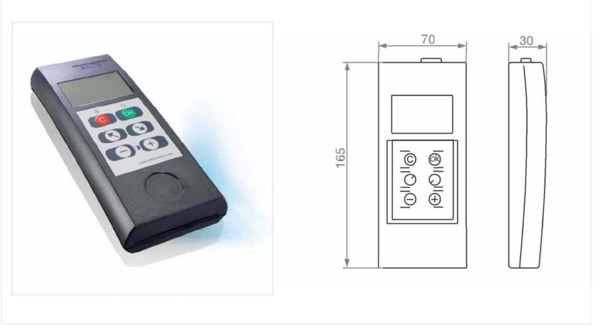
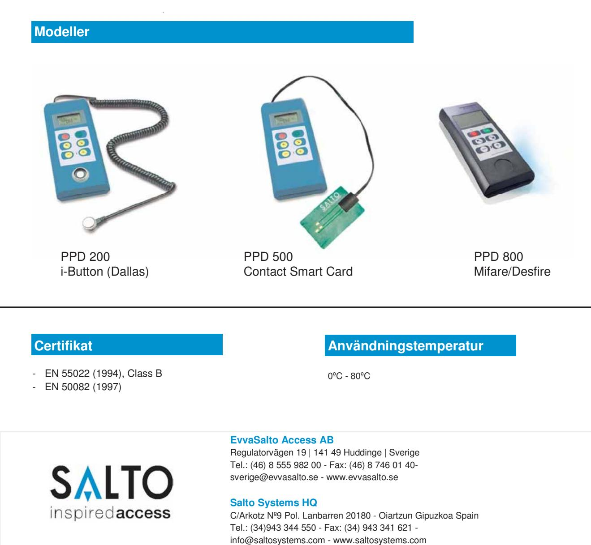

**PPD** Portable Programming Device SALTO

Den bärbara dörrprogrammeraren (PPD) är budbäraren mellan SALTO mjukvara och dess offline enheter. All dörrrelaterad information uppdareras denna väg. Använarinformation däremot sprids via användarnas kort. Denna enhet är nödvändig i alla SALTO ROM eller SALTO RW/SVN installationer.

## Funktioner

- **Driftsättning:** Detta används för att starta upp enheter i ett SALTO system.
- **Diagnostik:** Detta används för att utföra en diagnostik på enheter och kan användas till att se batteristatus, Firmware version, serienummer, ledigt minne samt vad enheterns datum och klocka
- **Nödöppning:** Detta tillåter nödöppning av enheter om nyckeln tappats bort, om enheten är i "stör ej" läge eller om batterierna tagit slut.
- **Hämta loggfil:** Detta hämtar alla händelser från en enhet, för att sedan laddas ner i en PC för analys.
- **Uppdatera:** Detta uppdaterar en enhet med de senaste uppdateringar, t.ex. ändrade öppettider och svartlistade nycklar.

## Portable Programming Device

## **Teknisk data**

- Storlek: 70mm x 165mm x 30mm.
- Vikt: 180g.
- Ström: 3st alkaliska batterier LR03 AAA 1,5V.
- Anslutning till enhet: 3 polig kabel inkluderad. (olika kablar för olika teknologier)
- Anslutning till PC: USB.
- 14 olika språk I enheten

SALTO Systems reserves the right to modify technical specifications, designs and performances without notice