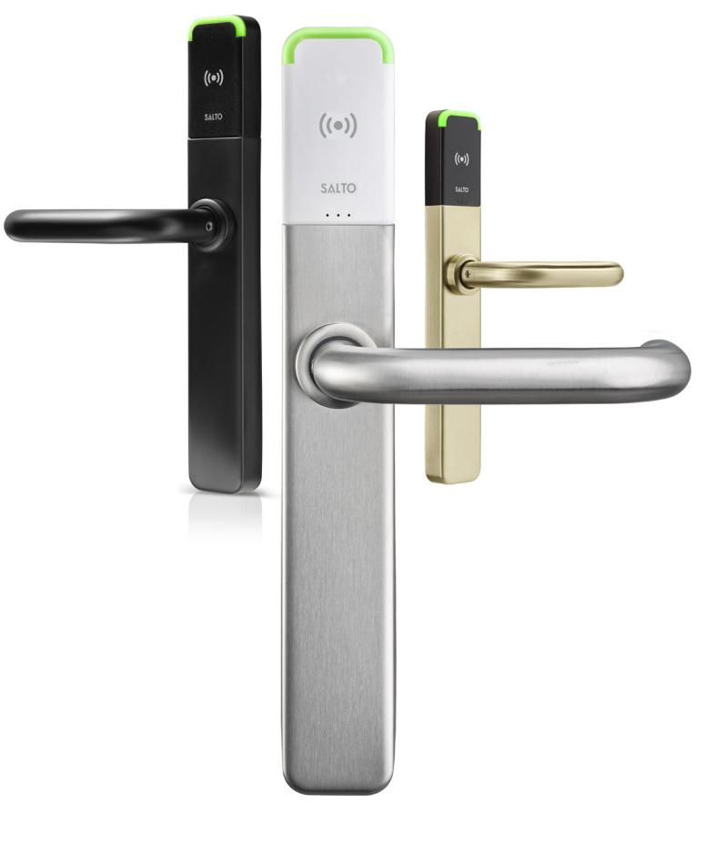
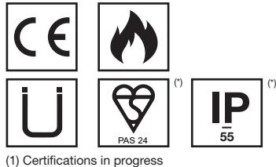
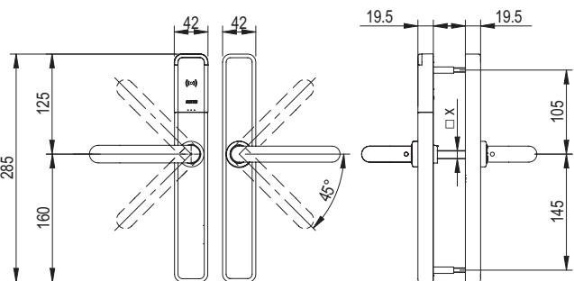
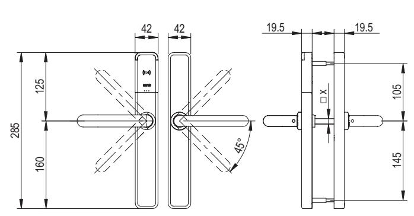
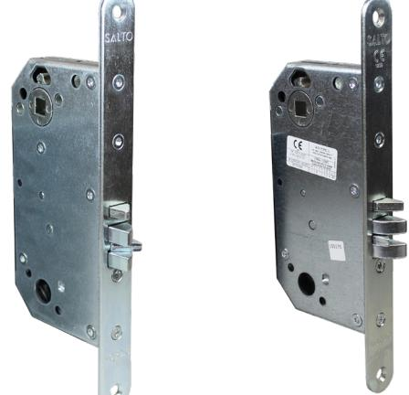

# PRODUKTBLAD

# XS4 One by SALTO retrofit med Skandinaviska mekaniska låskistor

SALTO XS4 One Euro är en elektronisk dörrbladsläsare. Tack vare teknologin som finns inuti kan den kombinera bekvämligheten i SALTO SVN med BLUEnet trådlös kommunikation.

Denna dörrbladsläsare i europeiska profil kan installeras i dörrar med skandinavisk utfräsning med specificerade skandinaviska låskistor, utan behov av ny europeisk utfräsning i dörren vilket gör den perfekt för att byta ut t.ex. TimeLox dörrenheter.

www.saltosystems.com

# TEKNISK SPECIFIKATION OCH SPECIFIKATION PÅ SALTO SKANDINAVISKA LÅSKISTOR: XS4 ONE Ex7xx

(*) Optional

#### TEKNISK INFORMATION: TEKNISK RITNING:

| Läsardimensioner (H x B x D):       | 285,0 x 42,0 x 19,5 mm                                                     |
|-------------------------------------|----------------------------------------------------------------------------|
|                                     |                                                                            |
| Vikt:                               | 1,5 kg                                                                     |
| Tryckesrotation:                    | Max. 45º                                                                   |
| Dörrtjocklek:                       | 32 mm - 120 mm                                                             |
| Distans mellan trycke och cylinder: | 47 mm - 110 mm                                                             |
| Fyrkantig tryckespinne:             | 7 mm, 7,6 mm split, 8 mm, 8 mm split, 9 mm, 9 mm split                  |
| Störmförsörjning:                   | 3 AAA batteries (LR03 1,5V)                                                |
| Antal öppningar:                    | 40.000 - 60.000 beroende på lästeknik                                   |
| Maximalt antal logghändelser:       | 2 250 (SVN standalone) 1 850 (SVN BLUEnet) 1 450 (SALTO KS)          |
| Temperaturområde utomhus            | +5 ºC / +50 ºC utan kondesation, alternativt -20 ºC /+50 ºC          |
| Temperaturområde inomhus            | +5 ºC / +50 ºC. utan kondesation.                                       |
| IP klassning:                       | IP53 (alternativt IP55 för utsideenheten)                               |
| Certifikat:                         | CE, EN1906 EN 179, EN 1634-1 (Ei60, E260, E90) PAS24 (alternativ) |

# LÄSTEKNIKER:

| MIFARE:*     | • |
|--------------|---|
| BLE Smart:   | • |
| NFC:         | • |
| Legic:**     | — |
| HID iClass®: | • |
| Picopass:    | — |
| i-Button:    | — |

* MIFARE® (DESFire EV2, Classic, Plus, Ultralight C).

** Legic Prime och Legic Advant

## TEKNOLOGIPLATTFORMAR:

## SALTO SPACE:

| Smile - Selfprogrammable | — |
|--------------------------|---|
| ROM                      | • |
| SVN data-on-card         | • |
| Wireless (SALTO RFnet)   | — |
| Wireless (SALTO BLUEnet) | • |
|                          |   |

#### SALTO KS:

SALTO KS: •

## SALTO SALLIS:

SALLIS: —

# ÖPPNINGSSÄTT:

| Standard:                        | • |
|----------------------------------|---|
| Kontorsfunktion:                 | • |
| Tidstyrd kontorsfunktion:        | • |
| Automatisk öppen:                | • |
| Automatiskt öppen + kontorsfunk. | • |
| Toggle:                          | • |
| Tidstyrd Toggle:                 | • |
| Amok:                            | — |
| Återinrymning:                   | • |
| Pin / gruppkod:                  | — |

## ALTERNATIV:

# Läsarfärg:

| Svart: | • |
|--------|---|
| Vit:   | • |
|        |   |

## Ytbehandling:

| IM Matt rostfritt stål:      | • |
|------------------------------|---|
| IP Polerat rostfritt stål:   | • |
| IA Antikmässing:             | • |
| PP PVD polerad mässing:      | • |
| PM PVD matt polerad mässing: | • |
| NE Svart:                    | • |
| BC BioCote anti-microbial:   | • |
|                              |   |
| Trycken                      |   |

# Kompatibla trycken U, L, W, H, S, B, P, J, T, Y, Z,

O, N, G, K, 2, 3, 4, 7, 5

#### MODELL FÖR SKANDINAVISKA LÅSKISTOR:

#### Ex750:

2 trycken av valfri modell.

#### Ex751:

2 trycken av valfri modell. vred på insidan.

XS4 One Euro kan installeras med låskistan nedan utan att hålbilden i dörren behöver vara anpassad för euro låskistor.

Låskistan nedan har tyckespinne och cylinderhål i motsatt position mot den skandinaviska standarden.

#### SALTO SKANDINAVISK LÅSKISTA FÖR EURO PROFIL:

SALTO LÅSKISTA för Skandinaviska dörrar med tryckespinne i övre hålet.

#### ARTIKELNUMMER:

TECHNICAL SPECIFICATIONS - XS4 One - Datasheet-Ex7-retrofit Scand Mortise locks-ENG-21-03

LS0N0450R20ZP8R - SKANDINAVISK LÅSKISTA, HÖGER LS0N0450R20ZP8L - SKANDINAVISK LÅSKISTA, VÄNSTER

För användning med SALTO XS4 One EURO i dörrar med skandinavisk hålbild.

För specifikationer och certifikat på SALTO låskistor, se separat datablad.

TÄCKPLÅT FÖR SKANDINAVISK ENHET: ARTIKELNUMMER: COPLE 085 FF C

