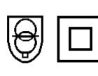

## **SMPS SELV-spänning** typ **PSLR 30**

Switchad likriktartransformator för generell användning i system inom spänningsband I. Transformator med skyddsseparation mellan primär- och sekundärlindningar utförd för matning av SELV-kretsar och PELV-kretsar. För användning inom kontor/bostäder/industri. Lämplig där stora krav ställs på god isolation mellan nätspänning och skyddsklenspänning.

• Stabil utspänning

- Kortslutningssäker
- Passar normcentral (4 moduler)

| Artikelnummer:     | 8927-0001                                                         |
|--------------------|-------------------------------------------------------------------|
| Inspänning:        | 180 – 264 V 47-63 Hz (N – L)                                |
| Utspänning:        | 27,2 Vdc                                                          |
| Utström:           | max. 1,0A                                                         |
| Stand by:          | < 0,8 W                                                           |
| Linjäritet:        | < 0,1% vid ± 10% inspänningsvariation                             |
| Rippel:            | 200 mV t-t                                                        |
| Verkningsgrad:     | > 80 %                                                            |
| MTBF:              | 50000 h vid 70% belastning vid 25ºC                               |
| Kapslingsklass:    | IP40                                                              |
| Isolationsklass:   | 4,2 kV                                                            |
| Omgivningstemp:    | -10oC - + 40oC                                                    |
| Vikt:              | 0,17 kg                                                           |
| Utförande:         | Likriktartransformator i grå kapsling av slagtålig, själv-        |
|                    | slocknande termoplast. Dubbelisolerad (skall ej skyddsjordas).    |
|                    | Primära och sekundära kopplingsplintar i skilda kopplingsrum.     |
| Montage:           | Snäppfastsättning på 35-mm DIN-skena i apparatskåp eller normlåda |
|                    | alternativt väggmontage med skruv.                                |
|                    | Åtdragningsmoment för anslutningsskruvar på plintar 0,25 Nm       |
| Tillverkningsnorm: | Elsäkerhet EN 61 558-1, EN 61 558-2-6/2-17                     |
|                    | Emission EN 55 081-1, EN 61 000-3/2-3                          |
|                    | Immunitet EN 61 000-6-2                                        |
|                    |                                                                   |
|                    |                                                                   |
|                    |                                                                   |
|                    |                                                                   |
|                    |                                                                   |
|                    |                                                                   |
|                    |                                                                   |

**Om det krävs i föreskrifterna för installationen i fråga, skall transformatorn i den fasta installationen föregås av en allpolig elkopplare.** 

Tel.: 08-594 809 00 Fax.: 08-592 527 68 info@tufvassons.se www.tufvassons.se 12/09