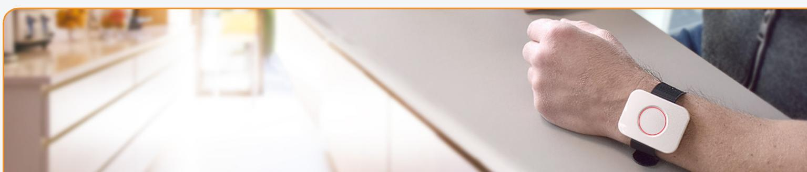
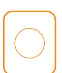
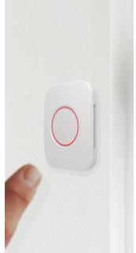
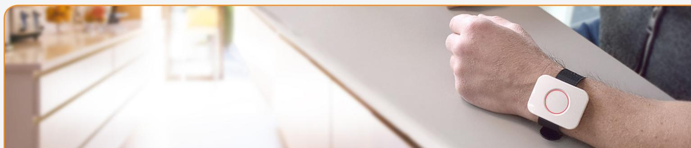

# **Panic Button Alert button for emergencies**

The Panic Button is a wearable alert button that enables the user to call for help in emergencies. The wireless button can be placed anywhere or carried around by the user, with an option to use a necklace or a wristband. These options allow for use cases in home care or security solutions.

Vulnerable people such as the elderly or the disabled can wear the Panic Button around the wrist or the neck and use it to call for help. It can further be placed in rooms with a high risk of accidents as the bathroom and users can get help in case of emergencies.

The Panic Button can further be used as an alert button in security solutions. Placed under a desk or in reach from the cash register at businesses, a push of the button can trigger a silent alarm.

### **Independence and security of the elderly and disabled**

The risk of falling increases as people age, and it can be difficult for elderly people to get up on their own. A fall alarm for the elderly can, therefore, be a great help for themselves and their relatives, as it helps the elderly maintain an independent lifestyle in their own home.

Disabled people are vulnerable to dangers, even if they live on their own or together with family or a caregiver. The Panic Button can help the disabled person gain more independence and security.

- **• Zigbee 3.0**
- **• Water-resistant**
- **• Easy installation**
- **• Secure communication**

### **Mounting and use options**

The button can be used/mounted in several ways:

- Hand-held: used as a remote control
- Neck: worn around the neck as a necklace, using the optional lanyard
- Wrist: worn on the arm, using the optional wrist band
- Wall: mounted on wall or door, using the optional mounting tape

www.develcoproducts.com

## **Panic Button - Technical specifications**

**Model number: PBTZB-110**

#### **General**

| Dimensions (WxHxD)   | 40 x 53 x 10.8 mm / 1.57 x 2.09 x 0.43 inches           |
|----------------------|---------------------------------------------------------|
| Weight               | 40 g / 1.41 oz (with packaging: 70 g / 2.47 oz)         |
| Color                | White – Optional customized color marking on button     |
| Power supply         | Battery: CR2450 (Coin cell), up to 5 years battery life |
| Radio                | Sensitivity: - 100 dBm                                  |
|                      | Output Power: + 10 dBm                                  |
| Environment          | Water-resistant when used in the bathtub and shower     |
|                      | Operation Temperature: 0 – 50 oC / 32 - 122 oF          |
|                      | Relative humidity 5 % - 85 % non condensing             |
| Functions            |                                                         |
| Button               | Config 1: Panic alarm                                   |
| Communication        |                                                         |
| Wireless protocol    | Zigbee 3.0                                              |
| Certifications       | Conforming to CE, FCC, IC, ISED, RED, RoHS and REACH    |
|                      | directives                                              |
|                      | Zigbee 3.0 certified                                    |
| Lanyard              |                                                         |
| Dimensions (LxWxT)   | 440 x 10 x 1.2 mm / 17.3 x 0.4 x 0.05 inches            |
| Material             | Polyester + ABS                                         |
| Color                | Black                                                   |
| Safety feature       | Safety break release clip                               |
| Wristband (optional) |                                                         |
| Dimensions (LxWxT)   | 280 x 22 x 1.05 mm / 11 x 0.87 x 0.04 inches            |
| Material             | Nylon + 304 stainless steel                             |
| Color                | Black                                                   |