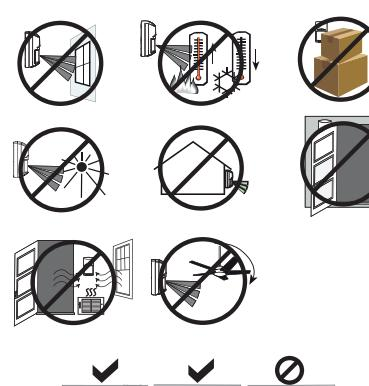

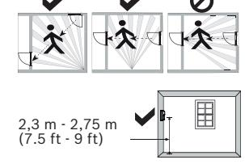

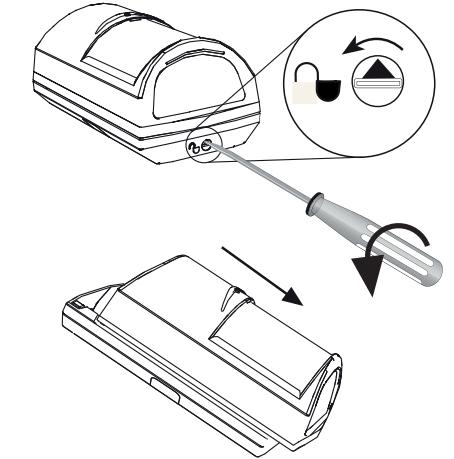

**1 | 2 | 3 | 4 |**

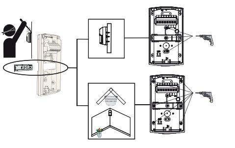

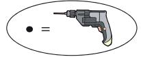

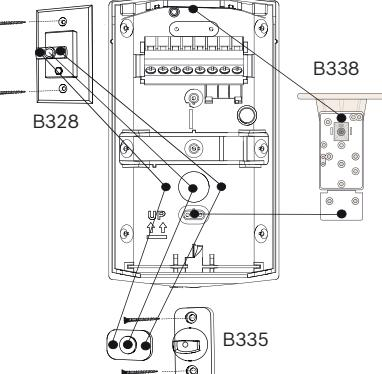

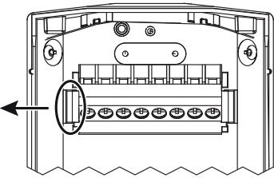

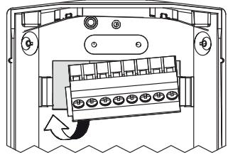

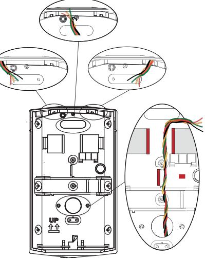

**5 | 6 | 7 | 8 |**

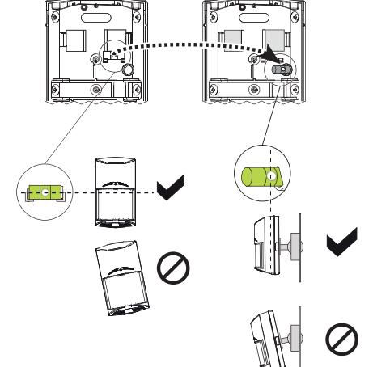

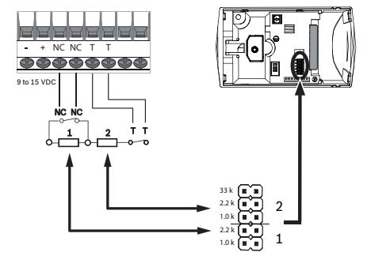

**12 | 13 | 14 |**

**9 | 10 | 11 |**

## **Commercial Series TriTech Motion Detectors**

ISC‑CDL1‑W15G ISC‑CDL1‑W15GE ISC‑CDL1‑W15HE ISC‑CDL1‑W15G‑CHI

**en** Quick installation guide

Torenallee 49 5617 BA Eindhoven The Netherlands

**www.boschsecurity.com**  © Bosch Security Systems B.V., 2019

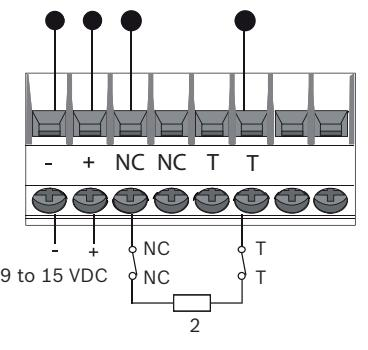

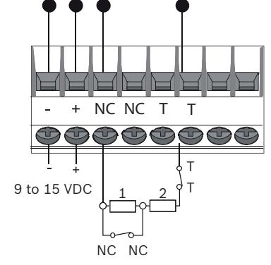

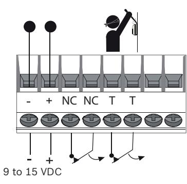

| 33 k  |   |  |
|-------|---|--|
| 2.2 k | 2 |  |
| 1.0 k |   |  |
| 2.2 k |   |  |
| 1.0 k | 1 |  |

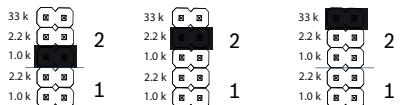

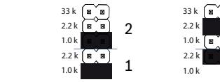

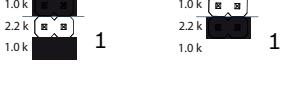

2

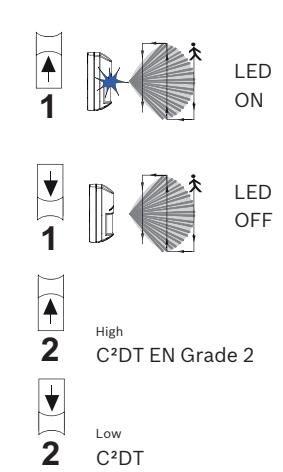

C2DT EN Grade 2 and C2DT EN Grade 3 were not investigated by UL

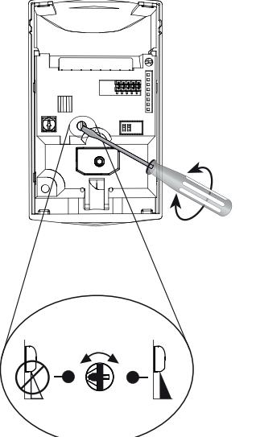

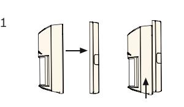

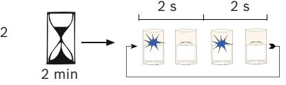

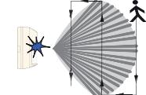

3

## **Part II of II**

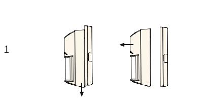

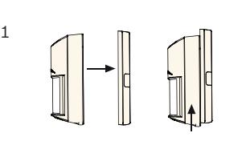

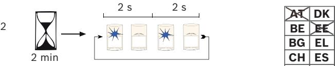

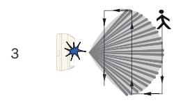

| AT AT AT | DK DK DK | HU HU HU | LV LV LV | RU RU RU |                      |
|----------------|----------------|----------------|----------------|----------------|----------------------|
| BE BE BE | EE EE EE | IE IE IE | MT MT MT | SE SE SE |                      |
| BG BG BG | EL EL EL | IS IS IS | NL NL NL | SI SI SI | 10.570 to 10.610 GHz |
| CH CH CH | ES ES ES | IT IT IT | NO NO NO | SK SK SK | 20 mW                |
|                |                |                |                |                | ISC-CDL1-W15HE       |
| CY CY CY | FI FI FI | LI LI LI | PL PL PL | TR TR TR |                      |
| CZ CZ CZ | FR             | LT LT LT | PT PT PT | UA UA UA |                      |
| DE DE DE | HR HR HR | LU LU LU | RO RO RO | UK UK UK |                      |
|                |                |                |                |                |                      |
| AT AT AT | DK             | HU             | LV             | RU             |                      |
| BE             | EE             | IE             | MT             | SE             |                      |
| BG             | EL             | IS             | NL             | SI             | 10.510 to 10.580 GHz |
|                |                |                |                |                | 25 mW                |
| CH             | ES             | IT             | NO             | SK SK SK |                      |

For product manufacturing dates, go to http://www.boschsecurity.com/datecodes/ and refer to the serial number located on the

**PL**

**TR**

**UA UK**

**TR**

**TR**

**PT RO** 10.570 to 10.610 GHz 20 mW ISC-CDL1-W15HE

ISC-CDL1-W15GE

**1 | 2 | 3 | 4 |**

Changes or modifications not expressly approved by Bosch Security Systems, Inc. can void the user's authority to operate the equipment.

| cU  | Use only a Listed Class 2 Power Limited        |
|-----|------------------------------------------------|
| Lus | power source.                                  |
|     | Standby power: The Listed control unit or a    |
|     | listed burglary power supply must provide 4    |
|     | hours of standby power. Install the unit in ac |
|     | cordance with National Electrical Code NFPA    |
|     | 70 and Part 1 of the Canadian Electrical code  |
|     | CSA C22.1.                                     |
|     |                                                |

IC

2

MIN MAX

## FCC/ This device complies with part 15 of the FCC Rules and Industry Canada license-exempt RSS standard(s). Operation is subject to the following two conditions: (1) this device may not cause interference, and (2) this device must accept any interference, including interference that may cause undesired operation of the device

**ON 1 2**

Le présent appareil est conforme aux CNR d'Industrie Canada applicables aux appareils radio exempts de licence. L'exploitation est autorisée aux deux conditions suivantes : 1) l'appareil ne doit pas produire de brouillage, et (2) l'utilisateur de l'appareil doit accepter tout brouillage radioélectrique subi, même si le brouillage est susceptible d'en compromettre le fonctionnement.

Under Industry Canada regulations, this radio transmitter may only operate using an antenna of a type and maximum (or lesser) gain approved for the transmitter by Industry Canada.

# **5 | 6 | 7 | 8 |**

- FCC /IC To reduce potential radio interference to other users, the antenna type and its gain should be so chosen that the equivalent isotopically radiated power (e.i.r.p.) is not more than that necessary for successful communication
Conformément à la réglementation d'Industrie Canada, le présent émetteur radio peut fonctionner avec une antenne d'un type et d'un gain maximal (ou inférieur) approuvé pour l'émetteur par Industrie Canada. Dans le but de réduire les risques de brouillage radioélectrique à l'intention des autres utilisateurs, il faut choisir le type d'antenne et son gain de sorte que la puissance isotrope rayonnée équivalente (p.i.r.e.) ne dépasse pas l'intensité nécessaire à l'établissement d'une communication satisfaisante.

**Manufacturing dates**

**FI**

**LI**

**LT LU**

**FR HR**

**CZ FR**

**CZ FR**

product label.

**CY**

**CZ DE**

| Voltage (operating) | 9 to 15 VDC, 9-15 Vcc de 12 mA @ 12 Vcc en veille/en alarme, source limitée en puissance, ondulation résiduelle 1 V. |
|------------------------|-------------------------------------------------------------------------------------------------------------------------------|
| Current (max)          | 12 mA                                                                                                                         |
| Alarm relay /Tamper | ≤100 mA, 25 V                                                                                                                 |
| Wiring loops           | Ø 1.29 mm to 0.40 mm (16 AWG to 26 AWG) (UL: 22 AWG to 16 AWG)                                                          |
|                        | GE = -20 °C to +55 °C HE = +5 °C to +40 °C UL: 0 °C to +49 °C (+32 °F to +120 °F) AFNOR/CNPP: -10 °C to +55 °C    |
|                        | 95% non-condensing UL: 93%                                                                                                 |

| Region        | Agency     | Certification                                                                                     |
|---------------|------------|---------------------------------------------------------------------------------------------------|
| USA and CA | UL, ULC | UL639, S306-03 cULus LISTING Intrusion Detection Unit, Type: S (ISC-CDL1-W15G)              |
|               | FCC        | Part 15, Class B (ISC-CDL1- W15G)                                                              |
|               | IC         | RSS210 1249A-CDL1 (ISC-CDL1- W15G)                                                             |
| EU            | CE         | CE - 2014/53/EU (RED), 2011/65/ EU and 2015/863 (RoHS) (ISC-CDL1-W15GE, ISC-CDL1- W15HE) |
| AU            | ACMA       | RCM (ISC-CDL1-W15G)                                                                               |
| BR            | ANATEL     | Resolution No. 242 (ISC-CDL1- W15G)                                                            |
| CN            | CCC        | 2015031901000145 (ISC-CDL1- WA12G-CHI, ISC-CDL1-W15G-CHI, ISC-CDL1-WA15G-CHI)               |

**Commercial Series TriTech Motion Detectors**

ISC‑CDL1‑W15G ISC‑CDL1‑W15GE ISC‑CDL1‑W15HE ISC‑CDL1‑W15G‑CHI

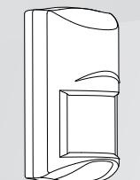

**en** Quick installation guide

0

Meters

0 2 4 6 8 10 15

Meters

≥2.3 ≥7.5 ≤2.75 ≤9

0

14

12

39

46

Feet

0 7 13 20 26 33 50

Feet

90°

90°

**12 | 13 | 14 |**

**Bosch Security Systems B.V.** Torenallee 49 5617 BA Eindhoven The Netherlands

**www.boschsecurity.com**  © Bosch Security Systems B.V., 2019