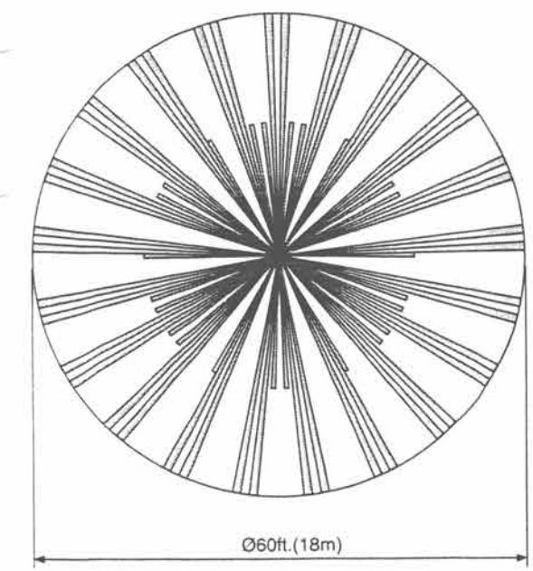
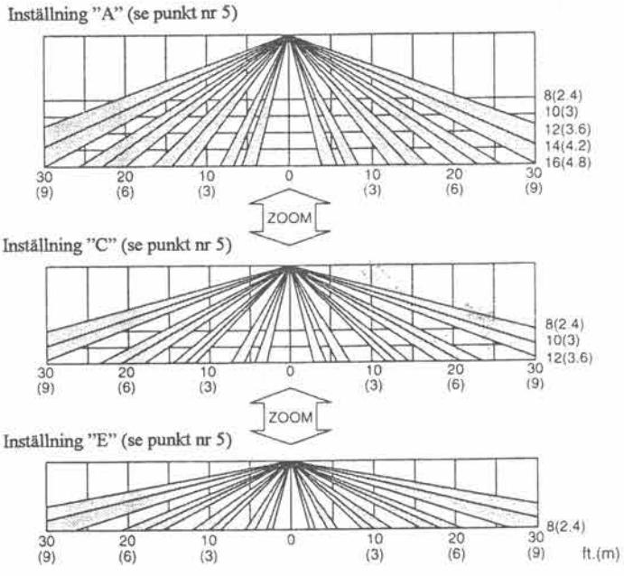
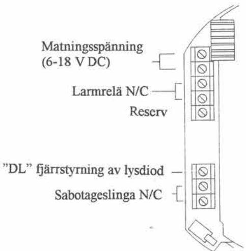
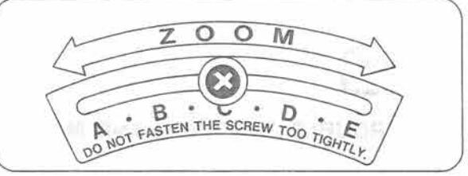
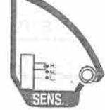

# Passiv IR-detektor OPTEX SX-360Z

# Installations- och projekteringsanvisning.

Teletec Connect AB Veterinärgränd 6 121 63 Johanneshov Tele: 08-602 16 00 Fax: 08-602 16:01

## OPTEX Passiv IR detektor SX-360Z

#### SX-360Z är utrustad för:

- Takmontering, 360° bevakningsområde. ତ
- Bevakningsområde upp till 18 m med "zoom" teknik på monteringshöjd mellan 2,4 5 meter. .
- Valbar pulsräkning 1,2 eller 4 pulser. .
- Lysdiodskontroll med brytare till/ från eller fjärrmanövrering från centralapparat. ತಿ
- Ställbar känslighet (hög, medium eller låg). .

#### Installationstips:

Gör en riskanalys för lokalen som skall skyddas innan Du bestämmer detektorns placering. Var är det troligast att en inkräktare försöker ta sig in? Entrédörrar och lågt liggande fönster är självklara skyddsobjekt. Om inkräktaren går in genom ett fönster: vilken väg är det troligast att han kommer att ta sedan?

Här nedan får Du några goda råd för att undvika de vanligaste orsakerna till falsklarm från IR-detektorer. Använd alltid dessa som utgångspunkt för Din egen anläggning.

- Installera inte detektorn så att solen kan lysa direkt in i den, till exempel vänd mot ett fönster. .
- Rikta aldrig detektorn mot föremål som snabbt kan ändra temperatur. (Spis, ugn, kylskåp, radiatorer, . luftintag, m.m.)
- Rikta aldrig detektorn mot föremål som rör sig. .
- Montera inte detektorn i draget från varm- eller kalluftutsläpp. �
- � Placera detektorn 2,4 - 5 meter över golvytan för att erhålla fullständig täckning.
- Montera ej detektorn utomhus. .

### 1. Bevakningsområde:

Uppifrån

### Från sidan

#### 2. Beskrivning och funktioner

#### 3. Montering och inkoppling:

Lossa skruven på sidan och vrid överdelen på detektorn moturs (vänster) ca 1 cm tills ett klick hörs. Lyft av överdelen och montera underdelen i taket. Dra in och anslut kabeln till detektorn enligt bilden nedan Lyrar Verdelen och ytans storlek som detektorn skall bevaka. Justera överdelens "zoom" instell niedan.
Kontrollera takhöjden och ytans storlek som detektorn skall bevaka. Ju känsligheten på detektorn enligt punkt nr 5 och nr 6 innan överdelen återmonteras.

#### Lysdiod till/ från:

- 1. Lysdioden kan kopplas till eller från med "LED" brytaren på detektorn.
- 2. Lysdioden kan fjärrstyras för att underlätta gångtest av detektorn. När plint "DL" ansluts till minus (-) är lysdioden inkopplad.

#### 5. Justering av bevakningsområdet:

SX-360Z kan monteras på 2,4 upp till 5 meters höjd över golvet utan att bevakningsområdet minskar. Justeringen sker med hjälp av "zoom" teknik. Ändra justeringen enligt tabellen nedan efter monteringshöjd och bevakningsytans storlek i diameter (Ø ).

|       | A    | в                         | C                         | D | E |
|-------|------|---------------------------|---------------------------|---|---|
| 4.8 m | 018m |                           | -                         |   | - |
| 4,2 m |      | 016m   018m               |                           |   |   |
| 3,6 m |      | 013m   Ø15m   Ø18m        |                           |   |   |
| 3,0 m |      | Ø11m   Ø13m   Ø15m   Ø18m |                           |   |   |
| 2.4 m | 09m  |                           | 010m   012m   014m   018m |   |   |

#### 6. Justering av känslighet:

Innan känsligheten justeras skall detektorns monteringshöjd och bevakningsområdets storlek fastställas. Välj inställning "H (hög)", "M (medium) eller "L (låg)". Tabellen nedan visar rekommenderad inställning för olika storlekar på bevakningsområdet.

| Känslighet                    |          |           |           |
|-------------------------------|----------|-----------|-----------|
| Diameter på bevakningsytan | 09-012 m | 012-015 m | 015-018 m |

#### 7. Felsökning:

Lysdioden lyser inte:

- · Fel på matningsspänning (ej inkopplad, för låg spänning, + och felvända.)?
- · Avkänningsområdet felaktigt inställt?
- · Lysdioden är i från-läge?

Lysdioden lyser utan att någon vistas i rummet:

- · Rörligt föremål inom avkänningsområdet? (gardin, väggbonad, etc)
Lysdioden lyser, men inget larm utlöses:

- · Larmreläet har fastnat eller bränts på grund av felkoppling eller överbelastning?
- · Felaktig inkoppling eller kabelfel?
- · Larmreläet är av misstag parallellkopplat med en annan detektors relä?

#### Tekniska data:

| Beige                        |  |  |  |
|------------------------------|--|--|--|
| Diameter Ø128 mm, höjd 73 mm |  |  |  |
| 224 g                        |  |  |  |
| 18 m, 360°                   |  |  |  |
| 2,4 - 5 meter                |  |  |  |
| 276 zoner                    |  |  |  |
| -20 C till +50 C             |  |  |  |
| 95% max                      |  |  |  |
| Röda lysdioder               |  |  |  |
| Brytande (NC), 200 mA 28V DC |  |  |  |
| Max 18 mA                    |  |  |  |
| 6 - 18 V DC                  |  |  |  |
| Brytande (NC)                |  |  |  |
|                              |  |  |  |