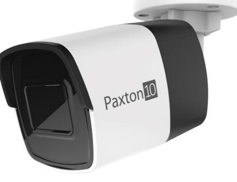
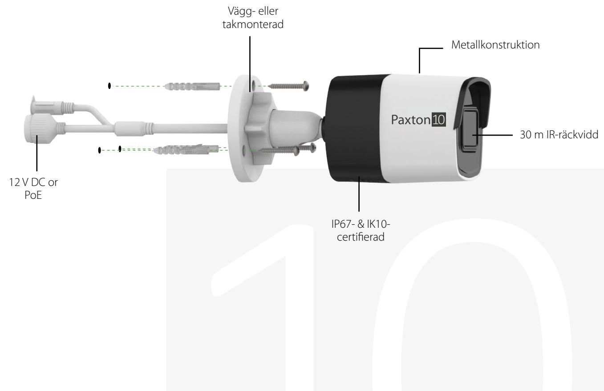
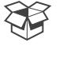

# Pax ton10 över vak ningsk amera i miniformat - 2,8mm, 8MP

## Översikt

Paxton10-kamerorna är särskilt framtagna för att fungera med Paxton10-systemet. På så sätt erbjuder de det enklaste, säkraste och mest flexibla installationsförfarandet. Varken NVR eller annan hårdvara krävs eftersom videomaterialet behandlas i kameran och kan lagras antingen på det förinstallerade SD-kortet på 128 GB eller skickas direkt till en nätverksplats.

Paxton10-kameran har också utmärkt prestanda vid dålig belysning, inbyggd IR, 4K-upplösning, PoE-strömförsörjning och täcks även av Paxtons 5-årsgaranti.

## Funktioner

- 8 MP sensor vid dålig belysning som kan spela in i upp till 4K
- SD-kort på 128 GB
- P67-och IK10-certifiering
- Kan monteras antingen på vägg eller tak
- Kan monteras antingen på vägg eller i tak
- Metallkonstruktion
- 30 m IR-räckvidd
- 120 dB brett dynamiskt omfång
- 12V DC or PoE+ (at)
- 0,01 lux @ F1,2
- Fast fokallängd på 2,8 mm

### specifikationer

### System

| Videoströmmar - Huvudström - Förval |           |
|-------------------------------------|-----------|
| Hög                                 |           |
| Upplösning                          | 4K        |
| Bildrutor per sekund                | 20fps     |
| Maximal bithastighet                | 12288kbps |
| Medel                               |           |
| Upplösning                          | 1080p     |
| Bildrutor per sekund                | 20fps     |
| Maximal bithastighet                | 3072kbps  |
| Låg                                 |           |
| Upplösning                          | 720p      |
| Bildrutor per sekund                | 15fps     |
| Maximal bithastighet                | 1536kbps  |
| Underström                          |           |
| Upplösning                          | 360p      |
| Bildrutor per sekund                | 10fps     |
| Maximal bithastighet                | 512kbps   |
| Videokompression                    | H264      |
| Dag-/nattläge                       | Auto      |

El

| Strömförbrukning | 12 VDC @ 0,5A, max 6 W |
|------------------|------------------------|
|                  | PoE: Max 7,5 W         |
| Driftspänning    | 12v DC ±25%            |
|                  | PoE 802.3af            |

### Kommunikation

| ONVIF | Nej |
|-------|-----|
| RTSP  | Nej |
| IP    | Ja  |

#### Maskinvara

| Dimensioner (B x H x D) | 70 × 68 × 171 mm                  |
|-------------------------|-----------------------------------|
| Vikt                    | 400g                              |
| SD-kort                 | Max 128 GB                        |
| Videoformat             | PAL/NTSC                          |
| Bildsensor              | 1/2-tums progressiv skanning CMOS |
| Fokallängd              | 2.8mm                             |
| Bländare                | F1.6                              |
|                         |                                   |

| Synfält                               | Horisontellt synfält: 102°            |
|---------------------------------------|---------------------------------------|
|                                       | Pan: 0° till 360°, lutning: 0° to 90° |
|                                       | Rotation: 0° to 360°                  |
| Justering i tre axlar (manuellt)      | Framsida: metall                      |
|                                       | Bakstycke: metall                     |
| Material                              | Solskydd: plast                       |
| Garanti                               | 5-årig Paxtongaranti                  |
| SD-kortspecifikationer (ingår)        |                                       |
| Lagringskapacitet:                    | 128GB                                 |
| Läshastighet                          | 95MB/s                                |
| Skrivhastighet                        | 25 MB/s                               |
| Klass                                 | Klass 10, U1                          |
| Rekommenderade SD-kortspecifikationer |                                       |
| Lagringskapacitet:                    | 128 GB (maxgräns)                     |
| Korttyp                               | Micro SDXC                            |
| Klass                                 | UHS Klass 1                           |
| Minnestyp                             | MLC (Multi-Level cell)                |

Miljö

| Arbetstemperatur | -30°c to +60°c |
|------------------|----------------|
| IP-klass         | IP67           |
| IK-klass         | IK10           |
| Montering        | Vägg eller tak |

