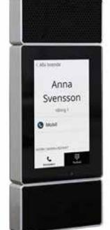

# Porttelefon TP511

## Produktbeskrivning

Robust porttelefon för ökad trygghet, passerkontroll och smidig kommunikation. Dinbox porttelefon har touchskärm och ett tåligt skal i CNC-fräst aluminium. IP-telefoni hanterar uppringning till mobil och fast telefon.

## Funktioner

- » Robust och tålig
- » Vandalsäker och härdat, reptåligt glas
- » Ringer svarsapparat, mobil eller fast telefon över IP-telefoni
- » Läsare för elektroniska nycklar och kort
- » Modulära komponenter

### Specifikationer

- » Kapsling i CNC-fräst aluminium
- » Ström och kommunikation med RS485
- » RFID Mifare (13.56 MHz) och EM (125 kHz)
- » 5" touchskärm
- » Utanpåliggande eller infällt montage
- » 3 mm härdat glas, IK08, 7A på Mohs hårdhetsskala
- » Inbyggd gyro

#### Artikel

| Artikelnummer | Bredd (mm) | Höjd (mm) | Djup (mm) | Vikt (kg) |
|---------------|------------|-----------|-----------|-----------|
| TP511         | 97         | 240       | 30        | 0,8       |

Dinbox Drottninggatan 97 113 60 Stockholm 010-33 000 10 info@dinbox.se http://dinbox.se