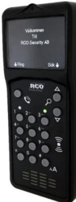
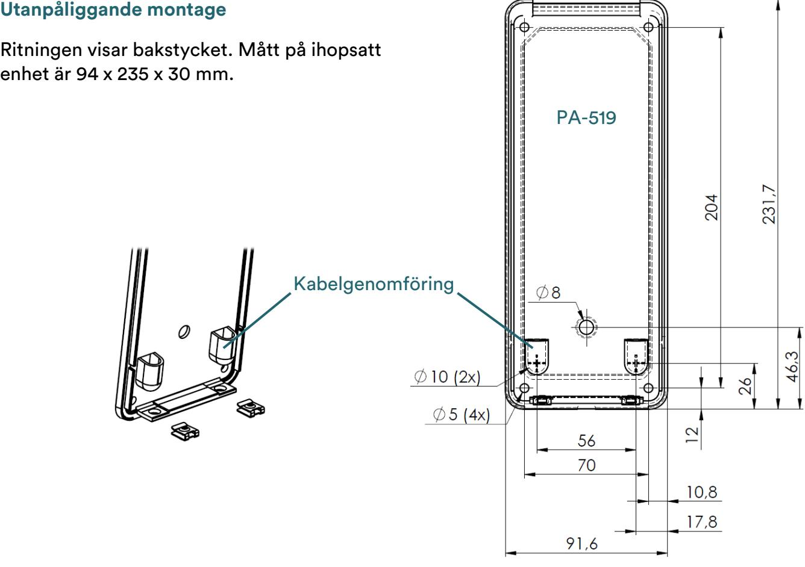
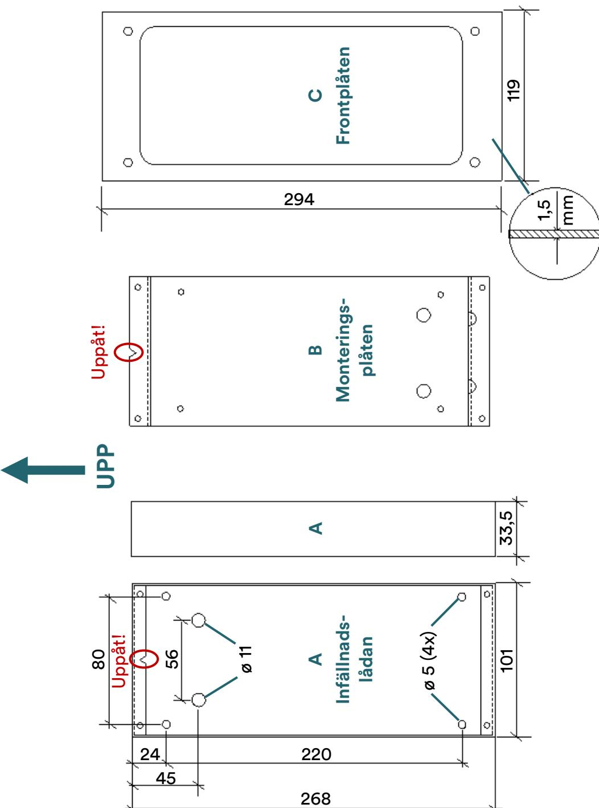
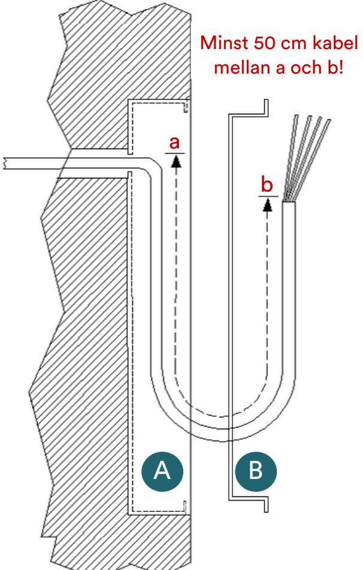
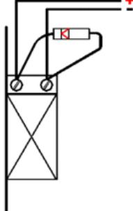
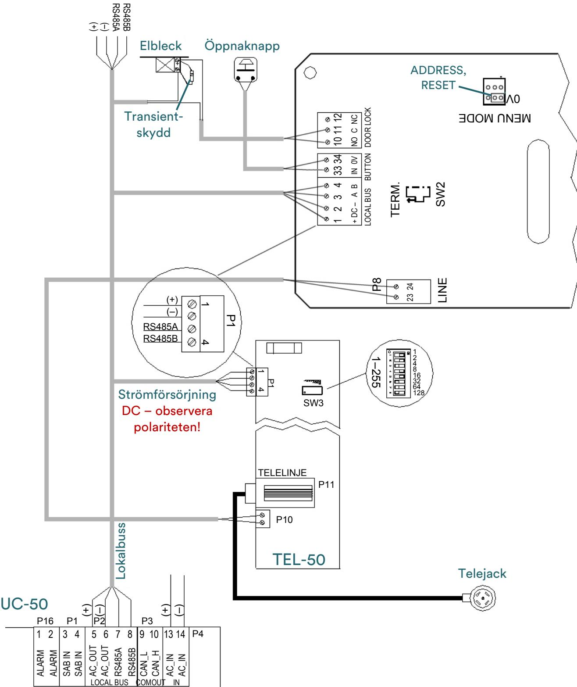
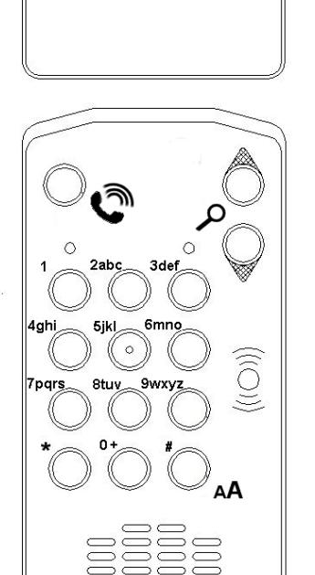
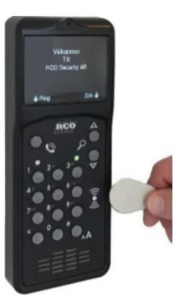
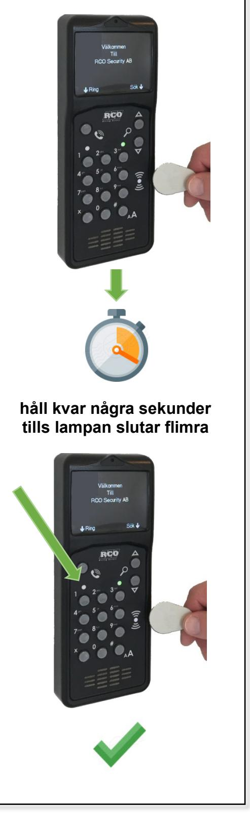

R-CARD 5000

# **Porttelefon PA-519 Installera, driftsätta och använda**

Manualen beskriver hur du monterar och ansluter porttelefonen, ställer in adressen och programmerar funktionen i R CARD M5, samt hur porttelefonen används.

RCO Security AB Box 705 176 27 Järfälla

tel 08-546 560 00 info@rco.se

| Allmänt om PA-519                                | 3  |
|-----------------------------------------------------|----|
| Installera                                       | 4  |
| Förberedelser4                                      |    |
| Montering                                           | 5  |
| Ansluta till UC-50 local bus                     | 7  |
| Anslutningsplintar, byglar och DIP-omkopplare 9  |    |
| Driftsätta                                       | 10 |
| Adressinställning 10                             |    |
| Återställa fabriksinställningar11                   |    |
| Programmering i R-CARD M5 11                  |    |
| Använda                                          | 14 |
| In- och utpassage 14                          |    |
| Ringa upp 14                                     |    |
| Larmtillkoppling 15                              |    |
| Larmfrånkoppling16                                  |    |
| Initiera kort17                                     |    |
| BILAGA 1: Skylt att sätta upp vid initieringsläsare | 18 |
| BILAGA 2: Specifikationer                        | 19 |

# **Allmänt om R-CARD 5000**

Systemet använder en persondator för administration, datalagring och kommunikation. Begreppet R-CARD 5000 avser hårdvaran (undercentraler, kortläsare etc.). Mjukvaran i persondatorn, R-CARD M5, kan hantera integrerat larm, porttelefoner samt tvättbokningstavlor.

Undercentral UC-50 kontrollerar dörrmiljöer, porttelefoner, larm samt tvättbokningstavlor. Undercentralerna kommunicerar med dator, dörrmiljöer, bokningstavlor etc. samt med varandra. Kortläsare finns för beröringsfri avläsning med prox och Mifare.

För begreppsförklaringar och information om kommunikation och kabel, se R-CARD 5000 – Installera.

# **Allmänt om PA-519**

Porttelefon PA-519 hanterar bl.a. knappsats, beröringsfri kortavläsning, dörröppning, telelinje och samtal. Den kan visa ett portregister där man kan bläddra fram till den hyresgäst man vill ringa upp. Våningsbenämning samt utvalda person-/lägenhets-/kortdata visas i teckenfönstret på de PA-519 som användarens/lägenhetens kort är behöriga till. En besökare kan ringa upp den boende genom att bläddra fram dennes våningsbenämning/namn och trycka på RING-knappen.

Portöppning med kort och/eller pinkod är inte möjlig medan samtal är uppkopplat.

Reläutgången är fri och matar inte ut ström. Lokala bussens strömförsörjning används.

PA-519 fungerar som initieringsläsareför NoKey offline.

Transientskyddsdiod ska alltid monteras på slutbleckets anslutningar – se ritning på sidan [8.](#page--1-0) **!** 

- Om krav på högre säkerhet föreligger kan du genom delat montage förhindra att objudna gäster skruvar upp PA-519 och kortsluter trådarna som går till det elektriska låset: **!** 
	- a) Sätt en in/utenhet (IO-5022 eller IO-5044) på insidan.
	- b) I R-CARD M5, programmera så att PA-519 använder det reläet för låsstyrning.
	- c) Använd en ingång på in/utenheten för öppnaknapp.
	- d) Ta bort programmering för knappöppning från porttelefonens ingång.

#### **Minimikrav**

- TEL-50 version 2.09.
- R-CARD M5 version 5.40.4 (5.40.5 rekommenderas)
- UC-50 version 2.84 (version 2.92 rekommenderas)
- Rekommendation: Alla undercentraler i systemet bör ha samma version (helst senast möjliga version). **!**

# **Installera**

#### **Förberedelser**

- Kontrollmät bussar före spänningssättning.
Innan strömmen kopplas på bör undercentralernas CAN-bussar och lokala bussar kontrollmätas med alla undercentraler och samtliga enheter anslutna. Se "Kommunikation och kabel" i R-CARD 5000 – Installera.

- Kontrollera spänningsfall i matande ledare.
Kontrollera spänningsfallet på lokala bussen. För stort spänningsfall i den lokala bussen kan ge kommunikationsproblem, se avsnittet "Spänningsfallets inverkan på kommunikationen på lokala bussen" i kapitlet "Kommunikation och kabel" i R-CARD 5000 – Installera.

- Kraftaggregat.
Se tillverkarens dokumentation samt blad med tilläggsinformation från RCO.

Kraftenheter från Milleteknik kan kommunicera med UC-50, vilket möjliggör att man kan till viss del kan styra kraftenheten och även få felrapporter från den.

Före inkoppling, läs "Kommunikation med Milletekniks kraftaggregat" i ovanstående installationsmanual för att undvika problem! **!** 

### **Montering**

Kortläsaren använder radiofrekventa signaler för att läsa av passerkort. Tänk därför på följande:

- Om kortläsaren monteras på metallunderlag kan läsavståndet reduceras.
- Montera inte kortläsaren inuti eller bakom elektromagnetiskt skärmande material.
- Kortläsaren bör inte placeras närmare andra beröringsfria läsare än 0,5 m.
- Vid montering på insidan av armerat glas kan räckvidden bli kraftigt reducerad.
- Kortläsaren kan störas av annan utrustning som utsänder elektromagnetisk strålning, exempelvis bildskärm, mobiltelefon o. dyl.
- Vid utomhusmontage måste enheten monteras minst 50 cm ovanför marken och lodrätt mot plant underlag. Använd regnskydd i utsatta miljöer. **!**

#### **Infällt montage**

Monteringen kräver minst 50 cm kabel (a-->b) inne i lådan och enheten (se nästa sidan)! **!** 

- 1. Montera bottenplattan med 4 skruvar på monteringsplåten (B).
- 2. Anslut kablaget till kretskortet. Kabelgenomföring sker enl. bild på sidan [5.](#page--1-12)
- 3. Fäst enhetens hölje med de två skruvarna i underkanten.
- 4. Placera insats och enhet i infällnadslådan (A).
- 5. Montera frontplåten (C) med 4 skruvar.

## **Ansluta till UC-50 local bus**

PA-519 kan anslutas till lokalbussen på undercentral UC-50 och upptar en kortläsarplats. Minimikrav: TEL-50 version 2.09. UC-50 version 2.84 (2.92 rekommenderas) och R-CARD M5 version 5.40.4 (5.40.5 rekommenderas).

Elslutbleck ska alltid förses med transientskyddsdiod enligt vidstående skiss. Det förhindrar att transienter från slutblecksspolen stör elektroniken.

- Vid installation bör förankring/kontroll av inkommande kabel ske så att man inte kan dra kabel ur kontaktblocken. Kablarna till kontaktblocken får inte vara avmantlade mer än 9 mm inuti produktens hölje. **!**

#### **Anslutningsplintar, byglar och DIP-omkopplare**

| P1: LOCAL BUS |            |                                                                                                                                                                                      | P2 P4                                                                                      |
|---------------|------------|--------------------------------------------------------------------------------------------------------------------------------------------------------------------------------------|-----------------------------------------------------------------------------------------------|
| Stift         | Bet.       | Funktion                                                                                                                                                                             | P1 1 2 3 4 33 34 10 11 12                                                                  |
| 1 2        | DC+ DC– | Strömförsörjning. Se specifikationer på sidan 19. Anslut till motsvarande plint på andra enheter.                                                                           | + DC - A B IN 0V NO C NC LOCAL BUS BUTTON DOOR LOCK P8 TERM. 23 24 LINE SW2 |
| 3 4        | A B     | RS-485-kommunikation. Anslut till motsvarande plint på andra enheter. Använd partvinnad kabel. Terminera första och sista enheten på RS-485-bussen – se SW2 nedan. | MENU MODE 0V                                                                               |
|               | P2: BUTTON |                                                                                                                                                                                      |                                                                                               |
| Stift         | Bet.       | Funktion                                                                                                                                                                             | SW6                                                                                           |
| 33 34      | IN 0V   | Ingång för öppnaknapp (återfjädrande knapp, fri slutning).                                                                                                                        | ON ATTENUATE MIC GAIN 1X 2X                                                             |
|               |            | P4: DOOR LOCK – reläutgång, fri växling                                                                                                                                           |                                                                                               |
| Stift         | Bet.       | Funktion                                                                                                                                                                             |                                                                                               |
| 10            | NO         | Reläkontakt. Vid aktiverat relä ansluten till stift 11 (C).                                                                                                                    |                                                                                               |
| 11            | C          | Reläkontakt.                                                                                                                                                                         |                                                                                               |
| 12            | NC         | Reläkontakt. I viloläge ansluten till stift 11 (C).                                                                                                                            | SUM1 PA-519                                                                                |
| P8: LINE      |            |                                                                                                                                                                                      |                                                                                               |
| Stift         | Bet.       | Funktion                                                                                                                                                                             |                                                                                               |
| 23 24      | – –     | Linjeanslutning. Analogt ljud från TEL-50. Ingen polaritet.                                                                                                                       | SW4                                                                                           |

| Beteckning | Funktion                                                                                                                                                             |       |                   |  |
|------------|----------------------------------------------------------------------------------------------------------------------------------------------------------------------|-------|-------------------|--|
| MENU MODE  | Används när inställd adress ska ändras. Se "Adressinställning" nedan.                                                                                             |       |                   |  |
| SW2 TERM.  | Termineringsmotstånd RS-485-kommunikation. Terminera första och sista enheten på RS-485-bussen. Skjut brytaren uppåt för att koppla in termineringsmotståndet. |       |                   |  |
| SW4        | Sabotageavkänning ( ). Sluten när kåpan är monterad. Det tamper finns ingen utgång från sabotageavkänningen. Registrering sker endast internt.           |       |                   |  |
| SW6        | ATTENUATE MIC GAIN. Tillkom i revision F. Används för att sänka mikrofonens förstärkning, exempelvis i bullriga miljöer:                                       |       |                   |  |
|            | DIP 1                                                                                                                                                                | DIP 2 | Förstärkning      |  |
|            | OFF                                                                                                                                                                  | OFF   | 23 ggr (standard) |  |
|            | ON                                                                                                                                                                   | OFF   | 14 ggr            |  |
|            | OFF                                                                                                                                                                  | ON    | 10 ggr            |  |
|            | ON                                                                                                                                                                   | ON    | 8 ggr             |  |

# **Driftsätta**

Vid spänningssättning visar teckenfönstret inställningsmenyn med adressen i rött tills adressen är inställd. Menyn består av:

- Adress
- Återställ fabriksinställningar (Restore factory settings)
- Spara (Save)

Välj menyalternativ med pilknapparna SÖK.

## **Adressinställning**

- 1. Koppla bort strömförsörjningen till enheten.
- 2. Bygla MENU MODE enligt ritningen på sidan [7.](#page--1-4)
- 3. Koppla in strömförsörjningen igen. Nu visas inställningsmenyn.
- 4. Välj adressraden med SÖK-knapparna och knappa in adressen på knappsatsen.
- 5. Välj sedan Spara (Save) och tryck på #.
- 6. Koppla bort strömförsörjningen, ta bort bygeln på MENU MODE och koppla in strömförsörjningen igen.

## **Återställa fabriksinställningar**

Alla data (våningsbenämningar, adress etc.) nollställs! **!** 

- 1. Koppla bort strömförsörjningen till enheten.
- 2. Bygla MENU MODE enligt ritningen på sidan [8.](#page--1-0)
- 3. Koppla in strömförsörjningen igen. Nu visas inställningsmenyn.
- 4. Välj återställning med SÖK-knapparna.
- 5. Tryck på # och avvakta att bildskärmen visar adressen i rött. Enheten är nu återställd.
- 6. Adressen måste ställas in för att enheten ska fungera. Gör det lämpligen nu!
- 7. Koppla bort strömförsörjningen, ta bort bygeln på MENU MODE och koppla in strömförsörjningen igen.

#### **Programmering i R-CARD M5**

R-CARD M5 version 5.40.4 krävs. Version 5.40.5 rekommenderas.

Parametrar och egenskaper som är gemensamma för de flesta enheter beskrivs i onlinehjälpen för R-CARD M5. De som gäller just PA-519 beskrivs här nedan.

- 1. Markera Aktivera porttelefon under Inställningar > Inställningar > System > Moduler. Starta om klienten.
- 2. Hämta anknytningen med porttelefonerna.
- 3. Klicka på plustecknet ( ) vid anknytningen och markera aktuell porttelefon.

I fältet Enhetsnummer visas "(Terminerad)" eller "(Ej terminerad)" beroende på tillstånd vid senaste hämtningen. (Uppdateras f.n. inte i realtid.) **!** 

- 4. Rekommendation: Ange en beskrivande Benämning (portens namn, gatuadress, etc.).

- 5. Under Telefoni finns ett antal speciella egenskaper för porttelefoner:

| Inställning                                     | Beskrivning                                                                                                                                                                                                                                                                                                                                                                                                                                                                                            |
|-------------------------------------------------|--------------------------------------------------------------------------------------------------------------------------------------------------------------------------------------------------------------------------------------------------------------------------------------------------------------------------------------------------------------------------------------------------------------------------------------------------------------------------------------------------------|
| Antal ringsignaler                              | Maximalt antal ringsignaler som går fram innan systemet anser att inget svar fås. Besökaren behöver alltså inte tänka på att själv avbryta uppringnings försöket. 2–30 eller obegränsat antal. Alternativet visas bara om det TEL-50-kort som är knutet till porttelefonen har Polväxling på telelinje markerad (ej standard).                                                                                                                                                       |
| Samtalstid vid uppringning till hyresgäst | Hur långt ett samtal får vara. Upp till 255 sekunder eller obegränsat. Fr.o.m UC-50 version 2.84 så blir "obegränsad" samtalstid lika med 255 sekunder. Valet Obegränsat visas då inte längre. Det visas endast om det var valt och sparat från tidigare version. Valet Obegränsat visas inte heller om det TEL-50-kort som är knutet till porttelefonen har Polväxling på inte telelinje markerad. Samtalstiden kommer då att räknas från första ringsignalen. |
| Läsöppningstangent från telefon              | Den siffra hyresgästen ska trycka på sin telefon för att öppna porten. Möjliga värden: #, 0–9 eller Avstängt. Funktionen måste aktiveras i behörighetsgruppen. Om låsöppning inte fungerar, se "Felsökning: Boende kan inte öppna med siffra från iPhone" i onlinehjälpen.                                                                                                                                                                                                              |
| Kopplad mot TEL-50                              | Välj det linjekort som ansluter till den publika telefonlinjen. Om du vid programmering av linjekortet (TEL-50) redan har definierat vilka porttelefoner som hör ihop med linjekortet behöver du inte göra något här. (TEL-50- kortet som är valt visas i detta fält.)                                                                                                                                                                                                                  |
| Volym porttelefon                               | Om tendenser till akustisk återkoppling (rundgång) finns kan enhetens funktion påverkas negativt. För att bli av med rundgången, minska volymen. Välj ett värde mellan Avstängd (0) och Högst (15). Standardvärdet är 10.                                                                                                                                                                                                                                                               |

- 6. Även under Registerhantering finns speciella egenskaper för porttelefoner:

| Inställning    | Beskrivning                                                                                                                   |
|----------------|-------------------------------------------------------------------------------------------------------------------------------|
| Fältkopplingar | Om portregister önskas, ange vad som ska visas i det ("fältkopplingar").                                                   |
| Infotext       | Infotexten visas när enheten inte används. Det kan t.ex. vara en välkomsttext eller portens benämning eller gatunummer. |

- 7. Om TELE-dioden ska visa larmsystemets status i stället för telelinjens status: Klicka på plustecknet ( ) vid Indikeringar och markera TELE-diod används för larmlägesindikering.
- 8. Valfritt: Ställ in ljusstyrkan och Tid innan fönster släcks under Övrigt.
- 9. Ange övriga egenskaper som för vanliga enheter (dörrmiljö, lokal larmstyrning osv).

På fliken Ingångar/Utgångar kan du se hur in- och utgångarna är kopplade i likhet med t.ex. en in/utenhet. Det går att manuellt ändra automatkopplade in- och utgångar. Det förutsätts att AHC är aktiverat (leveransläge).

- 10. Klicka på Spara ( ).
- 11. Om portregister (boendeförteckning) önskas:
	- e) Ange våningsbenämningar under Inställningar > Våningsbenämningar. Lägg våningsbenämningar för samtliga våningar i alla trappuppgångar i samma tabell. Spara och exportera. (Tryck på F1 för hjälp.)
		- Viktigt: Våningsbenämningarna presenteras i samma ordning i porttelefonen som du ser dem i R-CARD M5. Ändring i efterhand av den inbördes ordningen mellan våningsbenämningarna eller antalet våningar i tabellen innebär mycket arbete. Tänk därför igenom hur många våningar som maximalt ska ingå och se till att det finns en rad per våning i tabellen. **!**
	- f) Skapa portregistret genom att koppla en viss våning till användare eller lägenhet samt att fylla i alla fält som angetts för visning i portregistret ("fältkopplingar" ovan). Detta kan göras när som hels under driftsättningen.
- 12. Vid behov, överför data till porttelefonen genom att markera den och klicka på Överför till enhet ( ). (I vanliga fall sker överföring automatiskt.)

# **Använda**

De funktioner som är tillgängliga på porttelefonen styrs av användarens behörigheter och kortets egenskaper. Dessa konfigureras som vanligt i programmet R-CARD M5.

## **In- och utpassage**

- 1. Visa kortet framför kortläsaren.
- 2. Ange pinkod.

Om passagen godkänns visas texten Olåst.

Om larmet i stället är tillkopplat och du är behörig för larmfrånkoppling hörs ett antal pip. Tryck på # för att frånkoppla. Gör sedan passage enl. ovan.

(Det är också möjligt att programmera så att larmet frånkopplas automatiskt och dörren låses upp.)

## **Ringa upp**

Påbörjad uppringning kan när som helst avbrytas med X . **!** 

#### **Ringa upp via portregister**

- 1. Tryck på någon av SÖK-knapparna för att tända bakgrundsbelysningen.
- 2. Bläddra till önskad person.

Alternativt, mata in första bokstaven i personens för- eller efternamn. Varje tangent motsvarar 3 bokstäver (t.ex. d, e, f). Därför visas alla namn med initialbokstav som motsvarar någon av knappens bokstäver (med sökbokstaven markerad).

Om ingen tangent trycks inom 10 sekunder slocknar teckenfönstret och sökningen avbryts.

- 3. Tryck på RING-knappen. Uppringning sker. Teckenfönstret visar:
	- o Ringer upp …
	- o Den boendes namn
	- o Våningsbenämning
	- o Anropsnummer

#### **Ringa upp med anropsnummer**

- 1. Tryck på RING-knappen.
- 2. Tryck på # .
- 3. Knappa in hyresgästens anropsnummer. Uppringning sker.

#### **Ringa upp med abonnentnummer**

- 1. Tryck på RING-knappen.
- 2. Knappa in hyresgästens telefonnummer. Uppringning sker.

## **Larmtillkoppling**

Lyser högra lampan rött så är larmet tillkopplat.

Lyser den grönt så är larmet frånkopplat.

Lyser den inte alls så är larmet frånkopplat eller så har porttelefonen inte konfigurerats till att visa larmstatus.[1](#page--1-13)

#### **Tillkoppla larmområdet som markerats som standard för enheten**

- 1. Tryck # och visa kortet framför kortläsaren. Ett pip bekräftar avläsningen.
- 2. Ange pinkod.
- 3. Summern ljuder. (Beroende på inställningar i anläggningen kan summerns indikeringar variera.)

1 Det handlar om alternativen Indikeringar > TELE-diod används för larmlägesindikering och Lokal larmstyrning/larmområden > Konstant larmdiod i R-CARD M5.

#### **Tillkoppla ett annat larmområde**

Du måste veta manöverkoden som programmerats för larmområdet. Manöverkoden utförs innan verifieringen. I följande exempel är manöverkoden "456":

- 1. Tryck # 456 # .
- 2. Visa kortet framför kortläsaren. Ett pip bekräftar avläsningen.
- 3. Ange pinkod.

Summern ljuder. (Beroende på inställningar i anläggningen kan summerns indikeringar variera.)

## **Larmfrånkoppling**

#### **Frånkoppla larmområdet som markerats som standard för enheten**

- 1. Tryck # och visa kortet framför kortläsaren. Ett antal pip bekräftar avläsningen.
- 2. Ange pinkod. Dörren låses upp.

#### **Frånkoppla ett annat larmområde**

Du måste veta manöverkoden som programmerats för larmområdet. Manöverkoden utförs alltid innan verifieringen. I följande exempel är manöverkoden "456":

- 1. Tryck # 456 # .
- 2. Visa kortet framför kortläsaren. Ett pip bekräftar avläsningen.
- 3. Ange pinkod.

Ev. låses dörren upp (beroende på programmeringen).

## **Initiera kort**

I en miljö med offline-dörrar skrivs passagerättigheter till kortet i samband med passage vid en s.k. initieringsläsare, som måste vara online mot systemet. PA-519 kan användas som initieringsläsare.

Hur lång tid som passagerättigheter ska ges från initieringsläsaren till kortet kan justeras från en timme till max. 365 dagar, alternativt helt utan begränsning.

Vid systemets initieringsläsare skrivs dels information om passagerättigheter i offlineläsarna till passerkortet och samtidigt återförs information från offline-läsarna tillbaka till servern. Beroende dels på systemets storlek och dels hur mycket information som ska läsas/skrivas till kortet tar initieringen alltid en längre tid (0,5 – 6 sek.) jämfört med vanliga passager vid de kortläsare som inte initierar.

Under tiden som data överförs mellan kortet och porttelefonen blinkar den vänstra lampan. I detta läget måste kortet hållas stilla framför kortläsaren tills indikeringen upphör. Om kortet tas bort innan initieringen är klar kommer dörren med offline-läsaren inte kunna låsas upp.

Om pinkod krävs i kombination med kortet för en godkänd passage blinkar lampan. Ange då pinkod och efter detta låses dörren upp.

Tips: Skriv ut skylten på sidan [18,](#page--1-0) laminera och sätt upp den vid porttelefonen tills användarna har lärt sig handhavandet. **!** 

# **BILAGA 1: Skylt att sätta upp vid initieringsläsare**

Så här initierar du ditt kort så att det kan användas för att öppna offline-dörrar:

- 1. Visa kortet framför porttelefonen.
- 2. Håll kvar den några sekunder, så länge lampan flimrar.
- 3. Om lampan blinkar, ange pinkod.

Om lampan börjar lysa fast är dörren olåst. Stig in.

# **BILAGA 2: Specifikationer**

| DC specifikation (t = +20°C)                           | Min.                                                          | Typ  | Max. | Enhet  |       |  |
|--------------------------------------------------------|---------------------------------------------------------------|------|------|--------|-------|--|
| Matningsspänning (DC SELV lokalbuss)                | 18                                                            | 24   | 30   | V      |       |  |
| Strömförbrukning standby vid 18–24 V DC                | 70                                                            | 75   | 105  | mA     |       |  |
|                                                        | Strömförbrukning samtal vid 18–24 V DC                        | 250  | 300  | 500    | mA    |  |
| Brytström vid 24 V DC –                                | elektromekaniskt relä                                         |      | 600  | mA     |       |  |
| Övrigt                                                 |                                                               | Min. | Typ  | Max.   | Enhet |  |
| Drifttid – displaybelysning                         | 50 000                                                     |      |      | timmar |       |  |
| Max. kabellängd                                        | Lokalbuss                                                     |      |      | 1000   | m     |  |
|                                                        | Knappingång (BUTTON)                                          |      |      | 30     | m     |  |
|                                                        | Reläutgång (DOOR LOCK)                                        |      |      | 30     | m     |  |
| Temperaturområde @24 V DC vid max. strömförbrukning |                                                               | -30  |      | +60    | °C    |  |
| Höjd över havet                                        |                                                               |      | 2000 |        | m     |  |
| Mått (B x H x D)                                       | Kapsling för utanpåliggande montage: 94 x 235 x 30 mm         |      |      |        |       |  |
|                                                        | Låda för infällt montage: 101 x 268 x 33,5 mm                 |      |      |        |       |  |
|                                                        | Frontram, 1,5 mm plåt för infällnadslåda: 119 x 294 mm        |      |      |        |       |  |
| Vikt: 0,4 kg                                           |                                                               |      |      |        |       |  |
| Larm-                                                  | och miljöklassificering: Produkten omfattas inte av SSF 1014. |      |      |        |       |  |

