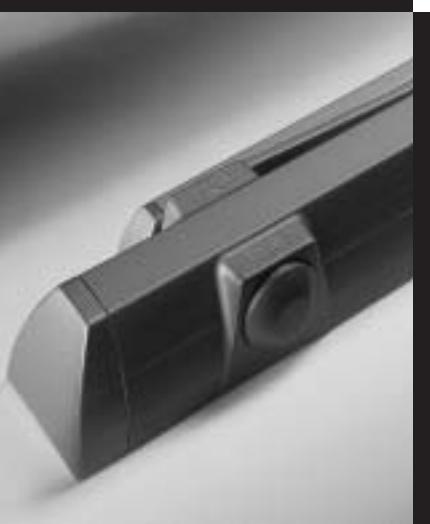

**Cam-action door closer**

# **DORMA TS90 Impulse**

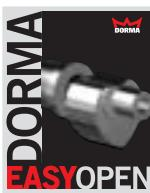

# **for the global market**

### **Benefits**

### **For the trade**

- 2 Unique DORMA cam action technology for the entry-level segment, compliant with EN 1154.
- 2 Complete package for easy stocking.
- 2 Sets new standards to open up new markets.

### **For the installer/fabricator**

- 2 Easy to fix without mounting backplate.
- 2 Non-handed.
- 2 Four installation arrangements with one model.
- 2 Proven DORMA quality for long service life.

**25**

**46**

### **For the architect/specifier**

- 2 Proven technology of the heart-shaped cam.
- 2 Cost-efficient slide channel door closer for interior doors.

### **For the user**

- 2 Convenient, low-resistance opening with fully controlled closing.
- 2 Two regulating valves for precise adjustment of closing speed.
- 2 Available with hold-open and cushioned limit stay options.

| High-tech                                                                                                                                                                                              |                                                                                                                                                                              | Data and features                  | TS 90 Impulse |      |
|--------------------------------------------------------------------------------------------------------------------------------------------------------------------------------------------------------|------------------------------------------------------------------------------------------------------------------------------------------------------------------------------|------------------------------------|---------------|------|
| for the global market                                                                                                                                                                                  |                                                                                                                                                                              | Closing force                      | Size          | EN 3 |
| The DORMA TS 90 Impulse combines technical superi ority with outstanding value, and unites advanced design with convenient functionality – all on the basis of its heart-shaped cam. | With its installation versati lity and inherent functional reliability, it is ideal for virtually any application. DORMA TS 90 Impulse: Certified to ISO 9001 | Standard doors1)                   | ≤ 950 mm      | 2    |
|                                                                                                                                                                                                        |                                                                                                                                                                              | External doors, outward opening1)  |               | –    |
|                                                                                                                                                                                                        |                                                                                                                                                                              | Fire and smoke check doors         |               | 2    |
|                                                                                                                                                                                                        |                                                                                                                                                                              | Non-handed                         |               | 2    |
|                                                                                                                                                                                                        |                                                                                                                                                                              | Arm assembly                       | Slide channel | 2    |
|                                                                                                                                                                                                        |                                                                                                                                                                              | Two independent valves for         | 160° – 15°    | 2    |
|                                                                                                                                                                                                        |                                                                                                                                                                              | closing speed adjustment           | 15° – 0°      |      |
|                                                                                                                                                                                                        |                                                                                                                                                                              | Cushioned limit stay (mechanical)  |               | §    |
|                                                                                                                                                                                                        |                                                                                                                                                                              | Delayed action                     |               | –    |
| Benefits                                                                                                                                                                                               |                                                                                                                                                                              | Hold-open                          |               | §    |
|                                                                                                                                                                                                        |                                                                                                                                                                              | Weight in kg                       |               | 1.7  |
| For the trade 2 Unique DORMA cam action technology for the entry-level segment, compliant with EN 1154.                                                                                    | For the architect/specifier 2 Proven technology of the heart-shaped cam. 2 Cost-efficient slide channel door closer for interior                                 | Dimensions in mm                   | Length        | 246  |
|                                                                                                                                                                                                        |                                                                                                                                                                              |                                    | Overall depth | 46   |
|                                                                                                                                                                                                        |                                                                                                                                                                              |                                    | Height        | 57   |
|                                                                                                                                                                                                        |                                                                                                                                                                              | Door closer compliant with EN 1154 |               | 2    |
| 2 Complete package for doors.                                                                                                                                                                       |                                                                                                                                                                              | mark for construction products     | 2             |      |

2 yes – no § option

1) In the case of particularly heavy doors and doors that have to close against wind pressure, we recommend the DORMA TS 93.

The DORMA TS 90 Impulse is CERTIFIRE approved (Certificate No. CF 119) for door types ITT 120.

**You will find all the information relating to the DORMA TS 90 Impulse on this CD-ROM. Order it online at www.dorma.com**

User-friendly and reliable closing is also ensured by the delayed increase in the actuating torque at the "latching" end of the sweep.

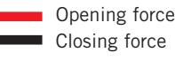

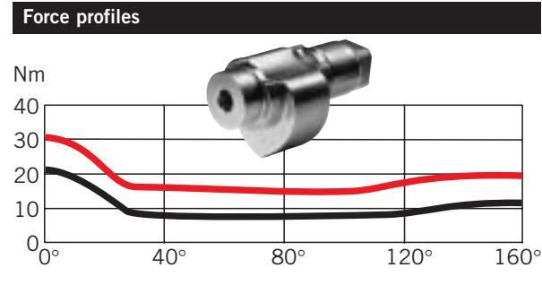

the linear drive mechanism of the DORMA TS 90 Impulse ensure that the resistance encountered decreases almost instantly with the door opening action – so even children, the elderly and people with disabilities have no problem in opening the door.

The heart-shaped cam and

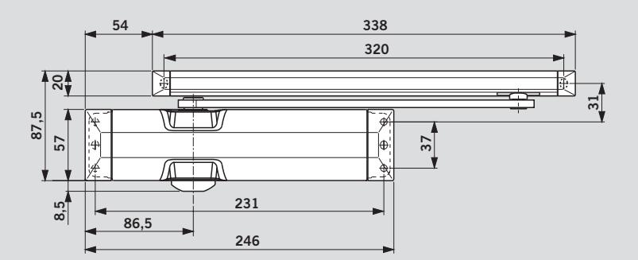

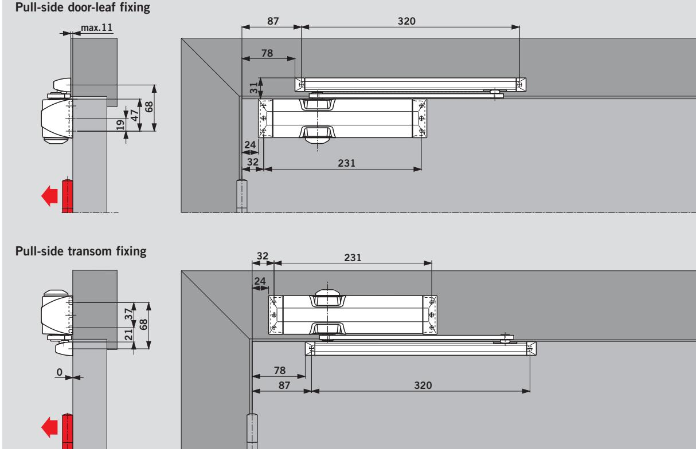

# **Pull-side fixing** (example: LH/ISO 6 door; mirror image for RH/ISO 5 door)

Closing action available from approx. 160°. It is recommended to install the cushioned limit stay or position a door stop at this point. **A door stop must be installed in the case of fire and smoke check doors.**

## **Push-side door-leaf fixing** (example: LH/ISO 6 door; mirror image for RH/ISO 5 door)

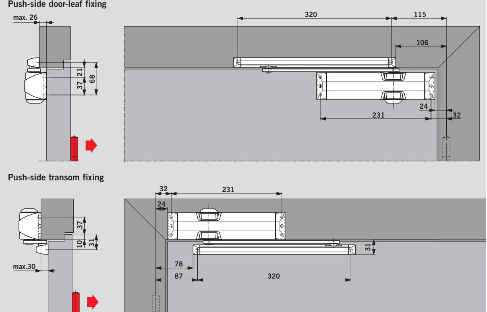

Depending on the structural conditions, the door opening angle is likely to be limited to approx. 95°. It is recommended to install the cushioned limit stay or position a door stop at this point.

### **Accessories**

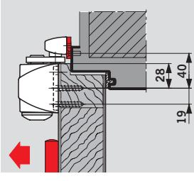

**Mounting backplate** For fixing the slide channel to the door frame where there is no means of direct mounting.

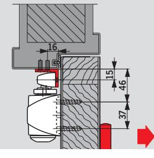

**Angle bracket** For push-side fixing of the slide channel to door frames with a deep reveal.

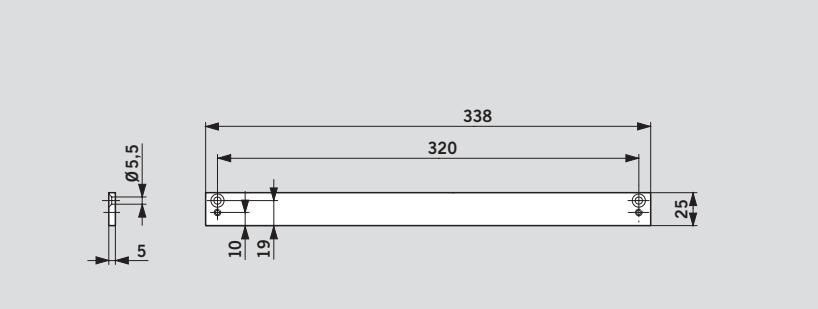

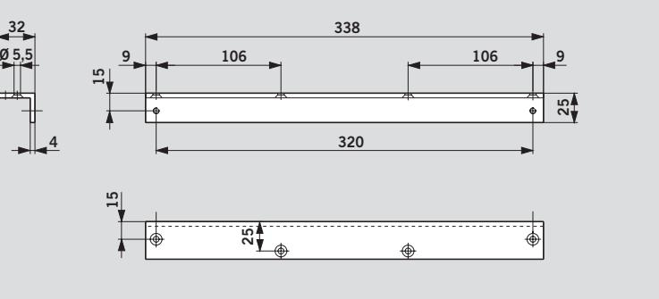

| Standard equipment and accessories |                                            |                       |               |                         |                                   |  |  |  |
|------------------------------------|--------------------------------------------|-----------------------|---------------|-------------------------|-----------------------------------|--|--|--|
|                                    | TS 90 Impulse cam-action door closer | Mounting backplate | Angle bracket | Cushioned limit stay | Mechanical hold-open device |  |  |  |
|                                    |                                            |                       |               |                         |                                   |  |  |  |
|                                    | Size EN 3                                  | 100026xx              | 100022xx      | 10002000                | 10002100                          |  |  |  |
| Slide channel                      | yY                                         | #                     | #             | #                       | #                                 |  |  |  |
|                                    | 102002xx                                   |                       |               |                         |                                   |  |  |  |
| Order No.:                         | Colour                                     | xx                    |               |                         |                                   |  |  |  |

| yY | = Closer body with | Silver                      | 01 |
|----|--------------------|-----------------------------|----|
|    | = arm, complete    | White (sim. to RAL 9016) 11 |    |
| #  | = Accessory        | Special colour              | 09 |

### **Specification text**

Universal cam-action door closer with linear drive and rapidly decreasing opening torque; closing speed adjustable in two independent ranges.

Closing force = Size EN 3. Non-handed. Compliant with EN 1154.

### **Accessories** Y Hold-open device Y Cushioned limit stay Y Mounting backplate

Y Angle bracket

### **Colour**

Y Silver Y White (sim. to RAL 9016) Y Special colour ––––– (sim. to RAL –––)

**Make** DORMA TS 90 Impulse

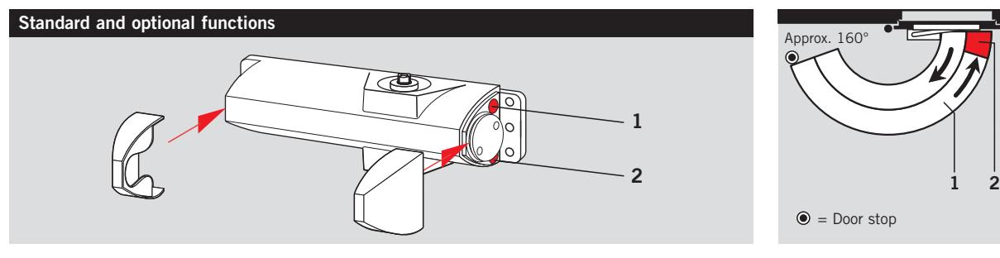

The **closing speed** of the DORMA TS 90 Impulse is adjustable in two independent ranges at the valves indicated.

With the DORMA TS 90 Impulse, the **closing force** is permanently set at EN 3.

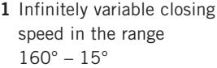

- **2** Infinitely variable closing speed in the range 15° – 0°
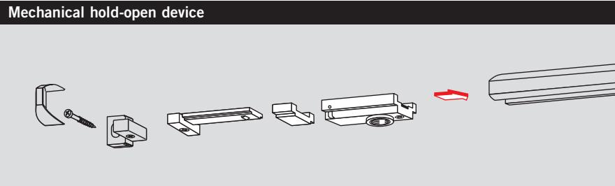

The hold-open device enables doors to be precisely held without any fall-back up to an opening angle of approx. 145°.

The hold-open device is suitable for both LH and RH doors and is designed for retrofitting to the slide channel.

**Not for fire and smoke doors.**

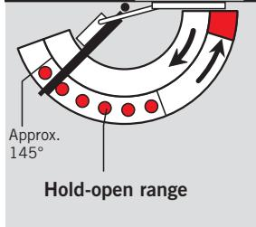

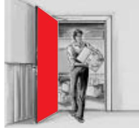

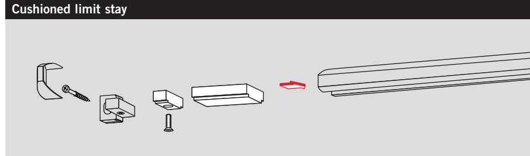

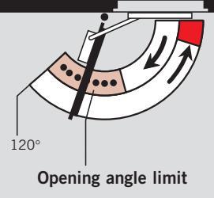

Cushioned limit stay for retrofitting by insertion in the slide channel. Adjustable between 80° and max. 120°.

Use of the cushioned limit stay helps to prevent a normally opened door from colliding with adjacent walls.

**The cushioned limit stay is not an overload protection device and in many cases is no substitute for a door stop.**

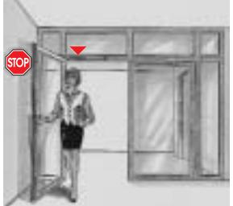

# **Division Door Control worldwide**

### **Central Europe**

DORMA GmbH + Co. KG Breckerfelder Str. 42–48 D-58256 Ennepetal Tel. +49 2333/793-0 Fax +49 2333/793-495

### **Australia**

**www.dorma.com**

**Door Control**

**Automatic**

**Glass Fittings and Accessories**

**Security/ Time and Access (STA)**

**Movable Walls**

DORMA Door Controls Pty. Ltd. 52 Abbott Road Hallam/Victoria 3803 Australia Tel. +61 3/97 96 35 55 Fax +61 3/97 96 39 55

### **Emerging Markets**

DORMA GmbH + Co. KG Breckerfelder Str. 42–48 D-58256 Ennepetal Tel. +49 23 33/7 93-0 Fax +49 23 33/793-495

DORMA Door Controls (Pty.) Ltd. Kings Court, 4A Mineral Crescent ZA-2000 Crown/Gauteng South Africa Tel. +27 11/8 30 02 80 Fax +27 11/8 30 02 91

### **Far East**

DORMA Door Controls Pte. Ltd. No. 2 Jalan Terusan, Jurong Singapore 619285 Tel. +65 6268/7633 Fax +65 6265/7914

DORMA Door Controls Pte. Ltd. Room 701, Technology Plaza 651 King's Road North Point Hong Kong Tel. +825/250 34632 Fax +825/288 75370

### **France**

DORMA France S.A.S. Europarc 42, rue Eugène Dupuis F-94046 Créteil Tel. +33 1/41 94 24 00 Fax +33 1/41 94 24 01

### **Gulf**

DORMA Gulf Door Controls FZE Jebel Ali Free Zone, Roundabout 8, Unit VC 02 Dubai, United Arab Emirates Tel. +971 48/83 90 14 Fax +971 48/83 90 15

### **North America**

DORMA Architectural Hardware DORMA Drive, Drawer AC Reamstown, PA 17567 Tel. +1-800-523-8483 Fax +1-800-274-9724

### **Scanbalt**

DORMA Danmark A/S Sindalvej 6 – 8 DK-2610 Rødovre Tel. +45 44/54 30 00 Fax +45 44/94 95 04

### **South America**

DORMA Sistemas de Controles para Portas Ltda. Av. Piracema, 1400 Centro Empresarial Tambore CEP 06400 Barueri/ São Paulo, Brasil Tel. +55 11/41 91 32 44 Fax +55 11/41 91 21 93

### **South-East Europe**

DORMA AUSTRIA GmbH Pebering Strass 22 A-5301 Eugendorf Tel. +43 62 25/2 84 88 Fax +43 62 25/2 84 91

### **South Europe**

DORMA Italiana S.r.l. Via. A. Canova 44/46 I-20035 Lissone (MI) Tel. +39 039/24 40 31 Fax +3 9 039/24 40 33 10

DORMA Ibérica, S.A. Camino San Martin de la Vega, 4 E-28500 Arganda del Rey (Madrid) Tel. +34 91/8 75 78 50 Fax +34 91/8 75 78 81

### **UK/Ireland**

DORMA UK Ltd. Door Controls Division Wilbury Way GB-Hitchin Hertfordshire SG4 0AB Tel. +44 14 62/4776 00 Fax +44 14 62/4776 01

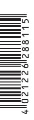

# WN 052 480 51532, 08/04, TS 90 Impulse, GB, x. DD. xx/04 · Subject to change without notice