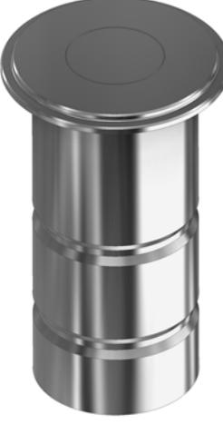
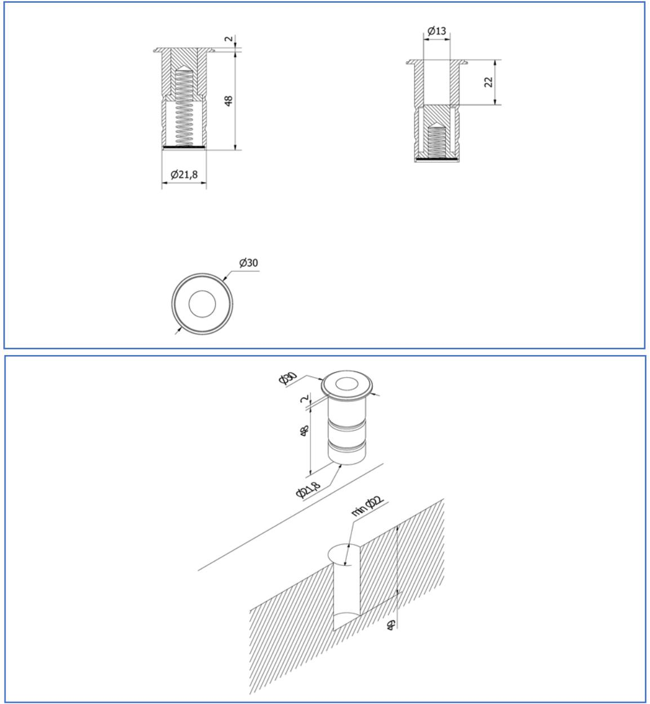

# **Skyddat golvbleck, runt OLDA FS R12**

## **Funktion:**

Används vanligtvis när kantreglar är monterade nedtill, för att förhindra att grus och smuts hindrar korrekt låsning av regeln.

## **Egenskaper:**

OLDA FS R12 har 22 mm slaglängd för starkare kantregellåsning och anpassning för automatiska tätningströsklar, med en fjädrande öppning Ø 13 mm, vilket passar för reglar mellan Ø 8 – 12 mm.

## **Användning:**

Rekommenderas för att säkra funktionen och öka livslängden hos reglar, särskilt vid dörrar med hög passagefrekvens.

Vanligtvis används skyddade golvbleck för att komplettera automatiska och manuella kantreglar. Men passar även andra typer av reglar, tex. spanjoletter eller regling av vikdörrar.

## **Montage:**

OLDA FS R12 limmas framför allt direkt i solida golv av klinker, marmor, sten och trä men även aluminium och stål, vilket ger en flexibel anpassning mot regeln.

Husets två yttre rillor möjliggör extra fast limning i golv och den täckta botten förhindrar att lim tränger in i huset och påverkar fjädern.

Ytterdiametern är 22 mm och totalhöjden är 50 mm. När produkten monterats blir synlig höjd endast 2 mm.

Vid skruvmontage av OLDA FS R12 i tex. trägolv, använd den speciellt utvecklade fästbrickan OLDA FS R30.

# **Specifikation:**

- Slaglängd: 22 mm
- Fjädrande öppning: Ø 13 mm o Passar regel Ø 8 – 12 mm
- Produkt:
	- o ytterdiameter: 22 mm
	- o höjd: 50 mm
	- o stolpe: Ø 30 x 2 mm
- Material:
	- o rostfritt stål
	- o rostfri fjäder

## **Översikt OLDA skyddade golvbleck:**

- FS 12 skyddat golvbleck
- FS 15 skyddat golvbleck
- FS R12 runt skyddat golvbleck
- FS R15 runt skyddat golvbleck
- FS R30 fästbricka till FS R12/R15

### **Service:**

Funktions- & systemtest rekommenderas en till två gånger per år. Testa och rengör rörliga delar vid behov.

Vid krävande miljöer eller hög passagefrekvens bör golvblecket testas oftare.

## **Garanti:**

Mekaniska produkter med varumärke "OLDA" har 36 månaders fabriksgaranti. ## **Skyddat golvbleck, runt OLDA FS R12**

## **Produktdokument:**

- Mått
- Montering

#### **Produktvyer – 2D:**

- PDF
- DXF
- DWG

### **Produktmodeller – 3D:**

- STEP
- DWG
- PDF 3D

### **OLDA produktlänkar:**

- Skyddat golvbleck FS R
- Behör kantreglar
- OLDA kantreglar
- OLDA beslagsskolan