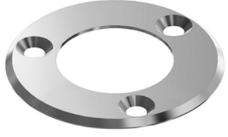
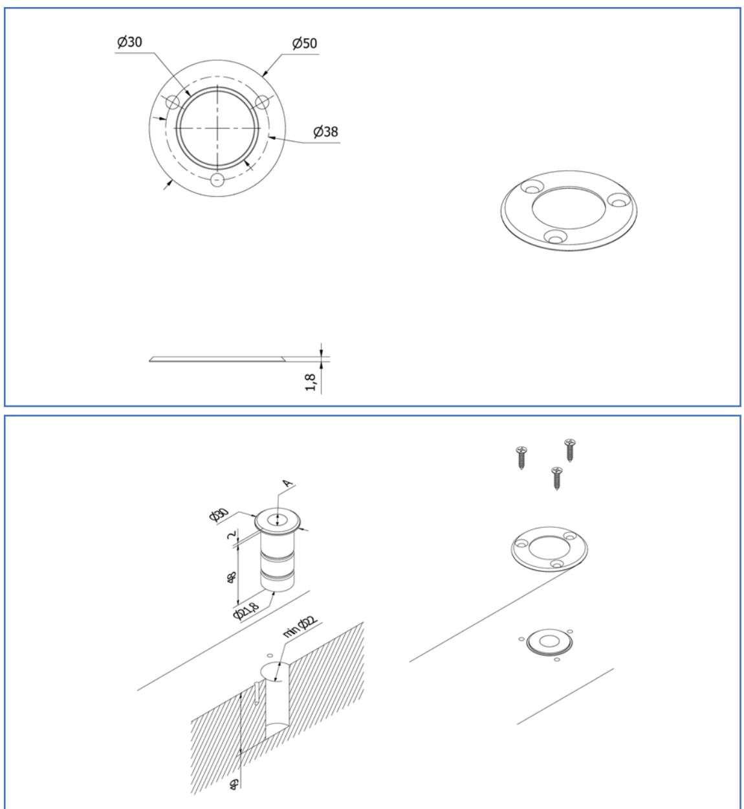

# **Fästbricka, FS R golvbleck OLDA FS R30**

## **Funktion:**

Speciellt utvecklad fästbricka för skruvmontage av de runda skyddade golvblecken OLDA FS R12 och R15.

### **Egenskaper:**

OLDA FS R30 har Ø 50 mm passar för skruvmontage direkt i solida trägolv eller trösklar.

### **Användning:**

Den rostfria brickan ger elegant och säkert montage med minimalt platsbehov, vilket kan vara speciellt viktigt vid montering direkt i golv tillsammans med exempelvis tröskellösa pardörrar.

### **Montage:**

OLDA FS R30 skruvar fast med tre försänkta 4 x 20 mm skruvar.

# **Specifikation:**

- Öppning: Ø 30 mm som passar:
	- o OLDA FS R12
	- o OLDA FS R15
- Produkt:
	- o ytterdiameter: 50 mm
	- o tjocklek: 2 mm
- Material: rostfritt stål

# **Översikt OLDA skyddade golvbleck:**

- FS 12 skyddat golvbleck
- FS 15 skyddat golvbleck
- FS R12 runt skyddat golvbleck
- FS R15 runt skyddat golvbleck
- FS R30 fästbricka till FS R12/R15

# **Service:**

Funktions- & systemtest rekommenderas av de skyddade golvblecken FS R12 och R15 en till två gånger per år. Testa och rengör det skyddade golvbleckets rörliga delar vid behov.

Vid krävande miljöer eller hög passagefrekvens bör golvblecket testas oftare.

# **Garanti:**

Mekaniska produkter med varumärke "OLDA" har 36 månaders fabriksgaranti.

# **Fästbricka, FS R golvbleck OLDA FS R30**

### **Produktdokument:**

- Mått
- Montering

#### **Produktvyer – 2D:**

- PDF
- DXF
- DWG

#### **Produktmodeller – 3D:**

- STEP
- DWG
- PDF 3D

#### **OLDA produktlänkar:**

- Skyddat golvbleck FS R
- Behör kantreglar
- OLDA kantreglar
- OLDA kantregelguide
- OLDA beslagsskolan