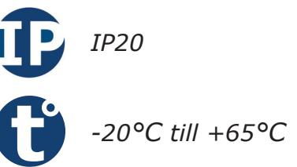
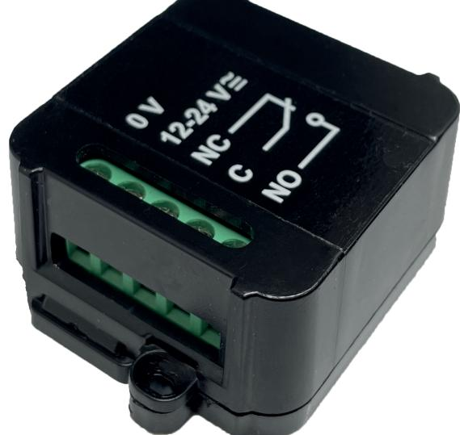
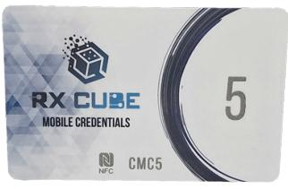
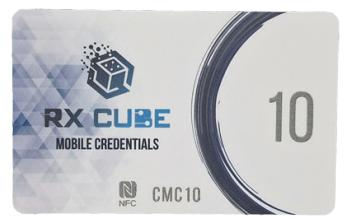
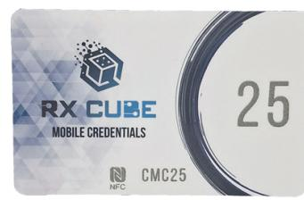

# **Produktblad**

# **Radiomottagare - SEL2641R433-RCP**

#### **Produktbeskrivning**

Radiomottagaren RXCube POWER en väldigt liten radiomottagare med en kraftig reläutgång. Reläet klarar högre belastningar än vanliga RXCube mottagaren och kan användas för att styra t.ex. magnetlås eller elslutbleck.

All programmering sköts i din RXCube app som finns att ladda ner kostnadsfritt i appstore eller google play.

Väldigt enkelt vid installationen, ännu enklare när kunden vill komplettera med fler fjärrkontroller.

Dessutom kan man döpa varje fjärrkontroll i appen vilket gör det väldigt smidigt att t.ex. ta bort en fjärrkontroll som tappats bort.

# **Funktioner**

- Nano-storlek
- Programmeras via app RXCube
- En reläutgång (1 NO/NC)
- Kan programmeras som puls, växlande och tid
- Lagrar upp till 250 sändare
- Möjlighet att namnge fjärrkontroller

*IK10*

## **Teknisk information**

**Utgångar:** En reläutgång (1 NO/NC) **Max belastning:** 6A vid 30Vdc **Funktioner:** Puls, växlande eller tid (1s-23t:59m) **Antal sändare:** 250 sändare **Antal UserCube:** 100 användare **LCD-display:** Nej **Programmering via app:** Ja **Inbyggt EEPROM-minne:** Ja **Ingång för extern antenn:** Nej **Känslighet:** -103dBm **Ingångsimpedans:** 50 Ohm **Frekvens:** 433.92 MHz **Radiotyp:** Superheterodyn **Kryptering:** KeeLoq® Hopping Code **Moduleringar:** AM/ASK **Kodkombinationer:** 264 **Dimensioner (L x B x H):** 44 x 58 x 25mm **Spänningsmatning:** 12 eller 24Vac/dc (auto) **Strömförbrukning:** 120mA **Kapslingsklass:** IP20 **Temperaturområde:** -20°C till +65°C

### **Tillbehör**

**CMC5** Licenskort 5 stycken UserCube användare

**CMC10** Licenskort 10 stycken UserCube användare

**CMC25** Licenskort 25 stycken UserCube användare

