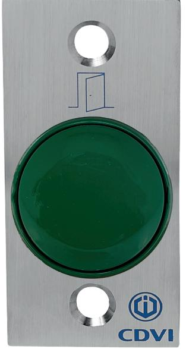
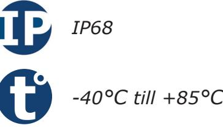
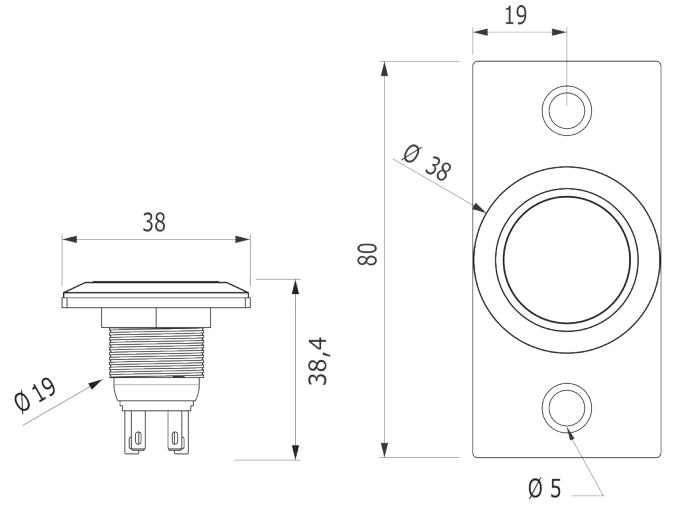
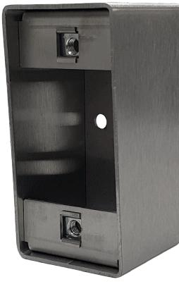

# **Produktblad**

# **Tryckknapp - BNONF CHOC CAB**

## **Produktbeskrivning**

Tryckknapp för infällt montage med extra stor tryckyta. Tryckknappen är vattentät och helt vandalsäker vilket gör att den passar bra både inomhus och utomhus, i privata miljöer såväl som i offentliga miljöer.

Den extra stora tryckytan för att tryckknappen är väldigt lätt att trycka på även om man har svagare händer.

Tryckknappen kopplas till ett passersystem eller direkt till ett lås, den har både funktion för rättvända och omvända lås.

Tryckknappen sitter monterad i en rostfri platta som kan monteras i karmen eller i våran rostfria kapsling.

## **Funktioner**

- Rättvänd och omvänd funktion i samma enhet
- Helt vattentät
- Vandalskyddad
- Extra stor tryckyta
- Finns i flera utföranden

*IK10*

#### **Teknisk information**

**Material:** Aluminium och rostfritt stål **Montering:** Infälld **Beröringsfri:** Nej **Bakgrundsbelysning:** Nej **Ljudindikering:** Nej **Utgångar:** Två utgångar (1 NO och 1 NC) **Max belastning:** 5A/12V **Mått (L x B x H ):** 80 x 38 x 38,4mm **Spänningsmatning:** n/a **Strömförbrukning:** n/a **Kapslingsklass:** IP68 **Temperaturområde:** -40°C till +85°C

#### **Tillbehör**

**CBP** Utanpåliggande rostfri kapsling

**SETMC1C9V** Trådlös radiosändare för inbyggnad - gör om en potentialfri slutning till en radiosignal

