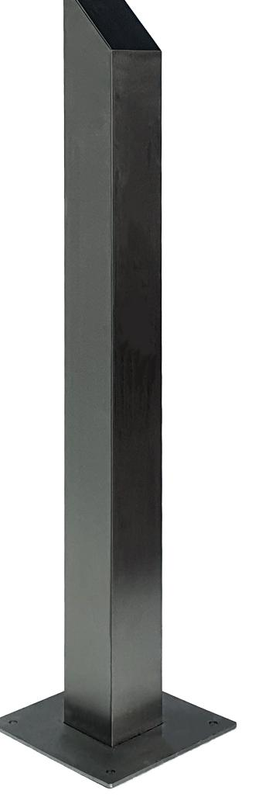
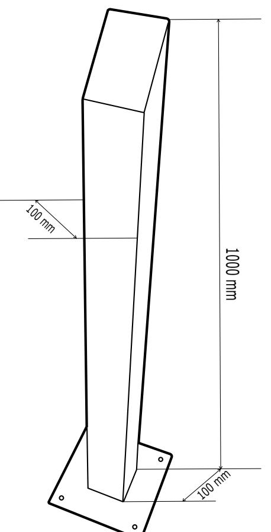
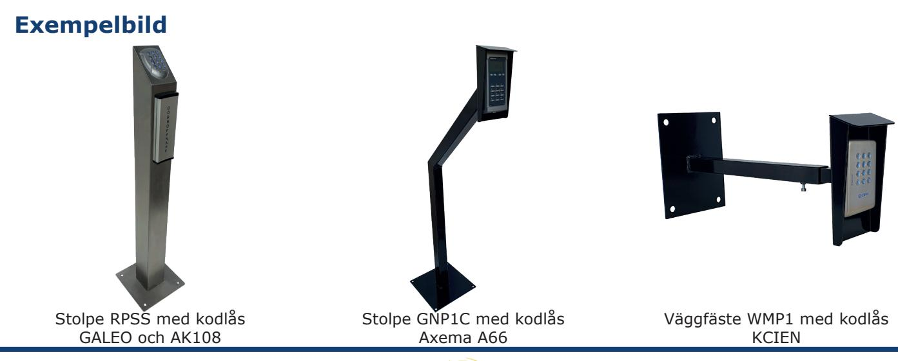

# **Produktblad**

## **Stolpe - RPSS**

#### **Produktbeskrivning**

Vi har ett brett utbud med olika modeller av stolpar i kraftig konstruktion för montering av porttelefon, kodlås eller andra typer av läsare, perfekt tillbehör vid automatisering av grindar och garage.

Fordonsstolpen är tillverkad i rostfritt stål med en väldigt hög finish, stolpen har en fyrkantig konstruktion men finns också med en rund konstruktion.

RPSS är avsedd för gångtrafikanter men vi har stolpar för bilar och lastbilar också.

### **Funktioner**

- Stolpe för fotgängare
- Tillverkad i rostfritt stål
- Fyrkantig stolpe
- Väldigt hög finish

*IK10*

#### **Teknisk information**

**Material:** Rostfritt stål **Ytbehandling:** Borstad **Väderskydd:** Nej **Höjd stolpe:** 1000mm **Bottenplatta: Mått:** 250 x 250mm  **Hålbild CC-mått:** 200 x 200mm  **Håldiameter:** Ø11,5mm

**Datavägen 12B 436 32 Askim**

**info@cdvi.se +46 (0)31-760 19 30 www.cdvi.se**