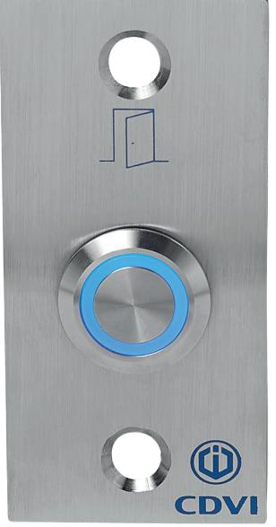
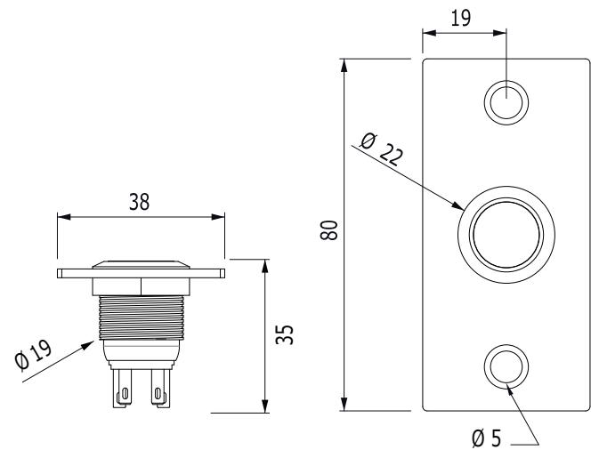
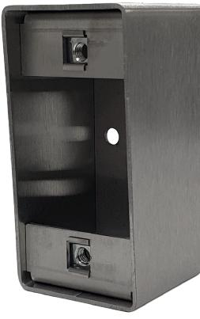
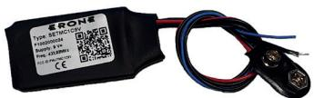

# **Produktblad**

## **Tryckknapp - BPNONF E24**

### **Produktbeskrivning**

Tryckknapp för infällt montage med blå bakgrundsbelyning. Tryckknappen är vattentät och helt vandalsäker vilket gör att den passar bra både inomhus och utomhus, i privata miljöer såväl som i offentliga miljöer.

Den blåa bakgrundsbelysningen gör att tryckknappen är lätta att hitta även om det är mörkt.

Tryckknappen kopplas till ett passersystem eller direkt till ett lås, den har både funktion för rättvända och omvända lås.

Tryckknappen sitter monterad i en rostfri platta som kan monteras i karmen eller i våran rostfria kapsling.

### **Funktioner**

- Rättvänd och omvänd funktion i samma enhet
- Helt vattentät
- Vandalskyddad
- Lätt att hitta i mörker
- Bakgrundsbelysning 24Vdc

*-40°C till +70°C*

*IK10*

*IP67*

#### **Teknisk information**

**Material:** Aluminium och rostfritt stål **Montering:** Infälld **Beröringsfri:** Nej **Bakgrundsbelysning:** Ja **Ljudindikering:** Nej **Utgångar:** En utgång (1 NO/NC) **Max belastning:** 2,5A/24V **Mått (L x B x H ):** 80 x 38 x 35mm **Spänningsmatning:** 24Vdc **Strömförbrukning:** n/a **Kapslingsklass:** IP67 **Temperaturområde:** -40°C till +70°C

#### **Tillbehör**

**CBP** Utanpåliggande rostfri kapsling

**SETMC1C9V** Trådlös radiosändare för inbyggnad - gör om en potentialfri slutning till en radiosignal

