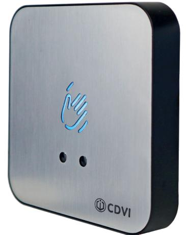
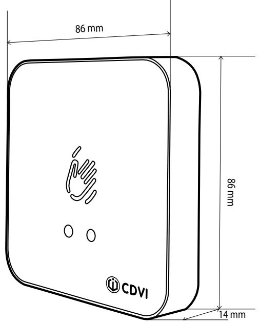
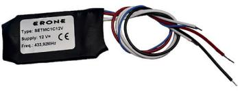

# **Produktblad**

## **Beröringsfri knapp - RTE-WIR**

### **Produktbeskrivning**

Beröringsfri öppnaknapp i modern design för utanpåliggande montage. Knappen är utrustad med IR-teknik och aktiveringsavstånden kan justeras mellan 3-15cm, vid standby lyser knappen blått och vid aktivering lyser knappen grönt.

Knappen har en utgång med en justerbar öppningstid från 0.1-30 sekunder.

Knappen kopplas till ett passersystem eller direkt till ett lås, den har både funktion för rättvända och omvända lås.

### **Funktioner**

- Modern design
- Aktiveras utan beröring, perfekt för att minska smittspridning i offentliga miljöer.
- Aktiveras på upp till 15cm avstånd
- Ställbar hålltid mellan 0.1-30s.
- Spänningsmatning 12 eller 24Vdc

*Luftfuktighet 0-95%*

*IK10*

#### **Teknisk information**

**Material:** Rostfritt stål med ABS kapsling **Montering:** Utanpåliggande **Beröringsfri:** Ja (3-15cm) **Bakgrundsbelysning:** Ja **Ljudindikering:** Nej **Utgångar:** En utgång (1 NO/NC) **Max belastning:** 2A vid 24Vdc **Mått (B x H x D ):** 86 x 86 x 14mm **Spänningsmatning:** 12 eller 24Vdc **Strömförbrukning:** n/a **Luftfuktighet:** 0-95% **Temperaturområde:** -20°C till +55°C

#### **Tillbehör**

**SETMC1C12V** Trådlös radiosändare för inbyggnad - gör om en potentialfri slutning till en radiosignal.

**1 0 WARRANTY YEAR**