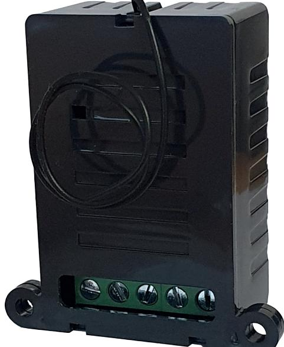
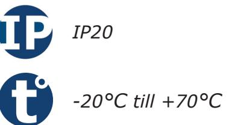
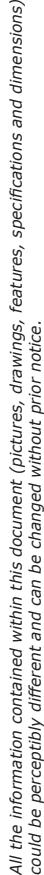
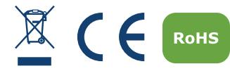
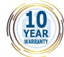
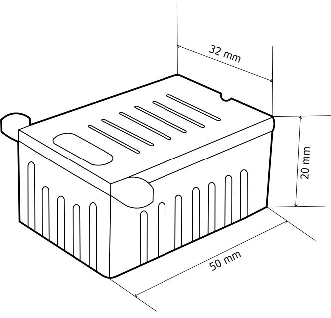
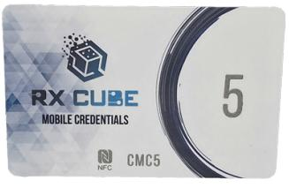
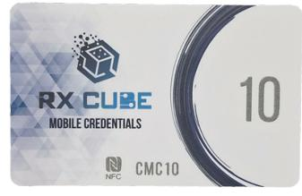
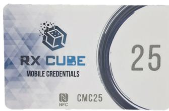
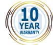

# **Produktblad**

# **Radiomottagare - SEL2641R433-RC**

#### **Produktbeskrivning**

Radiomottagaren RX Cube är väldigt liten vilket gör den smidig att bygga in i de flesta apparater, perfekt för att styra t.ex. hissar eller dörrautomatiker.

All programmering sköts i din RX Cube app som finns att ladda ner kostnadsfritt i appstore eller google play.

Väldigt enkelt vid installationen, ännu enklare när kunden vill komplettera med fler fjärrkontroller.

Dessutom kan man döpa varje fjärrkontroll i appen vilket gör det väldigt smidigt att t.ex. ta bort en fjärrkontroll som tappats bort.

## **Funktioner**

- Nano-storlek
- Programmeras via app RX Cube
- En reläutgång (1 NO/NC)
- Kan programmeras som puls, växlande och tid
- Lagrar upp till 250 sändare
- Möjlighet att namnge fjärrkontroller

*IK10*

#### **Teknisk information**

**Utgångar:** En reläutgång (1 NO/NC) **Max belastning:** 1A vid 24V **Funktioner:** Puls, växlande eller tid (1s-23t:59m) **Antal sändare:** 250 sändare **LCD-display:** Nej **Programmering via app:** Ja **Inbyggt EEPROM-minne:** Ja **Ingång för extern antenn:** Nej **Känslighet:** -103dBm **Ingångsimpedans:** 50 Ohm **Frekvens:** 433.92 MHz **Radiotyp:** Superheterodyn **Kryptering:** KeeLoq® Rolling Code **Moduleringar:** AM/ASK **Kodkombinationer:** 264 **Dimensioner (L x B x H):** 50 x 32 x 20mm **Spänningsmatning:** 12 eller 24Vac/dc (auto) **Strömförbrukning:** 60mA **Kapslingsklass:** IP20 **Temperaturområde:** -20°C till +70°C

## **Tillbehör**

**CMC5** Licenskort 5 stycken UserCube användare

**CMC10** Licenskort 10 stycken UserCube användare

**CMC25** Licenskort 25 stycken UserCube användare

