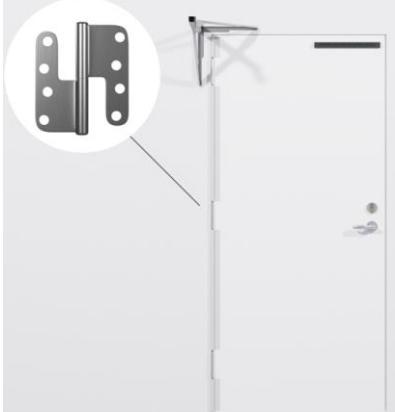

## Produktblad

## **KLÄMSKYDD TB GÅNGJÄRNSSIDA (Tappbärandegångjärn)**

- FLEXSTOP Klämskydd är ett fingerklämskydd som används för att förhindra klämolyckor i dörrar.
- Kan monteras på de flesta typer av dörrar; metall, aluminium och trädörrar.
- Lång livslängd och lågt underhåll Bara att torka rent.
- Enkel och snabb att installera.
- För gångjärnssida.
- Ingen åverkan på dörren/karmen.
- Finns som standard i grå, svart och vit.
- Standardlängden är 1950 mm. (Kapas mellan gångjärnen, skyddar över 2000 mm.)

## **Beskrivning:**

FLEXSTOP Klämskydd är ett skydd som förhindrar klämolyckor i bakkantdörr.

Täcker helt och hållet gapet som skapas på gångjärnsidan av dörren, i öppet läge och förhindrar klämolyckor.

Idealisk för dörrmiljöer med dörrautomatik såsom i flerbostad, vård & omsorg, skolor, förskolor och övriga dörrar som skapar klämrisk.

FLEXSTOP Klämskydd är utformad för att skapa den säkraste dörrmiljön och förebygga olyckor.

FLEXSTOP Klämskydd är återvinningsbar vid slutet av sin livslängd.

| Art nr:   | 400121, 400122, 400123 |
|-----------|------------------------|
| Färg:     | Grå, Svart, Vit        |
| Material: | Plast                  |
| Höjd:     | 1950 mm                |
| Bredd:    | 51 mm                  |
| Tjocklek: | 1,5 mm                 |
| Vikt:     | 0,4 KG                 |
| Enhet:    | Styck                  |

______________________________________________________________________________________________________________________________________________________