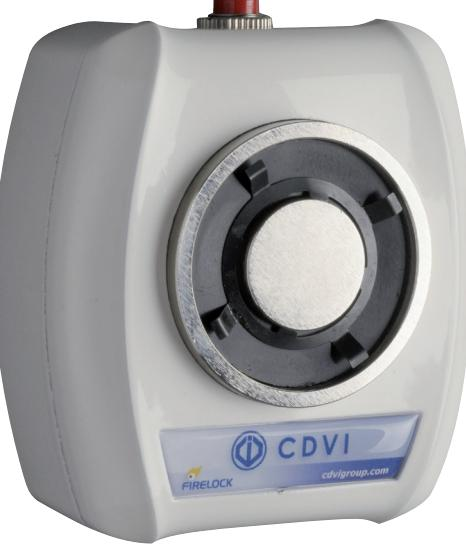
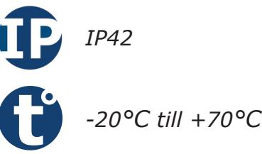
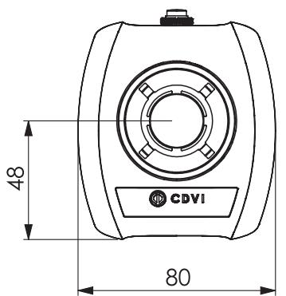
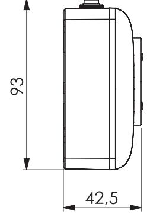
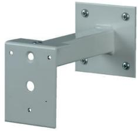
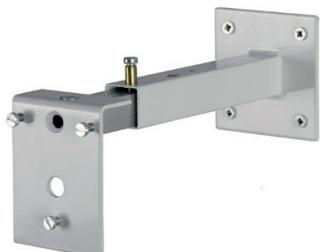
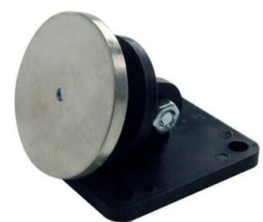

# **Produktblad**

## **Dörrhållarmagnet - VIRA5024**

#### **Produktbeskrivning**

Väggmonterad dörrhållarmagnet i snygg och diskret design, dörrhållarmagneten har en hållkraft på 50kg och drivs av en 24Vdc spänningsmatning.

Dörrhållarmagneten är perfekt till dörrar i t.ex. kontorsmiljöer, skolor och industrier där det finns krav på att dörren skall stängas i syfte att minska brandspridningen.

Dörrhållarmagneten kopplas till ett brandövervakande system som bryter strömmen till magneten vid larm.

Dörrhållarmagneten finns i flera utföranden med olika spänningsmatningar och hållkrafter. Tack vara våra monteringsprofiler kan dörrhållarmagneten monteras på alla dörrar.

### **Funktioner**

- Hållkraft: 50kg
- Spänningsmatning: 24Vdc
- Inbyggd testknapp
- Universal ankarplatta ingår
- CE EN1155 Certifierad

*IK10*

#### **Teknisk information**

**Material:** Gjutaluminium **Montering:** Utanpåliggande, vägg **Hållkraft:** 50kg **Indikering:** Ja **Funktion:** Omvänd funktion **Inbyggd varistor:** Ja **Dimensioner ( L x B x H ):** Elektromagnet: 93 x 80 x 42,5mm Ankarplatta: 60 x 60 x 52mm **Spänningsmatning:** 24Vdc **Strömförbrukning:** 80mA @ 24Vdc **Kapslingsklass:** IP42 **Temperaturområde:** -20°C till +70°C

### **Monteringstillbehör**

**SUPVR** Konsol till VIRA-magneter, 150mm

**SUPVRREG** Konsol till VIRA-magneter, 150-300mm

**CPART** Ankarplatta till dörrhållarmagneter (ingår)

