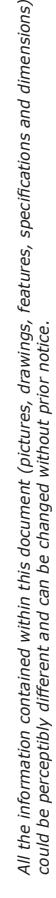
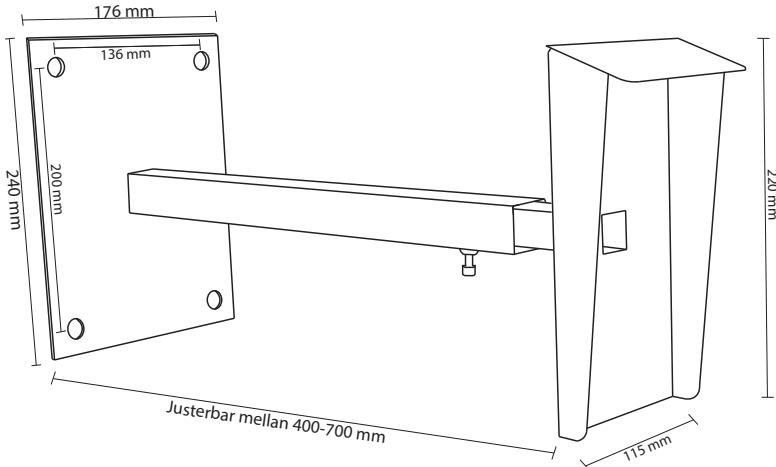
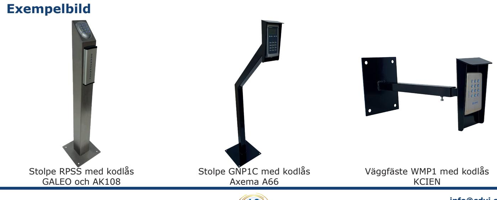

# **Produktblad**

## **Väggfäste - WMP1**

### **Produktbeskrivning**

Justerbart väggfäste för montering av porttelefon, kodlås eller andra typer av läsare, perfekt tillbehör vid automatisering av grindar och garage, väggfästet är försedd med ett väderskydd för att skydda knappsatsen.

Väggfästet är tillverkat i stål och är pulverlackad med en svart härdad färg.

WMP1 är till för att flytta ut en knappsats eller läsare från än vägg och är steglöst justerbar mellan 400mm och 700mm.

Vid montering rekommenderar vi att man använder loctite eller liknande på justerskruven, för att förhindra vandalism.

#### **Funktioner**

- Justerbart väggfäste
- Svartlackerad
- Justerbar mellan 400-700mm
- Väderskydd

*-25°C till +70°C*

*IK10*

*IP64*

#### **Teknisk information**

**Material:** Stål **Ytbehandling:** Svart lackering **Väderskydd:** Ja **Längd justering:** 400-700mm **Mått väderskydd (H x B):** 220 x 115mm **Bottenplatta: Mått:** 240 x 176mm  **Hålbild CC-mått:** 200 x 136mm  **Håldiameter:** Ø13,5mm

**Datavägen 12B 436 32 Askim**

**info@cdvi.se +46 (0)31-760 19 30 www.cdvi.se**