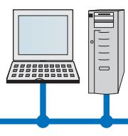
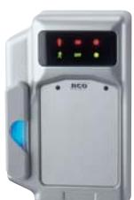
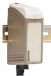

# PRODUKTDATA

# 16.1 Centralutrustning

## **R-CARD M5**

#### Användning

Programmet används för adminis tration av R-CARD 5000 passersystem. Applika tions programvaran R-CARD M5 består av M5 Client och M5 Server med en SQL data-

bas som körs på PC med Windows. Samtliga program kan installeras i samma PC eller på fler PC:ar.

**R-CARD M5 Server** hanterar kommunikation med under centraler genom serieportar och/eller nätverks kort.

**R-CARD M5 Client** användes av operatörer för programmering.

#### Installation programvara

Programvaran installeras på PC från CD med R-CARD M5. PC:n förutsätts uppfylla prestanda kraven enligt specifikation. Före registrering fungerar programmet med begränsningen max 10 kort (användare). M5 Client kan installeras på samma PC som M5 Server och/eller andra PC:ar i nätverk.

| Operativsystem:                                                            | MS Windows™ 2000, XP, 2003                                                                                        |  |
|----------------------------------------------------------------------------|-------------------------------------------------------------------------------------------------------------------|--|
| Nätverk:                                                                   | Ethernet 10/100 Base-T, TCP/IP, DCOM                                                                              |  |
| PC krav minimum:                                                           | Pentium 3, 800 MHz, 512 MB* RAM, 1 GB HD, CD-läsare, serieport(ar) för anknytningar med modem och Reader-20 |  |
| Kapacitet                                                                  |                                                                                                                   |  |
| Kodbärare/ID:                                                              | 90 000                                                                                                            |  |
| Läsare/terminaler:                                                         | 65 000                                                                                                            |  |
| Behörighetsgrupper: 12 400                                                 |                                                                                                                   |  |
| Operativsystem:                                                            | Specifikation databas MS SQL 2000 MSDE MS Windows™ 2000, XP, 2003                                              |  |
|                                                                            |                                                                                                                   |  |
|                                                                            | Ethernet 10/100 Base-T, TCP/IP, DCOM                                                                              |  |
|                                                                            | Pentium 3, 800 MHz, 1 GB* RAM, 2 GB HD, CD-läsare                                                              |  |
|                                                                            | 1-5 (fler med MS SQL fullversion)                                                                                 |  |
| Nätverk: PC krav minimum: Klientlicenser: Specifikation M5 Client |                                                                                                                   |  |
|                                                                            | MS Windows™ 2000, XP, 2003                                                                                        |  |
| Operativsystem: Nätverk:                                                | Ethernet 10/100 Base-T, TCP/IP, DCOM                                                                              |  |

**Reservation för framtida versioner och operativsystem*

### **READER-20**

#### Användning

Reader-20 används för avläsning av kort eller nyckelbricka vid programmering av användare vid arbetsstation (klient). Utförande i gjuten metall (ej PROX-22).

#### Montage

Reader-20 placeras på bordskiva jämte PC. Alla kablar kopplas in med jackbara kontakt (RS-232)/skruvplint. Ström försörjning tas genom medlevererad nät adapter.

| Kommunikation             |                               |
|---------------------------|-------------------------------|
| PC:                       | RS-232, max 5 m               |
| UC-50:                    | Systembuss (CAN), max 1000 m  |
| Reader-30:                | Magstripe, 1-Wire®, Wiegand   |
| Lästekniker               |                               |
| MAG-20 (magnetrand):      | ISO 7811, ABA spår 2          |
| DAL-20 (Dallas iButton®): | DS1990A                       |
| SMART-20 (SmartCard):     | ISO 7816, SLE 4404            |
| PROX-22 (prox):           | 125 kHz, EM 4102              |
| MIF-22:                   | 13,56 mHz, Mifare®            |
| Strömförsörjning          |                               |
| Matningspänning:          | 5 VDC / 240 VAC (adapter)     |
| Strömförbrukning:         | 70 mA @ 5 VDC                 |
| Temperaturområde          |                               |
|                           | +5ºC till +60ºC               |
| Dimensioner               |                               |
| Kapsling BxHxD:           | 89x144x36 mm, (76x124x23 mm)* |
| *PROX-22 och MIF-22       |                               |
|                           |                               |

# PRODUKTDATA

## 16.1 Centralutrustning

### **MODEM**

#### Användning

Modem används för kommunikation mel lan PC server och en eller flera UC-50 när dessa ej kan nås via systembuss eller LAN. Modem kan vara av olika typ som upprin -

gande för publikt telenät, fast uppkopplad på förhyrd ledning, korthåll för eget (tele)kabelnät eller anslutningsutrustning för fibernät, GSM/GPRS, radiolänk och andra länkar för dataöverföring mha utrustning som ansluter till RS-232 och i övrigt uppfyller de tekniska kraven.

#### Montage

På serversidan placeras modem i lämplig närhet av PC med M5 Server och på fjärrsidan vid (första) UC-50 som då ska vara försedd med RS-50 (serieport).

| Kommunikation      |                 |  |
|--------------------|-----------------|--|
| PC server:         | RS-232, max 5 m |  |
| UC-50 (med RS-50): | RS-232, max 5 m |  |