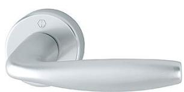
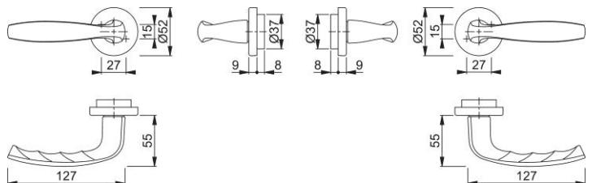

## Produktdatablad New York 1810/42FI

HOPPE-handtagsset i aluminium utan nyckelskylt för ytterdörr:

- Lagring: lösa handtag, returfjäder höger/vänster vändbar, underhållsfria glidlager
- Fastsättning: HOPPE Kvick-i-Sprint
- Underdel: plast
- Montering: dold, genomgående, passar bägge sidor, självborrande skruvar

| Artikelnummer               | H11880831                     |
|-----------------------------|-------------------------------|
| EAN-kod                     | 4012789976724                 |
| Ursprungsland               | Tyskland                      |
| Tariffnummer på pro dukt | 83024110                      |
| Dörrtjocklek                | 37 - 95 mm                    |
| Sprintmått                  | 8 mm                          |
| Skruvar                     | 2 st 4,0 x 95 mm              |
| Färg                        | F1 Aluminium silver färgad |
| Sortiment                   | kompletterande pro dukt    |
| Förpackningsenhet           | 20                            |
| Kartong                     | 20                            |