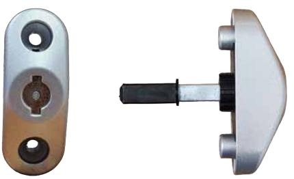
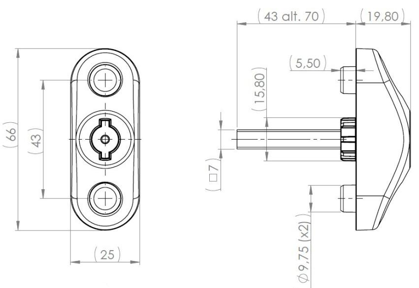

## Produktdatablad

## Säkerhetsanordning BK805-2

Artikelnummer: BK805-2 EAN-Kod: Ej färdig än Ursprungsland: Sverige Färg: Mattgrå/Silver

Säkerhetsanordning BK805-2 tillämpas som ett alternativ till handtag på fönster, fönsterdörrar och skåpdörrar som är utrustade med spanjolett, där barnsäkerhet eller förhindrande av obehörig tillgång krävs.

Detta är särskilt lämpligt i miljöer som trapphus, korridorer, sjukhus, barnomsorgscenter, och mer. Finns med 7x43 och 7x70 mm kapbar sprint 7/8 hylsa medföljer

Funktioner:

En fjäderbelastad spärrbricka omgärdar öppningen.

Denna spärrbricka måste pressas in till ett bestämt position innan tappen kan roteras för att påverka spanjoletten.

Material

Spärrhuset är tillverkat av pulverlackat zamakmetall.

