# Produktkatalog

 Intelligenta lösningar för små och medelstora företag

# Nyckellös teknik är framtiden – och ett smart beslut både för säkerhet, ekonomi och handhavande.

För bilar är det sedan länge standard att öppna och låsa med elektroniska nycklar. Med MobileKey från SimonsVoss kan du nu göra på samma sätt med vanliga dörrar.

Denna innovativa tekniska lösningen har utvecklats speciellt för små och medelstora företag. I Mobilekey systemet ersätts de traditionella mekaniska cylindrarna med SimonsVoss MobileKey digitala cylindrar som du enkelt kan installera själv – utan att behöva borra eller dra några kablar, och dina mekaniska nycklar ersätts av en transponder, pinkodknappsats eller din mobiltelefon, dator eller surfplatta.

Systemet konfigueras och styrs via vår kostnadsfria Webapp och du kan dela ut digitala tidsbegränsade nycklar via appen Key4friends.

En smidig och smart helhetslösning för upp till 20 dörrar och 100 användare – MobileKey kombinerar låg inköpskostnad utan månadsavgifter, med enkelt handhavande och genomtänkta funktioner.

MobileKey är den senaste revolutionerande produkten från SimonsVoss. Münchenbaserade SimonsVoss är den ledande tillverkaren av elektroniksa lås- och passersystem.

Digitala transpondrar och dörrcylindrar istället för mekaniska nycklar och lås. Framtidens låssystem på din dörr.

# Med MobileKey krävs bara några musklick för perfekt passerkontroll.

## 01. Webbapp

MobileKey installeras och hanteras via en webbapp. Appen kan användas på alla enheter med internetuppkoppling, som datorer, surfplattor, eller Mobiltelefoner. Med några få klick kan du fastställa vilka personer som har vilka behörigheter. Det går lekande lätt och ändringar kan genomföras när som helst.

### 02. SimonsVoss-server

Uppgifterna från appen överförs till SimonsVoss-servern där de sparas i form av ett låsschema och skickas tillbaka till appen. Automatiskt – utan att du behöver lyfta ett finger.

### 03. Grundversion

Med hjälp av programmeringsenheten överför du uppgifterna till din transponder och låskomponenterna. Ditt system är nu driftklart.

## 04. Tillval: Utökning online

I onlineversionen är dina nätverksuppkopplade låskomponenter direkt anslutna till servern via SmartBridge. Därmed kan systeminställningar och ändringar i behörighet genomföras så gott som i realtid. Full kontroll – överallt och alltid.

### 05. Fjärrnyckel som ID-medium

Lås upp utan mekanisk nyckel – med transponder, pinkodsknappsats, dator, surfplatta eller mobiltelefon. Så enkelt är det idag att byta till digitala lås.

## 06. Låskomponenter

En trådlös nyckel skickar de lagrade, individuella behörigheterna med en knapptryckning till den digitala cylindern eller till ett speciellt relä. Om behörigheten är giltig öppnas dörren eller porten.

## Säkerhet har högsta prioritet

Dina uppgifter ligger i en säker SimonsVoss-server i München i Tyskland. Du behöver inte tänka på datasäkerhet eller datahantering, eftersom vi sköter allt detta åt dig – på högsta nivå!

# Mer information: www.my-mobilekey.com

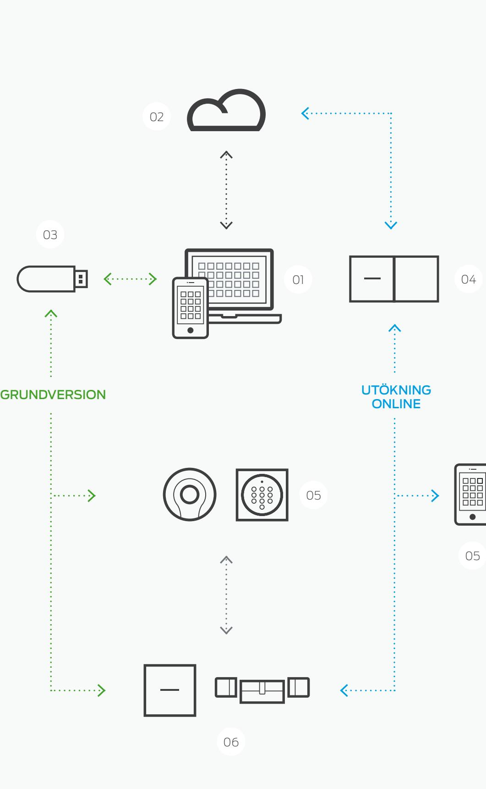

# Transpondrar MobileKey

Transpondern fungerar som en elektronisk nyckeln i MobileKey-systemet Utrustad med ett högeektivt batteri kan transpondern genomföra 400 000 låsningar och upplåsningar Den digitala "nyckel" kommunicerar med den elektroniska låscylinderns trådlöst. Denna kommer endast att aktiveras om behörigheten är giltig. Om transpondern tappas bort kan den genast spärras – och en ny kan konfigureras med ett par musklick.

## Tekniska specifikationer

- :: Ytterhölje i svart polyamid
- :: Mått: 42 x 13,7 mm (Ø x H)
- :: Skyddsklass: IP 65
- :: Normalt läsavstånd: upp till 40 cm från låscylindern
- :: Batterityp: 1 x CR2032, 3 V, litium :: Batteriets livslängd:
- upp till 400 000 aktiveringar eller upp till tio års standby
- :: Temperaturområde: -25 °C till +65 °C
- :: Miljöklass: III
- :: För upp till 4 låssystem MobileKey eller System 3060 (G2)

Ø 42

13,7

Mått anges i mm

Öppna dina dörrar med en 4- till 8-sirig kod. Den platta och SmartRelä.

IP65 klassade pinkodsknappsatsen installeras utan kablar inom- eller utomhus och vid behov även på glas. Pinkodsknappsatsen kan kopplas till både våra diigitala cylindrar

Tekniska specifikationer

| :: Silverfärgat ytterhölje i ABS-plast |  |
|----------------------------------------|--|
|                                        |  |

| Beskrivning                                                                         | Best.kod       | Beskrivning                | Best.kod       |
|-------------------------------------------------------------------------------------|----------------|----------------------------|----------------|
| Transponder MobileKey med blå knapp                                                 | MK.TRA2.G2     | Pinkodsknappsats MobileKey | MK.TRA.PINCODE |
| Kopplingstransponder med 2 anslutningstrådar för aktivering via en isolerad kontakt | TRA2.G2.SCHALT |                            |                |

- :: Mått: 96 x 95,7 x 14 mm (H x B x D)
- :: Vikt: ca 100 g inkl. batterier
- :: Skyddsklass: IP 65
- :: Normal läsavstånd: upp till 40 cm från låscylindern /SmartHandle; upp till 120 cm från SmartRelä
- :: Batterityp: 2 x CR2032, 3 V, litium

# Pinkodsknappsats MobileKey

Mått anges i mm

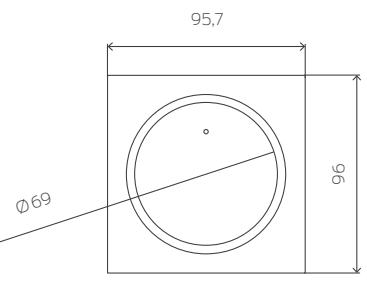

- :: Batteriets livslängd: upp till 100 000 aktiveringar eller
- upp till tio års standby
- :: Batterivarningssystem i två steg
- :: Temperaturområde: -25 °C till +65 °C
- :: Manipuleringslarm
- :: Antal knappsatsanvändare: 3 olika pinkoder
- :: Kabellös utanpåliggande montering

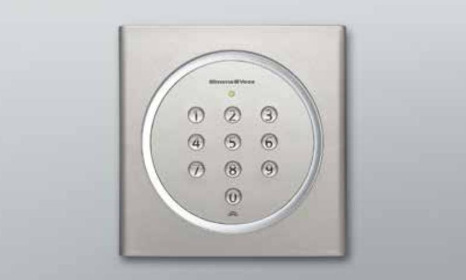

# Digital Europaprofil Dubbelknoppscylinder MobileKey

Låscylindern – ditt digitala lås. Snabb, kabellös installation utan borrning och med en snygg design: multitalangen för ett brett användningsområde.

## Tekniska specifikationer

- :: Standard Europaprofilcylinder enligt DIN 18252 / EN 1303 / DIN EN 15684, design i rostfritt stål, fritt roterande på båda sidorna
- :: Knoppdiameter: 30 mm
- :: Grundläggade installationslängd: 30–30 mm (ytter-/innermått)
- :: Total längd: upp till max 140 mm (max 90 mm på ena sidan), utan extra kostnad

Mått anges i mm

- :: Skyddsklass: IP 54; väderskyddad version: IP 66
- :: Batterityp: 2 x litium, CR2450, 3 V
- :: Batteriets livslängd: upp till 300 000 låsningar
- eller upp till tio års standby :: Temperaturområde: Drift: -25 °C till +65 °C
- Förvaring: -35 °C till +50 °C
- :: 500 tillträden kan loggas

## Produktversioner Best.kod

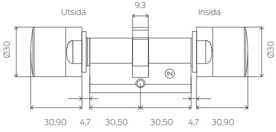

| Digital Europaprofil dubbelknoppscylinder MobileKey – FD fritt roterande på båda sidorna, med passerkontroll, tidszonsstyrning och loggning; design i rostfritt stål                                                                                                          | MK.Z4.ee-ii.FD.FH.ZK.G2       |  |
|-------------------------------------------------------------------------------------------------------------------------------------------------------------------------------------------------------------------------------------------------------------------------------------|-------------------------------|--|
| Version med integrerad LockNode för nätverksuppkoppling                                                                                                                                                                                                                             | MK.Z4.ee-ii.FD.FH.LN.ZK.G2    |  |
| Tillhållarlåsversion för användning på dörrar med flerpunktslås; installationslängd 35 – 30 mm eller mer                                                                                                                                                                         | MK.Z4.ee-ii.FD.MR.FH.ZK.G2    |  |
| Version med integrerad LockNode för nätverksuppkoppling                                                                                                                                                                                                                             | MK.Z4.ee-ii.FD.MR.FH.LN.ZK.G2 |  |
| Väderskyddad version, skyddsklass: IP 66; installationslängd 30 – 35 mm eller mer                                                                                                                                                                                                | MK.Z4.ee-ii.FD.WP.FH.ZK.G2    |  |
| Version med integrerad LockNode för nätverksuppkoppling                                                                                                                                                                                                                             | MK.Z4.ee-ii.FD.WP.FH.LN.ZK.G2 |  |
| Digital Europaprofil dubbelknoppscylinder MobileKey – DoorMonitoring kompakt dörrövervakning; installationslängd 30 – 35 mm eller mer; fritt roterande på båda sidorna, integrerad LockNode för nätverksuppkoppling, med passerkontroll, tidszonsstyrning och händelselogg | MK.Z4.ee-ii.DM.FD.FH.ZK.G2    |  |

Intelligent fästskruv med sensorer för användning med DoorMonitoring Z4.DM.xx.SCREW cylinder. Du måste känna till dornmåttet för beställning av fästskruv. Finns i steg om 5 mm, från 25 mm till max 70 mm.

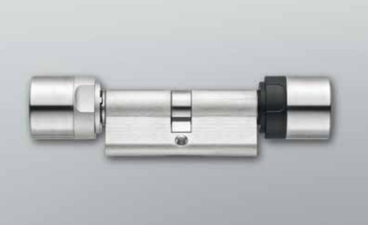

# Mät och välj rätt låscylinder.

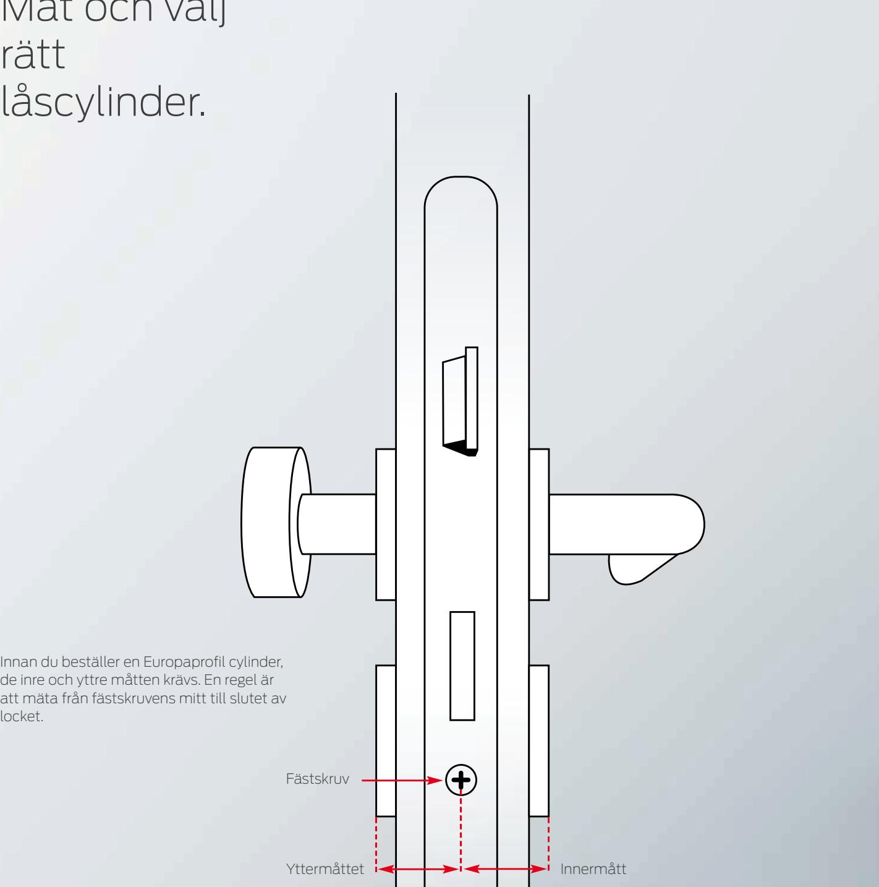

locket.

Cylindrarna finns i längdsteg om 5 mm, till exempel 35 eller 40 mm. Cylinderhuset ska sluta så tätt som möjligt. Om du till exempel mäter en extern längd på 38 mm, ska du beställa en låscylinder med en ytterlängd på 40 mm.

Om yttermåttet är 40 mm och innermåttet 35 mm, är dessa mått en del av beställningskoden: MK.Z4.40-35.FD.FH.ZK.G2.

# Digital Europaprofil Dubbelknopp Cylinder MobileKey – knappstyrning

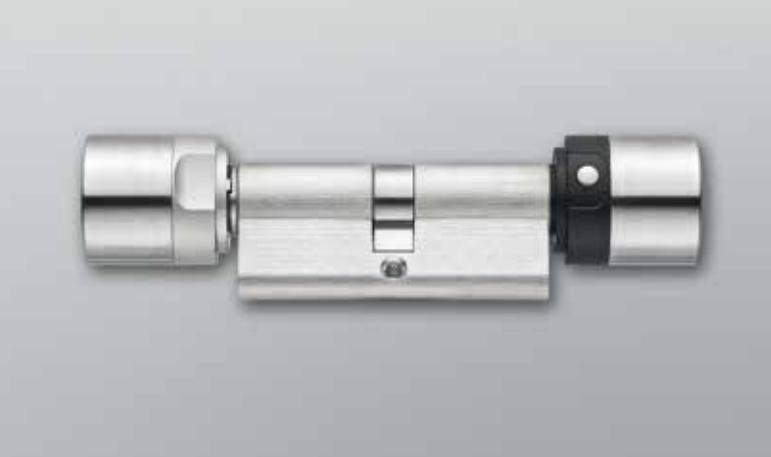

Samma som standardcylinder men med extra knappstyrning så att öppning kan ske från insidan utan transponder. Lämpar sig särskilt för ytter- och entrédörrar.

Tekniska specifikationer

| utan extra kostnad    |
|-----------------------|
| :: Skyddsklass: IP 54 |

- :: Standard Europaprofilcylinder enligt DIN 18252/EN 1303/ DIN EN 15684
- :: Knoppdiameter: 30 mm
- :: Grundläggande installationslängd: 30–30 mm (ytter-/innermått)
- :: Total längd: upp till max 140 mm (max 90 mm på ena sidan), utan extra kostnad
- :: Temperaturområde: Drift: -25 °C till +65 °C Förvaring: -35 °C till +50 °C
	- :: 500 tillträden kan loggas

Mått anges i mm

:: Batterityp: 2 x litium, CR2450, 3 V

:: Batteriets livslängd: upp till 300 000 låsningar

eller upp till tio års standby

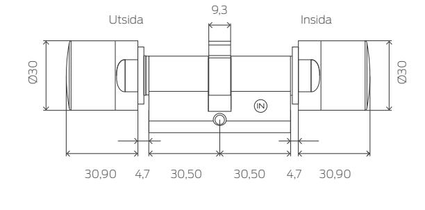

| Produktversioner                                                                                                                                                                                                                                                                                     | Best.kod                         |
|------------------------------------------------------------------------------------------------------------------------------------------------------------------------------------------------------------------------------------------------------------------------------------------------------|----------------------------------|
| Digital Europaprofil dubbelknoppscylinder MobileKey – Knappstyrning fritt roterande på båda sidorna, kan betjänas från insidan utan transponder, design i rostfritt stål                                                                                                                       | MK.Z4.ee-ii.FD.TS.FH.ZK.G2       |
| Version med integrerad LockNode för nätverksuppkoppling                                                                                                                                                                                                                                              | MK.Z4.ee-ii.FD.TS.FH.LN.ZK.G2    |
| Tillhållarlåsversion för användning på dörrar med flerpunktslås; installationslängd 35–30 mm eller mer                                                                                                                                                                                            | MK.Z4.ee-ii.FD.TS.MR.FH.ZK.G2    |
| Version med integrerad LockNode för nätverksuppkoppling                                                                                                                                                                                                                                              | MK.Z4.ee-ii.FD.TS.MR.FH.LN.ZK.G2 |
| Digital Europaprofil dubbelknoppscylinder MobileKey – DoorMonitoring kompakt dörrövervakning, med knappstyrning, installationslängd 30–35 mm eller mer, fritt roterande på båda sidorna, integrerad LockNode för nätverksuppkoppling, med passerkontroll, tidszonsstyrning och händelselogg | MK.Z4.ee-ii.DM.FD.TS.FH.ZK.G2    |

Intelligent fästskruv med sensorer för användning med Z4.DM.xx.SCREW DoorMonitoring-cylinder Du måste känna till dornmåttet för beställning av fästskruv. Kan beställas i steg om 5 mm mellan 25 mm och 70 mm.

10

# Digital Europaprofil Dubbelknoppscylinder MobileKey – antipanik

Antipanikcylindern har utvecklats särskilt för användning i flykt- och utrymningsvägar. AP-cylindern roterar fritt på båda sidorna, så att låset kan låsas och låsas upp från båda sidorna med en behörig transponder. I en nödsituation kan dörren öppnas utan transponder med hjälp av antipanikfunktionen. Den kan endast installeras i lås som är godkända för denna cylinder.

## Tekniska specifikationer

- :: Europaprofil antipanikcylinder enligt DIN 18252/EN 1303/ DIN EN 15684
- :: Knoppdiameter: 30 mm
- :: Grundläggande installationslängd: 30–30 mm (ytter-/innermått)
- :: Total längd: upp till max 140 mm (max 90 mm på ena sidan), utan extra kostnad
- :: Skyddsklass: IP 54

Mått anges i mm

- :: Batterityp: 2 x litium, CR2450, 3 V
- :: Batteriets livslängd: upp till 300 000 låsningar eller upp till tio års standby
- :: Temperaturområde: Drift: -25 °C till +65 °C Förvaring: -35 °C till +50 °C
- :: 500 tillträden kan loggas

| MK.Z4.aa-ii.AP2.FD.FH.ZK.G2       |
|-----------------------------------|
| MK.Z4.aa-ii.AP2.FD.FH.LN.ZK.G2    |
| MK.Z4.aa-ii.AP2.FD.FH.WP.ZK.G2    |
| MI/ 7/ 33 " ADO FD FLIMOUN 71/ C2 |

## Produktversioner Best.kod

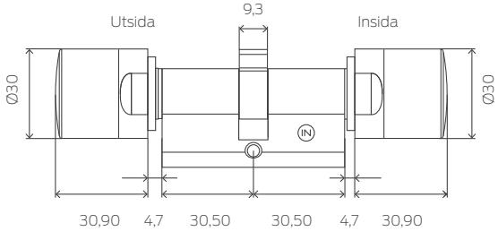

| design i rostfritt stål | Digital Europaprofil dubbelknoppscylinder MobileKey – Antipanik För användning i antipaniklås, fritt roterande på båda sidorna, | MK.Z4.aa-ii.AP2.FD.FH.ZK.G2    |
|-------------------------|------------------------------------------------------------------------------------------------------------------------------------|--------------------------------|
|                         | Version med integrerad LockNode för nätverksuppkoppling                                                                            | MK.Z4.aa-ii.AP2.FD.FH.LN.ZK.G2 |
|                         | Väderskyddad version, skyddsklass: IP 66                                                                                           | MK.Z4.aa-ii.AP2.FD.FH.WP.ZK.G2 |

Version med integrerad LockNode för nätverksuppkoppling MK.Z4.aa-ii.AP2.FD.FH.WP.LN.ZK.G2

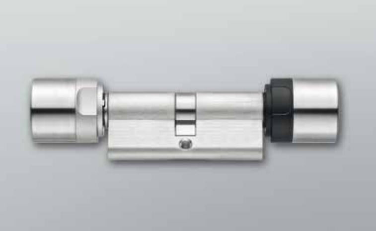

# Digital Europaprofil Halvcylinder MobileKey

Den digitala låscylindern finns i en mängd olika versioner, bland annat som halvcylinder. Det erbjuder dig en lösning för alla typer av dörrinstallationer utomhus, till exempel garageportar eller nyckelbrytare.

## Tekniska specifikationer

| :: Standard Europaprofilcylinder enligt DIN 18252/ |
|----------------------------------------------------|
| EN 1303/DIN EN 15684                               |
|                                                    |

- :: Knoppdiameter: 30 mm :: Grundläggande installationslängd: 30–10 mm (ytter-/ innermått) utan extra kostnad
- :: Total längd: upp till max 140 mm (max 90 mm på ena sidan), utan extra kostnad
- :: Skyddsklass: IP 66

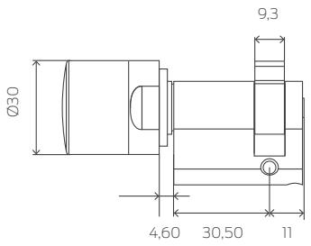

Mått anges i mm

- :: Batterityp: 2 x litium, CR2450, 3 V
- :: Batteriets livslängd: upp till 300 000 låsningar eller upp till tio års standby
- :: Temperaturområde: Drift: -25 °C till +65 °C Förvaring: -35 °C till +50 °C
- :: 500 tillträden kan loggas

## Produktversioner Best.kod

| Digital Europaprofil halvcylinder MobileKey, väderskyddad version; Skyddsklass: IP 66 (kopp), knoppen kan inte demonteras | MK.Z4.ee-10.HZ.WP.ZK.G2    |
|------------------------------------------------------------------------------------------------------------------------------|----------------------------|
| design i rostfritt stål Version med integrerad LockNode för nätverksuppkoppling                                           | MK.Z4.ee-10.HZ.WP.LN.ZK.G2 |
|                                                                                                                              |                            |

Tillhållarlåsversion; demonterbar knopp, väderskyddad version, MK.Z4.ee-10.HZ.MR.WP.ZK.G2 Skyddsklass: IP 66 (knopp) Version med integrerad LockNode för nätverksuppkoppling MK.Z4.ee-10.HZ.MR.WP.LN.ZK.G2

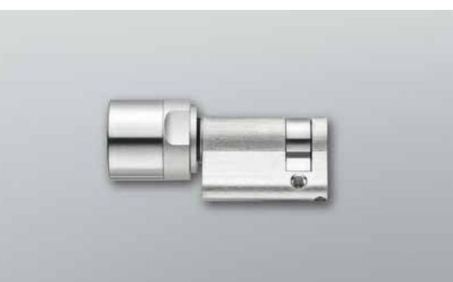

Digital Europaprofil

Dubbelknopp

MobileKey-cylinder –

Comfort

Komfortcylinder (kan betjänas från insidan utan transponder, knoppen är alltid inkopplad)

# Tekniska specifikationer

- :: Standard Europaprofilcylinder enligt DIN 18252/EN 1303/ DIN EN 15684
- :: Knoppdiameter: 30 mm
- :: Grundläggande installationslängd: 30–30 mm (ytter-/innermått)
- :: Total längd: upp till max 140 mm (max 90 mm på ena sidan), utan extra kostnad
- :: Skyddsklass: IP 54

Mått anges i mm

- :: Batterityp: 2 x litium, CR2450, 3 V
- :: Batteriets livslängd: upp till 300 000 låsningar eller upp till tio års standby
- :: Temperaturområde: Drift: -25 °C till +65 °C
- Förvaring: -35 °C till +50 °C
- :: 500 tillträden kan loggas

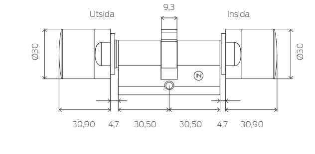

## Produktversioner Best.kod Digital Europaprofil dubbelknoppscylinder MobileKey – Comfort MK.Z4.ee-ii.CO.ZK.G2 Sidan utan elektronik är alltid inkopplad och kan därför betjänas från insidan från insidan utan transponder, design i rostfritt stål Version med integrerad LockNode för nätverksuppkoppling MK.Z4.ee-ii.CO.LN.ZK.G2 Väderskyddad version, skyddsklass: IP 66; MK.Z4.ee-ii.CO.WP.ZK.G2 installationslängd 35–30 mm Version med integrerad LockNode för nätverksuppkoppling MK.Z4.ee-ii.CO.WP.LN.ZK.G2

# Digital Skandinavisk Oval-cylinder MobileKey

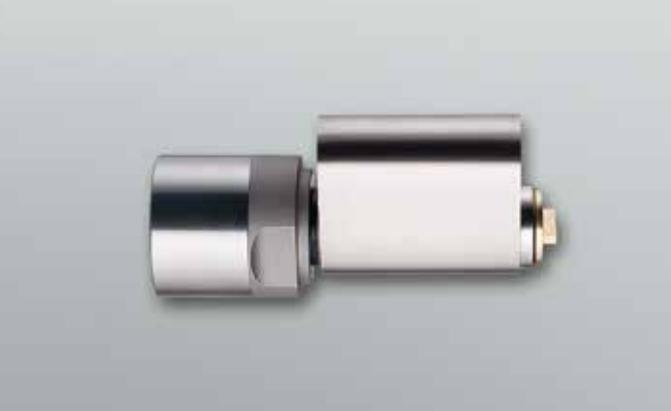

Låscylindern för installation på dörrar med Skandinavisk oval-profil – ditt digitala lås. Snabb, kabellös installation utan borrning i snygg design.

## Tekniska specifikationer

- :: Skandinavisk Oval-profilcylinder
- :: Diameter: 30 mm
- :: Grundläggande installationslängd: i version för utsidan: 41,3 mm, i version för insidan: 30 mm
- :: Total längd: max 86,3 mm; speciallängden på begäran
- :: Skyddsklass: innerknopp: IP54, väderskyddad version på cylindern för utsidan: IP66
- :: Batterityp: 2 x litium, CR2450, 3V
- :: Batteriets livslängd: upp till 300 000 aktiveringar eller upp till tio års standby
- :: Temperaturområde: Drift: -25 °C till +65 °C Förvaring: -35 °C till +50 °C
- :: 500 tillträden kan loggas

Mått anges i mm

| Produktversioner                                                                                                                           | Best.kod                 |
|--------------------------------------------------------------------------------------------------------------------------------------------|--------------------------|
| Digital Skandinavisk Oval-cylinder med G2-funktioner För utsidan: installationslängd 41,3 mm, design i rostfritt stål                   | MK.Z4.SO.A40.ZK.G2       |
| Version för utsidan med integrerad LockNode för nätverksuppkoppling                                                                        | MK.Z4.SO.A40.LN.ZK.G2    |
| Väderskyddad version för utsidan, skyddsklass IP66                                                                                         | MK.Z4.SO.A40.WP.ZK.G2    |
| Väderskyddad version för utsidan med integrerad LockNode för nätverksuppkoppling, skyddsklass IP66                                      | MK.Z4.SO.A40.WP.LN.ZK.G2 |
| Digital Skandinavisk Oval-cylinder 3061, kan betjänas utan transponder För insidan: installationslängd 31,9 mm, design i rostfritt stål | Z4.SO.I30                |

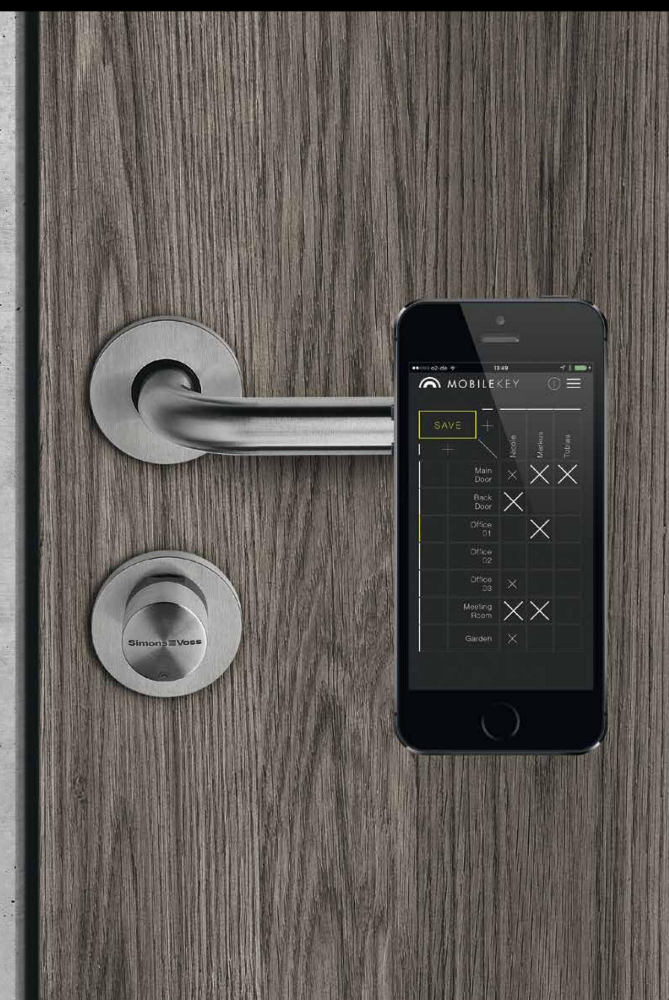

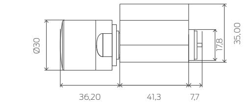

# USBprogrammeringsenhet MobileKey

Den kompakta USB-programmeringsenheten ger användaren full kontroll över låssystemet. Med programmeringsenheten kan man skapa låssystem, programmera komponenter och hantera tillträdesbehörigheter. USB-programmerningsenheten leveras inklusive vår lättanvända MobileKey mjukvara.

## Tekniska specifikationer

- :: Programmering: SimonsVoss 25 kHz-teknik
- :: Operativsystem: Windows 7 eller högre
- :: USB-port: USB-typ A (samma som flashminne)/ USB 2.0
- :: Strömförsörjning: USB-anslutning
- :: Mått: 57 (70) x 19 x 13 mm (LxBxH)
- :: Programmeringsavstånd: 10-30 cm
- :: Skyddsklass: IP 40
- :: Temperaturområde: -10 °C till +60 °C
- :: Fuktighet: 95 % (ej kondenserande)

## Beskrivning Best.kod

USB-programmeringsenhet för MobileKey-produkter. MK.CD.STARTER.G2 Anslutning till dator via USB-port i kombination med MobileKey-applikation

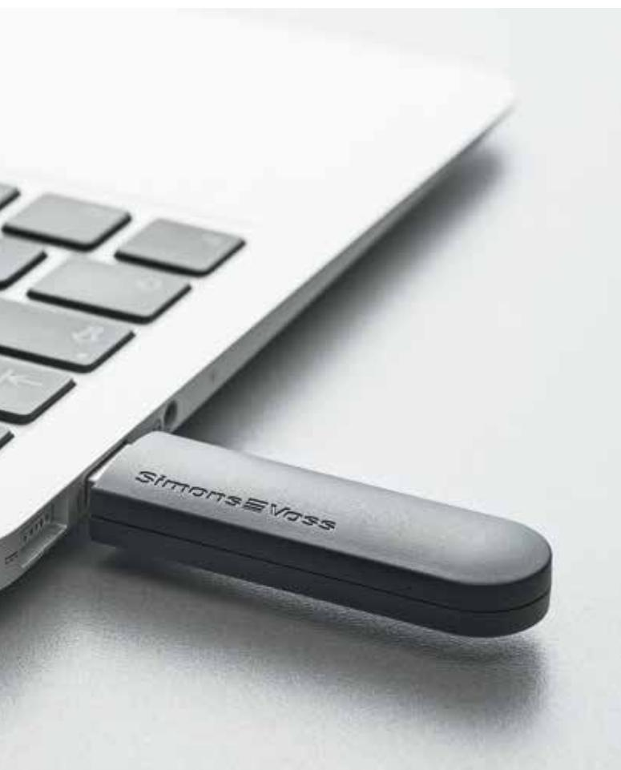

Digitalt SmartRelä

MobileKey

Tekniska specifikationer

- :: Ytterhölje i vit polyamid 6.6
- Mått: 78 x 78 x 19 mm (HxBxD) :: Ytterhölje i svart plast (polyamid 6.6)
- Mått: 55,4 x 71,8 x 25,1 mm (HxBxD) :: Skyddsklass: IP 20, lämpar sig ej för oskyddade platser utomhus
- :: Normal läsavstånd: upp till 120 cm
- :: Temperaturområde: Drift: -22 °C till +55 °C
- :: Luftfuktighet: < 95 %, utan kondensation
- :: Kretskortsmått: 50 x 50 x 14 mm (HxBxD)
- :: Nätspänning: 12 V AC (endast för SREL) eller 5-24 V DC
- :: Strömbegränsning: nätadaptern måste begränsas till 15 VA
- :: Ström i standby: < 5 mA
- :: Maxström: < 100 mA
- :: Pulseringens varaktighet kan programmeras mellan 0,1 och 25,5 sek.
- :: Valfri batteridrift (MK.SREL.ZK.G2)
- :: 500 tillträden kan loggas

## Tekniska specifikationer för utgångsrelä

- :: Typ: växelkontakt; i SREL2: normalt öppen kontakt kan inverteras
- :: Kontinuerlig ström: max 1,0 A
- :: Påslagningsström: max 2.0 A
- :: Kopplingsspänning: max 24 V
- :: Kopplingseffekt: 106 aktivering vid 24 VA

| Produktversioner                                                                                                                                                                         | Best.kod            |
|------------------------------------------------------------------------------------------------------------------------------------------------------------------------------------------|---------------------|
| Digitalt SmartRelä MobileKey med vitt designat ytterhölje för utanpåliggande montering, med passerkontroll, tidszonsstyrning och händelselogg, ingen anslutning för extern antenn. | MK.SREL2.ZK.G2.W    |
| Version med integrerad LockNode för nätverksuppkoppling                                                                                                                                  | MK.SREL2.LN.ZK.G2.W |
| Digitalt SmartRelä MobileKey i svart ytterhölje även för infälld montering, med passerkontroll, tidszonsstyrning och händelselogg, med anslutning för extern antenn.               | MK.SREL.ZK.G2       |

Det digitala SmartReläet fungerar som en passerkontrollsläsare eller nyckelbrytare. I MobileKey systemet kan det öppna dörrar, portar och bommar samt slå på maskiner eller värme automatiskt. Den är en multitalang som kan styra alla externa enheter som behöver en puls – eller latch för till/frånslag.

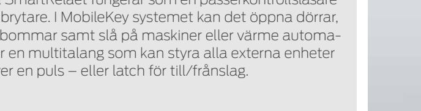

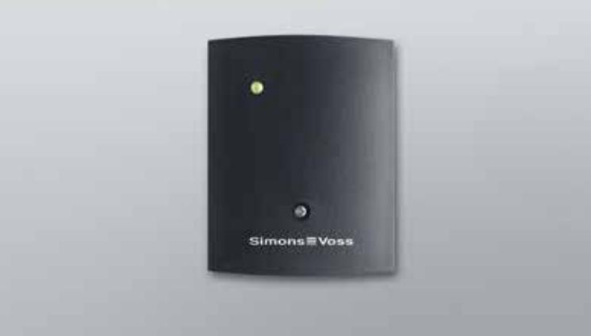

## Beskrivning Best.kod

MobileKey SmartBridge för nätverksuppkoppling av MobileKey-låsenheter MK.SMARTBRIDGE.ER med SimonsVoss-servern. Ethernet-design för anslutning med en nätverksnod

# Utökning online MobileKey

I onlineversionen är din digitala cylinder direkt ansluten till servern via en SmartBridge.Det gör att du kan bland annat : installera utrustning, ändra behörigheter samt ´ärröppna och hämta loggar från låsen i realtid.

Tekniska specifikationer

- :: Ytterhölje i ABS-plast, UV-stabilt, färg: 9/118645, samma som RAL 9016 (trafikvit)
- :: Mått: 172 x 86 x 33 mm (LxBxH)
- :: Radiofrekvens: 868.xx 870 MHz
- :: Uteekt: max 3 VA
- :: Räckvidd upp till 30 m
- :: Överföringseekt radiomodul: 10 dBm (6,3 mW) till antennuttaget :: Extern strömförsörjning:
- reglerad nätadapter 9-24 V DC: MK.SMARTBRIDGE.ER även PoE-kompatibel (802.3af)

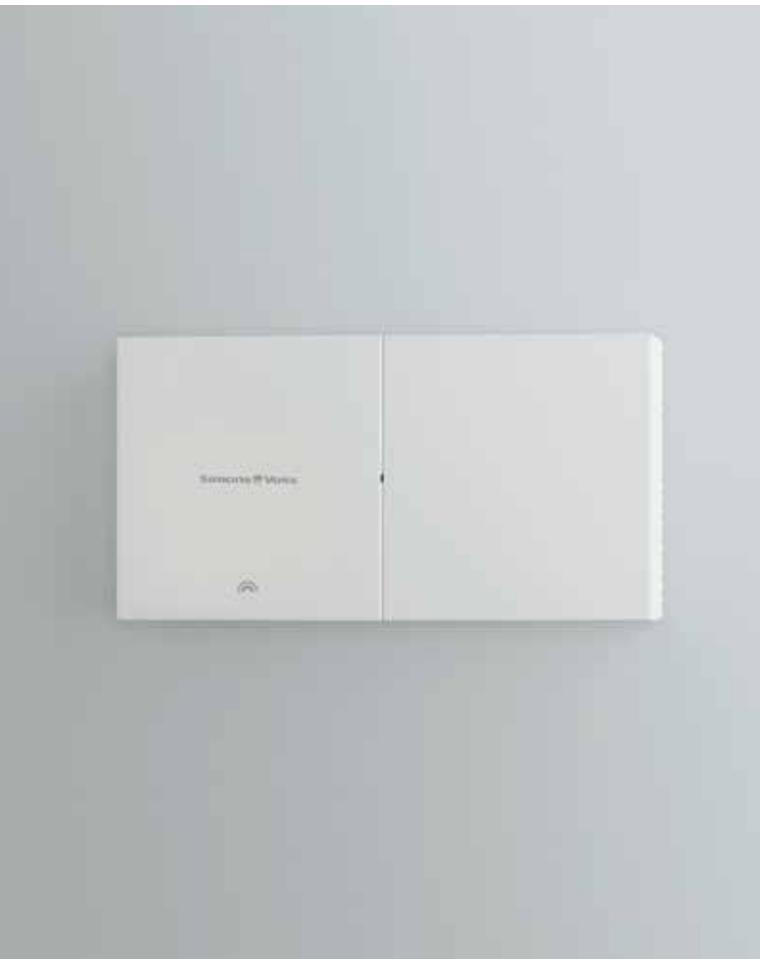

# MobileKey Paketlösningar

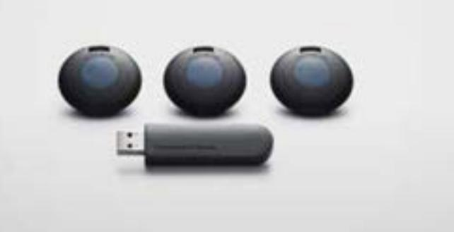

Vi erbjuder MobileKey-komponenter i förmånliga startkits för nya användare.

| MobileKey Starter Set 1                                                                      | Best.kod |
|----------------------------------------------------------------------------------------------|----------|
| Bestående av 3 transpondrar (MK.TRA2.G2) och 1 USB-konfigureringsenhet (MK.CD.STARTER.G2) | MK.SET1  |
| MobileKey Starter Set 2                                                                      | Best.kod |
| Bestående av 3 transpondrar (MK.TRA2.G2) 1 pinkodsknappsats (MK.TRA .PINCODE) och         | MK.SET2  |

1 USB-konfigureringsenhet (MK.CD.STARTER.G2)

# Tillbehör

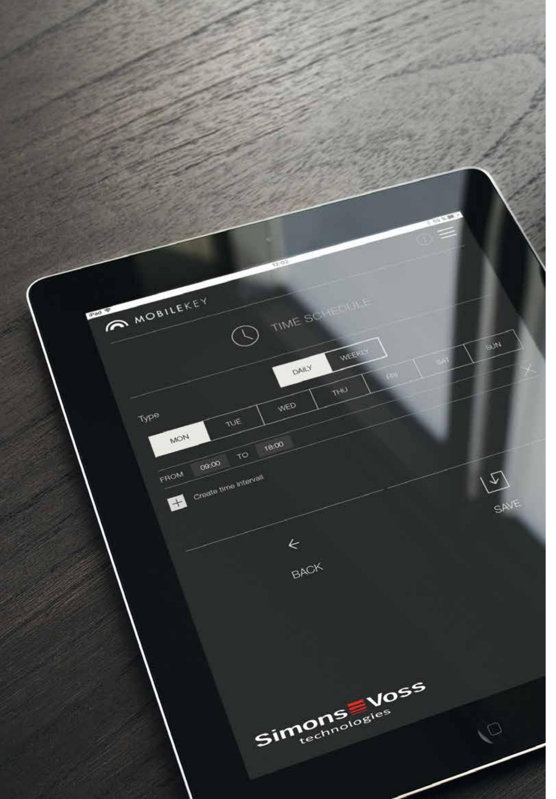

|                                                                                                                                                                                                         | Best.kod                        |
|---------------------------------------------------------------------------------------------------------------------------------------------------------------------------------------------------------|---------------------------------|
| Beskrivning                                                                                                                                                                                             |                                 |
| Intelligent fästskruv med sensorer för användning med DoorMonitoring-cylinder. OBS: Du måste känna till dornmåttet för beställning av fästskruv. Finns i steg om 5 mm, från 25 mm till max 70 mm. | Z4.DM.xx.SCREW                  |
| Speciell skruvmejsel för DoorMonitoring                                                                                                                                                                 | Z4.DM.SCREWDRIVER               |
| Monterings-/batterinyckel: Speciellt verktyg för demontering och batteri- byte (knappceller) i TN4-cylindrar (dubbelknopps- och halvcylindrar)                                                       | Z4.SCHLUESSEL                   |
| Kärnskyddadapter för alla fritt roterande TN4 dubbelknoppscylindrar; (obs: ta hänsyn till utökningen för cylinderns yttermått) 8 mm utökning 15 mm utökning 20 mm utökning                  | Z4.KA Z4.KA.15R Z4.KA.20R |
| 5 batterier för MobileKey-transponder (typ: CR2032)                                                                                                                                                     | TRA.BAT                         |
| 10 batterier för MobileKey-cylindrar (dubbelknopps- och halvcylindrar) (typ: CR2450)                                                                                                                    | Z4.BAT.SET                      |
| Batteri för SmartRelä i svart hus (MK.SREL.ZK.G2), för drift utan extern strömförsörjning (t.ex. som dörrstopp), batterityp: litium 1/2 AA                                                           | SREL.BAT                        |
| Extern antenn för anslutning av SmartRelä, kabel längd 5 m                                                                                                                                              | SREL.AV                         |
| Skyddshus för SmartRelä (SREL2) för användning utomhus                                                                                                                                                  | SREL.COVER1                     |
| Extern nätdel (Europlugg) för SmartBridge (lämpar sig för användning med MK.SREL/MK.SREL2)                                                                                                           | POWER.SUPPLY.2                  |
| Extern antennsats för SmartBridge                                                                                                                                                                       | ANTENNA.EXT.868                 |
| MobileKey nätverksknopplock som reservdel för nätverkscylindrar direkt                                                                                                                                  | MK.LN.I                         |
| MobileKey nätverkskretskort som reservdel för nätverksuppkoppling SmartRelä (SREL2) direkt                                                                                                           | MK.LN.I.SREL2.G2                |

Tom provlåda (aluminiumlåda 327 x 200 x 54) MK.KOFFER.SMALL.U för 1 cylinder i installationslängd 35–35 mm, 2 transpondrar, 1 pinkodsknappsats, 1 USB-konfigureringsenhet

Denna prislista gäller fram till det att en ny lista ges ut av SimonsVoss Technologies GmbH. Angivna priser gäller EXW Osterfeld. Leveranskostnader och gällande moms tillkommer. Om beställningsvärdet understiger 50 euro tar vi ut en extra avgift på 25 euro. Beakta gällande version av våra allmänna villkor, som kan skickas till dig på begäran. De allmänna villkoren för SimonsVoss Technologies GmbH finns under rättslig information på www.simons-voss.com.

# Ett skräddarsytt system med några enkla steg.

**01. Fastställ antal användare och lås** Beräkna antalet användare och hur många transpondrar ni behöver. Bestäm sedan hur många lås – och av vilken typ och funkrion ni behöver.

**02. Skapa låsschemat på my-mobilekey.com** Registrera dig på my-mobilekey.com för att aktivera ditt användarkonto. Du kommer därefter att kunna komma åt låsschemat från alla dina enheter med internetuppkoppling. Använd nu konfigurationsassistenten för att skapa låsschemat och föra in komponenters ID och egenskaper. Du kan lägga till fler nycklar och lås när så önskas.

**03. Programmera komponenterna** Du kan påbörja programmeringen så fort de enskilda komponenterna har lagts till och tillträdesbehörigheterna för låssystemet har tilldelats. Du kan använda programmeringsenheten för att slutföra programmeringen direkt på en Windows-dator eller en smarttelefon med Android. Du kan även använda onlineutökningen för att programmera låskomponenter direkt via nätverket.

**04. Installera komponenterna** När programmeringen är slutförd installerar du låscylindrar och SmartReläer för att manövrera bommar, garageportar och andra liknande installationer.

**05. Genomför ett kort funktionstest så är allt klart!** Efter funktionstestet är det elektroniska låssystemet färdigt att användas! Du kan ändra behörigheter och utöka systemet när du vill.

SimonsVoss Technologies GmbH Feringastrasse 4 85774 Unterföhring Germany Tel. +49 89 99228-0 Fax +49 89 99228-222 info@simons-voss.com www. simons-voss.com

www.my-mobilekey.com

NORDEN SimonsVoss Technologies AB Östermalmstorg 1 114 42 Stockholm Sverige Tel. +46 850 25 66 63 Fax +46 850 25 65 00 nordic@simons-voss.com

© Copyright 2017, SimonsVoss Technologies GmbH, Unterföhring, Germany Med ensamrätt. Texter, bilder och grafiker är upphovsrättsskyddade. Innehållet i denna broschyr får inte kopieras, distribueras eller ändras. Bindande tekniska data anges i vår systemhandbok. Med reservation för tekniska ändringar. SimonsVoss och MobileKey är registrerade varumärken som tillhör SimonsVoss Technologies GmbH.

### Om Allegion™

Allegion (NYSE: ALLE) är globalt verksam leverantör av säkerhetslösningar med ledande varumärken som CISA®, Interflex®, LCN®, Schlage®, SimonsVoss® och Von Duprin®. Med fokus på säkerhet för dörrar och passersystem erbjuder Allegion ett brett utbud av lösningar för privathushåll, företag, skolor och andra inrättningar. Allegion har en omsättning på 2 miljarder US-dollar och marknadsför sina produkter i omkring 130 länder Mer information hittar du här: www.allegion.com.

