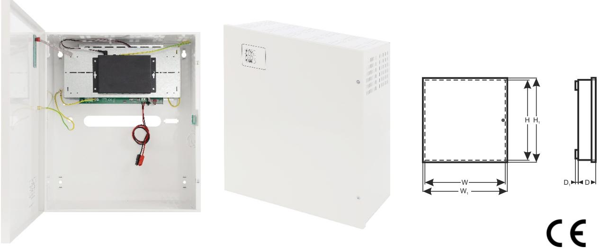

*Pulsar* ®

**APS64** v.1.1/II **APS 6-port switch 4x30W med reservkraft 64** PRODUKTKODE TYP: :

### **Egenskaper:**

- Avbrottsfri strömförsörjning för 4 IP-enheter (52 V DC)
- Switch med 6 portar 4 PoE-portar 10/100 Mb/s (dataöverföring och strömförsörjning) 2 portar 10/100 Mb/s (UP LINK)
- Läge med **Lång räckvidd** (upp till 250m)
- 30 W för varje PoE-port, stöder enheter som uppfyller tandarden IEEE802.3af/ vid **(PoE +)**
- Metallhölje färg vit RAL 9003 med batterifack för två 17 Ah/12 V-batterier
- Stöder automatisk inlärning och automatiskt åldrande av MAC-adresser (1K storlek)

### **BESKRIVNING**

APS64 är avsedd för oavbruten strömförsörjning av 4 IP-enheter (52 V DC-försörjning).

Systemets huvudsakliga komponenter inkluderar:

- PoE-switch med 6 portar
- 27,6 V buffertströmförsörjning med två 17 Ah / 12 V-batterier
- en omvandlare (inbyggd strömförsörjning) som ökar spänningen till 52 V DC (försörjning av PoE-switchen)

Vid strömavbrott aktiveras omedelbart ett reservbatteri.

 Automatisk upptäckt av enheter som drivs med standarden PoE/PoE+ aktiveras vid portar 1-4 på switchen. UP LINK-portarna används för anslutning till en annan nätverksenhet. Lysdioderna på frontpanelen indikerar enhetens driftsstatus (beskrivs i tabell 8).

Switchen sitter inuti ett metallhölje (färg RAL 9003) med rum för två 17 Ah/12 V-batterier. Höljet är utrustat med en mikroswitch som aktiveras om luckan öppnas (frontpanelen).

APS64 är försedd med tre Lysdioder på frontpanelen (se avsnitt 3.1).

wyjście TAMPER : przewody 30cm

PoE-tekniken ansluter till nätverket och minskar installationskostnaderna eftersom den inte kräver en separat strömkabel till varje enhet. Metoden gör det möjligt att försörjs andra nätverksenheter.

# **SWITCHENS PARAMETRAR**

| Portar                  | 6 st 10/100 Mb/s -portar (4 st PoE + 2 st UP LINK) med automatisk hantering av anslutningshastighet och MDI/MDIX Auto Cross |
|-------------------------|--------------------------------------------------------------------------------------------------------------------------------|
| PoE-strömförsörjning    | IEEE 802.3af/at (1 ÷4 portar), 52 V DC / 30 W i varje port *                                                                   |
| Läge med lång räckvid d | Lång räckvidd, VLAN                                                                                                            |
| Protokoll, standarder   | IEEE802.3, 802.3u, 802.3x CSMA/CD, TCP/IP                                                                                      |
| Bandbredd               | 1,6 Gbps                                                                                                                       |
| Överföringsmetod        | Lagra-och-vidarebefordra                                                                                                       |
| Synlig driftsindikering | Switchens strömförsörjning; Länk/Act; PoE-status                                                                         |

*Det angivna värdet på 30 W ä r maximal belastning per port. Total maximal belastning 120W på samtliga portar. För maximal livslängd rekommenderas en kontinuerlig belastning på maximalt 80W.

## **ELEKTRISKA PARAMETRAR**

| Nätförsörjning                                                    | ~200-240 V; 50 Hz                                                                                |
|-------------------------------------------------------------------|--------------------------------------------------------------------------------------------------|
| Strömstyrka upp till                                              | 1,2 A                                                                                            |
| Strömförsörjning                                                  | 133 W                                                                                            |
| PoE Utgang                                                        | 52V; 120W                                                                                        |
| Utgångsström vid PoE -portarna (RJ45)                             | 4 st 0,6 A ΣI=2,3A max.                                                                          |
| Utgångsström vid PoE -portarna (RJ45)                             | 52 V DC                                                                                          |
| Kortslutningsskydd SCP och överbelastningsskydd OLP            | 105% ÷ 150% PSU -effekt, manuell omstart (felet kräver frånkoppling av utgångskretsen för DC) |
| PSU-strömförbrukning                                              | 80 mA/27,6 V DC                                                                                  |
| Batteriets laddningsström                                         | 0,5 A max. /2x 17 Ah (+/ -5%)                                                                    |
| Batterikretsskydd SCP och retur polaritetsanslutning           | proppsäkring                                                                                     |
| Djupurladdningsskydd UVP                                          | U<19 V (± 5%) – frånkoppling av anslutningsbatteri                                               |
| Sabotageskydd: - MANIPULERINGS -indikator när höljet öppnas | - mikroswitch, NC-kontakter (stängt hölje), 0,5 A@ 50 V DC (max.)                             |

### **MEKANISKA PARAMETRAR**

| Mått                | W=330, H=380, D+D1=173+8 [+/ - 2mm] W1=335, H1=385 [+/ - 2mm]                                                                                           |
|---------------------|------------------------------------------------------------------------------------------------------------------------------------------------------------|
| Batterifackets mått | 325 x 180 x 168mm (WxHxD) max                                                                                                                              |
| Brutto- / nettovikt | 5,9 / 6,2 [kg]                                                                                                                                             |
| Hölje               | Stålplatta, DC01 1,0mm färg vit RAL 9003                                                                                                                   |
| Förslutning         | Spårskruv x 2 (fram), (låsaggregat möjligt)                                                                                                                |
| Anslutningar        | Strömförsörjning till enheterna: RJ45 -uttag Ingång 230 V: Φ 0,63 -2,50 (AWG 22-10) Batteriutgång BAT: 6,3F -2,5 MANIPULERINGS -utgång: ledningar |
| OBS!                | Höljet ska inte vidröra monteringsytan för att kablar ska kunna dras.                                                                                   |

wyjście TAMPER : przewody 30cm