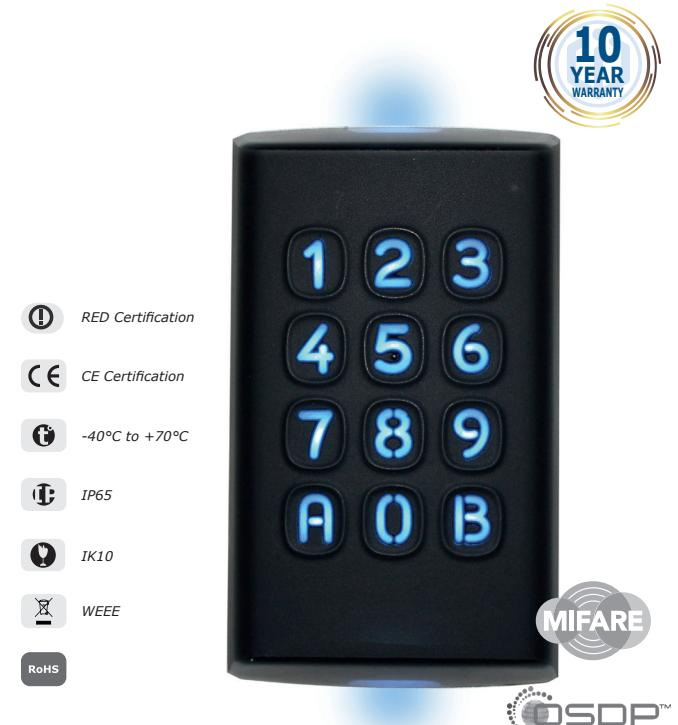
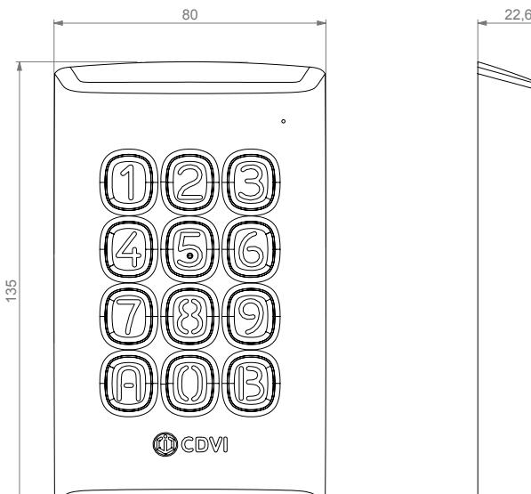
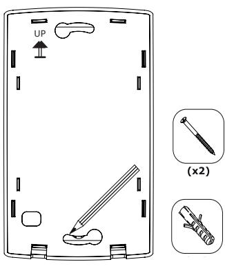
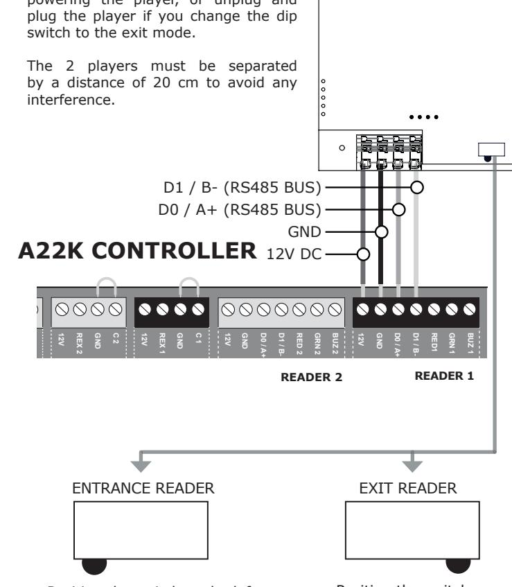

# **QUICK START INSTALLATION GUIDE**

# **K3** *DESFire EV2® High-Security Keypad and card reader*

Radio equipment for access control applications.

CDVI's KRYPTO K3 card reader/keypad makes high security easy!

KRYPTO K3 Mifare® DESFire® EV2® readers combined with CDVI EV2 credentials work right out of the box. No fastidious and complicated programming required!

Factory-programmed, industry-unique secure CDVI protocol and encryption keys ensure end-to-end encryption between the card, reader/keypad and A22K door controller.

We, CDVI, declare that the K3 radio equipment complies with directive 2014/53/UE. The full text of the EU declaration is available at www.cdvi.com

- Bi-technology, keypad and reader
- Easy to use & FULLY secure CDVI protocol using authentication with diversified keys.
- Reads 13.56 MHz Mifare® Classic and DESFire EV2 credentials
- OSDP-2 compatible
- Bluetooth
- Up to 4 in. (10cm) read range
- Power requirements: 12VDC
- Current consumption : 200mA

Vol. (mm Weight (g) : 3 ) :

Ce document est la propritété exclusive de CDVI, il ne peut être communiqué à des tiers sans son autorisation. This document is the exclusive property of CDVI and it may not be disclosed to others without permission.

**K3**

Material : ... General tolerance: 0.2 Surface condition: Ra 3,2

C.A. :

DES: W.Sainvil

Project :

**Date 14/04/2020 Edition 00 Plan M ...**

> 31, av du Gal Leclerc 93691 PANTIN CEDEX F R A N C E Tel : 33(0)148910102 Fax : 33(0)148912121 **www.cdvi.com**

A3H

SCALE 1:1

RFID Frequency band : 13,553-13,567 MHz / Bluetooth Frequency band: 2,402 - 2,480 GHz Maximum transmitted power <60dBμA/m

### www.cdvigroup.com

# **QUICK START INSTALLATION GUIDE**

#### **MOUNTING** 80 22,6

135

Vol. (mm Weight (g) : 3 ) :

Ce document est la propritété exclusive de CDVI, il ne peut être communiqué à des tiers sans son autorisation. This document is the exclusive property of CDVI and it may not be disclosed to others without permission.

> A3H SCALE 1:1

**Date 14/04/2020 Edition 00 Plan M ...**

> 31, av du Gal Leclerc 93691 PANTIN CEDEX F R A N C E Tel : 33(0)148910102 Fax : 33(0)148912121 **www.cdvi.com**

Material : ... General tolerance: 0.2 Surface condition: Ra 3,2

#### **WIRING DIAGRAM** Project : **K3** C.A. :

DES: W.Sainvil

## **K3 READER**

#### **EXIT READER OPTION (RS485 ONLY):**

Each A22K controller supports the Input/Output reader, 2 readers per door. Connect the 2 readers in parallel (as shown below).

### **CAUTION**

The dipswitch must be at the bottom near the motherboard:

Set the position of the switch before powering the player, or unplug and plug the player if you change the dip switch to the exit mode.

The 2 players must be separated by a distance of 20 cm to avoid any interference.

Position the switch to the left next to the terminal block (manufacturer setting) SYSTEM STATUS

24V DC INPUT/

BATTERY/

MODULE TYPE

LOCAL BUS ETHERNET

**+24V DC**

INPUT

POWER

SUPPLY

BATTERY

BACKUP

**+12V DC**

**LK 2-**

DOOR 2 **LK 2+**

**NC 1 NO 1 C 1 LK 1 LK 1+**

**-**

LOCKS

DOOR 1

**TMP**

LOCK 1 & 2

JUMPER SETTING

STATUS

**-**

**NC 2**

**NO 2**

**C 2**

**-**

Position the switch to the right **+12V DC** RS485

PORT

It is recommended to use **CAT5e/6** cable

Distance between the reader and the controller up to 1220m (AWG 22 cable).

## **LED STATUS INDICATORS**

Here are the LED status when connected to an A22K ATRIUM controller :

| LED State                    | Buzzer                       | Description                                        |
|------------------------------|------------------------------|----------------------------------------------------|
| Steady blue                  | -                            | Standby (door se cure)                          |
| Green 5 sec.                 | Chirp beep                   | Access granted                                     |
| Red blinks                   | Steady beep for 3 sec. | Access denied                                      |
| Flashing blue                | -                            | Reader compromised (lost its encryption key) |
| Blinks green every 3 sec. | -                            | Door unlock schedule                               |
| Flashing Red                 | Steady beep               | Door forced alarm                                  |
| Flashing Red                 | Beep every 2 sec.         | Door open too long pre-alarm                    |
| Flashing Red rapidly         | Fast beep                    | Door open too long alarm                        |

#### **Note:**

Door output timings such as; unlock time (access granted), door open too long pre-alarm and door open too long alarm, can be modified in the ATRIUM software "Door Properties" window.

### **CDVI SAS** 31 avenue du Général Leclerc

93500 PANTIN 01 48 91 01 02

