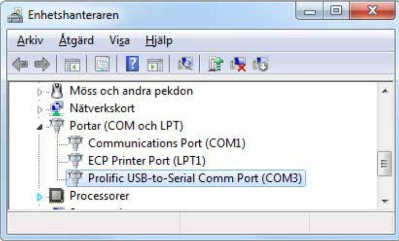
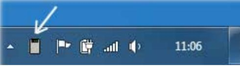

# **Bordsläsare Installera och Använda**

Beskriver installation och användning av bordsläsare inom R-CARD M5 samt i andra Windows-program med hjälp av tilläggsprogrammet M5 Admin Reader.

RCO Security AB Box 705 176 27 Järfälla

tel 08-546 560 00 info@rco.se

| Introduktion 3                                       |   |
|------------------------------------------------------|---|
| Bordsläsare i R-CARD M5  3                           |   |
| Bordsläsare – och M5 Admin Reader – i andra program  | 3 |
| Bordsläsare med fjärrskrivbord (RDP)/Citrix 4        |   |
| Bordsläsare i R-CARD M5 5                            |   |
| Installera bordsläsare med drivrutiner 5          |   |
| Inställningar i R-CARD M5  6                         |   |
| Använda bordsläsaren i R-CARD M5  7                  |   |
| Bordsläsare i andra program (med M5 Admin Reader)  7 |   |
| Installera M5 Admin Reader 7                         |   |
| Installera bordsläsare med drivrutiner 8             |   |
| Inställningar i M5 Admin Reader 8                    |   |
| Starta bordsläsarprogrammet 9                     |   |
| Använda bordsläsaren med R-CARD M5 Webbklient10      |   |
| Använda bordsläsaren med Microsoft Excel10           |   |
|                                                      |   |

#### **Introduktion**

#### **Bordsläsare i R-CARD M5**

För enkel inläsning av kortnummer (serienummer, kort-ID) från kodbärare (kort, taggar, brickor) kan du använda en av nedanstående bordsläsare i R-CARD M5:

- USB-ansluten RK1 radioknapp (bordsläsare som läser radioknappar).
- USB-ansluten PROMAG PCR310U (läser sektorerpå Mifare-kort).
- USB-ansluten PROMAG PCR300M (läser serienummer på Mifare-kort).
- USB-ansluten PROMAG PCR300A (läser serienummer på prox-kort).
- RCO:s serieportsläsare Reader-20 (MAG-20, DAL-20, PROX-22 utgått).

#### **Bordsläsare – och M5 Admin Reader – i andra program**

Bordsläsarna – förutom PROMAG PCR310U – kan också användas tillsammans med andra program, t.ex. Microsoft Excel eller Microsoft Word. Då krävs bordsläsarprogrammet R-CARD M5 Admin Reader.

#### Bordsläsarprogrammet har följande begränsningar **!**

- Det kan bara användas för blockavkodning av serienummer. Inläsningssätt Linjär eller Linjär, omvänd är bara valbart när du använder bordsläsaren i R-CARD M5.
- Det kan inte användas med bordsläsaren PROMAG PCR310U, som läser en sektor på Mifare-kort, dvs. inte serienummer.
- Det används normalt inte om R-CARD M5-klienten (R-CARD M5 Arbetsstation) körs i samma maskin som läsaren är inkopplad i. Problem kan uppstå om man kör R-CARD M5-klienten och M5 Admin Reader samtidigt.

#### **Bordsläsare med fjärrskrivbord (RDP)/Citrix**

R-CARD M5 Admin Reader installeras inte vid användning av bordsläsare med fjärrskrivbord (RDP)/Citrix eller andra tunna klienter. Tänk på att välja portnummer så att dessa stämmer överens – och att de stämmer med R-CARD M5.

|                                                                             | Anslutning till fjärrskrivbord                                                 |
|-----------------------------------------------------------------------------|--------------------------------------------------------------------------------|
|                                                                             |                                                                                |
| Lokala resurser Bildskam Program Allmant Prestanda Avancerat | (rivbord                                                                       |
| Fjarljud                                                                    | Lokala enheter och resurser                                                    |
| Konfigurera inställningar för fjamljud. Installningar                    | Välj de enheter och resurser som du vill använda i fjärsessionen. Smartkort |
| Tangentbord                                                                 | J Portar                                                                       |
| Använd Windows tangentkombinationer:                                        | Enheter E                                                                   |
| Bara i helskämsläge >                                                    | Andra Plug and Play-enheter (PnP) som stöds                                    |
| Exempel: ALT+TABB                                                           |                                                                                |
| Lokala enheter och resurser                                                 |                                                                                |
| Välj de enheter och resurser som du vill använda i fjarrsessionen.       |                                                                                |
| V Skrivare J Urklipp                                                     |                                                                                |
| Mer                                                                         | Vilka enheter kan jag anvanda i fjarrsessionen ?                               |
| Anslut Hjalp                                                             | OK Avbryt                                                                   |

### **Bordsläsare i R-CARD M5**

#### **Installera bordsläsare med drivrutiner**

- 1. Ladda ned en drivrutin från RCO:s webbplats, under Mediearkivet > Mjukvara > Drivrutiner för bordsläsare.
- 2. Installera drivrutinen.
- 3. Anslut bordsläsaren till en ledig port.
- 4. Beroende på vilken USB-port som valts kommer en COM-port med visst nummer att emuleras. Du kommer att behöva portnumret i nästa avsnitt. Ta reda på vilket nummer COM-porten fått:
	- a) Öppna Enhetshanteraren i Windows Kontrollpanelen.
	- b) Expandera Portar (COM & LPT).
	- c) Kontrollera vilken COM-port som skapats för Prolific USB-to-Serial Comm Port:

#### **Inställningar i R-CARD M5**

- Till bordsläsaren PROMAG PCR310U behövs en Mifare-profil som anger hur data ska läsas. Skapa den lämpligen annan du gör nedanstående. Se onlinehjälpen för mer information. **!**
- 1. Starta R-CARD M5.
- 2. Välj Inställningar > Inställningar.
- 3. Välj Klient > Kortinläsning.
- 4. Välj din bordsläsare i fältet Kortinläsning sker med:

| Installningar urval | Klient/Kortinlasning    |                              |       |
|---------------------|-------------------------|------------------------------|-------|
| System              | Egenskaper              | Inställningar                |       |
| Klient              | - Läsare 1              |                              |       |
| Kortinlasning       | Kortinlasning sker med: | PROMAG PCR300X (Prox/Mifare) |       |
| Användare           | Inläsning från:         | Comport 4                    |       |
| Operator            | Inläsning:              | Block                        |       |
|                     | Kort ID längd (bytes):  | 4                            |       |
|                     | F Lasare 2              |                              |       |
|                     | Kortinlasning sker med: | Manuellt                     |       |
|                     |                         | Verkställ                    | Stäng |

Har du bordsläsaren PROMAG PCR310U så ska du välja PROMAG Egendefinierad Mifare. Sedan väljer du den Mifare-profil som du skapat.

- 5. Fältet Inläsning visas om du har valt PROMAG PCR 300X. Ange hur kort-ID ska läsas ut och presenteras – normalt Block. Det är viktigt att det är samma som kortläsarna vid dörrarna.
Gäller det prox behålls standardvärden Block och 4 bytes. **!** 

- 6. Har du valt PROMAG Egendefinierad Mifare, markera Skapa ID06 användare vid inläsning om det handlar om en ID06-anläggning. I övriga fall visas inte fältet.
- 7. Ange COM portnumret från steg 3 på sidan 5 i fältet Inläsning från. (Om läsarkontakten flyttas till en annan USB-port måste du ange COM-portnumret igen.)

- 8. Klicka på Verkställ och Stäng.
- 9. Starta om R-CARD M5.

I vissa fall kan det vara nödvändigt att starta om datorn. Testa det om bordsläsaren inte fungerar.

#### **Använda bordsläsaren i R-CARD M5**

- 1. Välj Huvudmeny > Användare.
- 2. Öppna användaren och lägg in ett nytt kort.
- 3. Klicka i inmatningsfältet Kort-ID.
- 4. Avläs kortet i bordsläsaren. Kortnumret läggs automatiskt in i fältet Kort-ID.
- Tips: Du kan också använda bordsläsaren när du söker kort i systemet. **!**

## **Bordsläsare i andra program (med M5 Admin Reader)**

#### **Installera M5 Admin Reader**

Bordsläsarna – förutom PROMAG PCR310U – kan användas tillsammans med andra program, t.ex. Microsoft Excel eller Microsoft Word. Då krävs tilläggsprogrammet M5 Admin Reader.

Läs om begränsningar på sidan 3! **!** 

Gör så här:

- 1. Öppna R-CARD M5 installationsmediet i Windows Utforskaren. Navigera till mappen **M5AdminReader 2.0.0.0** och dubbelklicka på installationsprogrammet **Setup.exe**.
- 2. Klicka på Next.
- 3. Valfritt: Ändra installationsmapp.
- 4. Rekommenderas: Markera alternativet Everyone så att bordsläsaren kan användas av alla som har rätt att använda datorn.
- 5. Klicka på Next och Next för att installera programmet.
- 6. Starta om datorn.

#### **Installera bordsläsare med drivrutiner**

- 1. Ladda ned en uppdaterad drivrutin från RCO:s webbplats, under Mediearkivet > Mjukvara > Drivrutiner för bordsläsare.
- 2. Installera drivrutinen.
- 3. Anslut bordsläsaren till en ledig port.

#### **Inställningar i M5 Admin Reader**

- 1. Välj Start > Alla program > R-CARD M5 Admin Reader > Bordsläsare.
- 2. Klicka på Bordsläsare för att starta bordsläsarprogrammet.
- 3. Anslut bordsläsaren till en ledig port.

#### Dialogen Kort-/bordsläsare visas:

| Port: COM                                            | Port: COM 13                                      |
|---------------------------------------------------------|---------------------------------------------------------|
| Anvand 24-bitars Excel- Lägg till radbyte stod | Anvand 24-bitars Excel- Lägg till radbyte stor |
| Reader-20                                               | PROMAG PCR300X                                          |
|                                                         |                                                         |
| Spara Minimera                                       | Spara Minimera                                       |

- 4. Beroende på vilken USB-port som valts kommer en COM-port med visst nummer att emuleras. Ta reda på vilket nummer COM-porten fått:
	- a) Öppna Enhetshanteraren i Windows Kontrollpanelen.
	- b) Expandera Portar (COM & LPT).
	- c) Kontrollera vilken COM-port som skapats för Prolific USB-to-Serial Comm Port.

| Visa Hjälp                              |  |
|-----------------------------------------|--|
| F                                       |  |
| Möss och andra pekdon                   |  |
| Nätverkskort                            |  |
| Portar (COM och LPT)                    |  |
| Communications Port (COM1)              |  |
| ECP Printer Port (LPT1)                 |  |
| Prolific USB-to-Serial Comm Port (COM3) |  |
| Processorer                             |  |
|                                         |  |

- 5. Gå tillbaka till dialogrutan Kort-/bordsläsare och välj PROMAG PCR300X eller PROMAG PCR310X i rullgardinslistan.
- 6. Ange portens nummer i fältet COM. (Om läsarkontakten flyttas till en annan måste du ange COM-portnumret igen.)
- 7. Gör ev. programinställningar:
	- o Använd 24-bitars: Bara 24 bitar avläses även om kodbäraren innehåller fler bitar.
	- o Lägg till radbyte: Med denna inställning läggs ett CR-tecken (Carriage Return, vagnretur) efter inläst nummer, vilket gör att t.ex. Excel byter till följande inmatningsruta. Det innebär att du kan läsa in flera kort utan att behöva använda mus eller tangentbord.
	- o Excel-stöd: Om Lägg till radbyte inte ger önskat resultat kan detta alternativ aktiveras, vilket ger ett LF-tecken (Line Feed, radmatning) efter CR. Inställningen Excel-stöd är åtkomligt bara om Lägg till radbyte markerats.
- 8. Klicka på Spara.
- 9. Starta om bordsläsarprogrammet.

#### **Starta bordsläsarprogrammet**

- 1. Välj Start > Alla program > R-CARD M5 Admin Reader > Bordsläsare.
- 2. Klicka på Minimera så att bordsläsarens programikon syns i Windows Aktivitetsfältet:

Inlästa kortdata läggs då automatiskt in i det inmatningsfält där markören blinkar.

Om du inte minimerar programmet kommer inlästa nummer att presenteras i den tomma rutan. Du får då klippa ut och klistra in numret manuellt.

Det är tyvärr inte möjligt att placera programmet Bordsläsare i Autostart i Windows och ställa in så att det körs i minimerat läge.

#### **Använda bordsläsaren med R-CARD M5 WEBADMIN**

Gör enl. nedan för att läsa in kort-ID i webbklienten när du har surfat in på den i en webbläsare:

- 1. Starta R-CARD M5 WEBADMIN.
- 2. Klicka på Användare och lägg in nytt kort.
- 3. Klicka i inmatningsfältet Kort-ID och ta bort nollan.
- 4. Avläs kortet i bordsläsaren. Kortnumret läggs automatiskt in som kort-ID.

#### **Använda bordsläsaren med Microsoft Excel**

- Tips: Andra Windows-program, t.ex. Microsoft Word, kan använda inläsningsprogrammet på ett liknande sätt. **!**
- 1. Starta Excel.
- 2. Klicka i inmatningsfältet där kortdata ska läggas in.
- 3. Avläs kortet i bordsläsaren. Kortnumret läggs automatiskt in i Excel-fältet.

#### **Om Excel inte byter rad efter avläsningen**

- 1. Dubbelklicka på läsarprogrammets ikon Windows Aktivitetsfält så att programinställningarna blir åtkomliga.
- 2. Markera Lägg till radbyte.
- 3. Klicka på Spara.
- 4. Starta om bordsläsarprogrammet och minimera det.
- 5. Om inläsningen fortfarande inte byter rad, upprepa steg 1–4 ovan och markera även Excel-stöd.

