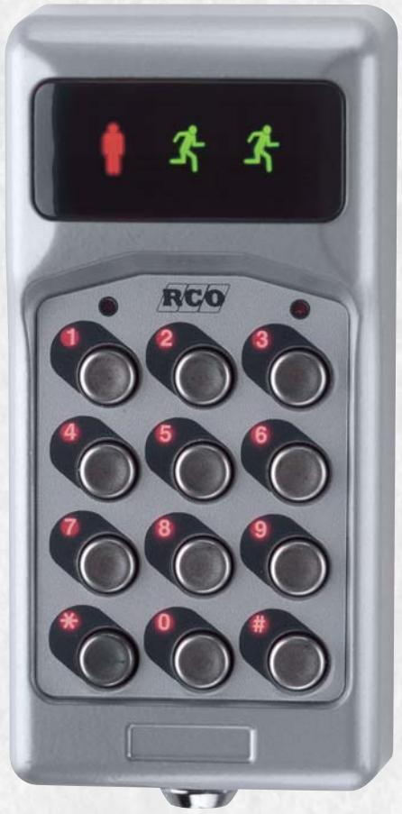
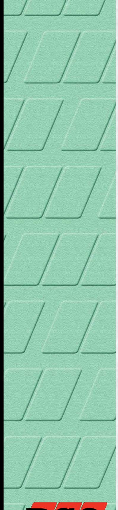
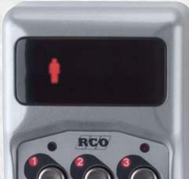
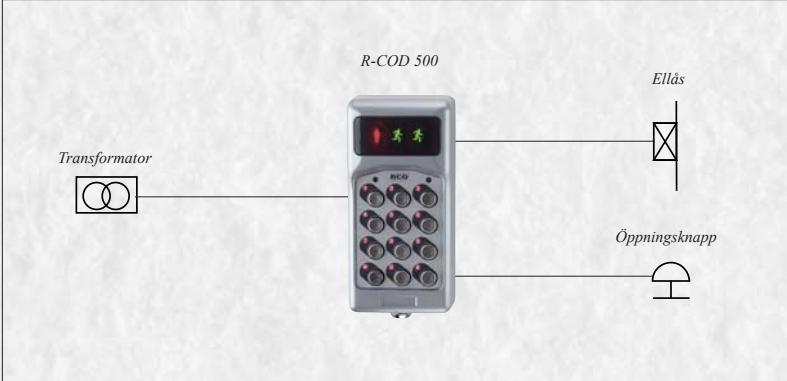

## **R-COD 500**

KODLÅS

**Det nya kodlåset som visar när dörren är öppen**

R-COD 500 är ett helt nytt kodlås med modern design och många funktioner. Det är avsett för företag och fastigheter där man på ett enkelt sätt vill höja säkerheten.

Kodlås är det perfekta alternativet till vanliga nycklar, när många personer skall passera genom en dörr. Det är smidigt och snabbt för den behörige samtidigt som det effektivt stänger ute alla obehöriga. När man slår sin kod på R-COD 500 så börjar den röda symbolen att lysa. Då rätt kod är intryckt så indikeras detta på ett tydligt sätt av de två växelvis lysande gröna symbolerna. Det här gör det enklare att slå koden samt att veta när dörren är öppen.

För ansvariga på företaget eller bostadsfastigheten så innebär installation av kodlås att man slipper ifrån den mycket osäkra och dyra nyckelhanteringen. R-COD 500 är mycket enkel att installera och handha. Den kräver ingen speciell centralenhet då all elektronik är inbyggd i knappsatsen. Trots detta kan den sitta utomhus och tåla väder och vind samtidigt som den smäckra designen gör att den även passar inomhus i snygga kontorsmiljöer.

Koden ställs enkelt om från tangentbordet. Det går att tidstyra koder via ett tidur, så att exempelvis postkoden endast fungerar viss tid under dagen.

**RCO Elektronik AB Box 705 • 176 27 JÄRFÄLLA Växel: 08-546 560 00 Order: 08-546 560 10 Service: 08-546 560 50 Fax: 08-546 560 99 E-mail: info@rco.se www.rco.se**

## **Funktioner R-COD 500**

- Kompaktmodell för en dörr. Elektroniken är inbyggd i enheten.
- Programmering från fronten.
- 8 st 3-6 siffriga koder kan programmeras.
- 1 st systemkod. Unik kod ställs in för åtkomst av programmeringsmenyn.
- Öppningstid en sekund till 60 minuter.
- Fyra av koderna kan tidstyras med externt tidur.
- Bakgrundsbelysta siffror.
- Röd symbol indikerar knapptryckning.
- Växelvis indikering av gröna symboler för öppen dörr under dörröppningstiden.

*Röd symbol indikerar knapptryckning.*

*Växelvis indikering av gröna symboler för öppen dörr under dörröppningstiden.*

## **Tekniska data**

| Matning:                 | 10-24V lik eller växelström.               |
|--------------------------|--------------------------------------------|
| Strömförbrukning i vila: | 26 mA.                                     |
| Strömförbrukning max:    | 66 mA.                                     |
| Max brytström på relä:   | 1 A vid 24V DC.                            |
| Temperaturområde:        | -30 – +70°C.                               |
| Utanpåliggande kodlås    |                                            |
| Mått:                    | 70x144x37 mm (BxHxD).                      |
| Utförande:               | Gjuten låda i zink med rostfria tangenter. |
| Infällt kodlås           |                                            |
| Mått frontram:           | 94x239 mm (BxH).                           |
| Mått infällnadslåda:     | 76x204x28 mm (BxHxD).                      |
|                          |                                            |