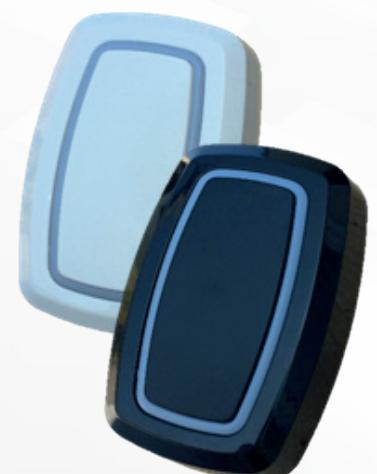
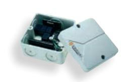
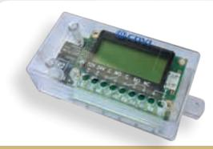
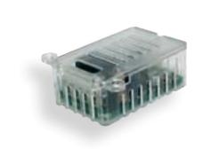
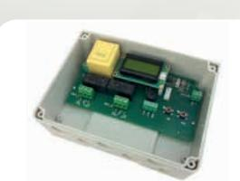

# RADIOSÄNDARE MED TOUCHFUNKTION

The installer's choice cdvi.se

## TRÅDLÖS SÄNDARE MED TOUCHFUNKTION

## **RTA1TW/TB**

- *Trådlös öppnarknapp med touchfunktion och ljusindikering Kan monteras utomhus Räckvidd upp till 400m*

### *PASSAR RADIOMOTTAGARE **

#### **RRA85-Z1/Z2/Z4 XPL100-2 RRA85-1NN XPL500-2PV /4PV**

MINI MOTTAGARE 1, 2 ELLER 4 RELÄ «ON/OFF» OCH PULS

- *Frekvens: 433,92 MHz 1, 2 eller 4 relä, 24VA/24W*
- Kryptering: Rolling code Keeloq®
- Strömförsörjning: 12/24 VAC/DC

STANDARD MOTTAGARE «ON/OFF», PULS OCH TIDSSTYRNING

- *Frekvens: 433,92 MHz Två relä, 24 VA/24W LCD-display för enkel*
Commercial Industrial

- *programmering* Kryptering: Rolling code
- Keeloq® Strömförsörjning: 12/24 VAC/DC

NANO MOTTAGARE FÖR DÖRRAUTOMATIKER, ENDAST PULS

- *Frekvens: 433,92 MHz Ett relä, 24 VA/24W*
- Kryptering: Rolling code Keeloq®
- Strömförsörjning: 12/24 VAC/DC

Public Buildnings

Multi-tenant Residential occupancy

MULTI USER MOTTAGARE XPL500-2PV / 4PV

- *2 eller 4 relä, 3,5kW/16A, 230V LCD display för enkel programmering*
- *ON/OFF, puls och tidsstyrning Batchinladdning för enklare hantering av*
- ** Se separat broschyr med trådlösa produkter för hela sortimentet*

**CDVI** Sweden AB Datavägen 12B 43632 ASKIM (GÖTEBORG)

Tel: +46 (0)31 760 19 30

*cdvigroup.com cdvi.se*

 *sändare*