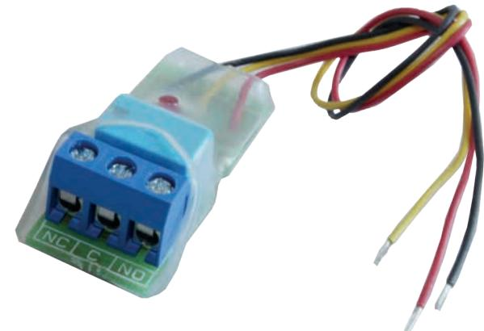
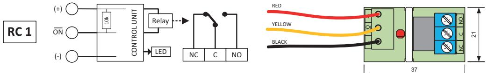

## **RC 1 RELÄKORT**

## **Fördelar**

- Universellt litet reläkort
- Växlande (NC/NO) reläfunktion
- Inkoppling med skruvplint
- Aktivt relä indikeras med lysdiod
- Fästkuddar för enkel montering

10k

(-) S1

(+) ON

(+) ON

(+) ON

**RC 2**

**RC 3**

**RC 4**

Relay

CONTROL UNIT

AC AC

LED

NC C NO

AC AC NC2 C2 NO2

- ON + NC1 C1 NO1

43

RC3 C1 NC1 NO1 C2 NC2 NO2

21

29

29

RC 1 är ett väldigt litet och universellt reläkort med växlande (NC/NO) reläfunktion. Inkoppling av reläet sker via skruvplint med trådskydd. Styrsignal och matning ansluts via 15 cm kabel. Reläet styrs via en transistor vilket gör att en mycket låg styrsignal krävs (1 mA). När reläet är aktiverat indikeras det på lysdiod. På enhetens baksida finns en självhäftande kudde vilket förenklar monteringen.

| 10k Relay                         | + ON                                                 |
|--------------------------------------|---------------------------------------------------------|
| CONTROL UNIT S1 LED NC C | - Reläutgång  NC/NO NO S1                      |
|                                      | Matningsspänning 9 – 30 VDC 37                       |
|                                      | Strömförbrukning  16 mA vid 12 VDC / 20 mA vid 30 VDC   |
|                                      | Kontaktdata 1 A / 30 V - NO +                  |
| CONTROL UNIT Relay                | Anslutning Kabel/Skruvplint                             |
|                                      | S1 Arbetstemperatur –40 – +50°C                      |
| S1 LED C1 NC1               | Mått (LxBxH) mm 37 x 21 x 13 NO1 C2 NC2 NO2 |
|                                      |                                                         |

C1 NC1 NO1 C2 NC2 NO2

## **Beställningsinformation**

| Typ  | E-nr    | 48 Beskrivning | Paket |
|------|---------|-------------------|-------|
| RC 1 | 6332877 | Reläkort 9 – 30 V | 1 st  |