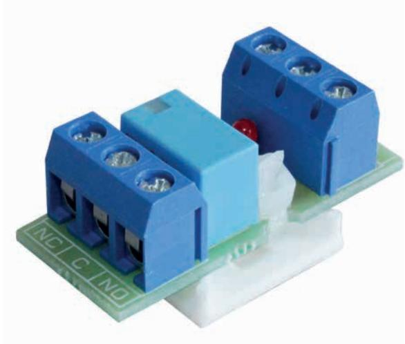
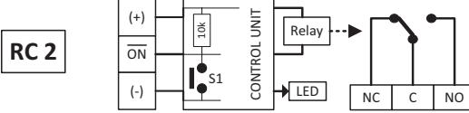
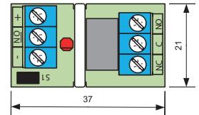

## **RC 2 RELÄKORT**

## **Fördelar**

- Universellt litet reläkort
- Växlande (NC/NO) reläfunktion
- Inkoppling med skruvplint
- Aktivt relä indikeras med lysdiod.
- Fästkuddar för enkel montering

(-)

RC 2 är ett väldigt litet och universellt reläkort med växlande (NC/NO) reläfunktion. Inkoppling sker via skruvplint med trådskydd. Reläet styrs via en transistor vilket gör att en mycket låg styrsignal krävs (1 mA). När reläet är aktiverat indikeras det på lysdiod. NC C NO + - ON 21 RED YELLOW BLACK 10k Relay LED CONTROL UNIT (+) ON **RC 1**

NC C NO

Relay

CONTROL UNIT

LED

10k

(-) S1

(+) ON

**RC 3**

**RC 4**

43

AC AC NC2 C2 NO2

- ON + NC1 C1 NO1

48

RC3 C1 NC1 NO1 C2 NC2 NO2

- NO +

S1

29

29

37

| Reläutgång  NC/NO                                                                     |
|---------------------------------------------------------------------------------------|
| Matningsspänning 9 – 30 VDC (+)                                                    |
| CONTROL UNIT 10k Relay Strömförbrukning  16 mA vid 12 VDC / 20 mA vid 30 VDC |
| ON Kontaktdata  1 A / 30 V S1                                                   |
| (-) LED Anslutning Skruvplint C1 NC1 NO1 C2 NC2 NO2           |
| Arbetstemperatur  –20 – +50°C                                                         |
| AC AC Mått (L x B x H) mm 37 x 21 x 13                                          |
|                                                                                       |

C1 NC1 NO1 C2 NC2 NO2

| Beställningsinformation |  |  |
|-------------------------|--|--|
|                         |  |  |

| Typ  | E-nr    | Beskrivning       | Paket |
|------|---------|-------------------|-------|
| RC 2 | 6332878 | Reläkort 9 – 30 V | 1 st  |