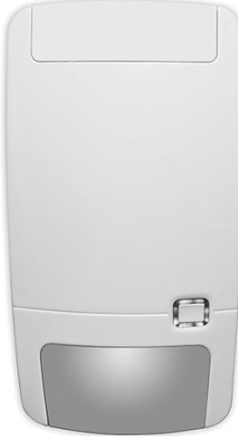
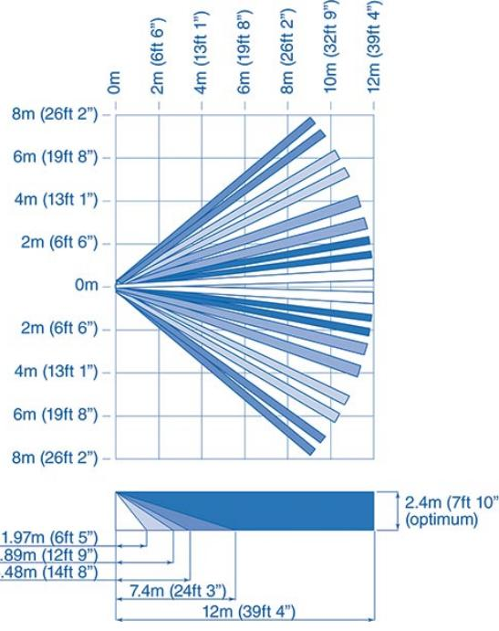

## RF4012I4PI

Produktblad

Wireless PIR 12m PI 433-63

#### One way transmitter

The sensor has a chip tuned wireless transmitter that communicates with any 433-63 bit legacy receiver. The learn-in process of the sensor is identical to the process used with legacy sensors.

Each sensor reports a unique ID code with each transmission. The sensor also reports the battery and transmitter condition (supervisory signal) to the panel every 18 minutes.

#### Mirror power

The patented optical mirror technology gives the advantage of gliding focus, which creates a volumetric detection curtain from floor level up to installation height resulting in a sensor that never loses track of the object. The PI optical mirror is specially designed to ignore pets moving around on the floor without compromising detection performance for humans In these series we are using a dual element digital pyro generating 2 volumetric curtains for each of the 9 curtain sets.

#### 5D signal processing

The unique 5D signal processing technology will look for a match in shape, size, speed, duration and environment to decide on an alarm condition. The result is a unique combination of high detection sensitivity with high false alarm immunity.

#### Ease and flexibility of installation

1.Easy opening and closing system. 2.Easy access when changing the batteries.

- 3.Easy access to the mirror optics.
4.Tolerates wall angle deviation and different mounting heights. 5.Limited loss of coverage when objects are placed in the field of the PIR vision.

- 6. One mounting plate for all sensors in the series.
#### Other members of the family

This family includes motion sensors with variants in detection ranges and a Pet Immune variant. The consistent family aesthetics between the various models ensure a professional approach when installing different sensor types.

#### Standardprestanda

- EProven mirror optics inside to get a dense coverage pattern
- ESelectable coverage pattern using mirror masks
- EFull under crawl detection
- E''5D'' signal processing for false alarm immunity
- EAuto focus with constant range sensitivity
- E No adjustment required for different mounting heights
- ETolerates wall angle deviation
- EEnd-user friendly product design for exchanging batteries
- E 5-years battery life with 1 battery
- EPetImmune functionality

# RF4012I4PI

Wireless PIR 12m PI 433-63

### Tekniska data

| Detection technology                         | PIR (9 curtains, 86° viewing angle), PetImmune |
|----------------------------------------------|------------------------------------------------|
| Detection modes                              | standard 3D or bi-curtain                      |
| Target speed range                           | 0.3 m/s to 3 m/s                               |
| Detectable range                             | 6 or 12 m                                      |
| Mounting height                              | 2.3 m to 3.0 m                                 |
| Operating frequency                          | 433.92 MHz                                     |
| Protocol                                     | 433-63 bit                                     |
| Power output                                 | < 10 dBm                                       |
| RF range (open air / obstructed), typical | 300 m / 40 m                                   |
| Detector start-up time                       | 1 min                                          |
| Supervisory interval                         | 18 min                                         |
| Lockout timer                                | 3 min                                          |
| Battery type                                 | 1 x CR123 (3.0 V, 1300 mAh lithium)            |
| Battery life (typical with 1 battery)     | 5 years                                        |
| Current consumption                          | 22 µA (avg.), 50 mA (max.)                     |
| Operating temperature                        | -10° to +55° C                                 |
| Relative humidity                            | 95% max. noncondensing                         |
| IP/IK rating                                 | IP 30 IK02                                     |
| Dimensions (LxWxH)                           | 130 x 69 x 53 mm                               |
| Weight (incl. 1 battery)                     | 146 g                                          |

#### Order data

Artikelnummer

 RF4012I4PI Wireless PIR 12m PI 433-63

Beskrivning

Reservationer för produktförändringar. För uppdatering av produktdata, gå in på www. utcfssecurityproducts.se eller kontakta din lokala UTC Fire & Security återförsäljare. RF4012I4PI-2017-07-28 00:27:48 Released :29-JUN-17