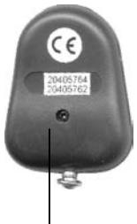
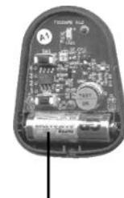
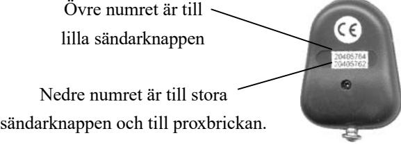

# **Teknisk Information**

## **Radionyckel RN-2A/B/P**

## **Räckvidd**

- 1. För att erhålla största möjliga räckvidd skall man beakta följande:
- 2. Rikta sändaren mot mottagaren.
- 3. Se till att inga hinder finns mellan sändaren och mottagaren.
- 4. Håll sändaren så högt som möjligt.
- 5. Tryck minst 1-2 sek. på sändarknappen.

Räckvidden kan variera beroende på regn, snö, dimma eller andra störningar.

#### **Funktionsstörningar**

- 1. Kontrollera att rätt sändarmodell används.
- 2. Kontrollera att batteriet är rätt isatt.
- 3. Kontrollera batterispänningen.

### **Batteribyte**

Krysspårsskruv 12V Alkaliskt batteri (typ 23A / MN21 el. likn.)

- 1. Öppna sändaren med skruven enligt bilden ovan.
- 2. Lyft ut batteriet.
- 3. Sätt i nytt batteri och se till **+** hamnar på **+**.

#### **Knapp- och Proxnummer (endast P-modellen)**

