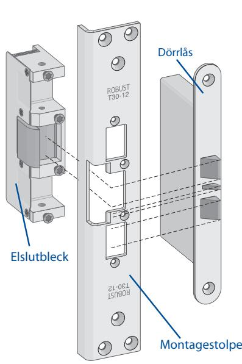
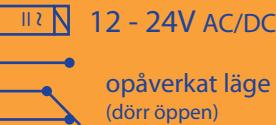
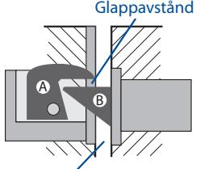
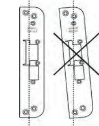

## Elslutbleck serie 200.

| Tekniska data: | Typ: 280 - Normal funktion (rättvänd, öppnar med spänning) utan kolvkontakt.              |
|----------------|-------------------------------------------------------------------------------------------|
|                | Typ: 290 - Normal funktion (rättvänd, öppnar med spänning) med kolvkontakt.               |
|                | Typ: 281 - Omvänd funktion (omvänd, låser med spänning) utan kolvkontakt.                 |
|                | Typ: 291 - Omvänd funktion (omvänd, låser med spänning) med kolvkontakt.                  |
|                | Multispänning 12-24V AC/DC, max +/- 10% avvikelse från märkspänning.                      |
|                | Polfri anslutning med inbyggt transientskydd, skyddsdiod behöver inte kopplas in.         |
|                | Brythållfastheten för tryck på vridfallet är 1 200 kg (12 000 N).                         |
|                | För enkelfallås eller dubbelfallås med eller utan förregling, även för lås med regelkolv. |
|                | Uppfyller BoVerkets byggregler för branddklassade dörrar tillsammans med dubbelfallås.    |
|                | Passar ROBUST montagstolpar serie T-.                                                     |
|                |                                                                                           |

## Monteringsbeskrivning:

För att gälla som dörrigenhållande beslag för branddörr måste dubbelfallås användas. Tryckeskolven måste sticka in minst 7 mm i stolpen (EI30).

# { gäller med kolvkontakt

Kopplingsschema: Polfri anslutning, polaritetskyddat. Multispänning 12-24 V lik- eller växelspänning. Max 10% +/- avvikelse från märkspänning.

Underhåll: Använd medföljande skruvar (gänglås-behandlade) för fastsättning av montagestolpen. Gänglåsning av skruvarna för montering av montagestolpen i metallkarm bör användas. Låskolv, vridfall och ev. glidplös på montagestolpen bör smörjas med låsfett 1-2 ggr per år. Någon smörjning inne i elslutblecket behövs inte. Funktionskontroll av elslutbleck, låshus, dörrstängare m.m. skall göras 1-2 ggr per år. Kontroll av fastsättning av elslutbleck & montagestolpe i karm bör göras 1-2 ggr per år.

Dörrspringa

Glappet mellan vridfall (A) och låskolv (B) skall vara 0,5-1,5 mm. Låskolven får inte spänna mot vridfallet.

Dörrspringan skall vara 2-5 mm.

Montera så att montagestolpen är monterad i lod och är ordentligt fastsatt i dörrkarmen. Rätt val av montagestolpe är avgörande för en bra funktion.

Låskolv, vridfall och glidplös är de enda delar som behöver smörjas (sparsamt) med låsfett. Borr-, fil- och slipspån är skadligt för elslutbleck. Elslutblecket är inte vattentätt.

Justera vridfallet så det stoppar ovanför kanten på montagestolpens glidplös. Låskolven skall lämna vridfallet för att falla ner på montagestolpens glidplös.

Montagestolpens glidplös

Elslutbleckets vridfall